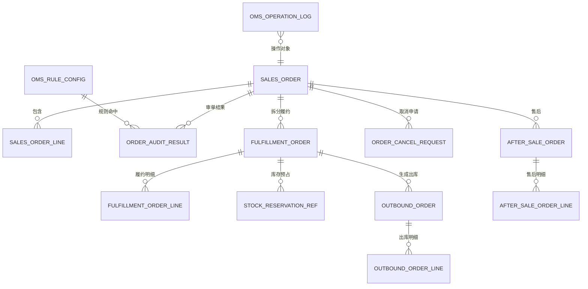
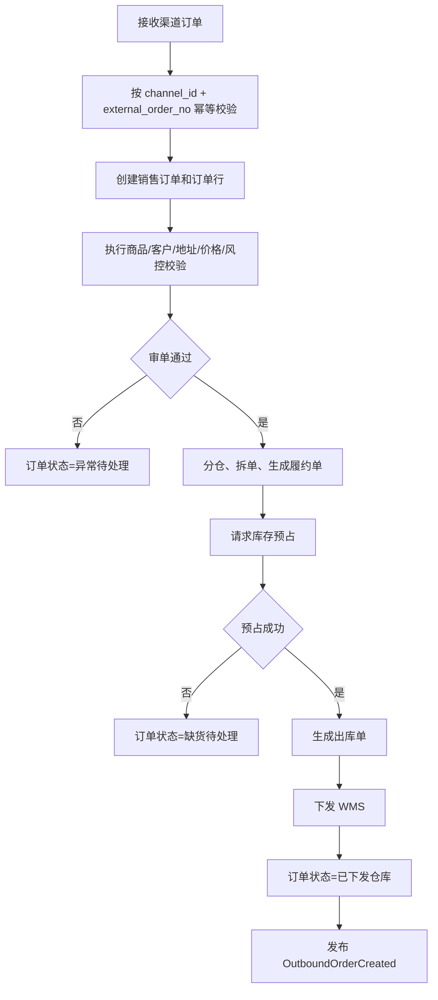
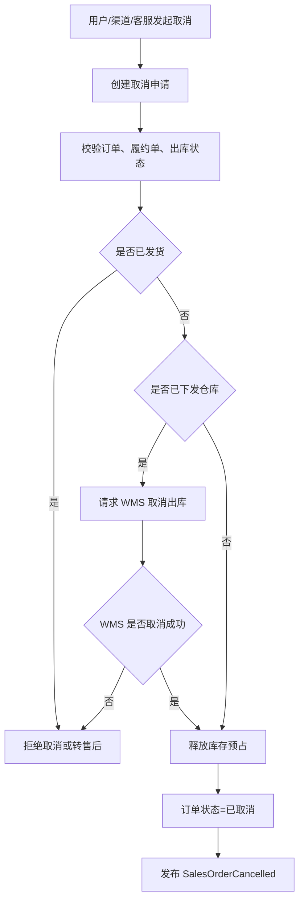
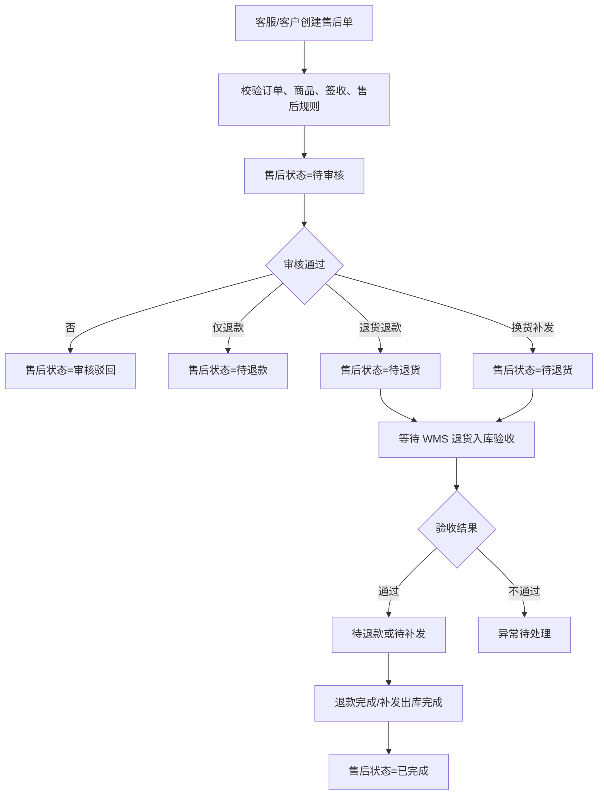
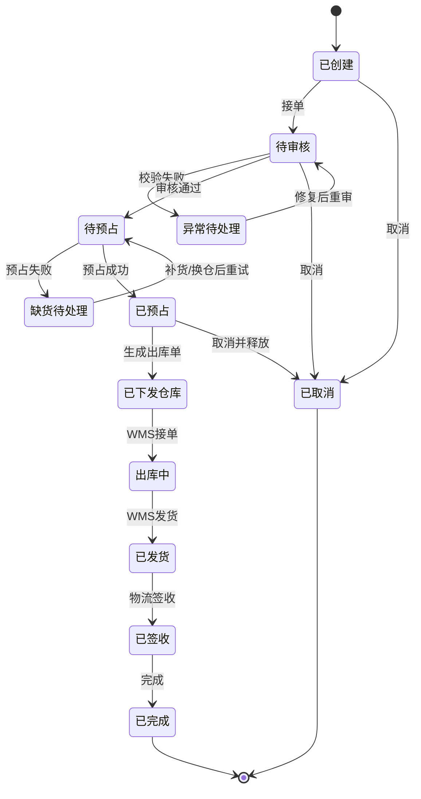
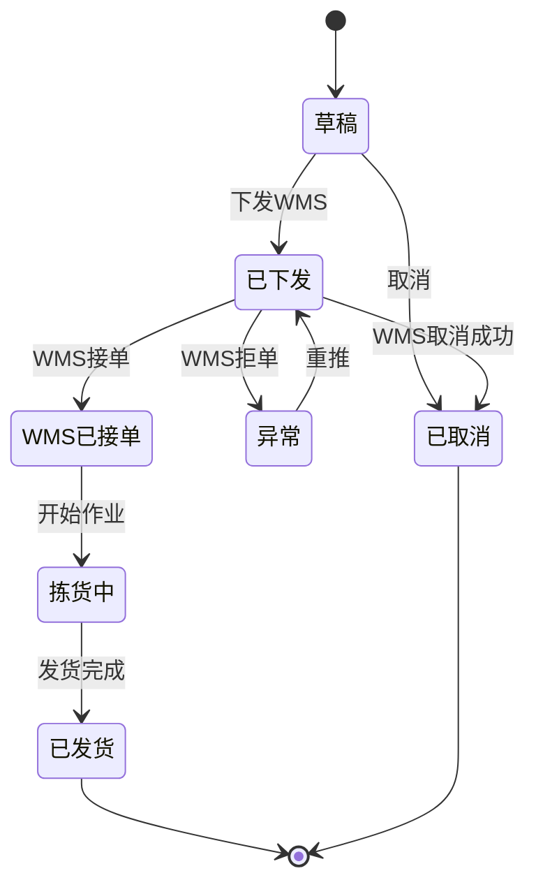
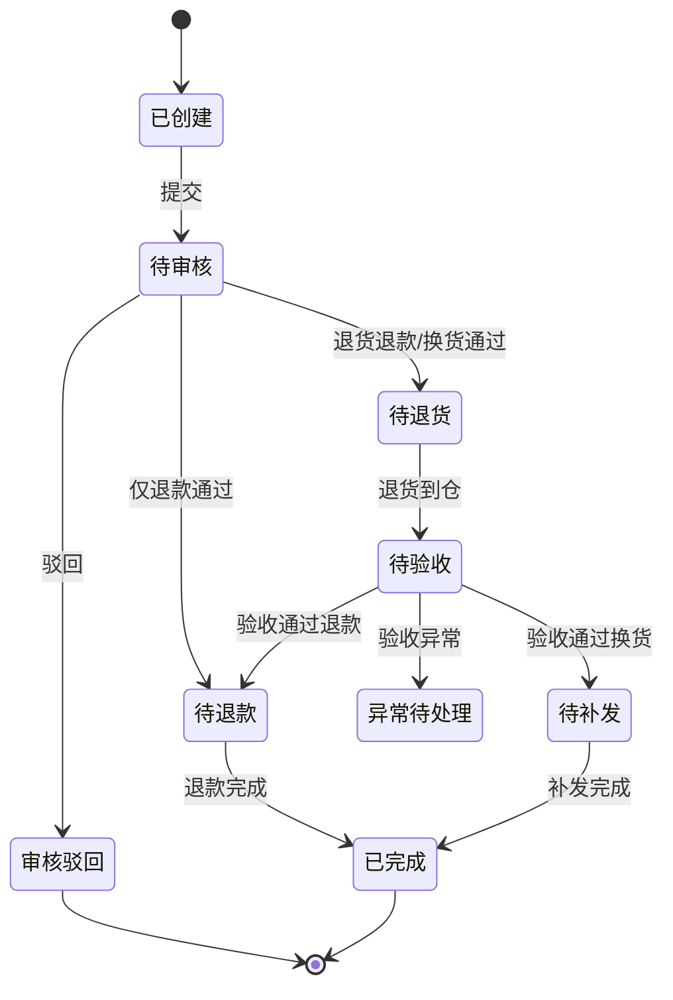

# 42 OMS 系统详细设计

> 本文承接 [OMS 系统功能设计](./32-OMS系统功能设计.md)，按 [权限系统详细设计](../权限系统/38-权限系统详细设计.md) 的模式细化订单接入、审单、分仓、库存预占、履约单、出库指令、取消、售后、异常处理、规则配置、权限点、枚举、事件和操作日志。当前版本是系统设计级字段模型，不是最终数据库 DDL。

## 1. 设计目标

OMS 要统一回答五个问题：

| 问题 | 设计对象 |
| --- | --- |
| 订单从哪里来 | 渠道订单、外部订单号、接入任务、订单幂等 |
| 订单是否可以履约 | 商品、客户、地址、金额、风控、信用、库存校验 |
| 从哪里发、怎么发 | 分仓结果、履约单、承诺时效、物流产品 |
| 如何驱动仓库出库 | 库存预占、出库单、出库状态、取消拦截 |
| 逆向如何处理 | 取消单、售后单、退款、退货、换货补发 |

核心原则：

| 原则 | 说明 |
| --- | --- |
| OMS 是履约编排系统 | 负责订单状态、履约计划和出库指令，不负责仓内作业 |
| 库存通过接口和事件协同 | OMS 请求预占、释放、扣减，不直接改库存余额 |
| 出库单不可重复生成 | 同一有效履约单只能生成一个有效出库指令 |
| 已发货不可直接取消 | 已发货订单转售后，不能走普通取消释放库存 |
| 单头状态由履约事实汇总 | 销售订单状态由订单行、履约单、出库单和售后结果汇总 |

## 2. 总体模型

## 3. 功能页面

| 页面 | 主要用途 | 展示字段 | 主要操作 |
| --- | --- | --- | --- |
| OMS 工作台 | 展示待审、缺货、待下发、出库异常、售后待办 | 待审核、缺货、待发仓、出库异常、售后待审 | 查看待办、进入处理 |
| 渠道订单接入页 | 查看渠道订单同步和幂等结果 | 渠道、外部单号、接入状态、失败原因、时间 | 重试、忽略、手工创建 |
| 销售订单页 | 管理内部销售订单主数据 | 订单号、客户、渠道、金额、状态、履约状态 | 新增、编辑、审核、取消、重审 |
| 订单审单页 | 处理商品、价格、地址、风控等校验异常 | 订单号、异常类型、命中规则、处理状态 | 通过、驳回、修正、重审 |
| 分仓履约页 | 查看和调整分仓、拆单、承诺时效 | 订单号、仓库、履约单、承诺发货时间、状态 | 分仓、换仓、拆单、合单 |
| 库存预占页 | 查看预占请求和结果 | 订单号、SKU、仓库、预占数量、预占号、状态 | 重试预占、释放预占 |
| 出库单页 | 管理下发 WMS 的出库指令 | 出库单号、仓库、订单号、状态、发货数量 | 创建、下发、取消、重推 |
| 取消管理页 | 处理用户、客服或渠道取消请求 | 取消单号、订单号、原因、可取消结果、状态 | 审核、同意、拒绝、转售后 |
| 售后管理页 | 处理仅退款、退货退款、换货补发 | 售后单号、订单号、类型、退款金额、状态 | 创建、审核、驳回、关闭 |
| 异常处理页 | 集中处理缺货、地址不可达、风控、仓库拒单 | 异常单号、订单号、类型、责任方、状态 | 分派、处理、关闭、重试 |
| 规则配置页 | 配置审单、分仓、取消、售后规则 | 规则编码、规则类型、优先级、状态 | 新增、编辑、启用、停用、发布 |
| 操作日志页 | 查询 OMS 关键写操作 | 操作人、对象、动作、时间、结果 | 查询、导出 |
| 枚举配置页 | 维护 OMS 页面枚举项 | 枚举类型、枚举值、标签、状态 | 新增、编辑、排序、停用 |

## 4. 核心流程

### 4.1 销售订单履约流程

### 4.2 订单取消流程

### 4.3 售后处理流程

## 5. 字段模型

### 5.1 销售订单 `sales_order`

| 字段 | 类型 | 是否必填 | 枚举/约束 | 说明 |
| --- | --- | --- | --- | --- |
| `sales_order_id` | bigint | 是 | 主键 | 销售订单 ID |
| `sales_order_no` | varchar(64) | 是 | 唯一 | 内部销售订单号 |
| `channel_id` | bigint | 是 | 外键 | 渠道 ID |
| `external_order_no` | varchar(128) | 是 | 幂等组合 | 外部订单号 |
| `customer_id` | bigint | 是 | 外键 | 客户 ID |
| `customer_name` | varchar(256) | 否 | 快照 | 客户名称 |
| `owner_id` | bigint | 否 | 外键 | 货主 ID |
| `order_type` | varchar(32) | 是 | `SALES_ORDER_TYPE` | 普通、预售、换货补发、手工 |
| `pay_status` | varchar(32) | 是 | `PAY_STATUS` | 未支付、已支付、部分退款、已退款 |
| `audit_status` | varchar(32) | 是 | `ORDER_AUDIT_STATUS` | 待审核、通过、异常、驳回 |
| `order_status` | varchar(32) | 是 | `SALES_ORDER_STATUS` | 已创建、待审核、异常待处理、待预占、缺货待处理、已预占、已下发仓库、出库中、已发货、已签收、已完成、已取消 |
| `fulfillment_status` | varchar(32) | 是 | `FULFILLMENT_STATUS` | 未履约、部分履约、履约中、已履约、履约失败 |
| `total_amount` | decimal(18,2) | 是 | >= 0 | 订单总额 |
| `discount_amount` | decimal(18,2) | 是 | >= 0 | 优惠金额 |
| `pay_amount` | decimal(18,2) | 是 | >= 0 | 实付金额 |
| `receiver_name` | varchar(128) | 是 |  | 收货人 |
| `receiver_mobile` | varchar(32) | 是 |  | 收货电话 |
| `receiver_address` | varchar(512) | 是 |  | 收货地址 |
| `created_at` | datetime | 是 |  | 创建时间 |
| `paid_at` | datetime | 否 |  | 支付时间 |
| `updated_at` | datetime | 否 |  | 更新时间 |

对应页面：`销售订单页`

展示字段：订单号、渠道、外部单号、客户、金额、支付状态、审单状态、订单状态、履约状态。

### 5.2 销售订单行 `sales_order_line`

| 字段 | 类型 | 是否必填 | 枚举/约束 | 说明 |
| --- | --- | --- | --- | --- |
| `sales_order_line_id` | bigint | 是 | 主键 | 订单行 ID |
| `sales_order_id` | bigint | 是 | 外键 | 销售订单 ID |
| `sku_id` | bigint | 是 | 外键 | SKU ID |
| `sku_code` | varchar(64) | 是 | 快照 | SKU 编码 |
| `sku_name` | varchar(256) | 是 | 快照 | SKU 名称 |
| `order_qty` | decimal(18,4) | 是 | > 0 | 下单数量 |
| `reserved_qty` | decimal(18,4) | 是 | 默认 0 | 已预占数量 |
| `outbound_qty` | decimal(18,4) | 是 | 默认 0 | 已下发出库数量 |
| `shipped_qty` | decimal(18,4) | 是 | 默认 0 | 已发货数量 |
| `returned_qty` | decimal(18,4) | 是 | 默认 0 | 已退货数量 |
| `unit_price` | decimal(18,6) | 是 | >= 0 | 商品单价 |
| `line_amount` | decimal(18,2) | 是 | >= 0 | 行金额 |
| `line_status` | varchar(32) | 是 | `SALES_ORDER_LINE_STATUS` | 待审核、待预占、已预占、出库中、已发货、已完成、已取消 |

### 5.3 订单审单结果 `order_audit_result`

| 字段 | 类型 | 是否必填 | 枚举/约束 | 说明 |
| --- | --- | --- | --- | --- |
| `audit_result_id` | bigint | 是 | 主键 | 审单结果 ID |
| `sales_order_id` | bigint | 是 | 外键 | 销售订单 ID |
| `rule_id` | bigint | 否 | 外键 | 命中规则 |
| `audit_type` | varchar(32) | 是 | `AUDIT_TYPE` | 商品、客户、地址、价格、风控、信用 |
| `audit_result` | varchar(32) | 是 | `AUDIT_RESULT` | 通过、拦截、警告 |
| `exception_reason` | varchar(512) | 否 |  | 异常原因 |
| `processed_status` | varchar(32) | 是 | `AUDIT_PROCESS_STATUS` | 待处理、已放行、已驳回、已修正 |
| `processed_by` | bigint | 否 |  | 处理人 |
| `processed_at` | datetime | 否 |  | 处理时间 |

对应页面：`订单审单页`

展示字段：订单号、审单类型、审单结果、异常原因、处理状态、处理人、处理时间。

### 5.4 履约单 `fulfillment_order`

| 字段 | 类型 | 是否必填 | 枚举/约束 | 说明 |
| --- | --- | --- | --- | --- |
| `fulfillment_order_id` | bigint | 是 | 主键 | 履约单 ID |
| `fulfillment_order_no` | varchar(64) | 是 | 唯一 | 履约单号 |
| `sales_order_id` | bigint | 是 | 外键 | 销售订单 ID |
| `warehouse_id` | bigint | 是 | 外键 | 发货仓 |
| `carrier_id` | bigint | 否 | 外键 | 物流商 |
| `logistics_product_code` | varchar(64) | 否 |  | 物流产品 |
| `promise_ship_at` | datetime | 否 |  | 承诺发货时间 |
| `promise_arrive_at` | datetime | 否 |  | 承诺送达时间 |
| `fulfillment_status` | varchar(32) | 是 | `FULFILLMENT_ORDER_STATUS` | 待预占、已预占、待出库、已下发、出库中、已发货、已取消、失败 |
| `split_reason` | varchar(512) | 否 |  | 拆单原因 |
| `created_at` | datetime | 是 |  | 创建时间 |
| `updated_at` | datetime | 否 |  | 更新时间 |

对应页面：`分仓履约页`

展示字段：履约单号、销售订单号、发货仓、物流商、承诺发货时间、承诺送达时间、履约状态。

### 5.5 履约单行 `fulfillment_order_line`

| 字段 | 类型 | 是否必填 | 枚举/约束 | 说明 |
| --- | --- | --- | --- | --- |
| `fulfillment_line_id` | bigint | 是 | 主键 | 履约行 ID |
| `fulfillment_order_id` | bigint | 是 | 外键 | 履约单 ID |
| `sales_order_line_id` | bigint | 是 | 外键 | 销售订单行 ID |
| `sku_id` | bigint | 是 | 外键 | SKU ID |
| `fulfillment_qty` | decimal(18,4) | 是 | > 0 | 履约数量 |
| `reserved_qty` | decimal(18,4) | 是 | 默认 0 | 预占数量 |
| `shipped_qty` | decimal(18,4) | 是 | 默认 0 | 发货数量 |
| `line_status` | varchar(32) | 是 | `FULFILLMENT_LINE_STATUS` | 待预占、已预占、待出库、出库中、已发货、已取消 |

### 5.6 库存预占引用 `stock_reservation_ref`

| 字段 | 类型 | 是否必填 | 枚举/约束 | 说明 |
| --- | --- | --- | --- | --- |
| `reservation_ref_id` | bigint | 是 | 主键 | 引用 ID |
| `sales_order_id` | bigint | 是 | 外键 | 销售订单 ID |
| `fulfillment_order_id` | bigint | 是 | 外键 | 履约单 ID |
| `reservation_no` | varchar(64) | 否 | 唯一可空 | 中央库存预占号 |
| `warehouse_id` | bigint | 是 | 外键 | 仓库 ID |
| `sku_id` | bigint | 是 | 外键 | SKU ID |
| `reserve_qty` | decimal(18,4) | 是 | > 0 | 请求预占数量 |
| `reserved_qty` | decimal(18,4) | 是 | 默认 0 | 实际预占数量 |
| `reservation_status` | varchar(32) | 是 | `RESERVATION_STATUS` | 待预占、预占成功、预占失败、已释放、已扣减 |
| `fail_reason` | varchar(512) | 否 |  | 失败原因 |
| `source_request_id` | varchar(128) | 是 | 幂等 | 请求幂等号 |
| `created_at` | datetime | 是 |  | 创建时间 |

对应页面：`库存预占页`

展示字段：订单号、履约单号、仓库、SKU、请求数量、预占数量、预占号、状态、失败原因。

### 5.7 出库单 `outbound_order`

| 字段 | 类型 | 是否必填 | 枚举/约束 | 说明 |
| --- | --- | --- | --- | --- |
| `outbound_order_id` | bigint | 是 | 主键 | 出库单 ID |
| `outbound_order_no` | varchar(64) | 是 | 唯一 | OMS 出库单号 |
| `sales_order_id` | bigint | 是 | 外键 | 销售订单 ID |
| `fulfillment_order_id` | bigint | 是 | 外键 | 履约单 ID |
| `warehouse_id` | bigint | 是 | 外键 | 发货仓 |
| `outbound_type` | varchar(32) | 是 | `OUTBOUND_TYPE` | 销售出库、换货补发、手工补发 |
| `wms_order_no` | varchar(64) | 否 |  | WMS 出库单号 |
| `outbound_status` | varchar(32) | 是 | `OUTBOUND_STATUS` | 草稿、已下发、WMS已接单、拣货中、已发货、已取消、异常 |
| `released_at` | datetime | 否 |  | 下发时间 |
| `shipped_at` | datetime | 否 |  | 发货时间 |
| `cancel_reason` | varchar(512) | 否 |  | 取消原因 |
| `created_at` | datetime | 是 |  | 创建时间 |

对应页面：`出库单页`

展示字段：出库单号、销售订单号、履约单号、仓库、WMS 单号、出库类型、状态、下发时间、发货时间。

### 5.8 出库单行 `outbound_order_line`

| 字段 | 类型 | 是否必填 | 枚举/约束 | 说明 |
| --- | --- | --- | --- | --- |
| `outbound_line_id` | bigint | 是 | 主键 | 出库行 ID |
| `outbound_order_id` | bigint | 是 | 外键 | 出库单 ID |
| `sales_order_line_id` | bigint | 是 | 外键 | 销售订单行 ID |
| `sku_id` | bigint | 是 | 外键 | SKU ID |
| `planned_qty` | decimal(18,4) | 是 | > 0 | 计划出库数量 |
| `shipped_qty` | decimal(18,4) | 是 | 默认 0 | 实际发货数量 |
| `line_status` | varchar(32) | 是 | `OUTBOUND_LINE_STATUS` | 待下发、已下发、拣货中、已发货、已取消 |

### 5.9 取消申请 `order_cancel_request`

| 字段 | 类型 | 是否必填 | 枚举/约束 | 说明 |
| --- | --- | --- | --- | --- |
| `cancel_request_id` | bigint | 是 | 主键 | 取消申请 ID |
| `cancel_request_no` | varchar(64) | 是 | 唯一 | 取消申请号 |
| `sales_order_id` | bigint | 是 | 外键 | 销售订单 ID |
| `cancel_source` | varchar(32) | 是 | `CANCEL_SOURCE` | 客户、客服、渠道、系统 |
| `cancel_reason` | varchar(64) | 是 | `CANCEL_REASON` | 不想要、地址错误、缺货、风控、其他 |
| `cancel_status` | varchar(32) | 是 | `CANCEL_STATUS` | 待审核、已同意、已拒绝、取消中、已完成、转售后 |
| `wms_cancel_status` | varchar(32) | 否 | `WMS_CANCEL_STATUS` | 未请求、请求中、成功、失败 |
| `stock_release_status` | varchar(32) | 否 | `STOCK_RELEASE_STATUS` | 未释放、释放中、已释放、释放失败 |
| `created_by` | bigint | 是 |  | 创建人 |
| `created_at` | datetime | 是 |  | 创建时间 |
| `processed_at` | datetime | 否 |  | 处理时间 |

对应页面：`取消管理页`

展示字段：取消申请号、订单号、来源、原因、取消状态、WMS 取消状态、库存释放状态、创建时间。

### 5.10 售后单 `after_sale_order`

| 字段 | 类型 | 是否必填 | 枚举/约束 | 说明 |
| --- | --- | --- | --- | --- |
| `after_sale_id` | bigint | 是 | 主键 | 售后单 ID |
| `after_sale_no` | varchar(64) | 是 | 唯一 | 售后单号 |
| `sales_order_id` | bigint | 是 | 外键 | 销售订单 ID |
| `after_sale_type` | varchar(32) | 是 | `AFTER_SALE_TYPE` | 仅退款、退货退款、换货补发 |
| `after_sale_reason` | varchar(64) | 是 | `AFTER_SALE_REASON` | 质量问题、错发、少发、不想要、其他 |
| `refund_amount` | decimal(18,2) | 否 | >= 0 | 退款金额 |
| `return_warehouse_id` | bigint | 否 | 外键 | 退货仓 |
| `after_sale_status` | varchar(32) | 是 | `AFTER_SALE_STATUS` | 已创建、待审核、审核驳回、待退货、待验收、待退款、待补发、异常待处理、已完成、已关闭 |
| `created_by` | bigint | 是 |  | 创建人 |
| `created_at` | datetime | 是 |  | 创建时间 |
| `approved_at` | datetime | 否 |  | 审核时间 |
| `completed_at` | datetime | 否 |  | 完成时间 |

对应页面：`售后管理页`

展示字段：售后单号、销售订单号、售后类型、原因、退款金额、退货仓、状态、创建时间。

### 5.11 售后单行 `after_sale_order_line`

| 字段 | 类型 | 是否必填 | 枚举/约束 | 说明 |
| --- | --- | --- | --- | --- |
| `after_sale_line_id` | bigint | 是 | 主键 | 售后行 ID |
| `after_sale_id` | bigint | 是 | 外键 | 售后单 ID |
| `sales_order_line_id` | bigint | 是 | 外键 | 原订单行 ID |
| `sku_id` | bigint | 是 | 外键 | SKU ID |
| `apply_qty` | decimal(18,4) | 是 | > 0 | 申请数量 |
| `received_qty` | decimal(18,4) | 否 | >= 0 | 退货入库数量 |
| `accepted_qty` | decimal(18,4) | 否 | >= 0 | 验收通过数量 |
| `reship_qty` | decimal(18,4) | 否 | >= 0 | 补发数量 |
| `line_status` | varchar(32) | 是 | `AFTER_SALE_LINE_STATUS` | 待审核、待退货、待验收、待退款、待补发、已完成 |

### 5.12 OMS 规则配置 `oms_rule_config`

| 字段 | 类型 | 是否必填 | 枚举/约束 | 说明 |
| --- | --- | --- | --- | --- |
| `rule_id` | bigint | 是 | 主键 | 规则 ID |
| `rule_code` | varchar(64) | 是 | 唯一 | 规则编码 |
| `rule_name` | varchar(128) | 是 |  | 规则名称 |
| `rule_type` | varchar(32) | 是 | `OMS_RULE_TYPE` | 审单、分仓、取消、售后、承运商 |
| `priority` | int | 是 | >= 0 | 优先级 |
| `condition_config` | text | 是 | JSON | 条件配置 |
| `action_config` | text | 是 | JSON | 动作配置 |
| `status` | varchar(32) | 是 | `COMMON_STATUS` | 启用、停用 |
| `effective_from` | datetime | 否 |  | 生效时间 |
| `effective_to` | datetime | 否 |  | 失效时间 |

对应页面：`规则配置页`

展示字段：规则编码、规则名称、规则类型、优先级、状态、生效时间、失效时间。

### 5.13 OMS 操作日志 `oms_operation_log`

| 字段 | 类型 | 是否必填 | 枚举/约束 | 说明 |
| --- | --- | --- | --- | --- |
| `log_id` | bigint | 是 | 主键 | 日志 ID |
| `operator_id` | bigint | 是 |  | 操作人 |
| `object_type` | varchar(64) | 是 | `OMS_OBJECT_TYPE` | 订单、履约单、出库单、取消单、售后单、规则 |
| `object_id` | bigint | 是 |  | 对象 ID |
| `action_type` | varchar(64) | 是 | `OMS_ACTION_TYPE` | 创建、审核、放行、取消、下发、重推、关闭 |
| `before_snapshot` | text | 否 | JSON | 变更前摘要 |
| `after_snapshot` | text | 否 | JSON | 变更后摘要 |
| `result` | varchar(32) | 是 | `OPERATION_RESULT` | 成功、失败 |
| `fail_reason` | varchar(512) | 否 |  | 失败原因 |
| `ip_address` | varchar(64) | 否 |  | IP |
| `created_at` | datetime | 是 |  | 操作时间 |

对应页面：`操作日志页`

展示字段：操作人、对象类型、对象 ID、动作、结果、失败原因、操作时间。

## 6. 枚举定义

| 枚举类型 | 枚举值 | 说明 |
| --- | --- | --- |
| `SALES_ORDER_TYPE` | `NORMAL`、`PRESALE`、`EXCHANGE_RESHIP`、`MANUAL` | 销售订单类型 |
| `PAY_STATUS` | `UNPAID`、`PAID`、`PART_REFUNDED`、`REFUNDED` | 支付状态 |
| `ORDER_AUDIT_STATUS` | `PENDING`、`PASSED`、`EXCEPTION`、`REJECTED` | 审单状态 |
| `SALES_ORDER_STATUS` | `CREATED`、`PENDING_AUDIT`、`EXCEPTION_PENDING`、`PENDING_RESERVE`、`OUT_OF_STOCK`、`RESERVED`、`RELEASED_TO_WMS`、`OUTBOUNDING`、`SHIPPED`、`SIGNED`、`COMPLETED`、`CANCELLED` | 销售订单状态 |
| `FULFILLMENT_STATUS` | `NONE`、`PARTIAL`、`PROCESSING`、`FULFILLED`、`FAILED` | 单头履约状态 |
| `SALES_ORDER_LINE_STATUS` | `PENDING_AUDIT`、`PENDING_RESERVE`、`RESERVED`、`OUTBOUNDING`、`SHIPPED`、`COMPLETED`、`CANCELLED` | 销售订单行状态 |
| `AUDIT_TYPE` | `SKU`、`CUSTOMER`、`ADDRESS`、`PRICE`、`RISK`、`CREDIT` | 审单类型 |
| `AUDIT_RESULT` | `PASSED`、`BLOCKED`、`WARNING` | 审单结果 |
| `AUDIT_PROCESS_STATUS` | `PENDING`、`RELEASED`、`REJECTED`、`FIXED` | 审单处理状态 |
| `FULFILLMENT_ORDER_STATUS` | `PENDING_RESERVE`、`RESERVED`、`PENDING_OUTBOUND`、`RELEASED`、`OUTBOUNDING`、`SHIPPED`、`CANCELLED`、`FAILED` | 履约单状态 |
| `RESERVATION_STATUS` | `PENDING`、`RESERVED`、`FAILED`、`RELEASED`、`DEDUCTED` | 库存预占状态 |
| `OUTBOUND_TYPE` | `SALES`、`EXCHANGE_RESHIP`、`MANUAL_RESHIP` | 出库类型 |
| `OUTBOUND_STATUS` | `DRAFT`、`RELEASED`、`ACCEPTED`、`PICKING`、`SHIPPED`、`CANCELLED`、`EXCEPTION` | 出库状态 |
| `CANCEL_SOURCE` | `CUSTOMER`、`CUSTOMER_SERVICE`、`CHANNEL`、`SYSTEM` | 取消来源 |
| `CANCEL_REASON` | `NO_LONGER_WANTED`、`ADDRESS_ERROR`、`OUT_OF_STOCK`、`RISK_BLOCKED`、`OTHER` | 取消原因 |
| `CANCEL_STATUS` | `PENDING`、`APPROVED`、`REJECTED`、`CANCELLING`、`COMPLETED`、`TRANSFERRED_AFTER_SALE` | 取消状态 |
| `AFTER_SALE_TYPE` | `REFUND_ONLY`、`RETURN_REFUND`、`EXCHANGE` | 售后类型 |
| `AFTER_SALE_STATUS` | `CREATED`、`PENDING_APPROVAL`、`REJECTED`、`PENDING_RETURN`、`PENDING_INSPECTION`、`PENDING_REFUND`、`PENDING_RESHIP`、`EXCEPTION_PENDING`、`COMPLETED`、`CLOSED` | 售后状态 |
| `OMS_RULE_TYPE` | `AUDIT`、`WAREHOUSE_ROUTING`、`CANCEL`、`AFTER_SALE`、`CARRIER` | 规则类型 |
| `COMMON_STATUS` | `ENABLED`、`DISABLED` | 通用状态 |

枚举配置建议：渠道、订单类型、取消原因、售后原因、异常类型可页面配置；订单状态、出库状态、售后状态属于状态机核心枚举，只建议配置中文标签、颜色和排序，不建议随意新增状态值。

## 7. 权限点设计

| 页面 | 路由建议 | 查询权限 | 操作权限 |
| --- | --- | --- | --- |
| OMS 工作台 | `/oms/workbench` | `oms:workbench:read` |  |
| 渠道订单接入页 | `/oms/channel-orders` | `oms:channel_order:read` | `oms:channel_order:retry`、`oms:channel_order:ignore`、`oms:channel_order:create_manual` |
| 销售订单页 | `/oms/sales-orders` | `oms:sales_order:read` | `oms:sales_order:create`、`oms:sales_order:update`、`oms:sales_order:audit`、`oms:sales_order:cancel`、`oms:sales_order:reaudit` |
| 订单审单页 | `/oms/audit-results` | `oms:audit:read` | `oms:audit:release`、`oms:audit:reject`、`oms:audit:fix`、`oms:audit:reaudit` |
| 分仓履约页 | `/oms/fulfillments` | `oms:fulfillment:read` | `oms:fulfillment:route`、`oms:fulfillment:change_warehouse`、`oms:fulfillment:split`、`oms:fulfillment:merge` |
| 库存预占页 | `/oms/reservations` | `oms:reservation:read` | `oms:reservation:retry`、`oms:reservation:release` |
| 出库单页 | `/oms/outbounds` | `oms:outbound:read` | `oms:outbound:create`、`oms:outbound:release`、`oms:outbound:cancel`、`oms:outbound:retry_push` |
| 取消管理页 | `/oms/cancel-requests` | `oms:cancel:read` | `oms:cancel:approve`、`oms:cancel:reject`、`oms:cancel:transfer_after_sale` |
| 售后管理页 | `/oms/after-sales` | `oms:after_sale:read` | `oms:after_sale:create`、`oms:after_sale:approve`、`oms:after_sale:reject`、`oms:after_sale:close` |
| 异常处理页 | `/oms/exceptions` | `oms:exception:read` | `oms:exception:assign`、`oms:exception:process`、`oms:exception:close`、`oms:exception:retry` |
| 规则配置页 | `/oms/rules` | `oms:rule:read` | `oms:rule:create`、`oms:rule:update`、`oms:rule:enable`、`oms:rule:disable`、`oms:rule:publish` |
| 操作日志页 | `/oms/operation-logs` | `oms:operation_log:read` | `oms:operation_log:export` |
| 枚举配置页 | `/oms/enums` | `oms:enum:read` | `oms:enum:create`、`oms:enum:update`、`oms:enum:disable` |

权限使用建议：

| 角色 | 数据范围 |
| --- | --- |
| 客服 | 可查看客户订单，处理地址修改、取消和售后，不默认允许改分仓规则 |
| 订单运营 | 可审单、分仓、重推、处理缺货和履约异常 |
| 渠道运营 | 可查看渠道订单接入状态和重试结果 |
| 仓配运营 | 可查看履约、出库、物流状态，处理仓配异常 |
| 财务/风控 | 可查看金额、支付、风险命中和退款状态 |
| 管理员 | 管理规则、枚举、日志，不默认具备售后退款审批权 |

## 8. 生产事件

| 事件 | 触发动作 | 关键载荷 |
| --- | --- | --- |
| `SalesOrderCreated` | 接收或手工创建订单 | `sales_order_id`、`channel_id`、`customer_id`、`lines` |
| `SalesOrderApproved` | 审单通过 | `sales_order_id`、`approved_at` |
| `SalesOrderAuditBlocked` | 审单拦截 | `sales_order_id`、`audit_type`、`reason` |
| `FulfillmentOrderCreated` | 分仓拆单完成 | `fulfillment_order_id`、`sales_order_id`、`warehouse_id`、`lines` |
| `StockReservationRequested` | 请求库存预占 | `sales_order_id`、`fulfillment_order_id`、`warehouse_id`、`lines` |
| `OutboundOrderCreated` | 生成出库单 | `outbound_order_id`、`sales_order_id`、`warehouse_id`、`lines` |
| `OutboundCancelRequested` | 请求取消出库 | `outbound_order_id`、`cancel_reason` |
| `StockReleaseRequested` | 请求释放预占 | `sales_order_id`、`reservation_no`、`reason` |
| `SalesOrderCancelled` | 订单取消完成 | `sales_order_id`、`cancel_reason` |
| `AfterSaleCreated` | 创建售后单 | `after_sale_id`、`sales_order_id`、`after_sale_type` |
| `ReturnInboundRequested` | 售后退货入库请求 | `after_sale_id`、`return_warehouse_id`、`lines` |
| `RefundRequested` | 触发退款 | `after_sale_id`、`refund_amount` |
| `ReshipmentRequested` | 换货补发 | `after_sale_id`、`sales_order_id`、`lines` |

## 9. 消费事件

| 事件 | 来源 | 消费后数据变化 |
| --- | --- | --- |
| `SkuEnabled` | 主数据系统 | 更新可销售 SKU 缓存，允许接单和售后 |
| `SkuDisabled` | 主数据系统 | 禁止新订单使用该 SKU，历史订单保留快照 |
| `CustomerEnabled` | 主数据系统 | 更新客户、地址、信用等缓存 |
| `WarehouseEnabled` | 主数据系统 | 更新可发货仓和退货仓 |
| `CarrierEnabled` | 主数据系统 | 更新可选物流商和物流产品 |
| `StockReserved` | 中央库存 | 预占状态改为成功，订单进入已预占，允许生成出库单 |
| `StockReserveFailed` | 中央库存 | 预占状态改为失败，订单进入缺货待处理 |
| `StockReleased` | 中央库存 | 取消或改仓释放完成，更新取消单释放状态 |
| `StockDeducted` | 中央库存 | 出库扣减完成，更新履约扣减结果 |
| `OutboundAccepted` | WMS | 出库单状态改为 WMS 已接单，订单状态=出库中 |
| `OutboundRejected` | WMS | 出库单状态=异常，生成出库异常待办 |
| `OutboundShipped` | WMS | 更新发货数量、发货时间，订单状态=已发货 |
| `ShipmentSigned` | TMS/WMS | 订单状态=已签收 |
| `ReturnReceiptCompleted` | WMS | 售后单进入待退款或待补发 |
| `RefundCompleted` | BMS/财务 | 售后退款完成，售后单可能完成 |

## 10. 状态机

### 10.1 销售订单状态

### 10.2 出库单状态

### 10.3 售后单状态

## 11. 操作日志策略

必须记录日志的动作：

| 动作 | 日志内容 |
| --- | --- |
| 渠道订单重试/忽略/手工创建 | 渠道、外部单号、处理结果、失败原因 |
| 销售订单新增/修改/审核/重审 | 订单号、状态变化、审单结果、操作人 |
| 审单异常放行/驳回/修正 | 异常类型、原因、处理意见、处理人 |
| 分仓/换仓/拆单/合单 | 原仓、新仓、履约单、原因、操作人 |
| 库存预占重试/释放 | 预占号、SKU、仓库、数量、结果 |
| 出库单创建/下发/取消/重推 | 出库单号、WMS 单号、状态变化、失败原因 |
| 取消申请审核/拒绝/转售后 | 取消原因、可取消校验、处理结果 |
| 售后创建/审核/关闭 | 售后类型、退款金额、退货仓、审核意见 |
| 规则新增/编辑/发布/停用 | 规则类型、优先级、条件、动作、生效时间 |

日志保留建议：普通订单和履约操作日志至少保留 3 年；支付、退款、风控、售后相关日志至少保留 5 年或按财务合规要求延长。

## DDD 对齐说明

本文属于 **OMS 上下文**。设计时应把页面、字段和流程统一回到该上下文的模型边界，避免跨上下文直接修改数据。

| DDD 项 | 对齐口径 |
| --- | --- |
| 限界上下文 | OMS 上下文 |
| 核心聚合 | SalesOrder、FulfillmentOrder、AfterSaleOrder |
| 数据主权 | 销售订单、履约编排、售后入口 |
| 生产事件 | 只发布本上下文已经发生的业务事实 |
| 消费事件 | 消费外部事实时必须记录 event_id、幂等键、处理状态和失败原因 |
| 查询模型 | 列表、看板、导出可使用读模型，不强行加载聚合 |

## 12. 继续上下文

当前结论：OMS 详细设计围绕“接单 -> 审单 -> 分仓履约 -> 库存预占 -> 出库下发 -> 发货签收 -> 取消/售后”展开，OMS 是履约编排主账，不做库存台账和仓内作业。

关键假设：OMS 通过中央库存做预占、释放和扣减；通过 WMS 执行出库和退货入库；通过 BMS/财务完成退款；已发货订单不能普通取消，只能进入售后。

下一步建议：继续按同一模式细化中央库存系统或 WMS 系统，二者会承接 OMS 的预占、出库、退货入库和扣减事件。
