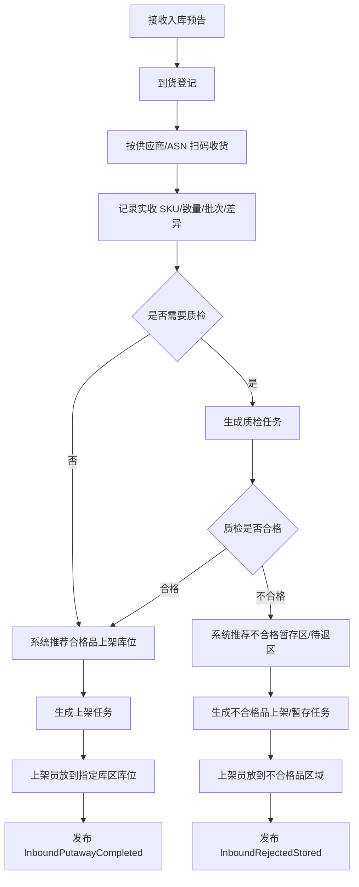
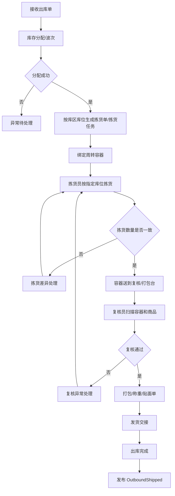
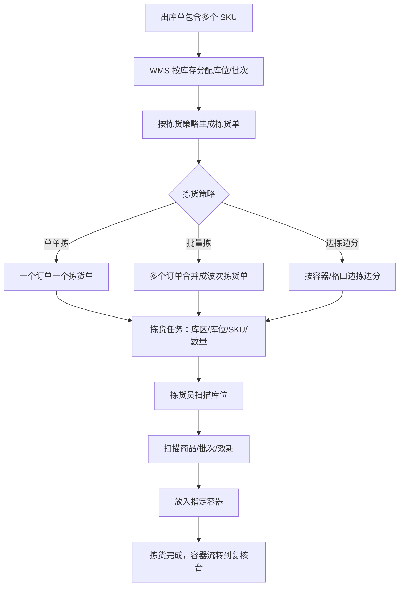
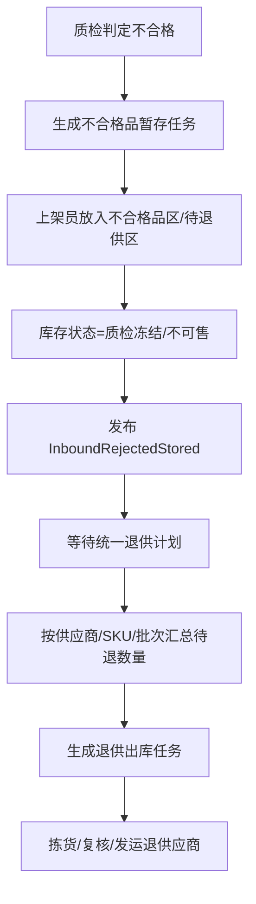
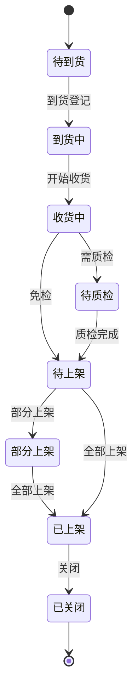
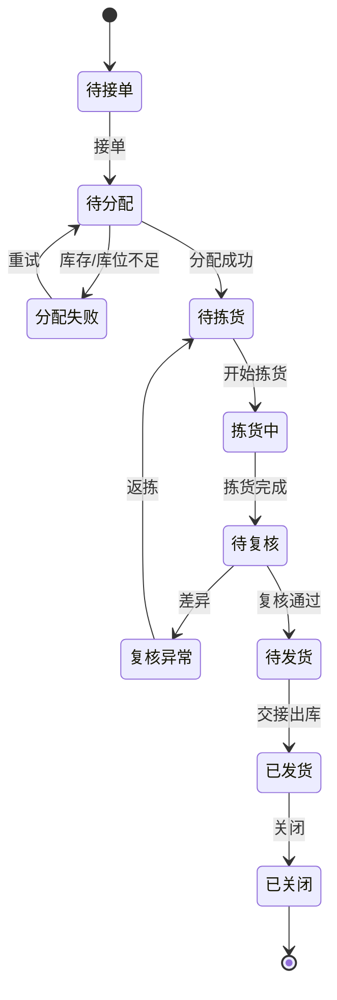
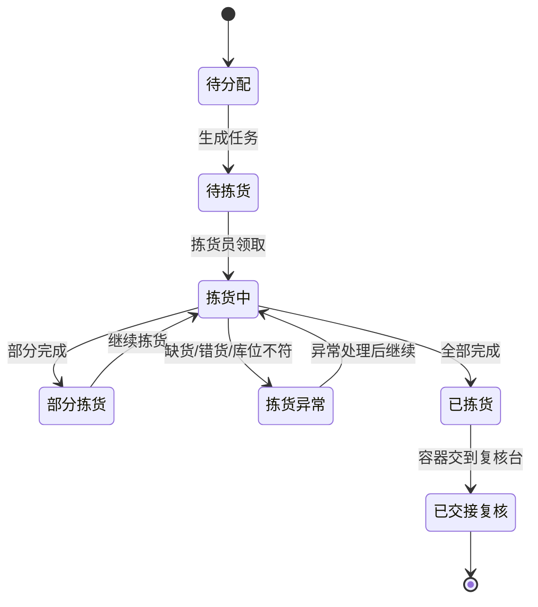
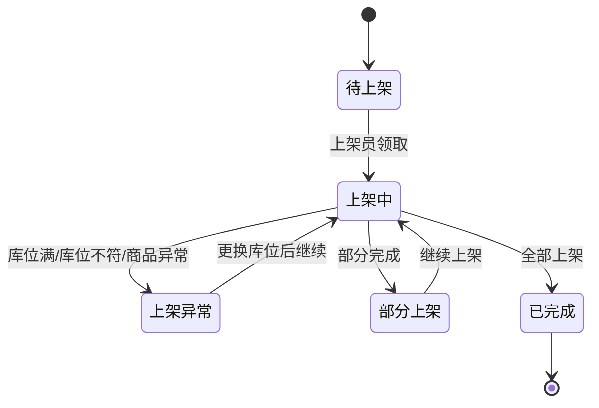

# 34 WMS 系统功能设计

> WMS 负责仓库内实物作业：收货、质检、上架、拣货、复核、包装、发货、盘点、库内移动。本文聚焦 WMS 自身功能、角色、状态和事件。

## 1. 系统定位

| 边界 | 说明 |
| --- | --- |
| 负责 | 仓内作业任务、库位、批次/效期/序列号、收发存执行、盘点 |
| 不负责 | 销售订单审单、采购审批、中央库存统一账本、财务结算 |
| 核心数据 | 入库单、收货单、质检单、上架任务、拣货单、拣货任务、周转容器、出库单、复核/包装/发货记录、不合格品暂存记录、库内库存 |

## 2. 使用角色

| 角色 | 使用功能 | 典型动作 |
| --- | --- | --- |
| 收货员 | 到货登记、收货 | 扫码、点数、登记差异 |
| 质检员 | 质检 | 判定合格、不合格、冻结 |
| 上架员 | 上架 | 按推荐库位上架 |
| 拣货员 | 拣货、容器绑定 | 按拣货单从指定库区库位拿货，放入周转箱/播种格口 |
| 复核/包装员 | 复核、打包、打单 | 扫描容器、复核商品、包装称重、贴面单 |
| 发货员 | 交接 | 承运商交接、出库确认 |
| 仓库主管 | 波次、任务、盘点 | 分配任务、处理异常 |

## 3. 功能地图

| 模块 | 功能 | 说明 |
| --- | --- | --- |
| 入库作业 | ASN 接收、到货、收货、质检、上架 | 采购和退货入库 |
| 出库作业 | 接单、波次、库位分配、拣货单、容器、复核、包装、发货 | 销售、调拨、退供出库 |
| 拣货作业 | 按库区库位生成拣货任务，支持单单拣、批量拣、边拣边分 | 多商品订单从不同库位取货 |
| 上架作业 | 合格品推荐库位，不合格品推荐异常/待退区 | 采购入库和退货入库 |
| 不合格品处理 | 暂存、冻结、待退供、报废、集中退货 | 质检不合格后的后续处理 |
| 库内作业 | 移库、补货、冻结、解冻 | 仓内库存管理 |
| 盘点 | 盘点计划、盘点任务、差异处理 | 与库存对账 |
| 库位管理 | 库区、库位、容量、温区 | 作业位置 |
| 批次/效期 | 批次采集、效期校验、先进先出 | 商品追溯 |
| 异常处理 | 短收、超收、错货、破损、复核差异 | 人工处理 |

## 4. 核心操作流程

### 4.1 入库作业流程

### 4.2 出库作业流程

### 4.3 多商品订单拣货流程

一个 OMS 订单可能包含多个 SKU，这些 SKU 可能分布在不同库区、不同货架、不同库位。WMS 不应只给仓库一个“出库单”，还要把出库单拆成可执行的拣货单和拣货任务。

### 4.4 不合格品集中退供流程

采购入库质检不合格时，WMS 先把商品放入不合格品区域或待退供应商区域，不直接进入可用库存。后续由采购或质量统一发起退供应商流程。

## 4.5 核心作业单据

| 作业单据 | 作用 | 生成时机 | 执行人 |
| --- | --- | --- | --- |
| 收货单 | 记录供应商送来的 SKU、数量、批次、差异 | ASN 到货登记后 | 收货员 |
| 质检任务 | 判断商品合格、不合格、待处理 | 收货后且 SKU 需要质检 | 质检员 |
| 上架任务 | 指示合格商品放到指定库区库位 | 质检合格或免检后 | 上架员 |
| 不合格品暂存任务 | 指示不合格商品放到异常区/待退区 | 质检不合格后 | 上架员 |
| 出库单 | WMS 接收的外部出库指令 | OMS/调拨/退供下发 | 仓库主管 |
| 波次单 | 合并多个出库单以提升拣货效率 | 仓库按策略生成 | 仓库主管 |
| 拣货单 | 给拣货员执行的拿货单 | 库位分配成功后 | 拣货员 |
| 拣货任务 | 拣货单里的明细任务 | 拣货单生成时 | 拣货员 |
| 周转容器 | 承载拣出的商品，如周转箱、播种格口 | 拣货开始前绑定 | 拣货员/复核员 |
| 复核包装单 | 复核商品并完成包装称重 | 拣货完成后 | 复核/包装员 |
| 发货交接单 | 记录包裹交给承运商 | 包装完成后 | 发货员 |

## 4.6 拣货任务字段建议

| 字段 | 说明 |
| --- | --- |
| `picking_task_id` | 拣货任务 ID |
| `picking_order_id` | 拣货单 ID |
| `outbound_order_id` | 出库单 ID |
| `outbound_line_id` | 出库行 ID |
| `warehouse_id` | 仓库 |
| `zone_id` | 库区 |
| `location_id` | 库位 |
| `sku_id` | SKU |
| `batch_no` | 批次号，可为空 |
| `required_qty` | 应拣数量 |
| `picked_qty` | 已拣数量 |
| `container_id` | 周转容器 |
| `task_status` | 待拣货、拣货中、已完成、异常 |
| `picker_id` | 拣货员 |
| `picked_at` | 拣货完成时间 |

## 4.7 上架任务字段建议

| 字段 | 说明 |
| --- | --- |
| `putaway_task_id` | 上架任务 ID |
| `inbound_order_id` | 入库单 ID |
| `receipt_line_id` | 收货明细 ID |
| `inspection_id` | 质检任务 ID，可为空 |
| `warehouse_id` | 仓库 |
| `target_zone_id` | 推荐目标库区 |
| `target_location_id` | 推荐目标库位 |
| `sku_id` | SKU |
| `batch_no` | 批次号 |
| `quality_status` | 合格、不合格、待处理 |
| `required_qty` | 应上架数量 |
| `putaway_qty` | 已上架数量 |
| `task_status` | 待上架、上架中、已完成、异常 |
| `operator_id` | 上架员 |
| `putaway_at` | 上架完成时间 |

## 5. 数据状态机

### 5.1 入库单状态

### 5.2 出库单状态

### 5.3 拣货单状态

### 5.4 上架任务状态

## 6. 生产事件

| 事件 | 触发动作 | 关键载荷 |
| --- | --- | --- |
| `InboundReceived` | 收货完成或部分完成 | `inbound_order_id`、`sku_id`、`received_qty` |
| `QcCompleted` | 质检完成 | `inspection_id`、`accepted_qty`、`rejected_qty` |
| `InboundPutawayCompleted` | 上架完成 | `warehouse_id`、`location_id`、`sku_id`、`putaway_qty` |
| `InboundRejectedStored` | 不合格品暂存完成 | `inbound_order_id`、`supplier_id`、`sku_id`、`rejected_qty`、`location_id` |
| `OutboundAccepted` | WMS 接单 | `outbound_order_id` |
| `OutboundAllocated` | 分配成功 | `outbound_order_id`、`location_id`、`allocated_qty` |
| `PickingOrderCreated` | 生成拣货单 | `picking_order_id`、`wave_id`、`outbound_order_id` |
| `PickingTaskCompleted` | 拣货任务完成 | `picking_task_id`、`container_id`、`sku_id`、`picked_qty` |
| `PackingCompleted` | 打包完成 | `package_id`、`outbound_order_id`、`weight`、`volume` |
| `OutboundShipped` | 出库完成 | `outbound_order_id`、`sku_id`、`shipped_qty` |
| `ReturnReceiptCompleted` | 退货验收完成 | `after_sale_id`、`accepted_qty`、`quality_result` |
| `InventoryCountDiffCreated` | 盘点差异 | `count_plan_id`、`sku_id`、`diff_qty` |

## 7. 消费事件

| 事件 | 来源 | 消费后数据变化 |
| --- | --- | --- |
| `WarehouseEnabled` | 主数据系统 | 更新仓库/库区/库位资料 |
| `SkuEnabled` | 主数据系统 | 更新 SKU、条码、包装、批次/效期规则 |
| `OwnerEnabled` | 主数据系统 | 更新货主和货主仓关系 |
| `AsnSubmitted` | 供应商系统 | 创建采购入库预告 |
| `OutboundOrderCreated` | OMS | 创建销售出库单 |
| `TransferOutboundCreated` | 调拨/库存 | 创建调拨出库单 |
| `SupplierReturnOutboundCreated` | 采购系统 | 创建退供出库单 |
| `StockReserved` | 中央库存 | 标记出库单库存已预占，可进入分配 |
| `CarrierEnabled` | 主数据系统 | 更新面单和承运商配置 |
| `SupplierReturnRequested` | 采购系统 | 按供应商/SKU/批次创建退供出库任务，处理不合格品集中退供 |

## 8. 事件处理规则

| 规则 | 说明 |
| --- | --- |
| 实物事实 | WMS 事件代表仓内实物事实，是库存记账的重要来源 |
| 扫码校验 | SKU、条码、批次、效期、序列号必须按规则校验 |
| 部分执行 | 入库、出库都允许部分完成，单头由行状态汇总 |
| 差异隔离 | 短收、超收、错货、破损进入异常区，不直接进入可用 |
| 拣货必须到库位 | 拣货任务必须明确库区、库位、SKU、数量，拣货员按任务扫描确认 |
| 容器绑定 | 多商品订单建议绑定周转容器，容器作为拣货到复核的实物流转载体 |
| 上架推荐可改 | 系统推荐库位，人工可按权限改库位，但要记录原因 |
| 不合格品隔离 | 质检不合格商品必须进入不合格区、待退供区或报废区，不能进入可用库位 |
| 集中退供 | 不合格品可按供应商、SKU、批次汇总后统一生成退供出库任务 |

## DDD 对齐说明

本文属于 **WMS 上下文**。设计时应把页面、字段和流程统一回到该上下文的模型边界，避免跨上下文直接修改数据。

| DDD 项 | 对齐口径 |
| --- | --- |
| 限界上下文 | WMS 上下文 |
| 核心聚合 | InboundOrder、OutboundOrder、PickTask、PutawayTask、LocationInventory |
| 数据主权 | 仓内实物作业事实 |
| 生产事件 | 只发布本上下文已经发生的业务事实 |
| 消费事件 | 消费外部事实时必须记录 event_id、幂等键、处理状态和失败原因 |
| 查询模型 | 列表、看板、导出可使用读模型，不强行加载聚合 |

## 9. 继续上下文

当前结论：WMS 是仓内执行系统，核心是把外部单据转成可扫描、可追踪的仓内作业任务。出库时，出库单要进一步拆成拣货单/拣货任务，指导拣货员从指定库区库位拿取商品并放入容器；入库时，收货和质检结果要进一步生成上架任务，指导上架员把合格品放到推荐库位，把不合格品放到不合格品区或待退供区。

关键假设：WMS 生产的收货、质检、上架、拣货、打包、出库事件被中央库存和上下游系统消费后形成库存流水、履约进度和计费依据。
