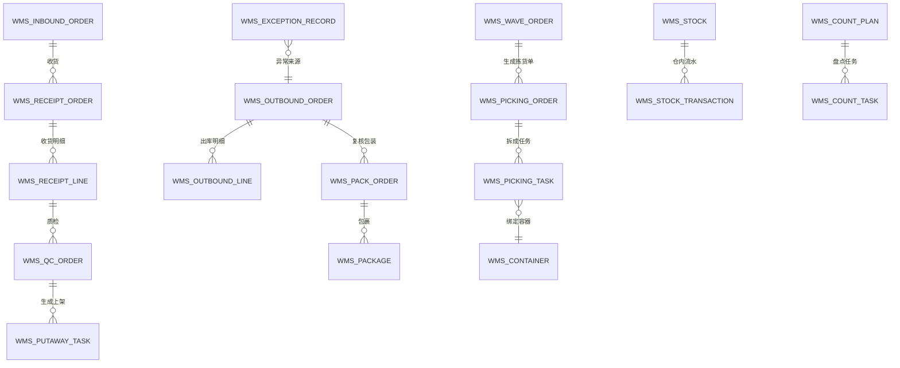
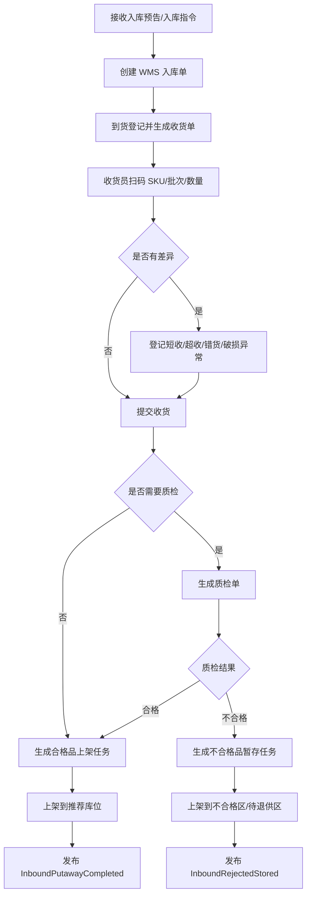
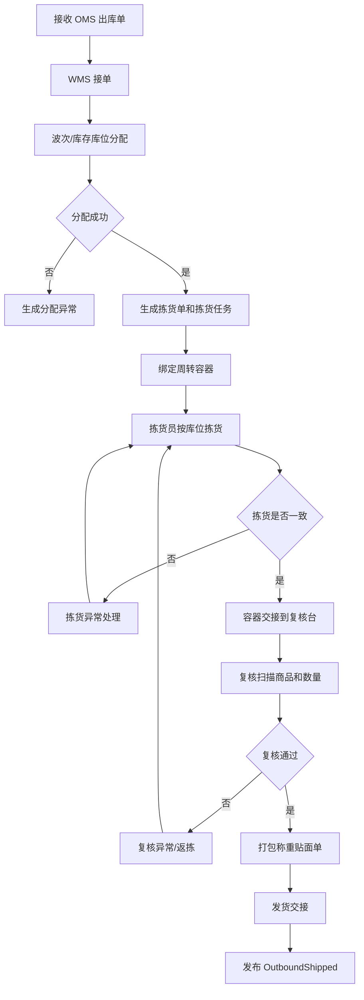
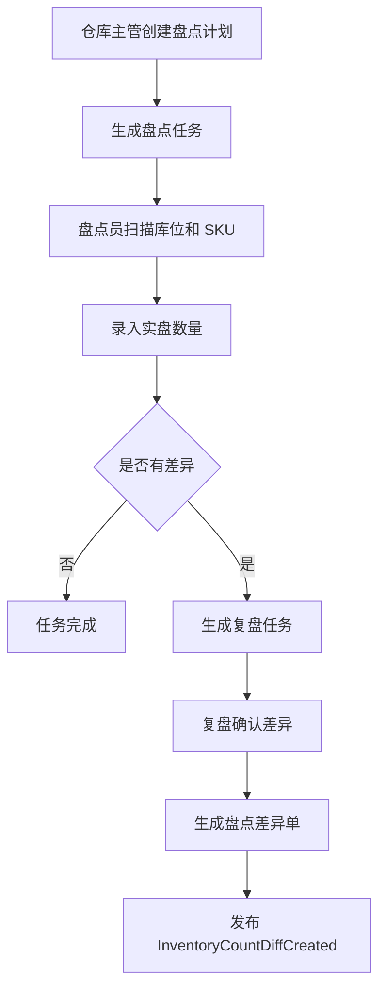
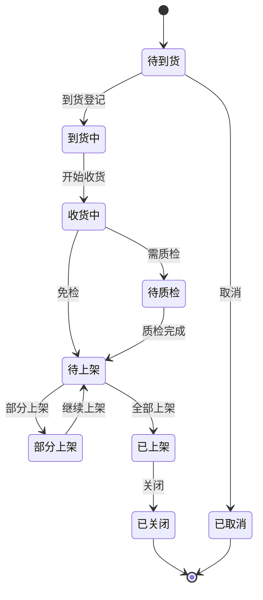
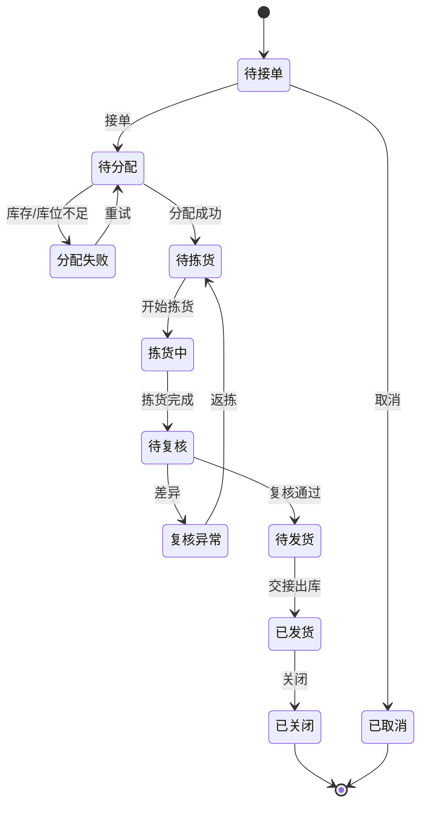
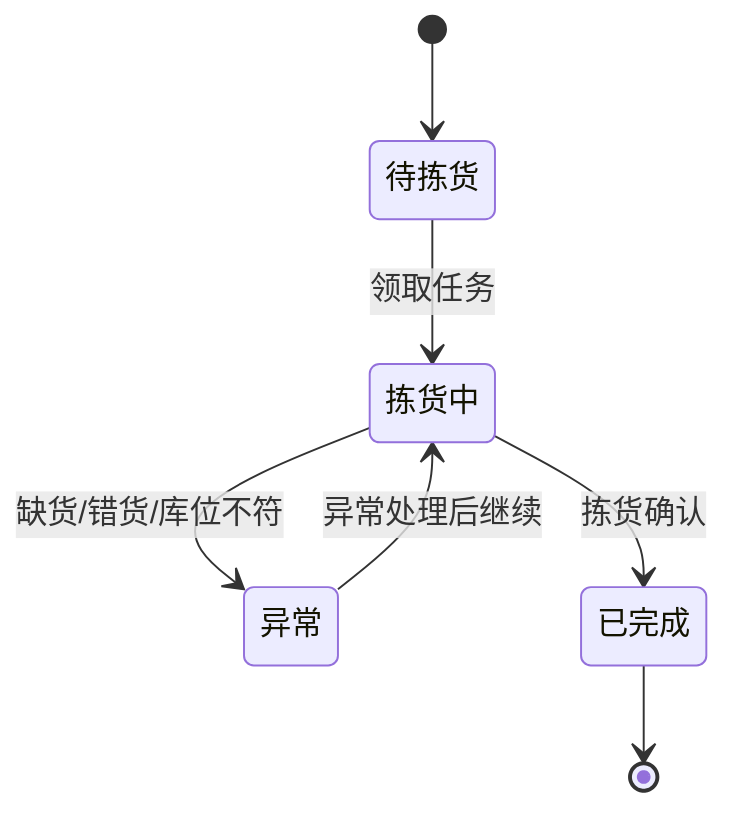
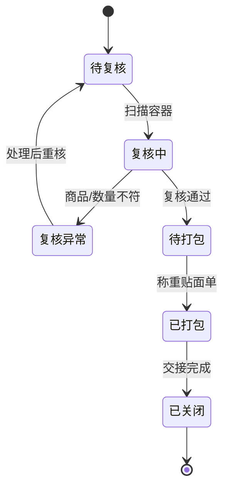

# 43 WMS 系统详细设计

> 本文承接 [WMS 系统功能设计](./34-WMS系统功能设计.md)，按 [权限系统详细设计](../权限系统/38-权限系统详细设计.md) 的模式细化入库、收货、质检、上架、库内库存、波次、拣货、容器、复核包装、发货、退货入库、不合格品、盘点、权限点、枚举、事件和操作日志。当前版本是系统设计级字段模型，不是最终数据库 DDL。

## 1. 设计目标

WMS 要统一回答五个问题：

| 问题 | 设计对象 |
| --- | --- |
| 货从哪里进来 | 入库预告、入库单、收货单、收货行 |
| 货是否合格、放到哪里 | 质检单、上架任务、库区、库位、批次、库存状态 |
| 货从哪里拿、怎么拿 | 出库单、波次单、拣货单、拣货任务、周转容器 |
| 货如何复核发出 | 复核包装单、包裹、称重、面单、发货交接 |
| 仓内异常如何追溯 | 差异单、异常记录、不合格品暂存、盘点差异、操作日志 |

核心原则：

| 原则 | 说明 |
| --- | --- |
| WMS 是仓内实物执行系统 | 负责把外部单据转成可扫描、可追踪、可分派的作业任务 |
| 仓内动作必须落到库位 | 收货、上架、拣货、移库、盘点都要明确仓库、库区、库位 |
| 实物事实通过事件外发 | WMS 不做中央库存统一账本，但生产库存记账事实 |
| 合格品和不合格品隔离 | 不合格、冻结、待退供商品不能进入可用拣货库位 |
| 扫码优先、人工修正留痕 | SKU、条码、批次、效期、容器、包裹关键动作都要扫描或记录修正原因 |

## 2. 总体模型

## 3. 功能页面

| 页面 | 主要用途 | 展示字段 | 主要操作 |
| --- | --- | --- | --- |
| WMS 工作台 | 展示入库、出库、异常、待办任务 | 待收货、待质检、待上架、待拣货、待复核、异常数 | 查看待办、进入处理 |
| 入库单页 | 查看采购、调拨、退货入库指令 | 入库单号、来源类型、供应商/客户、仓库、状态 | 接单、取消、关闭 |
| 收货作业页 | 到货登记、扫码点数、记录差异 | 收货单号、SKU、应收、实收、差异、批次 | 开始收货、提交、异常登记 |
| 质检作业页 | 判断合格、不合格、待处理 | 质检单号、SKU、抽检数、合格数、不合格数 | 判定、冻结、提交 |
| 上架任务页 | 按推荐库位上架合格品或异常品 | 任务号、SKU、目标库区库位、数量、状态 | 领取、确认上架、改库位 |
| 库内库存页 | 查询 WMS 仓内库存明细 | 仓库、库区、库位、SKU、批次、状态、数量 | 查询、冻结、解冻 |
| 出库单页 | 接收 OMS/调拨/退供出库指令 | 出库单号、来源类型、仓库、状态、优先级 | 接单、取消、关闭 |
| 波次管理页 | 将多个出库单合并优化拣货 | 波次号、订单数、SKU数、策略、状态 | 生成、释放、取消 |
| 拣货单页 | 管理拣货员可执行的拣货单 | 拣货单号、波次、库区、容器、状态 | 分配、领取、完成、异常 |
| 拣货任务页 | 指导拣货员从指定库位拿货 | 库区、库位、SKU、批次、应拣、已拣 | 扫库位、扫商品、确认数量 |
| 容器管理页 | 管理周转箱、播种车、格口 | 容器编码、类型、状态、绑定单据 | 绑定、解绑、流转、清空 |
| 复核包装页 | 扫描容器和商品，打包称重贴面单 | 包装单、出库单、容器、重量、包裹数 | 复核、打包、称重、打印面单 |
| 发货交接页 | 承运商交接并确认出库 | 交接单、承运商、包裹数、状态 | 扫包裹、交接、确认发货 |
| 退货入库页 | 售后退货到仓验收 | 退货单、售后单、SKU、验收结果、状态 | 收货、验收、上架、拒收 |
| 不合格品页 | 管理不合格、待退供、报废库存 | SKU、供应商、批次、数量、位置、状态 | 暂存、转待退、报废、退供 |
| 盘点管理页 | 创建盘点计划、执行盘点、处理差异 | 盘点单、范围、账面数、实盘数、差异 | 新增、下发、复盘、确认差异 |
| 异常处理页 | 处理短收、超收、错货、破损、复核差异 | 异常单、来源、类型、责任方、状态 | 分派、处理、关闭 |
| 操作日志页 | 查询仓内关键操作 | 操作人、对象、动作、时间、结果 | 查询、导出 |
| 枚举配置页 | 维护 WMS 页面枚举项 | 枚举类型、枚举值、标签、状态 | 新增、编辑、排序、停用 |

## 4. 核心流程

### 4.1 入库收货上架流程

### 4.2 销售出库作业流程

### 4.3 盘点差异处理流程

## 5. 字段模型

### 5.1 入库单 `wms_inbound_order`

| 字段 | 类型 | 是否必填 | 枚举/约束 | 说明 |
| --- | --- | --- | --- | --- |
| `inbound_order_id` | bigint | 是 | 主键 | WMS 入库单 ID |
| `inbound_order_no` | varchar(64) | 是 | 唯一 | WMS 入库单号 |
| `source_order_no` | varchar(64) | 是 | 幂等组合 | 来源单号，如 ASN、调拨入库、售后退货 |
| `source_type` | varchar(32) | 是 | `INBOUND_SOURCE_TYPE` | 采购、调拨、销售退货、其他 |
| `warehouse_id` | bigint | 是 | 外键 | 仓库 |
| `owner_id` | bigint | 否 | 外键 | 货主 |
| `supplier_id` | bigint | 否 | 外键 | 供应商 |
| `customer_id` | bigint | 否 | 外键 | 客户 |
| `inbound_status` | varchar(32) | 是 | `INBOUND_STATUS` | 待到货、到货中、收货中、待质检、待上架、部分上架、已上架、已关闭、已取消 |
| `expected_arrival_at` | datetime | 否 |  | 预计到仓时间 |
| `arrived_at` | datetime | 否 |  | 到货时间 |
| `created_at` | datetime | 是 |  | 创建时间 |
| `updated_at` | datetime | 否 |  | 更新时间 |

对应页面：`入库单页`

展示字段：入库单号、来源类型、来源单号、仓库、供应商/客户、状态、预计到仓、到货时间。

### 5.2 收货单 `wms_receipt_order`

| 字段 | 类型 | 是否必填 | 枚举/约束 | 说明 |
| --- | --- | --- | --- | --- |
| `receipt_order_id` | bigint | 是 | 主键 | 收货单 ID |
| `receipt_order_no` | varchar(64) | 是 | 唯一 | 收货单号 |
| `inbound_order_id` | bigint | 是 | 外键 | 入库单 ID |
| `warehouse_id` | bigint | 是 | 外键 | 仓库 |
| `receipt_status` | varchar(32) | 是 | `RECEIPT_STATUS` | 待收货、收货中、部分收货、已收货、异常、已关闭 |
| `receiver_id` | bigint | 否 |  | 收货员 |
| `started_at` | datetime | 否 |  | 开始收货时间 |
| `completed_at` | datetime | 否 |  | 收货完成时间 |

对应页面：`收货作业页`

展示字段：收货单号、入库单号、仓库、收货员、状态、开始时间、完成时间。

### 5.3 收货行 `wms_receipt_line`

| 字段 | 类型 | 是否必填 | 枚举/约束 | 说明 |
| --- | --- | --- | --- | --- |
| `receipt_line_id` | bigint | 是 | 主键 | 收货行 ID |
| `receipt_order_id` | bigint | 是 | 外键 | 收货单 ID |
| `sku_id` | bigint | 是 | 外键 | SKU |
| `sku_code` | varchar(64) | 是 | 快照 | SKU 编码 |
| `expected_qty` | decimal(18,4) | 是 | >= 0 | 应收数量 |
| `received_qty` | decimal(18,4) | 是 | 默认 0 | 实收数量 |
| `short_qty` | decimal(18,4) | 是 | 默认 0 | 短收数量 |
| `over_qty` | decimal(18,4) | 是 | 默认 0 | 超收数量 |
| `batch_no` | varchar(128) | 否 |  | 批次号 |
| `production_date` | date | 否 |  | 生产日期 |
| `expire_date` | date | 否 |  | 效期 |
| `quality_status` | varchar(32) | 是 | `QUALITY_STATUS` | 待检、合格、不合格、免检、待处理 |

### 5.4 质检单 `wms_qc_order`

| 字段 | 类型 | 是否必填 | 枚举/约束 | 说明 |
| --- | --- | --- | --- | --- |
| `qc_order_id` | bigint | 是 | 主键 | 质检单 ID |
| `qc_order_no` | varchar(64) | 是 | 唯一 | 质检单号 |
| `receipt_line_id` | bigint | 是 | 外键 | 收货行 |
| `sku_id` | bigint | 是 | 外键 | SKU |
| `sample_qty` | decimal(18,4) | 否 | >= 0 | 抽检数量 |
| `accepted_qty` | decimal(18,4) | 是 | 默认 0 | 合格数量 |
| `rejected_qty` | decimal(18,4) | 是 | 默认 0 | 不合格数量 |
| `qc_result` | varchar(32) | 是 | `QC_RESULT` | 待检、合格、不合格、部分合格 |
| `reject_reason` | varchar(512) | 否 |  | 不合格原因 |
| `inspector_id` | bigint | 否 |  | 质检员 |
| `completed_at` | datetime | 否 |  | 质检完成时间 |

对应页面：`质检作业页`

展示字段：质检单号、SKU、抽检数、合格数、不合格数、结果、原因、质检员。

### 5.5 上架任务 `wms_putaway_task`

| 字段 | 类型 | 是否必填 | 枚举/约束 | 说明 |
| --- | --- | --- | --- | --- |
| `putaway_task_id` | bigint | 是 | 主键 | 上架任务 ID |
| `inbound_order_id` | bigint | 是 | 外键 | 入库单 |
| `receipt_line_id` | bigint | 是 | 外键 | 收货行 |
| `qc_order_id` | bigint | 否 | 外键 | 质检单 |
| `warehouse_id` | bigint | 是 | 外键 | 仓库 |
| `target_zone_id` | bigint | 是 | 外键 | 目标库区 |
| `target_location_id` | bigint | 是 | 外键 | 目标库位 |
| `sku_id` | bigint | 是 | 外键 | SKU |
| `batch_no` | varchar(128) | 否 |  | 批次 |
| `quality_status` | varchar(32) | 是 | `QUALITY_STATUS` | 合格、不合格、待处理 |
| `required_qty` | decimal(18,4) | 是 | > 0 | 应上架数量 |
| `putaway_qty` | decimal(18,4) | 是 | 默认 0 | 已上架数量 |
| `task_status` | varchar(32) | 是 | `PUTAWAY_TASK_STATUS` | 待上架、上架中、部分上架、已完成、异常 |
| `operator_id` | bigint | 否 |  | 上架员 |
| `putaway_at` | datetime | 否 |  | 上架完成时间 |

对应页面：`上架任务页`

展示字段：任务号、入库单、SKU、目标库区库位、质量状态、应上架、已上架、任务状态、上架员。

### 5.6 仓内库存 `wms_stock`

| 字段 | 类型 | 是否必填 | 枚举/约束 | 说明 |
| --- | --- | --- | --- | --- |
| `stock_id` | bigint | 是 | 主键 | 仓内库存 ID |
| `warehouse_id` | bigint | 是 | 外键 | 仓库 |
| `zone_id` | bigint | 是 | 外键 | 库区 |
| `location_id` | bigint | 是 | 外键 | 库位 |
| `owner_id` | bigint | 否 | 外键 | 货主 |
| `sku_id` | bigint | 是 | 外键 | SKU |
| `batch_no` | varchar(128) | 否 |  | 批次 |
| `stock_status` | varchar(32) | 是 | `WMS_STOCK_STATUS` | 可拣、冻结、不合格、待退供、待报废 |
| `qty` | decimal(18,4) | 是 | >= 0 | 库位数量 |
| `locked_qty` | decimal(18,4) | 是 | 默认 0 | 作业锁定数量 |
| `updated_at` | datetime | 否 |  | 更新时间 |

对应页面：`库内库存页`

展示字段：仓库、库区、库位、SKU、批次、库存状态、数量、锁定数量。

### 5.7 出库单 `wms_outbound_order`

| 字段 | 类型 | 是否必填 | 枚举/约束 | 说明 |
| --- | --- | --- | --- | --- |
| `outbound_order_id` | bigint | 是 | 主键 | WMS 出库单 ID |
| `outbound_order_no` | varchar(64) | 是 | 唯一 | WMS 出库单号 |
| `source_order_no` | varchar(64) | 是 | 幂等组合 | 来源单号 |
| `source_type` | varchar(32) | 是 | `OUTBOUND_SOURCE_TYPE` | 销售、调拨、退供、其他 |
| `warehouse_id` | bigint | 是 | 外键 | 仓库 |
| `owner_id` | bigint | 否 | 外键 | 货主 |
| `priority` | int | 是 | >= 0 | 优先级 |
| `outbound_status` | varchar(32) | 是 | `WMS_OUTBOUND_STATUS` | 待接单、待分配、分配失败、待拣货、拣货中、待复核、复核异常、待发货、已发货、已关闭、已取消 |
| `carrier_id` | bigint | 否 | 外键 | 物流商 |
| `created_at` | datetime | 是 |  | 创建时间 |
| `shipped_at` | datetime | 否 |  | 发货时间 |

对应页面：`出库单页`

展示字段：出库单号、来源类型、来源单号、仓库、优先级、出库状态、物流商、发货时间。

### 5.8 出库单行 `wms_outbound_line`

| 字段 | 类型 | 是否必填 | 枚举/约束 | 说明 |
| --- | --- | --- | --- | --- |
| `outbound_line_id` | bigint | 是 | 主键 | 出库行 ID |
| `outbound_order_id` | bigint | 是 | 外键 | 出库单 |
| `sku_id` | bigint | 是 | 外键 | SKU |
| `sku_code` | varchar(64) | 是 | 快照 | SKU 编码 |
| `planned_qty` | decimal(18,4) | 是 | > 0 | 计划出库数量 |
| `allocated_qty` | decimal(18,4) | 是 | 默认 0 | 已分配数量 |
| `picked_qty` | decimal(18,4) | 是 | 默认 0 | 已拣数量 |
| `shipped_qty` | decimal(18,4) | 是 | 默认 0 | 已发货数量 |
| `line_status` | varchar(32) | 是 | `WMS_OUTBOUND_LINE_STATUS` | 待分配、已分配、拣货中、已拣货、已发货、已取消 |

### 5.9 波次单 `wms_wave_order`

| 字段 | 类型 | 是否必填 | 枚举/约束 | 说明 |
| --- | --- | --- | --- | --- |
| `wave_id` | bigint | 是 | 主键 | 波次 ID |
| `wave_no` | varchar(64) | 是 | 唯一 | 波次号 |
| `warehouse_id` | bigint | 是 | 外键 | 仓库 |
| `wave_type` | varchar(32) | 是 | `WAVE_TYPE` | 单单拣、批量拣、边拣边分 |
| `order_count` | int | 是 | >= 0 | 出库单数 |
| `sku_count` | int | 是 | >= 0 | SKU 数 |
| `wave_status` | varchar(32) | 是 | `WAVE_STATUS` | 草稿、已释放、拣货中、已完成、已取消 |
| `created_by` | bigint | 是 |  | 创建人 |
| `released_at` | datetime | 否 |  | 释放时间 |

对应页面：`波次管理页`

展示字段：波次号、仓库、波次类型、订单数、SKU 数、状态、创建人、释放时间。

### 5.10 拣货单 `wms_picking_order`

| 字段 | 类型 | 是否必填 | 枚举/约束 | 说明 |
| --- | --- | --- | --- | --- |
| `picking_order_id` | bigint | 是 | 主键 | 拣货单 ID |
| `picking_order_no` | varchar(64) | 是 | 唯一 | 拣货单号 |
| `wave_id` | bigint | 否 | 外键 | 波次 ID |
| `warehouse_id` | bigint | 是 | 外键 | 仓库 |
| `zone_id` | bigint | 否 | 外键 | 作业库区 |
| `picking_mode` | varchar(32) | 是 | `PICKING_MODE` | 单单拣、批量拣、边拣边分 |
| `picking_status` | varchar(32) | 是 | `PICKING_STATUS` | 待分配、待拣货、拣货中、部分拣货、拣货异常、已拣货、已交接复核 |
| `picker_id` | bigint | 否 |  | 拣货员 |
| `started_at` | datetime | 否 |  | 开始时间 |
| `completed_at` | datetime | 否 |  | 完成时间 |

对应页面：`拣货单页`

展示字段：拣货单号、波次号、仓库、库区、拣货模式、状态、拣货员、完成时间。

### 5.11 拣货任务 `wms_picking_task`

| 字段 | 类型 | 是否必填 | 枚举/约束 | 说明 |
| --- | --- | --- | --- | --- |
| `picking_task_id` | bigint | 是 | 主键 | 拣货任务 ID |
| `picking_order_id` | bigint | 是 | 外键 | 拣货单 |
| `outbound_order_id` | bigint | 是 | 外键 | 出库单 |
| `outbound_line_id` | bigint | 是 | 外键 | 出库行 |
| `warehouse_id` | bigint | 是 | 外键 | 仓库 |
| `zone_id` | bigint | 是 | 外键 | 库区 |
| `location_id` | bigint | 是 | 外键 | 库位 |
| `sku_id` | bigint | 是 | 外键 | SKU |
| `batch_no` | varchar(128) | 否 |  | 批次 |
| `required_qty` | decimal(18,4) | 是 | > 0 | 应拣数量 |
| `picked_qty` | decimal(18,4) | 是 | 默认 0 | 已拣数量 |
| `container_id` | bigint | 否 | 外键 | 周转容器 |
| `task_status` | varchar(32) | 是 | `PICKING_TASK_STATUS` | 待拣货、拣货中、已完成、异常 |
| `picker_id` | bigint | 否 |  | 拣货员 |
| `picked_at` | datetime | 否 |  | 拣货完成时间 |

对应页面：`拣货任务页`

展示字段：任务号、出库单、库区、库位、SKU、批次、应拣、已拣、容器、状态。

### 5.12 周转容器 `wms_container`

| 字段 | 类型 | 是否必填 | 枚举/约束 | 说明 |
| --- | --- | --- | --- | --- |
| `container_id` | bigint | 是 | 主键 | 容器 ID |
| `container_code` | varchar(64) | 是 | 唯一 | 容器编码 |
| `container_type` | varchar(32) | 是 | `CONTAINER_TYPE` | 周转箱、播种车、格口、托盘 |
| `warehouse_id` | bigint | 是 | 外键 | 仓库 |
| `bind_object_type` | varchar(32) | 否 | `CONTAINER_BIND_TYPE` | 拣货单、出库单、包裹 |
| `bind_object_id` | bigint | 否 |  | 绑定对象 |
| `container_status` | varchar(32) | 是 | `CONTAINER_STATUS` | 空闲、已绑定、拣货中、待复核、已清空、停用 |
| `updated_at` | datetime | 否 |  | 更新时间 |

对应页面：`容器管理页`

展示字段：容器编码、类型、仓库、绑定对象、状态、更新时间。

### 5.13 复核包装单 `wms_pack_order`

| 字段 | 类型 | 是否必填 | 枚举/约束 | 说明 |
| --- | --- | --- | --- | --- |
| `pack_order_id` | bigint | 是 | 主键 | 包装单 ID |
| `pack_order_no` | varchar(64) | 是 | 唯一 | 包装单号 |
| `outbound_order_id` | bigint | 是 | 外键 | 出库单 |
| `container_id` | bigint | 否 | 外键 | 容器 |
| `reviewer_id` | bigint | 否 |  | 复核员 |
| `packer_id` | bigint | 否 |  | 打包员 |
| `pack_status` | varchar(32) | 是 | `PACK_STATUS` | 待复核、复核中、复核异常、待打包、已打包、已关闭 |
| `weight` | decimal(18,4) | 否 | >= 0 | 重量 |
| `volume` | decimal(18,4) | 否 | >= 0 | 体积 |
| `completed_at` | datetime | 否 |  | 完成时间 |

对应页面：`复核包装页`

展示字段：包装单号、出库单、容器、复核员、打包员、状态、重量、体积。

### 5.14 包裹 `wms_package`

| 字段 | 类型 | 是否必填 | 枚举/约束 | 说明 |
| --- | --- | --- | --- | --- |
| `package_id` | bigint | 是 | 主键 | 包裹 ID |
| `package_no` | varchar(64) | 是 | 唯一 | 包裹号 |
| `pack_order_id` | bigint | 是 | 外键 | 包装单 |
| `outbound_order_id` | bigint | 是 | 外键 | 出库单 |
| `carrier_id` | bigint | 否 | 外键 | 物流商 |
| `tracking_no` | varchar(128) | 否 |  | 运单号 |
| `weight` | decimal(18,4) | 否 | >= 0 | 重量 |
| `package_status` | varchar(32) | 是 | `PACKAGE_STATUS` | 已打包、待交接、已交接、已取消 |
| `shipped_at` | datetime | 否 |  | 发货时间 |

### 5.15 盘点计划 `wms_count_plan`

| 字段 | 类型 | 是否必填 | 枚举/约束 | 说明 |
| --- | --- | --- | --- | --- |
| `count_plan_id` | bigint | 是 | 主键 | 盘点计划 ID |
| `count_plan_no` | varchar(64) | 是 | 唯一 | 盘点计划号 |
| `warehouse_id` | bigint | 是 | 外键 | 仓库 |
| `count_type` | varchar(32) | 是 | `COUNT_TYPE` | 全盘、动盘、循环盘、抽盘 |
| `scope_config` | text | 是 | JSON | 盘点范围 |
| `plan_status` | varchar(32) | 是 | `COUNT_PLAN_STATUS` | 草稿、已下发、盘点中、差异处理中、已完成、已取消 |
| `created_by` | bigint | 是 |  | 创建人 |
| `created_at` | datetime | 是 |  | 创建时间 |

对应页面：`盘点管理页`

展示字段：盘点计划号、仓库、盘点类型、范围、状态、创建人、创建时间。

### 5.16 异常记录 `wms_exception_record`

| 字段 | 类型 | 是否必填 | 枚举/约束 | 说明 |
| --- | --- | --- | --- | --- |
| `exception_id` | bigint | 是 | 主键 | 异常 ID |
| `exception_no` | varchar(64) | 是 | 唯一 | 异常单号 |
| `source_type` | varchar(32) | 是 | `WMS_EXCEPTION_SOURCE` | 收货、质检、上架、分配、拣货、复核、发货、盘点 |
| `source_id` | bigint | 是 |  | 来源对象 ID |
| `warehouse_id` | bigint | 是 | 外键 | 仓库 |
| `exception_type` | varchar(32) | 是 | `WMS_EXCEPTION_TYPE` | 短收、超收、错货、破损、库位不符、复核差异、盘点差异 |
| `responsible_party` | varchar(32) | 否 | `RESPONSIBLE_PARTY` | 供应商、仓库、物流、客户、系统 |
| `exception_status` | varchar(32) | 是 | `EXCEPTION_STATUS` | 待处理、处理中、已关闭 |
| `description` | varchar(1024) | 否 |  | 异常说明 |
| `created_at` | datetime | 是 |  | 创建时间 |
| `closed_at` | datetime | 否 |  | 关闭时间 |

对应页面：`异常处理页`

展示字段：异常单号、来源、仓库、异常类型、责任方、状态、说明、创建时间。

### 5.17 WMS 操作日志 `wms_operation_log`

| 字段 | 类型 | 是否必填 | 枚举/约束 | 说明 |
| --- | --- | --- | --- | --- |
| `log_id` | bigint | 是 | 主键 | 日志 ID |
| `operator_id` | bigint | 是 |  | 操作人 |
| `warehouse_id` | bigint | 否 | 外键 | 仓库 |
| `object_type` | varchar(64) | 是 | `WMS_OBJECT_TYPE` | 入库、收货、质检、上架、出库、波次、拣货、复核、包裹、盘点、异常 |
| `object_id` | bigint | 是 |  | 对象 ID |
| `action_type` | varchar(64) | 是 | `WMS_ACTION_TYPE` | 接单、领取、扫描、确认、改库位、取消、关闭 |
| `before_snapshot` | text | 否 | JSON | 变更前摘要 |
| `after_snapshot` | text | 否 | JSON | 变更后摘要 |
| `result` | varchar(32) | 是 | `OPERATION_RESULT` | 成功、失败 |
| `fail_reason` | varchar(512) | 否 |  | 失败原因 |
| `created_at` | datetime | 是 |  | 操作时间 |

对应页面：`操作日志页`

展示字段：操作人、仓库、对象类型、对象 ID、动作、结果、失败原因、操作时间。

## 6. 枚举定义

| 枚举类型 | 枚举值 | 说明 |
| --- | --- | --- |
| `INBOUND_SOURCE_TYPE` | `PURCHASE`、`TRANSFER`、`SALES_RETURN`、`OTHER` | 入库来源类型 |
| `INBOUND_STATUS` | `PENDING_ARRIVAL`、`ARRIVING`、`RECEIVING`、`PENDING_QC`、`PENDING_PUTAWAY`、`PART_PUTAWAY`、`PUTAWAY_COMPLETED`、`CLOSED`、`CANCELLED` | 入库单状态 |
| `RECEIPT_STATUS` | `PENDING`、`RECEIVING`、`PART_RECEIVED`、`RECEIVED`、`EXCEPTION`、`CLOSED` | 收货状态 |
| `QUALITY_STATUS` | `PENDING_QC`、`QUALIFIED`、`UNQUALIFIED`、`QC_EXEMPT`、`PENDING_PROCESS` | 质量状态 |
| `QC_RESULT` | `PENDING`、`QUALIFIED`、`UNQUALIFIED`、`PART_QUALIFIED` | 质检结果 |
| `PUTAWAY_TASK_STATUS` | `PENDING`、`PROCESSING`、`PART_COMPLETED`、`COMPLETED`、`EXCEPTION` | 上架任务状态 |
| `WMS_STOCK_STATUS` | `PICKABLE`、`FROZEN`、`UNQUALIFIED`、`PENDING_SUPPLIER_RETURN`、`PENDING_SCRAP` | 仓内库存状态 |
| `OUTBOUND_SOURCE_TYPE` | `SALES`、`TRANSFER`、`SUPPLIER_RETURN`、`OTHER` | 出库来源类型 |
| `WMS_OUTBOUND_STATUS` | `PENDING_ACCEPT`、`PENDING_ALLOCATE`、`ALLOCATE_FAILED`、`PENDING_PICK`、`PICKING`、`PENDING_REVIEW`、`REVIEW_EXCEPTION`、`PENDING_SHIP`、`SHIPPED`、`CLOSED`、`CANCELLED` | WMS 出库状态 |
| `WAVE_TYPE` | `SINGLE_ORDER`、`BATCH_PICK`、`PICK_AND_SORT` | 波次类型 |
| `WAVE_STATUS` | `DRAFT`、`RELEASED`、`PICKING`、`COMPLETED`、`CANCELLED` | 波次状态 |
| `PICKING_MODE` | `SINGLE_ORDER`、`BATCH_PICK`、`PICK_AND_SORT` | 拣货模式 |
| `PICKING_STATUS` | `PENDING_ASSIGN`、`PENDING_PICK`、`PICKING`、`PART_PICKED`、`EXCEPTION`、`PICKED`、`HANDED_TO_REVIEW` | 拣货单状态 |
| `PICKING_TASK_STATUS` | `PENDING`、`PICKING`、`COMPLETED`、`EXCEPTION` | 拣货任务状态 |
| `CONTAINER_TYPE` | `TOTE`、`SORTING_CART`、`SLOT`、`PALLET` | 容器类型 |
| `CONTAINER_STATUS` | `IDLE`、`BOUND`、`PICKING`、`PENDING_REVIEW`、`CLEARED`、`DISABLED` | 容器状态 |
| `PACK_STATUS` | `PENDING_REVIEW`、`REVIEWING`、`REVIEW_EXCEPTION`、`PENDING_PACK`、`PACKED`、`CLOSED` | 复核包装状态 |
| `PACKAGE_STATUS` | `PACKED`、`PENDING_HANDOVER`、`HANDED_OVER`、`CANCELLED` | 包裹状态 |
| `COUNT_TYPE` | `FULL`、`DYNAMIC`、`CYCLE`、`SAMPLE` | 盘点类型 |
| `COUNT_PLAN_STATUS` | `DRAFT`、`RELEASED`、`COUNTING`、`DIFF_PROCESSING`、`COMPLETED`、`CANCELLED` | 盘点计划状态 |
| `WMS_EXCEPTION_TYPE` | `SHORT_RECEIVED`、`OVER_RECEIVED`、`WRONG_SKU`、`DAMAGED`、`LOCATION_MISMATCH`、`REVIEW_DIFF`、`COUNT_DIFF` | 异常类型 |
| `EXCEPTION_STATUS` | `PENDING`、`PROCESSING`、`CLOSED` | 异常状态 |
| `COMMON_STATUS` | `ENABLED`、`DISABLED` | 通用状态 |

枚举配置建议：异常类型、责任方、波次类型、盘点类型可页面配置；入库、出库、拣货、复核等核心状态属于状态机枚举，只建议配置中文标签、颜色和排序。

## 7. 权限点设计

| 页面 | 路由建议 | 查询权限 | 操作权限 |
| --- | --- | --- | --- |
| WMS 工作台 | `/wms/workbench` | `wms:workbench:read` |  |
| 入库单页 | `/wms/inbounds` | `wms:inbound:read` | `wms:inbound:accept`、`wms:inbound:cancel`、`wms:inbound:close` |
| 收货作业页 | `/wms/receipts` | `wms:receipt:read` | `wms:receipt:start`、`wms:receipt:scan`、`wms:receipt:submit`、`wms:receipt:create_exception` |
| 质检作业页 | `/wms/qc-orders` | `wms:qc:read` | `wms:qc:inspect`、`wms:qc:freeze`、`wms:qc:submit` |
| 上架任务页 | `/wms/putaway-tasks` | `wms:putaway:read` | `wms:putaway:claim`、`wms:putaway:confirm`、`wms:putaway:change_location` |
| 库内库存页 | `/wms/stocks` | `wms:stock:read` | `wms:stock:freeze`、`wms:stock:unfreeze` |
| 出库单页 | `/wms/outbounds` | `wms:outbound:read` | `wms:outbound:accept`、`wms:outbound:cancel`、`wms:outbound:close` |
| 波次管理页 | `/wms/waves` | `wms:wave:read` | `wms:wave:create`、`wms:wave:release`、`wms:wave:cancel` |
| 拣货单页 | `/wms/picking-orders` | `wms:picking_order:read` | `wms:picking_order:assign`、`wms:picking_order:claim`、`wms:picking_order:complete` |
| 拣货任务页 | `/wms/picking-tasks` | `wms:picking_task:read` | `wms:picking_task:scan_location`、`wms:picking_task:scan_sku`、`wms:picking_task:confirm`、`wms:picking_task:exception` |
| 容器管理页 | `/wms/containers` | `wms:container:read` | `wms:container:bind`、`wms:container:unbind`、`wms:container:clear` |
| 复核包装页 | `/wms/pack-orders` | `wms:pack:read` | `wms:pack:review`、`wms:pack:pack`、`wms:pack:weigh`、`wms:pack:print_label` |
| 发货交接页 | `/wms/shipments` | `wms:shipment:read` | `wms:shipment:scan_package`、`wms:shipment:handover`、`wms:shipment:confirm` |
| 退货入库页 | `/wms/return-receipts` | `wms:return_receipt:read` | `wms:return_receipt:receive`、`wms:return_receipt:inspect`、`wms:return_receipt:putaway`、`wms:return_receipt:reject` |
| 不合格品页 | `/wms/rejected-stocks` | `wms:rejected_stock:read` | `wms:rejected_stock:store`、`wms:rejected_stock:to_return`、`wms:rejected_stock:scrap` |
| 盘点管理页 | `/wms/count-plans` | `wms:count:read` | `wms:count:create`、`wms:count:release`、`wms:count:submit`、`wms:count:confirm_diff` |
| 异常处理页 | `/wms/exceptions` | `wms:exception:read` | `wms:exception:assign`、`wms:exception:process`、`wms:exception:close` |
| 操作日志页 | `/wms/operation-logs` | `wms:operation_log:read` | `wms:operation_log:export` |
| 枚举配置页 | `/wms/enums` | `wms:enum:read` | `wms:enum:create`、`wms:enum:update`、`wms:enum:disable` |

权限使用建议：

| 角色 | 数据范围 |
| --- | --- |
| 收货员 | 只能处理授权仓库的收货任务 |
| 质检员 | 只能处理授权仓库/品类的质检任务 |
| 上架员 | 只能领取授权仓库和库区的上架任务 |
| 拣货员 | 只能领取授权仓库和库区的拣货任务 |
| 复核/包装员 | 可复核包装，不默认允许改库存状态 |
| 发货员 | 可发货交接，不默认允许取消出库单 |
| 仓库主管 | 可分配任务、处理异常、发起盘点和调整作业策略 |
| 系统管理员 | 管理枚举、参数和日志，不默认具备盘点差异确认权 |

## 8. 生产事件

| 事件 | 触发动作 | 关键载荷 |
| --- | --- | --- |
| `InboundAccepted` | WMS 接收入库单 | `inbound_order_id`、`source_order_no`、`warehouse_id` |
| `InboundReceived` | 收货完成或部分完成 | `inbound_order_id`、`sku_id`、`received_qty`、`batch_no` |
| `QcCompleted` | 质检完成 | `qc_order_id`、`accepted_qty`、`rejected_qty`、`qc_result` |
| `InboundPutawayCompleted` | 上架完成 | `warehouse_id`、`location_id`、`sku_id`、`putaway_qty` |
| `InboundRejectedStored` | 不合格品暂存完成 | `inbound_order_id`、`supplier_id`、`sku_id`、`rejected_qty`、`location_id` |
| `OutboundAccepted` | WMS 接收出库单 | `outbound_order_id`、`source_order_no`、`warehouse_id` |
| `OutboundAllocated` | 出库库位分配成功 | `outbound_order_id`、`sku_id`、`location_id`、`allocated_qty` |
| `PickingOrderCreated` | 生成拣货单 | `picking_order_id`、`wave_id`、`outbound_order_id` |
| `PickingTaskCompleted` | 拣货任务完成 | `picking_task_id`、`container_id`、`sku_id`、`picked_qty` |
| `PackingCompleted` | 打包完成 | `pack_order_id`、`package_id`、`weight`、`volume` |
| `OutboundShipped` | 出库完成 | `outbound_order_id`、`package_no`、`tracking_no`、`shipped_qty` |
| `ReturnReceiptCompleted` | 退货验收完成 | `after_sale_id`、`accepted_qty`、`quality_result` |
| `InventoryCountDiffCreated` | 盘点差异确认 | `count_plan_id`、`sku_id`、`location_id`、`diff_qty` |
| `WmsExceptionCreated` | 仓内异常创建 | `exception_id`、`exception_type`、`source_type` |

## 9. 消费事件

| 事件 | 来源 | 消费后数据变化 |
| --- | --- | --- |
| `WarehouseEnabled` | 主数据系统 | 更新仓库、库区、库位资料 |
| `WarehouseLocationUpdated` | 主数据系统 | 更新库位容量、用途、温区、状态 |
| `SkuEnabled` | 主数据系统 | 更新 SKU、条码、包装、批次/效期规则 |
| `OwnerEnabled` | 主数据系统 | 更新货主和货主仓关系 |
| `CarrierEnabled` | 主数据系统 | 更新面单、承运商和物流产品配置 |
| `AsnSubmitted` | 供应商系统 | 创建采购入库单，状态为待到货 |
| `TransferInboundCreated` | 调拨/库存 | 创建调拨入库单 |
| `ReturnInboundRequested` | OMS | 创建销售退货入库单 |
| `OutboundOrderCreated` | OMS | 创建销售出库单，状态为待接单 |
| `TransferOutboundCreated` | 调拨/库存 | 创建调拨出库单 |
| `SupplierReturnRequested` | 采购系统 | 创建退供出库单，从不合格/待退供库存拣货 |
| `StockReserved` | 中央库存 | 标记出库单库存已预占，可进入库位分配 |
| `OutboundCancelRequested` | OMS/调拨/采购 | 校验出库进度，未发货则尝试取消作业 |

## 10. 状态机

### 10.1 入库单状态

### 10.2 出库单状态

### 10.3 拣货任务状态

### 10.4 复核包装状态

## 11. 操作日志策略

必须记录日志的动作：

| 动作 | 日志内容 |
| --- | --- |
| 入库接单/取消/关闭 | 入库单、来源单、仓库、状态变化 |
| 收货扫描/提交/差异登记 | SKU、批次、应收、实收、短收、超收、操作人 |
| 质检判定/冻结/提交 | 质检单、合格数、不合格数、原因、质检员 |
| 上架领取/改库位/确认 | 原推荐库位、实际库位、数量、改库位原因 |
| 出库接单/取消/关闭 | 出库单、来源单、仓库、状态变化 |
| 波次生成/释放/取消 | 波次策略、订单数、SKU 数、操作人 |
| 拣货扫描/确认/异常 | 库位、SKU、批次、容器、应拣、已拣、异常原因 |
| 容器绑定/解绑/清空 | 容器、绑定对象、状态变化 |
| 复核包装/称重/打单 | 包装单、包裹、重量、运单号、差异 |
| 发货交接 | 包裹数、承运商、交接人、发货时间 |
| 盘点提交/复盘/差异确认 | 库位、SKU、账面数、实盘数、差异数 |
| 异常处理/关闭 | 异常类型、责任方、处理结果、关闭人 |

日志保留建议：普通仓内作业日志至少保留 2 年；盘点差异、质检不合格、退供、报废和发货交接相关日志至少保留 5 年。

## DDD 对齐说明

本文属于 **WMS 上下文**。设计时应把页面、字段和流程统一回到该上下文的模型边界，避免跨上下文直接修改数据。

| DDD 项 | 对齐口径 |
| --- | --- |
| 限界上下文 | WMS 上下文 |
| 核心聚合 | InboundOrder、OutboundOrder、PickTask、PutawayTask、LocationInventory |
| 数据主权 | 仓内实物作业事实 |
| 生产事件 | 只发布本上下文已经发生的业务事实 |
| 消费事件 | 消费外部事实时必须记录 event_id、幂等键、处理状态和失败原因 |
| 查询模型 | 列表、看板、导出可使用读模型，不强行加载聚合 |

## 12. 继续上下文

当前结论：WMS 详细设计围绕“入库收货质检上架 + 出库波次拣货复核发货 + 退货入库 + 不合格品隔离 + 盘点差异”展开，WMS 是仓内实物执行系统，核心是把外部单据拆成可扫描、可分派、可追踪的作业任务。

关键假设：WMS 不作为中央库存统一账本；它生产收货、质检、上架、拣货、包装、发货、盘点差异等实物事实事件，供中央库存、OMS、采购、BMS 等系统消费。

下一步建议：继续按同一模式细化中央库存系统，承接 WMS 的实物事实并形成库存余额、预占、扣减、释放和库存流水。
