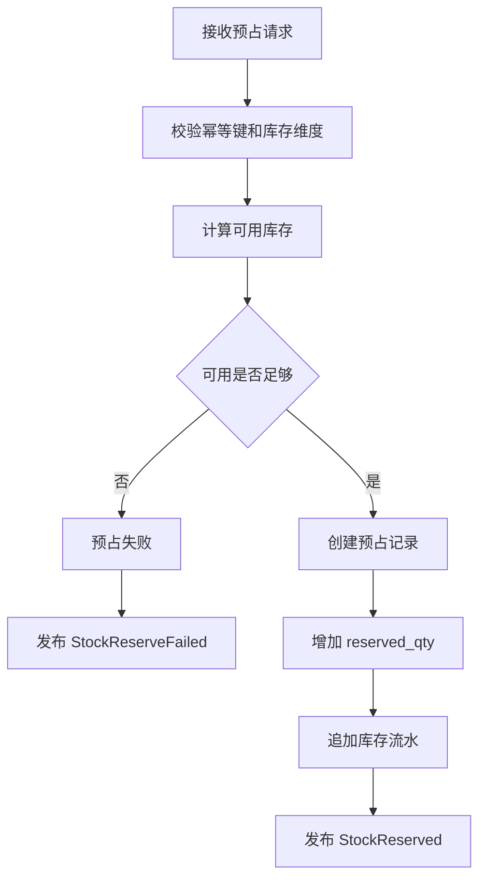
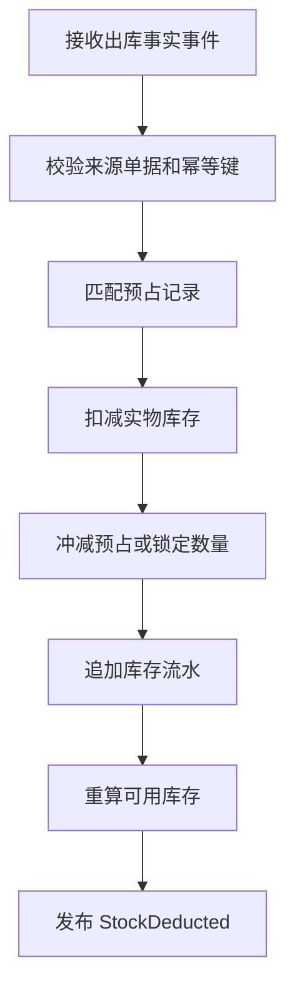
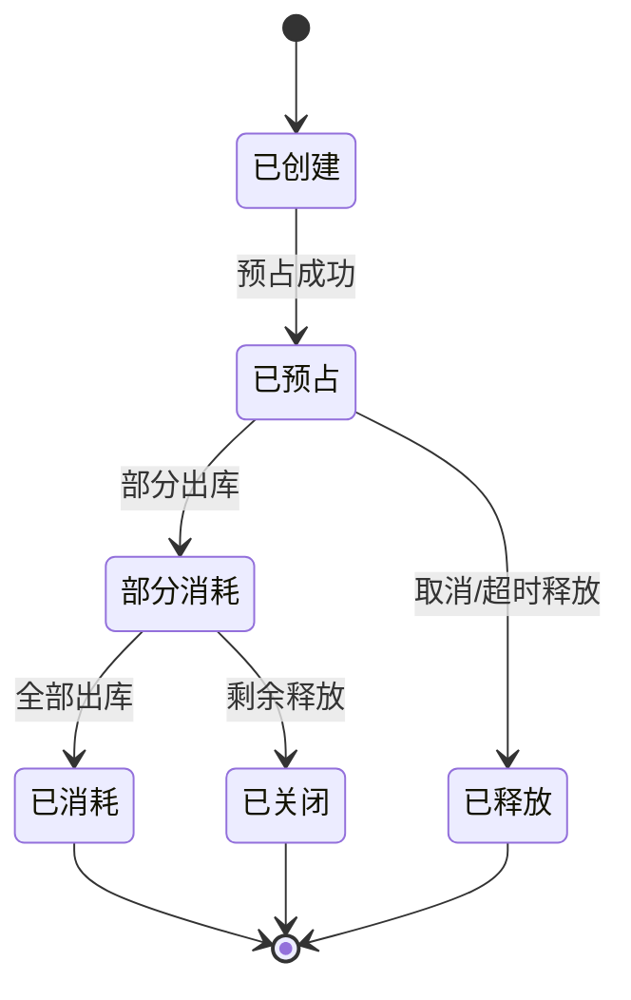
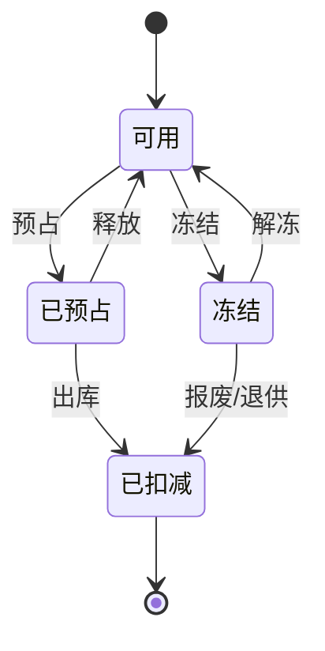

# 33 中央库存系统功能设计

> 中央库存系统负责库存余额、可用库存、预占、扣减、释放、流水和库存查询。本文聚焦中央库存自身功能、角色、状态和事件。

## 1. 系统定位

| 边界 | 说明 |
| --- | --- |
| 负责 | 库存余额、可用库存、预占、释放、扣减、入库增加、冻结、调整、库存流水 |
| 不负责 | 仓库实物作业、销售订单审单、采购订单审批 |
| 核心数据 | 库存余额、库存流水、预占记录、库存事件、库存维度 |

## 2. 使用角色

| 角色 | 使用功能 | 典型动作 |
| --- | --- | --- |
| 库存运营 | 库存查询、冻结、调整 | 查询可用、冻结异常库存 |
| 仓储运营 | 库存对账 | 对比 WMS 库存和中央库存 |
| OMS/系统调用方 | 预占/释放/扣减 | 销售履约调用 |
| 采购/售后/调拨系统 | 入库/出库事实同步 | 消费库存结果 |
| 财务/审计 | 流水追溯 | 查看库存变化原因 |

## 3. 功能地图

| 模块 | 功能 | 说明 |
| --- | --- | --- |
| 库存查询 | 按 SKU、仓库、货主、批次、状态查询 | 对外读模型 |
| 可用计算 | 实物、冻结、预占、在途、不可售 | 统一 ATP 口径 |
| 预占管理 | 销售预占、调拨预占、退供锁定 | 物理移动前承诺库存 |
| 库存扣减 | 销售出库、退供出库、报废 | 基于事实扣减 |
| 库存增加 | 采购入库、退货入库、调拨入库 | 基于事实增加 |
| 冻结/解冻 | 质检、不良、盘点、风控 | 改变库存可用性 |
| 调整 | 盘盈盘亏、差异修正 | 需要审批和审计 |
| 流水台账 | 只追加库存流水 | 追溯数量变化 |

## 4. 核心操作流程

### 4.1 库存预占流程

### 4.2 出库扣减流程

## 5. 数据状态机

### 5.1 预占记录状态

### 5.2 库存状态

## 6. 生产事件

| 事件 | 触发动作 | 关键载荷 |
| --- | --- | --- |
| `StockReserved` | 预占成功 | `reservation_id`、`source_order_id`、`sku_id`、`qty` |
| `StockReserveFailed` | 预占失败 | `source_order_id`、`reason_code`、`short_qty` |
| `StockReleased` | 释放成功 | `reservation_id`、`released_qty` |
| `StockDeducted` | 出库扣减 | `source_order_id`、`ledger_id`、`deducted_qty` |
| `StockIncreased` | 入库增加 | `source_order_id`、`ledger_id`、`increased_qty` |
| `StockFrozen` | 冻结库存 | `freeze_id`、`sku_id`、`qty` |
| `StockAdjusted` | 库存调整 | `adjustment_id`、`adjust_qty`、`reason_code` |
| `InventoryLedgerCreated` | 追加流水 | `ledger_id`、`ledger_type`、`before_qty`、`after_qty` |

## 7. 消费事件

| 事件 | 来源 | 消费后数据变化 |
| --- | --- | --- |
| `SkuEnabled` | 主数据系统 | 初始化 SKU 库存维度规则 |
| `WarehouseEnabled` | 主数据系统 | 初始化仓库库存维度 |
| `OwnerEnabled` | 主数据系统 | 初始化货主库存维度 |
| `OutboundShipped` | WMS | 扣减销售出库库存，消耗预占 |
| `InboundPutawayCompleted` | WMS | 增加采购/退货入库库存 |
| `TransferOutShipped` | WMS | 扣减调出仓库存，生成在途 |
| `TransferInReceived` | WMS | 增加调入仓库存，冲减在途 |
| `SupplierReturnShipped` | WMS | 扣减退供库存，消耗退供锁定 |
| `InventoryAdjustmentApproved` | 权限/审批 | 执行库存调整 |

## 8. 事件处理规则

| 规则 | 说明 |
| --- | --- |
| 只追加流水 | 库存流水不可物理修改，只能红冲或调整 |
| 幂等 | 来源系统 + 来源单据 + 动作类型 + 版本号防重 |
| 维度一致 | SKU、仓库、货主、批次、状态必须可唯一定位库存余额 |
| 可用口径 | 可用 = 实物 - 冻结 - 预占 - 不可售，具体按库存状态模型计算 |

## DDD 对齐说明

本文属于 **中央库存上下文**。设计时应把页面、字段和流程统一回到该上下文的模型边界，避免跨上下文直接修改数据。

| DDD 项 | 对齐口径 |
| --- | --- |
| 限界上下文 | 中央库存上下文 |
| 核心聚合 | InventoryAccount、InventoryReservation、InventoryLedger、InventoryAdjustment |
| 数据主权 | 可用库存、预占、释放、扣减、冻结和流水 |
| 生产事件 | 只发布本上下文已经发生的业务事实 |
| 消费事件 | 消费外部事实时必须记录 event_id、幂等键、处理状态和失败原因 |
| 查询模型 | 列表、看板、导出可使用读模型，不强行加载聚合 |

## 9. 继续上下文

当前结论：中央库存是数量事实系统，所有业务系统都通过命令或事件改变库存余额和流水。

关键假设：库存系统不负责仓库实物动作，只消费 WMS 事实事件。
