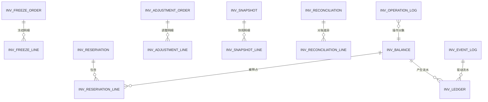
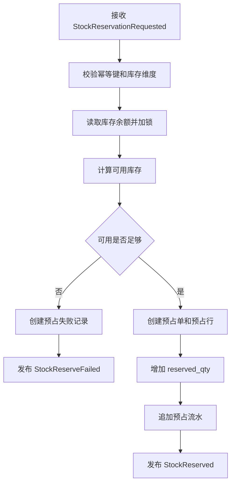
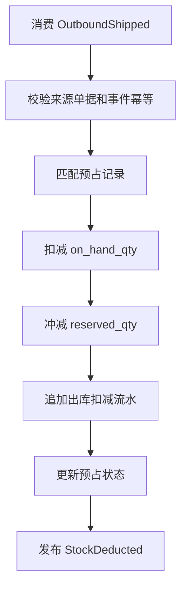
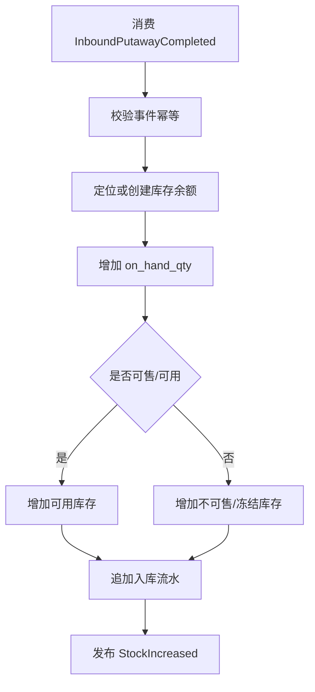
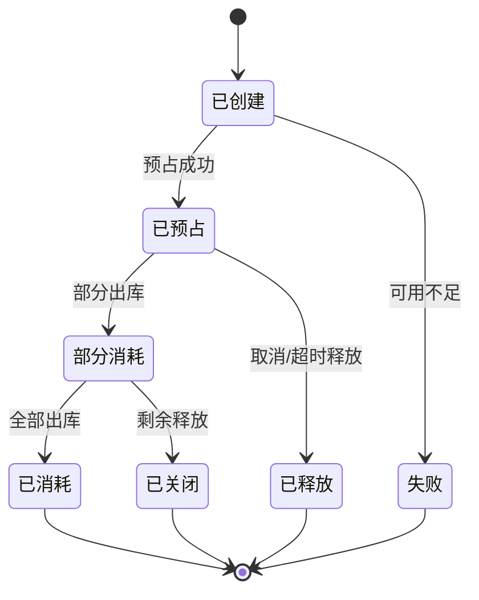
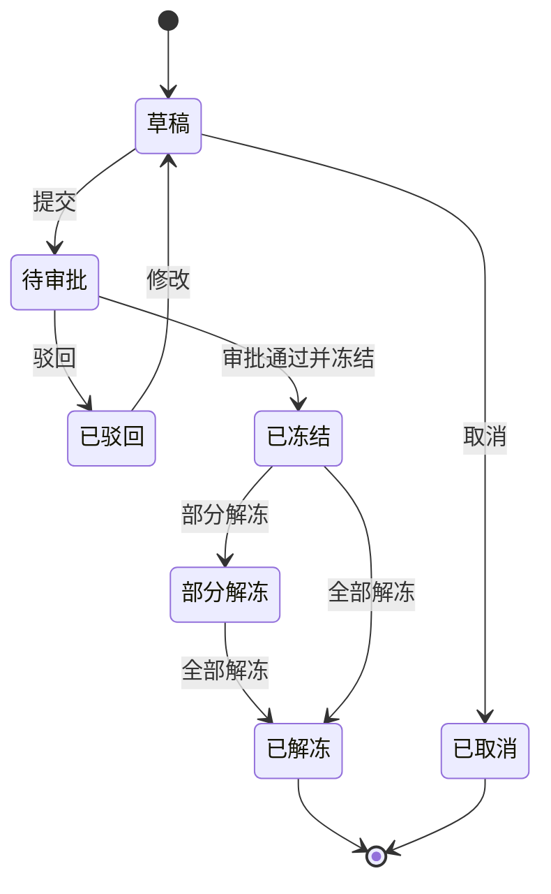
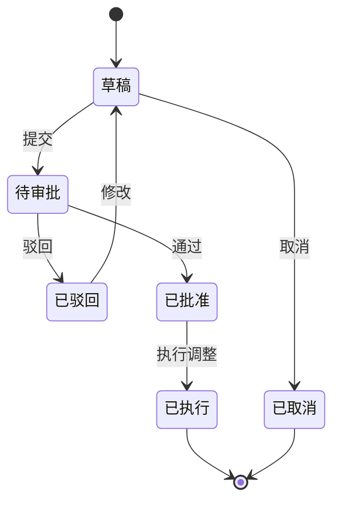

# 44 中央库存系统详细设计

> 本文承接 [中央库存系统功能设计](./33-中央库存系统功能设计.md)，按 [权限系统详细设计](../权限系统/38-权限系统详细设计.md) 的模式细化库存余额、可用库存、预占、释放、扣减、冻结、调整、库存流水、库存快照、权限点、枚举、事件和操作日志。当前版本是系统设计级字段模型，不是最终数据库 DDL。

## 1. 设计目标

中央库存系统要统一回答五个问题：

| 问题 | 设计对象 |
| --- | --- |
| 某个 SKU 现在有多少库存 | 库存余额、库存维度、库存状态 |
| 现在能承诺多少库存 | 可用库存、预占数量、冻结数量、不可售数量 |
| 哪些订单占用了库存 | 预占单、预占行、来源单据、超时释放 |
| 库存为什么变化 | 库存流水、业务事件、调整单、红冲记录 |
| 库存是否和仓库一致 | WMS 对账、库存快照、盘点差异、修正记录 |

核心原则：

| 原则 | 说明 |
| --- | --- |
| 中央库存是数量账本 | 统一管理可用、预占、冻结、扣减、增加和流水 |
| 不做仓内实物作业 | 收货、拣货、上架、发货由 WMS 执行，中央库存消费事实事件 |
| 库存流水只追加 | 流水不可物理修改，错误通过红冲或调整修正 |
| 幂等优先 | 来源系统、来源单据、动作类型、版本号必须防重复 |
| 可用口径统一 | 对外查询和预占必须使用同一套可用库存计算规则 |

## 2. 总体模型

## 3. 功能页面

| 页面 | 主要用途 | 展示字段 | 主要操作 |
| --- | --- | --- | --- |
| 库存工作台 | 展示库存异常、预占失败、对账差异、调整待审 | 缺货数、预占失败、冻结数、差异数 | 查看待办、进入处理 |
| 库存余额页 | 查询 SKU/仓库/货主/批次库存 | SKU、仓库、批次、实物、可用、预占、冻结 | 查询、导出 |
| 可用库存页 | 给 OMS、采购、调拨查看 ATP | SKU、仓库、可用数量、预计入库、在途 | 查询、导出 |
| 预占管理页 | 查看和处理库存预占 | 预占单号、来源单、SKU、预占数量、状态 | 释放、关闭、重试 |
| 冻结解冻页 | 冻结异常库存或解冻 | 冻结单号、原因、SKU、数量、状态 | 新增、提交、审批、解冻 |
| 库存调整页 | 处理盘盈盘亏、差异修正 | 调整单号、原因、数量、审批状态 | 新增、提交、审批、执行 |
| 库存流水页 | 追溯库存变化原因 | 流水号、类型、前数量、后数量、来源单 | 查询、导出 |
| 库存快照页 | 生成日结或月结库存快照 | 快照日期、仓库、SKU 数、状态 | 生成、重算、导出 |
| 库存对账页 | 对比中央库存和 WMS 库存 | 仓库、SKU、中央数、WMS 数、差异 | 生成、确认、调整 |
| 事件日志页 | 查看消费事件和幂等结果 | 事件 ID、来源、动作、处理状态、失败原因 | 重放、忽略 |
| 参数配置页 | 维护可用口径、预占超时、库存维度 | 参数编码、参数值、状态 | 新增、编辑、启停 |
| 操作日志页 | 查询库存关键操作 | 操作人、对象、动作、时间、结果 | 查询、导出 |
| 枚举配置页 | 维护库存系统枚举项 | 枚举类型、枚举值、标签、状态 | 新增、编辑、排序、停用 |

## 4. 核心流程

### 4.1 库存预占流程

### 4.2 出库扣减流程

### 4.3 入库增加流程

## 5. 字段模型

### 5.1 库存余额 `inv_balance`

| 字段 | 类型 | 是否必填 | 枚举/约束 | 说明 |
| --- | --- | --- | --- | --- |
| `balance_id` | bigint | 是 | 主键 | 库存余额 ID |
| `warehouse_id` | bigint | 是 | 外键 | 仓库 |
| `owner_id` | bigint | 否 | 外键 | 货主 |
| `sku_id` | bigint | 是 | 外键 | SKU |
| `batch_no` | varchar(128) | 否 |  | 批次 |
| `stock_status` | varchar(32) | 是 | `INV_STOCK_STATUS` | 可用、冻结、不合格、在途、待退供 |
| `on_hand_qty` | decimal(18,4) | 是 | >= 0 | 实物数量 |
| `available_qty` | decimal(18,4) | 是 | >= 0 | 可用数量 |
| `reserved_qty` | decimal(18,4) | 是 | 默认 0 | 预占数量 |
| `frozen_qty` | decimal(18,4) | 是 | 默认 0 | 冻结数量 |
| `in_transit_qty` | decimal(18,4) | 是 | 默认 0 | 在途数量 |
| `version_no` | bigint | 是 | 乐观锁 | 版本号 |
| `updated_at` | datetime | 否 |  | 更新时间 |

对应页面：`库存余额页`

展示字段：仓库、货主、SKU、批次、库存状态、实物、可用、预占、冻结、在途。

### 5.2 预占单 `inv_reservation`

| 字段 | 类型 | 是否必填 | 枚举/约束 | 说明 |
| --- | --- | --- | --- | --- |
| `reservation_id` | bigint | 是 | 主键 | 预占单 ID |
| `reservation_no` | varchar(64) | 是 | 唯一 | 预占单号 |
| `source_system` | varchar(32) | 是 | `SOURCE_SYSTEM` | OMS、调拨、采购等 |
| `source_order_no` | varchar(64) | 是 | 幂等组合 | 来源单号 |
| `reservation_type` | varchar(32) | 是 | `RESERVATION_TYPE` | 销售、调拨、退供 |
| `reservation_status` | varchar(32) | 是 | `RESERVATION_STATUS` | 已创建、已预占、部分消耗、已消耗、已释放、已关闭、失败 |
| `expire_at` | datetime | 否 |  | 预占过期时间 |
| `created_at` | datetime | 是 |  | 创建时间 |
| `updated_at` | datetime | 否 |  | 更新时间 |

对应页面：`预占管理页`

展示字段：预占单号、来源系统、来源单号、类型、状态、过期时间、创建时间。

### 5.3 预占行 `inv_reservation_line`

| 字段 | 类型 | 是否必填 | 枚举/约束 | 说明 |
| --- | --- | --- | --- | --- |
| `reservation_line_id` | bigint | 是 | 主键 | 预占行 ID |
| `reservation_id` | bigint | 是 | 外键 | 预占单 |
| `balance_id` | bigint | 是 | 外键 | 库存余额 |
| `warehouse_id` | bigint | 是 | 外键 | 仓库 |
| `sku_id` | bigint | 是 | 外键 | SKU |
| `batch_no` | varchar(128) | 否 |  | 批次 |
| `requested_qty` | decimal(18,4) | 是 | > 0 | 请求预占数量 |
| `reserved_qty` | decimal(18,4) | 是 | 默认 0 | 成功预占数量 |
| `consumed_qty` | decimal(18,4) | 是 | 默认 0 | 已消耗数量 |
| `released_qty` | decimal(18,4) | 是 | 默认 0 | 已释放数量 |
| `line_status` | varchar(32) | 是 | `RESERVATION_LINE_STATUS` | 已预占、部分消耗、已消耗、已释放、失败 |

### 5.4 库存流水 `inv_ledger`

| 字段 | 类型 | 是否必填 | 枚举/约束 | 说明 |
| --- | --- | --- | --- | --- |
| `ledger_id` | bigint | 是 | 主键 | 流水 ID |
| `ledger_no` | varchar(64) | 是 | 唯一 | 流水号 |
| `balance_id` | bigint | 是 | 外键 | 库存余额 |
| `ledger_type` | varchar(32) | 是 | `LEDGER_TYPE` | 入库、出库、预占、释放、冻结、解冻、调整、红冲 |
| `change_direction` | varchar(16) | 是 | `CHANGE_DIRECTION` | 增加、减少、占用、释放 |
| `qty_delta` | decimal(18,4) | 是 | 可正可负 | 变化数量 |
| `before_on_hand_qty` | decimal(18,4) | 是 |  | 变化前实物 |
| `after_on_hand_qty` | decimal(18,4) | 是 |  | 变化后实物 |
| `before_available_qty` | decimal(18,4) | 是 |  | 变化前可用 |
| `after_available_qty` | decimal(18,4) | 是 |  | 变化后可用 |
| `source_system` | varchar(32) | 是 | `SOURCE_SYSTEM` | 来源系统 |
| `source_order_no` | varchar(64) | 是 |  | 来源单号 |
| `event_id` | varchar(128) | 是 | 幂等 | 事件 ID |
| `created_at` | datetime | 是 |  | 创建时间 |

对应页面：`库存流水页`

展示字段：流水号、类型、方向、变化数量、变化前后数量、来源系统、来源单号、创建时间。

### 5.5 冻结单 `inv_freeze_order`

| 字段 | 类型 | 是否必填 | 枚举/约束 | 说明 |
| --- | --- | --- | --- | --- |
| `freeze_id` | bigint | 是 | 主键 | 冻结单 ID |
| `freeze_no` | varchar(64) | 是 | 唯一 | 冻结单号 |
| `freeze_reason` | varchar(64) | 是 | `FREEZE_REASON` | 质检、盘点、风控、异常、人工 |
| `freeze_status` | varchar(32) | 是 | `FREEZE_STATUS` | 草稿、待审批、已冻结、部分解冻、已解冻、已取消 |
| `approval_status` | varchar(32) | 是 | `APPROVAL_STATUS` | 草稿、待审批、已批准、已驳回 |
| `created_by` | bigint | 是 |  | 创建人 |
| `created_at` | datetime | 是 |  | 创建时间 |

对应页面：`冻结解冻页`

展示字段：冻结单号、原因、冻结状态、审批状态、创建人、创建时间。

### 5.6 库存调整单 `inv_adjustment_order`

| 字段 | 类型 | 是否必填 | 枚举/约束 | 说明 |
| --- | --- | --- | --- | --- |
| `adjustment_id` | bigint | 是 | 主键 | 调整单 ID |
| `adjustment_no` | varchar(64) | 是 | 唯一 | 调整单号 |
| `adjustment_type` | varchar(32) | 是 | `ADJUSTMENT_TYPE` | 盘盈、盘亏、差异修正、红冲 |
| `adjustment_reason` | varchar(512) | 是 |  | 调整原因 |
| `adjustment_status` | varchar(32) | 是 | `ADJUSTMENT_STATUS` | 草稿、待审批、已批准、已执行、已驳回、已取消 |
| `approval_status` | varchar(32) | 是 | `APPROVAL_STATUS` | 草稿、待审批、已批准、已驳回 |
| `created_by` | bigint | 是 |  | 创建人 |
| `created_at` | datetime | 是 |  | 创建时间 |
| `executed_at` | datetime | 否 |  | 执行时间 |

对应页面：`库存调整页`

展示字段：调整单号、类型、原因、调整状态、审批状态、创建人、执行时间。

### 5.7 库存快照 `inv_snapshot`

| 字段 | 类型 | 是否必填 | 枚举/约束 | 说明 |
| --- | --- | --- | --- | --- |
| `snapshot_id` | bigint | 是 | 主键 | 快照 ID |
| `snapshot_no` | varchar(64) | 是 | 唯一 | 快照号 |
| `snapshot_date` | date | 是 | 唯一组合 | 快照日期 |
| `warehouse_id` | bigint | 否 | 外键 | 仓库 |
| `snapshot_type` | varchar(32) | 是 | `SNAPSHOT_TYPE` | 日结、月结、手工 |
| `snapshot_status` | varchar(32) | 是 | `SNAPSHOT_STATUS` | 生成中、已生成、失败、已关闭 |
| `created_at` | datetime | 是 |  | 创建时间 |

对应页面：`库存快照页`

展示字段：快照号、快照日期、仓库、类型、状态、创建时间。

### 5.8 库存对账单 `inv_reconciliation`

| 字段 | 类型 | 是否必填 | 枚举/约束 | 说明 |
| --- | --- | --- | --- | --- |
| `reconciliation_id` | bigint | 是 | 主键 | 对账单 ID |
| `reconciliation_no` | varchar(64) | 是 | 唯一 | 对账单号 |
| `warehouse_id` | bigint | 是 | 外键 | 仓库 |
| `recon_date` | date | 是 |  | 对账日期 |
| `recon_status` | varchar(32) | 是 | `RECON_STATUS` | 草稿、对账中、有差异、已确认、已关闭 |
| `diff_count` | int | 是 | 默认 0 | 差异行数 |
| `created_by` | bigint | 是 |  | 创建人 |
| `created_at` | datetime | 是 |  | 创建时间 |

对应页面：`库存对账页`

展示字段：对账单号、仓库、对账日期、状态、差异行数、创建人。

### 5.9 库存事件日志 `inv_event_log`

| 字段 | 类型 | 是否必填 | 枚举/约束 | 说明 |
| --- | --- | --- | --- | --- |
| `event_log_id` | bigint | 是 | 主键 | 事件日志 ID |
| `event_id` | varchar(128) | 是 | 唯一 | 事件 ID |
| `event_name` | varchar(128) | 是 |  | 事件名称 |
| `source_system` | varchar(32) | 是 | `SOURCE_SYSTEM` | 来源系统 |
| `source_order_no` | varchar(64) | 否 |  | 来源单号 |
| `process_status` | varchar(32) | 是 | `EVENT_PROCESS_STATUS` | 待处理、成功、失败、已忽略 |
| `fail_reason` | varchar(1024) | 否 |  | 失败原因 |
| `received_at` | datetime | 是 |  | 接收时间 |
| `processed_at` | datetime | 否 |  | 处理时间 |

对应页面：`事件日志页`

展示字段：事件 ID、事件名称、来源系统、来源单号、处理状态、失败原因、接收时间。

### 5.10 库存操作日志 `inv_operation_log`

| 字段 | 类型 | 是否必填 | 枚举/约束 | 说明 |
| --- | --- | --- | --- | --- |
| `log_id` | bigint | 是 | 主键 | 日志 ID |
| `operator_id` | bigint | 是 |  | 操作人 |
| `object_type` | varchar(64) | 是 | `INV_OBJECT_TYPE` | 余额、预占、冻结、调整、对账、快照、参数 |
| `object_id` | bigint | 是 |  | 对象 ID |
| `action_type` | varchar(64) | 是 | `INV_ACTION_TYPE` | 查询、预占、释放、冻结、解冻、调整、确认 |
| `before_snapshot` | text | 否 | JSON | 变更前摘要 |
| `after_snapshot` | text | 否 | JSON | 变更后摘要 |
| `result` | varchar(32) | 是 | `OPERATION_RESULT` | 成功、失败 |
| `fail_reason` | varchar(512) | 否 |  | 失败原因 |
| `created_at` | datetime | 是 |  | 操作时间 |

对应页面：`操作日志页`

展示字段：操作人、对象类型、对象 ID、动作、结果、失败原因、操作时间。

## 6. 枚举定义

| 枚举类型 | 枚举值 | 说明 |
| --- | --- | --- |
| `INV_STOCK_STATUS` | `AVAILABLE`、`FROZEN`、`UNQUALIFIED`、`IN_TRANSIT`、`PENDING_SUPPLIER_RETURN` | 库存状态 |
| `RESERVATION_TYPE` | `SALES`、`TRANSFER`、`SUPPLIER_RETURN` | 预占类型 |
| `RESERVATION_STATUS` | `CREATED`、`RESERVED`、`PART_CONSUMED`、`CONSUMED`、`RELEASED`、`CLOSED`、`FAILED` | 预占单状态 |
| `RESERVATION_LINE_STATUS` | `RESERVED`、`PART_CONSUMED`、`CONSUMED`、`RELEASED`、`FAILED` | 预占行状态 |
| `LEDGER_TYPE` | `INBOUND`、`OUTBOUND`、`RESERVE`、`RELEASE`、`FREEZE`、`UNFREEZE`、`ADJUST`、`REVERSE` | 流水类型 |
| `CHANGE_DIRECTION` | `INCREASE`、`DECREASE`、`OCCUPY`、`RELEASE` | 变化方向 |
| `FREEZE_REASON` | `QC`、`COUNT`、`RISK`、`EXCEPTION`、`MANUAL` | 冻结原因 |
| `FREEZE_STATUS` | `DRAFT`、`PENDING_APPROVAL`、`FROZEN`、`PART_UNFROZEN`、`UNFROZEN`、`CANCELLED` | 冻结状态 |
| `ADJUSTMENT_TYPE` | `COUNT_GAIN`、`COUNT_LOSS`、`DIFF_FIX`、`REVERSE` | 调整类型 |
| `ADJUSTMENT_STATUS` | `DRAFT`、`PENDING_APPROVAL`、`APPROVED`、`EXECUTED`、`REJECTED`、`CANCELLED` | 调整状态 |
| `SNAPSHOT_TYPE` | `DAILY`、`MONTHLY`、`MANUAL` | 快照类型 |
| `SNAPSHOT_STATUS` | `GENERATING`、`GENERATED`、`FAILED`、`CLOSED` | 快照状态 |
| `RECON_STATUS` | `DRAFT`、`PROCESSING`、`DIFF_FOUND`、`CONFIRMED`、`CLOSED` | 对账状态 |
| `EVENT_PROCESS_STATUS` | `PENDING`、`SUCCESS`、`FAILED`、`IGNORED` | 事件处理状态 |
| `APPROVAL_STATUS` | `DRAFT`、`PENDING`、`APPROVED`、`REJECTED` | 审批状态 |
| `SOURCE_SYSTEM` | `OMS`、`WMS`、`PURCHASE`、`TRANSFER`、`MDM`、`BMS` | 来源系统 |

枚举配置建议：冻结原因、调整类型、对账状态、事件处理状态可页面配置标签；预占状态、流水类型、库存状态属于核心账本枚举，只建议配置中文标签、颜色和排序。

## 7. 权限点设计

| 页面 | 路由建议 | 查询权限 | 操作权限 |
| --- | --- | --- | --- |
| 库存工作台 | `/inventory/workbench` | `inventory:workbench:read` |  |
| 库存余额页 | `/inventory/balances` | `inventory:balance:read` | `inventory:balance:export` |
| 可用库存页 | `/inventory/available` | `inventory:available:read` | `inventory:available:export` |
| 预占管理页 | `/inventory/reservations` | `inventory:reservation:read` | `inventory:reservation:release`、`inventory:reservation:close`、`inventory:reservation:retry` |
| 冻结解冻页 | `/inventory/freezes` | `inventory:freeze:read` | `inventory:freeze:create`、`inventory:freeze:submit`、`inventory:freeze:approve`、`inventory:freeze:unfreeze` |
| 库存调整页 | `/inventory/adjustments` | `inventory:adjustment:read` | `inventory:adjustment:create`、`inventory:adjustment:submit`、`inventory:adjustment:approve`、`inventory:adjustment:execute` |
| 库存流水页 | `/inventory/ledgers` | `inventory:ledger:read` | `inventory:ledger:export` |
| 库存快照页 | `/inventory/snapshots` | `inventory:snapshot:read` | `inventory:snapshot:generate`、`inventory:snapshot:recalculate`、`inventory:snapshot:export` |
| 库存对账页 | `/inventory/reconciliations` | `inventory:recon:read` | `inventory:recon:generate`、`inventory:recon:confirm`、`inventory:recon:create_adjustment` |
| 事件日志页 | `/inventory/event-logs` | `inventory:event_log:read` | `inventory:event_log:replay`、`inventory:event_log:ignore` |
| 参数配置页 | `/inventory/settings` | `inventory:setting:read` | `inventory:setting:create`、`inventory:setting:update`、`inventory:setting:disable` |
| 操作日志页 | `/inventory/operation-logs` | `inventory:operation_log:read` | `inventory:operation_log:export` |
| 枚举配置页 | `/inventory/enums` | `inventory:enum:read` | `inventory:enum:create`、`inventory:enum:update`、`inventory:enum:disable` |

## 8. 生产事件

| 事件 | 触发动作 | 关键载荷 |
| --- | --- | --- |
| `StockReserved` | 预占成功 | `reservation_no`、`source_order_no`、`warehouse_id`、`lines` |
| `StockReserveFailed` | 预占失败 | `source_order_no`、`reason_code`、`short_qty` |
| `StockReleased` | 释放成功 | `reservation_no`、`released_qty` |
| `StockDeducted` | 出库扣减 | `source_order_no`、`ledger_id`、`deducted_qty` |
| `StockIncreased` | 入库增加 | `source_order_no`、`ledger_id`、`increased_qty` |
| `StockFrozen` | 冻结库存 | `freeze_no`、`warehouse_id`、`sku_id`、`qty` |
| `StockAdjusted` | 库存调整 | `adjustment_no`、`adjustment_type`、`adjust_qty` |
| `InventoryLedgerCreated` | 追加流水 | `ledger_id`、`ledger_type`、`before_qty`、`after_qty` |
| `StockDailySnapshotCreated` | 快照生成 | `snapshot_date`、`warehouse_id`、`snapshot_no` |

## 9. 消费事件

| 事件 | 来源 | 消费后数据变化 |
| --- | --- | --- |
| `SkuEnabled` | 主数据系统 | 初始化 SKU 库存维度规则 |
| `WarehouseEnabled` | 主数据系统 | 初始化仓库库存维度 |
| `OwnerEnabled` | 主数据系统 | 初始化货主库存维度 |
| `StockReservationRequested` | OMS/调拨/采购 | 创建预占单，成功后增加预占数量 |
| `StockReleaseRequested` | OMS/调拨/采购 | 释放预占，恢复可用数量 |
| `OutboundShipped` | WMS | 扣减销售/调拨/退供出库库存，消耗预占 |
| `InboundPutawayCompleted` | WMS | 增加采购/退货/调拨入库库存 |
| `InboundRejectedStored` | WMS | 增加不合格或待退供库存，不进入可用 |
| `InventoryCountDiffCreated` | WMS | 生成库存调整待办 |
| `InventoryAdjustmentApproved` | 审批/权限 | 执行库存调整 |

## 10. 状态机

### 10.1 预占单状态

### 10.2 冻结单状态

### 10.3 调整单状态

## 11. 操作日志策略

必须记录日志的动作：

| 动作 | 日志内容 |
| --- | --- |
| 预占/释放/关闭 | 来源单、SKU、仓库、数量、结果、失败原因 |
| 出库扣减/入库增加 | 来源事件、流水、前后数量、幂等键 |
| 冻结/解冻 | 冻结原因、数量、审批结果、操作人 |
| 库存调整 | 调整原因、调整前后数量、审批和执行人 |
| 对账确认/生成调整 | 中央数量、WMS 数量、差异、处理结果 |
| 事件重放/忽略 | 事件 ID、来源、原因、处理人 |
| 参数变更 | 可用口径、预占超时、库存维度变化 |

日志保留建议：库存流水永久或长期保留；库存操作、调整、冻结、对账日志至少保留 5 年。

## DDD 对齐说明

本文属于 **中央库存上下文**。设计时应把页面、字段和流程统一回到该上下文的模型边界，避免跨上下文直接修改数据。

| DDD 项 | 对齐口径 |
| --- | --- |
| 限界上下文 | 中央库存上下文 |
| 核心聚合 | InventoryAccount、InventoryReservation、InventoryLedger、InventoryAdjustment |
| 数据主权 | 可用库存、预占、释放、扣减、冻结和流水 |
| 生产事件 | 只发布本上下文已经发生的业务事实 |
| 消费事件 | 消费外部事实时必须记录 event_id、幂等键、处理状态和失败原因 |
| 查询模型 | 列表、看板、导出可使用读模型，不强行加载聚合 |

## 12. 继续上下文

当前结论：中央库存详细设计围绕“余额 + 预占 + 扣减 + 增加 + 冻结 + 调整 + 流水 + 对账”展开，是供应链数量账本和可用库存口径中心。

关键假设：中央库存不执行仓内动作，只消费 WMS 实物事实和 OMS/调拨/采购请求；库存流水只追加，错误通过红冲或调整修正。

下一步建议：进入数据库设计时，优先落 `inv_balance`、`inv_reservation`、`inv_reservation_line`、`inv_ledger` 四张核心表。
