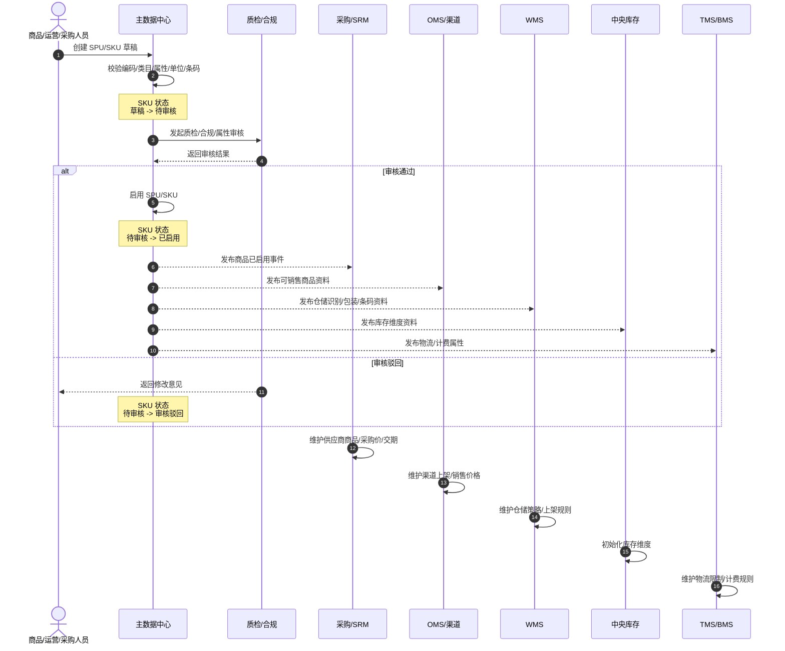
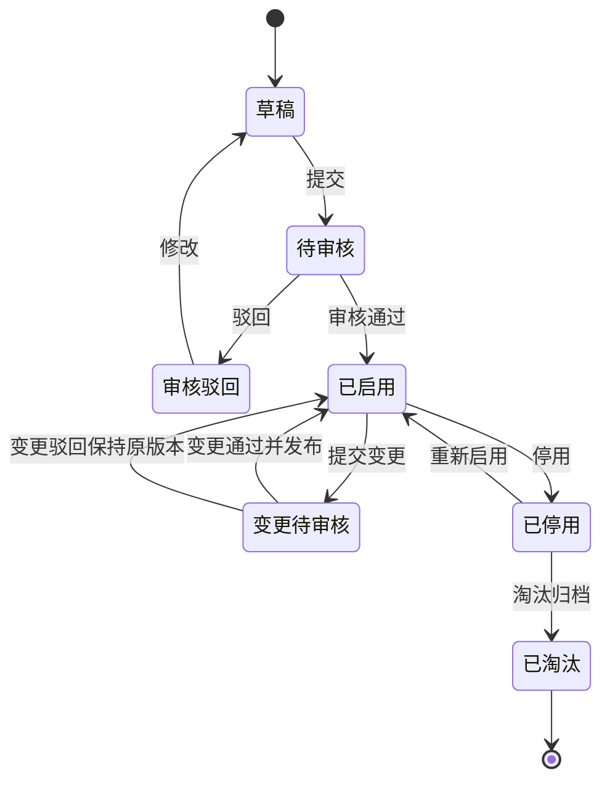
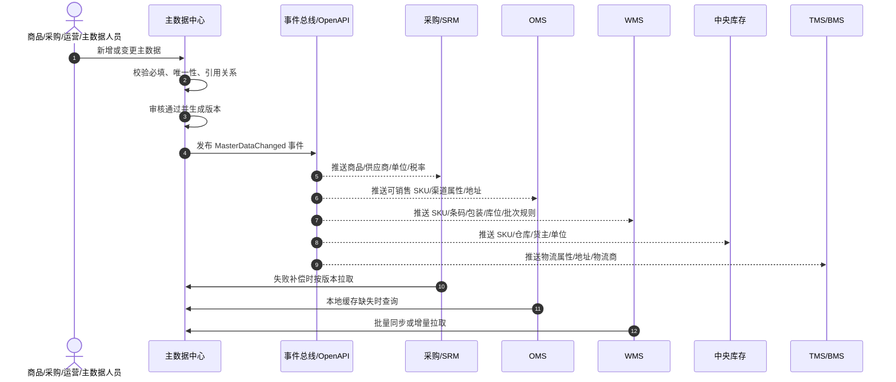

# 16 主数据支线流程

> 本文承接 [供应链系统业务流程总览](01-供应链系统业务流程总览.md) 和 [供应链系统核心业务闭环与边界图](02-供应链系统核心业务闭环与边界图.md)，先梳理主数据如何新增、何时新增、包含哪些内容、如何分发到各子系统，以及各子系统如何获取并使用。当前版本不深入数据库 DDL。

## 1. 主数据的定位

主数据是供应链系统的“共同语言”。采购、库存、仓储、订单、物流、结算这些系统能协同，是因为它们引用的是同一套商品、供应商、仓库、客户、组织、物流等基础资料。

```text
主数据建档
  -> 审核/启用
  -> 发布主数据事件
  -> 分发到采购/SRM/OMS/WMS/中央库存/TMS/BMS/财务
  -> 子系统引用主数据创建业务单据
  -> 主数据变更继续同步
```

主数据本身不承载采购、出入库、发货、结算流程，但它决定这些流程能否正确执行。

## 2. 主数据分类

| 主数据 | 作用 | 主要使用系统 |
| --- | --- | --- |
| SPU | 商品概念层，表示一个商品款式或产品族 | 商品中心、OMS、报表 |
| SKU | 可采购、可销售、可库存、可履约的最小商品单位 | 采购、OMS、WMS、库存、TMS、BMS |
| 商品类目/属性 | 决定商品属性模板、经营分类、仓储/物流规则 | 商品中心、OMS、WMS、TMS |
| 单位/包装 | 支撑采购单位、销售单位、库存单位、箱规、体积重量 | 采购、WMS、TMS、BMS |
| 条码/编码 | 支撑仓库扫描、平台映射、外部系统识别 | WMS、OMS、OpenAPI |
| 供应商 | 支撑采购、报价、合同、送货、应付 | 采购、SRM、财务 |
| 供应商商品 | 供应商能供哪些 SKU、供货价格、交期、MOQ | 采购、SRM、计划 |
| 客户/货主 | 支撑销售、仓储服务、多货主库存、计费 | OMS、WMS、库存、BMS |
| 仓库/门店 | 库存存放点、发货点、收货点 | 库存、WMS、OMS、TMS |
| 库区/库位 | 仓库内存储与作业位置 | WMS |
| 地址库 | 发货/收货地址、配送区域、行政区划 | OMS、TMS、WMS |
| 物流商/物流渠道 | 面单、轨迹、费用、运输服务 | TMS、OMS、WMS、BMS |
| 组织/公司 | 权限、财务主体、业务归属 | 全系统 |
| 税率/币种/结算规则 | 采购应付、销售应收、费用结算 | 采购、BMS、财务 |

## 3. SPU/SKU 新增时机

商品主数据通常在“业务单据发生之前”新增，否则采购、销售、仓储、库存都无法正确引用。

| 场景 | 是否需要先建 SPU/SKU | 原因 |
| --- | --- | --- |
| 新品准备销售 | 需要 | OMS/渠道需要 SKU、价格、图片、销售属性 |
| 新品准备采购 | 需要 | 采购订单必须引用可采购 SKU |
| 供应商新增可供商品 | 需要 | SRM/采购要维护供应商商品和供货条件 |
| 仓库首次收货 | 需要 | WMS 需要 SKU、条码、包装、上架规则 |
| 调拨已有商品 | 通常不需要新建 | 已有 SKU 可直接引用 |
| 售后退货 | 通常不需要新建 | 退货引用原销售 SKU |
| 组合品/套装品上线 | 需要新增或维护组合关系 | OMS 拆单、WMS 拣货、库存扣减需要组件关系 |
| 商品属性变化 | 不一定新建 | 若影响库存识别或销售识别，可能需要新 SKU |

关键规则：

| 规则 | 说明 |
| --- | --- |
| 没有 SKU 不允许采购 | 采购订单必须引用已启用 SKU |
| 没有 SKU 不允许入库 | WMS 无法收货、验收、上架和盘点 |
| 没有可销售 SKU 不允许上架销售 | OMS/渠道无法识别销售商品 |
| 商品关键识别属性变化要慎重 | 颜色、尺码、规格、版本、包装等影响履约识别时，通常应生成新 SKU |

## 4. SPU/SKU 新增内容

### 4.1 SPU 建档内容

SPU 更偏商品定义和经营视角。

| 字段组 | 内容 |
| --- | --- |
| 基础信息 | SPU 编码、商品名称、品牌、类目、商品类型 |
| 经营信息 | 上市状态、销售状态、生命周期、新品/常规/淘汰 |
| 属性模板 | 类目属性、销售属性、规格属性 |
| 图片/描述 | 主图、详情、卖点、说明 |
| 合规信息 | 资质、证书、禁售限制、特殊监管 |
| 关联关系 | 关联 SKU、替代品、组合品、配件 |

### 4.2 SKU 建档内容

SKU 是供应链系统真正高频引用的对象。

| 字段组 | 内容 |
| --- | --- |
| 基础识别 | SKU 编码、SKU 名称、所属 SPU、类目、品牌 |
| 规格属性 | 颜色、尺码、型号、容量、版本、包装规格 |
| 条码编码 | 条形码、外部平台编码、供应商编码、WMS 编码 |
| 单位换算 | 库存单位、采购单位、销售单位、换算率 |
| 包装信息 | 长宽高、重量、箱规、每箱数量、托盘规格 |
| 仓储属性 | 是否效期管理、批次管理、序列号管理、是否质检、存储条件 |
| 物流属性 | 是否易碎、是否液体、是否危险品、是否超大件、温控要求 |
| 采购属性 | 是否可采购、默认供应商、最小采购量、采购提前期 |
| 销售属性 | 是否可销售、销售渠道、上下架状态、限售规则 |
| 库存属性 | 安全库存、补货点、是否允许负库存、是否可调拨 |
| 财务属性 | 税率、成本口径、存货科目、收入/成本分类 |
| 状态信息 | 草稿、待审核、已启用、停用、淘汰 |

## 5. 商品主数据新增流程



### 5.1 商品主数据状态变化

| 实体 | 状态变化 |
| --- | --- |
| SPU | 草稿 -> 待审核 -> 已启用/审核驳回 -> 停用/淘汰 |
| SKU | 草稿 -> 待审核 -> 已启用/审核驳回 -> 停用/淘汰 |
| 供应商商品 | 待维护 -> 待确认 -> 已启用 |
| 渠道商品 | 待上架 -> 已上架 -> 已下架 |
| WMS 商品资料 | 待同步 -> 已同步 -> 已启用 |
| 库存维度 | 待初始化 -> 已初始化 |

## 6. 其它主数据新增时机与内容

### 6.1 供应商主数据

| 何时新增 | 新增内容 | 使用系统 |
| --- | --- | --- |
| 新供应商准入、询价前、采购下单前 | 供应商编码、名称、资质、联系人、地址、结算方式、账期、税号、收款账户、可供品类 | 采购、SRM、财务 |

流程：

```text
供应商邀请/注册 -> 资质提交 -> 采购/质检/财务审核 -> 合格供应商 -> 分发采购/SRM/财务
```

### 6.2 仓库/库位主数据

| 何时新增 | 新增内容 | 使用系统 |
| --- | --- | --- |
| 新仓开仓、门店启用、海外仓接入、库内布局调整 | 仓库编码、仓库类型、地址、联系人、时区、库区、库位、容量、温区、作业能力 | WMS、库存、OMS、TMS |

流程：

```text
仓库建档 -> 库区/库位建档 -> 作业规则配置 -> 启用仓库 -> 分发 OMS/库存/WMS/TMS
```

### 6.3 客户/货主主数据

| 何时新增 | 新增内容 | 使用系统 |
| --- | --- | --- |
| 新 B2B 客户、新货主入仓、新渠道客户接入 | 客户编码、名称、结算主体、地址、合同、账期、计费规则、数据权限 | OMS、WMS、库存、BMS、财务 |

### 6.4 物流商/物流渠道主数据

| 何时新增 | 新增内容 | 使用系统 |
| --- | --- | --- |
| 接入新快递/三方物流/干线承运商/海外尾程 | 物流商编码、渠道产品、服务区域、计费规则、面单模板、轨迹接口、禁运规则 | TMS、OMS、WMS、BMS |

### 6.5 地址/区域主数据

| 何时新增 | 新增内容 | 使用系统 |
| --- | --- | --- |
| 新区域配送、新仓覆盖范围、行政区划更新 | 国家、省市区、邮编、经纬度、配送区域、偏远规则、禁运区域 | OMS、TMS、WMS |

### 6.6 组织/权限主数据

| 何时新增 | 新增内容 | 使用系统 |
| --- | --- | --- |
| 新公司、新部门、新业务线、新仓团队、新货主入驻 | 公司、组织、岗位、角色、数据权限、仓库权限、货主权限 | 全系统 |

## 7. 主数据分发方式

| 方式 | 适用场景 | 说明 |
| --- | --- | --- |
| 事件推送 | 新增、启用、停用、关键字段变更 | 主数据中心发布 `MasterDataChanged` 事件 |
| API 拉取 | 子系统初始化、补偿同步、定时校验 | 子系统按更新时间或版本号拉取 |
| 批量导出/导入 | 历史数据迁移、大批量建档 | 需要校验和错误报告 |
| 缓存读取 | 高频查询，如 SKU、仓库、地址 | 子系统本地缓存，按事件刷新 |

推荐组合：

```text
主数据中心负责权威数据
  -> 事件推送保证及时
  -> API 拉取保证补偿
  -> 子系统本地缓存保证性能
```

## 8. 子系统如何使用主数据

| 子系统 | 如何获取 | 如何使用 |
| --- | --- | --- |
| 采购系统 | 接收商品、供应商、供应商商品、单位、税率 | 创建采购申请、询价、维价、采购订单 |
| SRM | 接收供应商、商品、采购订单引用数据 | 供应商报价、确认订单、预约送货 |
| OMS | 接收可销售 SKU、渠道商品、地址、仓库、物流规则 | 接单、拆合单、分仓、售后 |
| WMS | 接收 SKU、条码、包装、库位、批次/效期规则 | 收货、验收、上架、拣货、复核、盘点 |
| 中央库存 | 接收 SKU、仓库、货主、单位、批次规则 | 建库存维度、预占、扣减、调拨、流水 |
| TMS | 接收物流商、物流渠道、地址、商品物流属性 | 物流下单、面单、轨迹、禁运校验 |
| BMS | 接收客户/货主、仓库、物流商、商品计费属性 | 仓储费、操作费、物流费、账单 |
| 财务 | 接收供应商、客户、税率、币种、组织 | 应付、应收、发票、成本 |
| 报表 | 接收全量主数据维度 | 统计分析、绩效、成本归因 |

## 9. 主数据变更规则

主数据不是只能新增，还会变更。关键是区分“可直接修改”和“需要新版本/新 SKU”。

| 变更类型 | 处理建议 |
| --- | --- |
| 名称、描述、图片 | 可直接变更，并同步子系统 |
| 类目、品牌 | 可变更但要审批，影响报表和规则 |
| 条码 | 谨慎变更，已入库/已销售后建议保留历史条码 |
| 单位换算 | 高风险，已发生库存后不建议直接改，建议新版本或新 SKU |
| 规格属性 | 若影响销售/库存识别，应新建 SKU |
| 重量/体积 | 可变更，但要同步 WMS/TMS/BMS，影响物流和计费 |
| 是否效期/批次管理 | 高风险，启用后影响 WMS 和库存台账 |
| 供应商供货关系 | 可维护生效/失效时间，影响采购 |
| 仓库状态 | 停用前要校验是否有库存、在途、未完成单据 |

## 10. 主数据状态机



## 11. 主数据分发时序图



## 12. 第一版建设优先级

| 优先级 | 主数据 | 原因 |
| --- | --- | --- |
| P0 | SPU/SKU、单位、条码、类目 | 没有商品资料不能采购、入库、销售、出库 |
| P0 | 仓库、库区、库位、货主 | 没有库存地点不能做 WMS 和库存 |
| P0 | 供应商 | 没有供应商不能采购和应付 |
| P0 | 组织/公司 | 权限和财务归属必需 |
| P1 | 物流商/物流渠道、地址库 | 销售履约、调拨、退货需要物流能力 |
| P1 | 客户/货主、计费对象 | B2B、仓储服务、BMS 需要 |
| P1 | 税率、币种、结算规则 | 财务结算需要 |
| P2 | 高级仓储策略、效期/序列号、组合品 | 按业务复杂度逐步启用 |

## DDD 对齐说明

本文属于主数据上下文。主数据是多个业务上下文的上游发布语言，负责统一基础资料编码、状态、版本和字段快照。业务系统可以缓存主数据，但不能绕过主数据上下文自行创造核心口径；关键字段变更必须通过版本、审批、事件分发和兼容策略处理。

| DDD 关注点 | 主数据要求 |
| --- | --- |
| 数据主权 | 主数据中心拥有权威定义 |
| 发布语言 | 启用、变更、停用事件必须稳定 |
| 字段快照 | 历史单据、库存流水、费用明细必须保留关键快照 |
| 防腐层 | 外部 ERP/平台资料进入前要转换成本系统主数据模型 |

## 13. 继续上下文

当前结论：主数据支线的核心是“先建档、审核启用、事件分发、子系统引用”。SPU/SKU 是主数据中心最关键对象，SKU 是采购、库存、仓储、销售、物流、结算共同引用的最小商品单位。

关键假设：主数据中心是主数据权威来源；子系统可以本地缓存，但不能各自随意创造核心商品/仓库/供应商口径；主数据变更要通过事件和 API 补偿同步。

待决问题：下一步要细化 `SPU/SKU 字段模型`，还是梳理 `供应商主数据流程`、`仓库库位主数据流程`？

下一步：建议先细化 `SPU/SKU 字段模型`，因为它是后续采购、库存、WMS、OMS 所有流程的共同基础。
