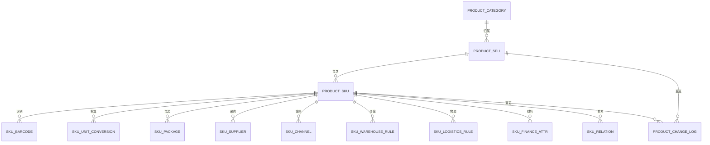
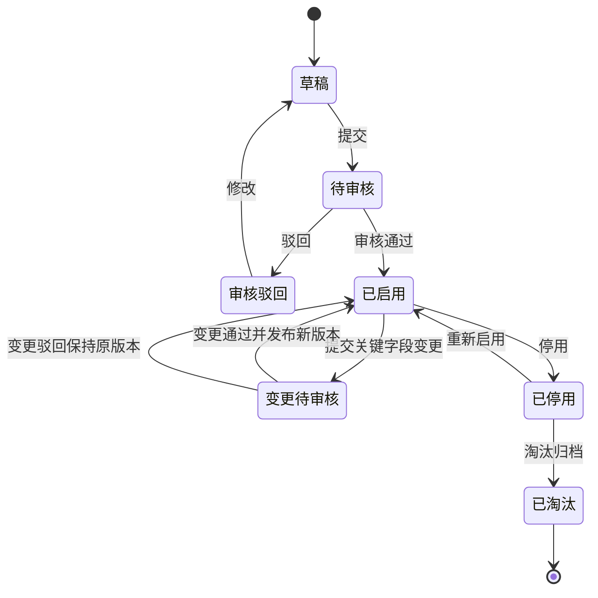

# 17 SPU/SKU 字段模型

> 本文承接 [主数据支线流程](16-主数据支线流程.md)，用于细化商品主数据的字段边界。当前版本先做系统设计级字段模型，不展开数据库类型、索引和完整 DDL。

## 1. 设计定位

SPU 和 SKU 都属于商品主数据，但职责不同。

| 对象 | 定位 | 是否直接参与库存 | 典型使用方 |
| --- | --- | --- | --- |
| SPU | 商品概念层，表示一个商品款式、产品族或售卖概念 | 否 | 商品中心、OMS、报表、运营 |
| SKU | 供应链执行层，表示可采购、可销售、可库存、可履约的最小商品单位 | 是 | 采购、OMS、WMS、中央库存、TMS、BMS、财务 |

核心原则：

| 原则 | 说明 |
| --- | --- |
| SPU 管商品定义 | 负责名称、品牌、类目、商品类型、生命周期、公共描述 |
| SKU 管执行属性 | 负责规格、条码、单位、包装、仓储、物流、采购、销售、财务属性 |
| 业务单据优先引用 SKU | 采购订单、出库单、入库单、库存流水、调拨单都应引用 SKU |
| 关键识别属性变化要谨慎 | 如果变化影响库存识别、仓库扫描、销售履约，通常要新建 SKU |

## 2. 模型关系

## 3. 建议表结构

| 表 | 作用 | 主体 |
| --- | --- | --- |
| `product_spu` | SPU 基础资料 | SPU |
| `product_sku` | SKU 基础资料和执行开关 | SKU |
| `product_category` | 类目和属性模板 | 类目 |
| `product_attribute_def` | 属性定义，如颜色、尺码、容量、材质 | 属性 |
| `product_attribute_value` | SPU/SKU 的属性取值 | 属性值 |
| `sku_barcode` | SKU 条码、外部编码、供应商编码、渠道编码 | SKU |
| `sku_unit_conversion` | 采购单位、销售单位、库存单位之间的换算 | SKU |
| `sku_package` | 长宽高、重量、箱规、托盘等包装信息 | SKU |
| `sku_supplier` | 供应商商品、供货价格、MOQ、交期 | SKU + 供应商 |
| `sku_channel` | 渠道商品、上下架、渠道编码、限售规则 | SKU + 渠道 |
| `sku_warehouse_rule` | 仓储规则、批次、效期、质检、库内作业策略 | SKU + 仓库 |
| `sku_logistics_rule` | 物流限制、计费重量、温控、禁运规则 | SKU |
| `sku_finance_attr` | 税率、成本、科目、财务分类 | SKU |
| `sku_relation` | 组合、替代、赠品、配件等关系 | SKU |
| `product_change_log` | 商品主数据变更日志和版本 | SPU/SKU |

第一版可以先落 `product_spu`、`product_sku`、`sku_barcode`、`sku_unit_conversion`、`sku_package`、`sku_supplier`、`sku_channel`，仓储、物流、财务属性可按业务复杂度逐步拆细。

## 4. SPU 字段模型

表：`product_spu`

| 字段 | 含义 | 说明 |
| --- | --- | --- |
| `spu_id` | SPU 主键 | 系统内部唯一 ID |
| `spu_code` | SPU 编码 | 对业务可见，全局唯一 |
| `spu_name` | SPU 名称 | 商品概念名称 |
| `category_id` | 类目 ID | 决定属性模板和部分经营规则 |
| `brand_id` | 品牌 ID | 可为空，视行业而定 |
| `product_type` | 商品类型 | 普通商品、组合品、虚拟品、服务品、耗材等 |
| `owner_org_id` | 归属组织 | 多组织、多事业部时使用 |
| `lifecycle_status` | 生命周期状态 | 新品、常规、清仓、淘汰 |
| `sales_status` | 销售状态 | 待上架、可销售、暂停销售、下架 |
| `main_image_url` | 主图 | 用于 OMS、商品中心、渠道展示 |
| `description` | 商品描述 | 商品公共说明 |
| `compliance_required` | 是否需要合规审核 | 食品、药品、危险品等适用 |
| `status` | 主数据状态 | 草稿、待审核、已启用、已停用、已淘汰 |
| `version_no` | 版本号 | 用于分发和补偿同步 |
| `created_by` | 创建人 | 审计字段 |
| `created_at` | 创建时间 | 审计字段 |
| `updated_by` | 更新人 | 审计字段 |
| `updated_at` | 更新时间 | 审计字段 |

SPU 不直接记录库存数量，也不作为库存台账维度。库存、采购、销售履约都应该落到 SKU。

## 5. SKU 基础字段模型

表：`product_sku`

| 字段 | 含义 | 说明 |
| --- | --- | --- |
| `sku_id` | SKU 主键 | 系统内部唯一 ID |
| `sku_code` | SKU 编码 | 全局唯一，业务单据高频引用 |
| `sku_name` | SKU 名称 | 可由 SPU 名称 + 规格生成，也可人工维护 |
| `spu_id` | 所属 SPU | 关联商品概念 |
| `category_id` | 类目 ID | 通常继承 SPU，可支持特殊覆盖 |
| `brand_id` | 品牌 ID | 通常继承 SPU |
| `sku_type` | SKU 类型 | 普通 SKU、组合 SKU、虚拟 SKU、赠品 SKU、备件 SKU |
| `spec_summary` | 规格摘要 | 如黑色/128G/标准包装 |
| `stock_unit` | 库存单位 | 库存台账基础单位，如件、瓶、箱 |
| `purchase_unit` | 默认采购单位 | 采购下单默认单位 |
| `sales_unit` | 默认销售单位 | OMS 下单默认单位 |
| `sku_status` | SKU 状态 | 草稿、待审核、已启用、已停用、已淘汰 |
| `is_purchase_enabled` | 是否可采购 | 采购系统下单校验 |
| `is_sales_enabled` | 是否可销售 | OMS/渠道上架校验 |
| `is_stock_enabled` | 是否参与库存 | 虚拟商品可不参与库存 |
| `is_transfer_enabled` | 是否允许调拨 | 中央库存/调拨系统使用 |
| `is_batch_controlled` | 是否批次管理 | WMS 和库存台账使用 |
| `is_serial_controlled` | 是否序列号管理 | 高价值、电子类商品使用 |
| `is_shelf_life_controlled` | 是否效期管理 | 食品、药品、化妆品等使用 |
| `shelf_life_days` | 保质期天数 | 启用效期管理时必填 |
| `qc_required` | 是否质检 | 采购入库、退货入库时使用 |
| `default_owner_id` | 默认货主 | 多货主库存场景使用 |
| `version_no` | 版本号 | 事件分发和子系统缓存刷新 |
| `created_by` | 创建人 | 审计字段 |
| `created_at` | 创建时间 | 审计字段 |
| `updated_by` | 更新人 | 审计字段 |
| `updated_at` | 更新时间 | 审计字段 |

## 6. 类目与属性模型

类目负责定义属性模板，SPU/SKU 负责填写属性值。

| 表 | 字段 | 说明 |
| --- | --- | --- |
| `product_category` | `category_id` | 类目主键 |
| `product_category` | `category_code` | 类目编码 |
| `product_category` | `category_name` | 类目名称 |
| `product_category` | `parent_category_id` | 上级类目 |
| `product_attribute_def` | `attribute_id` | 属性定义 ID |
| `product_attribute_def` | `category_id` | 适用类目 |
| `product_attribute_def` | `attribute_name` | 属性名称 |
| `product_attribute_def` | `attribute_scope` | SPU 属性、SKU 属性、销售属性、物流属性、仓储属性 |
| `product_attribute_def` | `value_type` | 文本、数字、枚举、布尔、日期 |
| `product_attribute_def` | `required_flag` | 是否必填 |
| `product_attribute_value` | `target_type` | SPU 或 SKU |
| `product_attribute_value` | `target_id` | SPU ID 或 SKU ID |
| `product_attribute_value` | `attribute_id` | 属性定义 ID |
| `product_attribute_value` | `attribute_value` | 属性值 |

建议把属性分成五类：

| 属性类型 | 例子 | 使用方 |
| --- | --- | --- |
| 基础属性 | 材质、产地、型号 | 商品中心、报表 |
| 销售属性 | 颜色、尺码、容量、版本 | OMS、渠道 |
| 规格属性 | 净含量、包装规格、成分 | 采购、OMS、WMS |
| 仓储属性 | 温区、效期、批次、质检 | WMS、库存 |
| 物流属性 | 易碎、液体、危险品、超大件 | TMS、BMS |

## 7. 条码与编码模型

表：`sku_barcode`

| 字段 | 含义 | 说明 |
| --- | --- | --- |
| `barcode_id` | 条码记录 ID | 主键 |
| `sku_id` | SKU ID | 关联 SKU |
| `barcode` | 条码或外部编码 | 仓库扫描、平台映射、供应商识别 |
| `barcode_type` | 编码类型 | 主条码、箱码、供应商编码、渠道编码、WMS 编码 |
| `is_primary` | 是否主条码 | 同一 SKU 同一类型通常只能有一个主条码 |
| `supplier_id` | 供应商 ID | 供应商编码适用 |
| `channel_id` | 渠道 ID | 渠道编码适用 |
| `source_system` | 来源系统 | MDM、WMS、OMS、SRM、外部平台 |
| `status` | 状态 | 启用、停用 |
| `effective_from` | 生效时间 | 支持历史追溯 |
| `effective_to` | 失效时间 | 条码变更时保留历史 |

条码规则：

| 规则 | 说明 |
| --- | --- |
| 一个 SKU 可以有多个条码 | 支持单品码、箱码、供应商码、渠道码 |
| 已入库条码不建议物理删除 | 应停用并保留历史，否则影响追溯和扫描记录 |
| WMS 扫描以条码映射 SKU | 扫描后必须能唯一定位 SKU、包装层级和单位 |

## 8. 单位换算模型

表：`sku_unit_conversion`

| 字段 | 含义 | 说明 |
| --- | --- | --- |
| `conversion_id` | 换算记录 ID | 主键 |
| `sku_id` | SKU ID | 关联 SKU |
| `from_unit` | 来源单位 | 如箱 |
| `to_unit` | 目标单位 | 如件 |
| `conversion_rate` | 换算率 | 1 箱 = 12 件，则为 12 |
| `is_base` | 是否库存基础单位 | 库存台账使用基础单位 |
| `usage_scene` | 使用场景 | 采购、销售、库存、包装、计费 |
| `rounding_rule` | 舍入规则 | 不可拆零、向上取整、向下取整 |
| `status` | 状态 | 启用、停用 |

单位换算是高风险字段。SKU 已经发生库存流水后，不建议直接修改库存单位和核心换算率；如确实要改，建议走审批、版本化或新建 SKU。

## 9. 包装模型

表：`sku_package`

| 字段 | 含义 | 说明 |
| --- | --- | --- |
| `package_id` | 包装记录 ID | 主键 |
| `sku_id` | SKU ID | 关联 SKU |
| `package_level` | 包装层级 | 单品、内盒、箱、托盘 |
| `unit` | 包装单位 | 件、盒、箱、托 |
| `quantity_per_package` | 每包装数量 | 1 箱多少件 |
| `length` | 长 | 用于仓储和物流计费 |
| `width` | 宽 | 用于仓储和物流计费 |
| `height` | 高 | 用于仓储和物流计费 |
| `gross_weight` | 毛重 | 物流计费常用 |
| `net_weight` | 净重 | 商品或财务统计使用 |
| `volume` | 体积 | 可由长宽高计算 |
| `is_default_inbound_package` | 是否默认收货包装 | WMS 收货使用 |
| `is_default_outbound_package` | 是否默认发货包装 | WMS 出库使用 |

包装数据会影响仓库库容、上架策略、拣货复核、物流计费和 BMS 计费，建议纳入审核。

## 10. 采购属性模型

表：`sku_supplier`

| 字段 | 含义 | 说明 |
| --- | --- | --- |
| `sku_supplier_id` | 供应商商品 ID | 主键 |
| `sku_id` | SKU ID | 关联 SKU |
| `supplier_id` | 供应商 ID | 关联供应商 |
| `supplier_sku_code` | 供应商商品编码 | 供应商侧识别 |
| `purchase_unit` | 采购单位 | 可不同于库存单位 |
| `moq` | 最小采购量 | 采购下单校验 |
| `purchase_multiple` | 采购倍数 | 如必须整箱采购 |
| `lead_time_days` | 采购提前期 | 计划和补货使用 |
| `tax_rate` | 采购税率 | 采购和财务使用 |
| `purchase_price` | 采购参考价 | 可仅做快照或参考，正式价格可在价格表 |
| `currency` | 币种 | 跨境或进口采购使用 |
| `is_default_supplier` | 是否默认供应商 | 采购下单推荐 |
| `effective_from` | 生效时间 | 价格/供货关系生效 |
| `effective_to` | 失效时间 | 价格/供货关系失效 |
| `status` | 状态 | 待确认、已启用、已停用 |

采购订单不应只依赖 SKU，还要引用供应商商品关系，否则无法校验供应商是否可供、采购单位是否正确、价格和交期是否有效。

## 11. 销售属性模型

表：`sku_channel`

| 字段 | 含义 | 说明 |
| --- | --- | --- |
| `sku_channel_id` | 渠道商品 ID | 主键 |
| `sku_id` | SKU ID | 关联 SKU |
| `channel_id` | 渠道 ID | 电商平台、门店、B2B 渠道等 |
| `channel_sku_code` | 渠道 SKU 编码 | 渠道订单回传识别 |
| `channel_spu_code` | 渠道 SPU 编码 | 渠道侧商品概念 |
| `sales_unit` | 销售单位 | OMS 下单单位 |
| `sales_status` | 销售状态 | 可售、暂停、下架 |
| `listing_status` | 上架状态 | 待上架、已上架、已下架 |
| `limit_rule_id` | 限售规则 | 区域、客户、渠道、数量限制 |
| `default_warehouse_rule_id` | 默认发货规则 | 可选，OMS 分仓使用 |
| `status` | 状态 | 启用、停用 |

OMS 接收外部订单时，通常先用 `channel_id + channel_sku_code` 映射到内部 `sku_id`，再进入库存预占和履约流程。

## 12. 仓储属性模型

表：`sku_warehouse_rule`

| 字段 | 含义 | 说明 |
| --- | --- | --- |
| `warehouse_rule_id` | 仓储规则 ID | 主键 |
| `sku_id` | SKU ID | 关联 SKU |
| `warehouse_id` | 仓库 ID | 可为空，表示全局默认规则 |
| `storage_condition` | 存储条件 | 常温、冷藏、冷冻、恒温、防潮 |
| `putaway_rule` | 上架规则 | 按库区、温区、批次、ABC 分类 |
| `picking_rule` | 拣货规则 | 先进先出、近效期先出、指定批次 |
| `abc_class` | ABC 分类 | 仓储策略和盘点频率使用 |
| `qc_required` | 是否质检 | 可覆盖 SKU 默认值 |
| `batch_rule` | 批次规则 | 必填批次、批次唯一、批次可混放 |
| `shelf_life_rule` | 效期规则 | 入库剩余效期、出库效期阈值 |
| `serial_rule` | 序列号规则 | 入库采集、出库采集、全程追踪 |
| `status` | 状态 | 启用、停用 |

仓储规则决定 WMS 能否正确收货、质检、上架、拣货、复核和盘点。

## 13. 物流与计费属性模型

表：`sku_logistics_rule`

| 字段 | 含义 | 说明 |
| --- | --- | --- |
| `logistics_rule_id` | 物流规则 ID | 主键 |
| `sku_id` | SKU ID | 关联 SKU |
| `is_fragile` | 是否易碎 | 影响包装和承运商选择 |
| `is_liquid` | 是否液体 | 影响禁运和运输渠道 |
| `is_dangerous_goods` | 是否危险品 | 影响合规和运输限制 |
| `temperature_requirement` | 温控要求 | 常温、冷链、冷冻 |
| `is_oversized` | 是否超大件 | 影响运费和渠道 |
| `charge_weight` | 计费重量 | 可由毛重和泡重计算 |
| `volumetric_factor` | 泡重系数 | TMS/BMS 使用 |
| `forbidden_region_rule_id` | 禁运区域规则 | OMS/TMS 下单校验 |
| `carrier_limit_rule_id` | 承运商限制规则 | TMS 分配承运商使用 |

表：`sku_finance_attr`

| 字段 | 含义 | 说明 |
| --- | --- | --- |
| `finance_attr_id` | 财务属性 ID | 主键 |
| `sku_id` | SKU ID | 关联 SKU |
| `tax_rate` | 销售税率 | 销售和财务使用 |
| `inventory_subject_code` | 存货科目 | 财务入账使用 |
| `revenue_category` | 收入分类 | 财务和报表使用 |
| `cost_category` | 成本分类 | 成本核算使用 |
| `costing_method` | 成本核算方式 | 移动加权、先进先出等 |
| `include_in_inventory_cost` | 是否计入库存成本 | 采购运费、加工费等场景 |

## 14. SKU 关系模型

表：`sku_relation`

| 字段 | 含义 | 说明 |
| --- | --- | --- |
| `relation_id` | 关系 ID | 主键 |
| `source_sku_id` | 主 SKU | 关系发起方 |
| `target_sku_id` | 目标 SKU | 被关联 SKU |
| `relation_type` | 关系类型 | 替代品、组合品、赠品、配件、升级换代 |
| `quantity` | 数量 | 组合品或赠品关系使用 |
| `priority` | 优先级 | 替代 SKU 推荐顺序 |
| `effective_from` | 生效时间 | 关系生效 |
| `effective_to` | 失效时间 | 关系失效 |
| `status` | 状态 | 启用、停用 |

组合品需要特别区分：

| 类型 | 库存处理 |
| --- | --- |
| 虚拟组合 SKU | OMS 售卖组合，库存预占和出库扣减组件 SKU |
| 实物套装 SKU | 仓库提前组套，库存台账可以记录套装 SKU |

## 15. SPU/SKU 状态机

状态使用建议：

| 状态 | 是否可被业务单据引用 | 说明 |
| --- | --- | --- |
| 草稿 | 否 | 信息未完整 |
| 待审核 | 否 | 等待主数据、合规、采购或仓储审核 |
| 审核驳回 | 否 | 需修改后重新提交 |
| 已启用 | 是 | 可被采购、OMS、WMS、库存等引用 |
| 变更待审核 | 原版本可继续使用 | 新版本待审核，不影响已发生业务 |
| 已停用 | 通常否 | 存量单据可继续追溯，新单据禁止引用 |
| 已淘汰 | 否 | 仅保留历史查询 |

## 16. 字段变更规则

| 字段类型 | 处理建议 | 原因 |
| --- | --- | --- |
| 名称、描述、图片 | 可直接修改并发布事件 | 不影响库存识别 |
| 品牌、类目 | 需要审批 | 影响规则、报表、财务分类 |
| 条码 | 谨慎变更，保留历史 | 影响 WMS 扫描和渠道订单映射 |
| 重量、体积、包装 | 需要审批并同步 WMS/TMS/BMS | 影响库容、发货、运费和计费 |
| 库存单位、核心换算率 | 高风险，建议新版本或新 SKU | 影响库存台账和历史数量解释 |
| 颜色、尺码、型号、容量 | 影响销售/履约识别时新建 SKU | 防止新旧商品混淆 |
| 批次、序列号、效期管理 | 高风险，启用后不建议回退 | 影响 WMS 作业和库存维度 |
| 采购供应商关系 | 可按生效期维护 | 影响新采购单，不应改写历史采购 |
| 渠道编码 | 可维护映射版本 | 影响外部订单识别 |

## 17. 子系统使用映射

| 子系统 | 主要使用字段 | 用途 |
| --- | --- | --- |
| 采购/SRM | `sku_code`、`purchase_unit`、`sku_supplier`、`moq`、`lead_time_days`、`tax_rate` | 请购、询价、采购订单、供应商确认 |
| OMS | `sku_code`、`sku_channel`、`sales_status`、`sales_unit`、`sku_relation` | 接单、商品映射、组合拆分、售后 |
| WMS | `sku_barcode`、`sku_package`、`qc_required`、`batch_rule`、`shelf_life_rule` | 收货、质检、上架、拣货、复核、盘点 |
| 中央库存 | `sku_id`、`stock_unit`、`is_batch_controlled`、`is_serial_controlled`、`default_owner_id` | 初始化库存维度、预占、扣减、释放、流水 |
| TMS | `sku_logistics_rule`、重量、体积、温控、禁运规则 | 承运商选择、运费估算、物流下单 |
| BMS | `sku_package`、`sku_logistics_rule`、`sku_finance_attr` | 仓储费、操作费、物流费、账单 |
| 财务 | `tax_rate`、`inventory_subject_code`、`cost_category`、`costing_method` | 存货核算、收入成本分类、应收应付 |
| 报表 | SPU、SKU、类目、品牌、生命周期 | 销售分析、库存分析、供应商绩效 |

## 18. 第一版最小字段集

为了先跑通采购入库、销售出库、调拨和退货，第一版建议至少具备以下字段。

| 对象 | P0 字段 |
| --- | --- |
| SPU | `spu_id`、`spu_code`、`spu_name`、`category_id`、`brand_id`、`product_type`、`status` |
| SKU | `sku_id`、`sku_code`、`sku_name`、`spu_id`、`stock_unit`、`purchase_unit`、`sales_unit`、`sku_status` |
| SKU 执行开关 | `is_purchase_enabled`、`is_sales_enabled`、`is_stock_enabled`、`is_transfer_enabled` |
| 仓储控制 | `qc_required`、`is_batch_controlled`、`is_serial_controlled`、`is_shelf_life_controlled`、`shelf_life_days` |
| 条码 | `sku_id`、`barcode`、`barcode_type`、`is_primary`、`status` |
| 单位换算 | `sku_id`、`from_unit`、`to_unit`、`conversion_rate`、`usage_scene` |
| 包装 | `sku_id`、`package_level`、`quantity_per_package`、`length`、`width`、`height`、`gross_weight` |
| 供应商商品 | `sku_id`、`supplier_id`、`supplier_sku_code`、`purchase_unit`、`moq`、`lead_time_days`、`status` |
| 渠道商品 | `sku_id`、`channel_id`、`channel_sku_code`、`sales_status`、`listing_status` |

## DDD 对齐说明

本文属于主数据上下文。主数据是多个业务上下文的上游发布语言，负责统一基础资料编码、状态、版本和字段快照。业务系统可以缓存主数据，但不能绕过主数据上下文自行创造核心口径；关键字段变更必须通过版本、审批、事件分发和兼容策略处理。

| DDD 关注点 | 主数据要求 |
| --- | --- |
| 数据主权 | 主数据中心拥有权威定义 |
| 发布语言 | 启用、变更、停用事件必须稳定 |
| 字段快照 | 历史单据、库存流水、费用明细必须保留关键快照 |
| 防腐层 | 外部 ERP/平台资料进入前要转换成本系统主数据模型 |

## 19. 继续上下文

当前结论：SPU 是商品概念层，SKU 是供应链执行层。采购、库存、仓储、履约、物流、结算都应引用 SKU，而不是直接引用 SPU。

关键假设：主数据中心是 SPU/SKU 的权威来源；子系统允许本地缓存商品资料，但字段变更必须通过主数据事件和版本号同步；库存台账统一使用 SKU 和库存单位。

待决问题：是否需要支持多货主、多组织、多渠道和组合品。如果支持，SKU 字段模型要保留货主、渠道映射和 SKU 关系扩展。

下一步：建议继续细化 `供应商主数据字段模型` 或 `仓库/库区/库位字段模型`，它们会直接影响采购入库、调拨和 WMS 作业。
