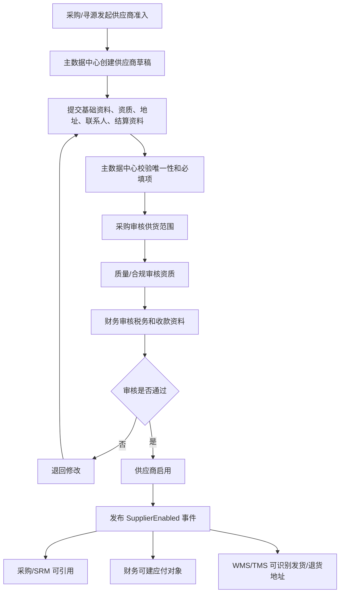
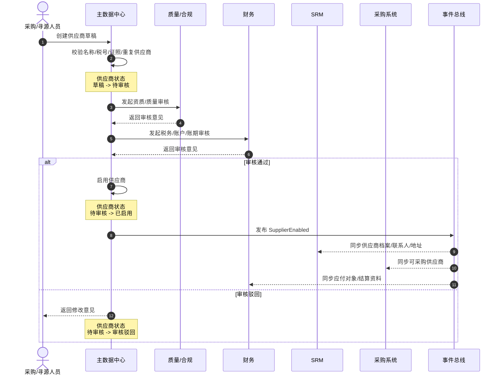
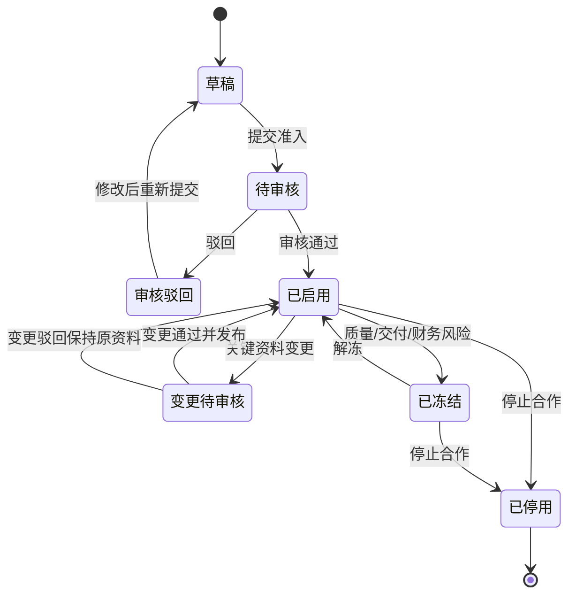
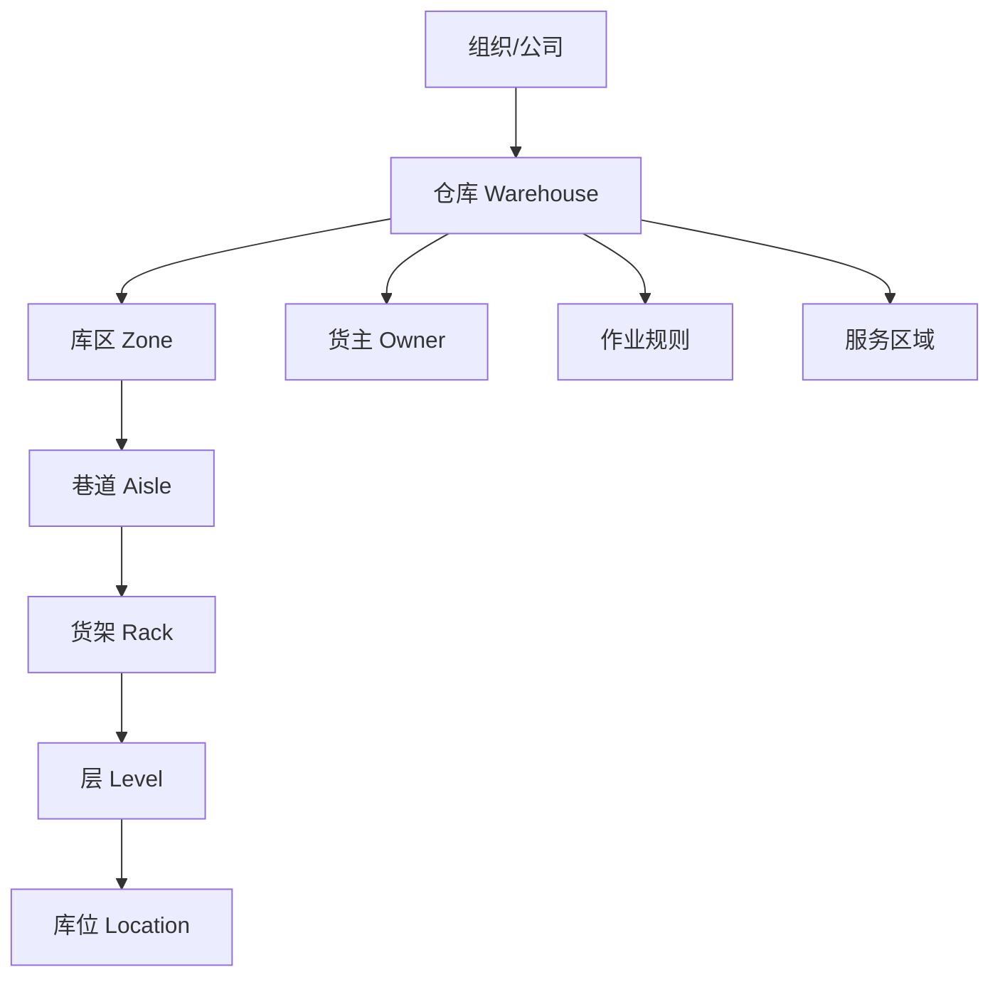
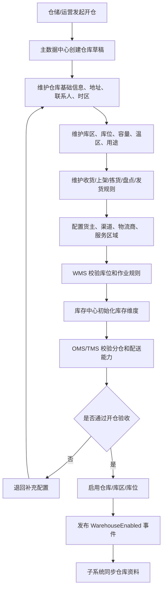
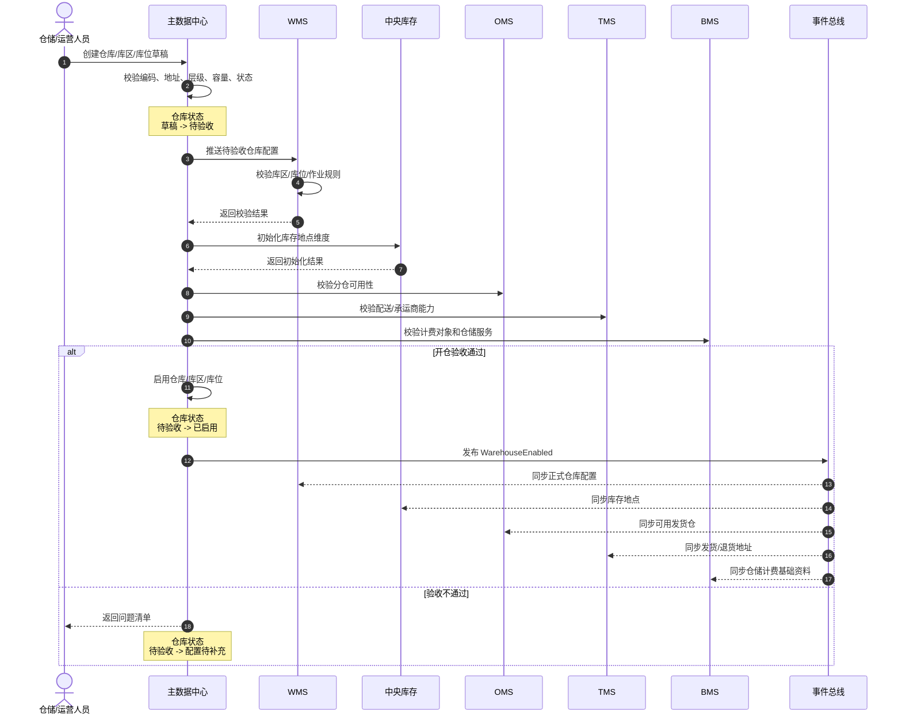
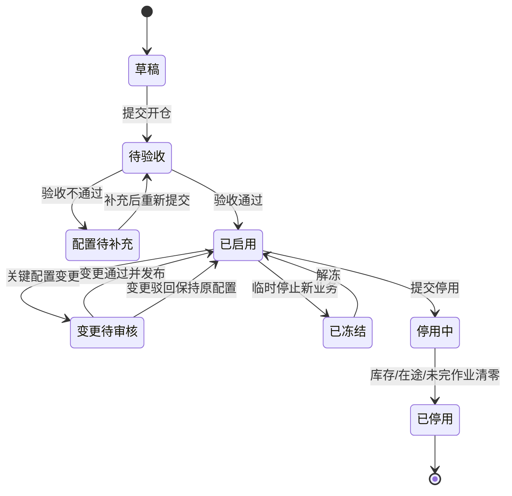
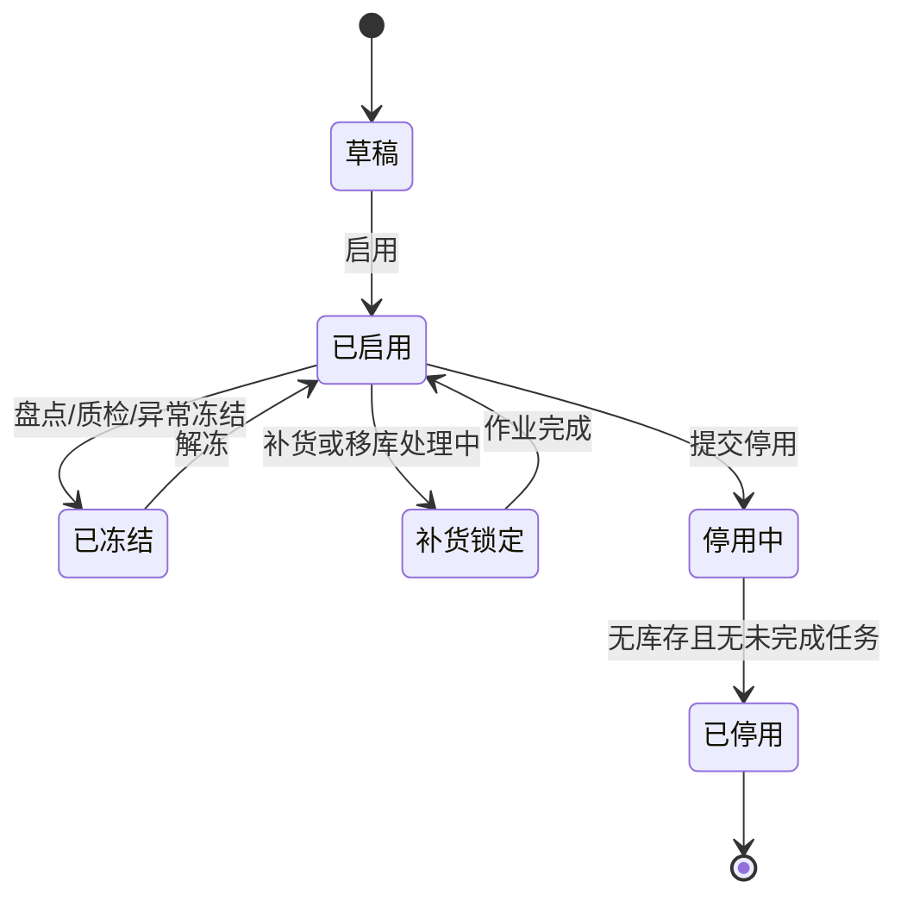

# 18 供应商与仓库库位主数据流程

> 本文承接 [主数据支线流程](16-主数据支线流程.md) 和 [SPU/SKU 字段模型](17-SPU-SKU字段模型.md)，继续梳理供应商主数据、仓库/库区/库位主数据如何新增、审核、启用、分发，以及它们如何被采购、库存、WMS、OMS、TMS、BMS、财务使用。当前版本先讲流程和主体边界，不展开完整数据库 DDL。

## 1. 总体定位

供应商主数据和仓库库位主数据分别解决供应链里的两个基础问题：

| 主数据 | 解决的问题 | 典型业务影响 |
| --- | --- | --- |
| 供应商主数据 | 谁能供货、供什么、按什么条件供、如何结算 | 采购下单、供应商协同、采购入库、退供应商、应付结算 |
| 仓库/库区/库位主数据 | 库存放在哪里、如何作业、能否收发调拨 | 入库上架、库存台账、销售出库、调拨、盘点、仓储计费 |

两类主数据都必须在业务单据发生前完成建档和启用：

```text
主数据建档
  -> 资料校验
  -> 审核/准入
  -> 启用
  -> 发布主数据事件
  -> 子系统缓存或拉取
  -> 业务单据引用
```

## 2. 供应商主数据流程

### 2.1 供应商何时新增

| 场景 | 是否需要新增/维护供应商 | 原因 |
| --- | --- | --- |
| 新供应商准入 | 需要 | 采购、SRM、财务必须识别供应商主体 |
| 新品询价/寻源 | 需要 | 报价、样品、合同、资质都要绑定供应商 |
| 创建采购订单前 | 必须已启用 | 采购订单不能引用未启用供应商 |
| 供应商新增可供 SKU | 维护供应商商品 | 需要记录供应商 SKU、MOQ、价格、交期 |
| 供应商资质到期 | 维护资质状态 | 影响是否可继续下单、收货和结算 |
| 供应商收款账户变更 | 维护财务信息 | 影响付款安全，通常需要财务审核 |
| 退供应商业务 | 必须可引用供应商 | 退货单要回溯原供应商和采购关系 |

### 2.2 供应商主数据包含哪些主体

| 主体 | 作用 | 主要使用方 |
| --- | --- | --- |
| 供应商档案 | 供应商基础身份、状态、分类、联系人 | 采购、SRM、财务 |
| 供应商资质 | 营业执照、许可证、质量认证、有效期 | 采购、质检、合规 |
| 供应商地址 | 注册地址、发货地址、退货地址、开票地址 | 采购、SRM、TMS、财务 |
| 供应商联系人 | 业务、财务、物流、质量联系人 | 采购、SRM、财务、WMS |
| 供应商商品 | 供应商能供哪些 SKU 及供货条件 | 采购、计划、SRM |
| 供应商合同 | 合同条款、账期、交付、质量、违约规则 | 采购、法务、财务 |
| 供应商结算资料 | 税号、银行账户、币种、账期、发票类型 | 财务、BMS |
| 供应商绩效 | 交付、质量、价格、响应、异常指标 | 采购、质量、管理报表 |

### 2.3 供应商新增主流程



### 2.4 供应商准入时序图



### 2.5 供应商商品维护流程

供应商启用后，不代表所有 SKU 都能向该供应商采购。采购订单通常还需要引用“供应商商品关系”。

```text
供应商已启用
  -> 选择可供 SKU
  -> 维护供应商 SKU 编码、采购单位、MOQ、采购倍数、交期、价格、税率
  -> 采购/供应商确认
  -> 启用供应商商品
  -> 采购下单引用
```

| 关键校验 | 说明 |
| --- | --- |
| SKU 必须已启用 | 避免供应商商品引用无效商品 |
| 供应商必须已启用 | 未准入供应商不能维护可供关系 |
| 采购单位要可换算到库存单位 | 入库后库存台账必须能按库存单位记账 |
| MOQ 和采购倍数要参与下单校验 | 防止采购数量不符合供应商供货条件 |
| 价格和税率建议带生效期 | 防止历史采购单价格被改写 |

### 2.6 供应商状态机



状态规则：

| 状态 | 是否允许新采购单引用 | 说明 |
| --- | --- | --- |
| 草稿 | 否 | 资料未完整 |
| 待审核 | 否 | 等待采购、质量、财务审核 |
| 审核驳回 | 否 | 需要补充资料 |
| 已启用 | 是 | 可被采购、SRM、财务引用 |
| 变更待审核 | 原资料可继续使用 | 新资料审核通过后生效 |
| 已冻结 | 通常否 | 可允许处理存量订单、退货、对账 |
| 已停用 | 否 | 仅保留历史追溯 |

### 2.7 供应商主数据分发

| 接收系统 | 接收内容 | 使用方式 |
| --- | --- | --- |
| 采购系统 | 供应商档案、供应商商品、采购单位、MOQ、交期、价格 | 请购、询价、采购订单、退供应商 |
| SRM | 供应商档案、联系人、地址、可供 SKU、合同 | 供应商报价、确认订单、预约送货、ASN |
| WMS | 供应商名称、编码、发货地址、退货地址 | 收货来源识别、退供应商出库 |
| 中央库存 | 供应商 ID、供应商商品关系 | 入库来源追溯、批次来源追溯 |
| TMS | 供应商发货地址、退货地址、联系人 | 提货、退货运输、预约 |
| BMS/财务 | 税号、银行账户、账期、币种、发票类型 | 应付、对账、付款、发票 |
| 报表 | 供应商分类、状态、绩效维度 | 供应商绩效、采购分析 |

### 2.8 供应商变更规则

| 变更内容 | 处理建议 | 影响 |
| --- | --- | --- |
| 名称、简称、联系人 | 可审批后同步 | 影响展示和联系，不应改写历史单据快照 |
| 税号、主体名称 | 严格审批 | 影响财务主体和发票 |
| 银行账户 | 财务复核，必要时双人审批 | 影响付款安全 |
| 资质有效期 | 到期自动预警或冻结 | 影响是否可下单和收货 |
| 供应商商品价格 | 按生效期维护 | 影响新采购单，不改历史单据 |
| 供应商状态 | 停用前校验未完订单、未结算单 | 防止业务中断和对账遗漏 |

## 3. 仓库/库区/库位主数据流程

### 3.1 仓库库位何时新增

| 场景 | 是否需要新增/维护 | 原因 |
| --- | --- | --- |
| 新仓开仓 | 必须新增仓库、库区、库位 | 入库、出库、库存台账必须有库存地点 |
| 门店作为库存点 | 新增仓库或站点 | OMS 分仓、库存查询、调拨需要 |
| 海外仓/三方仓接入 | 新增仓库并配置接口 | WMS、TMS、库存同步需要 |
| 仓内布局调整 | 维护库区/库位 | 影响上架、拣货、补货、盘点 |
| 新增温区/特殊区域 | 新增库区或库位属性 | 冷藏、冻结、危险品、残次品隔离 |
| 货主入仓 | 维护仓库货主关系 | 多货主库存和计费需要 |
| 仓库停用/迁仓 | 变更状态并冻结新业务 | 要先处理库存、在途、未完作业 |

### 3.2 仓库库位包含哪些主体

| 主体 | 作用 | 主要使用方 |
| --- | --- | --- |
| 仓库 | 库存存放点和作业组织边界 | OMS、库存、WMS、TMS、BMS |
| 库区 | 仓库内按功能、温区、货品类型划分的区域 | WMS、库存 |
| 库位 | 最小库存位置和作业位置 | WMS、库存、盘点 |
| 货主仓关系 | 哪些货主可以使用该仓 | OMS、WMS、库存、BMS |
| 仓库作业能力 | 收货、发货、退货、调拨、质检、组套能力 | OMS、WMS、计划 |
| 仓库服务范围 | 配送区域、渠道、时效、承运商能力 | OMS、TMS |
| 仓储计费规则 | 存储费、操作费、耗材费、增值服务费 | BMS、财务 |
| 库位策略 | 上架、拣货、补货、盘点、冻结规则 | WMS |

### 3.3 仓库层级关系



第一版可以先做三层：仓库、库区、库位。巷道、货架、层可作为库位编码或库位属性，不一定单独建表。

### 3.4 仓库开仓主流程



### 3.5 仓库开仓时序图



### 3.6 仓库状态机



### 3.7 库区/库位状态机



状态规则：

| 状态 | 是否允许入库 | 是否允许出库 | 说明 |
| --- | --- | --- | --- |
| 草稿 | 否 | 否 | 未启用 |
| 已启用 | 是 | 是 | 可正常作业 |
| 已冻结 | 否 | 通常否 | 可按冻结原因允许特定作业 |
| 补货锁定 | 受限 | 受限 | 防止并发拣货/上架冲突 |
| 停用中 | 否 | 可清库存 | 只允许移出或盘清 |
| 已停用 | 否 | 否 | 仅保留历史追溯 |

### 3.8 仓库库位主数据分发

| 接收系统 | 接收内容 | 使用方式 |
| --- | --- | --- |
| WMS | 仓库、库区、库位、容量、温区、作业规则 | 收货、上架、拣货、复核、盘点、补货 |
| 中央库存 | 仓库、库区、库位、货主关系、库存状态 | 初始化库存维度、库存余额、库存流水 |
| OMS | 可发货仓、渠道仓关系、服务区域、截单时间 | 分仓、履约承诺、售后退货仓选择 |
| TMS | 发货地址、退货地址、承运商能力、服务区域 | 物流下单、路由选择、运费估算 |
| BMS | 仓库、货主、库区类型、计费规则 | 仓储费、操作费、增值服务费 |
| 采购/SRM | 收货仓、预约规则、收货时间窗 | 采购订单收货仓、ASN、预约送货 |
| 报表 | 仓库层级、区域、状态、容量 | 库存分析、库容分析、作业绩效 |

### 3.9 仓库库位变更规则

| 变更内容 | 处理建议 | 影响 |
| --- | --- | --- |
| 仓库名称、联系人 | 可审批后同步 | 影响展示和沟通 |
| 仓库地址 | 严格审批 | 影响 TMS、OMS 分仓、运费、税务或结算 |
| 仓库状态 | 停用前校验库存、在途、未完单据 | 防止库存悬挂 |
| 库区用途 | 需要 WMS 审核 | 影响上架、拣货、冻结和盘点 |
| 库位容量 | 需要仓储审核 | 影响库容和上架策略 |
| 温区/危险品属性 | 严格审批 | 影响合规、SKU 存储规则和作业安全 |
| 库位编码 | 已发生库存后不建议修改 | 影响库存追溯、历史作业记录 |
| 货主仓关系 | 需要业务和计费确认 | 影响多货主库存、OMS 分仓和 BMS 计费 |

## 4. 两类主数据与业务流程的关系

| 业务流程 | 需要的供应商主数据 | 需要的仓库库位主数据 |
| --- | --- | --- |
| 采购入库 | 供应商已启用、供应商商品已启用、供货单位可换算 | 收货仓已启用、收货库区/暂存区可用、质检区可用 |
| 销售出库 | 通常不直接依赖供应商 | 发货仓已启用、拣货区/复核区/发货区可用 |
| 调拨 | 通常不直接依赖供应商 | 调出仓、调入仓、在途规则、收发库区可用 |
| 销售退货入库 | 可追溯原供应商或商品来源 | 退货仓、退货暂存区、质检区、良品/残次区可用 |
| 供应商退货出库 | 原供应商或退货供应商可识别，退货地址可用 | 退货出库仓、残次区/待退区、发货区可用 |
| 应付结算 | 供应商税号、账期、银行账户、发票规则 | 可能引用收货仓用于费用归集 |
| 仓储计费 | 可能按供应商或货主归集费用 | 仓库、库区类型、库位、作业服务规则 |

## 5. 第一版最小字段集

### 5.1 供应商 P0 字段

| 对象 | P0 字段 |
| --- | --- |
| 供应商档案 | `supplier_id`、`supplier_code`、`supplier_name`、`supplier_type`、`status`、`owner_org_id` |
| 供应商资质 | `supplier_id`、`qualification_type`、`certificate_no`、`valid_from`、`valid_to`、`status` |
| 供应商地址 | `supplier_id`、`address_type`、`country`、`province`、`city`、`detail_address`、`contact_name`、`contact_phone` |
| 供应商结算 | `supplier_id`、`tax_no`、`settlement_currency`、`payment_terms`、`invoice_type`、`bank_account`、`account_name` |
| 供应商商品 | `supplier_id`、`sku_id`、`supplier_sku_code`、`purchase_unit`、`moq`、`purchase_multiple`、`lead_time_days`、`status` |

### 5.2 仓库库位 P0 字段

| 对象 | P0 字段 |
| --- | --- |
| 仓库 | `warehouse_id`、`warehouse_code`、`warehouse_name`、`warehouse_type`、`status`、`owner_org_id`、`timezone` |
| 仓库地址 | `warehouse_id`、`country`、`province`、`city`、`detail_address`、`contact_name`、`contact_phone` |
| 库区 | `zone_id`、`warehouse_id`、`zone_code`、`zone_name`、`zone_type`、`temperature_type`、`status` |
| 库位 | `location_id`、`warehouse_id`、`zone_id`、`location_code`、`location_type`、`capacity_qty`、`capacity_volume`、`status` |
| 货主仓关系 | `warehouse_id`、`owner_id`、`inbound_enabled`、`outbound_enabled`、`transfer_enabled`、`billing_enabled`、`status` |
| 作业规则 | `warehouse_id`、`operation_type`、`rule_code`、`rule_value`、`status` |

## DDD 对齐说明

本文属于主数据上下文。主数据是多个业务上下文的上游发布语言，负责统一基础资料编码、状态、版本和字段快照。业务系统可以缓存主数据，但不能绕过主数据上下文自行创造核心口径；关键字段变更必须通过版本、审批、事件分发和兼容策略处理。

| DDD 关注点 | 主数据要求 |
| --- | --- |
| 数据主权 | 主数据中心拥有权威定义 |
| 发布语言 | 启用、变更、停用事件必须稳定 |
| 字段快照 | 历史单据、库存流水、费用明细必须保留关键快照 |
| 防腐层 | 外部 ERP/平台资料进入前要转换成本系统主数据模型 |

## 6. 继续上下文

当前结论：供应商主数据解决“谁能供货和如何结算”，仓库库位主数据解决“库存放在哪里和如何作业”。二者都是采购入库、退供应商、调拨、库存台账和 WMS 作业的前置条件。

关键假设：主数据中心是供应商、仓库、库区、库位的权威来源；采购、SRM、WMS、库存、OMS、TMS、BMS、财务可以缓存主数据，但必须通过事件和版本号同步变更。

待决问题：是否需要支持多货主、多组织、多仓协同、三方仓、海外仓。如果支持，仓库主数据要补充货主隔离、接口映射和时区规则；供应商主数据要补充跨币种、跨税制和外部供应商门户账号。

下一步：建议继续细化 `供应商字段模型` 和 `仓库/库区/库位字段模型`，或先画 `供应商准入泳道图`、`新仓开仓泳道图`。
