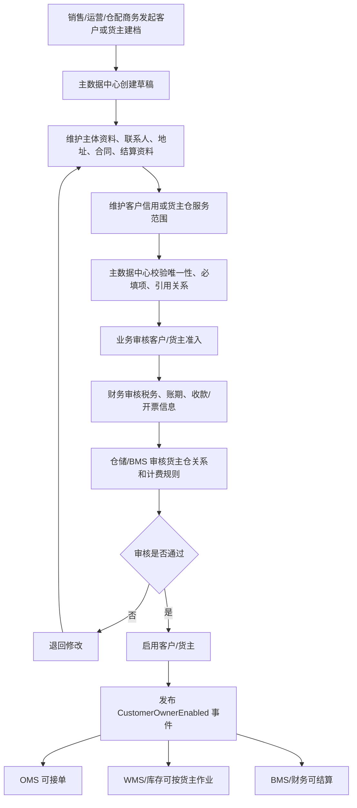
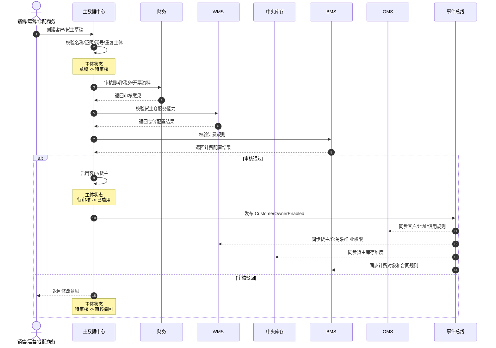
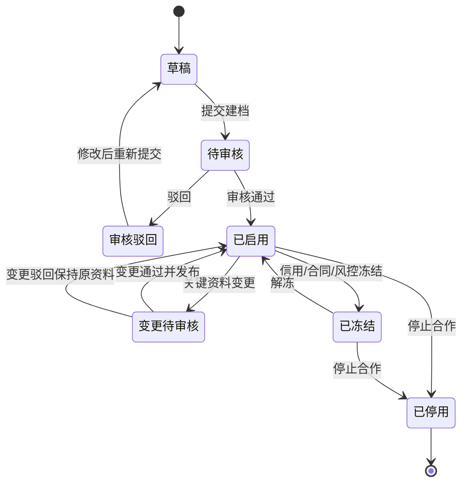
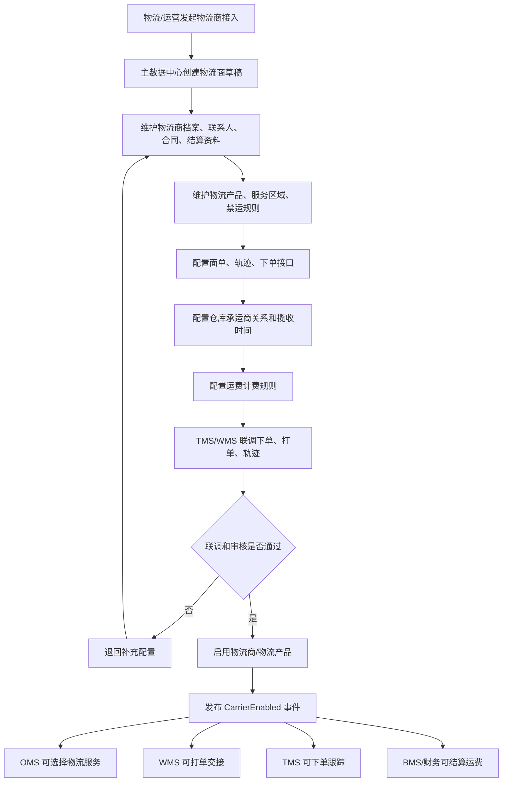
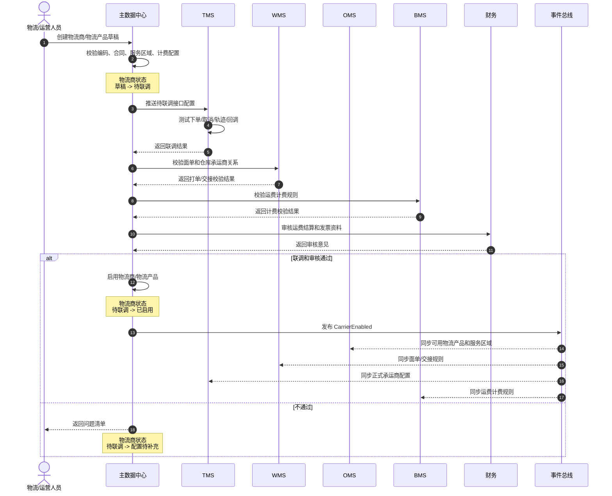
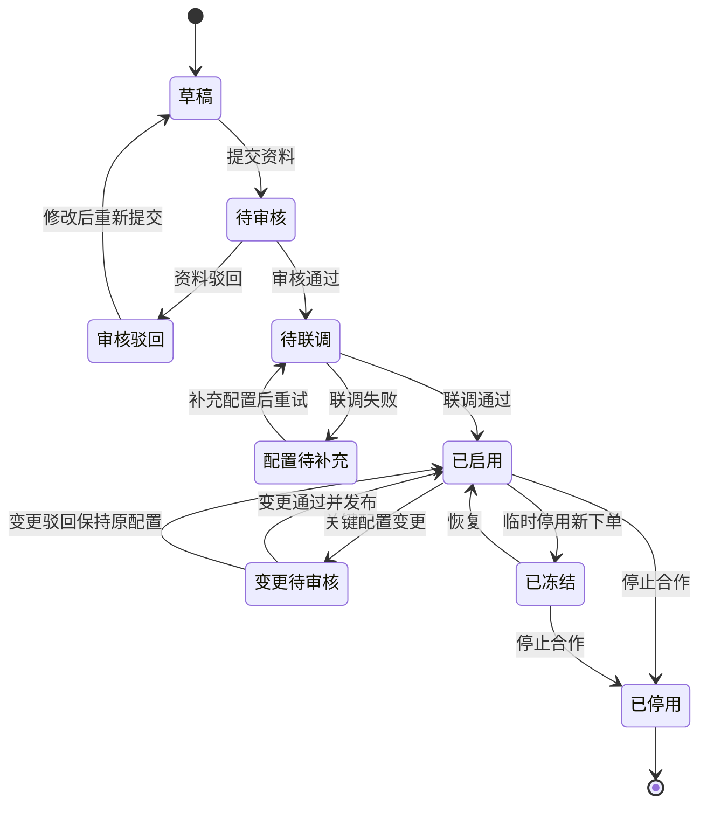

# 19 客户/货主与物流商主数据流程

> 本文承接 [主数据支线流程](16-主数据支线流程.md) 和 [供应商与仓库库位主数据流程](18-供应商与仓库库位主数据流程.md)，继续梳理客户/货主主数据、物流商主数据如何新增、审核、启用、分发，以及它们如何支撑 OMS、WMS、中央库存、TMS、BMS、财务。当前版本先讲流程和主体边界，不展开完整数据库 DDL。

## 1. 总体定位

客户/货主和物流商分别解决供应链履约里的两个基础问题：

| 主数据 | 解决的问题 | 典型业务影响 |
| --- | --- | --- |
| 客户主数据 | 卖给谁、谁来结算、收货地址和信用规则是什么 | 销售订单、B2B 履约、应收、售后 |
| 货主主数据 | 库存属于谁、谁付仓储物流费用、谁能看哪些库存 | 多货主库存、WMS 作业、BMS 计费、数据权限 |
| 物流商主数据 | 谁来运输、使用哪个物流产品、服务范围和计费规则是什么 | 物流下单、面单、轨迹、签收、运费结算 |

客户和货主可以是同一个业务主体，也可以分开：

| 场景 | 客户 | 货主 |
| --- | --- | --- |
| 自营零售 | 下单消费者或企业客户 | 企业自己 |
| B2B 销售 | 经销商、门店、企业客户 | 企业自己 |
| 三方仓服务 | 货主客户的收货客户 | 入仓服务客户 |
| 平台仓配 | 平台买家或渠道客户 | 商家/品牌方 |

## 2. 客户/货主主数据流程

### 2.1 客户/货主何时新增

| 场景 | 是否需要新增/维护 | 原因 |
| --- | --- | --- |
| 新 B2B 客户签约 | 需要新增客户 | 销售订单、账期、发票、应收需要客户主体 |
| 新货主入仓 | 需要新增货主 | WMS、库存、BMS 要按货主隔离和计费 |
| 新渠道客户接入 | 需要新增客户或渠道客户映射 | OMS 接单、渠道编码、结算规则需要 |
| 客户新增收货地址 | 维护客户地址 | 销售履约、TMS 配送、售后退货需要 |
| 客户账期或信用变更 | 维护结算/信用资料 | 影响是否允许下单和发货 |
| 货主新增仓库服务 | 维护货主仓关系 | 决定货主能在哪些仓收发存 |
| 货主新增计费规则 | 维护服务合同/计费规则 | BMS 生成仓储费、操作费、物流费 |

### 2.2 客户/货主包含哪些主体

| 主体 | 作用 | 主要使用方 |
| --- | --- | --- |
| 客户档案 | 客户基础身份、类型、状态、归属组织 | OMS、财务、BMS |
| 客户地址 | 收货、退货、开票、联系人地址 | OMS、TMS、售后、财务 |
| 客户合同 | 价格、账期、服务条款、信用规则 | OMS、BMS、财务 |
| 客户信用 | 信用额度、账期、冻结规则 | OMS、财务 |
| 货主档案 | 库存货权主体、仓储服务对象 | WMS、库存、BMS |
| 货主仓关系 | 货主可用仓库、收发权限、计费启用 | WMS、库存、OMS、BMS |
| 货主商品范围 | 货主可操作的 SKU 范围 | WMS、库存、OMS |
| 货主计费规则 | 仓储费、操作费、耗材费、物流费规则 | BMS、财务 |
| 数据权限 | 客户/货主能看哪些订单、库存、账单 | 全系统 |

### 2.3 客户/货主新增主流程

### 2.4 客户/货主建档时序图

### 2.5 客户/货主状态机

状态规则：

| 状态 | 是否允许新订单 | 是否允许仓内作业 | 说明 |
| --- | --- | --- | --- |
| 草稿 | 否 | 否 | 资料未完整 |
| 待审核 | 否 | 否 | 等待业务、财务、仓储审核 |
| 已启用 | 是 | 是 | 可被 OMS、WMS、库存、BMS 引用 |
| 已冻结 | 通常否 | 可处理存量 | 信用、合同、风险原因冻结 |
| 已停用 | 否 | 仅历史追溯 | 停用前要处理未完订单、库存、账单 |

### 2.6 客户/货主主数据分发

| 接收系统 | 接收内容 | 使用方式 |
| --- | --- | --- |
| OMS | 客户档案、客户地址、信用规则、渠道映射 | 接单、客户校验、分仓、售后 |
| WMS | 货主档案、货主仓关系、货主商品范围 | 入库、上架、拣货、盘点、多货主隔离 |
| 中央库存 | 货主 ID、货主仓关系、库存维度 | 库存余额、库存流水、预占、调拨 |
| TMS | 客户地址、退货地址、联系人 | 配送、退货取件、签收 |
| BMS | 计费对象、合同、计费规则、账期 | 仓储费、操作费、物流费、账单 |
| 财务 | 税号、发票、收款/付款、账期 | 应收、发票、收款、对账 |
| 报表 | 客户类型、货主、区域、行业、状态 | 销售分析、库存分析、服务绩效 |

### 2.7 客户/货主变更规则

| 变更内容 | 处理建议 | 影响 |
| --- | --- | --- |
| 客户名称、联系人 | 可审批后同步 | 影响展示和沟通，不改历史单据快照 |
| 税号、开票主体 | 严格审批 | 影响应收和发票 |
| 收货地址 | 可维护多版本 | 影响新订单配送，不改历史订单 |
| 信用额度、账期 | 财务审批 | 影响是否允许下单、发货、结算 |
| 货主仓关系 | 仓储和 BMS 共同确认 | 影响库存维度、作业权限、计费 |
| 货主状态 | 停用前校验库存、未完作业、未结账单 | 防止库存和费用悬挂 |
| 数据权限 | 权限审批 | 影响客户/货主可见订单、库存、账单 |

## 3. 物流商主数据流程

### 3.1 物流商何时新增

| 场景 | 是否需要新增/维护 | 原因 |
| --- | --- | --- |
| 接入新快递/三方物流 | 需要新增物流商 | TMS 下单、面单、轨迹、结算需要 |
| 新增物流产品 | 维护物流渠道/产品 | 标快、特快、冷链、大件、同城等能力不同 |
| 新仓发货接入承运商 | 维护仓库承运商关系 | 决定哪个仓可以用哪个物流服务 |
| 新区域配送 | 维护服务区域 | 影响 OMS 分仓和 TMS 路由 |
| 运费合同变更 | 维护计费规则 | BMS/财务运费结算需要 |
| 面单或轨迹接口变化 | 维护接口配置 | 影响 WMS 打单和 TMS 跟踪 |
| 物流商停用 | 变更状态 | 停用前要处理未发运、在途、未结费用 |

### 3.2 物流商主数据包含哪些主体

| 主体 | 作用 | 主要使用方 |
| --- | --- | --- |
| 物流商档案 | 承运商基础身份、状态、类型 | TMS、OMS、WMS、BMS |
| 物流产品/渠道 | 标快、冷链、大件、同城、海外尾程等 | TMS、OMS |
| 服务区域 | 可达区域、禁运区域、偏远区域 | OMS、TMS |
| 仓库承运商关系 | 哪个仓可用哪些物流产品 | WMS、TMS、OMS |
| 面单配置 | 电子面单模板、账号、打印规则 | WMS、TMS |
| 轨迹接口配置 | 轨迹查询、订阅、回调规则 | TMS、OMS、售后 |
| 计费规则 | 首重续重、泡重、阶梯价、附加费 | BMS、财务 |
| 时效规则 | 承诺时效、截单时间、揽收时间窗 | OMS、TMS |
| 异常规则 | 丢件、破损、延误、拒收处理规则 | TMS、售后、BMS |

### 3.3 物流商接入主流程

### 3.4 物流商接入时序图

### 3.5 物流商状态机

状态规则：

| 状态 | 是否允许新物流下单 | 是否允许轨迹/对账 | 说明 |
| --- | --- | --- | --- |
| 草稿 | 否 | 否 | 资料未完整 |
| 待审核 | 否 | 否 | 合同、结算、服务资料审核 |
| 待联调 | 否 | 可测试 | 下单、面单、轨迹接口联调 |
| 已启用 | 是 | 是 | 可被 OMS、WMS、TMS、BMS 引用 |
| 已冻结 | 否 | 是 | 暂停新下单，但在途和对账继续处理 |
| 已停用 | 否 | 仅历史 | 停用前要处理未发运、在途、未结费用 |

### 3.6 物流商主数据分发

| 接收系统 | 接收内容 | 使用方式 |
| --- | --- | --- |
| OMS | 物流产品、服务区域、时效、禁运规则 | 分仓、物流方式选择、履约承诺 |
| WMS | 面单模板、承运商账号、交接规则、截单时间 | 打单、包装、发货交接 |
| TMS | 物流商接口、路由规则、轨迹配置、异常规则 | 物流下单、取消、轨迹、异常处理 |
| BMS | 运费合同、计费规则、附加费、结算周期 | 运费预估、账单、对账 |
| 财务 | 物流商主体、税号、账户、发票规则 | 应付、发票、付款 |
| 售后 | 退货取件能力、逆向物流产品、异常规则 | 退货取件、丢件判责、售后赔付 |
| 报表 | 物流商、产品、区域、时效、成本维度 | 物流成本、妥投率、异常率分析 |

### 3.7 物流商变更规则

| 变更内容 | 处理建议 | 影响 |
| --- | --- | --- |
| 物流商名称、联系人 | 可审批后同步 | 影响展示和沟通 |
| 服务区域 | 需要 OMS/TMS 校验 | 影响分仓、路由、是否可配送 |
| 禁运规则 | 严格审批并及时发布 | 影响商品是否可发、合规风险 |
| 面单模板/账号 | 需要 WMS/TMS 联调 | 影响打单和发货 |
| 轨迹接口 | 需要 TMS 联调 | 影响轨迹回传和售后判断 |
| 运费规则 | BMS/财务审批，带生效期 | 影响新运单计费，不改历史运单 |
| 物流商状态 | 停用前校验未发运、在途、未对账 | 防止物流任务和费用悬挂 |

## 4. 两类主数据与业务流程的关系

| 业务流程 | 需要的客户/货主主数据 | 需要的物流商主数据 |
| --- | --- | --- |
| 销售接单 | 客户已启用、地址有效、信用可用 | 可选物流产品、服务区域、禁运规则 |
| 销售出库 | 货主仓关系、货主商品范围 | 面单模板、承运商账号、交接规则 |
| 调拨 | 货主库存维度、调出/调入货主规则 | 干线承运商、在途跟踪、运费规则 |
| 销售退货 | 客户地址、退货规则、货主归属 | 退货取件、逆向物流、轨迹异常 |
| 供应商退货 | 通常不直接依赖客户，可能依赖货主 | 退供运输、提货/送货、签收回告 |
| 仓储计费 | 货主、计费对象、合同、账期 | 物流费规则、承运商费用 |
| 财务结算 | 客户税号、开票、账期、收款信息 | 物流商税号、账户、发票、账期 |

## 5. 第一版最小字段集

### 5.1 客户/货主 P0 字段

| 对象 | P0 字段 |
| --- | --- |
| 客户档案 | `customer_id`、`customer_code`、`customer_name`、`customer_type`、`status`、`owner_org_id` |
| 客户地址 | `customer_id`、`address_type`、`country`、`province`、`city`、`detail_address`、`contact_name`、`contact_phone` |
| 客户结算 | `customer_id`、`tax_no`、`settlement_currency`、`payment_terms`、`invoice_type`、`credit_limit` |
| 货主档案 | `owner_id`、`owner_code`、`owner_name`、`owner_type`、`status`、`billing_customer_id` |
| 货主仓关系 | `owner_id`、`warehouse_id`、`inbound_enabled`、`outbound_enabled`、`transfer_enabled`、`billing_enabled`、`status` |
| 货主商品范围 | `owner_id`、`sku_id`、`warehouse_id`、`operation_enabled`、`status` |

### 5.2 物流商 P0 字段

| 对象 | P0 字段 |
| --- | --- |
| 物流商档案 | `carrier_id`、`carrier_code`、`carrier_name`、`carrier_type`、`status`、`owner_org_id` |
| 物流产品 | `logistics_product_id`、`carrier_id`、`product_code`、`product_name`、`service_type`、`status` |
| 服务区域 | `logistics_product_id`、`origin_region`、`destination_region`、`service_enabled`、`promise_days`、`status` |
| 仓库承运商关系 | `warehouse_id`、`carrier_id`、`logistics_product_id`、`pickup_time_window`、`cutoff_time`、`status` |
| 面单配置 | `carrier_id`、`logistics_product_id`、`account_no`、`template_code`、`print_enabled`、`status` |
| 轨迹配置 | `carrier_id`、`tracking_method`、`callback_url`、`tracking_enabled`、`status` |
| 运费规则 | `carrier_id`、`logistics_product_id`、`billing_rule_id`、`effective_from`、`effective_to`、`status` |

## DDD 对齐说明

本文属于主数据上下文。主数据是多个业务上下文的上游发布语言，负责统一基础资料编码、状态、版本和字段快照。业务系统可以缓存主数据，但不能绕过主数据上下文自行创造核心口径；关键字段变更必须通过版本、审批、事件分发和兼容策略处理。

| DDD 关注点 | 主数据要求 |
| --- | --- |
| 数据主权 | 主数据中心拥有权威定义 |
| 发布语言 | 启用、变更、停用事件必须稳定 |
| 字段快照 | 历史单据、库存流水、费用明细必须保留关键快照 |
| 防腐层 | 外部 ERP/平台资料进入前要转换成本系统主数据模型 |

## 6. 继续上下文

当前结论：客户/货主主数据解决“卖给谁、库存属于谁、谁来结算和谁能看数据”；物流商主数据解决“谁来运输、使用什么物流产品、服务哪里、怎么打单跟踪和结算”。

关键假设：主数据中心是客户、货主、物流商、物流产品、服务区域和计费规则的权威来源；OMS、WMS、库存、TMS、BMS、财务可以本地缓存，但必须通过事件和版本号同步变更。

待决问题：客户与货主是否需要一体化建模，是否支持三方仓、多货主、跨境物流、冷链/大件/危险品。这些会影响货主隔离、物流产品属性、禁运规则和计费模型。

下一步：建议继续细化 `客户/货主字段模型`、`物流商字段模型`，或进入 `组织/权限主数据流程`。
