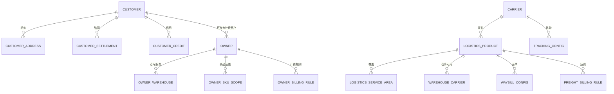

# 20 客户/货主与物流商字段模型

> 本文承接 [客户/货主与物流商主数据流程](19-客户货主与物流商主数据流程.md)，细化客户、货主、物流商相关主数据的字段边界。当前版本是业务字段模型，不是最终数据库 DDL。

## 1. 设计定位

客户、货主、物流商都是供应链履约与结算的基础资料，但它们解决的问题不同。

| 主数据 | 核心问题 | 典型业务引用 |
| --- | --- | --- |
| 客户 | 谁下单、谁收货、谁付款、信用和账期是什么 | 销售订单、售后、应收、发票 |
| 货主 | 库存归谁、谁承担仓储物流费用、谁能看哪些库存 | WMS、库存、BMS、多货主权限 |
| 物流商 | 谁承运、用什么物流产品、服务哪里、怎么打单和计费 | OMS、WMS、TMS、BMS、财务 |

建模原则：

| 原则 | 说明 |
| --- | --- |
| 客户和货主可分可合 | 自营场景货主通常是企业自己；三方仓、平台仓配场景客户和货主可能是不同主体 |
| 地址、结算、信用要独立建模 | 地址会多版本，结算会变更，信用会冻结，不宜全部塞进客户主表 |
| 货主是库存维度 | 中央库存和 WMS 必须能按 `owner_id` 隔离库存、作业、权限和计费 |
| 物流产品不是物流商本身 | 一个物流商可以有多个产品，如标快、冷链、大件、同城、退货取件 |
| 服务区域和计费规则要版本化 | 区域、禁运、价格频繁变化，必须按生效期或版本控制 |

## 2. 模型关系

## 3. 建议表结构

| 表 | 作用 | 主体 |
| --- | --- | --- |
| `customer` | 客户基础档案 | 客户 |
| `customer_address` | 客户收货、退货、开票地址 | 客户地址 |
| `customer_settlement` | 客户税务、账期、开票、收款规则 | 客户结算 |
| `customer_credit` | 客户信用额度、风控和冻结规则 | 客户信用 |
| `owner` | 货主基础档案 | 货主 |
| `owner_warehouse` | 货主可用仓库和作业开关 | 货主仓关系 |
| `owner_sku_scope` | 货主可操作商品范围 | 货主商品范围 |
| `owner_billing_rule` | 货主仓储、操作、物流计费规则 | 货主计费 |
| `carrier` | 物流商基础档案 | 物流商 |
| `logistics_product` | 物流产品/服务 | 物流产品 |
| `logistics_service_area` | 服务区域、时效、禁运和偏远规则 | 服务区域 |
| `warehouse_carrier` | 仓库可用物流产品和揽收规则 | 仓库承运商关系 |
| `waybill_config` | 面单账号、模板、打印规则 | 面单 |
| `tracking_config` | 轨迹查询、订阅、回调规则 | 轨迹 |
| `freight_billing_rule` | 运费计费规则和生效期 | 运费 |
| `master_data_change_log` | 主数据变更日志 | 审计 |

## 4. 客户字段模型

### 4.1 客户档案 `customer`

| 字段 | 含义 | 说明 |
| --- | --- | --- |
| `customer_id` | 客户主键 | 系统内部唯一 ID |
| `customer_code` | 客户编码 | 对业务可见，全局唯一 |
| `customer_name` | 客户名称 | 个人、企业、门店、经销商名称 |
| `customer_short_name` | 客户简称 | 展示和检索 |
| `customer_type` | 客户类型 | 个人、企业、门店、经销商、平台、渠道客户 |
| `business_type` | 业务类型 | B2C、B2B、平台、三方仓服务等 |
| `source_channel` | 来源渠道 | 自营、平台、线下、导入、OpenAPI |
| `external_customer_code` | 外部客户编码 | 渠道或 ERP 客户编码 |
| `owner_org_id` | 归属组织 | 业务归属和权限 |
| `sales_owner_id` | 负责销售 | 客户经理或业务负责人 |
| `industry` | 行业 | B2B 客户分析用 |
| `customer_level` | 客户等级 | 普通、重点、KA、战略客户等 |
| `default_currency` | 默认币种 | 结算默认币种 |
| `default_payment_terms` | 默认账期 | 可被结算表覆盖 |
| `status` | 客户状态 | 草稿、待审核、已启用、已冻结、已停用 |
| `freeze_reason` | 冻结原因 | 信用、合同、风控、欠款等 |
| `version_no` | 版本号 | 事件分发和缓存刷新 |
| `created_by` | 创建人 | 审计字段 |
| `created_at` | 创建时间 | 审计字段 |
| `updated_by` | 更新人 | 审计字段 |
| `updated_at` | 更新时间 | 审计字段 |

客户档案不直接承载所有地址、账期和信用细节，这些信息变化频繁，应拆到独立表。

### 4.2 客户地址 `customer_address`

| 字段 | 含义 | 说明 |
| --- | --- | --- |
| `address_id` | 地址 ID | 主键 |
| `customer_id` | 客户 ID | 关联客户 |
| `address_type` | 地址类型 | 收货地址、退货地址、开票地址、办公地址 |
| `address_name` | 地址名称 | 如华东仓收货地址、总部开票地址 |
| `country` | 国家 | 跨境场景必填 |
| `province` | 省/州 | 地址结构 |
| `city` | 城市 | 地址结构 |
| `district` | 区县 | 地址结构 |
| `street` | 街道 | 可选 |
| `detail_address` | 详细地址 | 门牌、楼层、园区等 |
| `postal_code` | 邮编 | TMS/跨境可用 |
| `longitude` | 经度 | 路由、配送范围校验 |
| `latitude` | 纬度 | 路由、配送范围校验 |
| `contact_name` | 联系人 | 配送和售后使用 |
| `contact_phone` | 联系电话 | 配送和售后使用 |
| `is_default` | 是否默认 | 同类型地址默认唯一 |
| `delivery_region_code` | 配送区域编码 | OMS/TMS 路由使用 |
| `address_status` | 地址状态 | 启用、停用 |
| `effective_from` | 生效时间 | 地址版本 |
| `effective_to` | 失效时间 | 地址版本 |

地址变更不应改写历史订单。销售单、售后单、物流单应保存地址快照。

### 4.3 客户结算 `customer_settlement`

| 字段 | 含义 | 说明 |
| --- | --- | --- |
| `settlement_id` | 结算资料 ID | 主键 |
| `customer_id` | 客户 ID | 关联客户 |
| `settlement_customer_name` | 结算主体名称 | 发票和应收主体 |
| `tax_no` | 税号 | 企业客户开票 |
| `invoice_type` | 发票类型 | 普票、专票、电子票、不开票 |
| `invoice_title` | 发票抬头 | 开票使用 |
| `invoice_address` | 开票地址 | 可关联地址或快照 |
| `bank_name` | 开户行 | 收款/退款或对公资料 |
| `bank_account` | 银行账号 | 对公结算 |
| `settlement_currency` | 结算币种 | 默认人民币，可跨境 |
| `payment_terms` | 账期 | 现结、月结 30 天、月结 60 天等 |
| `settlement_cycle` | 结算周期 | 日结、周结、月结 |
| `reconciliation_required` | 是否需要对账 | B2B 常需要 |
| `status` | 状态 | 启用、停用 |
| `effective_from` | 生效时间 | 结算规则版本 |
| `effective_to` | 失效时间 | 结算规则版本 |

### 4.4 客户信用 `customer_credit`

| 字段 | 含义 | 说明 |
| --- | --- | --- |
| `credit_id` | 信用记录 ID | 主键 |
| `customer_id` | 客户 ID | 关联客户 |
| `credit_limit` | 信用额度 | 应收占用上限 |
| `used_credit_amount` | 已占用额度 | 可由财务/风控读模型维护 |
| `available_credit_amount` | 可用额度 | 可计算字段 |
| `credit_currency` | 信用币种 | 额度币种 |
| `credit_status` | 信用状态 | 正常、预警、冻结、停用 |
| `overdue_days_limit` | 逾期天数上限 | 超期冻结 |
| `overdue_amount_limit` | 逾期金额上限 | 超额冻结 |
| `order_hold_rule` | 下单拦截规则 | 超额禁止下单、仅预警、人工审批 |
| `shipment_hold_rule` | 发货拦截规则 | 超额禁止发货、人工放行 |
| `approved_by` | 审批人 | 财务或风控 |
| `approved_at` | 审批时间 | 审计 |
| `effective_from` | 生效时间 | 信用版本 |
| `effective_to` | 失效时间 | 信用版本 |

信用数据会影响 OMS 接单和发货控制，但不应影响已经完成的历史订单。

## 5. 货主字段模型

### 5.1 货主档案 `owner`

| 字段 | 含义 | 说明 |
| --- | --- | --- |
| `owner_id` | 货主主键 | 库存维度之一 |
| `owner_code` | 货主编码 | 对业务可见，全局唯一 |
| `owner_name` | 货主名称 | 品牌方、商家、事业部、企业自身 |
| `owner_type` | 货主类型 | 自有、三方货主、平台商家、事业部 |
| `billing_customer_id` | 计费客户 ID | 仓储服务或物流费用归属 |
| `owner_org_id` | 归属组织 | 权限和管理归属 |
| `default_currency` | 默认币种 | BMS 计费默认 |
| `inventory_ownership_type` | 货权类型 | 自有库存、寄售、代管、客户库存 |
| `stock_isolation_level` | 库存隔离级别 | 货主隔离、货主+仓隔离、共享库存 |
| `data_isolation_level` | 数据隔离级别 | 订单、库存、账单可见范围 |
| `status` | 货主状态 | 草稿、待审核、已启用、已冻结、已停用 |
| `freeze_reason` | 冻结原因 | 欠费、合同到期、风控等 |
| `version_no` | 版本号 | 事件分发和缓存刷新 |
| `created_by` | 创建人 | 审计字段 |
| `created_at` | 创建时间 | 审计字段 |
| `updated_by` | 更新人 | 审计字段 |
| `updated_at` | 更新时间 | 审计字段 |

货主是库存台账关键维度。库存余额建议至少按 `sku_id + warehouse_id + owner_id + inventory_status` 建模。

### 5.2 货主仓关系 `owner_warehouse`

| 字段 | 含义 | 说明 |
| --- | --- | --- |
| `owner_warehouse_id` | 货主仓关系 ID | 主键 |
| `owner_id` | 货主 ID | 关联货主 |
| `warehouse_id` | 仓库 ID | 关联仓库 |
| `inbound_enabled` | 是否允许入库 | 采购入库、退货入库、调拨入库 |
| `outbound_enabled` | 是否允许出库 | 销售出库、退供出库 |
| `transfer_enabled` | 是否允许调拨 | 仓间调拨 |
| `return_enabled` | 是否允许退货 | 售后退货入库 |
| `billing_enabled` | 是否启用计费 | BMS 计费开关 |
| `default_return_warehouse` | 是否默认退货仓 | OMS 售后退货选仓 |
| `default_ship_warehouse` | 是否默认发货仓 | OMS 分仓 |
| `storage_area_limit` | 可用库区限制 | 限定冷链、残次、贵品区等 |
| `service_start_date` | 服务开始日期 | 合同/计费 |
| `service_end_date` | 服务结束日期 | 合同/计费 |
| `status` | 状态 | 启用、冻结、停用 |

停用货主仓关系前，必须校验该货主在该仓是否仍有库存、在途、未完成作业、未结费用。

### 5.3 货主商品范围 `owner_sku_scope`

| 字段 | 含义 | 说明 |
| --- | --- | --- |
| `owner_sku_scope_id` | 范围 ID | 主键 |
| `owner_id` | 货主 ID | 关联货主 |
| `sku_id` | SKU ID | 关联商品 |
| `warehouse_id` | 仓库 ID | 可为空，表示全仓通用 |
| `inbound_enabled` | 是否允许入库 | WMS 收货校验 |
| `outbound_enabled` | 是否允许出库 | WMS 拣货/出库校验 |
| `transfer_enabled` | 是否允许调拨 | 调拨校验 |
| `return_enabled` | 是否允许退货入库 | 售后退货校验 |
| `storage_rule_id` | 存储规则 ID | 可引用 SKU/仓储规则 |
| `billing_category` | 计费分类 | BMS 计费维度 |
| `status` | 状态 | 启用、停用 |
| `effective_from` | 生效时间 | 版本控制 |
| `effective_to` | 失效时间 | 版本控制 |

### 5.4 货主计费规则 `owner_billing_rule`

| 字段 | 含义 | 说明 |
| --- | --- | --- |
| `owner_billing_rule_id` | 计费规则 ID | 主键 |
| `owner_id` | 货主 ID | 计费对象 |
| `warehouse_id` | 仓库 ID | 可为空，表示全局 |
| `billing_customer_id` | 账单客户 ID | 可与货主不同 |
| `service_type` | 服务类型 | 仓储、入库、出库、退货、盘点、增值服务、物流 |
| `billing_item_code` | 计费项编码 | 入库操作费、存储费、耗材费等 |
| `billing_unit` | 计费单位 | 件、箱、托、单、立方、天、票 |
| `price` | 单价 | 计费价格 |
| `currency` | 币种 | 金额币种 |
| `tax_rate` | 税率 | BMS/财务使用 |
| `free_quota` | 免费额度 | 免仓期、免费操作量等 |
| `min_charge_amount` | 最低收费 | 保底费用 |
| `effective_from` | 生效时间 | 价格版本 |
| `effective_to` | 失效时间 | 价格版本 |
| `status` | 状态 | 启用、停用 |

## 6. 物流商字段模型

### 6.1 物流商档案 `carrier`

| 字段 | 含义 | 说明 |
| --- | --- | --- |
| `carrier_id` | 物流商主键 | 系统内部唯一 ID |
| `carrier_code` | 物流商编码 | 对业务可见，全局唯一 |
| `carrier_name` | 物流商名称 | 快递、三方物流、干线、冷链等 |
| `carrier_short_name` | 物流商简称 | 展示和检索 |
| `carrier_type` | 物流商类型 | 快递、零担、整车、同城、冷链、跨境、海外尾程 |
| `service_scope` | 服务范围 | 国内、跨境、海外、本地 |
| `owner_org_id` | 归属组织 | 管理和权限 |
| `contact_name` | 联系人 | 业务联系人 |
| `contact_phone` | 联系电话 | 业务联系 |
| `customer_service_phone` | 客服电话 | 售后和异常处理 |
| `tax_no` | 税号 | 运费结算和发票 |
| `settlement_currency` | 结算币种 | 默认币种 |
| `payment_terms` | 账期 | 应付运费账期 |
| `status` | 物流商状态 | 草稿、待审核、待联调、已启用、已冻结、已停用 |
| `freeze_reason` | 冻结原因 | 服务异常、合同、风控等 |
| `version_no` | 版本号 | 事件分发和缓存刷新 |
| `created_by` | 创建人 | 审计字段 |
| `created_at` | 创建时间 | 审计字段 |
| `updated_by` | 更新人 | 审计字段 |
| `updated_at` | 更新时间 | 审计字段 |

### 6.2 物流产品 `logistics_product`

| 字段 | 含义 | 说明 |
| --- | --- | --- |
| `logistics_product_id` | 物流产品 ID | 主键 |
| `carrier_id` | 物流商 ID | 关联物流商 |
| `product_code` | 产品编码 | 如 SF_STANDARD、COLD_CHAIN |
| `product_name` | 产品名称 | 标快、特快、冷链、大件、同城、退货取件 |
| `service_type` | 服务类型 | 正向配送、逆向取件、调拨干线、退供应商 |
| `transport_mode` | 运输方式 | 快递、陆运、空运、海运、铁路、同城 |
| `temperature_type` | 温控类型 | 常温、冷藏、冷冻、恒温 |
| `heavy_cargo_supported` | 是否支持大件 | 大件商品校验 |
| `dangerous_goods_supported` | 是否支持危险品 | 合规校验 |
| `cod_supported` | 是否支持到付/代收 | 特殊业务 |
| `pickup_supported` | 是否支持上门取件 | 退货取件 |
| `insured_supported` | 是否支持保价 | 高价值商品 |
| `promise_days` | 承诺时效天数 | OMS 履约承诺 |
| `cutoff_time` | 截单时间 | 超时顺延 |
| `status` | 状态 | 草稿、待联调、已启用、已停用 |
| `effective_from` | 生效时间 | 产品版本 |
| `effective_to` | 失效时间 | 产品版本 |

物流产品决定 OMS/TMS 能否选择该服务，也影响 WMS 打单、TMS 下单和 BMS 计费。

### 6.3 服务区域 `logistics_service_area`

| 字段 | 含义 | 说明 |
| --- | --- | --- |
| `service_area_id` | 服务区域 ID | 主键 |
| `logistics_product_id` | 物流产品 ID | 关联产品 |
| `origin_country` | 起始国家 | 跨境场景 |
| `origin_region_code` | 起始区域 | 可到省市区或仓库服务区 |
| `destination_country` | 目的国家 | 跨境场景 |
| `destination_region_code` | 目的区域 | 可到省市区、邮编段 |
| `service_enabled` | 是否可达 | 不可达时 OMS/TMS 禁用 |
| `remote_area_flag` | 是否偏远 | 运费和时效可能不同 |
| `forbidden_flag` | 是否禁运 | 禁运区域不能下单 |
| `promise_days` | 承诺时效 | 区域级时效 |
| `pickup_frequency` | 揽收频次 | 每日、多日、预约 |
| `delivery_frequency` | 派送频次 | 每日、多日、预约 |
| `status` | 状态 | 启用、停用 |
| `effective_from` | 生效时间 | 区域版本 |
| `effective_to` | 失效时间 | 区域版本 |

### 6.4 仓库承运商关系 `warehouse_carrier`

| 字段 | 含义 | 说明 |
| --- | --- | --- |
| `warehouse_carrier_id` | 仓库承运商关系 ID | 主键 |
| `warehouse_id` | 仓库 ID | 发货仓或退货仓 |
| `carrier_id` | 物流商 ID | 承运商 |
| `logistics_product_id` | 物流产品 ID | 仓库可用服务 |
| `ship_enabled` | 是否允许发货 | 正向出库 |
| `return_pickup_enabled` | 是否允许退货取件 | 售后逆向 |
| `supplier_return_enabled` | 是否允许退供运输 | 退供应商 |
| `pickup_time_window` | 揽收时间窗 | WMS 交接 |
| `cutoff_time` | 仓库截单时间 | OMS/WMS 使用 |
| `handover_location` | 交接地点 | 仓库月台、网点、自提点 |
| `account_no` | 承运商账号 | 下单/打单账号 |
| `priority` | 优先级 | TMS 路由选择 |
| `status` | 状态 | 启用、冻结、停用 |

### 6.5 面单配置 `waybill_config`

| 字段 | 含义 | 说明 |
| --- | --- | --- |
| `waybill_config_id` | 面单配置 ID | 主键 |
| `carrier_id` | 物流商 ID | 承运商 |
| `logistics_product_id` | 物流产品 ID | 物流产品 |
| `account_no` | 电子面单账号 | 承运商账号 |
| `template_code` | 面单模板编码 | WMS 打印 |
| `template_name` | 面单模板名称 | 展示 |
| `printer_type` | 打印机类型 | 热敏、A4、标签 |
| `print_size` | 打印尺寸 | 100x180、A5 等 |
| `is_return_label` | 是否退货面单 | 售后逆向 |
| `sender_name` | 默认寄件人 | 可被仓库覆盖 |
| `sender_phone` | 默认寄件电话 | 可被仓库覆盖 |
| `sender_address` | 默认寄件地址 | 可被仓库覆盖 |
| `status` | 状态 | 待联调、启用、停用 |
| `tested_at` | 联调时间 | WMS/TMS 测试通过时间 |

### 6.6 轨迹配置 `tracking_config`

| 字段 | 含义 | 说明 |
| --- | --- | --- |
| `tracking_config_id` | 轨迹配置 ID | 主键 |
| `carrier_id` | 物流商 ID | 承运商 |
| `tracking_method` | 轨迹方式 | 查询、订阅、回调、文件 |
| `api_endpoint` | API 地址 | TMS 调用 |
| `callback_url` | 回调地址 | 承运商推送 |
| `auth_type` | 鉴权方式 | Token、签名、OAuth、账号密码 |
| `polling_interval_minutes` | 轮询间隔 | 查询模式使用 |
| `tracking_enabled` | 是否启用轨迹 | TMS 开关 |
| `sign_event_code` | 签收事件编码 | 映射承运商事件 |
| `exception_event_codes` | 异常事件编码 | 延误、破损、拒收、丢失等 |
| `status` | 状态 | 待联调、启用、停用 |
| `tested_at` | 联调时间 | TMS 测试通过时间 |

### 6.7 运费规则 `freight_billing_rule`

| 字段 | 含义 | 说明 |
| --- | --- | --- |
| `freight_rule_id` | 运费规则 ID | 主键 |
| `carrier_id` | 物流商 ID | 承运商 |
| `logistics_product_id` | 物流产品 ID | 物流产品 |
| `billing_rule_code` | 规则编码 | 对账和版本识别 |
| `origin_region_code` | 起始区域 | 可为空表示全局 |
| `destination_region_code` | 目的区域 | 可为空表示全局 |
| `billing_unit` | 计费单位 | 重量、体积、票、件、公里、托 |
| `first_weight` | 首重 | 快递常用 |
| `first_weight_price` | 首重价格 | 快递常用 |
| `additional_weight_unit` | 续重单位 | 快递常用 |
| `additional_weight_price` | 续重价格 | 快递常用 |
| `volumetric_factor` | 泡重系数 | 体积重量计算 |
| `min_charge_amount` | 最低收费 | 保底运费 |
| `fuel_surcharge_rate` | 燃油附加费率 | 可选 |
| `remote_area_surcharge` | 偏远附加费 | 偏远地区 |
| `insurance_rate` | 保价费率 | 高价值商品 |
| `currency` | 币种 | 金额币种 |
| `tax_rate` | 税率 | 财务使用 |
| `settlement_cycle` | 结算周期 | 周结、月结 |
| `effective_from` | 生效时间 | 价格版本 |
| `effective_to` | 失效时间 | 价格版本 |
| `status` | 状态 | 启用、停用 |

运费规则应带生效期。历史运单应保存费用快照，不能因为新价格生效而改写历史结算。

## 7. 字段变更规则

| 字段类型 | 处理建议 | 影响 |
| --- | --- | --- |
| 客户名称、联系人 | 可审批后同步 | 影响展示，不改历史订单快照 |
| 客户税号、发票主体 | 严格审批 | 影响应收和发票 |
| 客户账期、信用额度 | 财务审批 | 影响接单、发货和应收风险 |
| 客户地址 | 多版本维护 | 影响新订单和售后，不改历史运单 |
| 货主仓关系 | 仓储/BMS 审批 | 影响 WMS 作业、库存维度和计费 |
| 货主库存隔离级别 | 高风险，谨慎变更 | 影响库存查询、预占和权限 |
| 物流服务区域 | OMS/TMS 校验后发布 | 影响分仓、路由和配送承诺 |
| 面单账号/模板 | 必须联调 | 影响 WMS 打单和发货 |
| 轨迹接口 | 必须联调 | 影响签收、售后和异常判断 |
| 运费规则 | 带生效期审批 | 影响新运单费用，不改历史费用快照 |

## 8. 子系统使用映射

| 子系统 | 主要使用字段 | 用途 |
| --- | --- | --- |
| OMS | 客户、地址、信用、物流产品、服务区域 | 接单、分仓、履约承诺、售后 |
| WMS | 货主、货主仓关系、货主商品范围、面单配置 | 收货、上架、拣货、打单、盘点 |
| 中央库存 | 货主、货主仓关系、库存隔离级别 | 库存余额、预占、扣减、调拨、流水 |
| TMS | 物流商、物流产品、服务区域、轨迹配置、仓库承运商 | 物流下单、路由、轨迹、签收 |
| BMS | 货主计费规则、运费规则、客户结算 | 仓储费、操作费、物流费、账单 |
| 财务 | 客户结算、物流商结算、税号、账期、发票 | 应收、应付、发票、收付款 |
| 报表 | 客户类型、货主、物流商、产品、区域 | 销售、库存、物流成本、服务绩效分析 |

## 9. 第一版最小字段集

| 对象 | P0 字段 |
| --- | --- |
| 客户档案 | `customer_id`、`customer_code`、`customer_name`、`customer_type`、`owner_org_id`、`status` |
| 客户地址 | `customer_id`、`address_type`、`province`、`city`、`district`、`detail_address`、`contact_name`、`contact_phone`、`is_default` |
| 客户结算 | `customer_id`、`tax_no`、`invoice_type`、`settlement_currency`、`payment_terms`、`status` |
| 客户信用 | `customer_id`、`credit_limit`、`credit_status`、`order_hold_rule`、`shipment_hold_rule` |
| 货主档案 | `owner_id`、`owner_code`、`owner_name`、`owner_type`、`billing_customer_id`、`status` |
| 货主仓关系 | `owner_id`、`warehouse_id`、`inbound_enabled`、`outbound_enabled`、`transfer_enabled`、`billing_enabled`、`status` |
| 货主商品范围 | `owner_id`、`sku_id`、`warehouse_id`、`inbound_enabled`、`outbound_enabled`、`status` |
| 物流商档案 | `carrier_id`、`carrier_code`、`carrier_name`、`carrier_type`、`status` |
| 物流产品 | `logistics_product_id`、`carrier_id`、`product_code`、`product_name`、`service_type`、`status` |
| 服务区域 | `logistics_product_id`、`origin_region_code`、`destination_region_code`、`service_enabled`、`promise_days`、`status` |
| 仓库承运商 | `warehouse_id`、`carrier_id`、`logistics_product_id`、`ship_enabled`、`pickup_time_window`、`cutoff_time`、`status` |
| 面单配置 | `carrier_id`、`logistics_product_id`、`account_no`、`template_code`、`print_size`、`status` |
| 轨迹配置 | `carrier_id`、`tracking_method`、`callback_url`、`tracking_enabled`、`status` |
| 运费规则 | `carrier_id`、`logistics_product_id`、`billing_unit`、`currency`、`effective_from`、`effective_to`、`status` |

## DDD 对齐说明

本文属于主数据上下文。主数据是多个业务上下文的上游发布语言，负责统一基础资料编码、状态、版本和字段快照。业务系统可以缓存主数据，但不能绕过主数据上下文自行创造核心口径；关键字段变更必须通过版本、审批、事件分发和兼容策略处理。

| DDD 关注点 | 主数据要求 |
| --- | --- |
| 数据主权 | 主数据中心拥有权威定义 |
| 发布语言 | 启用、变更、停用事件必须稳定 |
| 字段快照 | 历史单据、库存流水、费用明细必须保留关键快照 |
| 防腐层 | 外部 ERP/平台资料进入前要转换成本系统主数据模型 |

## 10. 继续上下文

当前结论：客户字段模型要支撑销售接单、地址履约、信用控制和应收结算；货主字段模型要支撑库存隔离、仓内作业、数据权限和仓储计费；物流商字段模型要支撑物流产品选择、服务区域校验、面单打印、轨迹回传和运费结算。

关键假设：主数据中心是客户、货主、物流商字段的权威来源；子系统可以缓存，但必须通过版本号和主数据变更事件同步；历史订单、库存流水、运单和账单必须保存关键字段快照。

待决问题：是否支持跨境、多币种、多货主共享库存、冷链/大件/危险品物流。如果支持，需要继续扩展税务、海关、温控、禁运和计费字段。

下一步：建议继续细化 `组织/权限主数据流程` 或 `地址/区域主数据流程`，它们会影响所有子系统的数据权限和配送范围判断。
