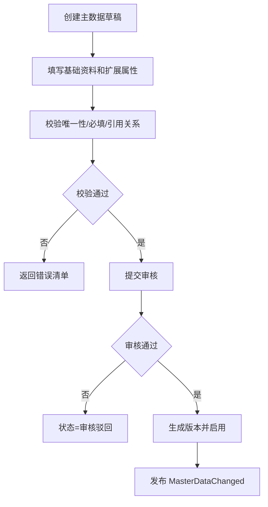
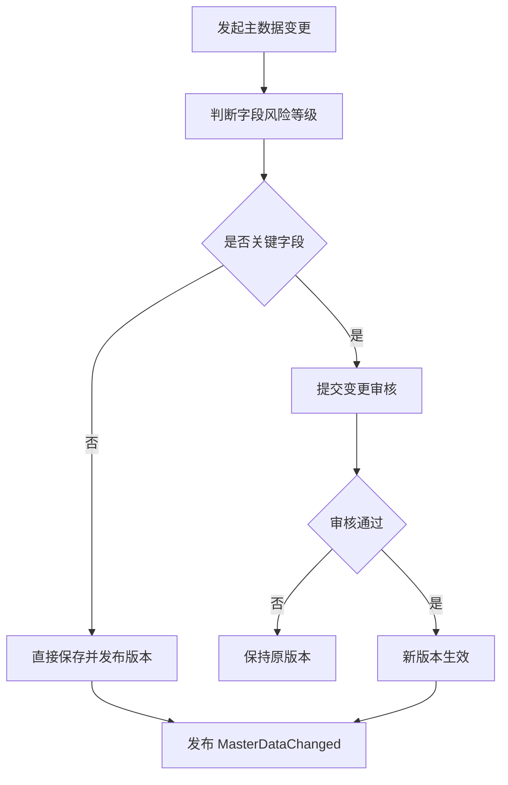
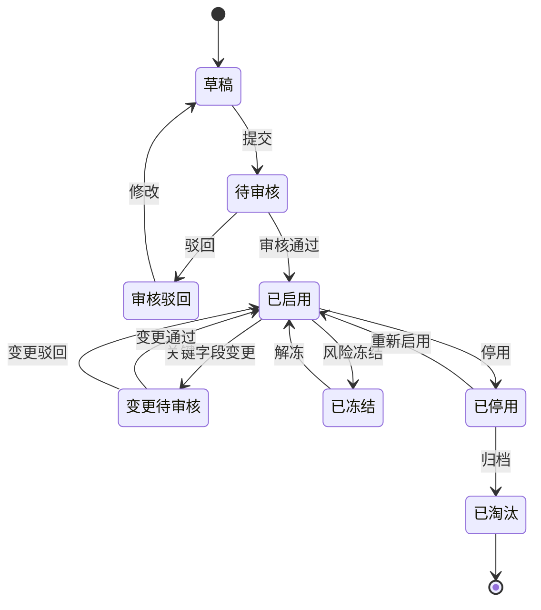
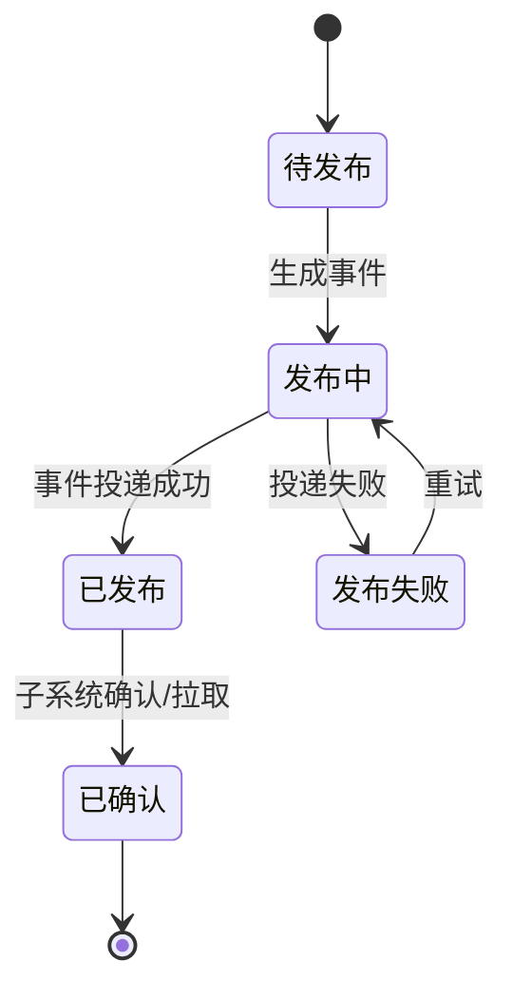

# 36 主数据系统功能设计

> 主数据系统负责商品、供应商、客户、货主、仓库、物流商、组织等基础资料的建档、审核、版本和分发。本文聚焦主数据系统自身功能、角色、状态和事件。

## 1. 系统定位

| 边界 | 说明 |
| --- | --- |
| 负责 | 主数据建档、校验、审核、版本、发布、分发、变更日志 |
| 不负责 | 业务单据执行、库存记账、仓库作业、财务入账 |
| 核心数据 | SPU/SKU、供应商、客户、货主、仓库/库位、物流商、组织、地址、税率、币种 |

## 2. 使用角色

| 角色 | 使用功能 | 典型动作 |
| --- | --- | --- |
| 主数据专员 | 建档、维护、审核流转 | 创建 SKU、供应商、仓库、物流商 |
| 商品运营 | 商品资料 | 维护 SPU/SKU、属性、图片 |
| 采购/供应商管理 | 供应商资料 | 供应商准入、供应商商品 |
| 仓储运营 | 仓库库位 | 新仓、库区、库位、货主仓关系 |
| 物流运营 | 物流商 | 物流产品、服务区域、面单 |
| 财务 | 税率、结算资料 | 审核税号、账期、账户 |
| 系统管理员 | 编码、模板、权限 | 配置编码规则、审批规则 |

## 3. 功能地图

| 模块 | 功能 | 说明 |
| --- | --- | --- |
| 商品主数据 | SPU/SKU、类目、属性、条码、包装、单位 | 商品权威来源 |
| 合作伙伴 | 供应商、客户、货主、物流商 | 业务主体 |
| 仓储主数据 | 仓库、库区、库位、货主仓关系 | 库存地点 |
| 物流主数据 | 物流产品、服务区域、面单、轨迹 | 物流能力 |
| 组织主数据 | 公司、部门、岗位、成本中心 | 权限和财务归属 |
| 审核发布 | 草稿、审核、启用、停用、版本 | 变更控制 |
| 分发同步 | 事件、API、批量导入导出 | 子系统同步 |
| 数据质量 | 唯一性、必填、引用、重复合并 | 治理 |

## 4. 核心操作流程

### 4.1 主数据建档发布流程

### 4.2 主数据变更流程

## 5. 数据状态机

### 5.1 通用主数据状态

### 5.2 分发状态

## 6. 生产事件

| 事件 | 触发动作 | 关键载荷 |
| --- | --- | --- |
| `MasterDataChanged` | 任意主数据启用/变更/停用 | `master_data_type`、`data_id`、`version_no`、`change_type` |
| `SkuEnabled` | SKU 启用 | `sku_id`、`sku_code`、`stock_unit`、`attributes` |
| `SupplierEnabled` | 供应商启用 | `supplier_id`、`supplier_code`、`status` |
| `CustomerEnabled` | 客户启用 | `customer_id`、`customer_code`、`status` |
| `OwnerEnabled` | 货主启用 | `owner_id`、`owner_code`、`warehouse_scope` |
| `WarehouseEnabled` | 仓库启用 | `warehouse_id`、`warehouse_code`、`status` |
| `CarrierEnabled` | 物流商/产品启用 | `carrier_id`、`logistics_product_id`、`service_area` |
| `MasterDataDisabled` | 主数据停用 | `master_data_type`、`data_id`、`reason` |

## 7. 消费事件

| 事件 | 来源 | 消费后数据变化 |
| --- | --- | --- |
| `ApprovalCompleted` | 权限/审批系统 | 主数据状态从待审核变为已启用或审核驳回 |
| `DataQualityIssueDetected` | 数据质量任务 | 生成数据治理待办，可能冻结主数据 |
| `WarehouseValidationPassed` | WMS | 仓库资料状态从待验收变为可启用 |
| `CarrierIntegrationTestPassed` | TMS/WMS | 物流产品状态从待联调变为可启用 |
| `FinanceSettlementValidated` | 财务/BMS | 结算资料审核通过 |

## 8. 事件处理规则

| 规则 | 说明 |
| --- | --- |
| 版本号 | 每次有效变更递增 `version_no` |
| 快照 | 子系统引用主数据时保存必要快照 |
| 高风险字段 | 单位换算、库存维度、税号、地址、物流规则需审批 |
| 补偿拉取 | 子系统事件丢失时可按版本号 API 拉取 |

## DDD 对齐说明

本文属于 **主数据上下文**。设计时应把页面、字段和流程统一回到该上下文的模型边界，避免跨上下文直接修改数据。

| DDD 项 | 对齐口径 |
| --- | --- |
| 限界上下文 | 主数据上下文 |
| 核心聚合 | SKU、Supplier、WarehouseLocation、Customer、Owner、Carrier |
| 数据主权 | 基础资料权威来源和发布语言 |
| 生产事件 | 只发布本上下文已经发生的业务事实 |
| 消费事件 | 消费外部事实时必须记录 event_id、幂等键、处理状态和失败原因 |
| 查询模型 | 列表、看板、导出可使用读模型，不强行加载聚合 |

## 9. 继续上下文

当前结论：主数据系统是基础资料权威来源，核心动作是校验、审核、启用、发布和版本控制。

关键假设：子系统可以缓存主数据，但不能绕过主数据系统创造核心口径。
