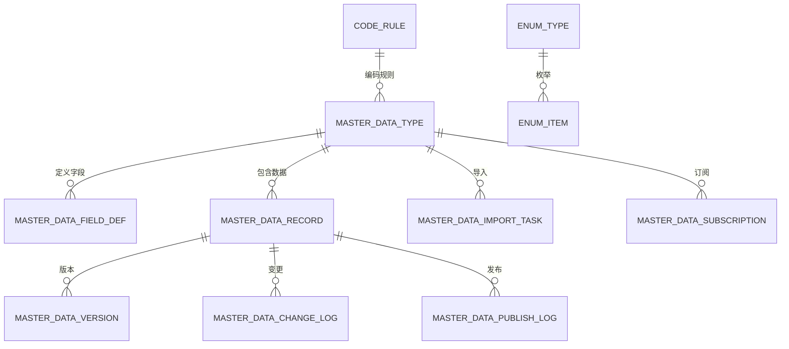
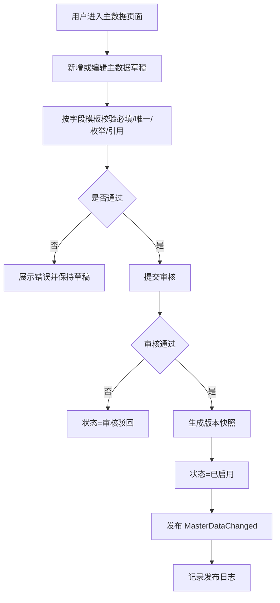

# 39 主数据系统详细设计

> 本文承接 [主数据系统功能设计](./36-主数据系统功能设计.md)，按 [权限系统详细设计](../权限系统/38-权限系统详细设计.md) 的模式，细化主数据系统的页面、字段、枚举、权限点、审核发布、版本分发和操作日志。当前版本是系统设计级字段模型，不是最终数据库 DDL。

## 1. 设计目标

主数据系统要统一管理供应链所有基础资料，回答四个问题：

| 问题 | 设计对象 |
| --- | --- |
| 管哪些主数据 | 主数据类型、主数据对象、字段模板 |
| 如何新增和变更 | 草稿、校验、审核、启用、停用、版本 |
| 如何分发给子系统 | 事件发布、订阅配置、发布记录、补偿拉取 |
| 如何追溯 | 版本快照、变更日志、导入日志、发布日志、操作日志 |

核心原则：

| 原则 | 说明 |
| --- | --- |
| 主数据系统是权威来源 | 子系统可以缓存，但不能绕过主数据系统创建核心口径 |
| 主数据类型可配置 | SPU、SKU、供应商、仓库、客户、货主、物流商等使用统一框架管理 |
| 字段模板可配置 | 不同主数据类型有不同字段、必填、枚举、校验规则 |
| 关键变更要版本化 | 影响库存、履约、结算、权限的字段需要审批和版本记录 |
| 发布要可追溯 | 每次启用、变更、停用都要有事件、版本和发布结果 |

## 2. 总体模型

## 3. 功能页面

| 页面 | 主要用途 | 展示字段 | 主要操作 |
| --- | --- | --- | --- |
| 主数据类型管理 | 配置有哪些主数据 | 类型编码、类型名称、所属领域、状态 | 新增、编辑、启用、停用 |
| 字段模板管理 | 配置不同类型的字段 | 字段编码、字段名称、类型、必填、枚举 | 新增字段、编辑字段、排序、停用 |
| 编码规则管理 | 配置自动编码 | 规则编码、前缀、流水号、适用类型 | 新增、编辑、启用、停用、预览 |
| 商品主数据页 | 管理 SPU/SKU | 编码、名称、类目、品牌、状态、版本 | 新增、编辑、提交审核、启用、停用 |
| 合作伙伴主数据页 | 管理供应商、客户、货主、物流商 | 编码、名称、类型、状态、版本 | 新增、编辑、审核、启停 |
| 仓储主数据页 | 管理仓库、库区、库位 | 仓库、库区、库位、类型、状态 | 新增、编辑、启停 |
| 主数据审核页 | 处理建档和关键变更 | 类型、对象、变更摘要、申请人、状态 | 审核通过、驳回 |
| 主数据发布页 | 查看发布和重试 | 类型、对象、版本、目标系统、发布状态 | 重试、查看详情 |
| 导入导出页 | 批量维护主数据 | 任务号、类型、成功数、失败数、状态 | 下载模板、导入、导出、查看错误 |
| 变更日志页 | 追溯字段变更 | 对象、字段、旧值、新值、操作人 | 查询、导出 |
| 枚举配置页 | 配置字段枚举 | 枚举类型、枚举值、显示名、状态 | 新增、编辑、排序、停用 |

## 4. 主数据建档与发布流程

## 5. 字段模型

### 5.1 主数据类型 `master_data_type`

| 字段 | 类型 | 是否必填 | 枚举/约束 | 说明 |
| --- | --- | --- | --- | --- |
| `type_id` | bigint | 是 | 主键 | 主数据类型 ID |
| `type_code` | varchar(64) | 是 | 唯一 | 类型编码，如 `SKU`、`SUPPLIER` |
| `type_name` | varchar(128) | 是 |  | 类型名称 |
| `domain` | varchar(32) | 是 | `MASTER_DATA_DOMAIN` | 商品、伙伴、仓储、物流、组织、财务 |
| `parent_type_code` | varchar(64) | 否 |  | 上级类型，如 SKU 的上级是 SPU |
| `code_rule_id` | bigint | 否 | 外键 | 默认编码规则 |
| `approval_required` | boolean | 是 | true/false | 是否需要审核 |
| `version_enabled` | boolean | 是 | true/false | 是否启用版本 |
| `publish_enabled` | boolean | 是 | true/false | 是否发布给子系统 |
| `status` | varchar(32) | 是 | `COMMON_STATUS` | 启用、停用 |
| `sort_no` | int | 否 |  | 排序 |
| `remark` | varchar(512) | 否 |  | 说明 |
| `created_by` | bigint | 是 |  | 创建人 |
| `created_at` | datetime | 是 |  | 创建时间 |
| `updated_by` | bigint | 否 |  | 更新人 |
| `updated_at` | datetime | 否 |  | 更新时间 |

对应页面：`主数据类型管理`

### 5.2 字段定义 `master_data_field_def`

用于配置不同主数据类型有哪些字段、是否必填、是否枚举、是否关键字段。

| 字段 | 类型 | 是否必填 | 枚举/约束 | 说明 |
| --- | --- | --- | --- | --- |
| `field_def_id` | bigint | 是 | 主键 | 字段定义 ID |
| `type_code` | varchar(64) | 是 | 外键 | 主数据类型 |
| `field_code` | varchar(64) | 是 | 类型内唯一 | 字段编码 |
| `field_name` | varchar(128) | 是 |  | 字段名称 |
| `field_type` | varchar(32) | 是 | `FIELD_TYPE` | 字符串、数字、日期、枚举、布尔、引用 |
| `data_length` | int | 否 |  | 字符串长度 |
| `decimal_scale` | int | 否 |  | 小数位 |
| `required` | boolean | 是 | true/false | 是否必填 |
| `unique_flag` | boolean | 是 | true/false | 是否唯一 |
| `enum_type_code` | varchar(64) | 否 | 外键 | 枚举类型 |
| `reference_type_code` | varchar(64) | 否 | 外键 | 引用的主数据类型 |
| `default_value` | varchar(256) | 否 |  | 默认值 |
| `editable_after_enabled` | boolean | 是 | true/false | 启用后是否可改 |
| `critical_flag` | boolean | 是 | true/false | 是否关键字段，关键变更需审批 |
| `visible_in_list` | boolean | 是 | true/false | 列表是否展示 |
| `visible_in_form` | boolean | 是 | true/false | 表单是否展示 |
| `sort_no` | int | 是 |  | 表单排序 |
| `status` | varchar(32) | 是 | `COMMON_STATUS` | 启用、停用 |

对应页面：`字段模板管理`

### 5.3 主数据记录 `master_data_record`

这是主数据对象的通用记录表，具体字段值可进入扩展 JSON 或按类型拆业务表。

| 字段 | 类型 | 是否必填 | 枚举/约束 | 说明 |
| --- | --- | --- | --- | --- |
| `record_id` | bigint | 是 | 主键 | 主数据记录 ID |
| `type_code` | varchar(64) | 是 | 外键 | 主数据类型 |
| `data_code` | varchar(128) | 是 | 类型内唯一 | 主数据编码 |
| `data_name` | varchar(256) | 是 |  | 主数据名称 |
| `parent_record_id` | bigint | 否 | 外键 | 上级主数据 |
| `owner_org_id` | bigint | 否 | 外键 | 归属组织 |
| `data_payload` | text | 是 | JSON | 业务字段值 |
| `data_status` | varchar(32) | 是 | `MASTER_DATA_STATUS` | 草稿、待审核、已启用等 |
| `approval_status` | varchar(32) | 是 | `APPROVAL_STATUS` | 未提交、审批中、通过、驳回 |
| `current_version` | int | 是 | 默认 1 | 当前版本 |
| `effective_from` | datetime | 否 |  | 生效时间 |
| `effective_to` | datetime | 否 |  | 失效时间 |
| `created_by` | bigint | 是 |  | 创建人 |
| `created_at` | datetime | 是 |  | 创建时间 |
| `updated_by` | bigint | 否 |  | 更新人 |
| `updated_at` | datetime | 否 |  | 更新时间 |

对应页面：各类主数据列表页，如商品、供应商、仓库、客户、物流商。

### 5.4 主数据版本 `master_data_version`

| 字段 | 类型 | 是否必填 | 枚举/约束 | 说明 |
| --- | --- | --- | --- | --- |
| `version_id` | bigint | 是 | 主键 | 版本 ID |
| `record_id` | bigint | 是 | 外键 | 主数据记录 |
| `version_no` | int | 是 | 递增 | 版本号 |
| `snapshot_payload` | text | 是 | JSON | 版本快照 |
| `change_type` | varchar(32) | 是 | `MASTER_CHANGE_TYPE` | 新增、修改、启用、停用、淘汰 |
| `change_summary` | varchar(1024) | 否 |  | 变更摘要 |
| `effective_from` | datetime | 否 |  | 生效时间 |
| `created_by` | bigint | 是 |  | 创建人 |
| `created_at` | datetime | 是 |  | 创建时间 |

对应页面：`主数据版本详情页`

### 5.5 主数据变更日志 `master_data_change_log`

| 字段 | 类型 | 是否必填 | 枚举/约束 | 说明 |
| --- | --- | --- | --- | --- |
| `change_log_id` | bigint | 是 | 主键 | 变更日志 ID |
| `record_id` | bigint | 是 | 外键 | 主数据记录 |
| `type_code` | varchar(64) | 是 |  | 主数据类型 |
| `field_code` | varchar(64) | 否 |  | 变更字段 |
| `old_value` | text | 否 |  | 旧值 |
| `new_value` | text | 否 |  | 新值 |
| `critical_flag` | boolean | 是 | true/false | 是否关键字段 |
| `change_type` | varchar(32) | 是 | `MASTER_CHANGE_TYPE` | 变更类型 |
| `operator_id` | bigint | 是 |  | 操作人 |
| `operated_at` | datetime | 是 |  | 操作时间 |

对应页面：`变更日志页`

### 5.6 发布订阅配置 `master_data_subscription`

| 字段 | 类型 | 是否必填 | 枚举/约束 | 说明 |
| --- | --- | --- | --- | --- |
| `subscription_id` | bigint | 是 | 主键 | 订阅 ID |
| `type_code` | varchar(64) | 是 | 外键 | 主数据类型 |
| `target_system` | varchar(64) | 是 | `TARGET_SYSTEM` | OMS、WMS、库存、BMS 等 |
| `event_topic` | varchar(128) | 是 |  | 事件主题 |
| `publish_mode` | varchar(32) | 是 | `PUBLISH_MODE` | 事件、API、批量 |
| `filter_rule` | text | 否 | JSON | 发布过滤规则 |
| `status` | varchar(32) | 是 | `COMMON_STATUS` | 启用、停用 |
| `created_at` | datetime | 是 |  | 创建时间 |

对应页面：`主数据订阅配置页`

### 5.7 发布日志 `master_data_publish_log`

| 字段 | 类型 | 是否必填 | 枚举/约束 | 说明 |
| --- | --- | --- | --- | --- |
| `publish_log_id` | bigint | 是 | 主键 | 发布日志 ID |
| `record_id` | bigint | 是 | 外键 | 主数据记录 |
| `type_code` | varchar(64) | 是 |  | 主数据类型 |
| `version_no` | int | 是 |  | 发布版本 |
| `target_system` | varchar(64) | 是 | `TARGET_SYSTEM` | 目标系统 |
| `event_name` | varchar(128) | 是 |  | 事件名 |
| `event_id` | varchar(128) | 是 | 唯一 | 事件 ID |
| `publish_status` | varchar(32) | 是 | `PUBLISH_STATUS` | 待发布、发布中、成功、失败 |
| `retry_count` | int | 是 | 默认 0 | 重试次数 |
| `failure_reason` | varchar(1024) | 否 |  | 失败原因 |
| `published_at` | datetime | 否 |  | 发布时间 |

对应页面：`主数据发布页`

### 5.8 编码规则 `code_rule`

| 字段 | 类型 | 是否必填 | 枚举/约束 | 说明 |
| --- | --- | --- | --- | --- |
| `code_rule_id` | bigint | 是 | 主键 | 编码规则 ID |
| `rule_code` | varchar(64) | 是 | 唯一 | 规则编码 |
| `rule_name` | varchar(128) | 是 |  | 规则名称 |
| `prefix` | varchar(32) | 否 |  | 前缀 |
| `date_pattern` | varchar(32) | 否 | `yyyyMMdd` 等 | 日期格式 |
| `sequence_length` | int | 是 | > 0 | 流水号长度 |
| `current_sequence` | bigint | 是 | 默认 0 | 当前流水 |
| `reset_cycle` | varchar(32) | 是 | `RESET_CYCLE` | 不重置、每日、每月、每年 |
| `status` | varchar(32) | 是 | `COMMON_STATUS` | 启用、停用 |

对应页面：`编码规则管理`

### 5.9 导入任务 `master_data_import_task`

| 字段 | 类型 | 是否必填 | 枚举/约束 | 说明 |
| --- | --- | --- | --- | --- |
| `import_task_id` | bigint | 是 | 主键 | 导入任务 ID |
| `type_code` | varchar(64) | 是 | 外键 | 主数据类型 |
| `file_name` | varchar(256) | 是 |  | 文件名 |
| `import_mode` | varchar(32) | 是 | `IMPORT_MODE` | 新增、更新、覆盖 |
| `task_status` | varchar(32) | 是 | `IMPORT_STATUS` | 待处理、处理中、成功、部分成功、失败 |
| `total_count` | int | 是 | 默认 0 | 总行数 |
| `success_count` | int | 是 | 默认 0 | 成功数 |
| `failed_count` | int | 是 | 默认 0 | 失败数 |
| `error_file_url` | varchar(512) | 否 |  | 错误文件 |
| `created_by` | bigint | 是 |  | 创建人 |
| `created_at` | datetime | 是 |  | 创建时间 |

对应页面：`导入导出页`

## 6. 枚举定义

| 枚举类型 | 枚举值 | 说明 |
| --- | --- | --- |
| `MASTER_DATA_DOMAIN` | `PRODUCT`、`PARTNER`、`WAREHOUSE`、`LOGISTICS`、`ORG`、`FINANCE` | 主数据领域 |
| `MASTER_DATA_STATUS` | `DRAFT`、`REVIEWING`、`REJECTED`、`ENABLED`、`CHANGE_REVIEWING`、`FROZEN`、`DISABLED`、`RETIRED` | 主数据状态 |
| `APPROVAL_STATUS` | `NOT_SUBMITTED`、`APPROVING`、`APPROVED`、`REJECTED`、`WITHDRAWN` | 审批状态 |
| `FIELD_TYPE` | `STRING`、`NUMBER`、`DECIMAL`、`DATE`、`DATETIME`、`BOOLEAN`、`ENUM`、`REFERENCE`、`JSON` | 字段类型 |
| `MASTER_CHANGE_TYPE` | `CREATE`、`UPDATE`、`ENABLE`、`DISABLE`、`FREEZE`、`UNFREEZE`、`RETIRE` | 变更类型 |
| `TARGET_SYSTEM` | `PUR`、`SRM`、`OMS`、`WMS`、`INV`、`TMS`、`BMS`、`FIN` | 目标系统 |
| `PUBLISH_MODE` | `EVENT`、`API`、`BATCH` | 发布方式 |
| `PUBLISH_STATUS` | `PENDING`、`PUBLISHING`、`SUCCESS`、`FAILED` | 发布状态 |
| `RESET_CYCLE` | `NONE`、`DAILY`、`MONTHLY`、`YEARLY` | 编码流水重置周期 |
| `IMPORT_MODE` | `CREATE_ONLY`、`UPDATE_ONLY`、`UPSERT`、`OVERWRITE` | 导入模式 |
| `IMPORT_STATUS` | `PENDING`、`PROCESSING`、`SUCCESS`、`PARTIAL_SUCCESS`、`FAILED` | 导入状态 |
| `COMMON_STATUS` | `ENABLED`、`DISABLED` | 通用状态 |

枚举项建议复用权限系统枚举配置能力，也可以由主数据系统提供独立枚举配置页；第一版建议统一放在权限/平台配置能力中，主数据字段只引用枚举类型编码。

## 7. 权限点设计

| 页面 | 页面路由 | 页面权限 | 主要按钮/API 权限 |
| --- | --- | --- | --- |
| 主数据类型管理 | `/mdm/types` | `mdm:type:read` | `mdm:type:create`、`mdm:type:update`、`mdm:type:disable` |
| 字段模板管理 | `/mdm/field-defs` | `mdm:field_def:read` | `mdm:field_def:create`、`mdm:field_def:update`、`mdm:field_def:disable` |
| 编码规则管理 | `/mdm/code-rules` | `mdm:code_rule:read` | `mdm:code_rule:create`、`mdm:code_rule:update`、`mdm:code_rule:disable` |
| 商品主数据 | `/mdm/products` | `mdm:product:read` | `mdm:product:create`、`mdm:product:update`、`mdm:product:submit`、`mdm:product:disable` |
| 合作伙伴主数据 | `/mdm/partners` | `mdm:partner:read` | `mdm:partner:create`、`mdm:partner:update`、`mdm:partner:submit`、`mdm:partner:disable` |
| 仓储主数据 | `/mdm/warehouses` | `mdm:warehouse:read` | `mdm:warehouse:create`、`mdm:warehouse:update`、`mdm:warehouse:submit`、`mdm:warehouse:disable` |
| 物流主数据 | `/mdm/logistics` | `mdm:logistics:read` | `mdm:logistics:create`、`mdm:logistics:update`、`mdm:logistics:submit`、`mdm:logistics:disable` |
| 主数据审核 | `/mdm/approvals` | `mdm:approval:read` | `mdm:approval:approve`、`mdm:approval:reject` |
| 主数据发布 | `/mdm/publish-logs` | `mdm:publish:read` | `mdm:publish:retry` |
| 导入导出 | `/mdm/import-export` | `mdm:import:read` | `mdm:import:create`、`mdm:export:create` |
| 变更日志 | `/mdm/change-logs` | `mdm:change_log:read` | `mdm:change_log:export` |

## 8. 关键页面展示字段

| 页面 | 列表展示字段 |
| --- | --- |
| 商品主数据 | 编码、名称、类型、类目、品牌、状态、版本、更新时间 |
| 供应商主数据 | 编码、名称、供应商类型、状态、评分、资质状态、更新时间 |
| 仓库库位主数据 | 仓库编码、仓库名称、库区/库位、类型、温区、状态 |
| 客户/货主主数据 | 编码、名称、类型、结算对象、状态、更新时间 |
| 物流商主数据 | 物流商编码、物流产品、服务类型、服务区域、状态 |
| 主数据审核 | 类型、编码、名称、申请人、变更摘要、提交时间、审批状态 |
| 主数据发布 | 类型、编码、版本、目标系统、发布状态、失败原因、发布时间 |

## 9. 操作日志策略

| 操作 | 是否记录 | 记录内容 |
| --- | --- | --- |
| 新增主数据 | 是 | 类型、编码、名称、创建人 |
| 编辑主数据 | 是 | 变更字段、旧值、新值、是否关键字段 |
| 提交审核 | 是 | 类型、编码、版本、提交人 |
| 审核通过/驳回 | 是 | 审批人、审批结果、意见 |
| 启用/停用/冻结/淘汰 | 是 | 状态变化、原因、操作人 |
| 导入 | 是 | 文件、总数、成功数、失败数 |
| 导出 | 是 | 类型、筛选条件摘要、导出人 |
| 发布重试 | 是 | 发布日志 ID、目标系统、结果 |

## DDD 对齐说明

本文属于 **主数据上下文**。设计时应把页面、字段和流程统一回到该上下文的模型边界，避免跨上下文直接修改数据。

| DDD 项 | 对齐口径 |
| --- | --- |
| 限界上下文 | 主数据上下文 |
| 核心聚合 | SKU、Supplier、WarehouseLocation、Customer、Owner、Carrier |
| 数据主权 | 基础资料权威来源和发布语言 |
| 生产事件 | 只发布本上下文已经发生的业务事实 |
| 消费事件 | 消费外部事实时必须记录 event_id、幂等键、处理状态和失败原因 |
| 查询模型 | 列表、看板、导出可使用读模型，不强行加载聚合 |

## 10. 继续上下文

当前结论：主数据系统详细设计采用“类型 + 字段模板 + 记录 + 版本 + 发布”的通用框架，既能支撑 SPU/SKU、供应商、仓库、客户、物流商等不同主数据，又能统一审核、发布、导入导出和变更追溯。

关键假设：具体业务字段可继续使用 `04-主数据/` 下的字段模型；本文件聚焦主数据平台本身的表、页面、枚举、权限和流程。

下一步：可以继续细化 `主数据系统接口设计`，包括按版本拉取、主数据查询、发布重试、导入任务、审核回调等接口。
