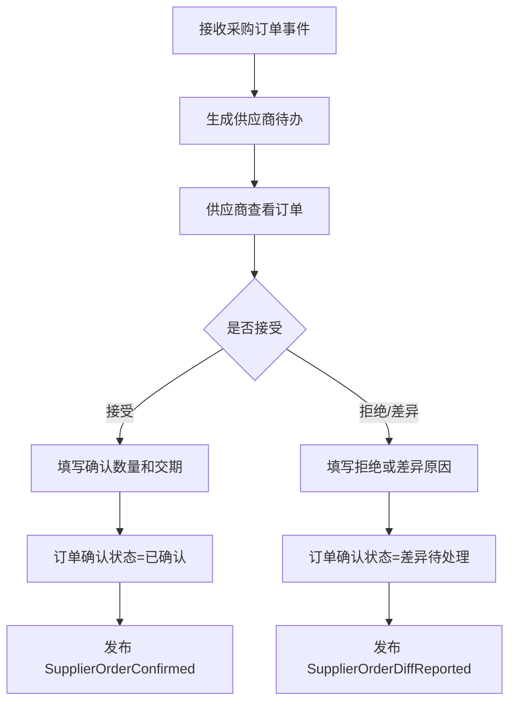
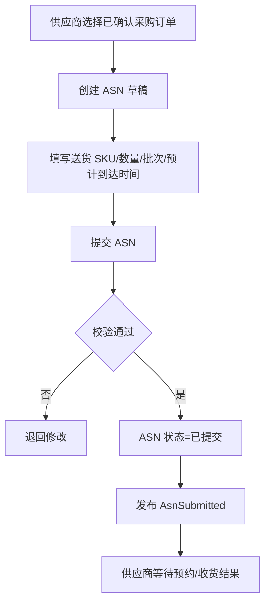
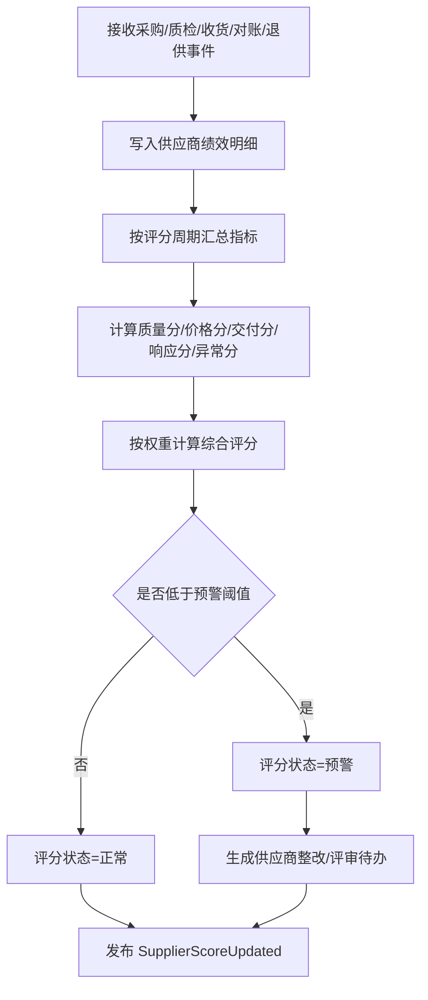
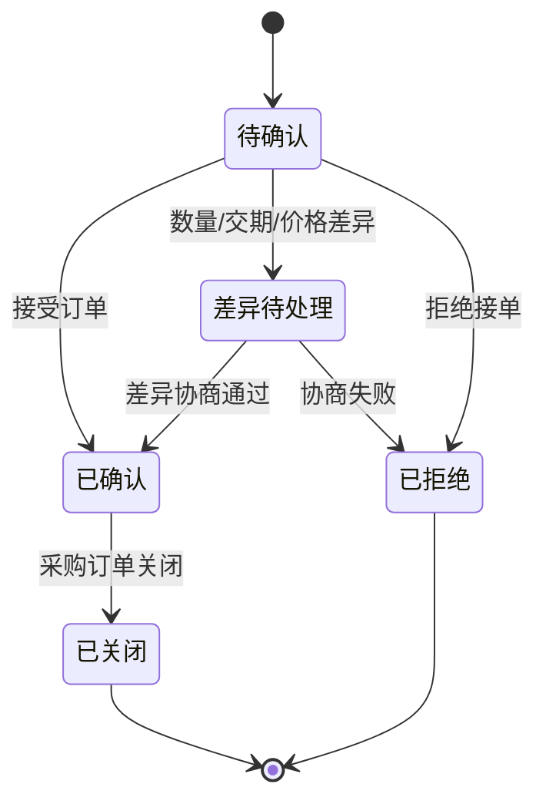
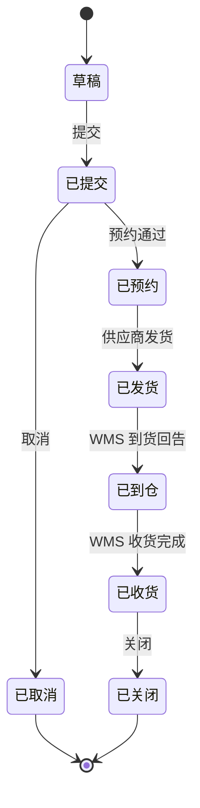
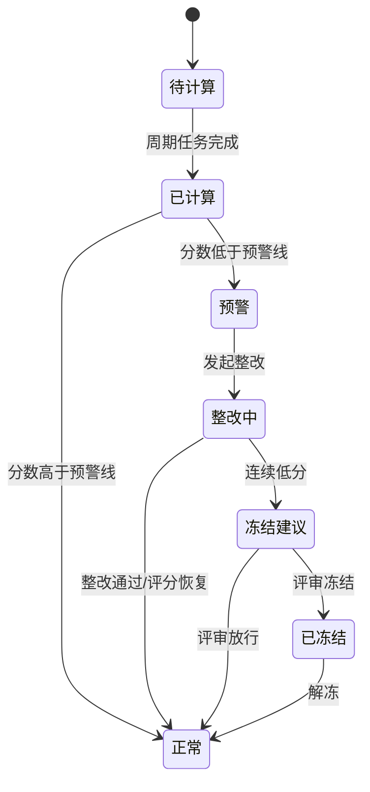

# 30 供应商系统功能设计

> 供应商系统偏供应商协同侧，面向供应商、采购、质量、财务协作。本文只聚焦供应商系统自身功能、角色、数据状态和事件，不展开跨系统流程编排。

## 1. 系统定位

供应商系统用于让供应商参与采购协同：接收采购需求、确认订单、维护供货能力、提交 ASN、处理退供确认、查看对账与绩效。它不负责生成采购策略，也不负责库存记账。

| 边界 | 说明 |
| --- | --- |
| 负责 | 供应商门户、订单确认、ASN、供应商商品协同、退供确认、供应商绩效评分与反馈 |
| 不负责 | 采购审批、库存扣减、WMS 作业、财务入账 |
| 核心数据 | 供应商账号、供应商档案快照、供应商商品、采购订单确认、ASN、退供确认、绩效指标、供应商评分 |

## 2. 使用角色

| 角色 | 使用功能 | 典型动作 |
| --- | --- | --- |
| 供应商业务员 | 订单确认、交期反馈、ASN 创建 | 确认采购订单、拆分送货、上传发货信息 |
| 供应商财务 | 对账、发票、结算信息 | 查看对账单、上传发票、确认差异 |
| 供应商质量 | 质检反馈、资质资料 | 上传资质、查看质量异常 |
| 采购员 | 供应商协同监控、评分查看 | 催确认、处理差异、维护供货关系、参考评分选择供应商 |
| 质量人员 | 供应商质量管理、质量评分确认 | 查看不良、发起整改、确认质量扣分 |
| 采购经理 | 供应商绩效评审 | 查看评分排名、调整评分权重、冻结低分供应商 |
| 系统管理员 | 账号和权限 | 开通供应商账号、绑定供应商主体 |

## 3. 功能地图

| 模块 | 功能 | 说明 |
| --- | --- | --- |
| 供应商门户 | 登录、账号、消息、待办 | 供应商侧统一入口 |
| 订单协同 | 采购订单接收、确认、拒绝、交期反馈 | 采购订单从待确认到已确认 |
| ASN 协同 | 创建 ASN、预约送货、修改/取消 ASN | 支撑采购入库预告 |
| 供应商商品 | 查看可供 SKU、供应商 SKU、MOQ、交期 | 供应商确认供货能力 |
| 退供协同 | 接收退供通知、确认/拒绝、签收反馈 | 支撑退供应商流程 |
| 对账协同 | 查看对账、确认差异、上传发票 | 支撑应付结算 |
| 质量协同 | 质检异常、整改、资质到期提醒 | 供应商绩效和合规 |
| 绩效评分 | 质量、报价、交付、响应、异常、对账评分 | 采购选供应商参考依据 |
| 绩效看板 | 综合评分、准时率、合格率、报价竞争力、响应时效 | 供应商管理 |

## 4. 核心操作流程

### 4.1 采购订单确认流程

### 4.2 ASN 创建流程

### 4.3 供应商评分计算流程

评分结果不直接决定采购订单能否创建，默认作为采购人员选择供应商、询价比价、供应商评审的参考依据。若企业希望强管控，可以配置“低于阈值需审批”或“冻结供应商”的策略。

### 4.4 评分维度与权重建议

| 维度 | 默认权重 | 指标示例 | 数据来源 |
| --- | --- | --- | --- |
| 商品质量 | 35% | 质检合格率、不良率、退货率、质量整改关闭率 | WMS 质检、退供应商、质量协同 |
| 报价竞争力 | 25% | 报价相对均价、历史价格稳定性、降价响应 | 询价报价、采购订单价格、价格主数据 |
| 送货时效 | 25% | 准时交付率、平均延迟天数、ASN 准确率 | ASN、WMS 收货、采购订单交期 |
| 响应协同 | 10% | 订单确认时效、差异反馈时效、对账确认时效 | 订单协同、对账协同 |
| 异常扣分 | 5% | 拒单、超收/短收、供应商拒收退供、发票差异 | 采购、WMS、BMS、退供协同 |

评分口径建议：

| 规则 | 说明 |
| --- | --- |
| 分值范围 | 综合评分建议为 0 到 100 分 |
| 评分周期 | 支持按月、季度、半年滚动计算 |
| 新供应商 | 无历史数据时使用初始基准分，如 70 分或人工评级 |
| 分类评分 | 可按供应商整体评分，也可按供应商 + 品类、供应商 + SKU 评分 |
| 权重配置 | 不同行业可调整权重，例如食品/医药提高质量权重，标品采购提高价格权重 |
| 人工修正 | 支持采购经理按审批流程做一次性修正，必须记录原因和日志 |

### 4.5 采购人员如何使用评分

| 场景 | 评分用法 | 系统建议 |
| --- | --- | --- |
| 询价邀约 | 优先邀请高分供应商 | 展示近 3 期评分趋势和优势/风险标签 |
| 比价定标 | 价格相近时参考综合评分 | 同价优先选择质量和交付更稳定的供应商 |
| 采购下单 | 下单时展示供应商评分 | 低于阈值时提示风险或要求审批 |
| 供应商评审 | 月度/季度复盘供应商表现 | 输出评分排名、扣分原因、整改建议 |
| 供应商淘汰 | 连续低分供应商进入冻结/淘汰候选 | 触发供应商整改或准入复审 |

## 5. 数据状态机

### 5.1 供应商订单确认状态

### 5.2 ASN 状态

### 5.3 供应商评分状态

## 6. 生产事件

| 事件 | 触发动作 | 关键载荷 |
| --- | --- | --- |
| `SupplierOrderConfirmed` | 供应商确认采购订单 | `supplier_id`、`purchase_order_id`、`confirmed_qty`、`delivery_date` |
| `SupplierOrderRejected` | 供应商拒绝订单 | `supplier_id`、`purchase_order_id`、`reason_code` |
| `SupplierOrderDiffReported` | 供应商反馈差异 | `diff_type`、`diff_qty`、`diff_delivery_date`、`remark` |
| `AsnSubmitted` | 提交 ASN | `asn_id`、`purchase_order_id`、`sku_id`、`qty`、`eta` |
| `AsnCancelled` | 取消 ASN | `asn_id`、`cancel_reason` |
| `SupplierReturnConfirmed` | 确认退供 | `supplier_return_id`、`confirmed_qty`、`return_address` |
| `SupplierReturnDiffReported` | 退供差异反馈 | `supplier_return_id`、`diff_reason`、`accepted_qty` |
| `SupplierInvoiceUploaded` | 上传发票 | `reconciliation_id`、`invoice_no`、`amount` |
| `SupplierScoreUpdated` | 供应商评分计算完成 | `supplier_id`、`score_period`、`total_score`、`score_level`、`score_detail` |
| `SupplierScoreWarningCreated` | 评分低于阈值 | `supplier_id`、`score_period`、`warning_reason`、`suggested_action` |
| `SupplierRectificationRequested` | 发起供应商整改 | `supplier_id`、`issue_type`、`deadline`、`source_score_id` |

## 7. 消费事件

| 事件 | 来源 | 消费后数据变化 |
| --- | --- | --- |
| `SupplierEnabled` | 主数据系统 | 创建/更新供应商档案快照，允许账号绑定 |
| `SupplierDisabled` | 主数据系统 | 供应商状态改为停用，禁止新确认和新 ASN |
| `SupplierSkuEnabled` | 主数据系统 | 更新可供 SKU、MOQ、交期、供应商 SKU 编码 |
| `PurchaseOrderReleased` | 采购系统 | 创建供应商订单待办，状态为待确认 |
| `PurchaseOrderCancelled` | 采购系统 | 关闭未确认或未发货的供应商订单协同 |
| `AsnReceived` | WMS | ASN 状态更新为已收货，记录实收数量 |
| `SupplierReturnRequested` | 采购系统 | 创建退供确认待办，状态为待确认；写入异常绩效明细，记录退供原因和退供数量 |
| `ReconciliationCreated` | BMS | 创建供应商对账待办，状态为待确认 |
| `QcCompleted` | WMS | 写入质量绩效明细，更新合格率、不良率、质量扣分 |
| `InboundReceived` | WMS | 写入交付绩效明细，更新到货数量、短收/超收和到货日期 |
| `PurchasePriceConfirmed` | 采购系统 | 写入价格绩效明细，更新报价竞争力和价格稳定性 |
| `PurchaseOrderCompleted` | 采购系统 | 写入订单履约绩效明细，更新交付完成率 |
| `ReconciliationConfirmed` | BMS | 写入协同绩效明细，更新对账确认时效和差异率 |

## 8. 事件处理规则

| 规则 | 说明 |
| --- | --- |
| 幂等键 | 使用 `event_id` 或来源单据号 + 版本号防止重复创建待办 |
| 快照 | 供应商系统保存采购订单、SKU、供应商资料快照，便于供应商查看历史 |
| 权限 | 供应商账号只能查看绑定供应商的数据 |
| 差异 | 差异反馈不直接修改采购订单，只改变供应商协同状态并发布事件 |
| 评分周期 | 评分按周期任务计算，也支持采购经理手工触发重算 |
| 评分明细 | 评分必须保留明细来源，能追溯到质检、收货、报价、退供、对账等业务事实 |
| 评分快照 | 采购订单保存下单时供应商评分快照，便于复盘当时选择依据 |
| 评分不替代决策 | 默认只作为采购参考；是否拦截下单由采购策略或审批规则决定 |

## 9. 评分数据模型建议

| 表 | 作用 | 关键字段 |
| --- | --- | --- |
| `supplier_score` | 供应商周期综合评分 | `supplier_id`、`score_period`、`total_score`、`score_level`、`status` |
| `supplier_score_detail` | 各维度评分明细 | `supplier_id`、`dimension`、`score`、`weight`、`weighted_score` |
| `supplier_performance_fact` | 评分原始事实 | `supplier_id`、`fact_type`、`source_order_id`、`metric_value`、`occurred_at` |
| `supplier_score_rule` | 评分规则和权重 | `dimension`、`weight`、`formula_type`、`effective_from`、`effective_to` |
| `supplier_rectification` | 供应商整改记录 | `supplier_id`、`issue_type`、`deadline`、`rectification_status` |

评分等级建议：

| 等级 | 分数范围 | 建议动作 |
| --- | --- | --- |
| A | 90-100 | 优先邀约、优先推荐 |
| B | 80-89 | 正常合作 |
| C | 70-79 | 可合作但提示风险 |
| D | 60-69 | 下单需关注，必要时审批 |
| E | 0-59 | 进入整改或冻结评审 |

## DDD 对齐说明

本文属于 **供应商上下文**。设计时应把页面、字段和流程统一回到该上下文的模型边界，避免跨上下文直接修改数据。

| DDD 项 | 对齐口径 |
| --- | --- |
| 限界上下文 | 供应商上下文 |
| 核心聚合 | SupplierProfile、SupplierScore、ASN、SupplierQuote |
| 数据主权 | 供应商准入、协同、评分和供货事实 |
| 生产事件 | 只发布本上下文已经发生的业务事实 |
| 消费事件 | 消费外部事实时必须记录 event_id、幂等键、处理状态和失败原因 |
| 查询模型 | 列表、看板、导出可使用读模型，不强行加载聚合 |

## 10. 继续上下文

当前结论：供应商系统是协同系统，核心是供应商对采购订单、ASN、退供和对账做确认与反馈；供应商评分用于把质量、报价、交付、响应和异常表现量化，作为采购人员选择供应商的参考依据。

关键假设：供应商系统不直接改采购订单主状态、不直接改库存、不直接生成财务凭证，只生产协同结果事件和评分结果事件；评分默认不直接阻断采购下单，是否强控由采购策略或审批规则决定。

下一步：可继续细化供应商系统页面、接口和权限矩阵。
