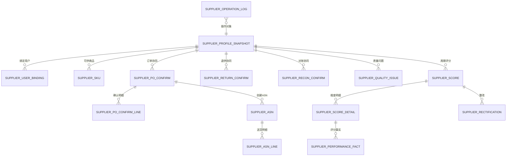
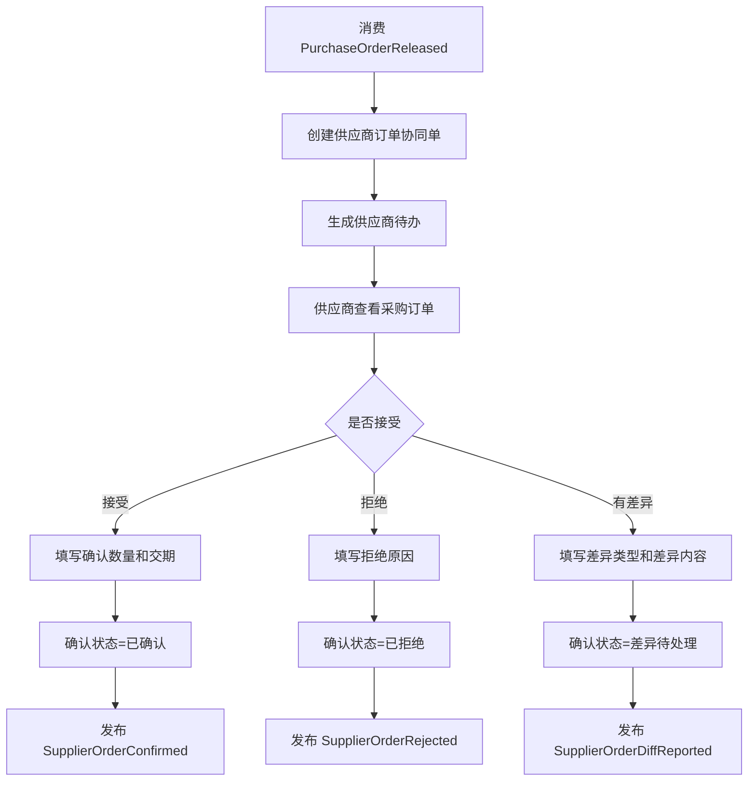
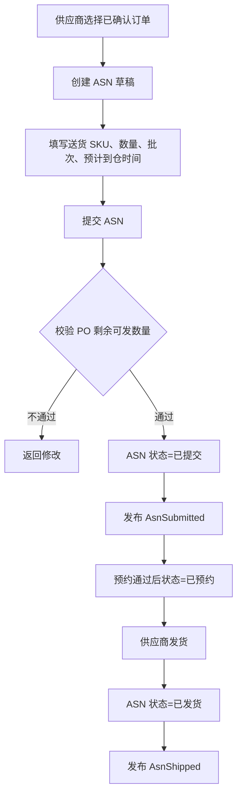
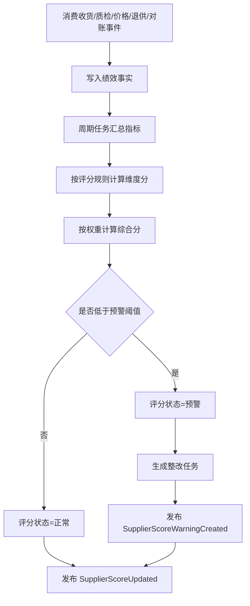
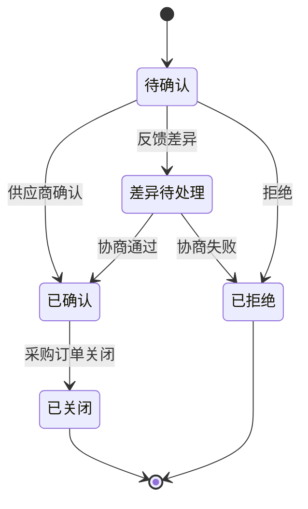
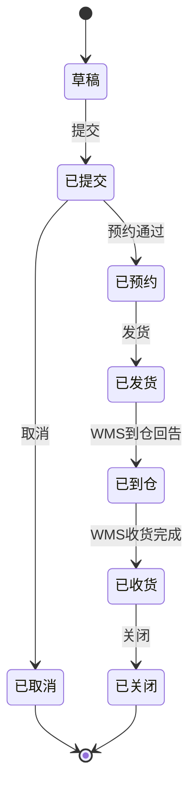
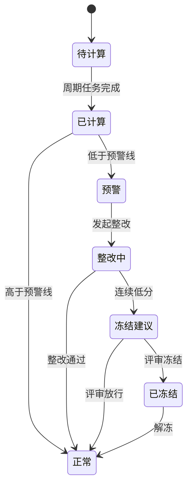

# 40 供应商系统详细设计

> 本文承接 [供应商系统功能设计](./30-供应商系统功能设计.md)，按 [权限系统详细设计](../权限系统/38-权限系统详细设计.md) 的模式细化供应商门户、订单协同、ASN、退供、对账、质量协同、供应商评分、权限点、枚举、事件和操作日志。当前版本是系统设计级字段模型，不是最终数据库 DDL。

## 1. 设计目标

供应商系统要统一回答五个问题：

| 问题 | 设计对象 |
| --- | --- |
| 哪个供应商可以协同 | 供应商档案快照、供应商账号绑定、供应商状态 |
| 供应商要处理哪些事 | 待办、采购订单确认、ASN、退供确认、对账确认、质量整改 |
| 供应商反馈了什么 | 订单确认结果、差异原因、送货计划、退供签收、对账差异 |
| 供应商表现如何 | 质量、价格、交付、响应、异常、综合评分 |
| 供应商操作是否可追溯 | 操作日志、事件日志、评分明细、附件和版本 |

核心原则：

| 原则 | 说明 |
| --- | --- |
| 供应商系统只做协同 | 不直接修改采购订单主状态、库存余额和财务凭证 |
| 供应商只能看自己的数据 | 供应商用户必须绑定 `supplier_id`，所有查询按供应商隔离 |
| 差异用事件反馈 | 数量、交期、价格、退供、对账差异不直接改上游单据，只发布协同结果 |
| 评分可追溯 | 每个评分结果必须能追溯到收货、质检、价格、退供、对账等事实 |
| 关键动作留痕 | 确认、拒绝、取消、差异反馈、评分修正、冻结建议必须记录操作日志 |

## 2. 总体模型

## 3. 功能页面

| 页面 | 主要用途 | 展示字段 | 主要操作 |
| --- | --- | --- | --- |
| 供应商工作台 | 展示待办、预警、订单、ASN、退供、对账 | 待确认订单数、待发货 ASN、待处理退供、待确认对账、质量问题 | 查看待办、进入处理 |
| 供应商档案页 | 查看主数据同步来的供应商资料快照 | 供应商编码、名称、等级、状态、联系人、结算方式 | 查看、申请资料变更 |
| 供应商账号绑定页 | 管理供应商用户与供应商主体关系 | 用户、手机号、邮箱、绑定供应商、状态 | 绑定、解绑、启用、停用 |
| 供应商商品页 | 查看可供 SKU、MOQ、交期、供应商 SKU | SKU、供应商 SKU、MOQ、供货周期、报价状态 | 查看、维护供应商 SKU、申请变更 |
| 采购订单协同页 | 供应商确认采购订单或反馈差异 | PO 单号、SKU、采购数量、确认数量、交期、状态 | 确认、拒绝、反馈差异 |
| ASN 管理页 | 供应商创建送货预告和预约 | ASN 单号、PO 单号、预计到仓、发货数量、状态 | 新增、编辑、提交、取消、打印 |
| 退供协同页 | 供应商确认退供、收货或反馈差异 | 退供单号、SKU、退供数量、原因、状态 | 确认、拒绝、签收、反馈差异 |
| 对账协同页 | 供应商查看对账并上传发票 | 对账单号、金额、税额、差异金额、状态 | 确认、反馈差异、上传发票 |
| 质量协同页 | 查看质检异常和整改任务 | 问题单号、SKU、问题类型、责任判定、整改状态 | 查看、提交整改、上传附件 |
| 供应商评分页 | 查看综合评分、维度评分和趋势 | 周期、综合分、等级、质量分、价格分、交付分 | 查看明细、导出、发起重算 |
| 评分规则页 | 配置评分维度、权重、阈值 | 维度、权重、公式、预警阈值、生效时间 | 新增、编辑、启停、发布 |
| 整改管理页 | 管理低分或质量异常触发的整改 | 供应商、问题类型、截止时间、状态、处理人 | 发起、提交、审核、关闭 |
| 操作日志页 | 查询供应商协同关键操作 | 操作人、供应商、对象、动作、时间、结果 | 查询、导出 |
| 枚举配置页 | 维护供应商系统枚举 | 枚举类型、枚举值、标签、状态 | 新增、编辑、排序、停用 |

## 4. 核心流程

### 4.1 采购订单确认流程

### 4.2 ASN 创建与发货流程

### 4.3 供应商评分计算流程

## 5. 字段模型

### 5.1 供应商档案快照 `supplier_profile_snapshot`

保存主数据系统同步来的供应商资料，用于供应商系统内查询和历史追溯。

| 字段 | 类型 | 是否必填 | 枚举/约束 | 说明 |
| --- | --- | --- | --- | --- |
| `snapshot_id` | bigint | 是 | 主键 | 快照 ID |
| `supplier_id` | bigint | 是 | 唯一当前版本 | 供应商 ID |
| `supplier_code` | varchar(64) | 是 | 唯一 | 供应商编码 |
| `supplier_name` | varchar(256) | 是 |  | 供应商名称 |
| `supplier_type` | varchar(32) | 是 | `SUPPLIER_TYPE` | 生产商、贸易商、服务商等 |
| `supplier_level` | varchar(32) | 否 | `SUPPLIER_LEVEL` | A/B/C/D/E |
| `contact_name` | varchar(128) | 否 |  | 默认联系人 |
| `contact_mobile` | varchar(32) | 否 |  | 默认联系电话 |
| `settlement_method` | varchar(32) | 否 | `SETTLEMENT_METHOD` | 月结、票到付款等 |
| `cooperation_status` | varchar(32) | 是 | `SUPPLIER_COOP_STATUS` | 准入、合作中、暂停、冻结、淘汰 |
| `source_version` | varchar(64) | 是 |  | 主数据版本 |
| `synced_at` | datetime | 是 |  | 同步时间 |
| `created_at` | datetime | 是 |  | 创建时间 |
| `updated_at` | datetime | 否 |  | 更新时间 |

对应页面：`供应商档案页`

展示字段：供应商编码、供应商名称、类型、等级、联系人、结算方式、合作状态、同步时间。

### 5.2 供应商用户绑定 `supplier_user_binding`

用于控制供应商用户能访问哪个供应商主体的数据。

| 字段 | 类型 | 是否必填 | 枚举/约束 | 说明 |
| --- | --- | --- | --- | --- |
| `binding_id` | bigint | 是 | 主键 | 绑定 ID |
| `user_id` | bigint | 是 | 外键 | 权限系统用户 ID |
| `supplier_id` | bigint | 是 | 外键 | 供应商 ID |
| `binding_role` | varchar(32) | 是 | `SUPPLIER_USER_ROLE` | 业务、财务、质量、管理员 |
| `is_primary` | boolean | 是 | true/false | 是否主账号 |
| `status` | varchar(32) | 是 | `COMMON_STATUS` | 启用、停用 |
| `bound_by` | bigint | 是 |  | 绑定人 |
| `bound_at` | datetime | 是 |  | 绑定时间 |
| `unbound_at` | datetime | 否 |  | 解绑时间 |

对应页面：`供应商账号绑定页`

展示字段：用户、供应商、绑定角色、是否主账号、状态、绑定时间。

### 5.3 供应商商品 `supplier_sku`

表示供应商可供的 SKU、供应商侧编码和供货约束。

| 字段 | 类型 | 是否必填 | 枚举/约束 | 说明 |
| --- | --- | --- | --- | --- |
| `supplier_sku_id` | bigint | 是 | 主键 | 供应商商品 ID |
| `supplier_id` | bigint | 是 | 外键 | 供应商 ID |
| `sku_id` | bigint | 是 | 外键 | SKU ID |
| `sku_code` | varchar(64) | 是 |  | 内部 SKU 编码 |
| `supplier_sku_code` | varchar(128) | 否 |  | 供应商商品编码 |
| `moq` | decimal(18,4) | 否 | >= 0 | 最小起订量 |
| `mpq` | decimal(18,4) | 否 | >= 0 | 最小包装量 |
| `lead_time_days` | int | 否 | >= 0 | 供货周期 |
| `supply_status` | varchar(32) | 是 | `SUPPLY_STATUS` | 可供、暂停、停供 |
| `effective_from` | date | 否 |  | 生效日期 |
| `effective_to` | date | 否 |  | 失效日期 |
| `updated_at` | datetime | 否 |  | 更新时间 |

对应页面：`供应商商品页`

展示字段：SKU、供应商 SKU、MOQ、MPQ、供货周期、供货状态、生效日期。

### 5.4 采购订单协同单 `supplier_po_confirm`

记录供应商对采购订单的确认结果。

| 字段 | 类型 | 是否必填 | 枚举/约束 | 说明 |
| --- | --- | --- | --- | --- |
| `confirm_id` | bigint | 是 | 主键 | 协同单 ID |
| `confirm_no` | varchar(64) | 是 | 唯一 | 协同单号 |
| `supplier_id` | bigint | 是 | 外键 | 供应商 ID |
| `purchase_order_id` | bigint | 是 | 外键 | 采购订单 ID |
| `purchase_order_no` | varchar(64) | 是 |  | 采购订单号 |
| `buyer_id` | bigint | 否 |  | 采购员 |
| `confirm_status` | varchar(32) | 是 | `PO_CONFIRM_STATUS` | 待确认、已确认、差异待处理、已拒绝、已关闭 |
| `confirm_deadline` | datetime | 否 |  | 确认截止时间 |
| `confirmed_at` | datetime | 否 |  | 确认时间 |
| `diff_type` | varchar(32) | 否 | `PO_DIFF_TYPE` | 数量、交期、价格、其他 |
| `reason_code` | varchar(64) | 否 | `SUPPLIER_REASON_CODE` | 拒绝或差异原因 |
| `remark` | varchar(512) | 否 |  | 备注 |
| `source_event_id` | varchar(128) | 是 | 幂等 | 来源事件 ID |
| `created_at` | datetime | 是 |  | 创建时间 |
| `updated_at` | datetime | 否 |  | 更新时间 |

对应页面：`采购订单协同页`

展示字段：协同单号、采购订单号、供应商、采购员、确认状态、确认截止时间、确认时间、差异类型。

### 5.5 采购订单协同行 `supplier_po_confirm_line`

| 字段 | 类型 | 是否必填 | 枚举/约束 | 说明 |
| --- | --- | --- | --- | --- |
| `confirm_line_id` | bigint | 是 | 主键 | 协同行 ID |
| `confirm_id` | bigint | 是 | 外键 | 协同单 ID |
| `purchase_order_line_id` | bigint | 是 | 外键 | 采购订单行 ID |
| `sku_id` | bigint | 是 | 外键 | SKU ID |
| `sku_code` | varchar(64) | 是 |  | SKU 编码 |
| `order_qty` | decimal(18,4) | 是 | >= 0 | 采购数量 |
| `confirmed_qty` | decimal(18,4) | 否 | >= 0 | 确认数量 |
| `requested_delivery_date` | date | 否 |  | 要求交期 |
| `confirmed_delivery_date` | date | 否 |  | 确认交期 |
| `line_status` | varchar(32) | 是 | `PO_CONFIRM_LINE_STATUS` | 待确认、已确认、有差异、已拒绝 |
| `diff_reason` | varchar(512) | 否 |  | 行差异说明 |

### 5.6 ASN 主表 `supplier_asn`

| 字段 | 类型 | 是否必填 | 枚举/约束 | 说明 |
| --- | --- | --- | --- | --- |
| `asn_id` | bigint | 是 | 主键 | ASN ID |
| `asn_no` | varchar(64) | 是 | 唯一 | ASN 单号 |
| `supplier_id` | bigint | 是 | 外键 | 供应商 ID |
| `purchase_order_id` | bigint | 是 | 外键 | 采购订单 ID |
| `warehouse_id` | bigint | 否 | 外键 | 目的仓 |
| `eta` | datetime | 是 |  | 预计到仓时间 |
| `ship_at` | datetime | 否 |  | 发货时间 |
| `carrier_name` | varchar(128) | 否 |  | 承运商 |
| `tracking_no` | varchar(128) | 否 |  | 运单号 |
| `asn_status` | varchar(32) | 是 | `ASN_STATUS` | 草稿、已提交、已预约、已发货、已到仓、已收货、已取消、已关闭 |
| `cancel_reason` | varchar(512) | 否 |  | 取消原因 |
| `created_by` | bigint | 是 |  | 创建人 |
| `created_at` | datetime | 是 |  | 创建时间 |
| `updated_at` | datetime | 否 |  | 更新时间 |

对应页面：`ASN 管理页`

展示字段：ASN 单号、采购订单号、目的仓、预计到仓、发货时间、承运商、运单号、状态。

### 5.7 ASN 行 `supplier_asn_line`

| 字段 | 类型 | 是否必填 | 枚举/约束 | 说明 |
| --- | --- | --- | --- | --- |
| `asn_line_id` | bigint | 是 | 主键 | ASN 行 ID |
| `asn_id` | bigint | 是 | 外键 | ASN ID |
| `purchase_order_line_id` | bigint | 是 | 外键 | 采购订单行 ID |
| `sku_id` | bigint | 是 | 外键 | SKU ID |
| `sku_code` | varchar(64) | 是 |  | SKU 编码 |
| `planned_qty` | decimal(18,4) | 是 | > 0 | 计划发货数量 |
| `received_qty` | decimal(18,4) | 否 | >= 0 | WMS 回告实收数量 |
| `batch_no` | varchar(128) | 否 |  | 批次号 |
| `production_date` | date | 否 |  | 生产日期 |
| `expire_date` | date | 否 |  | 失效日期 |

### 5.8 退供协同单 `supplier_return_confirm`

| 字段 | 类型 | 是否必填 | 枚举/约束 | 说明 |
| --- | --- | --- | --- | --- |
| `return_confirm_id` | bigint | 是 | 主键 | 退供协同 ID |
| `return_confirm_no` | varchar(64) | 是 | 唯一 | 退供协同单号 |
| `supplier_return_id` | bigint | 是 | 外键 | 退供应商单 ID |
| `supplier_id` | bigint | 是 | 外键 | 供应商 ID |
| `return_status` | varchar(32) | 是 | `SUPPLIER_RETURN_CONFIRM_STATUS` | 待确认、已确认、已拒绝、已签收、差异待处理、已关闭 |
| `return_address` | varchar(512) | 否 |  | 退货地址 |
| `confirmed_qty` | decimal(18,4) | 否 | >= 0 | 确认接收数量 |
| `signed_qty` | decimal(18,4) | 否 | >= 0 | 签收数量 |
| `diff_reason` | varchar(512) | 否 |  | 差异原因 |
| `confirmed_at` | datetime | 否 |  | 确认时间 |
| `signed_at` | datetime | 否 |  | 签收时间 |
| `source_event_id` | varchar(128) | 是 | 幂等 | 来源事件 ID |

对应页面：`退供协同页`

展示字段：退供协同单号、退供应商单号、供应商、确认数量、签收数量、状态、差异原因。

### 5.9 对账协同单 `supplier_recon_confirm`

| 字段 | 类型 | 是否必填 | 枚举/约束 | 说明 |
| --- | --- | --- | --- | --- |
| `recon_confirm_id` | bigint | 是 | 主键 | 对账协同 ID |
| `reconciliation_id` | bigint | 是 | 外键 | 对账单 ID |
| `reconciliation_no` | varchar(64) | 是 |  | 对账单号 |
| `supplier_id` | bigint | 是 | 外键 | 供应商 ID |
| `bill_amount` | decimal(18,2) | 是 |  | 应付金额 |
| `tax_amount` | decimal(18,2) | 否 |  | 税额 |
| `diff_amount` | decimal(18,2) | 否 |  | 差异金额 |
| `confirm_status` | varchar(32) | 是 | `RECON_CONFIRM_STATUS` | 待确认、已确认、差异待处理、已开票、已关闭 |
| `invoice_no` | varchar(128) | 否 |  | 发票号 |
| `invoice_file_url` | varchar(512) | 否 |  | 发票附件 |
| `confirmed_at` | datetime | 否 |  | 确认时间 |

对应页面：`对账协同页`

展示字段：对账单号、供应商、金额、税额、差异金额、状态、发票号、确认时间。

### 5.10 质量问题 `supplier_quality_issue`

| 字段 | 类型 | 是否必填 | 枚举/约束 | 说明 |
| --- | --- | --- | --- | --- |
| `issue_id` | bigint | 是 | 主键 | 质量问题 ID |
| `issue_no` | varchar(64) | 是 | 唯一 | 问题单号 |
| `supplier_id` | bigint | 是 | 外键 | 供应商 ID |
| `sku_id` | bigint | 否 | 外键 | SKU ID |
| `source_doc_type` | varchar(32) | 是 | `QUALITY_SOURCE_DOC_TYPE` | 质检单、退供单、客诉、抽检 |
| `source_doc_no` | varchar(64) | 是 |  | 来源单号 |
| `issue_type` | varchar(32) | 是 | `QUALITY_ISSUE_TYPE` | 外观、规格、包装、性能、证照 |
| `severity` | varchar(32) | 是 | `ISSUE_SEVERITY` | 轻微、一般、严重、致命 |
| `issue_status` | varchar(32) | 是 | `QUALITY_ISSUE_STATUS` | 待处理、整改中、待审核、已关闭 |
| `deadline` | datetime | 否 |  | 整改截止时间 |
| `closed_at` | datetime | 否 |  | 关闭时间 |

对应页面：`质量协同页`

展示字段：问题单号、供应商、SKU、来源单号、问题类型、严重程度、状态、截止时间。

### 5.11 供应商评分 `supplier_score`

| 字段 | 类型 | 是否必填 | 枚举/约束 | 说明 |
| --- | --- | --- | --- | --- |
| `score_id` | bigint | 是 | 主键 | 评分 ID |
| `supplier_id` | bigint | 是 | 外键 | 供应商 ID |
| `score_period` | varchar(32) | 是 | 唯一组合 | 评分周期，如 `2026-06` |
| `period_type` | varchar(32) | 是 | `SCORE_PERIOD_TYPE` | 月度、季度、半年、年度 |
| `total_score` | decimal(5,2) | 是 | 0 到 100 | 综合评分 |
| `score_level` | varchar(32) | 是 | `SUPPLIER_SCORE_LEVEL` | A/B/C/D/E |
| `score_status` | varchar(32) | 是 | `SUPPLIER_SCORE_STATUS` | 待计算、已计算、正常、预警、整改中、冻结建议、已冻结 |
| `warning_reason` | varchar(512) | 否 |  | 预警原因 |
| `calculated_at` | datetime | 是 |  | 计算时间 |
| `manual_adjusted` | boolean | 是 | true/false | 是否人工修正 |
| `adjust_reason` | varchar(512) | 否 |  | 修正原因 |

对应页面：`供应商评分页`

展示字段：供应商、评分周期、综合分、等级、状态、预警原因、计算时间、是否修正。

### 5.12 评分明细 `supplier_score_detail`

| 字段 | 类型 | 是否必填 | 枚举/约束 | 说明 |
| --- | --- | --- | --- | --- |
| `score_detail_id` | bigint | 是 | 主键 | 明细 ID |
| `score_id` | bigint | 是 | 外键 | 评分 ID |
| `dimension` | varchar(32) | 是 | `SCORE_DIMENSION` | 质量、价格、交付、响应、异常 |
| `raw_score` | decimal(5,2) | 是 | 0 到 100 | 原始分 |
| `weight` | decimal(5,2) | 是 | 0 到 100 | 权重 |
| `weighted_score` | decimal(5,2) | 是 |  | 加权分 |
| `metric_summary` | text | 否 | JSON | 指标摘要 |

### 5.13 绩效事实 `supplier_performance_fact`

| 字段 | 类型 | 是否必填 | 枚举/约束 | 说明 |
| --- | --- | --- | --- | --- |
| `fact_id` | bigint | 是 | 主键 | 事实 ID |
| `supplier_id` | bigint | 是 | 外键 | 供应商 ID |
| `fact_type` | varchar(32) | 是 | `PERFORMANCE_FACT_TYPE` | 质检、收货、报价、退供、对账、订单 |
| `source_system` | varchar(32) | 是 | `SOURCE_SYSTEM` | 采购、WMS、BMS、供应商系统 |
| `source_doc_type` | varchar(32) | 是 |  | 来源单据类型 |
| `source_doc_no` | varchar(64) | 是 |  | 来源单号 |
| `metric_code` | varchar(64) | 是 |  | 指标编码 |
| `metric_value` | decimal(18,4) | 是 |  | 指标值 |
| `occurred_at` | datetime | 是 |  | 事实发生时间 |
| `event_id` | varchar(128) | 是 | 幂等 | 来源事件 ID |

### 5.14 评分规则 `supplier_score_rule`

| 字段 | 类型 | 是否必填 | 枚举/约束 | 说明 |
| --- | --- | --- | --- | --- |
| `rule_id` | bigint | 是 | 主键 | 规则 ID |
| `rule_code` | varchar(64) | 是 | 唯一 | 规则编码 |
| `dimension` | varchar(32) | 是 | `SCORE_DIMENSION` | 评分维度 |
| `weight` | decimal(5,2) | 是 | 0 到 100 | 维度权重 |
| `formula_type` | varchar(32) | 是 | `SCORE_FORMULA_TYPE` | 阈值、比例、扣分、人工 |
| `formula_config` | text | 是 | JSON | 公式配置 |
| `warning_threshold` | decimal(5,2) | 否 | 0 到 100 | 预警阈值 |
| `effective_from` | date | 是 |  | 生效日期 |
| `effective_to` | date | 否 |  | 失效日期 |
| `status` | varchar(32) | 是 | `COMMON_STATUS` | 启用、停用 |

对应页面：`评分规则页`

展示字段：规则编码、维度、权重、公式类型、预警阈值、生效日期、状态。

### 5.15 整改记录 `supplier_rectification`

| 字段 | 类型 | 是否必填 | 枚举/约束 | 说明 |
| --- | --- | --- | --- | --- |
| `rectification_id` | bigint | 是 | 主键 | 整改 ID |
| `rectification_no` | varchar(64) | 是 | 唯一 | 整改单号 |
| `supplier_id` | bigint | 是 | 外键 | 供应商 ID |
| `source_type` | varchar(32) | 是 | `RECTIFICATION_SOURCE_TYPE` | 评分预警、质量问题、人工发起 |
| `source_id` | bigint | 否 |  | 来源 ID |
| `issue_desc` | varchar(1024) | 是 |  | 问题描述 |
| `deadline` | datetime | 是 |  | 整改截止时间 |
| `rectification_status` | varchar(32) | 是 | `RECTIFICATION_STATUS` | 待提交、已提交、审核通过、驳回、已关闭 |
| `submitted_at` | datetime | 否 |  | 提交时间 |
| `reviewed_by` | bigint | 否 |  | 审核人 |
| `reviewed_at` | datetime | 否 |  | 审核时间 |

对应页面：`整改管理页`

展示字段：整改单号、供应商、来源、问题描述、截止时间、状态、提交时间、审核人。

### 5.16 操作日志 `supplier_operation_log`

| 字段 | 类型 | 是否必填 | 枚举/约束 | 说明 |
| --- | --- | --- | --- | --- |
| `log_id` | bigint | 是 | 主键 | 日志 ID |
| `operator_id` | bigint | 是 |  | 操作人 |
| `operator_type` | varchar(32) | 是 | `OPERATOR_TYPE` | 内部用户、供应商用户、系统 |
| `supplier_id` | bigint | 否 | 外键 | 关联供应商 |
| `object_type` | varchar(64) | 是 | `SUPPLIER_OBJECT_TYPE` | 操作对象类型 |
| `object_id` | bigint | 是 |  | 操作对象 ID |
| `action_type` | varchar(64) | 是 | `SUPPLIER_ACTION_TYPE` | 操作类型 |
| `before_snapshot` | text | 否 | JSON | 变更前摘要 |
| `after_snapshot` | text | 否 | JSON | 变更后摘要 |
| `result` | varchar(32) | 是 | `OPERATION_RESULT` | 成功、失败 |
| `fail_reason` | varchar(512) | 否 |  | 失败原因 |
| `ip_address` | varchar(64) | 否 |  | IP |
| `created_at` | datetime | 是 |  | 操作时间 |

对应页面：`操作日志页`

展示字段：操作人、供应商、对象类型、对象 ID、动作、结果、失败原因、操作时间。

## 6. 枚举定义

| 枚举类型 | 枚举值 | 说明 |
| --- | --- | --- |
| `SUPPLIER_TYPE` | `MANUFACTURER`、`TRADER`、`SERVICE_PROVIDER`、`LOGISTICS_PROVIDER` | 供应商类型 |
| `SUPPLIER_LEVEL` | `A`、`B`、`C`、`D`、`E` | 供应商等级 |
| `SUPPLIER_COOP_STATUS` | `ADMITTED`、`ACTIVE`、`SUSPENDED`、`FROZEN`、`ELIMINATED` | 合作状态 |
| `SUPPLIER_USER_ROLE` | `BUSINESS`、`FINANCE`、`QUALITY`、`ADMIN` | 供应商用户角色 |
| `SUPPLY_STATUS` | `AVAILABLE`、`SUSPENDED`、`DISCONTINUED` | 供货状态 |
| `PO_CONFIRM_STATUS` | `PENDING`、`CONFIRMED`、`DIFF_PENDING`、`REJECTED`、`CLOSED` | 采购订单协同状态 |
| `PO_CONFIRM_LINE_STATUS` | `PENDING`、`CONFIRMED`、`DIFF`、`REJECTED` | 采购订单协同行状态 |
| `PO_DIFF_TYPE` | `QTY`、`DELIVERY_DATE`、`PRICE`、`OTHER` | 采购订单差异类型 |
| `ASN_STATUS` | `DRAFT`、`SUBMITTED`、`APPOINTED`、`SHIPPED`、`ARRIVED`、`RECEIVED`、`CANCELLED`、`CLOSED` | ASN 状态 |
| `SUPPLIER_RETURN_CONFIRM_STATUS` | `PENDING`、`CONFIRMED`、`REJECTED`、`SIGNED`、`DIFF_PENDING`、`CLOSED` | 退供协同状态 |
| `RECON_CONFIRM_STATUS` | `PENDING`、`CONFIRMED`、`DIFF_PENDING`、`INVOICED`、`CLOSED` | 对账确认状态 |
| `QUALITY_ISSUE_TYPE` | `APPEARANCE`、`SPEC`、`PACKAGE`、`PERFORMANCE`、`CERTIFICATE` | 质量问题类型 |
| `ISSUE_SEVERITY` | `MINOR`、`NORMAL`、`MAJOR`、`CRITICAL` | 问题严重程度 |
| `QUALITY_ISSUE_STATUS` | `PENDING`、`RECTIFYING`、`REVIEWING`、`CLOSED` | 质量问题状态 |
| `SCORE_PERIOD_TYPE` | `MONTH`、`QUARTER`、`HALF_YEAR`、`YEAR` | 评分周期类型 |
| `SCORE_DIMENSION` | `QUALITY`、`PRICE`、`DELIVERY`、`RESPONSE`、`EXCEPTION` | 评分维度 |
| `SUPPLIER_SCORE_LEVEL` | `A`、`B`、`C`、`D`、`E` | 评分等级 |
| `SUPPLIER_SCORE_STATUS` | `PENDING`、`CALCULATED`、`NORMAL`、`WARNING`、`RECTIFYING`、`FREEZE_SUGGESTED`、`FROZEN` | 评分状态 |
| `SCORE_FORMULA_TYPE` | `THRESHOLD`、`RATIO`、`DEDUCTION`、`MANUAL` | 评分公式类型 |
| `PERFORMANCE_FACT_TYPE` | `QC`、`RECEIVING`、`PRICE`、`RETURN`、`RECON`、`ORDER` | 绩效事实类型 |
| `RECTIFICATION_SOURCE_TYPE` | `SCORE_WARNING`、`QUALITY_ISSUE`、`MANUAL` | 整改来源 |
| `RECTIFICATION_STATUS` | `PENDING_SUBMIT`、`SUBMITTED`、`APPROVED`、`REJECTED`、`CLOSED` | 整改状态 |
| `COMMON_STATUS` | `ENABLED`、`DISABLED` | 通用状态 |

枚举配置建议：以上枚举都应接入主数据系统或权限系统的枚举配置页面，前端页面只读取枚举项，不在代码中写死中文标签。

## 7. 权限点设计

| 页面 | 路由建议 | 查询权限 | 操作权限 |
| --- | --- | --- | --- |
| 供应商工作台 | `/supplier/workbench` | `supplier:workbench:read` |  |
| 供应商档案页 | `/supplier/profile` | `supplier:profile:read` | `supplier:profile:change_request` |
| 供应商账号绑定页 | `/supplier/user-bindings` | `supplier:user_binding:read` | `supplier:user_binding:bind`、`supplier:user_binding:unbind`、`supplier:user_binding:change_status` |
| 供应商商品页 | `/supplier/skus` | `supplier:sku:read` | `supplier:sku:update_supplier_code`、`supplier:sku:change_request` |
| 采购订单协同页 | `/supplier/po-confirms` | `supplier:po_confirm:read` | `supplier:po_confirm:confirm`、`supplier:po_confirm:reject`、`supplier:po_confirm:report_diff` |
| ASN 管理页 | `/supplier/asns` | `supplier:asn:read` | `supplier:asn:create`、`supplier:asn:update`、`supplier:asn:submit`、`supplier:asn:cancel`、`supplier:asn:print` |
| 退供协同页 | `/supplier/returns` | `supplier:return:read` | `supplier:return:confirm`、`supplier:return:reject`、`supplier:return:sign`、`supplier:return:report_diff` |
| 对账协同页 | `/supplier/reconciliations` | `supplier:recon:read` | `supplier:recon:confirm`、`supplier:recon:report_diff`、`supplier:recon:upload_invoice` |
| 质量协同页 | `/supplier/quality-issues` | `supplier:quality:read` | `supplier:quality:submit_rectification`、`supplier:quality:upload_attachment` |
| 供应商评分页 | `/supplier/scores` | `supplier:score:read` | `supplier:score:recalculate`、`supplier:score:adjust`、`supplier:score:export` |
| 评分规则页 | `/supplier/score-rules` | `supplier:score_rule:read` | `supplier:score_rule:create`、`supplier:score_rule:update`、`supplier:score_rule:disable`、`supplier:score_rule:publish` |
| 整改管理页 | `/supplier/rectifications` | `supplier:rectification:read` | `supplier:rectification:create`、`supplier:rectification:submit`、`supplier:rectification:review`、`supplier:rectification:close` |
| 操作日志页 | `/supplier/operation-logs` | `supplier:operation_log:read` | `supplier:operation_log:export` |
| 枚举配置页 | `/supplier/enums` | `supplier:enum:read` | `supplier:enum:create`、`supplier:enum:update`、`supplier:enum:disable` |

权限使用建议：

| 用户类型 | 数据范围 |
| --- | --- |
| 供应商用户 | 只能访问绑定 `supplier_id` 的数据 |
| 采购员 | 可访问自己负责的供应商和采购订单协同数据 |
| 采购经理 | 可访问采购组织下全部供应商、评分和整改 |
| 质量人员 | 可访问质量问题、质量评分和整改审核 |
| 系统管理员 | 可管理账号绑定、枚举、规则和日志 |

## 8. 生产事件

| 事件 | 触发动作 | 关键载荷 |
| --- | --- | --- |
| `SupplierOrderConfirmed` | 确认采购订单 | `supplier_id`、`purchase_order_id`、`confirmed_qty`、`delivery_date` |
| `SupplierOrderRejected` | 拒绝采购订单 | `supplier_id`、`purchase_order_id`、`reason_code` |
| `SupplierOrderDiffReported` | 反馈采购订单差异 | `supplier_id`、`purchase_order_id`、`diff_type`、`diff_detail` |
| `AsnSubmitted` | 提交 ASN | `asn_id`、`purchase_order_id`、`supplier_id`、`eta`、`lines` |
| `AsnCancelled` | 取消 ASN | `asn_id`、`cancel_reason` |
| `AsnShipped` | 供应商发货 | `asn_id`、`ship_at`、`carrier_name`、`tracking_no` |
| `SupplierReturnConfirmed` | 确认退供 | `supplier_return_id`、`supplier_id`、`confirmed_qty`、`return_address` |
| `SupplierReturnDiffReported` | 反馈退供差异 | `supplier_return_id`、`supplier_id`、`diff_reason` |
| `SupplierReconConfirmed` | 确认对账 | `reconciliation_id`、`supplier_id`、`bill_amount` |
| `SupplierReconDiffReported` | 反馈对账差异 | `reconciliation_id`、`supplier_id`、`diff_amount`、`diff_reason` |
| `SupplierInvoiceUploaded` | 上传发票 | `reconciliation_id`、`supplier_id`、`invoice_no` |
| `SupplierScoreUpdated` | 评分计算完成 | `supplier_id`、`score_period`、`total_score`、`score_level` |
| `SupplierScoreWarningCreated` | 评分低于阈值 | `supplier_id`、`score_period`、`warning_reason` |
| `SupplierRectificationSubmitted` | 提交整改 | `rectification_id`、`supplier_id`、`submitted_at` |
| `SupplierRectificationReviewed` | 审核整改 | `rectification_id`、`review_result`、`reviewed_by` |

## 9. 消费事件

| 事件 | 来源 | 消费后数据变化 |
| --- | --- | --- |
| `SupplierEnabled` | 主数据系统 | 创建或更新供应商档案快照，允许账号绑定和协同 |
| `SupplierDisabled` | 主数据系统 | 供应商合作状态改为暂停或停用，禁止新确认和新 ASN |
| `SupplierSkuEnabled` | 主数据系统 | 创建或更新供应商商品，状态为可供 |
| `SupplierSkuDisabled` | 主数据系统 | 供应商商品状态改为停供 |
| `PurchaseOrderReleased` | 采购系统 | 创建采购订单协同单，状态为待确认 |
| `PurchaseOrderCancelled` | 采购系统 | 未完成协同单关闭，未发货 ASN 取消 |
| `AsnAppointmentConfirmed` | WMS | ASN 状态改为已预约 |
| `AsnArrived` | WMS | ASN 状态改为已到仓 |
| `AsnReceived` | WMS | ASN 状态改为已收货，回写实收数量 |
| `QcCompleted` | WMS | 写入质量绩效事实，必要时创建质量问题 |
| `InboundReceived` | WMS | 写入交付绩效事实，更新到货及时性和短收超收事实 |
| `SupplierReturnRequested` | 采购系统 | 创建退供协同单，状态为待确认 |
| `ReconciliationCreated` | BMS | 创建对账协同单，状态为待确认 |
| `ReconciliationClosed` | BMS | 对账协同单关闭 |
| `PurchasePriceConfirmed` | 采购系统 | 写入价格绩效事实 |

## 10. 状态机

### 10.1 采购订单协同状态

### 10.2 ASN 状态

### 10.3 供应商评分状态

## 11. 操作日志策略

必须记录日志的动作：

| 动作 | 日志内容 |
| --- | --- |
| 账号绑定/解绑 | 用户、供应商、绑定角色、操作人、时间 |
| 采购订单确认/拒绝/差异反馈 | PO、确认数量、交期、原因、操作人 |
| ASN 新增/提交/取消/发货 | ASN、发货数量、预计到仓、承运商、运单号 |
| 退供确认/签收/差异反馈 | 退供单、确认数量、签收数量、差异原因 |
| 对账确认/差异/上传发票 | 对账单、金额、发票号、附件 |
| 质量整改提交/审核 | 整改单、问题、附件、审核结果 |
| 评分规则修改/发布 | 维度、权重、公式、阈值、生效时间 |
| 评分人工修正 | 原分数、新分数、修正原因、审批信息 |

日志保留建议：普通协同日志至少保留 3 年；评分、对账、发票、质量整改相关日志至少保留 5 年或按财务/合规要求延长。

## DDD 对齐说明

本文属于 **供应商上下文**。设计时应把页面、字段和流程统一回到该上下文的模型边界，避免跨上下文直接修改数据。

| DDD 项 | 对齐口径 |
| --- | --- |
| 限界上下文 | 供应商上下文 |
| 核心聚合 | SupplierProfile、SupplierScore、ASN、SupplierQuote |
| 数据主权 | 供应商准入、协同、评分和供货事实 |
| 生产事件 | 只发布本上下文已经发生的业务事实 |
| 消费事件 | 消费外部事实时必须记录 event_id、幂等键、处理状态和失败原因 |
| 查询模型 | 列表、看板、导出可使用读模型，不强行加载聚合 |

## 12. 继续上下文

当前结论：供应商系统详细设计应围绕“供应商协同 + 供应商评分 + 可追溯操作”展开，核心对象包括供应商档案快照、供应商用户绑定、供应商商品、采购订单协同、ASN、退供协同、对账协同、质量问题、评分、评分明细、绩效事实、评分规则和整改。

关键假设：供应商系统不作为采购、库存、财务的主账系统；所有跨系统变化通过事件反馈；供应商用户按 `supplier_id` 做数据隔离；评分默认作为采购决策参考，是否强制拦截采购下单由采购策略决定。

下一步建议：继续按同一模式细化采购系统或 WMS 系统，把采购订单、请购、询价比价、入库跟踪、退供处理和采购策略字段拆出来。
