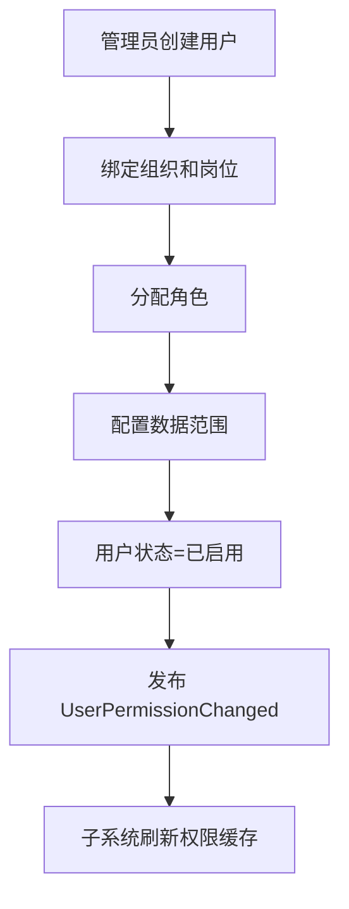
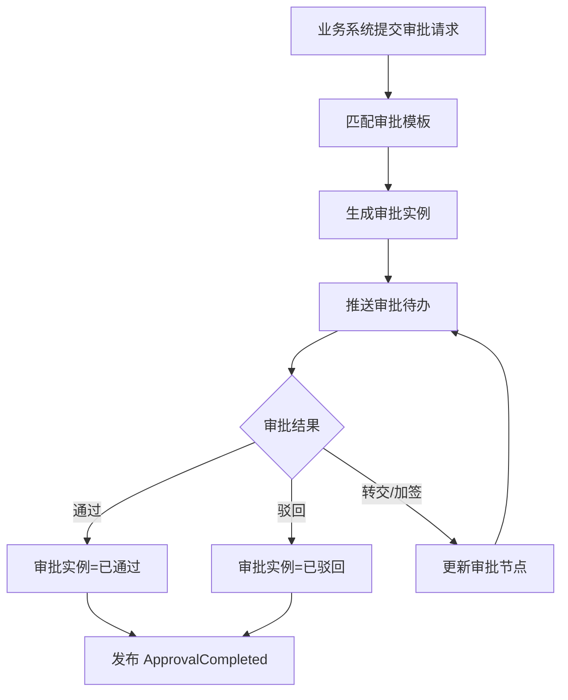
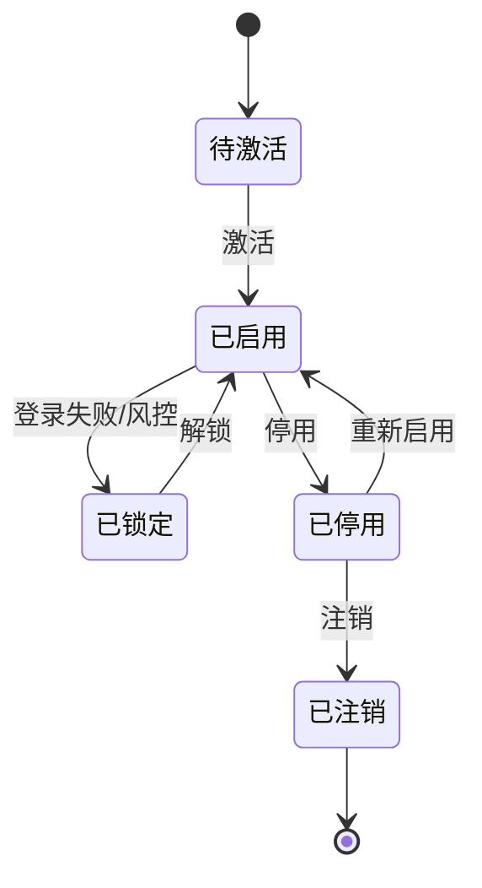
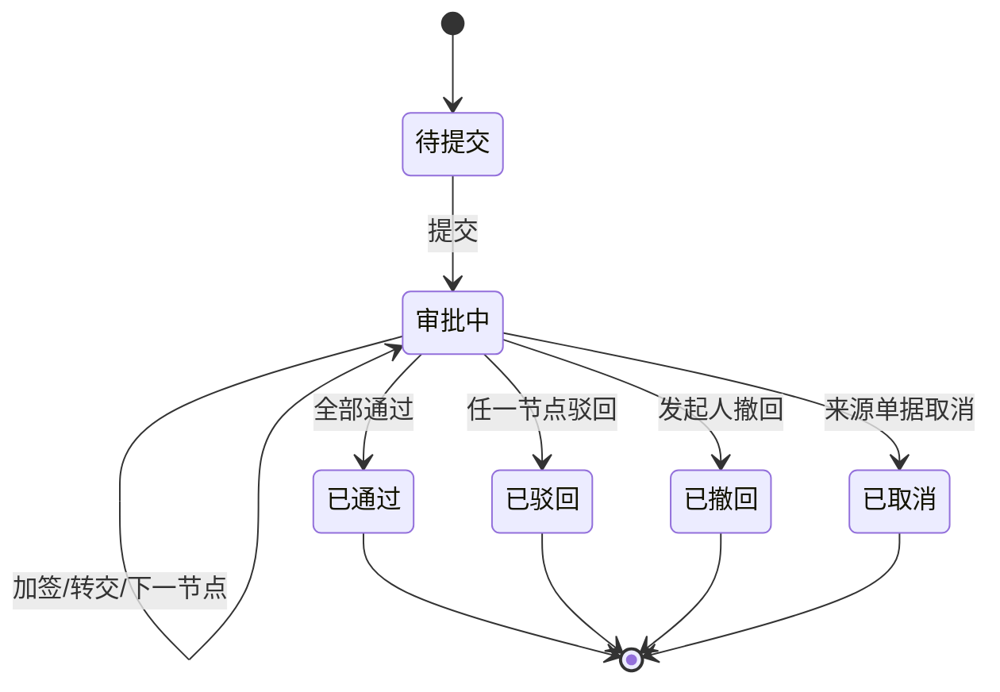

# 37 权限系统功能设计

> 权限系统负责用户、角色、组织、数据范围、审批权限和审计。本文聚焦权限系统自身功能、角色、状态和事件。

## 1. 系统定位

| 边界 | 说明 |
| --- | --- |
| 负责 | 用户、角色、权限点、组织、数据权限、审批流、审计日志、登录安全 |
| 不负责 | 业务单据执行、库存记账、财务凭证 |
| 核心数据 | 用户、角色、菜单权限、操作权限、数据范围、组织岗位、审批任务、审计日志 |

## 2. 使用角色

| 角色 | 使用功能 | 典型动作 |
| --- | --- | --- |
| 系统管理员 | 用户、角色、权限 | 创建用户、分配角色 |
| 组织管理员 | 部门、岗位、人员 | 维护组织和岗位 |
| 业务主管 | 审批配置、授权 | 配置采购/库存/主数据审批 |
| 审批人 | 待办审批 | 审批订单、调整、主数据变更 |
| 审计人员 | 日志查询 | 查看敏感操作和权限变更 |
| 普通用户 | 登录、待办 | 使用被授权功能 |

## 3. 功能地图

| 模块 | 功能 | 说明 |
| --- | --- | --- |
| 用户管理 | 用户、账号、状态、密码、MFA | 身份主体 |
| 组织管理 | 公司、部门、岗位、人员归属 | 权限和流程基础 |
| 角色权限 | 菜单、按钮、API、字段权限 | 功能授权 |
| 数据权限 | 组织、仓库、货主、供应商、客户范围 | 数据隔离 |
| 审批流 | 审批模板、节点、条件、委托 | 业务审批 |
| 待办中心 | 待审批、已审批、抄送 | 用户工作台 |
| 审计日志 | 登录、授权、审批、敏感操作 | 追溯 |
| 安全策略 | 密码、锁定、会话、IP 白名单 | 账号安全 |

## 4. 核心操作流程

### 4.1 用户授权流程

### 4.2 审批流程

## 5. 数据状态机

### 5.1 用户状态

### 5.2 审批实例状态

## 6. 生产事件

| 事件 | 触发动作 | 关键载荷 |
| --- | --- | --- |
| `UserCreated` | 创建用户 | `user_id`、`org_id`、`status` |
| `UserPermissionChanged` | 权限变更 | `user_id`、`roles`、`data_scope`、`version_no` |
| `UserDisabled` | 停用用户 | `user_id`、`reason` |
| `RoleChanged` | 角色变更 | `role_id`、`permission_codes` |
| `OrgChanged` | 组织变更 | `org_id`、`parent_org_id`、`status` |
| `ApprovalStarted` | 审批发起 | `approval_instance_id`、`biz_type`、`biz_id` |
| `ApprovalCompleted` | 审批完成 | `approval_instance_id`、`biz_id`、`result` |
| `AuditLogCreated` | 记录审计日志 | `operator_id`、`operation_type`、`biz_id` |

## 7. 消费事件

| 事件 | 来源 | 消费后数据变化 |
| --- | --- | --- |
| `EmployeeJoined` | HR/组织主数据 | 创建用户草稿或待激活账号 |
| `EmployeeLeft` | HR/组织主数据 | 用户状态=已停用，回收权限 |
| `MasterDataChanged` | 主数据系统 | 更新组织、仓库、货主、供应商等数据权限对象 |
| `ApprovalRequestSubmitted` | 业务系统 | 创建审批实例和待办 |
| `ApprovalRequestCancelled` | 业务系统 | 审批实例状态=已取消 |
| `SensitiveOperationPerformed` | 业务系统 | 写入审计日志，必要时触发风控 |

## 8. 事件处理规则

| 规则 | 说明 |
| --- | --- |
| 最小权限 | 默认无权限，通过角色和数据范围授予 |
| 数据权限优先 | 即使有菜单权限，也必须满足组织/仓库/货主/供应商/客户范围 |
| 审批幂等 | 同一业务单据同一审批版本只能有一个有效审批实例 |
| 审计不可改 | 审计日志只追加，不允许业务用户修改 |

## DDD 对齐说明

本文属于 **权限上下文/通用域**。设计时应把页面、字段和流程统一回到该上下文的模型边界，避免跨上下文直接修改数据。

| DDD 项 | 对齐口径 |
| --- | --- |
| 限界上下文 | 权限上下文/通用域 |
| 核心聚合 | User、Role、Permission、Token、OperationLog |
| 数据主权 | 身份、授权、审计和数据权限 |
| 生产事件 | 只发布本上下文已经发生的业务事实 |
| 消费事件 | 消费外部事实时必须记录 event_id、幂等键、处理状态和失败原因 |
| 查询模型 | 列表、看板、导出可使用读模型，不强行加载聚合 |

## 9. 继续上下文

当前结论：权限系统是身份、授权、审批和审计中心，所有业务系统都应通过它控制“谁能做什么、能看哪些数据”。

关键假设：权限系统不处理业务数据本身，只处理身份、权限、审批结果和审计事实。
