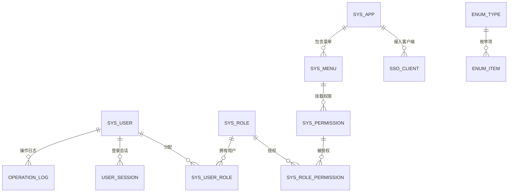
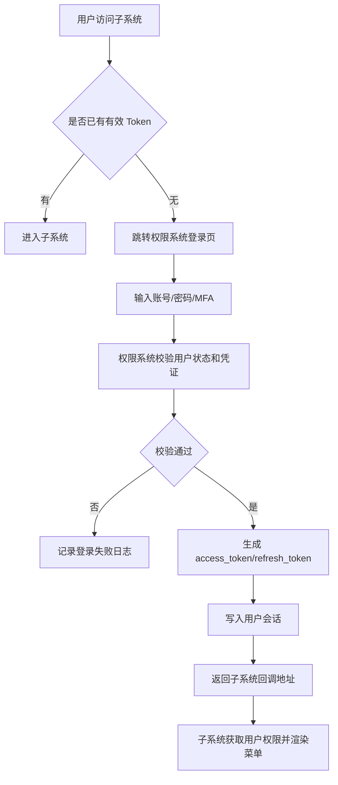
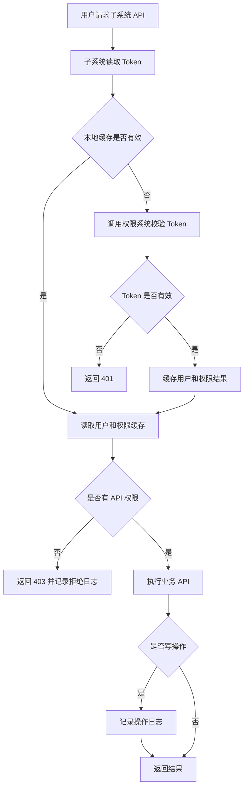
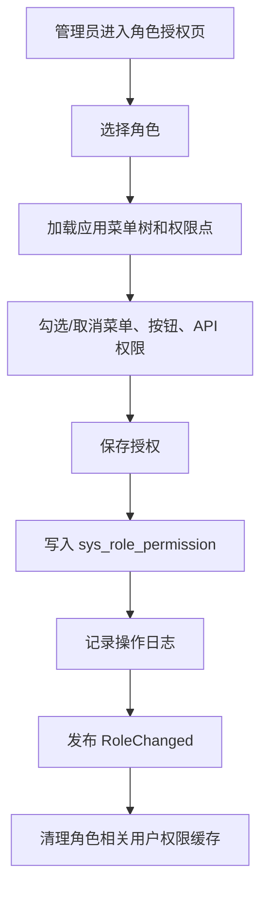
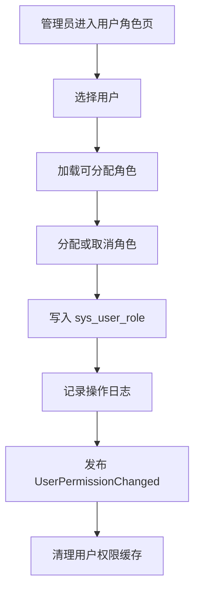

# 38 权限系统详细设计

> 本文承接 [权限系统功能设计](./37-权限系统功能设计.md)，细化单点登录、用户、角色、权限、菜单页面、Token、操作日志、枚举配置等字段模型和页面设计。当前版本是系统设计级字段模型，不是最终数据库 DDL。

## 1. 设计目标

权限系统要统一回答四个问题：

| 问题 | 设计对象 |
| --- | --- |
| 用户是谁 | 用户、账号、登录凭证、会话 Token |
| 用户能进哪些系统页面 | 菜单、页面、功能权限、角色 |
| 用户能操作哪些按钮/API | 权限点、角色权限、用户角色 |
| 用户操作了什么 | 登录日志、操作日志、授权变更日志 |

核心原则：

| 原则 | 说明 |
| --- | --- |
| 所有功能权限统一在权限系统维护 | 子系统只消费权限结果，不各自维护角色权限 |
| 权限点要能落到页面和按钮 | 页面可见、按钮可见、API 可调用要能对应 |
| 后端必须校验权限 | 前端隐藏按钮只是体验，后台 API 必须校验 Token 和权限 |
| Token 可以缓存 | 子系统可缓存 Token 解析和权限结果，但权限变更要能失效 |
| 操作日志只追加 | 登录、写操作、授权变更、敏感操作必须留痕 |

## 2. 总体模型

## 3. 功能页面

| 页面 | 主要用途 | 展示字段 | 主要操作 |
| --- | --- | --- | --- |
| 登录页 | SSO 登录入口 | 账号、密码、验证码/MFA | 登录、忘记密码 |
| 用户管理 | 用户 CRUD、分配角色 | 用户名、姓名、手机号、组织、状态、角色 | 新增、编辑、启用、停用、重置密码、分配角色 |
| 角色管理 | 角色 CRUD、分配权限 | 角色编码、角色名称、角色类型、状态 | 新增、编辑、启用、停用、分配权限、查看用户 |
| 菜单页面管理 | 系统菜单和页面维护 | 应用、菜单名称、路由、排序、状态 | 新增菜单、编辑、调整排序、停用 |
| 权限点管理 | 功能/API/按钮权限维护 | 权限编码、权限名称、权限类型、页面、API | 新增、编辑、绑定菜单、绑定 API |
| 角色授权页 | 给角色分配权限 | 应用、菜单树、按钮/API 权限 | 勾选授权、取消授权、保存 |
| 用户角色页 | 给用户分配角色 | 用户、已分配角色、可选角色 | 分配角色、取消角色 |
| 会话管理 | Token 和在线用户 | 用户、登录时间、过期时间、客户端、IP | 强制下线、查看详情 |
| 操作日志 | 查询写操作和敏感操作 | 操作人、操作类型、对象、时间、结果 | 查询、导出 |
| 枚举配置 | 维护页面枚举项 | 枚举类型、枚举值、标签、状态 | 新增、编辑、排序、停用 |

## 4. 单点登录与 Token 流程

### 4.1 登录流程

### 4.2 API 权限校验流程

## 5. 字段模型

### 5.1 应用系统 `sys_app`

用于登记可接入 SSO 和权限体系的子系统，例如采购、OMS、WMS、BMS。

| 字段 | 类型 | 是否必填 | 枚举/约束 | 说明 |
| --- | --- | --- | --- | --- |
| `app_id` | bigint | 是 | 主键 | 应用 ID |
| `app_code` | varchar(64) | 是 | 唯一 | 应用编码，如 `OMS`、`WMS` |
| `app_name` | varchar(128) | 是 |  | 应用名称 |
| `app_type` | varchar(32) | 是 | `APP_TYPE` | Web、OpenAPI、移动端、后台服务 |
| `base_url` | varchar(512) | 否 | URL | 应用首页地址 |
| `status` | varchar(32) | 是 | `COMMON_STATUS` | 启用、停用 |
| `sort_no` | int | 否 |  | 排序 |
| `remark` | varchar(512) | 否 |  | 备注 |
| `created_by` | bigint | 是 |  | 创建人 |
| `created_at` | datetime | 是 |  | 创建时间 |
| `updated_by` | bigint | 否 |  | 更新人 |
| `updated_at` | datetime | 否 |  | 更新时间 |

对应页面：`应用管理页`

展示字段：应用编码、应用名称、应用类型、首页地址、状态、更新时间。

### 5.2 SSO 客户端 `sso_client`

用于配置子系统接入单点登录。

| 字段 | 类型 | 是否必填 | 枚举/约束 | 说明 |
| --- | --- | --- | --- | --- |
| `client_id` | bigint | 是 | 主键 | 客户端 ID |
| `app_id` | bigint | 是 | 外键 | 所属应用 |
| `client_code` | varchar(64) | 是 | 唯一 | OAuth/OIDC client id |
| `client_secret_hash` | varchar(256) | 是 | 加密存储 | 客户端密钥哈希 |
| `redirect_uris` | text | 是 | JSON 数组 | 允许回调地址 |
| `grant_types` | varchar(256) | 是 | `GRANT_TYPE` 多选 | 授权码、密码、刷新 Token 等 |
| `token_ttl_seconds` | int | 是 | > 0 | access token 有效期 |
| `refresh_ttl_seconds` | int | 是 | > 0 | refresh token 有效期 |
| `status` | varchar(32) | 是 | `COMMON_STATUS` | 启用、停用 |
| `created_at` | datetime | 是 |  | 创建时间 |
| `updated_at` | datetime | 否 |  | 更新时间 |

对应页面：`SSO 客户端配置页`

展示字段：客户端编码、所属应用、回调地址、授权类型、Token 有效期、状态。

### 5.3 用户 `sys_user`

| 字段 | 类型 | 是否必填 | 枚举/约束 | 说明 |
| --- | --- | --- | --- | --- |
| `user_id` | bigint | 是 | 主键 | 用户 ID |
| `username` | varchar(64) | 是 | 唯一 | 登录账号 |
| `password_hash` | varchar(256) | 否 | 加密存储 | 本地账号密码哈希；外部 SSO 可为空 |
| `real_name` | varchar(128) | 是 |  | 姓名 |
| `nickname` | varchar(128) | 否 |  | 昵称 |
| `mobile` | varchar(32) | 否 | 唯一可选 | 手机号 |
| `email` | varchar(128) | 否 | 唯一可选 | 邮箱 |
| `user_type` | varchar(32) | 是 | `USER_TYPE` | 内部员工、供应商用户、客户用户、系统账号 |
| `org_id` | bigint | 否 | 外键 | 所属组织 |
| `employee_no` | varchar(64) | 否 |  | 工号 |
| `supplier_id` | bigint | 否 | 外键 | 供应商用户绑定供应商 |
| `customer_id` | bigint | 否 | 外键 | 客户用户绑定客户 |
| `owner_id` | bigint | 否 | 外键 | 货主用户绑定货主 |
| `mfa_enabled` | boolean | 是 | true/false | 是否启用 MFA |
| `last_login_at` | datetime | 否 |  | 最近登录时间 |
| `login_fail_count` | int | 是 | 默认 0 | 连续失败次数 |
| `locked_until` | datetime | 否 |  | 锁定到期时间 |
| `status` | varchar(32) | 是 | `USER_STATUS` | 待激活、已启用、已锁定、已停用、已注销 |
| `created_by` | bigint | 是 |  | 创建人 |
| `created_at` | datetime | 是 |  | 创建时间 |
| `updated_by` | bigint | 否 |  | 更新人 |
| `updated_at` | datetime | 否 |  | 更新时间 |

对应页面：`用户管理页`

展示字段：账号、姓名、手机号、邮箱、用户类型、组织、绑定对象、状态、最近登录时间、创建时间。

页面操作：

| 操作 | 权限编码 |
| --- | --- |
| 查询用户 | `iam:user:read` |
| 新增用户 | `iam:user:create` |
| 编辑用户 | `iam:user:update` |
| 停用用户 | `iam:user:disable` |
| 启用用户 | `iam:user:enable` |
| 重置密码 | `iam:user:reset_password` |
| 分配角色 | `iam:user:assign_role` |
| 取消角色 | `iam:user:remove_role` |

### 5.4 角色 `sys_role`

| 字段 | 类型 | 是否必填 | 枚举/约束 | 说明 |
| --- | --- | --- | --- | --- |
| `role_id` | bigint | 是 | 主键 | 角色 ID |
| `role_code` | varchar(64) | 是 | 唯一 | 角色编码 |
| `role_name` | varchar(128) | 是 |  | 角色名称 |
| `role_type` | varchar(32) | 是 | `ROLE_TYPE` | 系统角色、业务角色、外部角色 |
| `app_scope` | varchar(64) | 否 | 应用编码或 `ALL` | 角色适用应用 |
| `data_scope_type` | varchar(32) | 是 | `DATA_SCOPE_TYPE` | 默认数据范围 |
| `description` | varchar(512) | 否 |  | 角色说明 |
| `status` | varchar(32) | 是 | `COMMON_STATUS` | 启用、停用 |
| `created_by` | bigint | 是 |  | 创建人 |
| `created_at` | datetime | 是 |  | 创建时间 |
| `updated_by` | bigint | 否 |  | 更新人 |
| `updated_at` | datetime | 否 |  | 更新时间 |

对应页面：`角色管理页`

展示字段：角色编码、角色名称、角色类型、适用应用、数据范围、状态、更新时间。

页面操作：

| 操作 | 权限编码 |
| --- | --- |
| 查询角色 | `iam:role:read` |
| 新增角色 | `iam:role:create` |
| 编辑角色 | `iam:role:update` |
| 启用/停用角色 | `iam:role:change_status` |
| 分配权限 | `iam:role:assign_permission` |
| 取消权限 | `iam:role:remove_permission` |
| 查看角色用户 | `iam:role:view_users` |

### 5.5 用户角色关系 `sys_user_role`

| 字段 | 类型 | 是否必填 | 枚举/约束 | 说明 |
| --- | --- | --- | --- | --- |
| `user_role_id` | bigint | 是 | 主键 | 关系 ID |
| `user_id` | bigint | 是 | 外键 | 用户 |
| `role_id` | bigint | 是 | 外键 | 角色 |
| `grant_type` | varchar(32) | 是 | `GRANT_TYPE_USER_ROLE` | 手工、组织继承、岗位继承、系统默认 |
| `effective_from` | datetime | 否 |  | 生效时间 |
| `effective_to` | datetime | 否 |  | 失效时间 |
| `status` | varchar(32) | 是 | `COMMON_STATUS` | 启用、停用 |
| `granted_by` | bigint | 是 |  | 授权人 |
| `granted_at` | datetime | 是 |  | 授权时间 |

对应页面：`用户角色页`

展示字段：用户、角色、授权类型、生效时间、失效时间、状态、授权人。

### 5.6 菜单/页面 `sys_menu`

菜单用于前端展示；权限点用于控制功能。一个页面可以挂多个按钮/API 权限。

| 字段 | 类型 | 是否必填 | 枚举/约束 | 说明 |
| --- | --- | --- | --- | --- |
| `menu_id` | bigint | 是 | 主键 | 菜单 ID |
| `app_id` | bigint | 是 | 外键 | 所属应用 |
| `parent_menu_id` | bigint | 否 | 外键 | 父菜单 |
| `menu_code` | varchar(128) | 是 | 应用内唯一 | 菜单编码 |
| `menu_name` | varchar(128) | 是 |  | 菜单名称 |
| `menu_type` | varchar(32) | 是 | `MENU_TYPE` | 目录、页面、外链 |
| `route_path` | varchar(256) | 否 |  | 前端路由 |
| `component_path` | varchar(256) | 否 |  | 前端组件路径 |
| `icon` | varchar(64) | 否 |  | 图标 |
| `sort_no` | int | 是 | 默认 0 | 排序 |
| `visible` | boolean | 是 | true/false | 是否在菜单展示 |
| `status` | varchar(32) | 是 | `COMMON_STATUS` | 启用、停用 |
| `created_at` | datetime | 是 |  | 创建时间 |
| `updated_at` | datetime | 否 |  | 更新时间 |

对应页面：`菜单页面管理页`

展示字段：应用、父菜单、菜单名称、菜单类型、路由、排序、是否显示、状态。

### 5.7 权限点 `sys_permission`

权限点统一管理菜单、按钮、API、字段权限。CRUD 本质上是权限点的一组标准动作。

| 字段 | 类型 | 是否必填 | 枚举/约束 | 说明 |
| --- | --- | --- | --- | --- |
| `permission_id` | bigint | 是 | 主键 | 权限 ID |
| `app_id` | bigint | 是 | 外键 | 所属应用 |
| `menu_id` | bigint | 否 | 外键 | 所属页面/菜单 |
| `permission_code` | varchar(128) | 是 | 全局唯一 | 权限编码，如 `wms:outbound:create` |
| `permission_name` | varchar(128) | 是 |  | 权限名称 |
| `permission_type` | varchar(32) | 是 | `PERMISSION_TYPE` | 菜单、按钮、API、字段 |
| `resource_type` | varchar(32) | 是 | `RESOURCE_TYPE` | 页面、按钮、接口、字段 |
| `action_type` | varchar(32) | 是 | `ACTION_TYPE` | CREATE、READ、UPDATE、DELETE、EXPORT、IMPORT、APPROVE 等 |
| `api_method` | varchar(16) | 否 | `HTTP_METHOD` | GET、POST、PUT、DELETE |
| `api_path` | varchar(256) | 否 |  | API 路径 |
| `field_code` | varchar(128) | 否 |  | 字段权限适用 |
| `status` | varchar(32) | 是 | `COMMON_STATUS` | 启用、停用 |
| `created_at` | datetime | 是 |  | 创建时间 |
| `updated_at` | datetime | 否 |  | 更新时间 |

对应页面：`权限点管理页`

展示字段：应用、页面、权限编码、权限名称、权限类型、动作类型、API 方法、API 路径、状态。

CRUD 权限编码建议：

| 页面/对象 | 查询 | 新增 | 编辑 | 删除 |
| --- | --- | --- | --- | --- |
| 用户 | `iam:user:read` | `iam:user:create` | `iam:user:update` | `iam:user:delete` |
| 角色 | `iam:role:read` | `iam:role:create` | `iam:role:update` | `iam:role:delete` |
| 权限点 | `iam:permission:read` | `iam:permission:create` | `iam:permission:update` | `iam:permission:delete` |
| 菜单 | `iam:menu:read` | `iam:menu:create` | `iam:menu:update` | `iam:menu:delete` |
| 枚举 | `iam:enum:read` | `iam:enum:create` | `iam:enum:update` | `iam:enum:delete` |
| 操作日志 | `iam:operation_log:read` | 无 | 无 | 无 |

### 5.8 角色权限关系 `sys_role_permission`

| 字段 | 类型 | 是否必填 | 枚举/约束 | 说明 |
| --- | --- | --- | --- | --- |
| `role_permission_id` | bigint | 是 | 主键 | 关系 ID |
| `role_id` | bigint | 是 | 外键 | 角色 |
| `permission_id` | bigint | 是 | 外键 | 权限点 |
| `grant_status` | varchar(32) | 是 | `GRANT_STATUS` | 已授权、已取消 |
| `granted_by` | bigint | 是 |  | 授权人 |
| `granted_at` | datetime | 是 |  | 授权时间 |
| `revoked_by` | bigint | 否 |  | 取消授权人 |
| `revoked_at` | datetime | 否 |  | 取消授权时间 |

对应页面：`角色授权页`

展示方式：按应用 + 菜单树展示，页面下展示按钮/API 权限复选框。

### 5.9 数据权限范围 `sys_data_scope`

用于控制能看哪些组织、仓库、供应商、客户、货主数据。

| 字段 | 类型 | 是否必填 | 枚举/约束 | 说明 |
| --- | --- | --- | --- | --- |
| `data_scope_id` | bigint | 是 | 主键 | 数据范围 ID |
| `subject_type` | varchar(32) | 是 | `SUBJECT_TYPE` | 用户、角色 |
| `subject_id` | bigint | 是 |  | 用户 ID 或角色 ID |
| `scope_type` | varchar(32) | 是 | `DATA_SCOPE_TYPE` | 全部、本组织、本组织及下级、自定义、本人 |
| `resource_type` | varchar(32) | 是 | `DATA_RESOURCE_TYPE` | 组织、仓库、供应商、客户、货主 |
| `resource_ids` | text | 否 | JSON 数组 | 自定义资源 ID |
| `status` | varchar(32) | 是 | `COMMON_STATUS` | 启用、停用 |
| `created_at` | datetime | 是 |  | 创建时间 |

对应页面：`数据权限配置页`

展示字段：授权对象、对象类型、数据范围类型、资源类型、资源列表、状态。

### 5.10 用户会话/Token `user_session`

| 字段 | 类型 | 是否必填 | 枚举/约束 | 说明 |
| --- | --- | --- | --- | --- |
| `session_id` | bigint | 是 | 主键 | 会话 ID |
| `user_id` | bigint | 是 | 外键 | 用户 |
| `client_id` | bigint | 是 | 外键 | SSO 客户端 |
| `access_token_jti` | varchar(128) | 是 | 唯一 | access token 唯一 ID |
| `refresh_token_jti` | varchar(128) | 否 | 唯一 | refresh token 唯一 ID |
| `token_status` | varchar(32) | 是 | `TOKEN_STATUS` | 有效、已刷新、已撤销、已过期 |
| `login_ip` | varchar(64) | 否 |  | 登录 IP |
| `user_agent` | varchar(512) | 否 |  | 浏览器/客户端信息 |
| `login_at` | datetime | 是 |  | 登录时间 |
| `expires_at` | datetime | 是 |  | access token 过期时间 |
| `refresh_expires_at` | datetime | 否 |  | refresh token 过期时间 |
| `logout_at` | datetime | 否 |  | 登出时间 |

对应页面：`会话管理页`

展示字段：用户、客户端、登录 IP、登录时间、过期时间、Token 状态。

缓存建议：

| 缓存 | Key | Value | 过期策略 |
| --- | --- | --- | --- |
| Token 校验缓存 | `auth:token:{jti}` | 用户 ID、客户端、过期时间 | 不超过 token 剩余有效期 |
| 用户权限缓存 | `auth:perm:{user_id}:{app_code}` | 权限编码集合、菜单树、数据范围 | 权限变更时主动失效 |
| 用户基础缓存 | `auth:user:{user_id}` | 用户状态、组织、绑定对象 | 用户变更时主动失效 |

### 5.11 登录日志 `login_log`

| 字段 | 类型 | 是否必填 | 枚举/约束 | 说明 |
| --- | --- | --- | --- | --- |
| `login_log_id` | bigint | 是 | 主键 | 登录日志 ID |
| `user_id` | bigint | 否 |  | 用户 ID，失败时可为空 |
| `username` | varchar(64) | 是 |  | 登录账号 |
| `client_id` | bigint | 否 |  | 客户端 |
| `login_result` | varchar(32) | 是 | `LOGIN_RESULT` | 成功、失败 |
| `failure_reason` | varchar(128) | 否 | `LOGIN_FAILURE_REASON` | 密码错误、用户停用、Token 过期等 |
| `login_ip` | varchar(64) | 否 |  | IP |
| `user_agent` | varchar(512) | 否 |  | 客户端信息 |
| `login_at` | datetime | 是 |  | 登录时间 |

对应页面：`登录日志页`

展示字段：账号、用户、客户端、登录结果、失败原因、IP、登录时间。

### 5.12 操作日志 `operation_log`

用户写入操作时记录简要日志。查询类操作默认不记录，导出、授权、删除等敏感读操作可以记录。

| 字段 | 类型 | 是否必填 | 枚举/约束 | 说明 |
| --- | --- | --- | --- | --- |
| `operation_log_id` | bigint | 是 | 主键 | 操作日志 ID |
| `request_id` | varchar(128) | 是 | 链路 ID | 请求链路追踪 |
| `operator_id` | bigint | 是 |  | 操作人 ID |
| `operator_name` | varchar(128) | 是 | 快照 | 操作人姓名 |
| `app_code` | varchar(64) | 是 |  | 所属应用 |
| `module_code` | varchar(64) | 是 |  | 模块编码 |
| `operation_type` | varchar(32) | 是 | `OPERATION_TYPE` | CREATE、UPDATE、DELETE、APPROVE、LOGIN 等 |
| `permission_code` | varchar(128) | 否 |  | 对应权限点 |
| `biz_type` | varchar(64) | 否 |  | 业务对象类型，如 USER、ROLE |
| `biz_id` | varchar(128) | 否 |  | 业务对象 ID |
| `biz_no` | varchar(128) | 否 |  | 业务单号 |
| `operation_desc` | varchar(512) | 否 |  | 简要说明 |
| `before_snapshot` | text | 否 | JSON | 修改前摘要 |
| `after_snapshot` | text | 否 | JSON | 修改后摘要 |
| `operation_result` | varchar(32) | 是 | `OPERATION_RESULT` | 成功、失败 |
| `failure_reason` | varchar(512) | 否 |  | 失败原因 |
| `ip` | varchar(64) | 否 |  | IP |
| `user_agent` | varchar(512) | 否 |  | 客户端 |
| `created_at` | datetime | 是 |  | 操作时间 |

对应页面：`操作日志页`

展示字段：操作人、应用、模块、操作类型、业务对象、结果、IP、操作时间。

必须记录的操作：

| 操作 | 说明 |
| --- | --- |
| 用户新增/编辑/停用/重置密码 | 身份安全相关 |
| 角色新增/编辑/停用 | 授权基础变化 |
| 给角色分配/取消权限 | 权限变化 |
| 给用户分配/取消角色 | 用户权限变化 |
| 数据权限变更 | 数据可见范围变化 |
| 枚举配置变更 | 页面枚举和业务状态变化 |
| 导出数据 | 敏感数据外流风险 |
| 登录成功/失败 | 可写登录日志，也可同步写操作日志摘要 |

### 5.13 枚举配置 `enum_type` / `enum_item`

枚举类型支持在页面配置。系统内字段使用枚举编码，页面展示枚举名称。

表：`enum_type`

| 字段 | 类型 | 是否必填 | 枚举/约束 | 说明 |
| --- | --- | --- | --- | --- |
| `enum_type_id` | bigint | 是 | 主键 | 枚举类型 ID |
| `enum_type_code` | varchar(64) | 是 | 唯一 | 如 `USER_STATUS` |
| `enum_type_name` | varchar(128) | 是 |  | 枚举类型名称 |
| `editable` | boolean | 是 | true/false | 是否允许页面维护 |
| `description` | varchar(512) | 否 |  | 说明 |
| `status` | varchar(32) | 是 | `COMMON_STATUS` | 启用、停用 |

表：`enum_item`

| 字段 | 类型 | 是否必填 | 枚举/约束 | 说明 |
| --- | --- | --- | --- | --- |
| `enum_item_id` | bigint | 是 | 主键 | 枚举项 ID |
| `enum_type_code` | varchar(64) | 是 | 外键 | 枚举类型编码 |
| `item_value` | varchar(64) | 是 | 类型内唯一 | 枚举值 |
| `item_label` | varchar(128) | 是 |  | 页面显示名称 |
| `sort_no` | int | 是 | 默认 0 | 排序 |
| `is_default` | boolean | 是 | true/false | 是否默认 |
| `status` | varchar(32) | 是 | `COMMON_STATUS` | 启用、停用 |

对应页面：`枚举配置页`

展示字段：枚举类型、枚举值、显示名称、是否默认、排序、状态。

## 6. 枚举定义

以下枚举都建议支持 `enum_type` / `enum_item` 页面配置，但系统级枚举可以限制删除。

| 枚举类型 | 枚举值 | 说明 |
| --- | --- | --- |
| `COMMON_STATUS` | `ENABLED`、`DISABLED` | 通用启用/停用 |
| `USER_STATUS` | `PENDING_ACTIVATION`、`ENABLED`、`LOCKED`、`DISABLED`、`CANCELLED` | 用户状态 |
| `USER_TYPE` | `INTERNAL`、`SUPPLIER`、`CUSTOMER`、`OWNER`、`SYSTEM` | 用户类型 |
| `ROLE_TYPE` | `SYSTEM`、`BUSINESS`、`EXTERNAL` | 角色类型 |
| `MENU_TYPE` | `DIRECTORY`、`PAGE`、`EXTERNAL_LINK` | 菜单类型 |
| `PERMISSION_TYPE` | `MENU`、`BUTTON`、`API`、`FIELD` | 权限类型 |
| `RESOURCE_TYPE` | `PAGE`、`BUTTON`、`API`、`FIELD` | 资源类型 |
| `ACTION_TYPE` | `CREATE`、`READ`、`UPDATE`、`DELETE`、`EXPORT`、`IMPORT`、`APPROVE`、`ASSIGN`、`REVOKE`、`LOGIN` | 动作类型 |
| `HTTP_METHOD` | `GET`、`POST`、`PUT`、`PATCH`、`DELETE` | API 方法 |
| `DATA_SCOPE_TYPE` | `ALL`、`CURRENT_ORG`、`CURRENT_ORG_AND_CHILDREN`、`SELF`、`CUSTOM` | 数据范围 |
| `DATA_RESOURCE_TYPE` | `ORG`、`WAREHOUSE`、`OWNER`、`SUPPLIER`、`CUSTOMER` | 数据资源 |
| `TOKEN_STATUS` | `VALID`、`REFRESHED`、`REVOKED`、`EXPIRED` | Token 状态 |
| `LOGIN_RESULT` | `SUCCESS`、`FAILED` | 登录结果 |
| `LOGIN_FAILURE_REASON` | `BAD_CREDENTIALS`、`USER_DISABLED`、`USER_LOCKED`、`TOKEN_EXPIRED`、`MFA_FAILED` | 登录失败原因 |
| `OPERATION_TYPE` | `CREATE`、`UPDATE`、`DELETE`、`ENABLE`、`DISABLE`、`ASSIGN`、`REVOKE`、`APPROVE`、`EXPORT`、`LOGIN`、`LOGOUT` | 操作类型 |
| `OPERATION_RESULT` | `SUCCESS`、`FAILED` | 操作结果 |
| `GRANT_STATUS` | `GRANTED`、`REVOKED` | 授权状态 |
| `GRANT_TYPE_USER_ROLE` | `MANUAL`、`ORG_INHERITED`、`POSITION_INHERITED`、`SYSTEM_DEFAULT` | 用户角色来源 |
| `GRANT_TYPE` | `AUTHORIZATION_CODE`、`PASSWORD`、`REFRESH_TOKEN`、`CLIENT_CREDENTIALS` | SSO 授权方式 |
| `APP_TYPE` | `WEB`、`OPEN_API`、`MOBILE`、`SERVICE` | 应用类型 |
| `SUBJECT_TYPE` | `USER`、`ROLE` | 数据权限授权对象 |

## 7. 权限系统核心页面与权限点

| 页面 | 页面路由 | 页面权限 | 主要按钮/API 权限 |
| --- | --- | --- | --- |
| 用户管理 | `/iam/users` | `iam:user:read` | `iam:user:create`、`iam:user:update`、`iam:user:disable`、`iam:user:enable`、`iam:user:reset_password` |
| 用户角色 | `/iam/users/:id/roles` | `iam:user:assign_role` | `iam:user:assign_role`、`iam:user:remove_role` |
| 角色管理 | `/iam/roles` | `iam:role:read` | `iam:role:create`、`iam:role:update`、`iam:role:change_status` |
| 角色授权 | `/iam/roles/:id/permissions` | `iam:role:assign_permission` | `iam:role:assign_permission`、`iam:role:remove_permission` |
| 菜单页面管理 | `/iam/menus` | `iam:menu:read` | `iam:menu:create`、`iam:menu:update`、`iam:menu:delete` |
| 权限点管理 | `/iam/permissions` | `iam:permission:read` | `iam:permission:create`、`iam:permission:update`、`iam:permission:delete` |
| 数据权限配置 | `/iam/data-scopes` | `iam:data_scope:read` | `iam:data_scope:update` |
| 会话管理 | `/iam/sessions` | `iam:session:read` | `iam:session:revoke` |
| 操作日志 | `/iam/operation-logs` | `iam:operation_log:read` | `iam:operation_log:export` |
| 枚举配置 | `/iam/enums` | `iam:enum:read` | `iam:enum:create`、`iam:enum:update`、`iam:enum:disable` |

## 8. 权限分配流程

### 8.1 给角色分配权限

### 8.2 给用户分配角色

## 9. 后端鉴权设计

### 9.1 Token 校验返回建议

子系统调用权限系统校验 Token 后，建议返回：

| 字段 | 类型 | 说明 |
| --- | --- | --- |
| `valid` | boolean | Token 是否有效 |
| `user_id` | bigint | 用户 ID |
| `username` | string | 登录账号 |
| `real_name` | string | 姓名 |
| `user_type` | string | 用户类型 |
| `org_id` | bigint | 所属组织 |
| `roles` | array | 角色编码列表 |
| `permissions` | array | 权限编码列表 |
| `data_scopes` | object | 数据权限范围 |
| `expires_at` | datetime | Token 过期时间 |
| `permission_version` | int | 权限版本号 |

### 9.2 子系统接口拦截规则

| 场景 | 处理 |
| --- | --- |
| 无 Token | 返回 401 |
| Token 过期 | 返回 401，前端尝试 refresh token |
| Token 有效但无 API 权限 | 返回 403 |
| Token 有效但数据范围不足 | 返回 403 或过滤数据 |
| 写操作成功 | 记录操作日志 |
| 权限缓存命中 | 不每次调用权限系统，降低延迟 |
| 用户权限变更 | 权限系统发布事件，子系统清理缓存 |

## 10. 操作日志记录策略

| 操作类型 | 是否记录 | 记录内容 |
| --- | --- | --- |
| 登录成功/失败 | 是 | 用户、IP、客户端、结果、失败原因 |
| 新增/编辑/删除 | 是 | 操作对象、修改前后摘要 |
| 启用/停用 | 是 | 对象、原因、状态变化 |
| 分配/取消角色 | 是 | 用户、角色、授权人 |
| 分配/取消权限 | 是 | 角色、权限点、授权人 |
| 数据导出 | 是 | 导出对象、条件摘要、导出数量 |
| 查询 | 默认否 | 敏感查询可记录 |

## DDD 对齐说明

本文属于 **权限上下文/通用域**。设计时应把页面、字段和流程统一回到该上下文的模型边界，避免跨上下文直接修改数据。

| DDD 项 | 对齐口径 |
| --- | --- |
| 限界上下文 | 权限上下文/通用域 |
| 核心聚合 | User、Role、Permission、Token、OperationLog |
| 数据主权 | 身份、授权、审计和数据权限 |
| 生产事件 | 只发布本上下文已经发生的业务事实 |
| 消费事件 | 消费外部事实时必须记录 event_id、幂等键、处理状态和失败原因 |
| 查询模型 | 列表、看板、导出可使用读模型，不强行加载聚合 |

## 11. 继续上下文

当前结论：权限系统需要同时管理 SSO 登录、用户、角色、菜单、权限点、角色权限、用户角色、数据权限、Token 会话和操作日志。所有功能权限在权限系统维护，子系统通过 Token 校验和权限缓存决定用户能看到什么、能调用什么 API。

关键假设：第一版采用 RBAC 为主，数据权限作为扩展；枚举项通过枚举配置页维护；操作日志以“简要记录”为主，重点记录写操作、授权变更、登录和导出。

下一步：可以继续细化 `权限系统接口设计`，包括登录、刷新 Token、校验 Token、获取菜单权限、用户 CRUD、角色授权、操作日志写入等接口。
