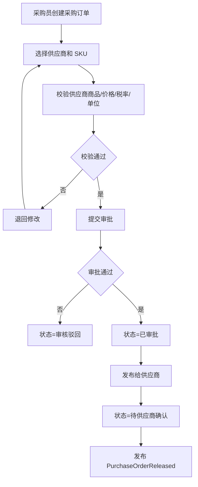
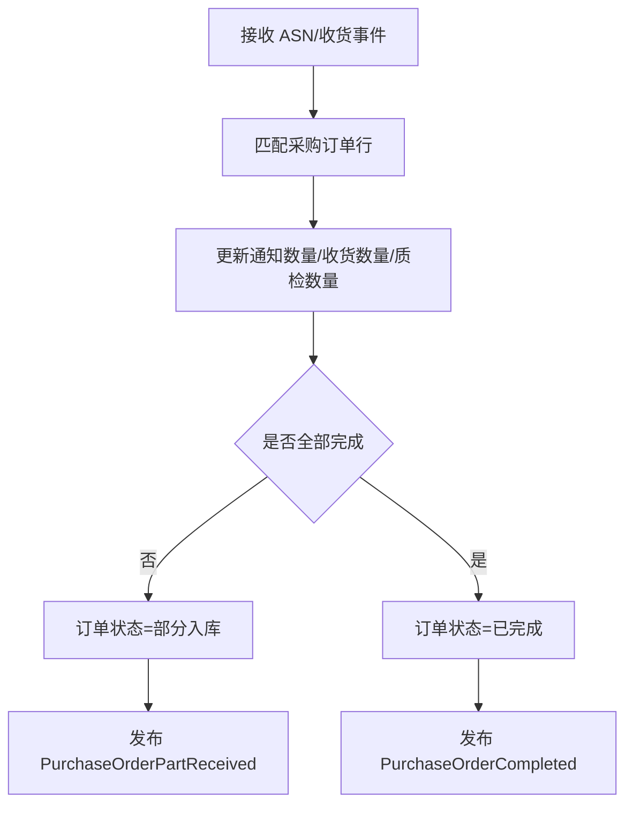
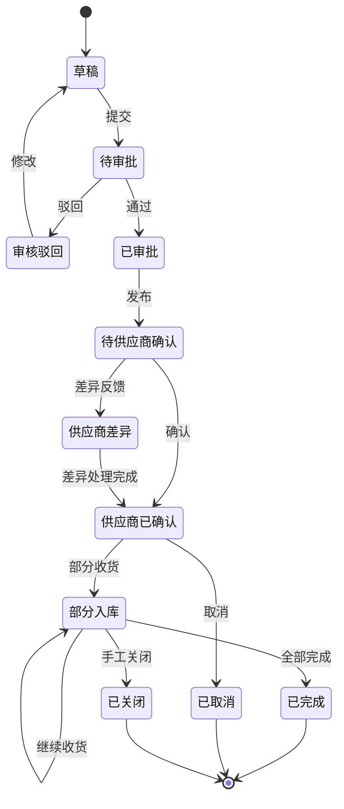
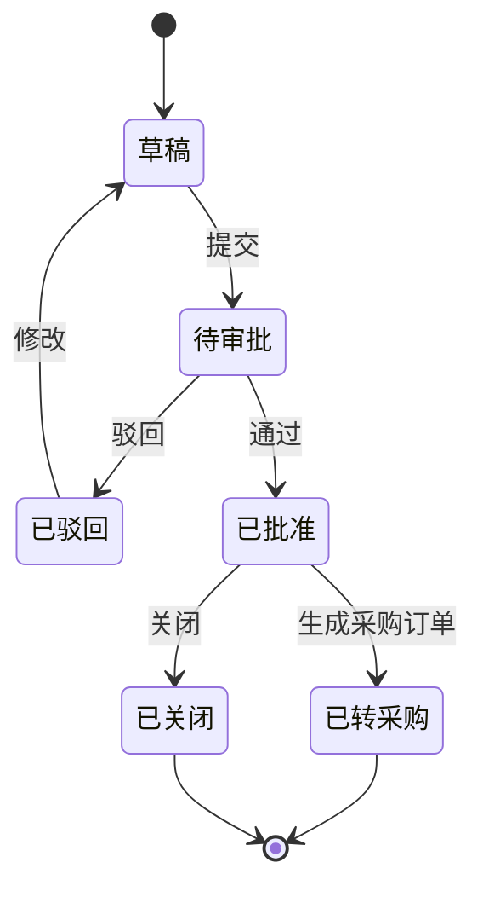

# 31 采购系统功能设计

> 采购系统负责从采购需求到采购订单、供应商协同、采购入库跟踪和退供应商申请的采购侧闭环。本文聚焦采购系统自身功能、角色、状态和事件。

## 1. 系统定位

| 边界 | 说明 |
| --- | --- |
| 负责 | 请购、询价、比价、采购订单、供应商确认结果处理、采购入库跟踪、退供应商申请 |
| 不负责 | 仓库收货作业、库存记账、供应商门户账号、财务付款 |
| 核心数据 | 采购申请、询价单、报价、采购订单、采购订单行、入库进度、退供申请 |

## 2. 使用角色

| 角色 | 使用功能 | 典型动作 |
| --- | --- | --- |
| 需求部门 | 请购 | 提交采购申请、查看进度 |
| 采购员 | 询价、下单、跟单 | 创建询价、比价、生成采购订单 |
| 采购经理 | 审批、供应商选择 | 审核采购申请和采购订单 |
| 质量人员 | 质量要求 | 维护质检要求、查看不良 |
| 财务人员 | 价格/税率/对账查看 | 查看采购金额、应付依据 |
| 系统管理员 | 参数配置 | 采购类型、审批规则、原因码 |

## 3. 功能地图

| 模块 | 功能 | 说明 |
| --- | --- | --- |
| 请购管理 | 请购创建、审批、转采购 | 业务需求入口 |
| 寻源询价 | 询价、报价、比价、定供应商 | 可简化为人工维护价格 |
| 采购订单 | 创建、审批、发布、变更、取消、关闭 | 采购核心单据 |
| 供应商确认处理 | 接收确认、拒绝、交期差异 | 处理供应商协同结果 |
| 到货跟踪 | ASN、收货、质检、入库进度 | 采购订单执行看板 |
| 退供管理 | 创建退供申请、审核、跟踪退供 | 采购逆向 |
| 价格税率 | 采购价格、税率、生效期 | 下单价格依据 |
| 报表 | 采购金额、交付、供应商表现 | 运营分析 |

## 4. 核心操作流程

### 4.1 采购订单主流程

### 4.2 采购入库跟踪流程

## 5. 数据状态机

### 5.1 采购订单状态

### 5.2 请购状态

## 6. 生产事件

| 事件 | 触发动作 | 关键载荷 |
| --- | --- | --- |
| `PurchaseRequisitionApproved` | 请购审批通过 | `requisition_id`、`sku_id`、`approved_qty` |
| `PurchaseOrderCreated` | 创建采购订单 | `purchase_order_id`、`supplier_id`、`amount` |
| `PurchaseOrderApproved` | 采购订单审批通过 | `purchase_order_id`、`approved_by` |
| `PurchaseOrderReleased` | 发布给供应商 | `purchase_order_id`、`supplier_id`、`lines` |
| `PurchaseOrderChanged` | 订单关键字段变更 | `purchase_order_id`、`change_type`、`version_no` |
| `PurchaseOrderCancelled` | 取消采购订单 | `purchase_order_id`、`cancel_reason` |
| `PurchaseOrderPartReceived` | 部分入库 | `purchase_order_id`、`received_qty` |
| `PurchaseOrderCompleted` | 全部完成 | `purchase_order_id`、`completed_at` |
| `SupplierReturnRequested` | 创建退供申请 | `supplier_return_id`、`supplier_id`、`sku_id`、`qty` |

## 7. 消费事件

| 事件 | 来源 | 消费后数据变化 |
| --- | --- | --- |
| `SkuEnabled` | 主数据系统 | 更新可采购 SKU 缓存，允许下单 |
| `SupplierEnabled` | 主数据系统 | 更新可用供应商缓存，允许选择供应商 |
| `SupplierSkuEnabled` | 主数据系统 | 更新供应商商品、MOQ、交期、采购单位 |
| `SupplierOrderConfirmed` | 供应商系统 | 采购订单确认状态=供应商已确认，记录交期 |
| `SupplierOrderDiffReported` | 供应商系统 | 采购订单确认状态=供应商差异，生成差异待办 |
| `AsnSubmitted` | 供应商系统 | 更新采购订单通知数量和预计到货 |
| `InboundReceived` | WMS | 更新采购订单行收货数量 |
| `QcCompleted` | WMS | 更新合格/不合格数量 |
| `InboundPutawayCompleted` | WMS/库存 | 更新入库完成数量，判断订单是否完成 |

## 8. 事件处理规则

| 规则 | 说明 |
| --- | --- |
| 数量累计 | 收货、质检、上架按行累计，支持部分入库 |
| 行状态优先 | 单头状态由行状态汇总，不强行要求所有行同步 |
| 价格快照 | 采购订单保存下单时价格、税率、币种 |
| 取消限制 | 已收货数量大于 0 时不能简单取消，只能关闭剩余数量 |

## DDD 对齐说明

本文属于 **采购上下文**。设计时应把页面、字段和流程统一回到该上下文的模型边界，避免跨上下文直接修改数据。

| DDD 项 | 对齐口径 |
| --- | --- |
| 限界上下文 | 采购上下文 |
| 核心聚合 | PurchaseOrder、PurchaseRequisition、SupplierReturnOrder |
| 数据主权 | 采购意图、供应商义务、采购执行进度 |
| 生产事件 | 只发布本上下文已经发生的业务事实 |
| 消费事件 | 消费外部事实时必须记录 event_id、幂等键、处理状态和失败原因 |
| 查询模型 | 列表、看板、导出可使用读模型，不强行加载聚合 |

## 9. 继续上下文

当前结论：采购系统是采购意图和供应商义务的管理系统，核心状态由审批、供应商确认和入库执行结果驱动。

关键假设：采购系统消费 WMS 和供应商系统事实，不直接创造库存流水。
