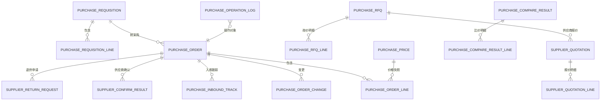
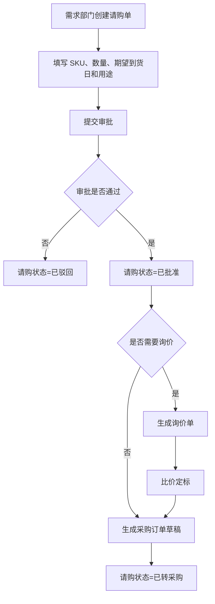
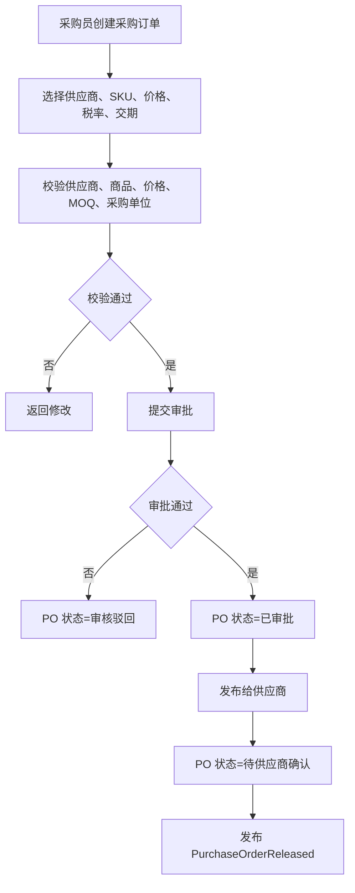
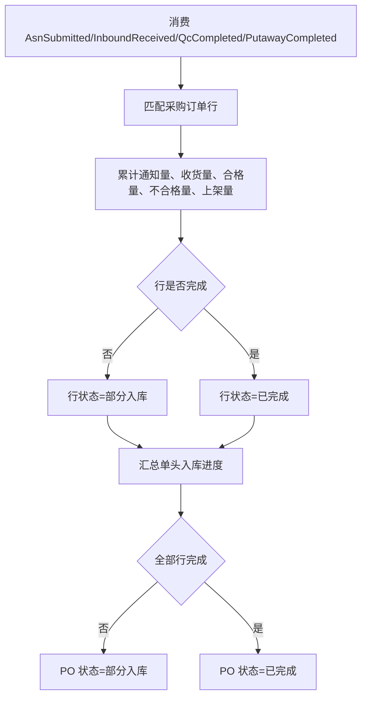
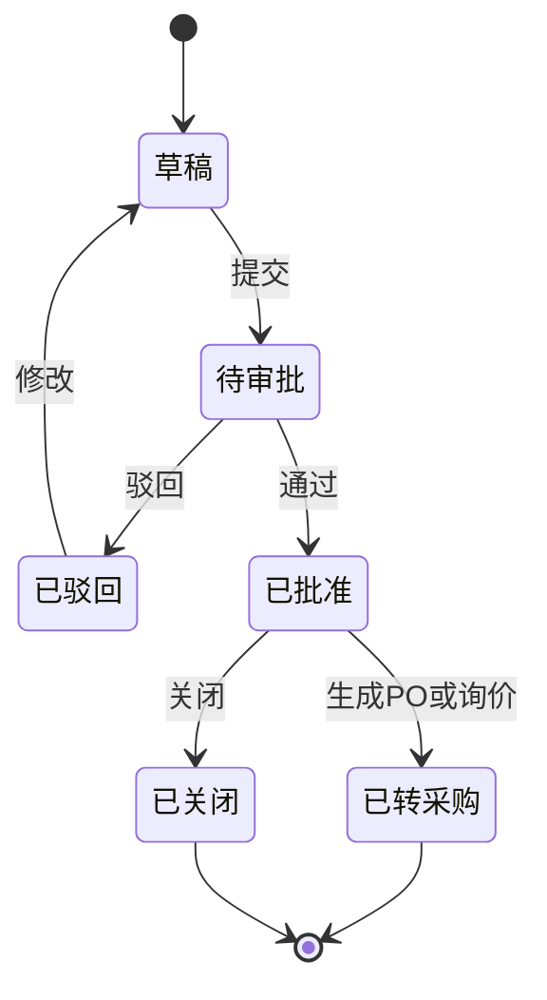
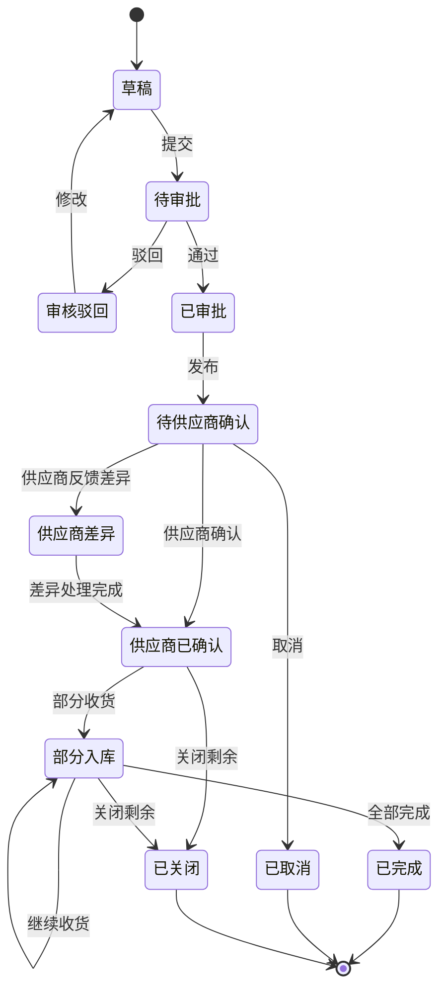
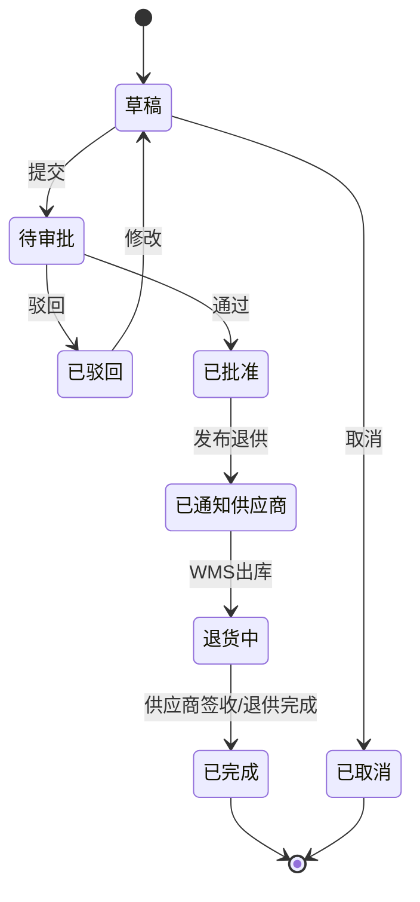

# 41 采购系统详细设计

> 本文承接 [采购系统功能设计](./31-采购系统功能设计.md)，按 [权限系统详细设计](../权限系统/38-权限系统详细设计.md) 的模式细化请购、询价、报价、比价、采购订单、供应商确认处理、入库跟踪、退供申请、价格税率、权限点、枚举、事件和操作日志。当前版本是系统设计级字段模型，不是最终数据库 DDL。

## 1. 设计目标

采购系统要统一回答五个问题：

| 问题 | 设计对象 |
| --- | --- |
| 为什么要采购 | 采购申请、需求部门、需求日期、预算和用途 |
| 向谁采购、按什么价格采购 | 询价单、报价单、比价结果、供应商商品、采购价格 |
| 供应商承担什么义务 | 采购订单、采购订单行、交期、数量、价格、税率 |
| 采购执行到哪一步 | 供应商确认、ASN、收货、质检、上架、关闭 |
| 异常如何处理 | 订单变更、取消、供应商差异、短收、超收、退供申请 |

核心原则：

| 原则 | 说明 |
| --- | --- |
| 采购系统是采购侧主账 | 请购、询价、采购订单和退供申请以采购系统为准 |
| 库存事实不在采购系统记账 | 采购系统只消费 WMS/库存事件更新执行进度，不产生库存流水 |
| 订单保存业务快照 | PO 保存供应商、SKU、价格、税率、交期、单位等下单时快照 |
| 单头状态由行汇总 | 部分入库、全部完成、部分关闭等状态优先由行数量和行状态汇总 |
| 关键动作可审计 | 审批、发布、变更、取消、关闭、退供申请必须留痕 |

## 2. 总体模型

## 3. 功能页面

| 页面 | 主要用途 | 展示字段 | 主要操作 |
| --- | --- | --- | --- |
| 采购工作台 | 展示请购、审批、待询价、待发布、异常待办 | 待审批、待询价、待发布、供应商差异、到货异常 | 查看待办、进入处理 |
| 请购管理页 | 需求部门提交和跟踪采购需求 | 请购单号、需求部门、申请人、金额、状态、期望到货日 | 新增、编辑、提交、撤回、关闭 |
| 请购审批页 | 采购经理或审批人审核请购 | 请购单号、申请人、金额、用途、预算、状态 | 通过、驳回、转交 |
| 询价单页 | 创建询价并邀请供应商报价 | 询价单号、采购品类、供应商、截止时间、状态 | 新增、编辑、发布、取消、关闭 |
| 报价管理页 | 维护供应商报价和报价附件 | 报价单号、供应商、金额、有效期、状态 | 录入报价、导入、确认、作废 |
| 比价定标页 | 对多个报价进行比价并选择供应商 | SKU、报价、交期、评分、推荐结果 | 生成比价、定标、驳回 |
| 采购订单页 | 创建、审批、发布、变更、取消、关闭 PO | PO 单号、供应商、金额、状态、确认状态、入库进度 | 新增、提交、审批、发布、变更、取消、关闭 |
| 供应商确认处理页 | 处理供应商确认、拒绝和差异反馈 | PO 单号、供应商、差异类型、差异内容、状态 | 接受差异、重新协商、取消订单 |
| 到货跟踪页 | 跟踪 ASN、收货、质检、上架进度 | PO、ASN、通知量、收货量、合格量、上架量 | 查看明细、催交、关闭剩余 |
| 退供申请页 | 发起和跟踪退供应商申请 | 退供申请号、供应商、SKU、数量、原因、状态 | 新增、提交、审批、取消 |
| 采购价格页 | 维护采购价格、税率和有效期 | SKU、供应商、价格、税率、币种、生效期 | 新增、编辑、启用、停用 |
| 采购参数页 | 维护采购类型、原因码、超收策略等 | 参数编码、参数值、状态 | 新增、编辑、启停 |
| 操作日志页 | 查询采购关键写操作 | 操作人、对象、动作、时间、结果 | 查询、导出 |
| 枚举配置页 | 维护采购系统枚举项 | 枚举类型、枚举值、标签、状态 | 新增、编辑、排序、停用 |

## 4. 核心流程

### 4.1 请购转采购流程

### 4.2 采购订单发布流程

### 4.3 到货跟踪流程

## 5. 字段模型

### 5.1 采购申请 `purchase_requisition`

| 字段 | 类型 | 是否必填 | 枚举/约束 | 说明 |
| --- | --- | --- | --- | --- |
| `requisition_id` | bigint | 是 | 主键 | 请购单 ID |
| `requisition_no` | varchar(64) | 是 | 唯一 | 请购单号 |
| `requisition_type` | varchar(32) | 是 | `REQUISITION_TYPE` | 常规、紧急、项目、补货 |
| `request_org_id` | bigint | 是 | 外键 | 需求部门 |
| `requester_id` | bigint | 是 | 外键 | 申请人 |
| `expected_arrival_date` | date | 否 |  | 期望到货日期 |
| `budget_amount` | decimal(18,2) | 否 | >= 0 | 预算金额 |
| `currency` | varchar(16) | 是 | `CURRENCY` | 币种 |
| `purpose` | varchar(512) | 否 |  | 采购用途 |
| `approval_status` | varchar(32) | 是 | `APPROVAL_STATUS` | 草稿、待审批、已批准、已驳回 |
| `requisition_status` | varchar(32) | 是 | `REQUISITION_STATUS` | 草稿、待审批、已批准、已转采购、已关闭 |
| `created_by` | bigint | 是 |  | 创建人 |
| `created_at` | datetime | 是 |  | 创建时间 |
| `updated_at` | datetime | 否 |  | 更新时间 |

对应页面：`请购管理页`

展示字段：请购单号、类型、需求部门、申请人、期望到货日、预算金额、审批状态、请购状态。

### 5.2 采购申请行 `purchase_requisition_line`

| 字段 | 类型 | 是否必填 | 枚举/约束 | 说明 |
| --- | --- | --- | --- | --- |
| `requisition_line_id` | bigint | 是 | 主键 | 请购行 ID |
| `requisition_id` | bigint | 是 | 外键 | 请购单 ID |
| `sku_id` | bigint | 是 | 外键 | SKU ID |
| `sku_code` | varchar(64) | 是 |  | SKU 编码快照 |
| `sku_name` | varchar(256) | 是 |  | SKU 名称快照 |
| `request_qty` | decimal(18,4) | 是 | > 0 | 申请数量 |
| `approved_qty` | decimal(18,4) | 否 | >= 0 | 批准数量 |
| `uom` | varchar(32) | 是 |  | 单位 |
| `suggested_supplier_id` | bigint | 否 | 外键 | 建议供应商 |
| `line_status` | varchar(32) | 是 | `REQUISITION_LINE_STATUS` | 草稿、待审批、已批准、已转采购、已关闭 |
| `remark` | varchar(512) | 否 |  | 备注 |

### 5.3 询价单 `purchase_rfq`

| 字段 | 类型 | 是否必填 | 枚举/约束 | 说明 |
| --- | --- | --- | --- | --- |
| `rfq_id` | bigint | 是 | 主键 | 询价单 ID |
| `rfq_no` | varchar(64) | 是 | 唯一 | 询价单号 |
| `rfq_type` | varchar(32) | 是 | `RFQ_TYPE` | 公开询价、定向询价、议价 |
| `buyer_id` | bigint | 是 | 外键 | 采购员 |
| `supplier_ids` | text | 是 | JSON 数组 | 邀请供应商 |
| `quote_deadline` | datetime | 是 |  | 报价截止时间 |
| `rfq_status` | varchar(32) | 是 | `RFQ_STATUS` | 草稿、已发布、报价中、已截标、已定标、已取消、已关闭 |
| `created_at` | datetime | 是 |  | 创建时间 |
| `published_at` | datetime | 否 |  | 发布时间 |

对应页面：`询价单页`

展示字段：询价单号、询价类型、采购员、供应商数、截止时间、状态、发布时间。

### 5.4 询价行 `purchase_rfq_line`

| 字段 | 类型 | 是否必填 | 枚举/约束 | 说明 |
| --- | --- | --- | --- | --- |
| `rfq_line_id` | bigint | 是 | 主键 | 询价行 ID |
| `rfq_id` | bigint | 是 | 外键 | 询价单 ID |
| `sku_id` | bigint | 是 | 外键 | SKU ID |
| `target_qty` | decimal(18,4) | 是 | > 0 | 询价数量 |
| `uom` | varchar(32) | 是 |  | 单位 |
| `required_delivery_date` | date | 否 |  | 要求交期 |
| `quality_requirement` | varchar(512) | 否 |  | 质量要求 |

### 5.5 供应商报价 `supplier_quotation`

| 字段 | 类型 | 是否必填 | 枚举/约束 | 说明 |
| --- | --- | --- | --- | --- |
| `quotation_id` | bigint | 是 | 主键 | 报价单 ID |
| `quotation_no` | varchar(64) | 是 | 唯一 | 报价单号 |
| `rfq_id` | bigint | 是 | 外键 | 询价单 ID |
| `supplier_id` | bigint | 是 | 外键 | 供应商 ID |
| `quote_status` | varchar(32) | 是 | `QUOTE_STATUS` | 草稿、已提交、已确认、已作废、未中标、中标 |
| `total_amount` | decimal(18,2) | 否 | >= 0 | 报价总额 |
| `currency` | varchar(16) | 是 | `CURRENCY` | 币种 |
| `valid_from` | date | 否 |  | 有效开始 |
| `valid_to` | date | 否 |  | 有效结束 |
| `submitted_at` | datetime | 否 |  | 提交时间 |
| `attachment_url` | varchar(512) | 否 |  | 报价附件 |

对应页面：`报价管理页`

展示字段：报价单号、询价单号、供应商、报价总额、币种、有效期、状态、提交时间。

### 5.6 供应商报价行 `supplier_quotation_line`

| 字段 | 类型 | 是否必填 | 枚举/约束 | 说明 |
| --- | --- | --- | --- | --- |
| `quotation_line_id` | bigint | 是 | 主键 | 报价行 ID |
| `quotation_id` | bigint | 是 | 外键 | 报价单 ID |
| `rfq_line_id` | bigint | 是 | 外键 | 询价行 ID |
| `sku_id` | bigint | 是 | 外键 | SKU ID |
| `quote_qty` | decimal(18,4) | 是 | > 0 | 报价数量 |
| `unit_price` | decimal(18,6) | 是 | >= 0 | 未税单价 |
| `tax_rate` | decimal(8,4) | 是 | >= 0 | 税率 |
| `tax_included_price` | decimal(18,6) | 否 | >= 0 | 含税单价 |
| `delivery_days` | int | 否 | >= 0 | 承诺交期天数 |
| `moq` | decimal(18,4) | 否 | >= 0 | 最小起订量 |

### 5.7 比价结果 `purchase_compare_result`

| 字段 | 类型 | 是否必填 | 枚举/约束 | 说明 |
| --- | --- | --- | --- | --- |
| `compare_id` | bigint | 是 | 主键 | 比价结果 ID |
| `compare_no` | varchar(64) | 是 | 唯一 | 比价单号 |
| `rfq_id` | bigint | 是 | 外键 | 询价单 ID |
| `recommended_supplier_id` | bigint | 否 | 外键 | 推荐供应商 |
| `decision_supplier_id` | bigint | 否 | 外键 | 定标供应商 |
| `decision_reason` | varchar(512) | 否 |  | 定标理由 |
| `compare_status` | varchar(32) | 是 | `COMPARE_STATUS` | 待比价、已推荐、已定标、已驳回 |
| `decided_by` | bigint | 否 |  | 定标人 |
| `decided_at` | datetime | 否 |  | 定标时间 |

对应页面：`比价定标页`

展示字段：比价单号、询价单号、推荐供应商、定标供应商、状态、定标人、定标时间。

### 5.8 采购订单 `purchase_order`

| 字段 | 类型 | 是否必填 | 枚举/约束 | 说明 |
| --- | --- | --- | --- | --- |
| `purchase_order_id` | bigint | 是 | 主键 | 采购订单 ID |
| `purchase_order_no` | varchar(64) | 是 | 唯一 | 采购订单号 |
| `purchase_type` | varchar(32) | 是 | `PURCHASE_TYPE` | 常规、紧急、补货、项目 |
| `supplier_id` | bigint | 是 | 外键 | 供应商 ID |
| `supplier_code` | varchar(64) | 是 | 快照 | 供应商编码 |
| `supplier_name` | varchar(256) | 是 | 快照 | 供应商名称 |
| `buyer_id` | bigint | 是 | 外键 | 采购员 |
| `purchase_org_id` | bigint | 否 | 外键 | 采购组织 |
| `warehouse_id` | bigint | 否 | 外键 | 目的仓 |
| `currency` | varchar(16) | 是 | `CURRENCY` | 币种 |
| `total_amount` | decimal(18,2) | 是 | >= 0 | 未税总额 |
| `tax_amount` | decimal(18,2) | 是 | >= 0 | 税额 |
| `tax_included_amount` | decimal(18,2) | 是 | >= 0 | 含税总额 |
| `approval_status` | varchar(32) | 是 | `APPROVAL_STATUS` | 草稿、待审批、已批准、已驳回 |
| `po_status` | varchar(32) | 是 | `PURCHASE_ORDER_STATUS` | 草稿、待审批、已审批、待供应商确认、供应商已确认、供应商差异、部分入库、已完成、已取消、已关闭 |
| `confirm_status` | varchar(32) | 是 | `SUPPLIER_CONFIRM_STATUS` | 待确认、已确认、差异、已拒绝 |
| `version_no` | int | 是 | >= 1 | 版本号 |
| `released_at` | datetime | 否 |  | 发布时间 |
| `created_by` | bigint | 是 |  | 创建人 |
| `created_at` | datetime | 是 |  | 创建时间 |
| `updated_at` | datetime | 否 |  | 更新时间 |

对应页面：`采购订单页`

展示字段：采购订单号、供应商、采购员、目的仓、金额、审批状态、订单状态、供应商确认状态、版本号。

### 5.9 采购订单行 `purchase_order_line`

| 字段 | 类型 | 是否必填 | 枚举/约束 | 说明 |
| --- | --- | --- | --- | --- |
| `purchase_order_line_id` | bigint | 是 | 主键 | 采购订单行 ID |
| `purchase_order_id` | bigint | 是 | 外键 | 采购订单 ID |
| `source_requisition_line_id` | bigint | 否 | 外键 | 来源请购行 |
| `sku_id` | bigint | 是 | 外键 | SKU ID |
| `sku_code` | varchar(64) | 是 | 快照 | SKU 编码 |
| `sku_name` | varchar(256) | 是 | 快照 | SKU 名称 |
| `order_qty` | decimal(18,4) | 是 | > 0 | 采购数量 |
| `confirmed_qty` | decimal(18,4) | 否 | >= 0 | 供应商确认数量 |
| `notified_qty` | decimal(18,4) | 是 | 默认 0 | ASN 通知数量 |
| `received_qty` | decimal(18,4) | 是 | 默认 0 | 收货数量 |
| `qualified_qty` | decimal(18,4) | 是 | 默认 0 | 合格数量 |
| `unqualified_qty` | decimal(18,4) | 是 | 默认 0 | 不合格数量 |
| `putaway_qty` | decimal(18,4) | 是 | 默认 0 | 上架完成数量 |
| `unit_price` | decimal(18,6) | 是 | >= 0 | 未税单价 |
| `tax_rate` | decimal(8,4) | 是 | >= 0 | 税率 |
| `tax_included_price` | decimal(18,6) | 是 | >= 0 | 含税单价 |
| `required_delivery_date` | date | 否 |  | 要求交期 |
| `confirmed_delivery_date` | date | 否 |  | 确认交期 |
| `line_status` | varchar(32) | 是 | `PURCHASE_ORDER_LINE_STATUS` | 草稿、待确认、已确认、部分入库、已完成、已取消、已关闭 |

### 5.10 供应商确认结果 `supplier_confirm_result`

| 字段 | 类型 | 是否必填 | 枚举/约束 | 说明 |
| --- | --- | --- | --- | --- |
| `confirm_result_id` | bigint | 是 | 主键 | 确认结果 ID |
| `purchase_order_id` | bigint | 是 | 外键 | 采购订单 ID |
| `supplier_id` | bigint | 是 | 外键 | 供应商 ID |
| `confirm_result` | varchar(32) | 是 | `SUPPLIER_CONFIRM_RESULT` | 确认、拒绝、差异 |
| `diff_type` | varchar(32) | 否 | `PO_DIFF_TYPE` | 数量、交期、价格、其他 |
| `diff_detail` | varchar(1024) | 否 |  | 差异说明 |
| `processed_status` | varchar(32) | 是 | `CONFIRM_PROCESS_STATUS` | 待处理、已接受、已重新协商、已关闭 |
| `source_event_id` | varchar(128) | 是 | 幂等 | 来源事件 ID |
| `created_at` | datetime | 是 |  | 创建时间 |
| `processed_at` | datetime | 否 |  | 处理时间 |

对应页面：`供应商确认处理页`

展示字段：采购订单号、供应商、确认结果、差异类型、处理状态、创建时间、处理时间。

### 5.11 采购订单变更 `purchase_order_change`

| 字段 | 类型 | 是否必填 | 枚举/约束 | 说明 |
| --- | --- | --- | --- | --- |
| `change_id` | bigint | 是 | 主键 | 变更 ID |
| `purchase_order_id` | bigint | 是 | 外键 | 采购订单 ID |
| `change_no` | varchar(64) | 是 | 唯一 | 变更单号 |
| `change_type` | varchar(32) | 是 | `PO_CHANGE_TYPE` | 数量、价格、交期、供应商、取消、关闭 |
| `before_snapshot` | text | 是 | JSON | 变更前摘要 |
| `after_snapshot` | text | 是 | JSON | 变更后摘要 |
| `change_reason` | varchar(512) | 是 |  | 变更原因 |
| `approval_status` | varchar(32) | 是 | `APPROVAL_STATUS` | 草稿、待审批、已批准、已驳回 |
| `effective_status` | varchar(32) | 是 | `EFFECTIVE_STATUS` | 待生效、已生效、已作废 |
| `created_by` | bigint | 是 |  | 创建人 |
| `created_at` | datetime | 是 |  | 创建时间 |

对应页面：`采购订单页-变更记录`

展示字段：变更单号、采购订单号、变更类型、审批状态、生效状态、变更原因、创建时间。

### 5.12 入库跟踪 `purchase_inbound_track`

| 字段 | 类型 | 是否必填 | 枚举/约束 | 说明 |
| --- | --- | --- | --- | --- |
| `track_id` | bigint | 是 | 主键 | 跟踪 ID |
| `purchase_order_id` | bigint | 是 | 外键 | 采购订单 ID |
| `purchase_order_line_id` | bigint | 是 | 外键 | 采购订单行 ID |
| `asn_no` | varchar(64) | 否 |  | ASN 单号 |
| `inbound_order_no` | varchar(64) | 否 |  | WMS 入库单号 |
| `notified_qty` | decimal(18,4) | 是 | 默认 0 | 通知数量 |
| `received_qty` | decimal(18,4) | 是 | 默认 0 | 收货数量 |
| `qualified_qty` | decimal(18,4) | 是 | 默认 0 | 合格数量 |
| `unqualified_qty` | decimal(18,4) | 是 | 默认 0 | 不合格数量 |
| `putaway_qty` | decimal(18,4) | 是 | 默认 0 | 上架数量 |
| `track_status` | varchar(32) | 是 | `INBOUND_TRACK_STATUS` | 已通知、已到货、已收货、已质检、已上架、异常 |
| `last_event_id` | varchar(128) | 否 | 幂等 | 最近处理事件 ID |
| `updated_at` | datetime | 否 |  | 更新时间 |

对应页面：`到货跟踪页`

展示字段：采购订单号、SKU、ASN、入库单、通知量、收货量、合格量、不合格量、上架量、状态。

### 5.13 退供申请 `supplier_return_request`

| 字段 | 类型 | 是否必填 | 枚举/约束 | 说明 |
| --- | --- | --- | --- | --- |
| `supplier_return_id` | bigint | 是 | 主键 | 退供申请 ID |
| `supplier_return_no` | varchar(64) | 是 | 唯一 | 退供申请号 |
| `supplier_id` | bigint | 是 | 外键 | 供应商 ID |
| `purchase_order_id` | bigint | 否 | 外键 | 来源采购订单 |
| `warehouse_id` | bigint | 是 | 外键 | 退货仓 |
| `return_reason` | varchar(64) | 是 | `SUPPLIER_RETURN_REASON` | 质检不合格、错发、超收、包装破损等 |
| `return_status` | varchar(32) | 是 | `SUPPLIER_RETURN_STATUS` | 草稿、待审批、已批准、已通知供应商、退货中、已完成、已取消 |
| `approval_status` | varchar(32) | 是 | `APPROVAL_STATUS` | 草稿、待审批、已批准、已驳回 |
| `created_by` | bigint | 是 |  | 创建人 |
| `created_at` | datetime | 是 |  | 创建时间 |
| `approved_at` | datetime | 否 |  | 审批时间 |

对应页面：`退供申请页`

展示字段：退供申请号、供应商、来源 PO、退货仓、退供原因、退供状态、审批状态、创建时间。

### 5.14 退供申请行 `supplier_return_request_line`

| 字段 | 类型 | 是否必填 | 枚举/约束 | 说明 |
| --- | --- | --- | --- | --- |
| `supplier_return_line_id` | bigint | 是 | 主键 | 退供申请行 ID |
| `supplier_return_id` | bigint | 是 | 外键 | 退供申请 ID |
| `sku_id` | bigint | 是 | 外键 | SKU ID |
| `sku_code` | varchar(64) | 是 | 快照 | SKU 编码 |
| `return_qty` | decimal(18,4) | 是 | > 0 | 退供数量 |
| `quality_issue_id` | bigint | 否 | 外键 | 质量问题 ID |
| `batch_no` | varchar(128) | 否 |  | 批次号 |
| `line_status` | varchar(32) | 是 | `SUPPLIER_RETURN_LINE_STATUS` | 草稿、待退货、退货中、已完成、已取消 |

### 5.15 采购价格 `purchase_price`

| 字段 | 类型 | 是否必填 | 枚举/约束 | 说明 |
| --- | --- | --- | --- | --- |
| `price_id` | bigint | 是 | 主键 | 价格 ID |
| `supplier_id` | bigint | 是 | 外键 | 供应商 ID |
| `sku_id` | bigint | 是 | 外键 | SKU ID |
| `price_type` | varchar(32) | 是 | `PRICE_TYPE` | 标准价、协议价、临时价 |
| `unit_price` | decimal(18,6) | 是 | >= 0 | 未税单价 |
| `tax_rate` | decimal(8,4) | 是 | >= 0 | 税率 |
| `tax_included_price` | decimal(18,6) | 是 | >= 0 | 含税单价 |
| `currency` | varchar(16) | 是 | `CURRENCY` | 币种 |
| `effective_from` | date | 是 |  | 生效日期 |
| `effective_to` | date | 否 |  | 失效日期 |
| `status` | varchar(32) | 是 | `COMMON_STATUS` | 启用、停用 |

对应页面：`采购价格页`

展示字段：供应商、SKU、价格类型、未税单价、税率、含税单价、币种、生效期、状态。

### 5.16 操作日志 `purchase_operation_log`

| 字段 | 类型 | 是否必填 | 枚举/约束 | 说明 |
| --- | --- | --- | --- | --- |
| `log_id` | bigint | 是 | 主键 | 日志 ID |
| `operator_id` | bigint | 是 |  | 操作人 |
| `object_type` | varchar(64) | 是 | `PURCHASE_OBJECT_TYPE` | 请购、询价、报价、比价、PO、退供、价格 |
| `object_id` | bigint | 是 |  | 对象 ID |
| `action_type` | varchar(64) | 是 | `PURCHASE_ACTION_TYPE` | 创建、提交、审批、发布、变更、取消、关闭 |
| `before_snapshot` | text | 否 | JSON | 变更前摘要 |
| `after_snapshot` | text | 否 | JSON | 变更后摘要 |
| `result` | varchar(32) | 是 | `OPERATION_RESULT` | 成功、失败 |
| `fail_reason` | varchar(512) | 否 |  | 失败原因 |
| `ip_address` | varchar(64) | 否 |  | IP |
| `created_at` | datetime | 是 |  | 操作时间 |

对应页面：`操作日志页`

展示字段：操作人、对象类型、对象 ID、动作、结果、失败原因、操作时间。

## 6. 枚举定义

| 枚举类型 | 枚举值 | 说明 |
| --- | --- | --- |
| `REQUISITION_TYPE` | `NORMAL`、`URGENT`、`PROJECT`、`REPLENISHMENT` | 请购类型 |
| `REQUISITION_STATUS` | `DRAFT`、`PENDING_APPROVAL`、`APPROVED`、`CONVERTED`、`CLOSED` | 请购状态 |
| `REQUISITION_LINE_STATUS` | `DRAFT`、`PENDING_APPROVAL`、`APPROVED`、`CONVERTED`、`CLOSED` | 请购行状态 |
| `RFQ_TYPE` | `OPEN`、`INVITED`、`NEGOTIATION` | 询价类型 |
| `RFQ_STATUS` | `DRAFT`、`RELEASED`、`QUOTING`、`CLOSED_QUOTE`、`AWARDED`、`CANCELLED`、`CLOSED` | 询价状态 |
| `QUOTE_STATUS` | `DRAFT`、`SUBMITTED`、`CONFIRMED`、`VOIDED`、`LOST`、`WON` | 报价状态 |
| `COMPARE_STATUS` | `PENDING`、`RECOMMENDED`、`AWARDED`、`REJECTED` | 比价状态 |
| `PURCHASE_TYPE` | `NORMAL`、`URGENT`、`REPLENISHMENT`、`PROJECT` | 采购类型 |
| `PURCHASE_ORDER_STATUS` | `DRAFT`、`PENDING_APPROVAL`、`APPROVED`、`PENDING_SUPPLIER_CONFIRM`、`SUPPLIER_CONFIRMED`、`SUPPLIER_DIFF`、`PART_RECEIVED`、`COMPLETED`、`CANCELLED`、`CLOSED` | 采购订单状态 |
| `PURCHASE_ORDER_LINE_STATUS` | `DRAFT`、`PENDING_CONFIRM`、`CONFIRMED`、`PART_RECEIVED`、`COMPLETED`、`CANCELLED`、`CLOSED` | 采购订单行状态 |
| `SUPPLIER_CONFIRM_STATUS` | `PENDING`、`CONFIRMED`、`DIFF`、`REJECTED` | 供应商确认状态 |
| `SUPPLIER_CONFIRM_RESULT` | `CONFIRMED`、`REJECTED`、`DIFF` | 供应商确认结果 |
| `CONFIRM_PROCESS_STATUS` | `PENDING`、`ACCEPTED`、`RE_NEGOTIATED`、`CLOSED` | 确认结果处理状态 |
| `PO_DIFF_TYPE` | `QTY`、`DELIVERY_DATE`、`PRICE`、`OTHER` | PO 差异类型 |
| `PO_CHANGE_TYPE` | `QTY`、`PRICE`、`DELIVERY_DATE`、`SUPPLIER`、`CANCEL`、`CLOSE` | PO 变更类型 |
| `INBOUND_TRACK_STATUS` | `NOTIFIED`、`ARRIVED`、`RECEIVED`、`QC_COMPLETED`、`PUTAWAY_COMPLETED`、`EXCEPTION` | 入库跟踪状态 |
| `SUPPLIER_RETURN_REASON` | `QC_FAILED`、`WRONG_DELIVERY`、`OVER_RECEIVED`、`PACKAGE_DAMAGED`、`OTHER` | 退供原因 |
| `SUPPLIER_RETURN_STATUS` | `DRAFT`、`PENDING_APPROVAL`、`APPROVED`、`SUPPLIER_NOTIFIED`、`RETURNING`、`COMPLETED`、`CANCELLED` | 退供状态 |
| `PRICE_TYPE` | `STANDARD`、`AGREEMENT`、`TEMPORARY` | 价格类型 |
| `APPROVAL_STATUS` | `DRAFT`、`PENDING`、`APPROVED`、`REJECTED` | 审批状态 |
| `EFFECTIVE_STATUS` | `PENDING`、`EFFECTIVE`、`VOIDED` | 生效状态 |
| `COMMON_STATUS` | `ENABLED`、`DISABLED` | 通用状态 |

枚举配置建议：采购类型、差异类型、退供原因、价格类型、审批状态等需要支持页面配置；影响状态机的核心状态可以配置中文标签和排序，但不建议随意新增状态值。

## 7. 权限点设计

| 页面 | 路由建议 | 查询权限 | 操作权限 |
| --- | --- | --- | --- |
| 采购工作台 | `/purchase/workbench` | `purchase:workbench:read` |  |
| 请购管理页 | `/purchase/requisitions` | `purchase:requisition:read` | `purchase:requisition:create`、`purchase:requisition:update`、`purchase:requisition:submit`、`purchase:requisition:withdraw`、`purchase:requisition:close` |
| 请购审批页 | `/purchase/requisition-approvals` | `purchase:requisition_approval:read` | `purchase:requisition_approval:approve`、`purchase:requisition_approval:reject`、`purchase:requisition_approval:transfer` |
| 询价单页 | `/purchase/rfqs` | `purchase:rfq:read` | `purchase:rfq:create`、`purchase:rfq:update`、`purchase:rfq:release`、`purchase:rfq:cancel`、`purchase:rfq:close` |
| 报价管理页 | `/purchase/quotations` | `purchase:quotation:read` | `purchase:quotation:create`、`purchase:quotation:import`、`purchase:quotation:confirm`、`purchase:quotation:void` |
| 比价定标页 | `/purchase/compare-results` | `purchase:compare:read` | `purchase:compare:generate`、`purchase:compare:award`、`purchase:compare:reject` |
| 采购订单页 | `/purchase/orders` | `purchase:po:read` | `purchase:po:create`、`purchase:po:update`、`purchase:po:submit`、`purchase:po:approve`、`purchase:po:release`、`purchase:po:change`、`purchase:po:cancel`、`purchase:po:close` |
| 供应商确认处理页 | `/purchase/supplier-confirms` | `purchase:supplier_confirm:read` | `purchase:supplier_confirm:accept_diff`、`purchase:supplier_confirm:renegotiate`、`purchase:supplier_confirm:close` |
| 到货跟踪页 | `/purchase/inbound-tracks` | `purchase:inbound_track:read` | `purchase:inbound_track:urge`、`purchase:inbound_track:close_remaining` |
| 退供申请页 | `/purchase/supplier-returns` | `purchase:supplier_return:read` | `purchase:supplier_return:create`、`purchase:supplier_return:update`、`purchase:supplier_return:submit`、`purchase:supplier_return:approve`、`purchase:supplier_return:cancel` |
| 采购价格页 | `/purchase/prices` | `purchase:price:read` | `purchase:price:create`、`purchase:price:update`、`purchase:price:enable`、`purchase:price:disable` |
| 采购参数页 | `/purchase/settings` | `purchase:setting:read` | `purchase:setting:create`、`purchase:setting:update`、`purchase:setting:disable` |
| 操作日志页 | `/purchase/operation-logs` | `purchase:operation_log:read` | `purchase:operation_log:export` |
| 枚举配置页 | `/purchase/enums` | `purchase:enum:read` | `purchase:enum:create`、`purchase:enum:update`、`purchase:enum:disable` |

权限使用建议：

| 角色 | 数据范围 |
| --- | --- |
| 需求部门用户 | 只能查看和维护自己部门的请购 |
| 采购员 | 查看自己负责的供应商、品类和采购订单 |
| 采购经理 | 查看采购组织下的请购、询价、订单、退供和价格 |
| 财务人员 | 查看采购金额、税率、价格、对账依据，不默认允许改业务单 |
| 质量人员 | 查看采购订单质量要求、质检结果和退供申请 |
| 系统管理员 | 管理参数、枚举和日志，不默认具备业务审批权 |

## 8. 生产事件

| 事件 | 触发动作 | 关键载荷 |
| --- | --- | --- |
| `PurchaseRequisitionSubmitted` | 请购提交 | `requisition_id`、`request_org_id`、`amount` |
| `PurchaseRequisitionApproved` | 请购审批通过 | `requisition_id`、`lines`、`approved_by` |
| `PurchaseRfqReleased` | 发布询价 | `rfq_id`、`supplier_ids`、`quote_deadline` |
| `SupplierQuotationConfirmed` | 确认供应商报价 | `quotation_id`、`supplier_id`、`amount` |
| `PurchaseCompareAwarded` | 比价定标 | `compare_id`、`supplier_id`、`reason` |
| `PurchaseOrderCreated` | 创建采购订单 | `purchase_order_id`、`supplier_id`、`amount` |
| `PurchaseOrderApproved` | PO 审批通过 | `purchase_order_id`、`approved_by` |
| `PurchaseOrderReleased` | 发布给供应商 | `purchase_order_id`、`supplier_id`、`lines` |
| `PurchaseOrderChanged` | PO 变更生效 | `purchase_order_id`、`change_type`、`version_no` |
| `PurchaseOrderCancelled` | PO 取消 | `purchase_order_id`、`cancel_reason` |
| `PurchaseOrderPartReceived` | PO 部分入库 | `purchase_order_id`、`received_qty` |
| `PurchaseOrderCompleted` | PO 全部完成 | `purchase_order_id`、`completed_at` |
| `SupplierReturnRequested` | 退供申请审批通过 | `supplier_return_id`、`supplier_id`、`warehouse_id`、`lines` |

## 9. 消费事件

| 事件 | 来源 | 消费后数据变化 |
| --- | --- | --- |
| `SkuEnabled` | 主数据系统 | 更新可采购 SKU 缓存，允许请购和下单 |
| `SkuDisabled` | 主数据系统 | 禁止新建该 SKU 请购和 PO，历史单据保留快照 |
| `SupplierEnabled` | 主数据系统 | 更新供应商缓存，允许询价和下单 |
| `SupplierDisabled` | 主数据系统 | 禁止新 PO 发布，未完成订单生成风险提示 |
| `SupplierSkuEnabled` | 主数据系统 | 更新供应商商品、MOQ、交期、采购单位 |
| `SupplierOrderConfirmed` | 供应商系统 | PO 确认状态改为已确认，回写确认数量和交期 |
| `SupplierOrderRejected` | 供应商系统 | PO 确认状态改为已拒绝，生成处理待办 |
| `SupplierOrderDiffReported` | 供应商系统 | PO 确认状态改为供应商差异，生成差异待办 |
| `AsnSubmitted` | 供应商系统 | 累计 PO 行通知数量，生成到货跟踪记录 |
| `InboundReceived` | WMS | 累计 PO 行收货数量，更新入库跟踪 |
| `QcCompleted` | WMS | 累计合格和不合格数量，不合格可触发退供申请 |
| `InboundPutawayCompleted` | WMS/库存 | 累计上架数量，判断 PO 行和单头是否完成 |
| `SupplierReturnConfirmed` | 供应商系统 | 更新退供申请供应商确认状态 |
| `SupplierReturnDiffReported` | 供应商系统 | 更新退供差异，生成采购处理待办 |

## 10. 状态机

### 10.1 请购状态

### 10.2 采购订单状态

### 10.3 退供申请状态

## 11. 操作日志策略

必须记录日志的动作：

| 动作 | 日志内容 |
| --- | --- |
| 请购新增/提交/撤回/关闭 | 请购单号、金额、申请人、部门、状态变化 |
| 请购审批 | 审批人、审批结果、审批意见、审批时间 |
| 询价发布/取消/关闭 | 询价单号、供应商范围、截止时间、原因 |
| 报价录入/确认/作废 | 报价单号、供应商、金额、有效期 |
| 比价定标 | 比价结果、推荐供应商、定标供应商、定标理由 |
| PO 新增/提交/审批/发布 | PO、供应商、金额、行摘要、状态变化 |
| PO 变更/取消/关闭 | 变更前后摘要、原因、审批结果 |
| 供应商差异处理 | 差异类型、处理结果、处理人 |
| 退供申请/审批/取消 | 退供原因、SKU、数量、供应商、审批意见 |
| 采购价格维护 | 供应商、SKU、价格、税率、生效期、状态变化 |

日志保留建议：普通采购操作日志至少保留 3 年；价格、税率、审批、退供、对账依据相关日志至少保留 5 年或按财务合规要求延长。

## DDD 对齐说明

本文属于 **采购上下文**。设计时应把页面、字段和流程统一回到该上下文的模型边界，避免跨上下文直接修改数据。

| DDD 项 | 对齐口径 |
| --- | --- |
| 限界上下文 | 采购上下文 |
| 核心聚合 | PurchaseOrder、PurchaseRequisition、SupplierReturnOrder |
| 数据主权 | 采购意图、供应商义务、采购执行进度 |
| 生产事件 | 只发布本上下文已经发生的业务事实 |
| 消费事件 | 消费外部事实时必须记录 event_id、幂等键、处理状态和失败原因 |
| 查询模型 | 列表、看板、导出可使用读模型，不强行加载聚合 |

## 12. 继续上下文

当前结论：采购系统详细设计围绕“需求 -> 寻源 -> 定标 -> 采购订单 -> 供应商确认 -> 入库跟踪 -> 退供”展开，采购系统是采购单据主账，但不做库存记账和财务付款。

关键假设：采购系统消费主数据、供应商系统、WMS 和库存系统事件；PO 保存下单时业务快照；已收货订单不能简单取消，只能关闭剩余或走退供。

下一步建议：继续按同一模式细化 OMS、中央库存或 WMS；若先进入数据库设计，可从采购申请、采购订单、订单行、入库跟踪和退供申请开始落表。
