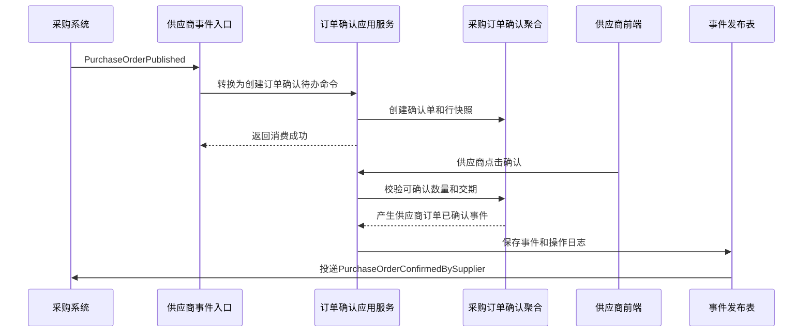
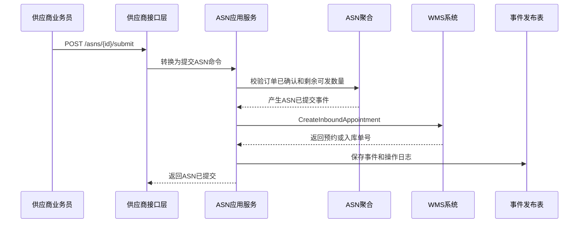
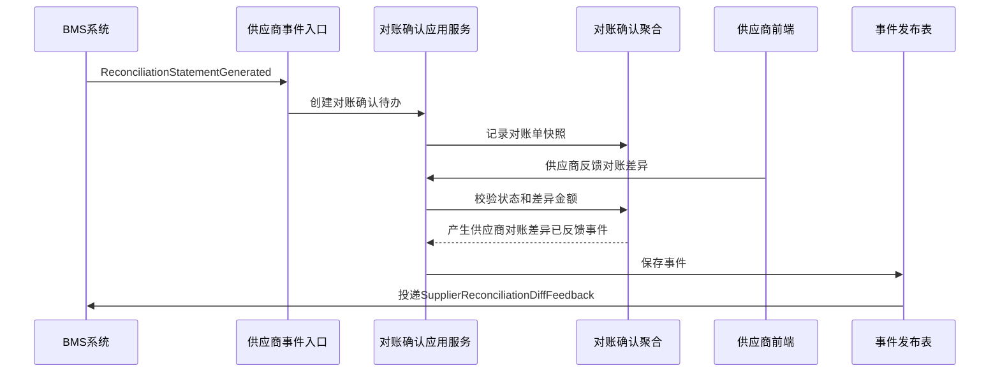

# 01-供应商系统接口设计

> 本文根据 [供应商领域模型](../03-核心业务模型/01-供应商领域模型/01-供应商领域模型.md)、[01-供应商系统产品功能设计](../04-子系统功能设计/01-供应商系统/01-供应商系统产品功能设计.md)、[01-供应商系统数据库设计](../05-子系统数据库设计/01-供应商系统数据库设计.md) 和 [上下文映射与领域事件目录](./00-上下文映射与领域事件目录.md) 设计。接口按 DDD + CQRS 口径拆分：查询接口读取读模型，命令接口触发应用服务和聚合行为，跨系统接口遵守命令/事件边界。

## 1. 设计范围

| 类型      | 范围                                                                     | 说明                     |
| ------- | ---------------------------------------------------------------------- | ---------------------- |
| 前端页面接口  | 供应商工作台、供应商档案、账号绑定、供应商商品、采购订单协同、ASN、退供协同、对账协同、质量协同、评分、评分规则、整改、操作日志、枚举配置 | 面向供应商门户和内部采购/质量/经理后台   |
| 跨系统命令接口 | 采购 -> 供应商、供应商 -> WMS/采购/BMS、供应商 -> 权限/主数据                              | 同步请求对方系统执行动作或查询读模型     |
| 跨系统事件接口 | 采购 -> 供应商、WMS -> 供应商、BMS -> 供应商、主数据 -> 供应商、供应商 -> 采购/BMS/WMS           | 异步传递已经发生的业务事实          |
| 不包含     | 采购订单审批、仓内收货质检作业、库存扣减、BMS 计费引擎                                          | 这些由采购、WMS、库存、BMS 上下文拥有 |

## 2. DDD 对齐说明

| DDD 关注点 | 本文口径 |
| --- | --- |
| 限界上下文 | 供应商上下文 |
| 核心聚合 | 供应商、供应商商品、供应商报价、供应商合同、采购订单确认、ASN、质量问题、供应商评分、供应商对账确认、退供应商单 |
| 查询模型 | 工作台待办、供应商档案快照、订单确认列表、ASN 列表、退供协同、对账协同、质量整改、评分看板、操作日志 |
| 命令接口 | 绑定账号、维护供货关系、确认/拒绝采购订单、反馈差异、创建/提交/取消 ASN、确认退供、上传发票、提交整改、计算/发布评分 |
| 领域事件 | 供应商订单已确认、供应商订单差异已反馈、ASN已提交、ASN已发货、供应商整改已提交、供应商评分已发布、供应商对账差异已反馈等 |
| 数据主权 | 01-供应商系统拥有供应商协同事实；供应商基础主档通常由08-主数据系统拥有，采购订单由采购拥有，仓内作业由 WMS 拥有，对账单由 BMS 拥有 |
| 幂等规则 | 所有写接口必须携带 `X-Idempotency-Key`；跨系统事件消费以 `sourceContext + eventId + aggregateId` 幂等 |

## 3. 通用协议

### 3.1 基础路径

| 场景 | 基础路径 |
| --- | --- |
| 前端页面接口 | `/api/supplier/v1` |
| 跨系统开放命令接口 | `/openapi/supplier/v1` |
| 事件回调/事件消费入口 | `/internal/supplier/v1/events` |

### 3.2 通用请求头

| 请求头 | 必填 | 适用接口 | 说明 |
| --- | --- | --- | --- |
| `Authorization` | 是 | 前端接口 | `Bearer access_token`，由09-权限系统签发 |
| `X-Tenant-Id` | 否 | 全部 | 租户 ID，单租户可不传 |
| `X-Org-Id` | 是 | 全部 | 当前组织 ID，用于内部用户数据权限 |
| `X-Supplier-Id` | 外部供应商用户必填 | 供应商门户接口 | 当前登录用户绑定的供应商主体 ID，通常由后端从 Token 解析，不允许前端伪造 |
| `X-Request-Id` | 是 | 全部 | 请求链路 ID |
| `X-Trace-Id` | 否 | 全部 | 分布式链路追踪 ID |
| `X-Idempotency-Key` | 写接口必填 | 命令接口、跨系统命令 | 同一业务动作唯一 |
| `X-Source-System` | 跨系统必填 | 跨系统命令、事件入口 | `SUPPLIER`、`PURCHASE`、`WMS`、`MDM`、`IAM`、`BMS` |
| `X-Operator-Id` | 写接口必填 | 命令接口 | 操作人；系统任务传系统账号 |
| `X-Data-Scope` | 否 | 前端查询 | 网关或权限中间件解析后的数据范围摘要 |
| `Accept-Language` | 否 | 全部 | `zh-CN` 默认 |

### 3.3 通用响应结构

```json
{
  "success": true,
  "code": "SUCCESS",
  "message": "处理成功",
  "requestId": "REQ202607040001",
  "traceId": "TRACE202607040001",
  "timestamp": "2026-07-04T10:00:00+08:00",
  "data": {}
}
```

分页响应：

```json
{
  "success": true,
  "code": "SUCCESS",
  "message": "查询成功",
  "data": {
    "pageNo": 1,
    "pageSize": 20,
    "total": 128,
    "records": []
  }
}
```

命令响应：

```json
{
  "success": true,
  "code": "SUCCESS",
  "message": "命令已处理",
  "data": {
    "aggregateId": "190001",
    "businessNo": "ASN202607040001",
    "status": 2,
    "statusName": "已提交",
    "version": 3,
    "eventId": "EVT202607040001",
    "idempotentHit": false
  }
}
```

### 3.4 HTTP 状态码

| HTTP 状态码 | 场景 | 前端处理 |
| --- | --- | --- |
| `200` | 查询成功、命令同步处理成功 | 正常刷新页面 |
| `201` | 新增成功 | 跳转详情或继续编辑 |
| `202` | 命令已受理，异步处理 | 展示处理中，轮询任务或等待事件 |
| `204` | 关闭/取消后无返回体 | 返回列表或刷新详情 |
| `400` | 请求格式错误、字段类型错误 | 表单提示 |
| `401` | 未登录、Token 过期 | 跳转登录或刷新 Token |
| `403` | 无菜单/按钮/数据权限 | 隐藏按钮或弹出无权限 |
| `404` | 单据不存在或无数据权限导致不可见 | 提示记录不存在 |
| `409` | 乐观锁冲突、幂等内容不一致、状态机冲突 | 提示刷新后重试 |
| `422` | 业务规则不通过 | 展示业务原因，如超出可发货数量、状态不可确认 |
| `429` | 请求过于频繁 | 稍后重试 |
| `500` | 系统异常 | 记录错误并提示稍后重试 |

### 3.5 业务错误码

| 业务码 | HTTP | 含义 |
| --- | --- | --- |
| `SUCCESS` | `200/201` | 成功 |
| `ACCEPTED` | `202` | 已受理异步处理 |
| `VALIDATION_FAILED` | `400` | 字段校验失败 |
| `UNAUTHORIZED` | `401` | 未认证 |
| `FORBIDDEN` | `403` | 无权限 |
| `SUPPLIER_SCOPE_DENIED` | `403` | 当前用户未绑定该供应商 |
| `NOT_FOUND` | `404` | 资源不存在 |
| `VERSION_CONFLICT` | `409` | 乐观锁版本冲突 |
| `IDEMPOTENCY_CONFLICT` | `409` | 同一幂等键请求内容不一致 |
| `STATE_CONFLICT` | `409` | 当前状态不允许该命令 |
| `BUSINESS_RULE_FAILED` | `422` | 领域规则不通过 |
| `EXTERNAL_CALL_FAILED` | `422/500` | 跨系统调用失败 |
| `SYSTEM_ERROR` | `500` | 系统异常 |

## 4. 通用对象字段

### 4.1 分页查询字段

| 字段 | 类型 | 必填 | 说明 |
| --- | --- | --- | --- |
| `pageNo` | int | 是 | 页码，从 1 开始 |
| `pageSize` | int | 是 | 每页条数，支持 10、20、50 |
| `sortField` | string | 否 | 排序字段，如 `updatedAt`、`createdAt`、`status`、`amount` |
| `sortOrder` | string | 否 | `asc`、`desc`，默认 `desc` |

### 4.2 状态时间线字段

| 字段 | 类型 | 说明 |
| --- | --- | --- |
| `nodeCode` | string | 状态节点编码 |
| `nodeName` | string | 状态节点名称 |
| `status` | int | 1 未开始，2 进行中，3 已完成，4 已驳回/异常 |
| `operatorId` | string | 操作人 ID |
| `operatorName` | string | 操作人名称 |
| `occurredAt` | datetime | 发生时间 |
| `remark` | string | 备注 |

### 4.3 供应商用户数据隔离

| 用户类型 | 数据范围规则 |
| --- | --- |
| 外部供应商业务员 | 只能查看和操作自己绑定供应商的订单确认、ASN、退供、质量整改 |
| 外部供应商财务 | 只能查看和操作自己绑定供应商的对账、发票、结算资料 |
| 外部供应商质量 | 只能查看和操作自己绑定供应商的质量问题、整改、资质资料 |
| 内部采购/质量/经理 | 按组织、采购范围、供应商授权、部门/本人范围过滤 |
| 系统管理员 | 按授权组织和系统配置范围过滤，不默认拥有所有供应商数据 |

## 5. 前端页面接口

### 5.1 供应商工作台

| 接口 | 方法 | 路径 | 页面调用位置 | 权限点 | 说明 |
| --- | --- | --- | --- | --- | --- |
| 查询工作台统计 | `GET` | `/api/supplier/v1/workbench/summary` | 供应商工作台顶部统计卡片 | `supplier:workbench:read` | 查询待确认订单、待发货 ASN、待处理退供、待确认对账、质量问题数量 |
| 查询待办列表 | `GET` | `/api/supplier/v1/workbench/todos` | 供应商工作台待办表格 | `supplier:workbench:read` | 查询当前用户可处理的供应商待办 |

请求字段：

| 字段 | 类型 | 必填 | 说明 |
| --- | --- | --- | --- |
| `todoType` | string | 否 | `PO_CONFIRM`、`ASN_SHIP`、`RETURN_CONFIRM`、`RECON_CONFIRM`、`QUALITY_RECTIFICATION` |
| `supplierId` | string | 内部用户可选 | 外部用户由 Token 自动限定 |
| `createdFrom/createdTo` | datetime | 否 | 创建时间范围 |
| `pageNo/pageSize` | int | 列表必填 | 分页 |

响应字段：

| 字段 | 类型 | 说明 |
| --- | --- | --- |
| `pendingPoConfirmCount` | int | 待确认订单数 |
| `pendingAsnCount` | int | 待发货 ASN 数 |
| `pendingReturnCount` | int | 待处理退供数 |
| `pendingReconCount` | int | 待确认对账数 |
| `qualityIssueCount` | int | 质量问题数 |
| `records[].todoId` | string | 待办 ID |
| `records[].businessType` | string | 业务类型 |
| `records[].businessNo` | string | 单号 |
| `records[].title` | string | 待办标题 |
| `records[].statusName` | string | 状态名称 |
| `records[].targetRoute` | string | 点击后进入的页面路由 |

状态码：`200`、`401`、`403`、`500`。

### 5.2 供应商档案页

| 接口 | 方法 | 路径 | 页面调用位置 | 权限点 | 领域动作 |
| --- | --- | --- | --- | --- | --- |
| 查询供应商档案 | `GET` | `/api/supplier/v1/profile` | 供应商档案页打开时 | `supplier:profile:read` | 查询主数据快照 |
| 查询资料变更记录 | `GET` | `/api/supplier/v1/profile/change-requests` | 档案页变更记录页签 | `supplier:profile:read` | 查询读模型 |
| 申请资料变更 | `POST` | `/api/supplier/v1/profile/change-requests` | 档案页“申请资料变更” | `supplier:supplier_profile:change` | 申请供应商资料变更 |
| 撤回资料变更 | `POST` | `/api/supplier/v1/profile/change-requests/{changeRequestId}/withdraw` | 变更详情“撤回” | `supplier:supplier_profile:change` | 撤回资料变更 |

查询请求字段：`supplierId` 内部用户可传；外部用户由 Token 自动绑定。

申请资料变更请求字段：

| 字段 | 类型 | 必填 | 说明 |
| --- | --- | --- | --- |
| `changeReason` | string | 是 | 变更原因 |
| `changedFields[]` | array | 是 | 变更字段 |
| `changedFields[].fieldCode` | string | 是 | 字段编码 |
| `changedFields[].beforeValue` | string/object | 是 | 变更前值 |
| `changedFields[].afterValue` | string/object | 是 | 变更后值 |
| `attachments[]` | array | 否 | 资质或证明附件 |
| `version` | int | 是 | 档案快照版本 |

响应字段：`supplierId`、`supplierCode`、`supplierName`、`supplierStatus`、`contacts[]`、`qualifications[]`、`settlementProfile`、`riskLevel`、`changeRequestId`、`version`。

成功事件：`供应商资料变更已提交`；审批通过后产生 `供应商资料变更已生效`。

状态码：`200`、`201`、`400`、`401`、`403`、`404`、`409`、`422`、`500`。

### 5.3 供应商账号绑定页

| 接口 | 方法 | 路径 | 页面调用位置 | 权限点 | 领域动作 |
| --- | --- | --- | --- | --- | --- |
| 查询绑定列表 | `GET` | `/api/supplier/v1/user-bindings` | 供应商账号绑定页列表 | `supplier:user_binding:read` | 查询绑定读模型 |
| 查询绑定详情 | `GET` | `/api/supplier/v1/user-bindings/{supplierUserId}` | 详情页打开时 | `supplier:user_binding:read` | 查询读模型 |
| 绑定供应商用户 | `POST` | `/api/supplier/v1/user-bindings` | 账号绑定页“绑定” | `supplier:user_binding:bind` | 绑定供应商用户 |
| 解绑供应商用户 | `POST` | `/api/supplier/v1/user-bindings/{supplierUserId}/unbind` | 行内“解绑” | `supplier:user_binding:unbind` | 解绑供应商用户 |
| 启用绑定 | `POST` | `/api/supplier/v1/user-bindings/{supplierUserId}/enable` | 行内“启用” | `supplier:supplier:enable` | 启用绑定 |
| 停用绑定 | `POST` | `/api/supplier/v1/user-bindings/{supplierUserId}/disable` | 行内“停用” | `supplier:supplier:disable` | 停用绑定 |

查询请求字段：`supplierId`、`keyword`、`bindingRole`、`status`、`isPrimary`、`pageNo/pageSize/sortField/sortOrder`。

绑定请求字段：

| 字段 | 类型 | 必填 | 说明 |
| --- | --- | --- | --- |
| `supplierId` | string | 是 | 供应商 ID |
| `userId` | string | 是 | 09-权限系统用户 ID |
| `bindingRole` | int | 是 | `SUPPLIER_USER_ROLE`：1 业务，2 财务，3 质量，4 管理员 |
| `isPrimary` | boolean | 是 | 是否主账号 |
| `remark` | string | 否 | 备注 |

命令请求字段：解绑/启停传 `reason`、`version`。

响应字段：`supplierUserId`、`supplierId/supplierName`、`userId/userName/mobile/email`、`bindingRole/roleName`、`isPrimary`、`status/statusName`、`boundAt`、`unboundAt`、`version`。

状态码：`200`、`201`、`400`、`401`、`403`、`404`、`409`、`422`、`500`。

### 5.4 供应商商品页

| 接口 | 方法 | 路径 | 页面调用位置 | 权限点 | 领域动作 |
| --- | --- | --- | --- | --- | --- |
| 查询供应商商品列表 | `GET` | `/api/supplier/v1/items` | 供应商商品页查询、分页、排序 | `supplier:sku:read` | 查询读模型 |
| 查询供应商商品详情 | `GET` | `/api/supplier/v1/items/{supplierItemId}` | 详情页打开时 | `supplier:sku:read` | 查询读模型 |
| 维护供应商 SKU | `PUT` | `/api/supplier/v1/items/{supplierItemId}` | 行内“维护供应商 SKU” | `supplier:supplierproduct:supplier_sku` | 变更供货条件 |
| 申请供货关系变更 | `POST` | `/api/supplier/v1/items/{supplierItemId}/change-requests` | 行内“申请变更” | `supplier:supplierproduct:change` | 申请变更供货条件 |
| 暂停供货 | `POST` | `/api/supplier/v1/items/{supplierItemId}/pause` | 内部用户行内操作 | `supplier:supplierproduct:pause` | 暂停供应商商品 |
| 恢复供货 | `POST` | `/api/supplier/v1/items/{supplierItemId}/resume` | 内部用户行内操作 | `supplier:supplierproduct:resume` | 恢复供应商商品 |

查询请求字段：

| 字段 | 类型 | 必填 | 说明 |
| --- | --- | --- | --- |
| `supplierId` | string | 内部用户可选 | 外部用户自动限定 |
| `skuCode` | string | 否 | 内部 SKU 编码 |
| `supplierSkuCode` | string | 否 | 供应商商品编码 |
| `supplyStatus` | int | 否 | `SUPPLY_STATUS`：1 可供，2 暂停，3 停供 |
| `pageNo/pageSize/sortField/sortOrder` | mixed | 是 | 分页排序 |

维护请求字段：

| 字段 | 类型 | 必填 | 说明 |
| --- | --- | --- | --- |
| `supplierSkuCode` | string | 否 | 供应商商品编码 |
| `moq` | decimal(18,4) | 否 | 最小起订量 |
| `mpq` | decimal(18,4) | 否 | 最小包装量 |
| `leadTimeDays` | int | 否 | 供货周期 |
| `effectiveFrom/effectiveTo` | date | 否 | 生效/失效日期 |
| `changeReason` | string | 否 | 变更原因 |
| `version` | int | 是 | 乐观锁版本 |

响应字段：`supplierItemId`、`supplierId/supplierName`、`skuId/skuCode/skuName`、`supplierSkuCode`、`moq`、`mpq`、`leadTimeDays`、`supplyStatus/statusName`、`effectiveFrom`、`effectiveTo`、`version`。

成功事件：`供应商商品供货条件已变更`、`供应商商品已暂停`、`供应商商品已恢复`、`供应商商品已停供`。

状态码：`200`、`201`、`400`、`401`、`403`、`404`、`409`、`422`、`500`。

### 5.5 采购订单协同页

| 接口 | 方法 | 路径 | 页面调用位置 | 权限点 | 领域动作 |
| --- | --- | --- | --- | --- | --- |
| 查询订单确认列表 | `GET` | `/api/supplier/v1/po-confirms` | 采购订单协同页查询、分页、排序 | `supplier:po_confirm:read` | 查询读模型 |
| 查询订单确认详情 | `GET` | `/api/supplier/v1/po-confirms/{confirmId}` | 详情页打开时 | `supplier:po_confirm:read` | 查询读模型 |
| 确认采购订单 | `POST` | `/api/supplier/v1/po-confirms/{confirmId}/confirm` | 行内/详情“确认” | `supplier:purchase_order:confirm` | 确认采购订单 |
| 拒绝采购订单 | `POST` | `/api/supplier/v1/po-confirms/{confirmId}/reject` | 行内/详情“拒绝” | `supplier:purchase_order:reject` | 拒绝采购订单 |
| 反馈订单差异 | `POST` | `/api/supplier/v1/po-confirms/{confirmId}/feedback-diff` | 行内/详情“反馈差异” | `supplier:purchase_order:feedback_diff` | 反馈数量/交期/价格差异 |
| 修改承诺交期 | `POST` | `/api/supplier/v1/po-confirms/{confirmId}/change-delivery-date` | 详情页行级操作 | `supplier:purchase_order:change_delivery` | 修改承诺交期 |

查询请求字段：`purchaseOrderNo`、`skuCode`、`confirmStatus`、`lineStatus`、`supplierId`、`pageNo/pageSize/sortField/sortOrder`。

命令请求字段：

| 命令 | 字段 | 类型 | 必填 | 说明 |
| --- | --- | --- | --- | --- |
| 确认 | `lines[].orderLineId` | string | 是 | 订单行 ID |
| 确认 | `lines[].confirmedQty` | decimal(18,4) | 是 | 确认数量 |
| 确认 | `lines[].confirmedDeliveryDate` | date | 是 | 确认交期 |
| 拒绝 | `reasonCode` | int/string | 是 | 拒绝原因 |
| 反馈差异 | `diffType` | int | 是 | `PO_DIFF_TYPE`：1 数量，2 交期，3 价格，4 其他 |
| 反馈差异 | `diffLines[]` | array | 是 | 差异行 |
| 修改交期 | `newDeliveryDate` | date | 是 | 新承诺交期 |
| 全部 | `remark` | string | 否 | 备注 |
| 全部 | `version` | int | 是 | 乐观锁版本 |

响应字段：`confirmId`、`confirmNo`、`purchaseOrderNo`、`confirmStatus/statusName`、`confirmDeadline`、`confirmedAt`、`diffType/typeName`、`lines[]`、`statusTimeline[]`、`version`。

成功事件：`供应商订单已确认`、`供应商订单已拒绝`、`供应商订单差异已反馈`、`供应商承诺交期已变更`。

状态码：`200`、`400`、`401`、`403`、`404`、`409`、`422`、`500`。

### 5.6 ASN 管理页

| 接口 | 方法 | 路径 | 页面调用位置 | 权限点 | 领域动作 |
| --- | --- | --- | --- | --- | --- |
| 查询 ASN 列表 | `GET` | `/api/supplier/v1/asns` | ASN 管理页查询、分页、排序 | `supplier:asn:read` | 查询读模型 |
| 查询 ASN 详情 | `GET` | `/api/supplier/v1/asns/{asnId}` | 详情页打开时 | `supplier:asn:read` | 查询读模型 |
| 创建 ASN | `POST` | `/api/supplier/v1/asns` | 新增页保存草稿 | `supplier:asn:create` | 创建 ASN 草稿 |
| 修改 ASN | `PUT` | `/api/supplier/v1/asns/{asnId}` | 修改页保存 | `supplier:asn:update` | 修改 ASN |
| 提交 ASN | `POST` | `/api/supplier/v1/asns/{asnId}/submit` | 行内/详情“提交” | `supplier:asn:submit` | 提交 ASN |
| 取消 ASN | `POST` | `/api/supplier/v1/asns/{asnId}/cancel` | 行内“取消” | `supplier:asn:cancel` | 取消 ASN |
| 确认发货 | `POST` | `/api/supplier/v1/asns/{asnId}/ship` | 详情页“确认发货” | `supplier:asn:ship` | 确认发货 |
| 打印 ASN | `GET` | `/api/supplier/v1/asns/{asnId}/print-template` | 行内“打印” | `supplier:asn:print` | 获取打印数据 |

查询请求字段：`asnNo`、`purchaseOrderNo`、`asnStatus`、`carrierName`、`trackingNo`、`etaFrom/etaTo`、`pageNo/pageSize/sortField/sortOrder`。

创建/修改请求字段：

| 字段 | 类型 | 必填 | 说明 |
| --- | --- | --- | --- |
| `purchaseOrderConfirmId` | string | 是 | 采购订单确认 ID |
| `purchaseOrderNo` | string | 是 | PO 单号 |
| `eta` | datetime | 是 | 预计到仓时间 |
| `shipAt` | datetime | 否 | 计划发货时间 |
| `carrierName` | string | 否 | 承运商 |
| `trackingNo` | string | 否 | 运单号 |
| `lines[].orderLineId` | string | 是 | PO 行 ID |
| `lines[].skuCode/skuName` | string | 是 | SKU 快照 |
| `lines[].plannedQty` | decimal(18,4) | 是 | 计划发货数量，不能超过剩余可发数量 |
| `lines[].batchNo` | string | 否 | 批次号 |
| `lines[].productionDate/expireDate` | date | 否 | 生产/失效日期 |
| `version` | int | 修改必填 | 乐观锁版本 |

命令请求字段：提交传 `submitRemark`；取消传 `cancelReason`；发货传 `shipAt`、`carrierName`、`trackingNo`、`version`。

响应字段：`asnId`、`asnNo`、`purchaseOrderNo`、`eta`、`shipAt`、`carrierName`、`trackingNo`、`asnStatus/statusName`、`lines[]`、`receivedSummary`、`statusTimeline[]`、`version`。

成功事件：`ASN已创建`、`ASN已提交`、`ASN已修改`、`ASN已取消`、`ASN已发货`。

状态码：`200`、`201`、`400`、`401`、`403`、`404`、`409`、`422`、`500`。

### 5.7 退供协同页

| 接口 | 方法 | 路径 | 页面调用位置 | 权限点 | 领域动作 |
| --- | --- | --- | --- | --- | --- |
| 查询退供协同列表 | `GET` | `/api/supplier/v1/returns` | 退供协同页查询、分页、排序 | `supplier:return:read` | 查询读模型 |
| 查询退供协同详情 | `GET` | `/api/supplier/v1/returns/{supplierReturnId}` | 详情页打开时 | `supplier:return:read` | 查询读模型 |
| 确认退供 | `POST` | `/api/supplier/v1/returns/{supplierReturnId}/confirm` | 行内/详情“确认” | `supplier:supplier_return:confirm` | 供应商确认退货 |
| 拒绝退供 | `POST` | `/api/supplier/v1/returns/{supplierReturnId}/reject` | 行内/详情“拒绝” | `supplier:supplier_return:reject` | 拒绝退供 |
| 签收退供 | `POST` | `/api/supplier/v1/returns/{supplierReturnId}/sign` | 行内/详情“签收” | `supplier:supplier_return:sign` | 签收退供 |
| 反馈退供差异 | `POST` | `/api/supplier/v1/returns/{supplierReturnId}/feedback-diff` | 行内/详情“反馈差异” | `supplier:supplier_return:feedback_diff` | 反馈签收差异 |

查询请求字段：`returnConfirmNo`、`sourceReturnNo`、`skuCode`、`returnStatus`、`pageNo/pageSize/sortField/sortOrder`。

命令请求字段：

| 命令 | 字段 | 类型 | 必填 | 说明 |
| --- | --- | --- | --- | --- |
| 确认 | `returnAddress` | string | 否 | 退货地址 |
| 确认 | `confirmedQty` | decimal(18,4) | 是 | 确认接收数量 |
| 拒绝 | `rejectReason` | string | 是 | 拒绝原因 |
| 签收 | `signedQty` | decimal(18,4) | 是 | 签收数量 |
| 反馈差异 | `diffReason` | string | 是 | 差异原因 |
| 全部 | `version` | int | 是 | 乐观锁版本 |

响应字段：`supplierReturnId`、`returnConfirmNo`、`sourceReturnNo`、`returnStatus/statusName`、`returnAddress`、`confirmedQty`、`signedQty`、`diffReason`、`confirmedAt`、`signedAt`、`version`。

成功事件：`供应商已确认退货`、`供应商退供差异已反馈`、`供应商已签收`。

状态码：`200`、`400`、`401`、`403`、`404`、`409`、`422`、`500`。

### 5.8 对账协同页

| 接口 | 方法 | 路径 | 页面调用位置 | 权限点 | 领域动作 |
| --- | --- | --- | --- | --- | --- |
| 查询对账列表 | `GET` | `/api/supplier/v1/reconciliations` | 对账协同页查询、分页、排序 | `supplier:recon:read` | 查询读模型 |
| 查询对账详情 | `GET` | `/api/supplier/v1/reconciliations/{reconcileId}` | 详情页打开时 | `supplier:recon:read` | 查询读模型 |
| 确认对账 | `POST` | `/api/supplier/v1/reconciliations/{reconcileId}/confirm` | 行内/详情“确认” | `supplier:reconcile:confirm` | 供应商确认对账 |
| 反馈对账差异 | `POST` | `/api/supplier/v1/reconciliations/{reconcileId}/feedback-diff` | 行内/详情“反馈差异” | `supplier:reconcile:feedback_diff` | 反馈对账差异 |
| 撤回对账差异 | `POST` | `/api/supplier/v1/reconciliations/{reconcileId}/withdraw-diff` | 详情页“撤回差异” | `supplier:reconcile:feedback_diff` | 撤回差异 |
| 上传发票 | `POST` | `/api/supplier/v1/reconciliations/{reconcileId}/invoices` | 行内/详情“上传发票” | `supplier:reconcile:invoice` | 提交发票资料 |

查询请求字段：`reconciliationNo`、`confirmStatus`、`invoiceNo`、`amountFrom/amountTo`、`pageNo/pageSize/sortField/sortOrder`。

命令请求字段：

| 命令 | 字段 | 类型 | 必填 | 说明 |
| --- | --- | --- | --- | --- |
| 确认 | `confirmComment` | string | 否 | 确认说明 |
| 反馈差异 | `diffAmount` | decimal(18,2) | 是 | 差异金额 |
| 反馈差异 | `diffReason` | string | 是 | 差异原因 |
| 上传发票 | `invoiceNo` | string | 是 | 发票号 |
| 上传发票 | `invoiceAmount` | decimal(18,2) | 是 | 发票金额 |
| 上传发票 | `invoiceFileUrl` | string | 是 | 发票附件 |
| 全部 | `version` | int | 是 | 乐观锁版本 |

响应字段：`reconcileId`、`reconciliationNo`、`billAmount`、`taxAmount`、`diffAmount`、`confirmStatus/statusName`、`invoiceNo`、`invoiceFileUrl`、`confirmedAt`、`version`。

成功事件：`供应商对账已确认`、`供应商对账差异已反馈`、`供应商对账差异已撤回`、`供应商发票资料已提交`。

状态码：`200`、`201`、`400`、`401`、`403`、`404`、`409`、`422`、`500`。

### 5.9 质量协同页和整改管理页

| 接口 | 方法 | 路径 | 页面调用位置 | 权限点 | 领域动作 |
| --- | --- | --- | --- | --- | --- |
| 查询质量问题列表 | `GET` | `/api/supplier/v1/quality-issues` | 质量协同页查询、分页、排序 | `supplier:quality:read` | 查询质量问题读模型 |
| 查询质量问题详情 | `GET` | `/api/supplier/v1/quality-issues/{qualityId}` | 详情页打开时 | `supplier:quality:read` | 查询读模型 |
| 提交整改方案 | `POST` | `/api/supplier/v1/quality-issues/{qualityId}/rectification-submit` | 质量协同页“提交整改” | `supplier:quality:rectification_submit` | 提交整改方案 |
| 上传质量附件 | `POST` | `/api/supplier/v1/quality-issues/{qualityId}/attachments` | 质量协同页“上传附件” | `supplier:quality:upload_attachment` | 上传附件 |
| 查询整改列表 | `GET` | `/api/supplier/v1/rectifications` | 整改管理页列表 | `supplier:rectification:read` | 查询整改读模型 |
| 发起整改 | `POST` | `/api/supplier/v1/rectifications` | 整改管理页“发起” | `supplier:rectification:create` | 发起供应商整改 |
| 提交整改 | `POST` | `/api/supplier/v1/rectifications/{recordId}/submit` | 整改详情“提交” | `supplier:rectification:submit` | 提交整改 |
| 审核整改 | `POST` | `/api/supplier/v1/rectifications/{recordId}/review` | 整改详情“审核” | `supplier:rectification:approval` | 审核整改 |
| 关闭整改 | `POST` | `/api/supplier/v1/rectifications/{recordId}/close` | 整改详情“关闭” | `supplier:rectification:close` | 关闭整改 |

质量问题查询字段：`issueNo`、`sourceDocType`、`sourceDocNo`、`issueType`、`severity`、`issueStatus`、`supplierId`、`pageNo/pageSize`。

整改请求字段：

| 字段 | 类型 | 必填 | 说明 |
| --- | --- | --- | --- |
| `supplierId` | string | 内部发起必填 | 供应商 |
| `sourceType` | int | 发起必填 | `RECTIFICATION_SOURCE_TYPE`：1 评分预警，2 质量问题，3 人工发起 |
| `sourceDocNo` | string | 否 | 来源单号 |
| `issueDesc` | string | 是 | 问题描述 |
| `deadline` | datetime | 是 | 整改截止时间 |
| `rectificationPlan` | string | 提交必填 | 整改方案 |
| `attachments[]` | array | 否 | 附件 |
| `reviewResult` | string | 审核必填 | `APPROVE`、`REJECT` |
| `reviewComment` | string | 否 | 审核意见 |
| `closeReason` | string | 关闭必填 | 关闭原因 |
| `version` | int | 命令必填 | 乐观锁版本 |

响应字段：`qualityId`、`issueNo`、`recordId`、`rectificationNo`、`sourceType/typeName`、`issueStatus/statusName`、`rectificationStatus/statusName`、`deadline`、`submittedAt`、`reviewedAt`、`version`。

成功事件：`供应商质量问题已创建`、`供应商整改已发起`、`供应商整改已提交`、`供应商整改已通过`、`供应商整改已驳回`、`供应商整改已逾期`。

状态码：`200`、`201`、`400`、`401`、`403`、`404`、`409`、`422`、`500`。

### 5.10 供应商评分页和评分规则页

| 接口 | 方法 | 路径 | 页面调用位置 | 权限点 | 领域动作 |
| --- | --- | --- | --- | --- | --- |
| 查询评分列表 | `GET` | `/api/supplier/v1/scores` | 供应商评分页列表 | `supplier:score:read` | 查询评分读模型 |
| 查询评分详情 | `GET` | `/api/supplier/v1/scores/{supplierScoreId}` | 详情页打开时 | `supplier:score:read` | 查询评分详情 |
| 发起评分重算 | `POST` | `/api/supplier/v1/scores/recalculate` | 评分页“发起重算” | `supplier:supplier_score:recalculate` | 重算周期评分 |
| 人工修正评分 | `POST` | `/api/supplier/v1/scores/{supplierScoreId}/adjust` | 评分详情“人工修正” | `supplier:supplier_score:adjust` | 修正评分 |
| 发布评分 | `POST` | `/api/supplier/v1/scores/{supplierScoreId}/publish` | 评分详情“发布” | `supplier:supplier_score:publish` | 发布评分 |
| 导出评分 | `POST` | `/api/supplier/v1/scores/export` | 评分页“导出” | `supplier:supplier_score:export` | 创建导出任务 |
| 查询评分规则 | `GET` | `/api/supplier/v1/score-rules` | 评分规则页列表 | `supplier:score_rule:read` | 查询规则 |
| 新增评分规则 | `POST` | `/api/supplier/v1/score-rules` | 评分规则页新增 | `supplier:score_rule:create` | 新增规则 |
| 修改评分规则 | `PUT` | `/api/supplier/v1/score-rules/{scoreRuleId}` | 评分规则页编辑 | `supplier:score_rule:update` | 修改规则 |
| 启停评分规则 | `POST` | `/api/supplier/v1/score-rules/{scoreRuleId}/toggle` | 行内“启停” | `supplier:score_rule:toggle` | 启用或停用 |
| 发布评分规则 | `POST` | `/api/supplier/v1/score-rules/{scoreRuleId}/publish` | 行内“发布” | `supplier:score_rule:release` | 发布规则 |

评分查询字段：`supplierId`、`scorePeriod`、`periodType`、`scoreLevel`、`scoreStatus`、`pageNo/pageSize`。

评分命令字段：

| 命令 | 字段 | 类型 | 必填 | 说明 |
| --- | --- | --- | --- | --- |
| 重算 | `supplierIds[]` | array | 否 | 不传则按周期全量重算 |
| 重算 | `scorePeriod` | string | 是 | 评分周期 |
| 重算 | `periodType` | int | 是 | `SCORE_PERIOD_TYPE`：1 月度，2 季度，3 半年，4 年度 |
| 修正 | `adjustLines[]` | array | 是 | 修正维度 |
| 修正 | `adjustReason` | string | 是 | 修正原因 |
| 发布 | `publishRemark` | string | 否 | 发布说明 |
| 全部 | `version` | int | 按单操作必填 | 乐观锁版本 |

评分规则字段：

| 字段 | 类型 | 必填 | 说明 |
| --- | --- | --- | --- |
| `ruleCode` | string | 是 | 规则编码 |
| `dimension` | int | 是 | `SCORE_DIMENSION`：1 质量，2 价格，3 交付，4 响应，5 异常 |
| `weight` | decimal(5,2) | 是 | 权重 |
| `formulaType` | int | 是 | `SCORE_FORMULA_TYPE`：1 阈值，2 比例，3 扣分，4 人工 |
| `formulaConfig` | object | 是 | 公式配置 |
| `warningThreshold` | decimal(5,2) | 否 | 预警阈值 |
| `effectiveFrom/effectiveTo` | date | 是/否 | 有效期 |
| `version` | int | 修改/命令必填 | 乐观锁版本 |

响应字段：`supplierScoreId`、`supplierId/supplierName`、`scorePeriod`、`periodType/typeName`、`totalScore`、`scoreLevel`、`scoreStatus/statusName`、`scoreLines[]`、`warningReason`、`calculatedAt`、`manualAdjusted`、`version`。

成功事件：`供应商绩效事实已采集`、`供应商评分已计算`、`供应商评分已修正`、`供应商评分已发布`、`供应商冻结建议已生成`。

状态码：`200`、`201`、`202`、`400`、`401`、`403`、`404`、`409`、`422`、`500`。

### 5.11 操作日志和枚举配置

| 接口 | 方法 | 路径 | 页面调用位置 | 权限点 | 说明 |
| --- | --- | --- | --- | --- | --- |
| 查询操作日志 | `GET` | `/api/supplier/v1/operation-logs` | 操作日志页列表、详情页日志区域 | `supplier:operation_log:read` | 查询操作日志 |
| 导出操作日志 | `POST` | `/api/supplier/v1/operation-logs/export` | 操作日志页顶部“导出” | `supplier:operation_log:export` | 创建导出任务 |
| 查询枚举项 | `GET` | `/api/supplier/v1/enums` | 枚举配置页、各页面下拉框 | `supplier:enum:read` | 查询枚举项 |
| 新增枚举项 | `POST` | `/api/supplier/v1/enums` | 枚举配置页新增 | `supplier:enumsettings:create` | 新增可配置枚举 |
| 修改枚举项 | `PUT` | `/api/supplier/v1/enums/{enumItemId}` | 枚举配置页编辑 | `supplier:enumsettings:update` | 修改标签、颜色、排序 |
| 停用枚举项 | `POST` | `/api/supplier/v1/enums/{enumItemId}/disable` | 行内“停用” | `supplier:enumsettings:disable` | 停用非核心枚举 |

操作日志查询字段：`supplierId`、`operatorId`、`businessType`、`businessNo`、`action`、`result`、`createdFrom`、`createdTo`、`pageNo/pageSize`。

操作日志响应字段：`logId`、`operatorId/operatorName`、`supplierId/supplierName`、`businessType`、`businessNo`、`action`、`requestSummary`、`beforeSnapshot`、`afterSnapshot`、`result`、`failureReason`、`createdAt`。

枚举查询字段：`enumType`、`enabledOnly`。

枚举响应字段：`enumType`、`value`、`label`、`sortNo`、`status`、`color`。

状态码：`200`、`201`、`202`、`400`、`401`、`403`、`404`、`409`、`422`、`500`。

## 6. 跨系统命令接口

### 6.1 采购调用01-供应商系统：发布采购订单

```text
POST /openapi/supplier/v1/purchase-orders
```

调用时机：采购订单审批通过并发布给供应商。

供应商侧处理：创建 `sup_order` 和 `sup_order_line`，生成采购订单确认待办。

请求头：`X-Source-System=PURCHASE`、`X-Idempotency-Key=PURCHASE:{purchaseOrderNo}:PUBLISH:{version}`。

请求字段：

| 字段 | 类型 | 必填 | 说明 |
| --- | --- | --- | --- |
| `purchaseOrderId` | string | 是 | 采购订单 ID |
| `purchaseOrderNo` | string | 是 | 采购订单号 |
| `supplierId/supplierCode/supplierName` | string | 是 | 供应商快照 |
| `confirmDeadline` | datetime | 否 | 确认截止时间 |
| `currency` | int | 是 | 币种 |
| `amounts.taxExcludedAmount` | decimal(18,2) | 是 | 未税金额 |
| `amounts.taxAmount` | decimal(18,2) | 是 | 税额 |
| `amounts.taxIncludedAmount` | decimal(18,2) | 是 | 含税金额 |
| `lines[].purchaseOrderLineId` | string | 是 | 采购订单行 ID |
| `lines[].skuId/skuCode/skuName` | string | 是 | SKU 快照 |
| `lines[].orderQty` | decimal(18,4) | 是 | 采购数量 |
| `lines[].requestedDeliveryDate` | date | 否 | 要求交期 |
| `lines[].unitPrice` | decimal(18,6) | 是 | 未税单价 |

响应字段：`confirmId`、`confirmNo`、`receiveStatus`、`supplierTodoId`、`message`。

状态码：`200`、`201`、`202`、`400`、`401`、`403`、`409`、`422`、`500`。

### 6.2 采购调用01-供应商系统：发布询价单

```text
POST /openapi/supplier/v1/rfqs
```

调用时机：02-采购系统发布询价单并邀请供应商报价。

供应商侧处理：创建供应商报价待办或报价草稿。

请求字段：`rfqId`、`rfqNo`、`rfqType`、`supplierIds[]`、`quoteDeadline`、`lines[].rfqLineId`、`lines[].skuCode`、`lines[].targetQty`、`lines[].requiredDeliveryDate`、`qualityRequirement`。

响应字段：`receiveStatus`、`createdQuoteTodoCount`、`message`。

状态码：`200`、`201`、`202`、`400`、`401`、`403`、`409`、`422`、`500`。

### 6.3 供应商调用02-采购系统：提交报价

```text
POST /openapi/purchase/v1/quotations
```

调用时机：供应商在报价协同页提交报价；也可以由01-供应商系统发布 `SupplierQuoteSubmitted` 事件，采购异步消费。

请求头：`X-Source-System=SUPPLIER`、`X-Idempotency-Key=SUPPLIER:{quotationNo}:SUBMIT:{version}`。

请求字段：`rfqId`、`rfqNo`、`supplierId`、`quotationNo`、`currency`、`validFrom`、`validTo`、`attachmentUrl`、`lines[].rfqLineId`、`lines[].quoteQty`、`unitPrice`、`taxRate`、`deliveryDays`、`moq`。

响应字段：`purchaseQuoteId`、`quotationNo`、`receiveStatus`、`message`。

状态码：`200`、`201`、`202`、`400`、`401`、`403`、`409`、`422`、`500`。

### 6.4 供应商调用02-采购系统：订单确认回传

```text
POST /openapi/purchase/v1/supplier-confirms
```

调用时机：供应商确认、拒绝或反馈采购订单差异。

请求头：`X-Source-System=SUPPLIER`、`X-Idempotency-Key=SUPPLIER:{purchaseOrderNo}:CONFIRM:{version}`。

请求字段：`purchaseOrderId`、`purchaseOrderNo`、`confirmNo`、`confirmResult`、`reasonCode`、`diffType`、`remark`、`lines[].purchaseOrderLineId`、`confirmedQty`、`confirmedDeliveryDate`、`diffReason`。

响应字段：`purchaseConfirmProcessId`、`receiveStatus`、`message`。

状态码：`200`、`201`、`202`、`400`、`401`、`403`、`409`、`422`、`500`。

### 6.5 供应商调用 WMS：预约收货/送货预告

```text
POST /openapi/wms/v1/inbound-appointments
```

调用时机：ASN 提交或确认发货后，需要 WMS 预约收货。第一版也可改为“供应商发布 ASN已提交事件，采购转发给 WMS”。

请求头：`X-Source-System=SUPPLIER`、`X-Idempotency-Key=SUPPLIER:{asnNo}:APPOINT:{version}`。

请求字段：`asnId`、`asnNo`、`purchaseOrderNo`、`supplierId/supplierName`、`warehouseId`、`eta`、`shipAt`、`carrierName`、`trackingNo`、`lines[].asnLineId`、`skuCode`、`plannedQty`、`batchNo`、`productionDate`、`expireDate`。

响应字段：`wmsAppointmentId`、`wmsInboundOrderNo`、`acceptStatus`、`rejectReason`。

状态码：`200`、`201`、`202`、`400`、`401`、`403`、`409`、`422`、`500`。

### 6.6 BMS 调用01-供应商系统：创建对账确认待办

```text
POST /openapi/supplier/v1/reconciliations
```

调用时机：BMS 生成供应商对账单后，通知供应商门户确认。

请求头：`X-Source-System=BMS`、`X-Idempotency-Key=BMS:{reconciliationNo}:CREATE_RECON:{version}`。

请求字段：`reconciliationId`、`reconciliationNo`、`supplierId`、`billAmount`、`taxAmount`、`periodFrom`、`periodTo`、`feeLines[]`、`attachments[]`。

响应字段：`reconcileId`、`receiveStatus`、`supplierTodoId`、`message`。

状态码：`200`、`201`、`202`、`400`、`401`、`403`、`409`、`422`、`500`。

### 6.7 供应商调用主数据和09-权限系统

| 目标系统 | 接口 | 调用时机 | 用途 |
| --- | --- | --- | --- |
| 权限系统 | `POST /openapi/iam/v1/tokens/validate` | 用户进入01-供应商系统、提交写操作前 | 校验登录态、角色、菜单、按钮、数据权限 |
| 权限系统 | `GET /openapi/iam/v1/users/me/permissions` | 登录后加载菜单 | 获取供应商门户菜单、按钮权限、绑定供应商 |
| 主数据系统 | `POST /openapi/mdm/v1/master-data/query` | 商品、供应商、仓库、单位、币种下拉框 | 查询启用主数据 |
| 主数据系统 | `GET /openapi/mdm/v1/suppliers/{supplierId}` | 档案页打开、写命令校验 | 查询供应商主档快照 |

## 7. 01-供应商系统事件发布

事件通过消息总线发布，也可通过 Outbox 表由集成服务投递。事件标准载荷遵守 [上下文映射与领域事件目录](./00-上下文映射与领域事件目录.md)。

| 事件 | 英文代码 | 触发接口/命令 | 主要消费者 | 关键载荷 |
| --- | --- | --- | --- | --- |
| 供应商资料变更已提交 | `SupplierProfileChangeSubmitted` | 申请资料变更 | 主数据、采购 | `supplierId`、`changedFields`、`attachments` |
| 供应商商品供货条件已变更 | `SupplierItemSupplyConditionChanged` | 维护供应商 SKU | 采购 | `supplierItemId`、`supplierId`、`skuId`、`before/after` |
| 供应商报价已提交 | `SupplierQuoteSubmitted` | 提交报价 | 采购、比价 | `quoteId`、`rfqId`、`supplierId`、`lines` |
| 供应商报价已采纳 | `SupplierQuoteAdopted` | 采纳报价 | 采购、合同、BMS | `quoteId`、`priceAgreementRef` |
| 供应商订单已确认 | `PurchaseOrderConfirmedBySupplier` | 确认采购订单 | 采购、WMS | `purchaseOrderId`、`confirmNo`、`confirmedLines` |
| 供应商订单已拒绝 | `PurchaseOrderRejectedBySupplier` | 拒绝采购订单 | 采购 | `purchaseOrderId`、`reasonCode` |
| 供应商订单差异已反馈 | `PurchaseOrderDiffFeedbackBySupplier` | 反馈订单差异 | 采购 | `purchaseOrderId`、`diffType`、`diffLines` |
| ASN已提交 | `AsnSubmitted` | 提交 ASN | 采购、WMS | `asnId`、`asnNo`、`purchaseOrderNo`、`lines` |
| ASN已发货 | `AsnShipped` | 确认发货 | 采购、WMS、BMS | `asnId`、`carrierName`、`trackingNo`、`shipAt` |
| 供应商整改已提交 | `SupplierRectificationSubmitted` | 提交整改 | 质量人员、评分 | `qualityIssueId`、`rectificationPlan` |
| 供应商评分已发布 | `SupplierScorePublished` | 发布评分 | 采购、供应商门户、供应商风险控制 | `supplierId`、`period`、`totalScore`、`scoreLevel` |
| 供应商对账差异已反馈 | `SupplierReconciliationDiffFeedback` | 反馈对账差异 | BMS、采购结算 | `reconcileId`、`diffAmount`、`diffReason` |
| 供应商发票资料已提交 | `SupplierInvoiceSubmitted` | 上传发票 | BMS | `reconcileId`、`invoiceNo`、`invoiceAmount`、`invoiceFileUrl` |
| 供应商已确认退货 | `SupplierReturnConfirmedBySupplier` | 确认退供 | 采购、WMS | `supplierReturnId`、`confirmedQty` |
| 供应商已签收 | `SupplierReturnSignedBySupplier` | 签收退供 | 采购、BMS、评分 | `supplierReturnId`、`signedQty`、`diffReason` |

## 8. 01-供应商系统事件消费

```text
POST /internal/supplier/v1/events
```

通用请求字段：

| 字段 | 类型 | 必填 | 说明 |
| --- | --- | --- | --- |
| `eventId` | string | 是 | 外部事件 ID |
| `eventType` | string | 是 | 事件类型 |
| `eventVersion` | string | 是 | 事件版本 |
| `sourceContext` | string | 是 | 来源上下文 |
| `aggregateType` | string | 是 | 来源聚合类型 |
| `aggregateId` | string | 是 | 来源聚合 ID |
| `businessKey` | string | 是 | 来源业务单号 |
| `idempotencyKey` | string | 是 | 事件幂等键 |
| `occurredAt` | datetime | 是 | 事件发生时间 |
| `payload` | object | 是 | 业务载荷 |

响应字段：`consumeId`、`consumeStatus`、`idempotentHit`、`message`。

状态码：`200`、`202`、`400`、`409`、`422`、`500`。

| 消费事件 | 来源系统 | 处理应用服务 | 消费后数据变化 | 幂等键 |
| --- | --- | --- | --- | --- |
| `SupplierEnabled` | 主数据 | 供应商事件消费服务 | 更新供应商档案快照，允许绑定账号和创建协同记录 | `MDM:{eventId}:{supplierId}` |
| `SupplierFrozen` | 主数据/评分 | 供应商状态消费服务 | 暂停报价、订单确认、ASN 新增，生成风险提示 | `MDM:{eventId}:{supplierId}` |
| `SupplierDisabled` | 主数据 | 供应商状态消费服务 | 禁止新增业务协同，保留历史查询 | `MDM:{eventId}:{supplierId}` |
| `SkuEnabled` | 主数据 | SKU 事件消费服务 | 允许创建供应商商品或报价 | `MDM:{eventId}:{skuId}` |
| `SkuDisabled` | 主数据 | SKU 事件消费服务 | 相关供应商商品自动暂停或生成停供待办 | `MDM:{eventId}:{skuId}` |
| `RfqPublished` | 采购 | 询价事件消费服务 | 创建供应商报价待办或草稿 | `PURCHASE:{eventId}:{rfqId}:{supplierId}` |
| `RfqBiddingClosed` | 采购 | 询价事件消费服务 | 未提交报价自动作废或禁止提交 | `PURCHASE:{eventId}:{rfqId}` |
| `PurchaseOrderPublished` | 采购 | 采购订单事件消费服务 | 创建采购订单确认待办和行快照 | `PURCHASE:{eventId}:{purchaseOrderId}` |
| `PurchaseOrderChangeEffective` | 采购 | 采购订单事件消费服务 | 更新订单行快照，已确认订单要求重新确认 | `PURCHASE:{eventId}:{purchaseOrderId}:{version}` |
| `PurchaseOrderCanceled` | 采购 | 采购订单事件消费服务 | 关闭确认记录，禁止 ASN 新增 | `PURCHASE:{eventId}:{purchaseOrderId}` |
| `InboundOrderReceived` | WMS | ASN 事件消费服务 | 更新 ASN 实收数量和收货状态 | `WMS:{eventId}:{receiptId}` |
| `InboundOrderInspected` | WMS | 质量事件消费服务 | 更新质检结果快照，必要时创建质量问题 | `WMS:{eventId}:{qcId}` |
| `InboundOrderPutawayCompleted` | WMS | ASN 事件消费服务 | 更新 ASN 上架完成状态和交付绩效事实 | `WMS:{eventId}:{putawayBatchNo}` |
| `ReconciliationStatementGenerated` | BMS | 对账事件消费服务 | 创建供应商对账确认待办 | `BMS:{eventId}:{reconciliationNo}` |
| `ReconciliationStatementAdjusted` | BMS | 对账事件消费服务 | 更新对账单快照，已确认时要求重新确认 | `BMS:{eventId}:{reconciliationNo}:{version}` |
| `InvoiceVerified` | BMS | 发票事件消费服务 | 更新发票校验状态，失败时进入待补充 | `BMS:{eventId}:{invoiceId}` |
| `PayableCompleted` | BMS | 应付事件消费服务 | 关闭对账确认，标记结算完成 | `BMS:{eventId}:{payableId}` |

## 9. 典型调用链路

### 9.1 采购订单确认



### 9.2 ASN 提交与 WMS 预约



### 9.3 对账差异反馈



## 10. 安全、幂等、审计和补偿

| 项 | 设计 |
| --- | --- |
| 认证 | 前端接口必须携带 `Authorization`，由网关或供应商后端调用09-权限系统校验 |
| 供应商绑定 | 外部供应商用户只能访问 Token 绑定的供应商数据；`supplierId` 以后端解析为准 |
| 菜单权限 | 查询接口校验菜单权限，如 `supplier:asn:read` |
| 按钮权限 | 写接口校验按钮权限，如 `supplier:asn:submit` |
| 数据权限 | 内部用户按组织、供应商范围、采购范围、本人/部门过滤 |
| 幂等 | 写接口使用 `X-Idempotency-Key`；重复命中返回原命令结果，不重复产生事件 |
| 乐观锁 | 修改和状态推进必须传 `version`；冲突返回 `409 VERSION_CONFLICT` |
| 审计 | 所有写接口记录操作人、供应商主体、权限点、请求摘要、前后状态、事件 ID、失败原因 |
| 事件可靠性 | 领域事件先写 Outbox，再异步投递；消费事件先写 Inbox，再处理 |
| 补偿 | 采购/WMS/BMS 调用失败进入异常待办，支持重试、撤回、取消、人工关闭或反向补偿 |

## 11. 当前结论与待决问题

当前结论：01-供应商系统接口不是简单门户 CRUD，而是围绕供应商协同事实设计。供应商用户的写操作会改变供应商上下文聚合，并通过事件反馈采购、WMS、BMS 等系统；外部系统的采购订单、询价、对账、收货、质检事件则进入01-供应商系统形成待办和读模型。

关键假设：供应商主档以08-主数据系统为权威来源，01-供应商系统保存协同快照和绑定关系；采购订单主权在02-采购系统，01-供应商系统只拥有确认、差异、ASN、整改、对账确认等协同事实。

待决问题：

| 问题 | 当前建议 |
| --- | --- |
| ASN 提交后由供应商直连 WMS 还是经采购转发 | 第一版可以由供应商事件通知采购，再由采购或集成服务创建 WMS 入库计划；若需要预约效率，可开放供应商到 WMS 的预约命令 |
| 供应商报价以01-供应商系统为主还是02-采购系统为主 | 协同报价以01-供应商系统为主，02-采购系统消费报价事件；采购后台代录报价仍可调用采购报价接口 |
| 供应商评分是否展示给供应商 | 建议供应商可看总分、等级、趋势和整改建议；内部才可看权重、扣分细节和人工修正记录 |
| 供应商资料变更谁审批 | 主数据/采购/财务按字段类型审批，01-供应商系统只发起变更申请并展示进度 |
