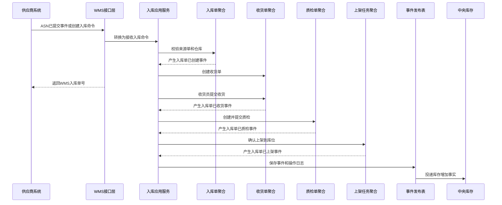
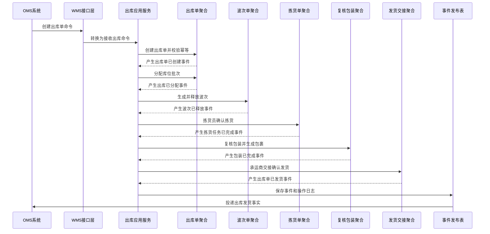
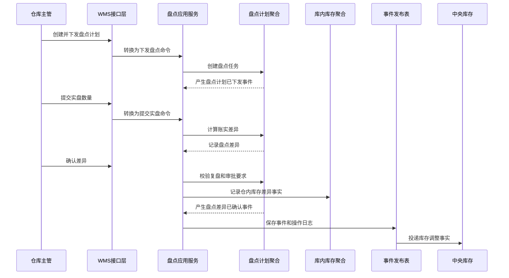

# 03-WMS系统接口设计

> 本文根据 [WMS领域模型](../03-核心业务模型/03-WMS领域模型/01-WMS领域模型.md)、[03-WMS系统产品功能设计](../04-子系统功能设计/03-WMS系统/01-WMS系统产品功能设计.md)、[03-WMS系统数据库设计](../05-子系统数据库设计/03-WMS系统数据库设计.md) 和 [上下文映射与领域事件目录](./00-上下文映射与领域事件目录.md) 设计。接口按 DDD + CQRS 口径拆分：查询接口读取 WMS 作业读模型，命令接口触发应用服务和仓内作业聚合，跨系统接口遵守命令/事件边界。

## 1. 设计范围

| 类型 | 范围 | 说明 |
| --- | --- | --- |
| 前端页面接口 | WMS工作台、入库单、收货、质检、上架、库内库存、出库单、波次、拣货、容器、复核包装、发货交接、退货入库、不合格品、盘点、异常、操作日志、枚举配置 | 面向 WMS Web 端和手持 PDA 作业端 |
| 跨系统命令接口 | 采购/供应商/OMS/调拨/退供 -> WMS，WMS -> 权限/主数据/中央库存/BMS | 同步请求 WMS 创建入库/出库作业，或 WMS 查询外部能力 |
| 跨系统事件接口 | 主数据/采购/供应商/OMS/库存 -> WMS，WMS -> 采购/OMS/库存/BMS/供应商 | 异步传递已经发生的业务事实 |
| 不包含 | 中央库存余额记账、OMS 审单和分仓、采购订单审批、BMS 计费规则 | WMS 只拥有仓内实物作业事实 |

## 2. DDD 对齐说明

| DDD 关注点 | 本文口径 |
| --- | --- |
| 限界上下文 | WMS 上下文 |
| 核心聚合 | 入库单、收货单、质检单、上架任务、库内库存、出库单、波次单、拣货单、周转容器、复核包装单、发货交接、盘点计划、仓内异常 |
| 查询模型 | 工作台待办、入库/出库列表、PDA 作业页、任务看板、库存明细、包裹交接、盘点差异、异常处理、状态时间线、事件时间线、操作日志 |
| 命令接口 | 接收入库、登记到货、开始收货、扫描收货、提交质检、确认上架、接收出库、分配库位、释放波次、领取拣货、确认拣货、绑定容器、复核、打包、交接发货、创建盘点、确认差异、关闭异常 |
| 领域事件 | 入库单已创建、入库单已收货、入库单已质检、入库单已上架、出库单已创建、拣货任务已完成、拣货任务短拣、出库单已复核、出库单已发货、盘点差异已确认、仓内异常已创建等 |
| 数据主权 | WMS 拥有仓内作业状态、库位级实物作业结果、容器和包裹流转、盘点差异、仓内异常；不拥有中央库存统一账本 |
| 幂等规则 | 所有写接口必须携带 `X-Idempotency-Key`；跨系统命令以 `sourceSystem + sourceOrderNo + sourceType + version` 幂等；事件消费以 `sourceContext + eventId + aggregateId` 幂等 |

## 3. 通用协议

### 3.1 基础路径

| 场景 | 基础路径 |
| --- | --- |
| 前端页面接口 | `/api/wms/v1` |
| PDA 作业接口 | `/api/wms-pda/v1` |
| 跨系统开放命令接口 | `/openapi/wms/v1` |
| 事件回调/事件消费入口 | `/internal/wms/v1/events` |

### 3.2 通用请求头

| 请求头 | 必填 | 适用接口 | 说明 |
| --- | --- | --- | --- |
| `Authorization` | 是 | 前端接口、PDA 接口 | `Bearer access_token`，由09-权限系统签发 |
| `X-Tenant-Id` | 否 | 全部 | 租户 ID，单租户可不传 |
| `X-Org-Id` | 是 | 全部 | 当前组织 ID |
| `X-Warehouse-Id` | 作业接口必填 | WMS 页面、PDA、跨系统命令 | 当前仓库 ID，用于仓库数据权限和作业路由 |
| `X-Owner-Id` | 多货主必填 | WMS 页面、PDA、跨系统命令 | 当前货主 ID，单货主可不传 |
| `X-Request-Id` | 是 | 全部 | 请求链路 ID |
| `X-Trace-Id` | 否 | 全部 | 分布式链路追踪 ID |
| `X-Idempotency-Key` | 写接口必填 | 命令接口、跨系统命令 | 同一业务动作唯一 |
| `X-Source-System` | 跨系统必填 | 跨系统命令、事件入口 | `WMS`、`PURCHASE`、`SUPPLIER`、`OMS`、`INVENTORY`、`MDM`、`IAM`、`BMS` |
| `X-Operator-Id` | 写接口必填 | 命令接口 | 操作人；系统任务传系统账号 |
| `X-Device-Id` | PDA 建议必填 | PDA 扫码作业 | 手持设备 ID |
| `X-Data-Scope` | 否 | 前端查询 | 网关或权限中间件解析后的数据范围摘要 |
| `Accept-Language` | 否 | 全部 | `zh-CN` 默认 |

### 3.3 通用响应结构

```json
{
  "success": true,
  "code": "SUCCESS",
  "message": "处理成功",
  "requestId": "REQ202607040001",
  "traceId": "TRACE202607040001",
  "timestamp": "2026-07-04T10:00:00+08:00",
  "data": {}
}
```

分页响应：

```json
{
  "success": true,
  "code": "SUCCESS",
  "message": "查询成功",
  "data": {
    "pageNo": 1,
    "pageSize": 20,
    "total": 128,
    "records": []
  }
}
```

命令响应：

```json
{
  "success": true,
  "code": "SUCCESS",
  "message": "命令已处理",
  "data": {
    "aggregateId": "190001",
    "businessNo": "WO202607040001",
    "status": 4,
    "statusName": "待上架",
    "version": 3,
    "eventId": "EVT202607040001",
    "idempotentHit": false
  }
}
```

### 3.4 HTTP 状态码

| HTTP 状态码 | 场景 | 前端处理 |
| --- | --- | --- |
| `200` | 查询成功、命令同步处理成功 | 正常刷新页面 |
| `201` | 新增成功 | 跳转详情或继续作业 |
| `202` | 命令已受理，异步处理 | 展示处理中，轮询任务或等待事件 |
| `204` | 取消/关闭后无返回体 | 返回列表或刷新详情 |
| `400` | 请求格式错误、字段类型错误 | 表单或扫码提示 |
| `401` | 未登录、Token 过期 | 跳转登录或刷新 Token |
| `403` | 无菜单/按钮/仓库/货主/库区权限 | 隐藏按钮或提示无权限 |
| `404` | 单据不存在或无数据权限导致不可见 | 提示记录不存在 |
| `409` | 乐观锁冲突、幂等内容不一致、状态机冲突、扫码重复 | 提示刷新后重试或忽略重复扫码 |
| `422` | 业务规则不通过 | 展示业务原因，如库位冻结、批次不符、数量超限 |
| `429` | 请求过于频繁 | 稍后重试 |
| `500` | 系统异常 | 记录错误并提示稍后重试 |

### 3.5 业务错误码

| 业务码 | HTTP | 含义 |
| --- | --- | --- |
| `SUCCESS` | `200/201` | 成功 |
| `ACCEPTED` | `202` | 已受理异步处理 |
| `VALIDATION_FAILED` | `400` | 字段校验失败 |
| `UNAUTHORIZED` | `401` | 未认证 |
| `FORBIDDEN` | `403` | 无权限 |
| `WAREHOUSE_SCOPE_DENIED` | `403` | 无当前仓库权限 |
| `LOCATION_SCOPE_DENIED` | `403` | 无当前库区/库位权限 |
| `NOT_FOUND` | `404` | 资源不存在 |
| `VERSION_CONFLICT` | `409` | 乐观锁版本冲突 |
| `IDEMPOTENCY_CONFLICT` | `409` | 同一幂等键请求内容不一致 |
| `STATE_CONFLICT` | `409` | 当前状态不允许该命令 |
| `SCAN_DUPLICATED` | `409` | 扫码重复 |
| `LOCATION_NOT_AVAILABLE` | `422` | 库位不可用、冻结、用途不匹配或容量不足 |
| `QTY_EXCEEDS_ALLOWED` | `422` | 数量超过可收、可上架、可拣或可发数量 |
| `BATCH_RULE_FAILED` | `422` | 批次、效期或序列号规则不通过 |
| `BUSINESS_RULE_FAILED` | `422` | 领域规则不通过 |
| `EXTERNAL_CALL_FAILED` | `422/500` | 跨系统调用失败 |
| `SYSTEM_ERROR` | `500` | 系统异常 |

## 4. 通用对象字段

### 4.1 分页查询字段

| 字段 | 类型 | 必填 | 说明 |
| --- | --- | --- | --- |
| `pageNo` | int | 是 | 页码，从 1 开始 |
| `pageSize` | int | 是 | 每页条数，支持 10、20、50 |
| `sortField` | string | 否 | 排序字段，如 `updatedAt`、`createdAt`、`status`、`priority` |
| `sortOrder` | string | 否 | `asc`、`desc`，默认 `desc` |

### 4.2 状态时间线字段

| 字段 | 类型 | 说明 |
| --- | --- | --- |
| `nodeCode` | string | 状态节点编码 |
| `nodeName` | string | 状态节点名称 |
| `status` | int | 1 未开始，2 进行中，3 已完成，4 已驳回/异常 |
| `operatorId` | string | 操作人 ID |
| `operatorName` | string | 操作人名称 |
| `occurredAt` | datetime | 发生时间 |
| `remark` | string | 备注 |

### 4.3 WMS 作业行字段

| 字段 | 类型 | 必填 | 说明 |
| --- | --- | --- | --- |
| `lineId` | string | 修改时必填 | 作业行 ID |
| `sourceLineId` | string | 跨系统必填 | 来源单行 ID |
| `lineNo` | string | 否 | 行号 |
| `skuId` | string | 是 | SKU ID |
| `skuCode` | string | 是 | SKU 编码快照 |
| `skuName` | string | 是 | SKU 名称快照 |
| `uom` | string | 是 | 单位 |
| `plannedQty` | decimal(18,4) | 是 | 计划数量 |
| `actualQty` | decimal(18,4) | 否 | 实际完成数量 |
| `batchNo` | string | 否 | 批次号 |
| `productionDate` | date | 否 | 生产日期 |
| `expireDate` | date | 否 | 失效日期 |
| `qualityStatus` | int | 否 | `QUALITY_STATUS`：1 待检，2 合格，3 不合格，4 免检，5 待处理 |
| `locationId` | string | 否 | 库位 ID |
| `locationCode` | string | 否 | 库位编码快照 |
| `remark` | string | 否 | 备注 |

### 4.4 WMS 枚举字段

| 枚举类型 | 值 | 含义 |
| --- | --- | --- |
| `INBOUND_SOURCE_TYPE` | 1/2/3/4 | 采购、调拨、销售退货、其他 |
| `INBOUND_STATUS` | 1/2/3/4/5/6/7/8/9 | 待到货、到货中、收货中、待质检、待上架、部分上架、已上架、已关闭、已取消 |
| `RECEIPT_STATUS` | 1/2/3/4/5/6 | 待收货、收货中、部分收货、已收货、异常、已关闭 |
| `QC_RESULT` | 1/2/3/4 | 待检、合格、不合格、部分合格 |
| `PUTAWAY_TASK_STATUS` | 1/2/3/4/5 | 待上架、上架中、部分上架、已完成、异常 |
| `WMS_STOCK_STATUS` | 1/2/3/4/5 | 可拣、冻结、不合格、待退供、待报废 |
| `OUTBOUND_SOURCE_TYPE` | 1/2/3/4 | 销售、调拨、退供、其他 |
| `WMS_OUTBOUND_STATUS` | 1/2/3/4/5/6/7/8/9/10/11 | 待接单、待分配、分配失败、待拣货、拣货中、待复核、复核异常、待发货、已发货、已关闭、已取消 |
| `WAVE_TYPE` | 1/2/3 | 单单拣、批量拣、边拣边分 |
| `PICKING_STATUS` | 1/2/3/4/5/6/7 | 待分配、待拣货、拣货中、部分拣货、拣货异常、已拣货、已交接复核 |
| `CONTAINER_STATUS` | 1/2/3/4/5/6 | 空闲、已绑定、拣货中、待复核、已清空、停用 |
| `PACK_STATUS` | 1/2/3/4/5/6 | 待复核、复核中、复核异常、待打包、已打包、已关闭 |
| `PACKAGE_STATUS` | 1/2/3/4 | 已打包、待交接、已交接、已取消 |
| `COUNT_PLAN_STATUS` | 1/2/3/4/5/6 | 草稿、已下发、盘点中、差异处理中、已完成、已取消 |
| `WMS_EXCEPTION_TYPE` | 1/2/3/4/5/6/7 | 短收、超收、错货、破损、库位不符、复核差异、盘点差异 |

## 5. 前端页面接口

### 5.1 WMS 工作台

| 接口 | 方法 | 路径 | 页面调用位置 | 权限点 | 说明 |
| --- | --- | --- | --- | --- | --- |
| 查询工作台统计 | `GET` | `/api/wms/v1/workbench/summary` | WMS 工作台顶部统计卡片 | `wms:workbench:read` | 查询待收货、待质检、待上架、待拣货、待复核、异常数量 |
| 查询待办列表 | `GET` | `/api/wms/v1/workbench/todos` | WMS 工作台待办表格 | `wms:workbench:read` | 查询当前用户可处理的仓内作业待办 |

请求字段：`warehouseId`、`ownerId`、`todoType`、`createdFrom`、`createdTo`、`pageNo/pageSize/sortField/sortOrder`。`todoType` 可选 `RECEIVE`、`QC`、`PUTAWAY`、`PICK`、`PACK`、`SHIP`、`COUNT`、`EXCEPTION`。

响应字段：`pendingReceiveCount`、`pendingQcCount`、`pendingPutawayCount`、`pendingPickCount`、`pendingPackCount`、`pendingShipCount`、`exceptionCount`、`records[].todoId`、`records[].businessType`、`records[].businessNo`、`records[].title`、`records[].warehouseName`、`records[].statusName`、`records[].targetRoute`。

状态码：`200`、`401`、`403`、`500`。

### 5.2 入库单页

| 接口 | 方法 | 路径 | 页面调用位置 | 权限点 | 领域动作 |
| --- | --- | --- | --- | --- | --- |
| 查询入库单列表 | `GET` | `/api/wms/v1/inbounds` | 入库单页查询、分页、排序 | `wms:inbound:read` | 查询读模型 |
| 查询入库单详情 | `GET` | `/api/wms/v1/inbounds/{inboundId}` | 详情页打开时 | `wms:inbound:read` | 查询读模型 |
| 手工创建入库单 | `POST` | `/api/wms/v1/inbounds` | 新增页保存 | `wms:inbound:create` | 创建入库单 |
| 修改入库单 | `PUT` | `/api/wms/v1/inbounds/{inboundId}` | 修改页保存 | `wms:inbound:update` | 修改未开始作业的入库单 |
| 登记到货 | `POST` | `/api/wms/v1/inbounds/{inboundId}/arrive` | 行内/详情“登记到货” | `wms:inbound:arrive` | 登记到货 |
| 取消入库单 | `POST` | `/api/wms/v1/inbounds/{inboundId}/cancel` | 行内“取消” | `wms:inbound:cancel` | 取消未开始或可补偿入库单 |
| 关闭入库单 | `POST` | `/api/wms/v1/inbounds/{inboundId}/close` | 行内“关闭” | `wms:inbound:close` | 关闭入库单 |

查询请求字段：`inboundOrderNo`、`sourceOrderNo`、`sourceType`、`warehouseId`、`ownerId`、`supplierId`、`customerId`、`inboundStatus`、`expectedArrivalFrom/To`、`pageNo/pageSize/sortField/sortOrder`。

创建/修改请求字段：

| 字段 | 类型 | 必填 | 说明 |
| --- | --- | --- | --- |
| `sourceSystem` | string | 是 | 来源系统 |
| `sourceType` | int | 是 | `INBOUND_SOURCE_TYPE` |
| `sourceOrderNo` | string | 是 | 来源单号 |
| `warehouseId` | string | 是 | 目标仓库 |
| `ownerId` | string | 否 | 货主 |
| `supplierId/customerId` | string | 按来源 | 供应商或客户 |
| `expectedArrivalAt` | datetime | 否 | 预计到仓时间 |
| `lines[]` | array | 是 | 入库行 |
| `version` | int | 修改必填 | 乐观锁版本 |

命令请求字段：登记到货传 `arrivedAt`、`dockNo`、`vehicleNo`、`driverPhone`、`remark`、`version`；取消/关闭传 `reasonCode`、`reason`、`version`。

响应字段：`inboundId`、`inboundOrderNo`、`sourceType/sourceTypeName`、`sourceOrderNo`、`warehouseId/warehouseName`、`inboundStatus/statusName`、`expectedArrivalAt`、`arrivedAt`、`lines[]`、`statusTimeline[]`、`eventTimeline[]`、`version`。

成功事件：`InboundOrderCreated`、`InboundArrivalRegistered`、`InboundOrderCanceled`、`InboundOrderClosed`。

状态码：`200`、`201`、`400`、`401`、`403`、`404`、`409`、`422`、`500`。

### 5.3 收货作业页和 PDA 收货

| 接口 | 方法 | 路径 | 页面调用位置 | 权限点 | 领域动作 |
| --- | --- | --- | --- | --- | --- |
| 查询收货单列表 | `GET` | `/api/wms/v1/receipts` | 收货作业页查询、分页、排序 | `wms:receipt:read` | 查询读模型 |
| 查询收货单详情 | `GET` | `/api/wms/v1/receipts/{receiptId}` | 详情页打开时 | `wms:receipt:read` | 查询读模型 |
| 开始收货 | `POST` | `/api/wms/v1/receipts/{receiptId}/start` | 行内/详情“开始收货” | `wms:receiving:receiving` | 开始收货 |
| 扫描收货 | `POST` | `/api/wms-pda/v1/receipts/{receiptId}/scan` | PDA 扫码收货 | `wms:receiving:receiving` | 扫码记录实收 |
| 调整收货数量 | `POST` | `/api/wms/v1/receipts/{receiptId}/lines/{lineId}/adjust` | 详情页行级“调整” | `wms:receiving:adjust` | 人工修正实收 |
| 登记收货差异 | `POST` | `/api/wms/v1/receipts/{receiptId}/diffs` | 行内/详情“异常登记” | `wms:receiving:exception` | 记录短收、超收、错货、破损 |
| 提交收货 | `POST` | `/api/wms/v1/receipts/{receiptId}/submit` | 行内/详情“提交” | `wms:receiving:submit` | 完成收货 |

查询请求字段：`receiptOrderNo`、`inboundOrderNo`、`sourceOrderNo`、`warehouseId`、`ownerId`、`skuCode`、`receiptStatus`、`qualityStatus`、`pageNo/pageSize/sortField/sortOrder`。

扫描收货请求字段：

| 字段 | 类型 | 必填 | 说明 |
| --- | --- | --- | --- |
| `barcode` | string | 是 | 商品条码、箱码或序列号 |
| `skuCode` | string | 否 | 无法从条码解析时传 |
| `qty` | decimal(18,4) | 是 | 本次扫描收货数量 |
| `batchNo` | string | 否 | 批次号 |
| `productionDate/expireDate` | date | 否 | 生产/失效日期 |
| `containerCode` | string | 否 | 收货容器 |
| `damageFlag` | boolean | 否 | 是否破损 |
| `remark` | string | 否 | 备注 |
| `version` | int | 是 | 乐观锁版本 |

差异请求字段：`lineId`、`exceptionType`、`expectedQty`、`actualQty`、`diffQty`、`reason`、`evidenceUrls[]`、`responsibleParty`、`version`。

响应字段：`receiptId`、`receiptOrderNo`、`receiptStatus/statusName`、`receivedQty`、`shortQty`、`overQty`、`diffCount`、`nextAction`、`lines[]`、`version`。

成功事件：`ReceiptStarted`、`ReceiptLineScanned`、`ReceiptDifferenceRecorded`、`InboundOrderReceived`。这些事件表达 WMS 已发生的收货事实；中央库存消费后决定是否增加库存，WMS 不直接暴露库存余额修改接口。

状态码：`200`、`400`、`401`、`403`、`404`、`409`、`422`、`500`。

### 5.4 质检作业页

| 接口 | 方法 | 路径 | 页面调用位置 | 权限点 | 领域动作 |
| --- | --- | --- | --- | --- | --- |
| 查询质检单列表 | `GET` | `/api/wms/v1/qc-orders` | 质检作业页查询、分页、排序 | `wms:qc:read` | 查询读模型 |
| 查询质检单详情 | `GET` | `/api/wms/v1/qc-orders/{qcId}` | 详情页打开时 | `wms:qc:read` | 查询读模型 |
| 开始质检 | `POST` | `/api/wms/v1/qc-orders/{qcId}/start` | 行内/详情“开始质检” | `wms:qc:page` | 开始质检 |
| 提交质检结果 | `POST` | `/api/wms/v1/qc-orders/{qcId}/submit-result` | 详情页“提交” | `wms:qc:submit` | 提交质检结果 |
| 冻结不合格品 | `POST` | `/api/wms/v1/qc-orders/{qcId}/freeze-rejected` | 详情页“冻结” | `wms:qc:freeze` | 冻结不合格品 |

查询请求字段：`qcOrderNo`、`inboundOrderNo`、`receiptOrderNo`、`warehouseId`、`ownerId`、`skuCode`、`qcResult`、`pageNo/pageSize/sortField/sortOrder`。

提交质检请求字段：

| 字段 | 类型 | 必填 | 说明 |
| --- | --- | --- | --- |
| `lines[].lineId` | string | 是 | 质检行 ID |
| `lines[].sampleQty` | decimal(18,4) | 否 | 抽检数量 |
| `lines[].acceptedQty` | decimal(18,4) | 是 | 合格数量 |
| `lines[].rejectedQty` | decimal(18,4) | 是 | 不合格数量 |
| `lines[].qcResult` | int | 是 | `QC_RESULT` |
| `lines[].rejectReason` | string | 不合格必填 | 不合格原因 |
| `lines[].evidenceUrls[]` | array | 否 | 质检证据 |
| `version` | int | 是 | 乐观锁版本 |

响应字段：`qcId`、`qcOrderNo`、`qcResult/resultName`、`acceptedQty`、`rejectedQty`、`putawayTaskCreated`、`rejectedStockCreated`、`version`。

成功事件：`QcStarted`、`InboundOrderInspected`、`RejectedStockJudged`。

状态码：`200`、`400`、`401`、`403`、`404`、`409`、`422`、`500`。

### 5.5 上架任务页和 PDA 上架

| 接口 | 方法 | 路径 | 页面调用位置 | 权限点 | 领域动作 |
| --- | --- | --- | --- | --- | --- |
| 查询上架任务列表 | `GET` | `/api/wms/v1/putaway-tasks` | 上架任务页查询、分页、排序 | `wms:putaway:read` | 查询读模型 |
| 查询上架任务详情 | `GET` | `/api/wms/v1/putaway-tasks/{putawayId}` | 详情页打开时 | `wms:putaway:read` | 查询读模型 |
| 领取上架任务 | `POST` | `/api/wms/v1/putaway-tasks/{putawayId}/claim` | 行内/详情“领取” | `wms:putaway:page` | 领取任务 |
| 推荐库位 | `POST` | `/api/wms/v1/putaway-tasks/{putawayId}/recommend-locations` | 上架页“推荐库位” | `wms:putaway:read` | 查询推荐结果 |
| 改库位 | `POST` | `/api/wms/v1/putaway-tasks/{putawayId}/change-location` | 行内/详情“改库位” | `wms:putaway:location` | 修改目标库位 |
| 确认上架 | `POST` | `/api/wms-pda/v1/putaway-tasks/{putawayId}/confirm` | PDA 扫库位确认上架 | `wms:putaway:putaway` | 确认上架 |

查询请求字段：`putawayTaskNo`、`inboundOrderNo`、`warehouseId`、`ownerId`、`skuCode`、`qualityStatus`、`taskStatus`、`locationCode`、`pageNo/pageSize/sortField/sortOrder`。

确认上架请求字段：`lineId`、`targetLocationId`、`targetLocationCode`、`actualQty`、`containerCode`、`scanLocationCode`、`version`。

响应字段：`putawayId`、`putawayTaskNo`、`taskStatus/statusName`、`requiredQty`、`putawayQty`、`targetLocationCode`、`qualityStatus/statusName`、`stockId`、`version`。

成功事件：`PutawayTaskClaimed`、`PutawayLocationChanged`、`InboundOrderPutawayCompleted`、`RejectedStockStored`。上架完成事件是入库入账的可信事实，幂等键使用 `WMS + inboundOrderNo + putawayBatchNo`，重复回传返回原处理结果，避免中央库存重复增加。

状态码：`200`、`400`、`401`、`403`、`404`、`409`、`422`、`500`。

### 5.6 库内库存页

| 接口 | 方法 | 路径 | 页面调用位置 | 权限点 | 领域动作 |
| --- | --- | --- | --- | --- | --- |
| 查询库内库存列表 | `GET` | `/api/wms/v1/stocks` | 库内库存页查询、分页、排序 | `wms:stock:read` | 查询读模型 |
| 查询库存详情 | `GET` | `/api/wms/v1/stocks/{stockId}` | 详情页打开时 | `wms:stock:read` | 查询读模型 |
| 查询库存事务 | `GET` | `/api/wms/v1/stocks/{stockId}/transactions` | 详情页事务页签 | `wms:stock:read` | 查询读模型 |
| 冻结库位库存 | `POST` | `/api/wms/v1/stocks/{stockId}/freeze` | 行内“冻结” | `wms:stock:freeze` | 冻结仓内库存 |
| 解冻库位库存 | `POST` | `/api/wms/v1/stocks/{stockId}/unfreeze` | 行内“解冻” | `wms:stock:unfreeze` | 解冻仓内库存 |
| 转待退供 | `POST` | `/api/wms/v1/stocks/{stockId}/mark-supplier-return` | 不合格品页“转待退” | `wms:rejected_stock:supplier_return` | 转为待退供应商 |
| 报废 | `POST` | `/api/wms/v1/stocks/{stockId}/scrap` | 不合格品页“报废” | `wms:rejected_stock:scrap` | 标记待报废或已报废 |

查询请求字段：`warehouseId`、`ownerId`、`zoneId`、`locationCode`、`skuCode`、`batchNo`、`stockStatus`、`qualityStatus`、`pageNo/pageSize/sortField/sortOrder`。

命令请求字段：`qty`、`reasonCode`、`reason`、`relatedOrderNo`、`evidenceUrls[]`、`version`。

响应字段：`stockId`、`warehouseName`、`zoneName`、`locationCode`、`skuCode/skuName`、`batchNo`、`qty`、`lockedQty`、`stockStatus/statusName`、`qualityStatus/statusName`、`version`。

成功事件：`WmsStockFrozen`、`WmsStockUnfrozen`、`RejectedStockMarkedForSupplierReturn`、`RejectedStockScrapped`。

状态码：`200`、`400`、`401`、`403`、`404`、`409`、`422`、`500`。

### 5.7 出库单页

| 接口 | 方法 | 路径 | 页面调用位置 | 权限点 | 领域动作 |
| --- | --- | --- | --- | --- | --- |
| 查询出库单列表 | `GET` | `/api/wms/v1/outbounds` | 出库单页查询、分页、排序 | `wms:outbound:read` | 查询读模型 |
| 查询出库单详情 | `GET` | `/api/wms/v1/outbounds/{outboundId}` | 详情页打开时 | `wms:outbound:read` | 查询读模型 |
| 手工创建出库单 | `POST` | `/api/wms/v1/outbounds` | 新增页保存 | `wms:outbound:create` | 创建出库单 |
| 分配库位 | `POST` | `/api/wms/v1/outbounds/{outboundId}/allocate` | 行内/详情“分配库位” | `wms:outbound:page` | 分配库位和批次 |
| 取消出库单 | `POST` | `/api/wms/v1/outbounds/{outboundId}/cancel` | 行内“取消” | `wms:outbound:cancel` | 取消或拦截出库 |
| 关闭出库单 | `POST` | `/api/wms/v1/outbounds/{outboundId}/close` | 行内“关闭” | `wms:outbound:close` | 关闭出库单 |

查询请求字段：`outboundOrderNo`、`sourceOrderNo`、`sourceType`、`warehouseId`、`ownerId`、`carrierId`、`outboundStatus`、`priority`、`pageNo/pageSize/sortField/sortOrder`。

创建/修改请求字段：`sourceSystem`、`sourceType`、`sourceOrderNo`、`warehouseId`、`ownerId`、`carrierId`、`priority`、`shipDeadline`、`receiverSnapshot`、`lines[]`、`version`。

分配库位请求字段：`allocationStrategyCode`、`allowSplit`、`allowSubstitute`、`lines[].lineId`、`lines[].skuCode`、`lines[].requiredQty`、`version`。

响应字段：`outboundId`、`outboundOrderNo`、`sourceType/sourceTypeName`、`sourceOrderNo`、`outboundStatus/statusName`、`priority`、`allocatedQty`、`pickedQty`、`shippedQty`、`lines[]`、`allocationRecords[]`、`statusTimeline[]`、`version`。

成功事件：`OutboundOrderCreated`、`OutboundAllocated`、`OutboundAllocationFailed`、`OutboundOrderCanceled`、`OutboundOrderClosed`。

状态码：`200`、`201`、`400`、`401`、`403`、`404`、`409`、`422`、`500`。

### 5.8 波次管理页

| 接口 | 方法 | 路径 | 页面调用位置 | 权限点 | 领域动作 |
| --- | --- | --- | --- | --- | --- |
| 查询波次列表 | `GET` | `/api/wms/v1/waves` | 波次管理页查询、分页、排序 | `wms:wave:read` | 查询读模型 |
| 查询可组波出库单 | `GET` | `/api/wms/v1/waves/candidate-outbounds` | 新增/生成波次弹窗 | `wms:wave:read` | 查询可组波出库单 |
| 查询波次详情 | `GET` | `/api/wms/v1/waves/{waveId}` | 详情页打开时 | `wms:wave:read` | 查询读模型 |
| 生成波次 | `POST` | `/api/wms/v1/waves` | 波次页“生成” | `wms:wave:page` | 生成波次 |
| 释放波次 | `POST` | `/api/wms/v1/waves/{waveId}/release` | 行内/详情“释放” | `wms:wave:release` | 释放波次并生成拣货单 |
| 取消波次 | `POST` | `/api/wms/v1/waves/{waveId}/cancel` | 行内“取消” | `wms:wave:cancel` | 取消未释放或可补偿波次 |

查询请求字段：`waveNo`、`waveType`、`waveStatus`、`warehouseId`、`ownerId`、`createdFrom/To`、`pageNo/pageSize/sortField/sortOrder`。

生成波次请求字段：`warehouseId`、`ownerId`、`waveType`、`strategyCode`、`outboundIds[]`、`pickerGroupId`、`remark`。

响应字段：`waveId`、`waveNo`、`waveType/typeName`、`orderCount`、`skuCount`、`waveStatus/statusName`、`releasedAt`、`pickingOrderIds[]`、`version`。

成功事件：`WaveCreated`、`WaveReleased`、`WaveCanceled`、`PickingOrderCreated`。

状态码：`200`、`201`、`400`、`401`、`403`、`404`、`409`、`422`、`500`。

### 5.9 拣货单页和 PDA 拣货

| 接口 | 方法 | 路径 | 页面调用位置 | 权限点 | 领域动作 |
| --- | --- | --- | --- | --- | --- |
| 查询拣货单列表 | `GET` | `/api/wms/v1/picking-orders` | 拣货单页查询、分页、排序 | `wms:picking_order:read` | 查询读模型 |
| 查询拣货单详情 | `GET` | `/api/wms/v1/picking-orders/{pickId}` | 详情页打开时 | `wms:picking_order:read` | 查询读模型 |
| 分配拣货员 | `POST` | `/api/wms/v1/picking-orders/{pickId}/assign` | 行内/详情“分配” | `wms:picking:assign` | 分配拣货员 |
| 领取拣货单 | `POST` | `/api/wms-pda/v1/picking-orders/{pickId}/claim` | PDA“领取” | `wms:picking:page` | 领取拣货 |
| 扫库位 | `POST` | `/api/wms-pda/v1/picking-tasks/{taskId}/scan-location` | PDA 拣货任务扫库位 | `wms:picking:location` | 校验库位 |
| 扫商品 | `POST` | `/api/wms-pda/v1/picking-tasks/{taskId}/scan-sku` | PDA 拣货任务扫商品 | `wms:picking:product` | 校验商品 |
| 确认拣货数量 | `POST` | `/api/wms-pda/v1/picking-tasks/{taskId}/confirm` | PDA 确认数量 | `wms:picking:page` | 确认拣货 |
| 登记短拣 | `POST` | `/api/wms/v1/picking-orders/{pickId}/short-pick` | 行内/详情“异常” | `wms:picking:exception` | 登记短拣异常 |
| 交接复核 | `POST` | `/api/wms/v1/picking-orders/{pickId}/handover-review` | 行内/详情“交接复核” | `wms:picking:page` | 拣货交接复核 |

查询请求字段：`pickingOrderNo`、`waveNo`、`outboundOrderNo`、`warehouseId`、`ownerId`、`pickerId`、`pickingMode`、`pickingStatus`、`pageNo/pageSize/sortField/sortOrder`。

确认拣货请求字段：`taskId`、`locationCode`、`skuCode`、`barcode`、`containerCode`、`pickedQty`、`batchNo`、`shortReason`、`version`。

响应字段：`pickId`、`pickingOrderNo`、`pickingMode/modeName`、`pickingStatus/statusName`、`pickerId/pickerName`、`requiredQty`、`pickedQty`、`shortQty`、`tasks[]`、`containerBindings[]`、`version`。

成功事件：`PickingOrderAssigned`、`PickingOrderClaimed`、`PickTaskCompleted`、`PickTaskShortPicked`、`PickingOrderHandoverToReview`。

状态码：`200`、`400`、`401`、`403`、`404`、`409`、`422`、`500`。

### 5.10 容器管理页

| 接口 | 方法 | 路径 | 页面调用位置 | 权限点 | 领域动作 |
| --- | --- | --- | --- | --- | --- |
| 查询容器列表 | `GET` | `/api/wms/v1/containers` | 容器管理页查询、分页、排序 | `wms:container:read` | 查询读模型 |
| 查询容器详情 | `GET` | `/api/wms/v1/containers/{containerId}` | 详情页打开时 | `wms:container:read` | 查询读模型 |
| 新增容器 | `POST` | `/api/wms/v1/containers` | 新增页保存 | `wms:container:create` | 新增容器 |
| 修改容器 | `PUT` | `/api/wms/v1/containers/{containerId}` | 修改页保存 | `wms:container:update` | 修改容器 |
| 绑定容器 | `POST` | `/api/wms/v1/containers/{containerId}/bind` | 行内/详情“绑定” | `wms:container:bind` | 绑定作业单 |
| 解绑容器 | `POST` | `/api/wms/v1/containers/{containerId}/unbind` | 行内“解绑” | `wms:container:unbind` | 解绑容器 |
| 清空容器 | `POST` | `/api/wms/v1/containers/{containerId}/clear` | 行内“清空” | `wms:container:clear` | 清空容器 |

查询请求字段：`containerCode`、`containerType`、`containerStatus`、`bindType`、`bindOrderNo`、`warehouseId`、`pageNo/pageSize/sortField/sortOrder`。

绑定请求字段：`bindType`、`bindOrderId`、`bindOrderNo`、`locationCode`、`version`。

响应字段：`containerId`、`containerCode`、`containerType/typeName`、`containerStatus/statusName`、`bindType/typeName`、`bindOrderNo`、`lastUsedAt`、`version`。

成功事件：`ContainerCreated`、`ContainerBound`、`ContainerUnbound`、`ContainerCleared`。

状态码：`200`、`201`、`400`、`401`、`403`、`404`、`409`、`422`、`500`。

### 5.11 复核包装页

| 接口 | 方法 | 路径 | 页面调用位置 | 权限点 | 领域动作 |
| --- | --- | --- | --- | --- | --- |
| 查询复核包装列表 | `GET` | `/api/wms/v1/pack-orders` | 复核包装页查询、分页、排序 | `wms:pack:read` | 查询读模型 |
| 查询复核包装详情 | `GET` | `/api/wms/v1/pack-orders/{packId}` | 详情页打开时 | `wms:pack:read` | 查询读模型 |
| 扫描复核 | `POST` | `/api/wms/v1/pack-orders/{packId}/review-scan` | 复核包装页扫容器或商品 | `wms:reviewpacking:review` | 复核商品 |
| 记录复核差异 | `POST` | `/api/wms/v1/pack-orders/{packId}/review-diffs` | 复核异常弹窗 | `wms:reviewpacking:review` | 记录复核差异 |
| 创建包裹 | `POST` | `/api/wms/v1/pack-orders/{packId}/packages` | 打包区“创建包裹” | `wms:reviewpacking:page` | 创建包裹 |
| 称重 | `POST` | `/api/wms/v1/packages/{packageId}/weigh` | 打包区“称重” | `wms:reviewpacking:page` | 记录重量体积 |
| 打印面单 | `POST` | `/api/wms/v1/packages/{packageId}/print-waybill` | 行内“打印面单” | `wms:reviewpacking:page` | 获取并打印面单 |
| 完成包装 | `POST` | `/api/wms/v1/pack-orders/{packId}/complete` | 详情页“完成包装” | `wms:reviewpacking:page` | 完成包装 |

查询请求字段：`packOrderNo`、`outboundOrderNo`、`containerCode`、`warehouseId`、`ownerId`、`packStatus`、`pageNo/pageSize/sortField/sortOrder`。

创建包裹请求字段：`packageNo`、`carrierId`、`waybillNo`、`weight`、`volume`、`packageMaterialCode`、`lines[].skuCode`、`lines[].packedQty`、`version`。

响应字段：`packId`、`packOrderNo`、`packStatus/statusName`、`reviewedQty`、`diffQty`、`packageCount`、`packages[]`、`waybillPrintUrl`、`version`。

成功事件：`OutboundOrderReviewed`、`ReviewDifferenceRecorded`、`PackageCreated`、`PackageWeighed`、`PackageCompleted`。打印面单由 WMS 调用 TMS 获取面单号和打印地址，WMS 记录包裹、重量体积、面单快照；TMS 负责后续揽收、运输轨迹和签收。

状态码：`200`、`201`、`400`、`401`、`403`、`404`、`409`、`422`、`500`。

### 5.12 发货交接页

| 接口 | 方法 | 路径 | 页面调用位置 | 权限点 | 领域动作 |
| --- | --- | --- | --- | --- | --- |
| 查询发货交接列表 | `GET` | `/api/wms/v1/shipments` | 发货交接页查询、分页、排序 | `wms:shipment:read` | 查询读模型 |
| 查询发货交接详情 | `GET` | `/api/wms/v1/shipments/{shipmentId}` | 详情页打开时 | `wms:shipment:read` | 查询读模型 |
| 创建交接单 | `POST` | `/api/wms/v1/shipments` | 发货交接页“创建交接” | `wms:shipping:page` | 创建发货交接 |
| 扫包裹 | `POST` | `/api/wms/v1/shipments/{shipmentId}/scan-package` | 发货区扫包裹 | `wms:shipping:page` | 扫描交接包裹 |
| 移除包裹 | `POST` | `/api/wms/v1/shipments/{shipmentId}/remove-package` | 详情页行级“移除” | `wms:shipping:page` | 移除未交接包裹 |
| 确认发货 | `POST` | `/api/wms/v1/shipments/{shipmentId}/ship` | 详情页“确认发货” | `wms:shipping:shipping` | 确认承运商交接发货 |

查询请求字段：`shipmentNo`、`outboundOrderNo`、`carrierId`、`warehouseId`、`ownerId`、`packageStatus`、`shippedFrom/To`、`pageNo/pageSize/sortField/sortOrder`。

确认发货请求字段：`carrierId`、`handoverUserName`、`handoverAt`、`packageNos[]`、`vehicleNo`、`signedImageUrl`、`version`。

响应字段：`shipmentId`、`shipmentNo`、`carrierId/carrierName`、`packageCount`、`shippedPackageCount`、`shipmentStatus/statusName`、`outboundOrders[]`、`packages[]`、`version`。

成功事件：`PackageHandoverScanned`、`OutboundOrderShipped`、`ShipmentHandoverCompleted`。发货交接事件是出库扣减的可信事实，中央库存消费后扣减库存或处理差异；如果中央库存扣减失败，WMS 保留已交接事实，由中央库存重试或人工补账，WMS 不回滚已交接实物。

状态码：`200`、`201`、`400`、`401`、`403`、`404`、`409`、`422`、`500`。

### 5.13 退货入库页

| 接口 | 方法 | 路径 | 页面调用位置 | 权限点 | 领域动作 |
| --- | --- | --- | --- | --- | --- |
| 查询退货入库列表 | `GET` | `/api/wms/v1/return-receipts` | 退货入库页查询、分页、排序 | `wms:return_receipt:read` | 查询退货入库读模型 |
| 查询退货入库详情 | `GET` | `/api/wms/v1/return-receipts/{returnReceiptId}` | 详情页打开时 | `wms:return_receipt:read` | 查询读模型 |
| 退货收货 | `POST` | `/api/wms/v1/return-receipts/{returnReceiptId}/receive` | 行内/详情“收货” | `wms:inbound:receiving` | 收货 |
| 退货验收 | `POST` | `/api/wms/v1/return-receipts/{returnReceiptId}/inspect` | 行内/详情“验收” | `wms:inbound:page` | 验收退货商品 |
| 退货上架 | `POST` | `/api/wms/v1/return-receipts/{returnReceiptId}/putaway` | 行内/详情“上架” | `wms:inbound:putaway` | 良品或不良品上架 |
| 拒收退货 | `POST` | `/api/wms/v1/return-receipts/{returnReceiptId}/reject` | 行内/详情“拒收” | `wms:inbound:page` | 拒收退货 |

查询请求字段：`afterSaleNo`、`returnReceiptNo`、`warehouseId`、`ownerId`、`skuCode`、`qualityStatus`、`inboundStatus`、`pageNo/pageSize/sortField/sortOrder`。

验收请求字段：`lines[].lineId`、`receivedQty`、`acceptedQty`、`rejectedQty`、`rejectReason`、`targetLocationId`、`evidenceUrls[]`、`version`。

响应字段：`returnReceiptId`、`returnReceiptNo`、`afterSaleNo`、`inboundStatus/statusName`、`acceptedQty`、`rejectedQty`、`putawayQty`、`version`。

成功事件：`ReturnReceiptReceived`、`ReturnReceiptInspected`、`ReturnReceiptPutawayCompleted`、`ReturnReceiptRejected`。

状态码：`200`、`400`、`401`、`403`、`404`、`409`、`422`、`500`。

### 5.14 盘点管理页

| 接口 | 方法 | 路径 | 页面调用位置 | 权限点 | 领域动作 |
| --- | --- | --- | --- | --- | --- |
| 查询盘点计划列表 | `GET` | `/api/wms/v1/count-plans` | 盘点管理页查询、分页、排序 | `wms:count:read` | 查询读模型 |
| 查询盘点计划详情 | `GET` | `/api/wms/v1/count-plans/{countId}` | 详情页打开时 | `wms:count:read` | 查询读模型 |
| 创建盘点计划 | `POST` | `/api/wms/v1/count-plans` | 新增页保存 | `wms:stock_count:create` | 创建盘点计划 |
| 修改盘点计划 | `PUT` | `/api/wms/v1/count-plans/{countId}` | 修改页保存 | `wms:stock_count:update` | 修改草稿 |
| 下发盘点 | `POST` | `/api/wms/v1/count-plans/{countId}/release` | 行内/详情“下发” | `wms:stock_count:page` | 下发盘点任务 |
| 提交实盘 | `POST` | `/api/wms-pda/v1/count-tasks/{taskId}/submit-count` | PDA 盘点提交 | `wms:stock_count:page` | 提交实盘数量 |
| 发起复盘 | `POST` | `/api/wms/v1/count-plans/{countId}/recount` | 详情页“复盘” | `wms:stock_count:page` | 生成复盘任务 |
| 确认差异 | `POST` | `/api/wms/v1/count-plans/{countId}/confirm-diff` | 详情页“确认差异” | `wms:stock_count:page` | 确认盘点差异 |

查询请求字段：`countPlanNo`、`countType`、`planStatus`、`warehouseId`、`ownerId`、`zoneId`、`skuCode`、`createdFrom/To`、`pageNo/pageSize/sortField/sortOrder`。

创建请求字段：`countType`、`warehouseId`、`ownerId`、`countScope`、`zoneIds[]`、`locationIds[]`、`skuCodes[]`、`blindCount`、`plannedStartAt`、`plannedEndAt`、`remark`。

提交实盘请求字段：`taskId`、`locationCode`、`skuCode`、`batchNo`、`bookQty`、`actualQty`、`diffReason`、`evidenceUrls[]`、`version`。

响应字段：`countId`、`countPlanNo`、`countType/typeName`、`planStatus/statusName`、`taskCount`、`differenceCount`、`bookQty`、`actualQty`、`diffQty`、`version`。

成功事件：`StocktakePlanCreated`、`StocktakePlanReleased`、`StocktakeActualQtySubmitted`、`StocktakeDifferenceConfirmed`。

状态码：`200`、`201`、`400`、`401`、`403`、`404`、`409`、`422`、`500`。

### 5.15 仓内异常页

| 接口 | 方法 | 路径 | 页面调用位置 | 权限点 | 领域动作 |
| --- | --- | --- | --- | --- | --- |
| 查询异常列表 | `GET` | `/api/wms/v1/exceptions` | 异常处理页查询、分页、排序 | `wms:exception:read` | 查询读模型 |
| 查询异常详情 | `GET` | `/api/wms/v1/exceptions/{exceptionId}` | 详情页打开时 | `wms:exception:read` | 查询读模型 |
| 创建异常 | `POST` | `/api/wms/v1/exceptions` | 各作业页“异常登记” | `wms:exception:create` | 创建异常记录 |
| 分派异常 | `POST` | `/api/wms/v1/exceptions/{exceptionId}/assign` | 行内/详情“分派” | `wms:exception:page` | 分派处理人 |
| 处理异常 | `POST` | `/api/wms/v1/exceptions/{exceptionId}/handle` | 详情页“处理” | `wms:exception:page` | 记录处理方案 |
| 关闭异常 | `POST` | `/api/wms/v1/exceptions/{exceptionId}/close` | 行内/详情“关闭” | `wms:exception:close` | 关闭异常 |

查询请求字段：`exceptionNo`、`sourceType`、`sourceOrderNo`、`exceptionType`、`exceptionStatus`、`responsibleParty`、`handlerId`、`createdFrom/To`、`pageNo/pageSize/sortField/sortOrder`。

创建/处理请求字段：`sourceType`、`sourceOrderId`、`sourceOrderNo`、`exceptionType`、`exceptionDesc`、`responsibleParty`、`affectedSkuCode`、`affectedQty`、`evidenceUrls[]`、`handleResult`、`nextAction`、`version`。

响应字段：`exceptionId`、`exceptionNo`、`sourceType/sourceTypeName`、`sourceOrderNo`、`exceptionType/typeName`、`exceptionStatus/statusName`、`responsiblePartyName`、`handlerName`、`handleRecords[]`、`version`。

成功事件：`WarehouseExceptionCreated`、`WarehouseExceptionAssigned`、`WarehouseExceptionHandled`、`WarehouseExceptionClosed`。

状态码：`200`、`201`、`400`、`401`、`403`、`404`、`409`、`422`、`500`。

### 5.16 操作日志和枚举配置

| 接口 | 方法 | 路径 | 页面调用位置 | 权限点 | 说明 |
| --- | --- | --- | --- | --- | --- |
| 查询操作日志 | `GET` | `/api/wms/v1/operation-logs` | 操作日志页列表、详情页日志区域 | `wms:operation_log:read` | 查询操作日志 |
| 导出操作日志 | `POST` | `/api/wms/v1/operation-logs/export` | 操作日志页顶部“导出” | `wms:operation_log:export` | 创建导出任务 |
| 查询枚举项 | `GET` | `/api/wms/v1/enums` | 枚举配置页、各页面下拉框 | `wms:enum:read` | 查询枚举项 |
| 新增枚举项 | `POST` | `/api/wms/v1/enums` | 枚举配置页新增 | `wms:enumsettings:create` | 新增可配置枚举 |
| 修改枚举项 | `PUT` | `/api/wms/v1/enums/{enumItemId}` | 枚举配置页编辑 | `wms:enumsettings:update` | 修改标签、颜色、排序 |
| 停用枚举项 | `POST` | `/api/wms/v1/enums/{enumItemId}/disable` | 行内“停用” | `wms:enumsettings:disable` | 停用非核心枚举 |

操作日志查询字段：`operatorId`、`warehouseId`、`businessType`、`businessNo`、`action`、`result`、`createdFrom`、`createdTo`、`pageNo/pageSize`。

操作日志响应字段：`logId`、`operatorId/operatorName`、`warehouseId/warehouseName`、`businessType`、`businessNo`、`action`、`requestSummary`、`beforeSnapshot`、`afterSnapshot`、`result`、`failureReason`、`createdAt`。

枚举查询字段：`enumType`、`enabledOnly`。枚举响应字段：`enumType`、`value`、`label`、`sortNo`、`status`、`color`。

状态码：`200`、`201`、`202`、`400`、`401`、`403`、`404`、`409`、`422`、`500`。

## 6. 跨系统命令接口

### 6.1 采购/供应商/OMS/调拨调用 WMS：创建入库单

```text
POST /openapi/wms/v1/inbound-orders
```

调用时机：采购订单确认或 ASN 提交、调拨入库指令生成、售后退货审核通过，需要 WMS 创建入库作业。

WMS 侧处理：创建 `wms_inbound`，根据来源创建收货待办；同来源单同版本幂等。

请求头：`X-Source-System=PURCHASE|SUPPLIER|OMS|INVENTORY`、`X-Idempotency-Key={sourceSystem}:{sourceOrderNo}:CREATE_INBOUND:{version}`。

请求字段：

| 字段 | 类型 | 必填 | 说明 |
| --- | --- | --- | --- |
| `sourceSystem` | string | 是 | 来源系统 |
| `sourceType` | int | 是 | 1 采购，2 调拨，3 销售退货，4 其他 |
| `sourceOrderId` | string | 是 | 来源单 ID |
| `sourceOrderNo` | string | 是 | 来源单号 |
| `warehouseId` | string | 是 | 目标仓库 |
| `ownerId` | string | 否 | 货主 |
| `supplierSnapshot` | object | 采购入库必填 | 供应商快照 |
| `customerSnapshot` | object | 售后退货必填 | 客户快照 |
| `expectedArrivalAt` | datetime | 否 | 预计到仓时间 |
| `lines[]` | array | 是 | 入库行 |
| `version` | int | 是 | 来源单版本 |

响应字段：`wmsInboundId`、`wmsInboundOrderNo`、`acceptStatus`、`rejectReason`、`createdReceiptOrderNo`。

状态码：`200`、`201`、`202`、`400`、`401`、`403`、`409`、`422`、`500`。

### 6.2 OMS/调拨/退供调用 WMS：创建出库单

```text
POST /openapi/wms/v1/outbound-orders
```

调用时机：OMS 履约单库存预占成功并下发出库指令、调拨出库指令生成、退供应商单审核通过。

WMS 侧处理：创建 `wms_outbound` 和出库行，进入待分配；同来源单同版本幂等。

请求头：`X-Source-System=OMS|INVENTORY|PURCHASE`、`X-Idempotency-Key={sourceSystem}:{sourceOrderNo}:CREATE_OUTBOUND:{version}`。

请求字段：`sourceSystem`、`sourceType`、`sourceOrderId`、`sourceOrderNo`、`warehouseId`、`ownerId`、`priority`、`carrierId`、`receiverSnapshot`、`reservationNo`、`lines[].sourceLineId`、`skuCode`、`plannedQty`、`batchPolicy`、`shipDeadline`、`version`。

响应字段：`wmsOutboundId`、`wmsOutboundOrderNo`、`acceptStatus`、`rejectReason`、`outboundStatus`。

状态码：`200`、`201`、`202`、`400`、`401`、`403`、`409`、`422`、`500`。

### 6.3 OMS/调拨/退供调用 WMS：取消出库单

```text
POST /openapi/wms/v1/outbound-orders/{sourceOrderNo}/cancel
```

调用时机：OMS 取消或拦截履约、调拨取消、退供取消。

WMS 侧处理：根据出库状态执行取消、拦截或拒绝取消。已发货不能取消；已拣未发货需要回滚拣货锁定和容器。

请求头：`X-Source-System=OMS|INVENTORY|PURCHASE`、`X-Idempotency-Key={sourceSystem}:{sourceOrderNo}:CANCEL_OUTBOUND:{cancelVersion}`。

请求字段：`sourceOrderNo`、`cancelReasonCode`、`cancelReason`、`cancelVersion`、`forceIntercept`。

响应字段：`wmsOutboundOrderNo`、`cancelResult`、`cancelResultName`、`currentStatus`、`rejectReason`、`compensationTaskNo`。

状态码：`200`、`202`、`400`、`401`、`403`、`404`、`409`、`422`、`500`。

### 6.4 WMS 调用中央库存：扣减、增加、调整事实确认

WMS 不直接修改中央库存余额，也不对外提供库存余额修改接口。发货、上架、盘点差异确认后，WMS 发布实物作业事实；中央库存消费事实后决定增加、扣减、调整或生成差异。强一致要求高的场景可同步调用中央库存开放接口，但仍要保留事件补偿和幂等记录。

| 目标接口 | 方法 | 调用时机 | 幂等键 |
| --- | --- | --- | --- |
| `/openapi/inventory/v1/stock-increases` | `POST` | 上架完成、退货良品上架 | `WMS:{inboundOrderNo}:PUTAWAY:{putawayBatchNo}` |
| `/openapi/inventory/v1/stock-deductions` | `POST` | 发货交接完成 | `WMS:{outboundOrderNo}:SHIP:{shipmentNo}` |
| `/openapi/inventory/v1/stock-adjustments` | `POST` | 盘点差异确认 | `WMS:{countPlanNo}:CONFIRM_DIFF:{version}` |

请求字段：`sourceEventId`、`sourceOrderNo`、`warehouseId`、`ownerId`、`lines[].skuCode`、`locationCode`、`batchNo`、`qty`、`qualityStatus`、`occurredAt`。

响应字段：`inventoryBizNo`、`processStatus`、`idempotentHit`、`message`。

### 6.5 WMS 调用权限和08-主数据系统

| 目标系统 | 接口 | 调用时机 | 用途 |
| --- | --- | --- | --- |
| 权限系统 | `POST /openapi/iam/v1/tokens/validate` | 用户进入 WMS、提交写操作前 | 校验登录态、角色、菜单、按钮、仓库、货主、库区数据权限 |
| 权限系统 | `GET /openapi/iam/v1/users/me/permissions` | 登录后加载菜单 | 获取 WMS 菜单、按钮权限和数据范围 |
| 主数据系统 | `POST /openapi/mdm/v1/master-data/query` | 商品、仓库、库区库位、货主、供应商、客户、物流商下拉框 | 查询启用主数据 |
| 主数据系统 | `GET /openapi/mdm/v1/warehouses/{warehouseId}/locations` | 推荐库位、分配库位、盘点范围选择 | 查询库位属性、状态、用途和容量 |

## 7. WMS 事件发布

事件通过消息总线发布，也可通过 Outbox 表由集成服务投递。事件标准载荷遵守 [上下文映射与领域事件目录](./00-上下文映射与领域事件目录.md)。

| 事件 | 英文代码 | 触发接口/命令 | 主要消费者 | 关键载荷 |
| --- | --- | --- | --- | --- |
| 入库单已创建 | `InboundOrderCreated` | 创建入库单 | 采购、OMS、供应商 | `inboundOrderNo`、`sourceOrderNo`、`sourceType`、`warehouseId`、`lines` |
| 到货已登记 | `InboundArrivalRegistered` | 登记到货 | 采购、供应商 | `inboundOrderNo`、`arrivedAt`、`dockNo` |
| 入库单已收货 | `InboundOrderReceived` | 提交收货 | 采购、供应商 | `receiptOrderNo`、`receivedLines`、`diffs` |
| 入库单已质检 | `InboundOrderInspected` | 提交质检 | 采购、供应商、OMS | `qcOrderNo`、`acceptedQty`、`rejectedQty`、`rejectReason` |
| 入库单已上架 | `InboundOrderPutawayCompleted` | 确认上架 | 中央库存、采购、OMS、BMS | `putawayTaskNo`、`locationLines`、`qualityStatus` |
| 不合格品已暂存 | `RejectedStockStored` | 不合格上架 | 采购、供应商、库存 | `stockId`、`skuCode`、`qty`、`locationCode` |
| 出库单已创建 | `OutboundOrderCreated` | 创建出库单 | OMS、调拨、采购 | `outboundOrderNo`、`sourceOrderNo`、`sourceType` |
| 出库已分配 | `OutboundAllocated` | 分配库位 | OMS、库存 | `outboundOrderNo`、`allocationLines` |
| 出库分配失败 | `OutboundAllocationFailed` | 分配库位失败 | OMS、库存 | `outboundOrderNo`、`failedLines`、`reason` |
| 拣货任务已完成 | `PickTaskCompleted` | 确认拣货 | OMS、WMS 看板 | `pickingOrderNo`、`taskId`、`pickedQty` |
| 拣货任务短拣 | `PickTaskShortPicked` | 登记短拣 | OMS、中央库存 | `outboundOrderNo`、`skuCode`、`shortQty`、`reason` |
| 出库单已复核 | `OutboundOrderReviewed` | 扫描复核 | OMS | `outboundOrderNo`、`reviewedQty`、`diffs` |
| 包装已完成 | `PackageCompleted` | 完成包装 | OMS、TMS、BMS | `outboundOrderNo`、`packages`、`weight`、`volume`、`waybillNo` |
| 出库单已发货 | `OutboundOrderShipped` | 确认发货 | OMS、中央库存、BMS、TMS | `outboundOrderNo`、`shipmentNo`、`packages`、`shippedLines`、`handoverAt` |
| 退货验收已完成 | `ReturnReceiptInspected` | 退货验收 | OMS、中央库存、BMS | `afterSaleNo`、`acceptedQty`、`rejectedQty` |
| 盘点差异已确认 | `StocktakeDifferenceConfirmed` | 确认差异 | 中央库存、BMS、BI | `countPlanNo`、`differenceLines` |
| 仓内异常已创建 | `WarehouseExceptionCreated` | 创建异常 | 来源系统、主管看板 | `exceptionNo`、`sourceOrderNo`、`exceptionType`、`affectedQty` |
| 仓内异常已关闭 | `WarehouseExceptionClosed` | 关闭异常 | 来源系统、BI | `exceptionNo`、`handleResult`、`responsibleParty` |

## 8. WMS 事件消费

```text
POST /internal/wms/v1/events
```

通用请求字段：

| 字段 | 类型 | 必填 | 说明 |
| --- | --- | --- | --- |
| `eventId` | string | 是 | 外部事件 ID |
| `eventType` | string | 是 | 事件类型 |
| `eventVersion` | string | 是 | 事件版本 |
| `sourceContext` | string | 是 | 来源上下文 |
| `aggregateType` | string | 是 | 来源聚合类型 |
| `aggregateId` | string | 是 | 来源聚合 ID |
| `businessKey` | string | 是 | 来源业务单号 |
| `idempotencyKey` | string | 是 | 事件幂等键 |
| `occurredAt` | datetime | 是 | 事件发生时间 |
| `payload` | object | 是 | 业务载荷 |

响应字段：`consumeId`、`consumeStatus`、`idempotentHit`、`message`。

状态码：`200`、`202`、`400`、`409`、`422`、`500`。

| 消费事件 | 来源系统 | 处理应用服务 | 消费后数据变化 | 幂等键 |
| --- | --- | --- | --- | --- |
| `SkuEnabled` | 主数据 | SKU 事件消费服务 | 更新 SKU 作业快照，允许入库、出库、盘点引用 | `MDM:{eventId}:{skuId}` |
| `SkuDisabled` | 主数据 | SKU 事件消费服务 | 禁止新增作业引用，历史单据可继续查询 | `MDM:{eventId}:{skuId}` |
| `WarehouseEnabled` | 主数据 | 仓库事件消费服务 | 更新仓库快照，允许接收入库/出库指令 | `MDM:{eventId}:{warehouseId}` |
| `WarehouseDisabled` | 主数据 | 仓库事件消费服务 | 禁止新增作业，未完成作业进入风险提示 | `MDM:{eventId}:{warehouseId}` |
| `LocationChanged` | 主数据 | 库位事件消费服务 | 更新库位用途、容量、冻结状态，影响推荐和分配 | `MDM:{eventId}:{locationId}:{version}` |
| `LocationFrozen` | 主数据 | 库位事件消费服务 | 禁止上架、拣货、盘点以外操作；已有任务生成异常 | `MDM:{eventId}:{locationId}` |
| `CarrierEnabled` | 主数据 | 物流商事件消费服务 | 允许复核包装和发货选择承运商 | `MDM:{eventId}:{carrierId}` |
| `ShippingLabelGenerated` | TMS | 面单事件消费服务 | 回写包裹面单号、打印地址、承运商服务和面单状态 | `TMS:{eventId}:{packageNo}:LABEL` |
| `ShippingLabelVoided` | TMS | 面单事件消费服务 | 标记面单作废，未发货包裹允许重新获取面单 | `TMS:{eventId}:{packageNo}:VOID_LABEL` |
| `TransportArranged` | TMS | 发运计划事件消费服务 | 更新发货交接单的承运商、车辆、司机和预约交接时间 | `TMS:{eventId}:{transportOrderNo}` |
| `TransportExceptionRegistered` | TMS | 运输异常事件消费服务 | 更新发货交接或退货收货异常提示，必要时创建仓内异常 | `TMS:{eventId}:{transportOrderNo}:EXCEPTION` |
| `AsnSubmitted` | 供应商 | 入库指令消费服务 | 创建或更新采购入库单，生成收货待办 | `SUPPLIER:{eventId}:{asnNo}` |
| `AsnShipped` | 供应商 | 到货预约消费服务 | 更新预计到货和运输信息 | `SUPPLIER:{eventId}:{asnNo}:SHIP` |
| `PurchaseOrderCanceled` | 采购 | 入库取消消费服务 | 未收货入库单取消；已开始作业生成异常待办 | `PURCHASE:{eventId}:{purchaseOrderNo}` |
| `SupplierReturnApproved` | 采购 | 退供出库消费服务 | 创建退供应商出库单 | `PURCHASE:{eventId}:{supplierReturnNo}` |
| `OutboundInstructionIssued` | OMS | 出库指令消费服务 | 创建销售出库单，等待分配拣货 | `OMS:{eventId}:{fulfillmentOrderNo}` |
| `FulfillmentOrderCanceled` | OMS | 出库取消消费服务 | 取消或拦截出库单，必要时生成补偿任务 | `OMS:{eventId}:{fulfillmentOrderNo}` |
| `AfterSaleApproved` | OMS | 退货入库消费服务 | 创建售后退货入库单 | `OMS:{eventId}:{afterSaleNo}` |
| `InventoryReserved` | 中央库存 | 出库预占消费服务 | 标记出库单可分配，刷新可作业库存快照 | `INVENTORY:{eventId}:{reservationNo}` |
| `InventoryReservationReleased` | 中央库存 | 出库释放消费服务 | 若未拣货则取消分配或释放作业锁定 | `INVENTORY:{eventId}:{reservationNo}` |

## 9. 典型调用链路

### 9.1 采购入库



### 9.2 销售出库



### 9.3 盘点差异确认



## 10. 安全、幂等、审计和补偿

| 项 | 设计 |
| --- | --- |
| 认证 | 前端和 PDA 接口必须携带 `Authorization`，由网关或 WMS 后端调用09-权限系统校验 |
| 菜单权限 | 查询接口校验菜单权限，如 `wms:outbound:read` |
| 按钮权限 | 写接口校验按钮权限，如 `wms:shipping:shipping` |
| 数据权限 | 按组织、仓库、货主、库区、供应商/客户、本人/部门过滤；PDA 还要校验设备绑定仓库 |
| 幂等 | 写接口使用 `X-Idempotency-Key`；重复命中返回原命令结果，不重复产生事件、任务或库存事实 |
| 乐观锁 | 修改和状态推进必须传 `version`；冲突返回 `409 VERSION_CONFLICT` |
| 扫码防重 | 商品、容器、包裹扫码以 `作业单 + 条码 + 扫描动作 + 扫描批次` 防重 |
| 审计 | 所有写接口记录操作人、仓库、设备、权限点、请求摘要、前后状态、事件 ID、失败原因 |
| 事件可靠性 | 领域事件先写 Outbox，再异步投递；消费事件先写 Inbox，再处理 |
| 入库补偿 | 取消冲突、收货差异、质检不合格、上架库位满进入异常处理；已上架后不能静默取消，只能走调整或退供 |
| 出库补偿 | OMS 取消时，未分配直接取消，已分配释放锁定，已拣货回滚容器和库位锁定，已发货拒绝取消并回传结果 |
| 库存补偿 | WMS 已发货但库存扣减失败时，事件重试、人工补账、禁止重复扣减；库存以事件幂等键去重。盘点差异由 WMS 记录账实差异和确认事实，中央库存生成调整或差异单 |
| 短拣补偿 | WMS 发布短拣事实，OMS 决定拆单、改配或取消，中央库存决定释放差额预占或后续调整，WMS 不直接改中央库存余额 |
| TMS 补偿 | 面单获取失败允许重试或换承运商；面单已生成但未发货可作废重打；已交接后运输轨迹、签收、拒收和异常由 TMS 负责，WMS 只保留交接事实和异常提示 |

## 11. 当前结论与待决问题

当前结论：WMS 接口的核心不是普通单据 CRUD，而是仓内作业命令。每个写接口都应明确作业角色、作业位置、数量、批次、容器、设备、状态推进、事件发布和幂等键；WMS 通过事件把真实发生的收货、质检、上架、拣货、复核、发货、盘点事实传给采购、OMS、中央库存、BMS、TMS 和01-供应商系统。WMS 不直接修改中央库存余额，库存变化由中央库存基于 WMS 作业事实完成；TMS 负责面单、运输轨迹和签收，WMS 负责仓内包装与交接事实。

关键假设：第一版 WMS 以“当前状态表 + 作业明细 + 操作日志 + Outbox/Inbox 事件表”落地，不强制事件溯源；PDA 接口和 Web 接口共用应用服务和领域模型，只是入口、字段校验和交互方式不同。

待决问题：

| 问题 | 当前建议 |
| --- | --- |
| 采购 ASN 是供应商直连 WMS 还是采购转发 | 第一版支持两种入口，但推荐由采购或集成服务统一转发，减少01-供应商系统直接依赖 WMS |
| WMS 是否直接调用中央库存接口 | 优先发布 WMS 作业事实事件；对发货扣减、盘点调整等强一致要求高的场景，可同步调用并保留事件补偿 |
| 出库短拣由 WMS 直接改库存还是通知 OMS/库存 | WMS 只发布短拣事实，OMS 决定改配、拆单、取消，中央库存决定释放或调整 |
| 不合格品是否进入中央库存 | 建议进入中央库存的不可用/不合格库存账户，同时 WMS 保留库位级实物位置 |
