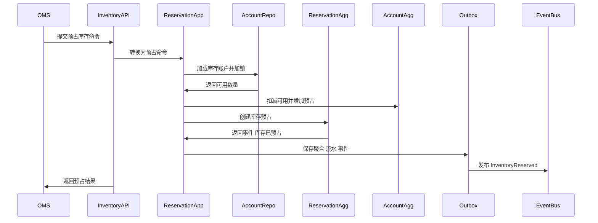
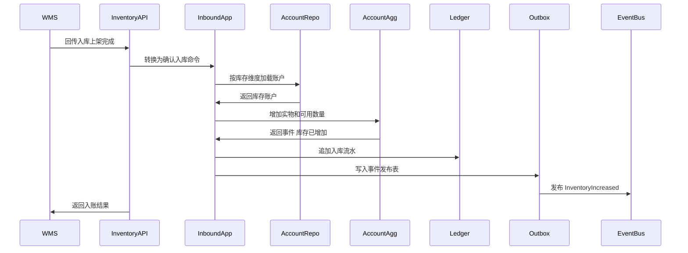
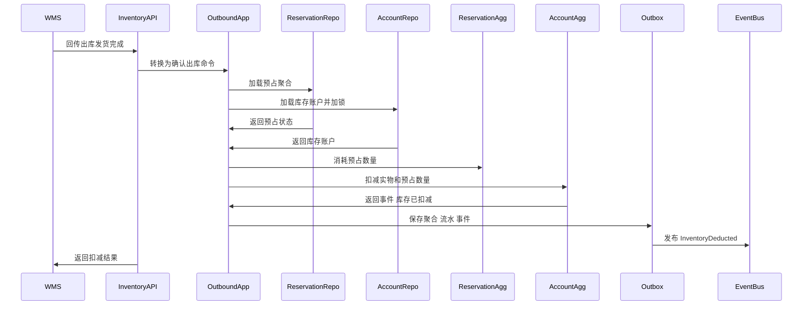
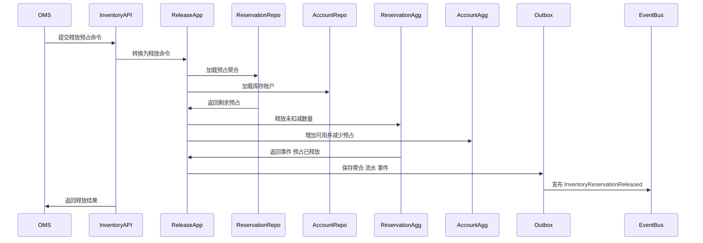
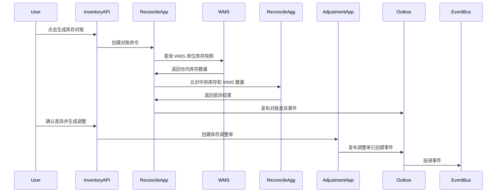

# 04-中央库存系统接口设计

> 本文根据 [中央库存领域模型](../03-核心业务模型/04-中央库存领域模型/01-中央库存领域模型.md)、[04-中央库存系统产品功能设计](../04-子系统功能设计/04-中央库存系统/01-中央库存系统产品功能设计.md)、[04-中央库存系统数据库设计](../05-子系统数据库设计/04-中央库存系统数据库设计.md) 和 [上下文映射与领域事件目录](./00-上下文映射与领域事件目录.md) 设计。接口按 DDD + CQRS 口径拆分：查询接口读取库存读模型，命令接口触发应用服务和聚合行为，事件接口只传递已经发生的业务事实。

## 1. 设计范围

| 类型 | 范围 | 说明 |
| --- | --- | --- |
| 前端页面接口 | 库存工作台、库存余额、可用库存、预占管理、冻结解冻、库存调整、库存流水、库存快照、库存对账、事件日志、参数配置、操作日志、枚举配置 | 面向中央库存后台 Web 端 |
| 跨系统命令接口 | OMS/调拨/退供 -> 中央库存，WMS -> 中央库存，中央库存 -> 权限/主数据/BMS | 同步执行库存预占、释放、入库、扣减、冻结、调整、查询等命令 |
| 跨系统事件接口 | 主数据/WMS/OMS/权限 -> 中央库存，中央库存 -> OMS/采购/WMS/BMS/BI | 异步传递主数据、仓内作业、库存账本和审批事实 |
| 不包含 | WMS 仓内扫码作业、OMS 审单分仓、采购订单审批、BMS 费用计算 | 中央库存只拥有库存账本、可用口径、预占、冻结、调整、快照、对账和流水主权 |

## 2. DDD 对齐说明

| DDD 关注点 | 本文口径 |
| --- | --- |
| 限界上下文 | 中央库存上下文 |
| 核心聚合 | 库存账户、库存预占、冻结单、库存调整单、库存快照、库存对账单 |
| 查询模型 | 工作台指标、库存余额、可用库存、预占记录、冻结记录、调整记录、库存流水、快照、对账差异、事件处理记录、操作日志 |
| 命令接口 | 预占库存、释放预占、扣减预占、确认入库、确认出库、冻结库存、解冻库存、创建调整单、提交审批、执行调整、生成快照、生成对账、确认差异 |
| 领域事件 | 库存已预占、库存预占失败、库存预占已释放、库存已扣减、库存已增加、库存已冻结、库存已解冻、库存已调整、库存快照已生成、库存对账差异已创建、可售库存已变化 |
| 数据主权 | 中央库存拥有库存余额、可用/可售口径、预占状态、冻结状态、调整结果、库存流水、快照、对账差异和事件幂等结果 |
| 幂等规则 | 所有写接口必须携带 `X-Idempotency-Key`；命令幂等以 `sourceSystem + sourceOrderNo + sourceLineNo + commandType + idempotencyKey` 判断；事件消费以 `sourceContext + eventId + aggregateId` 判断 |

## 3. 通用协议

### 3.1 基础路径

| 场景 | 基础路径 |
| --- | --- |
| 前端页面接口 | `/api/inventory/v1` |
| 跨系统开放命令接口 | `/openapi/inventory/v1` |
| 事件回调/事件消费入口 | `/internal/inventory/v1/events` |
| 内部读模型接口 | `/internal/inventory/v1/read-models` |

### 3.2 通用请求头

| 请求头 | 必填 | 适用接口 | 说明 |
| --- | --- | --- | --- |
| `Authorization` | 是 | 前端接口 | `Bearer access_token`，由09-权限系统签发 |
| `X-Tenant-Id` | 否 | 全部 | 租户 ID，单租户可不传 |
| `X-Org-Id` | 是 | 全部 | 当前组织 ID |
| `X-Owner-Id` | 多货主必填 | 页面查询、命令、事件 | 当前货主 ID；自营单货主可固定为公司主体 |
| `X-Warehouse-Id` | 仓维度接口必填 | 页面查询、命令、事件 | 当前仓库 ID，用于仓库数据权限和库存维度 |
| `X-Request-Id` | 是 | 全部 | 请求链路 ID |
| `X-Trace-Id` | 否 | 全部 | 分布式链路追踪 ID |
| `X-Idempotency-Key` | 写接口必填 | 命令接口、事件入口 | 同一业务动作唯一 |
| `X-Source-System` | 跨系统必填 | 跨系统命令、事件入口 | `OMS`、`WMS`、`PURCHASE`、`SUPPLIER`、`MDM`、`IAM`、`BMS`、`INVENTORY` |
| `X-Operator-Id` | 写接口必填 | 命令接口 | 操作人；系统任务传系统账号 |
| `X-Data-Scope` | 否 | 前端查询 | 网关或权限中间件解析后的数据范围摘要 |
| `Accept-Language` | 否 | 全部 | `zh-CN` 默认 |

### 3.3 通用响应结构

```json
{
  "success": true,
  "code": "SUCCESS",
  "message": "处理成功",
  "requestId": "REQ202607040001",
  "traceId": "TRACE202607040001",
  "timestamp": "2026-07-04T10:00:00+08:00",
  "data": {}
}
```

分页响应：

```json
{
  "success": true,
  "code": "SUCCESS",
  "message": "查询成功",
  "data": {
    "pageNo": 1,
    "pageSize": 20,
    "total": 128,
    "records": []
  }
}
```

命令响应：

```json
{
  "success": true,
  "code": "SUCCESS",
  "message": "命令已处理",
  "data": {
    "aggregateId": "190001",
    "businessNo": "RSV202607040001",
    "status": 2,
    "statusName": "已预占",
    "version": 3,
    "eventId": "EVT202607040001",
    "ledgerBatchNo": "LGB202607040001",
    "idempotentHit": false
  }
}
```

### 3.4 HTTP 状态码

| HTTP 状态码 | 场景 | 前端/调用方处理 |
| --- | --- | --- |
| `200` | 查询成功、命令同步处理成功 | 正常刷新页面或继续业务 |
| `201` | 新增冻结单、调整单、快照任务、对账任务成功 | 跳转详情或刷新列表 |
| `202` | 快照、对账、事件重放等异步任务已受理 | 展示处理中，轮询任务或等待事件 |
| `204` | 关闭、取消、忽略等动作成功且无返回体 | 返回列表或刷新详情 |
| `400` | 请求格式错误、字段类型错误 | 表单提示 |
| `401` | 未登录、Token 过期 | 跳转登录或刷新 Token |
| `403` | 无菜单/按钮/仓库/货主/组织权限 | 隐藏按钮或提示无权限 |
| `404` | 库存账户、预占单、冻结单、调整单、对账单不存在 | 提示记录不存在 |
| `409` | 乐观锁冲突、幂等内容不一致、状态机冲突、重复记账 | 提示刷新或按幂等结果处理 |
| `422` | 库存不足、超释放、超扣减、未审批、库存维度无效 | 展示业务失败原因 |
| `429` | 请求过于频繁 | 稍后重试 |
| `500` | 系统异常 | 记录错误并提示稍后重试 |

### 3.5 业务错误码

| 业务码 | HTTP | 含义 |
| --- | --- | --- |
| `SUCCESS` | `200/201` | 成功 |
| `ACCEPTED` | `202` | 已受理异步处理 |
| `VALIDATION_FAILED` | `400` | 字段校验失败 |
| `UNAUTHORIZED` | `401` | 未认证 |
| `FORBIDDEN` | `403` | 无权限 |
| `OWNER_SCOPE_DENIED` | `403` | 无货主权限 |
| `WAREHOUSE_SCOPE_DENIED` | `403` | 无仓库权限 |
| `NOT_FOUND` | `404` | 资源不存在 |
| `VERSION_CONFLICT` | `409` | 乐观锁版本冲突 |
| `IDEMPOTENCY_CONFLICT` | `409` | 同一幂等键请求内容不一致 |
| `STATE_CONFLICT` | `409` | 当前状态不允许该命令 |
| `LEDGER_DUPLICATED` | `409` | 重复入账或重复扣减 |
| `INSUFFICIENT_AVAILABLE_QTY` | `422` | 可用库存不足 |
| `QTY_EXCEEDS_RESERVED` | `422` | 释放或扣减数量超过可处理预占 |
| `QTY_EXCEEDS_FREEZABLE` | `422` | 冻结数量超过可冻结数量 |
| `QTY_EXCEEDS_UNFREEZABLE` | `422` | 解冻数量超过已冻结数量 |
| `ADJUSTMENT_NOT_APPROVED` | `422` | 调整单未审批通过 |
| `INVENTORY_DIMENSION_INVALID` | `422` | 货主、仓库、SKU、批次、库存状态维度无效 |
| `BUSINESS_RULE_FAILED` | `422` | 领域规则不通过 |

## 4. 枚举值约定

接口中的状态枚举与数据库设计保持一致。落库建议使用数值，接口可同时返回 `status` 和 `statusName`，前端展示名由枚举配置页维护。

| 枚举类型 | 值 | 展示名 | 使用位置 |
| --- | --- | --- | --- |
| `INV_STOCK_STATUS` | `1` | 可用 | 库存余额、可用库存、入库、出库、冻结、调整 |
| `INV_STOCK_STATUS` | `2` | 冻结 | 冻结单、库存余额 |
| `INV_STOCK_STATUS` | `3` | 不合格 | 质检不良、退供 |
| `INV_STOCK_STATUS` | `4` | 在途 | 调拨在途 |
| `INV_STOCK_STATUS` | `5` | 待退供 | 供应商退货 |
| `RESERVATION_TYPE` | `1` | 销售 | OMS 销售履约预占 |
| `RESERVATION_TYPE` | `2` | 调拨 | 调拨出库预占 |
| `RESERVATION_TYPE` | `3` | 退供 | 供应商退货锁定 |
| `RESERVATION_STATUS` | `1` | 已创建 | 预占单 |
| `RESERVATION_STATUS` | `2` | 已预占 | 预占单 |
| `RESERVATION_STATUS` | `3` | 部分消耗 | 预占单 |
| `RESERVATION_STATUS` | `4` | 已消耗 | 预占单 |
| `RESERVATION_STATUS` | `5` | 已释放 | 预占单 |
| `RESERVATION_STATUS` | `6` | 已关闭 | 预占单 |
| `RESERVATION_STATUS` | `7` | 失败 | 预占单 |
| `FREEZE_STATUS` | `1` | 草稿 | 冻结单 |
| `FREEZE_STATUS` | `2` | 待审批 | 冻结单 |
| `FREEZE_STATUS` | `3` | 已冻结 | 冻结单 |
| `FREEZE_STATUS` | `4` | 部分解冻 | 冻结单 |
| `FREEZE_STATUS` | `5` | 已解冻 | 冻结单 |
| `FREEZE_STATUS` | `6` | 已取消 | 冻结单 |
| `ADJUSTMENT_STATUS` | `1` | 草稿 | 调整单 |
| `ADJUSTMENT_STATUS` | `2` | 待审批 | 调整单 |
| `ADJUSTMENT_STATUS` | `3` | 已批准 | 调整单 |
| `ADJUSTMENT_STATUS` | `4` | 已执行 | 调整单 |
| `ADJUSTMENT_STATUS` | `5` | 已驳回 | 调整单 |
| `ADJUSTMENT_STATUS` | `6` | 已取消 | 调整单 |
| `LEDGER_TYPE` | `1` | 入库 | 库存流水 |
| `LEDGER_TYPE` | `2` | 出库 | 库存流水 |
| `LEDGER_TYPE` | `3` | 预占 | 库存流水 |
| `LEDGER_TYPE` | `4` | 释放 | 库存流水 |
| `LEDGER_TYPE` | `5` | 冻结 | 库存流水 |
| `LEDGER_TYPE` | `6` | 解冻 | 库存流水 |
| `LEDGER_TYPE` | `7` | 调整 | 库存流水 |
| `LEDGER_TYPE` | `8` | 红冲 | 库存流水 |
| `SNAPSHOT_STATUS` | `1` | 生成中 | 库存快照 |
| `SNAPSHOT_STATUS` | `2` | 已生成 | 库存快照 |
| `SNAPSHOT_STATUS` | `3` | 失败 | 库存快照 |
| `SNAPSHOT_STATUS` | `4` | 已关闭 | 库存快照 |
| `RECON_STATUS` | `1` | 草稿 | 库存对账 |
| `RECON_STATUS` | `2` | 对账中 | 库存对账 |
| `RECON_STATUS` | `3` | 有差异 | 库存对账 |
| `RECON_STATUS` | `4` | 已确认 | 库存对账 |
| `RECON_STATUS` | `5` | 已关闭 | 库存对账 |
| `EVENT_PROCESS_STATUS` | `1` | 待处理 | 事件日志 |
| `EVENT_PROCESS_STATUS` | `2` | 成功 | 事件日志 |
| `EVENT_PROCESS_STATUS` | `3` | 失败 | 事件日志 |
| `EVENT_PROCESS_STATUS` | `4` | 已忽略 | 事件日志 |

## 5. 前端页面接口

### 5.1 页面接口总览

| 页面 | 调用位置 | 接口 | 权限点 | 领域对象 |
| --- | --- | --- | --- | --- |
| 库存工作台 | 首屏加载、待办卡片点击 | `GET /api/inventory/v1/workbench/summary`、`GET /api/inventory/v1/workbench/todos` | `inventory:workbench:read` | 库存账户、预占、对账、调整 |
| 库存余额页 | 查询、分页、排序、导出、查看详情 | `GET /api/inventory/v1/balances`、`GET /api/inventory/v1/balances/{stockId}`、`POST /api/inventory/v1/balances/export` | `inventory:balance:read`、`inventory:stock:export` | 库存账户 |
| 可用库存页 | 查询、分页、排序、导出 | `POST /api/inventory/v1/available/query`、`POST /api/inventory/v1/available/export` | `inventory:available:read`、`inventory:stock:export` | 可用库存读模型 |
| 预占管理页 | 查询、详情、释放、关闭、重试 | `GET /api/inventory/v1/reservations`、`GET /api/inventory/v1/reservations/{reservationNo}`、`POST /api/inventory/v1/reservations/{reservationNo}/release`、`POST /api/inventory/v1/reservations/{reservationNo}/close`、`POST /api/inventory/v1/reservations/{reservationNo}/retry` | `inventory:reservation:read`、`inventory:reservation:release` | 库存预占 |
| 冻结解冻页 | 查询、新增、编辑、提交、审批、解冻 | `GET /api/inventory/v1/freezes`、`POST /api/inventory/v1/freezes`、`PUT /api/inventory/v1/freezes/{freezeNo}`、`POST /api/inventory/v1/freezes/{freezeNo}/submit`、`POST /api/inventory/v1/freezes/{freezeNo}/approve`、`POST /api/inventory/v1/freezes/{freezeNo}/unfreeze` | `inventory:freeze:read`、`inventory:freezeunfreeze:create`、`inventory:freezeunfreeze:submit`、`inventory:freezeunfreeze:approve` | 冻结单、库存账户 |
| 库存调整页 | 查询、新增、编辑、提交、审批、执行 | `GET /api/inventory/v1/adjustments`、`POST /api/inventory/v1/adjustments`、`PUT /api/inventory/v1/adjustments/{adjustmentNo}`、`POST /api/inventory/v1/adjustments/{adjustmentNo}/submit`、`POST /api/inventory/v1/adjustments/{adjustmentNo}/approve`、`POST /api/inventory/v1/adjustments/{adjustmentNo}/execute` | `inventory:adjustment:read`、`inventory:stock:create`、`inventory:stock:submit`、`inventory:stock:approve` | 库存调整单、库存账户 |
| 库存流水页 | 查询、导出、详情 | `GET /api/inventory/v1/ledgers`、`GET /api/inventory/v1/ledgers/{ledgerNo}`、`POST /api/inventory/v1/ledgers/export` | `inventory:ledger:read`、`inventory:stock:export` | 库存流水 |
| 库存快照页 | 查询、生成、重算、导出、详情 | `GET /api/inventory/v1/snapshots`、`POST /api/inventory/v1/snapshots`、`POST /api/inventory/v1/snapshots/{snapshotNo}/rebuild`、`GET /api/inventory/v1/snapshots/{snapshotNo}`、`POST /api/inventory/v1/snapshots/export` | `inventory:snapshot:read`、`inventory:stock:page`、`inventory:stock:export` | 库存快照 |
| 库存对账页 | 查询、生成、确认、生成调整、详情 | `GET /api/inventory/v1/reconciliations`、`POST /api/inventory/v1/reconciliations`、`POST /api/inventory/v1/reconciliations/{reconcileNo}/confirm`、`POST /api/inventory/v1/reconciliations/{reconcileNo}/create-adjustment`、`GET /api/inventory/v1/reconciliations/{reconcileNo}` | `inventory:recon:read`、`inventory:stockreconcile:page` | 库存对账单、库存调整单 |
| 事件日志页 | 查询、详情、重放、忽略 | `GET /api/inventory/v1/event-logs`、`GET /api/inventory/v1/event-logs/{eventId}`、`POST /api/inventory/v1/event-logs/{eventId}/replay`、`POST /api/inventory/v1/event-logs/{eventId}/ignore` | `inventory:event_log:read`、`inventory:event:page` | 库存事件日志 |
| 参数配置页 | 查询、新增、编辑、启停 | `GET /api/inventory/v1/settings`、`POST /api/inventory/v1/settings`、`PUT /api/inventory/v1/settings/{settingCode}`、`POST /api/inventory/v1/settings/{settingCode}/enable`、`POST /api/inventory/v1/settings/{settingCode}/disable` | `inventory:setting:read`、`inventory:settingssettings:create`、`inventory:settingssettings:update` | 可用口径、预占超时、库存维度配置 |
| 操作日志页 | 查询、详情、导出 | `GET /api/inventory/v1/operation-logs`、`GET /api/inventory/v1/operation-logs/{logId}`、`POST /api/inventory/v1/operation-logs/export` | `inventory:operation_log:read` | 操作审计 |
| 枚举配置页 | 查询、新增、编辑、排序、停用 | `GET /api/inventory/v1/enums`、`POST /api/inventory/v1/enums`、`PUT /api/inventory/v1/enums/{enumItemId}`、`POST /api/inventory/v1/enums/sort`、`POST /api/inventory/v1/enums/{enumItemId}/disable` | `inventory:enum:read`、`inventory:enumsettings:create`、`inventory:enumsettings:update` | 枚举配置 |

### 5.2 工作台接口

#### 查询工作台汇总

| 项 | 设计 |
| --- | --- |
| 方法 | `GET` |
| 路径 | `/api/inventory/v1/workbench/summary` |
| 调用页面 | 库存工作台首屏加载 |
| 调用时机 | 用户进入 `/inventory/workbench` 时调用；切换仓库、货主、日期范围后重新调用 |
| 权限点 | `inventory:workbench:read` |
| 数据变化 | 无，只读取读模型 |

请求参数：

| 字段 | 类型 | 必填 | 说明 |
| --- | --- | --- | --- |
| `ownerId` | `long` | 否 | 货主 ID |
| `warehouseIds` | `long[]` | 否 | 仓库范围 |
| `dateFrom` | `date` | 否 | 起始日期 |
| `dateTo` | `date` | 否 | 结束日期 |

响应字段：

| 字段 | 类型 | 说明 |
| --- | --- | --- |
| `shortageSkuCount` | `int` | 缺货 SKU 数 |
| `reservationFailedCount` | `int` | 预占失败数 |
| `frozenQty` | `decimal(18,4)` | 冻结数量 |
| `reconcileDiffCount` | `int` | 对账差异数 |
| `adjustmentPendingCount` | `int` | 待审批调整单数 |
| `eventFailedCount` | `int` | 事件失败数 |

状态码：`200`、`401`、`403`、`500`。

#### 查询工作台待办

| 项 | 设计 |
| --- | --- |
| 方法 | `GET` |
| 路径 | `/api/inventory/v1/workbench/todos` |
| 调用页面 | 库存工作台待办列表 |
| 调用时机 | 首屏加载、切换待办类型、分页时调用 |
| 权限点 | `inventory:workbench:read` |
| 数据变化 | 无 |

请求参数：

| 字段 | 类型 | 必填 | 说明 |
| --- | --- | --- | --- |
| `todoType` | `string` | 否 | `RESERVATION_FAILED`、`RECON_DIFF`、`ADJUSTMENT_APPROVAL`、`EVENT_FAILED` |
| `pageNo` | `int` | 是 | 页码 |
| `pageSize` | `int` | 是 | 每页条数 |

响应字段：

| 字段 | 类型 | 说明 |
| --- | --- | --- |
| `todoId` | `string` | 待办 ID |
| `todoType` | `string` | 待办类型 |
| `businessNo` | `string` | 业务单号 |
| `title` | `string` | 待办标题 |
| `status` | `int` | 业务状态 |
| `statusName` | `string` | 状态展示名 |
| `occurredAt` | `datetime` | 发生时间 |
| `targetRoute` | `string` | 点击跳转路由 |

状态码：`200`、`401`、`403`、`500`。

### 5.3 库存余额接口

#### 查询库存余额列表

| 项 | 设计 |
| --- | --- |
| 方法 | `GET` |
| 路径 | `/api/inventory/v1/balances` |
| 调用页面 | 库存余额页查询区、分页、排序 |
| 调用时机 | 进入页面、点击查询、重置、翻页、排序 |
| 权限点 | `inventory:balance:read` |
| 数据变化 | 无，只读取 `inv_stock_balance` 读模型 |

该接口承接旧库存接口 `GET /inventory/balances` 的余额查询能力，统一返回现货、可用、预占、冻结、在途和不可售等数量口径；前端和外部系统不得通过余额查询结果直接推断可售，销售承诺仍以可用库存或可售查询接口为准。

请求参数：

| 字段 | 类型 | 必填 | 说明 |
| --- | --- | --- | --- |
| `ownerId` | `long` | 否 | 货主 ID |
| `warehouseId` | `long` | 否 | 仓库 ID |
| `skuCode` | `string` | 否 | SKU 编码，支持精确或模糊 |
| `skuName` | `string` | 否 | SKU 名称 |
| `batchNo` | `string` | 否 | 批次号 |
| `stockStatus` | `int` | 否 | `INV_STOCK_STATUS` |
| `includeZero` | `boolean` | 否 | 是否包含零库存 |
| `pageNo` | `int` | 是 | 页码 |
| `pageSize` | `int` | 是 | 每页条数 |
| `sortField` | `string` | 否 | 排序字段 |
| `sortOrder` | `string` | 否 | `ASC`、`DESC` |

响应字段：

| 字段 | 类型 | 说明 |
| --- | --- | --- |
| `stockId` | `long` | 库存余额 ID |
| `ownerId` | `long` | 货主 ID |
| `ownerName` | `string` | 货主名称 |
| `warehouseId` | `long` | 仓库 ID |
| `warehouseName` | `string` | 仓库名称 |
| `skuId` | `long` | SKU ID |
| `skuCode` | `string` | SKU 编码 |
| `skuName` | `string` | SKU 名称 |
| `batchNo` | `string` | 批次号 |
| `stockStatus` | `int` | 库存状态 |
| `stockStatusName` | `string` | 库存状态名称 |
| `onHandQty` | `decimal(18,4)` | 实物数量 |
| `availableQty` | `decimal(18,4)` | 可用数量 |
| `reservedQty` | `decimal(18,4)` | 预占数量 |
| `frozenQty` | `decimal(18,4)` | 冻结数量 |
| `inTransitQty` | `decimal(18,4)` | 在途数量 |
| `versionNo` | `long` | 库存账本版本号 |
| `updatedAt` | `datetime` | 更新时间 |

状态码：`200`、`400`、`401`、`403`、`500`。

#### 查询库存余额详情

| 项 | 设计 |
| --- | --- |
| 方法 | `GET` |
| 路径 | `/api/inventory/v1/balances/{stockId}` |
| 调用页面 | 库存余额页行内“查看详情” |
| 调用时机 | 用户点击详情抽屉或详情页 |
| 权限点 | `inventory:balance:read` |
| 数据变化 | 无 |

路径参数：

| 字段 | 类型 | 必填 | 说明 |
| --- | --- | --- | --- |
| `stockId` | `long` | 是 | 库存余额 ID |

响应字段：

| 字段 | 类型 | 说明 |
| --- | --- | --- |
| `balance` | `object` | 库存余额基础信息，字段同列表 |
| `recentLedgers` | `array` | 最近库存流水 |
| `reservations` | `array` | 当前未关闭预占 |
| `freezeRecords` | `array` | 当前冻结记录 |
| `operationLogs` | `array` | 最近操作日志 |

状态码：`200`、`401`、`403`、`404`、`500`。

### 5.4 可用库存接口

#### 查询可用库存

| 项 | 设计 |
| --- | --- |
| 方法 | `POST` |
| 路径 | `/api/inventory/v1/available/query` |
| 调用页面 | 可用库存页查询；也可供 OMS 分仓页面内部调用 |
| 调用时机 | 进入页面、点击查询、OMS 需要计算可承诺库存时 |
| 权限点 | `inventory:available:read` |
| 数据变化 | 无，读取可用库存读模型并应用可售策略 |

该接口承接旧库存接口 `POST /inventory/sellable/query` 的可售查询能力，面向 OMS 分仓、渠道下单校验、采购补货参考和调拨可用判断；可售数量由库存余额、预占、冻结、安全库存、渠道策略和仓库范围共同计算。

请求字段：

| 字段 | 类型 | 必填 | 说明 |
| --- | --- | --- | --- |
| `ownerId` | `long` | 是 | 货主 ID |
| `warehouseScope` | `long[]` | 否 | 可查询仓库范围 |
| `skuIds` | `long[]` | 是 | SKU 列表 |
| `channelId` | `long` | 否 | 销售渠道 |
| `strategyCode` | `string` | 否 | 可售策略编码 |
| `includeInTransit` | `boolean` | 否 | 是否返回在途 |
| `pageNo` | `int` | 否 | 页面查询时传 |
| `pageSize` | `int` | 否 | 页面查询时传 |

响应字段：

| 字段 | 类型 | 说明 |
| --- | --- | --- |
| `skuId` | `long` | SKU ID |
| `skuCode` | `string` | SKU 编码 |
| `warehouseId` | `long` | 仓库 ID |
| `availableQty` | `decimal(18,4)` | 可用数量 |
| `sellableQty` | `decimal(18,4)` | 可售数量 |
| `reservedQty` | `decimal(18,4)` | 已预占数量 |
| `frozenQty` | `decimal(18,4)` | 冻结数量 |
| `safetyStockQty` | `decimal(18,4)` | 安全库存数量 |
| `expectedInboundQty` | `decimal(18,4)` | 预计入库数量 |
| `strategyHit` | `string` | 命中的可售策略 |

状态码：`200`、`400`、`401`、`403`、`422`、`500`。

### 5.5 预占管理接口

#### 查询预占列表

| 项 | 设计 |
| --- | --- |
| 方法 | `GET` |
| 路径 | `/api/inventory/v1/reservations` |
| 调用页面 | 预占管理页查询区、分页、排序 |
| 调用时机 | 进入页面、点击查询、翻页、点击工作台预占失败待办 |
| 权限点 | `inventory:reservation:read` |
| 数据变化 | 无 |

该接口承接旧库存接口 `GET /inventory/reservations` 的预占查询能力，只查询预占、释放、扣减进度和异常原因；预占状态只能由中央库存命令或消费 WMS/OMS 事件推进，WMS 不直接修改预占。

请求参数：

| 字段 | 类型 | 必填 | 说明 |
| --- | --- | --- | --- |
| `reservationNo` | `string` | 否 | 预占单号 |
| `sourceSystem` | `string` | 否 | 来源系统 |
| `sourceOrderNo` | `string` | 否 | 来源单号 |
| `reservationType` | `int` | 否 | `RESERVATION_TYPE` |
| `reservationStatus` | `int` | 否 | `RESERVATION_STATUS` |
| `skuCode` | `string` | 否 | SKU 编码 |
| `createdFrom` | `datetime` | 否 | 创建开始时间 |
| `createdTo` | `datetime` | 否 | 创建结束时间 |
| `pageNo` | `int` | 是 | 页码 |
| `pageSize` | `int` | 是 | 每页条数 |

响应字段：

| 字段 | 类型 | 说明 |
| --- | --- | --- |
| `reservationNo` | `string` | 预占单号 |
| `sourceSystem` | `string` | 来源系统 |
| `sourceOrderNo` | `string` | 来源单号 |
| `reservationType` | `int` | 预占类型 |
| `reservationStatus` | `int` | 预占状态 |
| `requestedQty` | `decimal(18,4)` | 请求预占数量 |
| `reservedQty` | `decimal(18,4)` | 成功预占数量 |
| `consumedQty` | `decimal(18,4)` | 已扣减数量 |
| `releasedQty` | `decimal(18,4)` | 已释放数量 |
| `expireAt` | `datetime` | 过期时间 |
| `createdAt` | `datetime` | 创建时间 |

状态码：`200`、`400`、`401`、`403`、`500`。

#### 释放预占

| 项 | 设计 |
| --- | --- |
| 方法 | `POST` |
| 路径 | `/api/inventory/v1/reservations/{reservationNo}/release` |
| 调用页面 | 预占管理页行内“释放”；订单取消补偿页面 |
| 调用时机 | OMS 取消、履约拦截、超时释放、人工释放时 |
| 权限点 | `inventory:reservation:release` |
| 数据变化 | `inv_reservation` 状态和释放数量变化；`inv_stock_balance.available_qty` 增加，`reserved_qty` 减少；追加 `inv_stock_ledger`；发布 `InventoryReservationReleased` |

请求字段：

| 字段 | 类型 | 必填 | 说明 |
| --- | --- | --- | --- |
| `releaseReason` | `string` | 是 | `CANCEL`、`SHORTAGE`、`TIMEOUT`、`MANUAL` |
| `version` | `int` | 是 | 乐观锁版本 |
| `remark` | `string` | 否 | 备注 |
| `lines[].sourceLineNo` | `string` | 是 | 来源行号 |
| `lines[].skuId` | `long` | 是 | SKU ID |
| `lines[].releaseQty` | `decimal(18,4)` | 是 | 释放数量 |

响应字段：

| 字段 | 类型 | 说明 |
| --- | --- | --- |
| `reservationNo` | `string` | 预占单号 |
| `reservationStatus` | `int` | 最新状态 |
| `releasedQty` | `decimal(18,4)` | 本次释放数量 |
| `ledgerBatchNo` | `string` | 流水批次 |
| `eventId` | `string` | 领域事件 ID |
| `idempotentHit` | `boolean` | 是否命中幂等 |

状态码：`200`、`400`、`401`、`403`、`404`、`409`、`422`、`500`。

### 5.6 冻结解冻接口

#### 创建冻结单

| 项 | 设计 |
| --- | --- |
| 方法 | `POST` |
| 路径 | `/api/inventory/v1/freezes` |
| 调用页面 | 冻结解冻页顶部“新增”提交 |
| 调用时机 | 质检异常、盘点锁定、风控拦截、人工隔离库存时 |
| 权限点 | `inventory:freezeunfreeze:create` |
| 数据变化 | 新增 `inv_freeze`，状态为草稿或待审批；不立即改变库存余额，除非配置为创建即冻结 |

请求字段：

| 字段 | 类型 | 必填 | 说明 |
| --- | --- | --- | --- |
| `freezeReason` | `int` | 是 | `FREEZE_REASON` |
| `autoSubmit` | `boolean` | 否 | 是否创建后自动提交 |
| `remark` | `string` | 否 | 备注 |
| `lines[].ownerId` | `long` | 是 | 货主 ID |
| `lines[].warehouseId` | `long` | 是 | 仓库 ID |
| `lines[].skuId` | `long` | 是 | SKU ID |
| `lines[].batchNo` | `string` | 否 | 批次 |
| `lines[].stockStatus` | `int` | 是 | 库存状态 |
| `lines[].freezeQty` | `decimal(18,4)` | 是 | 冻结数量 |

响应字段：

| 字段 | 类型 | 说明 |
| --- | --- | --- |
| `freezeNo` | `string` | 冻结单号 |
| `freezeStatus` | `int` | 冻结状态 |
| `approvalStatus` | `int` | 审批状态 |
| `version` | `int` | 版本号 |

状态码：`201`、`400`、`401`、`403`、`409`、`422`、`500`。

#### 审批冻结单

| 项 | 设计 |
| --- | --- |
| 方法 | `POST` |
| 路径 | `/api/inventory/v1/freezes/{freezeNo}/approve` |
| 调用页面 | 冻结解冻详情页“审批” |
| 调用时机 | 审批人通过或驳回冻结申请时 |
| 权限点 | `inventory:freezeunfreeze:approve` |
| 数据变化 | 通过时 `inv_freeze.freeze_status` 变为已冻结；`available_qty` 减少，`frozen_qty` 增加；追加冻结流水；发布 `InventoryFrozen`。驳回时只改审批状态和操作日志 |

请求字段：

| 字段 | 类型 | 必填 | 说明 |
| --- | --- | --- | --- |
| `approveResult` | `string` | 是 | `APPROVE`、`REJECT` |
| `approveRemark` | `string` | 否 | 审批意见 |
| `version` | `int` | 是 | 乐观锁版本 |

响应字段：`freezeNo`、`freezeStatus`、`approvalStatus`、`ledgerBatchNo`、`eventId`、`version`。

状态码：`200`、`400`、`401`、`403`、`404`、`409`、`422`、`500`。

#### 解冻库存

| 项 | 设计 |
| --- | --- |
| 方法 | `POST` |
| 路径 | `/api/inventory/v1/freezes/{freezeNo}/unfreeze` |
| 调用页面 | 冻结解冻页行内“解冻” |
| 调用时机 | 质检转良、盘点结束、风险解除或人工释放冻结库存时 |
| 权限点 | `inventory:freezeunfreeze:unfreeze` |
| 数据变化 | `inv_freeze` 更新解冻数量和状态；`available_qty` 增加，`frozen_qty` 减少；追加解冻流水；发布 `InventoryUnfrozen` |

请求字段：

| 字段 | 类型 | 必填 | 说明 |
| --- | --- | --- | --- |
| `unfreezeReason` | `string` | 是 | 解冻原因 |
| `version` | `int` | 是 | 乐观锁版本 |
| `lines[].skuId` | `long` | 是 | SKU ID |
| `lines[].unfreezeQty` | `decimal(18,4)` | 是 | 解冻数量 |

响应字段：`freezeNo`、`freezeStatus`、`unfrozenQty`、`ledgerBatchNo`、`eventId`、`version`。

状态码：`200`、`400`、`401`、`403`、`404`、`409`、`422`、`500`。

### 5.7 库存调整接口

#### 创建库存调整单

| 项 | 设计 |
| --- | --- |
| 方法 | `POST` |
| 路径 | `/api/inventory/v1/adjustments` |
| 调用页面 | 库存调整页顶部“新增”提交；对账页“生成调整单” |
| 调用时机 | 盘盈、盘亏、差异修正、红冲时 |
| 权限点 | `inventory:stock:create` |
| 数据变化 | 新增 `inv_stock_adjustment`，状态为草稿或待审批；不直接改变库存余额 |

请求字段：

| 字段 | 类型 | 必填 | 说明 |
| --- | --- | --- | --- |
| `adjustmentType` | `int` | 是 | `ADJUSTMENT_TYPE` |
| `adjustmentReason` | `string` | 是 | 调整原因 |
| `sourceReconcileNo` | `string` | 否 | 来源对账单 |
| `autoSubmit` | `boolean` | 否 | 是否创建后自动提交 |
| `lines[].ownerId` | `long` | 是 | 货主 ID |
| `lines[].warehouseId` | `long` | 是 | 仓库 ID |
| `lines[].skuId` | `long` | 是 | SKU ID |
| `lines[].batchNo` | `string` | 否 | 批次 |
| `lines[].stockStatus` | `int` | 是 | 库存状态 |
| `lines[].adjustQty` | `decimal(18,4)` | 是 | 调整数量，盘亏为负 |

响应字段：`adjustmentNo`、`adjustmentStatus`、`approvalStatus`、`version`。

状态码：`201`、`400`、`401`、`403`、`409`、`422`、`500`。

#### 执行库存调整

| 项 | 设计 |
| --- | --- |
| 方法 | `POST` |
| 路径 | `/api/inventory/v1/adjustments/{adjustmentNo}/execute` |
| 调用页面 | 库存调整详情页“执行” |
| 调用时机 | 调整单审批通过后，由库存运营执行 |
| 权限点 | `inventory:stock:page` |
| 数据变化 | `inv_stock_adjustment.adjustment_status` 变为已执行；库存账户数量变化；追加调整流水；发布 `InventoryAdjusted` 和必要的 `SellableInventoryChanged` |

请求字段：

| 字段 | 类型 | 必填 | 说明 |
| --- | --- | --- | --- |
| `version` | `int` | 是 | 乐观锁版本 |
| `executeRemark` | `string` | 否 | 执行备注 |

响应字段：`adjustmentNo`、`adjustmentStatus`、`ledgerBatchNo`、`eventId`、`version`。

状态码：`200`、`400`、`401`、`403`、`404`、`409`、`422`、`500`。

### 5.8 库存流水接口

#### 查询库存流水

| 项 | 设计 |
| --- | --- |
| 方法 | `GET` |
| 路径 | `/api/inventory/v1/ledgers` |
| 调用页面 | 库存流水页查询区；各详情页“流水”标签 |
| 调用时机 | 查询、分页、排序、按来源单追踪库存变化 |
| 权限点 | `inventory:ledger:read` |
| 数据变化 | 无，读取只追加流水 |

该接口承接旧库存接口 `GET /inventory/ledgers` 的流水查询能力，并通过 `sourceSystem`、`sourceOrderNo`、`ledgerBatchNo`、`eventId` 串联单据库存轨迹。按来源单追踪时等同于旧接口 `GET /inventory/traces/by-source-doc` 的核心能力，用于查看预占、释放、扣减、入库、调整、事件和流水批次的完整链路。

请求参数：

| 字段 | 类型 | 必填 | 说明 |
| --- | --- | --- | --- |
| `ledgerNo` | `string` | 否 | 流水号 |
| `ledgerType` | `int` | 否 | `LEDGER_TYPE` |
| `sourceSystem` | `string` | 否 | 来源系统 |
| `sourceOrderNo` | `string` | 否 | 来源单号 |
| `ownerId` | `long` | 否 | 货主 |
| `warehouseId` | `long` | 否 | 仓库 |
| `skuCode` | `string` | 否 | SKU |
| `occurredFrom` | `datetime` | 否 | 开始时间 |
| `occurredTo` | `datetime` | 否 | 结束时间 |
| `pageNo` | `int` | 是 | 页码 |
| `pageSize` | `int` | 是 | 每页条数 |

响应字段：

| 字段 | 类型 | 说明 |
| --- | --- | --- |
| `ledgerNo` | `string` | 流水号 |
| `ledgerBatchNo` | `string` | 流水批次 |
| `ledgerType` | `int` | 流水类型 |
| `changeDirection` | `int` | 变化方向 |
| `qtyDelta` | `decimal(18,4)` | 变化数量 |
| `beforeOnHandQty` | `decimal(18,4)` | 变化前实物 |
| `afterOnHandQty` | `decimal(18,4)` | 变化后实物 |
| `beforeAvailableQty` | `decimal(18,4)` | 变化前可用 |
| `afterAvailableQty` | `decimal(18,4)` | 变化后可用 |
| `sourceSystem` | `string` | 来源系统 |
| `sourceOrderNo` | `string` | 来源单号 |
| `eventId` | `string` | 事件 ID |
| `createdAt` | `datetime` | 创建时间 |

状态码：`200`、`400`、`401`、`403`、`500`。

### 5.9 快照与对账接口

#### 生成库存快照

| 项 | 设计 |
| --- | --- |
| 方法 | `POST` |
| 路径 | `/api/inventory/v1/snapshots` |
| 调用页面 | 库存快照页顶部“生成” |
| 调用时机 | 日结、月结或手工生成快照时 |
| 权限点 | `inventory:stock:page` |
| 数据变化 | 新增 `inv_stock_snapshot`；异步生成快照明细；发布 `InventorySnapshotGenerated` |

请求字段：

| 字段 | 类型 | 必填 | 说明 |
| --- | --- | --- | --- |
| `snapshotDate` | `date` | 是 | 快照日期 |
| `snapshotType` | `int` | 是 | `SNAPSHOT_TYPE` |
| `ownerIds` | `long[]` | 否 | 货主范围 |
| `warehouseIds` | `long[]` | 否 | 仓库范围 |
| `remark` | `string` | 否 | 备注 |

响应字段：`snapshotNo`、`snapshotStatus`、`taskId`、`eventId`。

状态码：`201`、`202`、`400`、`401`、`403`、`409`、`422`、`500`。

#### 生成库存对账单

| 项 | 设计 |
| --- | --- |
| 方法 | `POST` |
| 路径 | `/api/inventory/v1/reconciliations` |
| 调用页面 | 库存对账页顶部“生成” |
| 调用时机 | 库存运营按仓库、货主、日期对比中央库存与 WMS 库位库存时 |
| 权限点 | `inventory:stockreconcile:page` |
| 数据变化 | 新增 `inv_stock_reconcile`；调用或消费 WMS 库存快照；生成差异行；发布 `InventoryReconciliationDifferenceCreated` |

请求字段：

| 字段 | 类型 | 必填 | 说明 |
| --- | --- | --- | --- |
| `reconcileDate` | `date` | 是 | 对账日期 |
| `ownerId` | `long` | 是 | 货主 ID |
| `warehouseId` | `long` | 是 | 仓库 ID |
| `stockStatusScope` | `int[]` | 否 | 库存状态范围 |
| `remark` | `string` | 否 | 备注 |

响应字段：`reconcileNo`、`reconStatus`、`diffLineCount`、`taskId`、`eventId`。

状态码：`201`、`202`、`400`、`401`、`403`、`409`、`422`、`500`。

#### 确认对账差异

| 项 | 设计 |
| --- | --- |
| 方法 | `POST` |
| 路径 | `/api/inventory/v1/reconciliations/{reconcileNo}/confirm` |
| 调用页面 | 库存对账详情页“确认” |
| 调用时机 | 库存运营确认差异原因和处理策略后 |
| 权限点 | `inventory:stockreconcile:page` |
| 数据变化 | `inv_stock_reconcile.recon_status` 变为已确认；可选择生成调整单；发布 `InventoryReconciliationConfirmed` |

请求字段：

| 字段 | 类型 | 必填 | 说明 |
| --- | --- | --- | --- |
| `version` | `int` | 是 | 乐观锁版本 |
| `confirmRemark` | `string` | 否 | 确认备注 |
| `createAdjustment` | `boolean` | 否 | 是否生成调整单 |

响应字段：`reconcileNo`、`reconStatus`、`adjustmentNo`、`eventId`、`version`。

状态码：`200`、`400`、`401`、`403`、`404`、`409`、`422`、`500`。

## 6. 跨系统命令接口

### 6.1 命令接口总览

旧库存接口中属于中央库存写模型的能力统一并入本节命令接口：预占、释放、入库增加、出库扣减、冻结、解冻、调整和对账都由中央库存校验库存不变量并追加流水；WMS 只回传实物作业事实，不能直接修改库存余额。

| 命令 | 发起方 | 处理方 | 接口 | 聚合 | 主要结果 |
| --- | --- | --- | --- | --- | --- |
| 查询可售库存 | OMS/渠道/采购 | 中央库存 | `POST /openapi/inventory/v1/sellable/query` | 库存账户读模型 | 返回可售/可用 |
| 预占库存 | OMS/调拨/退供 | 中央库存 | `POST /openapi/inventory/v1/reservations` | 库存预占、库存账户 | 预占成功或失败 |
| 释放预占 | OMS/调拨/退供 | 中央库存 | `POST /openapi/inventory/v1/reservations/{reservationNo}/release` | 库存预占、库存账户 | 释放成功 |
| WMS 入库记账 | WMS | 中央库存 | `POST /openapi/inventory/v1/inbounds/confirm` | 库存账户 | 增加库存 |
| WMS 出库扣减 | WMS | 中央库存 | `POST /openapi/inventory/v1/outbounds/confirm` | 库存账户、库存预占 | 扣减库存 |
| WMS 盘点差异调整 | WMS | 中央库存 | `POST /openapi/inventory/v1/stocktakes/confirm-difference` | 库存对账、库存调整 | 生成或执行调整 |
| 外部冻结库存 | WMS/质检/风控 | 中央库存 | `POST /openapi/inventory/v1/freezes` | 冻结单、库存账户 | 冻结库存 |
| 查询单据库存轨迹 | OMS/WMS/BMS/客服 | 中央库存 | `GET /openapi/inventory/v1/traces/by-source-doc` | 库存读模型 | 返回预占、流水、事件链路 |

### 6.2 查询可售库存

| 项 | 设计 |
| --- | --- |
| 方法 | `POST` |
| 路径 | `/openapi/inventory/v1/sellable/query` |
| 发起方 | OMS、渠道、采购、调拨 |
| 调用场景 | OMS 审单分仓、前台下单校验、采购补货参考、调拨可用判断 |
| 数据变化 | 无 |

请求字段：

| 字段 | 类型 | 必填 | 说明 |
| --- | --- | --- | --- |
| `ownerId` | `long` | 是 | 货主 |
| `channelId` | `long` | 否 | 渠道 |
| `warehouseScope` | `long[]` | 否 | 仓库范围 |
| `strategyCode` | `string` | 否 | 可售策略 |
| `lines[].skuId` | `long` | 是 | SKU |
| `lines[].requiredQty` | `decimal(18,4)` | 否 | 需求数量 |

响应字段：

| 字段 | 类型 | 说明 |
| --- | --- | --- |
| `lineResults[].skuId` | `long` | SKU |
| `lineResults[].warehouseId` | `long` | 仓库 |
| `lineResults[].availableQty` | `decimal(18,4)` | 可用数量 |
| `lineResults[].sellableQty` | `decimal(18,4)` | 可售数量 |
| `lineResults[].canPromise` | `boolean` | 是否可承诺 |
| `lineResults[].shortageQty` | `decimal(18,4)` | 缺口数量 |

状态码：`200`、`400`、`403`、`422`、`500`。

### 6.3 预占库存

| 项 | 设计 |
| --- | --- |
| 方法 | `POST` |
| 路径 | `/openapi/inventory/v1/reservations` |
| 发起方 | OMS、调拨系统、供应商退货流程 |
| 调用场景 | 销售履约分仓后锁库存；调拨出库锁库存；退供应商出库锁定待退供库存 |
| 数据变化 | 创建 `inv_reservation` 和 `inv_reservation_line`；减少 `available_qty`，增加 `reserved_qty`；追加预占流水；发布 `InventoryReserved` 或 `InventoryReservationFailed` |

请求字段：

| 字段 | 类型 | 必填 | 说明 |
| --- | --- | --- | --- |
| `sourceSystem` | `string` | 是 | 来源系统 |
| `sourceOrderNo` | `string` | 是 | 来源单号 |
| `reservationType` | `int` | 是 | `RESERVATION_TYPE` |
| `ownerId` | `long` | 是 | 货主 |
| `warehouseId` | `long` | 是 | 预占仓 |
| `expireAt` | `datetime` | 否 | 预占过期时间 |
| `allowPartial` | `boolean` | 否 | 是否允许部分预占 |
| `lines[].sourceLineNo` | `string` | 是 | 来源行号 |
| `lines[].skuId` | `long` | 是 | SKU |
| `lines[].batchNo` | `string` | 否 | 批次 |
| `lines[].stockStatus` | `int` | 是 | 库存状态 |
| `lines[].requestedQty` | `decimal(18,4)` | 是 | 请求预占数量 |

响应字段：

| 字段 | 类型 | 说明 |
| --- | --- | --- |
| `reservationNo` | `string` | 预占单号 |
| `reservationStatus` | `int` | 预占状态 |
| `reservedQty` | `decimal(18,4)` | 成功预占总量 |
| `failedReason` | `string` | 失败原因 |
| `lineResults[].sourceLineNo` | `string` | 来源行号 |
| `lineResults[].requestedQty` | `decimal(18,4)` | 请求数量 |
| `lineResults[].reservedQty` | `decimal(18,4)` | 成功数量 |
| `lineResults[].resultCode` | `string` | 行结果 |
| `ledgerBatchNo` | `string` | 流水批次 |
| `eventId` | `string` | 事件 ID |
| `idempotentHit` | `boolean` | 是否命中幂等 |

状态码：`200`、`201`、`400`、`403`、`409`、`422`、`500`。

### 6.4 WMS 入库记账

| 项 | 设计 |
| --- | --- |
| 方法 | `POST` |
| 路径 | `/openapi/inventory/v1/inbounds/confirm` |
| 发起方 | WMS |
| 调用场景 | 采购入库上架、售后退货上架、调拨入库上架、其他入库完成后 |
| 数据变化 | 增加库存账户实物和可用/不合格/待退供等状态数量；追加入库流水；发布 `InventoryIncreased` 和必要的 `SellableInventoryChanged` |

请求字段：

| 字段 | 类型 | 必填 | 说明 |
| --- | --- | --- | --- |
| `inboundType` | `string` | 是 | `PURCHASE`、`TRANSFER`、`RETURN_SELLABLE`、`RETURN_NON_SELLABLE`、`OTHER` |
| `sourceSystem` | `string` | 是 | 通常为 `WMS` |
| `sourceOrderNo` | `string` | 是 | WMS 入库单号或来源业务单号 |
| `warehouseId` | `long` | 是 | 入库仓 |
| `ownerId` | `long` | 是 | 货主 |
| `putawayBatchNo` | `string` | 是 | 上架批次，幂等关键字段 |
| `occurredAt` | `datetime` | 是 | 上架完成时间 |
| `lines[].sourceLineNo` | `string` | 是 | 来源行号 |
| `lines[].skuId` | `long` | 是 | SKU |
| `lines[].batchNo` | `string` | 否 | 批次 |
| `lines[].stockStatus` | `int` | 是 | 上架后的库存状态 |
| `lines[].putawayQty` | `decimal(18,4)` | 是 | 上架数量 |
| `lines[].locationCode` | `string` | 否 | WMS 库位编码，仅作追溯，不作为中央库存强维度 |

响应字段：`ledgerBatchNo`、`eventId`、`lineResults[]`、`idempotentHit`。

状态码：`200`、`201`、`400`、`403`、`409`、`422`、`500`。

### 6.5 WMS 出库扣减

| 项 | 设计 |
| --- | --- |
| 方法 | `POST` |
| 路径 | `/openapi/inventory/v1/outbounds/confirm` |
| 发起方 | WMS |
| 调用场景 | 销售出库发货、调拨出库发货、供应商退货出库发货完成后 |
| 数据变化 | 减少实物数量；有预占时冲减 `reserved_qty` 和预占消耗数量；追加出库流水；发布 `InventoryDeducted` 和必要的 `SellableInventoryChanged` |

请求字段：

| 字段 | 类型 | 必填 | 说明 |
| --- | --- | --- | --- |
| `outboundType` | `string` | 是 | `SALE`、`TRANSFER`、`SUPPLIER_RETURN`、`OTHER` |
| `sourceSystem` | `string` | 是 | 通常为 `WMS` |
| `sourceOrderNo` | `string` | 是 | WMS 出库单号或来源业务单号 |
| `reservationNo` | `string` | 条件必填 | 销售、调拨、退供建议必填 |
| `warehouseId` | `long` | 是 | 出库仓 |
| `ownerId` | `long` | 是 | 货主 |
| `shipmentNo` | `string` | 是 | 发货批次或交接单号 |
| `trackingNo` | `string` | 否 | 运单号 |
| `occurredAt` | `datetime` | 是 | 发货完成时间 |
| `lines[].sourceLineNo` | `string` | 是 | 来源行号 |
| `lines[].skuId` | `long` | 是 | SKU |
| `lines[].batchNo` | `string` | 否 | 批次 |
| `lines[].stockStatus` | `int` | 是 | 扣减库存状态 |
| `lines[].shippedQty` | `decimal(18,4)` | 是 | 实发数量 |

响应字段：`ledgerBatchNo`、`eventId`、`reservationNo`、`reservationStatus`、`lineResults[]`、`idempotentHit`。

状态码：`200`、`201`、`400`、`403`、`404`、`409`、`422`、`500`。

## 7. 事件接口

### 7.1 中央库存发布事件

| 事件 | 英文代码 | 触发命令 | 主要消费者 | 关键载荷 |
| --- | --- | --- | --- | --- |
| 库存已预占 | `InventoryReserved` | 预占库存 | OMS、调拨、退供、BMS、BI | 预占单号、来源单、货主、仓库、SKU、预占数量、过期时间 |
| 库存预占失败 | `InventoryReservationFailed` | 预占库存 | OMS、调拨、退供 | 来源单、失败 SKU、失败数量、失败原因 |
| 库存预占已释放 | `InventoryReservationReleased` | 释放预占 | OMS、BMS、BI | 预占单号、释放数量、释放原因 |
| 库存已扣减 | `InventoryDeducted` | WMS 出库扣减 | OMS、BMS、BI | 来源单、出库类型、扣减数量、流水批次 |
| 库存已增加 | `InventoryIncreased` | WMS 入库记账 | 采购、OMS、BMS、BI | 来源单、入库类型、入库数量、库存状态 |
| 库存已冻结 | `InventoryFrozen` | 冻结库存 | OMS、WMS、BMS、BI | 冻结单号、冻结原因、冻结数量 |
| 库存已解冻 | `InventoryUnfrozen` | 解冻库存 | OMS、WMS、BMS、BI | 冻结单号、解冻数量、解冻原因 |
| 库存已调整 | `InventoryAdjusted` | 执行调整 | WMS、BMS、BI | 调整单号、调整类型、调整数量、流水批次 |
| 库存快照已生成 | `InventorySnapshotGenerated` | 生成快照 | BMS、BI | 快照号、快照日期、范围 |
| 库存对账差异已创建 | `InventoryReconciliationDifferenceCreated` | 生成对账 | WMS、BMS、BI | 对账单号、差异行数、差异数量 |
| 可售库存已变化 | `SellableInventoryChanged` | 入库、扣减、冻结、解冻、调整、释放 | OMS、渠道、BI | SKU、仓库、变化前后可售数量 |

### 7.2 中央库存消费事件

| 来源 | 事件 | 英文代码 | 处理应用服务 | 消费后数据变化 |
| --- | --- | --- | --- | --- |
| 主数据 | SKU已启用 | `SkuEnabled` | 主数据事件消费服务 | 初始化 SKU 库存维度缓存，允许查询和入账 |
| 主数据 | 仓库已启用 | `WarehouseEnabled` | 主数据事件消费服务 | 初始化仓库库存维度缓存，允许库存维度使用 |
| 主数据 | 货主已启用 | `OwnerEnabled` | 主数据事件消费服务 | 初始化货主库存维度缓存和数据权限维度 |
| 主数据 | 库位已冻结 | `LocationFrozen` | WMS 事实事件消费服务 | 按策略触发库存冻结建议或标记库位不可用 |
| WMS | 入库单已上架 | `InboundOrderPutawayCompleted` | 入库记账事件处理器 | 调用确认入库命令，增加库存并追加流水 |
| WMS | 出库单已发货 | `OutboundOrderShipped` | 出库扣减事件处理器 | 调用确认出库命令，扣减库存并追加流水 |
| WMS | 出库单已取消 | `OutboundOrderCanceled` | 出库取消事件处理器 | 判断是否释放预占或关闭异常 |
| WMS | 拣货任务短拣 | `PickTaskShortPicked` | 短拣事件处理器 | 通知 OMS 并按策略释放差额预占 |
| WMS | 盘点差异已确认 | `StocktakeDifferenceConfirmed` | 盘点差异事件处理器 | 生成库存对账单或库存调整单 |
| TMS | 运输已到达 | `TransportArrived` | 运输读模型事件处理器 | 更新在途和运输异常看板，不直接改变库存余额 |
| TMS | 运输已签收 | `TransportSigned` | 运输读模型事件处理器 | 更新单据运输轨迹和签收状态，库存变化仍以 WMS 入库、上架或出库事实为准 |
| TMS | 运输已拒收 | `TransportRejected` | 运输异常事件处理器 | 标记来源单运输异常，提示 OMS、采购或 WMS 走拒收补偿，不直接改变库存余额 |
| TMS | 物流异常已登记 | `LogisticsExceptionRegistered` | 运输异常事件处理器 | 更新库存工作台异常待办和单据轨迹，不直接改变库存余额 |
| OMS | 履约单已取消 | `FulfillmentOrderCanceled` | 预占释放事件处理器 | 释放销售预占 |
| 权限/审批 | 审批已通过 | `ApprovalApproved` | 审批事件处理器 | 推进冻结单或调整单审批状态 |
| 权限/审批 | 审批已驳回 | `ApprovalRejected` | 审批事件处理器 | 驳回冻结单或调整单 |

### 7.3 事件接收接口

| 项 | 设计 |
| --- | --- |
| 方法 | `POST` |
| 路径 | `/internal/inventory/v1/events` |
| 调用方 | 消息网关、事件总线、上游系统补偿任务 |
| 调用场景 | 中央库存消费主数据、WMS、OMS、审批事件 |
| 数据变化 | 先写 `inv_event_consume_log`；再按事件类型调用应用服务；成功后更新消费状态，失败可重试 |

请求字段：

| 字段 | 类型 | 必填 | 说明 |
| --- | --- | --- | --- |
| `eventId` | `string` | 是 | 事件 ID |
| `eventType` | `string` | 是 | 事件类型 |
| `eventVersion` | `string` | 是 | 事件版本 |
| `occurredAt` | `datetime` | 是 | 事件发生时间 |
| `sourceContext` | `string` | 是 | 来源上下文 |
| `aggregateType` | `string` | 是 | 来源聚合类型 |
| `aggregateId` | `string` | 是 | 来源聚合 ID |
| `businessKey` | `string` | 是 | 来源业务单号 |
| `idempotencyKey` | `string` | 是 | 事件幂等键 |
| `payload` | `object` | 是 | 事件载荷 |

响应字段：`eventId`、`processStatus`、`processResult`、`idempotentHit`、`failedReason`。

状态码：`200`、`202`、`400`、`409`、`422`、`500`。

## 8. 关键时序图

### 8.1 OMS 预占库存



### 8.2 WMS 上架入账



### 8.3 WMS 发货扣减



### 8.4 取消履约释放预占



### 8.5 对账生成调整



## 9. 权限、幂等、审计与补偿

### 9.1 权限校验

| 接口类型 | 校验内容 | 失败返回 |
| --- | --- | --- |
| 前端查询 | 登录态、菜单权限、组织/仓库/货主数据权限 | `401`、`403` |
| 前端写操作 | 按钮权限、数据权限、状态机权限、乐观锁版本 | `403`、`409`、`422` |
| 跨系统命令 | 应用身份、签名或网关授权、来源系统白名单、仓库/货主范围 | `401`、`403` |
| 事件消费 | 来源上下文白名单、事件版本、幂等键、事件签名 | `400`、`409`、`422` |

### 9.2 幂等键

| 场景 | 幂等键建议 |
| --- | --- |
| 可售查询 | 不强制幂等，使用 `X-Request-Id` 追踪 |
| 库存预占 | `OMS + fulfillmentOrderNo + reserveVersion` |
| 释放预占 | `reservationNo + releaseReason + sourceEventId` |
| WMS 入库入账 | `WMS + inboundOrderNo + putawayBatchNo` |
| WMS 出库扣减 | `WMS + outboundOrderNo + shipmentNo` |
| 冻结库存 | `freezeNo + submitVersion` 或 `sourceSystem + sourceOrderNo + freezeAction` |
| 解冻库存 | `freezeNo + unfreezeBatchNo` |
| 执行调整 | `adjustmentNo + executeVersion` |
| 快照生成 | `snapshotDate + snapshotType + ownerId + warehouseId` |
| 对账生成 | `reconcileDate + ownerId + warehouseId + stockStatusScope` |
| 事件消费 | `sourceContext + eventId + aggregateId` |

### 9.3 操作日志

所有写接口写入 `inv_operation_audit_log`，至少记录：

| 字段 | 说明 |
| --- | --- |
| `operatorId` | 操作人或系统账号 |
| `operationType` | 操作类型，如预占、释放、冻结、调整 |
| `businessNo` | 业务单号 |
| `beforeSnapshot` | 操作前关键状态和数量 |
| `afterSnapshot` | 操作后关键状态和数量 |
| `result` | 成功或失败 |
| `failedReason` | 失败原因 |
| `requestId` | 请求 ID |
| `idempotencyKey` | 幂等键 |
| `operatedAt` | 操作时间 |

### 9.4 补偿策略

| 场景 | 风险 | 补偿 |
| --- | --- | --- |
| OMS 预占失败 | 订单无法继续履约 | OMS 改仓、拆单、缺货等待或取消 |
| OMS 下发 WMS 失败 | 已预占但未作业 | OMS 重试下发；超时调用释放预占 |
| WMS 已发货但库存扣减失败 | 实物已出库但账本未扣减 | 事件重试；人工补账；重复事件按幂等忽略 |
| WMS 上架重复回传 | 库存重复增加 | 中央库存按上架批次幂等拒绝或返回原结果 |
| 短拣 | 预占大于实发 | OMS 决定重新履约、释放差额或关闭剩余预占 |
| 冻结/解冻失败 | 可用口径不准确 | 拒绝命令并保留原状态；人工复核后重试 |
| 调整执行失败 | 对账差异无法闭环 | 调整单保持已批准或执行失败，修复后重试 |
| 事件投递失败 | 下游读模型滞后 | Outbox 重试、死信队列、人工重放 |

## 10. 接口到聚合和表的映射

| 接口/事件 | 应用服务 | 聚合 | 主要表 | 发布事件 |
| --- | --- | --- | --- | --- |
| 预占库存 | 库存预占应用服务 | 库存预占、库存账户 | `inv_reservation`、`inv_reservation_line`、`inv_stock_balance`、`inv_stock_ledger` | `InventoryReserved`、`InventoryReservationFailed` |
| 释放预占 | 库存预占应用服务 | 库存预占、库存账户 | `inv_reservation`、`inv_reservation_line`、`inv_stock_balance`、`inv_stock_ledger` | `InventoryReservationReleased` |
| 确认入库 | 库存账户应用服务 | 库存账户 | `inv_stock_balance`、`inv_stock_ledger` | `InventoryIncreased`、`SellableInventoryChanged` |
| 确认出库 | 库存账户应用服务 | 库存账户、库存预占 | `inv_stock_balance`、`inv_reservation`、`inv_stock_ledger` | `InventoryDeducted`、`SellableInventoryChanged` |
| 冻结/解冻 | 冻结解冻应用服务 | 冻结单、库存账户 | `inv_freeze`、`inv_stock_balance`、`inv_stock_ledger` | `InventoryFrozen`、`InventoryUnfrozen` |
| 库存调整 | 库存调整应用服务 | 库存调整单、库存账户 | `inv_stock_adjustment`、`inv_stock_balance`、`inv_stock_ledger` | `InventoryAdjusted` |
| 库存快照 | 快照应用服务 | 库存快照 | `inv_stock_snapshot` | `InventorySnapshotGenerated` |
| 库存对账 | 对账应用服务 | 库存对账单、库存调整单 | `inv_stock_reconcile`、`inv_stock_adjustment` | `InventoryReconciliationDifferenceCreated`、`InventoryReconciliationConfirmed` |
| 事件消费 | 库存事件消费服务 | 视事件而定 | `inv_event_consume_log`、业务表 | 视命令结果而定 |

## 11. 设计结论

中央库存接口的核心不是普通 CRUD，而是围绕库存账本提供稳定的命令和查询契约：

1. 前端页面主要读取读模型，只有冻结、调整、对账、事件重放等动作触发命令。
2. OMS 只请求预占、释放和可售查询，不直接修改库存余额。
3. WMS 只回传仓内实物事实，中央库存负责把事实转换成余额、预占、流水和事件。
4. 库存流水只追加，错误通过调整、红冲或补偿事件处理，不物理修改历史流水。
5. 所有写接口必须有权限、幂等、状态机、乐观锁、审计和事件发布。
6. TMS 运输事件只进入中央库存读模型、单据轨迹和异常看板，不能直接改变库存余额；余额变化仍以 WMS 入库、上架、出库、盘点差异确认等实物事实为准。
7. 页面展示字段、接口字段、数据库表字段和领域聚合保持同一套业务语言，避免库存口径分裂。
