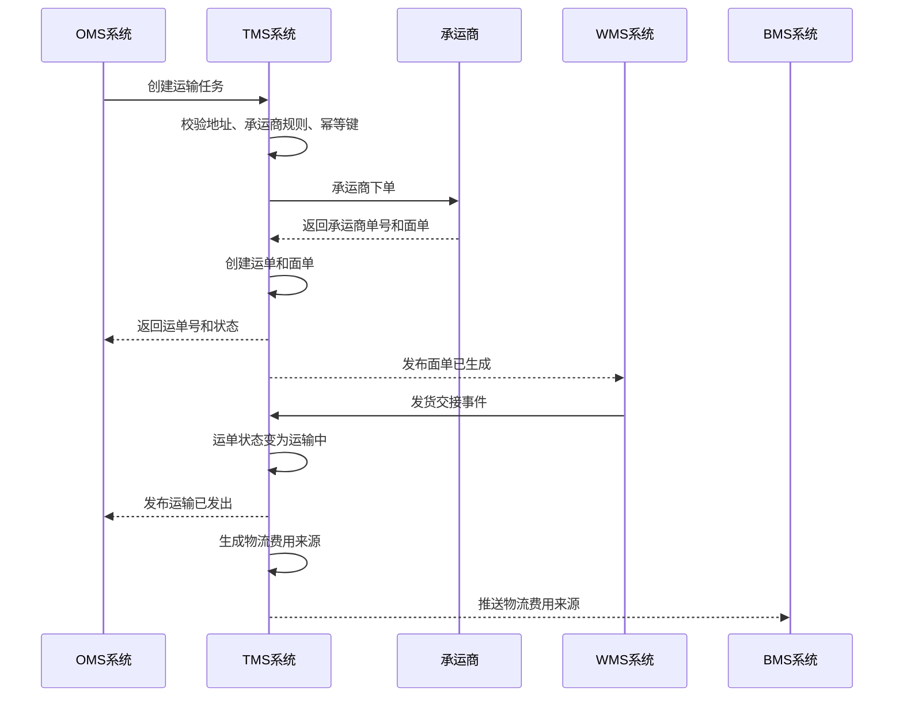
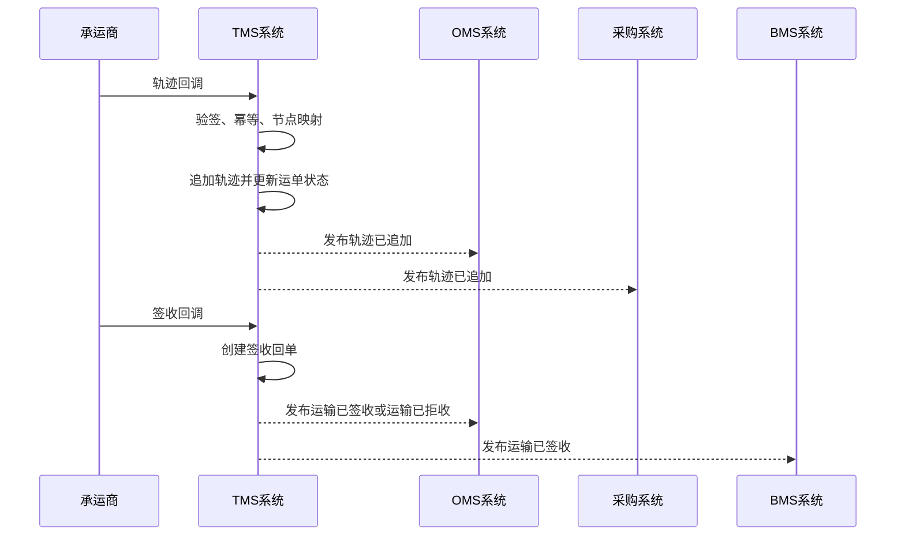

# 06-TMS系统接口设计

> 本文根据 [TMS领域模型](../03-核心业务模型/06-TMS领域模型/01-TMS领域模型.md)、[06-TMS系统产品功能设计](../04-子系统功能设计/06-TMS系统/01-TMS系统产品功能设计.md)、[06-TMS系统数据库设计](../05-子系统数据库设计/06-TMS系统数据库设计.md) 和 [上下文映射与领域事件目录](./00-上下文映射与领域事件目录.md) 设计。接口按 DDD + CQRS 口径拆分：查询接口读取运输读模型，命令接口触发应用服务和运输聚合行为，跨系统接口遵守“TMS 拥有运输事实，其它系统拥有各自业务状态”的边界。

## 1. 设计范围

| 类型 | 范围 | 说明 |
| --- | --- | --- |
| 前端页面接口 | TMS 工作台、运输任务、运单管理、面单管理、轨迹查询、签收管理、物流异常、物流费用来源、承运商接口配置、物流产品规则、回调消息、操作日志、枚举配置 | 面向 TMS 后台 Web 端 |
| 跨系统命令接口 | OMS/采购/供应商/WMS/调拨/退供 -> TMS，TMS -> BMS/权限/主数据/承运商 | 同步创建运输任务、创建运单、取消运单、查询轨迹、生成面单、推送费用来源 |
| 跨系统事件接口 | 主数据/OMS/WMS/采购/供应商 -> TMS，TMS -> OMS/WMS/采购/供应商/BMS | 异步传递运输请求、包裹、交接、轨迹、签收、异常和费用事实 |
| 承运商接口 | TMS -> 承运商，承运商 -> TMS | 下单、取消、面单、轨迹查询、轨迹/签收回调 |
| 不包含 | 库存增减、仓内拣货/上架、OMS 订单履约主状态、采购订单主状态、BMS 结算终审 | TMS 只拥有运输任务、运单、面单、轨迹、签收、物流异常和物流费用来源 |

## 2. DDD 对齐说明

| DDD 关注点 | 本文口径 |
| --- | --- |
| 限界上下文 | TMS 运输管理上下文 |
| 核心聚合 | 运输任务、运单、面单、物流轨迹、签收记录、物流异常、物流费用来源 |
| 查询模型 | TMS 工作台、运输任务列表、运单列表、面单列表、轨迹时间线、签收列表、异常处理列表、费用来源列表、接口日志、操作日志 |
| 命令接口 | 创建运输任务、修改运输任务、取消运输任务、创建运单、取消运单、生成面单、打印面单、同步轨迹、补录轨迹、登记签收、修正签收、登记异常、关闭异常、生成费用来源、推送 BMS |
| 领域事件 | 运输任务已创建、运单已创建、面单已生成、运输已发出、轨迹已追加、运输已到达、运输已签收、运输已拒收、物流异常已登记、物流异常已关闭、物流费用来源已生成、物流费用来源已推送 |
| 数据主权 | TMS 拥有运输任务、运单、包裹、面单、轨迹、签收、物流异常、物流费用来源和承运商接口日志 |
| 幂等规则 | 写接口必须携带 `X-Idempotency-Key`；跨系统创建运输任务以 `sourceSystem + sourceOrderNo + transportScenario + version` 幂等；承运商回调以 `carrierCode + carrierWaybillNo + trackNode + trackAt` 幂等 |

## 3. 通用协议

### 3.1 基础路径

| 场景 | 基础路径 |
| --- | --- |
| 前端页面接口 | `/api/tms/v1` |
| 内部跨系统接口 | `/internal/tms/v1` |
| 开放/承运商回调接口 | `/openapi/tms/v1` |
| 事件消费入口 | `/internal/tms/v1/events` |

### 3.2 通用请求头

| 请求头 | 必填 | 适用接口 | 说明 |
| --- | --- | --- | --- |
| `Authorization` | 是 | 前端接口、内部接口 | `Bearer access_token`，由09-权限系统签发 |
| `X-Tenant-Id` | 否 | 全部 | 租户 ID，单租户可不传 |
| `X-Org-Id` | 是 | 全部 | 当前组织 ID |
| `X-Owner-Id` | 多货主必填 | 页面查询、命令、事件入口 | 货主 ID，用于数据权限和运输归属 |
| `X-Warehouse-Id` | 仓相关操作必填 | 发货、到仓、调拨、退供 | 仓库 ID，用于仓库数据权限 |
| `X-Carrier-Code` | 承运商接口必填 | 承运商回调、接口日志查询 | 物流商编码 |
| `X-Request-Id` | 是 | 全部 | 请求链路 ID |
| `X-Trace-Id` | 否 | 全部 | 分布式链路追踪 ID |
| `X-Idempotency-Key` | 写接口必填 | 命令接口、跨系统命令、事件入口、承运商回调 | 同一业务动作唯一 |
| `X-Source-System` | 跨系统必填 | 跨系统命令、事件入口 | `OMS`、`WMS`、`PURCHASE`、`SUPPLIER`、`INVENTORY`、`MDM`、`BMS`、`TMS` |
| `X-Operator-Id` | 写接口必填 | 命令接口 | 操作人；系统任务传系统账号 |
| `X-Signature` | 承运商回调必填 | 承运商回调 | 回调验签 |
| `X-Data-Scope` | 否 | 前端查询 | 网关或权限中间件解析后的数据范围摘要 |
| `Accept-Language` | 否 | 全部 | `zh-CN` 默认 |

### 3.3 通用响应结构

```json
{
  "success": true,
  "code": "SUCCESS",
  "message": "处理成功",
  "requestId": "REQ202607040001",
  "traceId": "TRACE202607040001",
  "timestamp": "2026-07-04T10:00:00+08:00",
  "data": {}
}
```

分页响应：

```json
{
  "success": true,
  "code": "SUCCESS",
  "message": "查询成功",
  "data": {
    "pageNo": 1,
    "pageSize": 20,
    "total": 128,
    "records": []
  }
}
```

命令响应：

```json
{
  "success": true,
  "code": "SUCCESS",
  "message": "命令已处理",
  "data": {
    "aggregateId": "190001",
    "businessNo": "WB202607040001",
    "status": 2,
    "statusName": "已下单",
    "version": 3,
    "eventId": "EVT202607040001",
    "idempotentHit": false
  }
}
```

### 3.4 HTTP 状态码

| HTTP 状态码 | 场景 | 前端/调用方处理 |
| --- | --- | --- |
| `200` | 查询成功、命令同步处理成功 | 正常刷新页面或继续业务 |
| `201` | 创建运输任务、运单、异常、规则成功 | 跳转详情或刷新列表 |
| `202` | 承运商下单、轨迹同步、费用推送等异步命令已受理 | 展示处理中，轮询任务或等待事件 |
| `204` | 取消、关闭、作废成功且无返回体 | 返回列表或刷新详情 |
| `400` | 请求格式错误、字段类型错误 | 表单提示 |
| `401` | 未登录、Token 过期、承运商签名无效 | 跳转登录或返回认证失败 |
| `403` | 无菜单/按钮/组织/仓库/货主/物流商权限 | 隐藏按钮或提示无权限 |
| `404` | 运输任务、运单、面单、异常、费用来源不存在 | 提示记录不存在 |
| `409` | 乐观锁冲突、幂等内容不一致、状态机冲突、重复回调 | 提示刷新或返回原幂等结果 |
| `422` | 承运商服务不可用、地址不可达、禁运规则命中、运单不可取消 | 展示业务失败原因 |
| `429` | 请求过于频繁 | 稍后重试 |
| `500` | 系统异常或承运商接口异常 | 记录错误并提示稍后重试 |

### 3.5 业务错误码

| 业务码 | HTTP | 含义 |
| --- | --- | --- |
| `SUCCESS` | `200/201` | 成功 |
| `ACCEPTED` | `202` | 已受理异步处理 |
| `VALIDATION_FAILED` | `400` | 字段校验失败 |
| `UNAUTHORIZED` | `401` | 未认证 |
| `SIGNATURE_INVALID` | `401` | 承运商回调签名无效 |
| `FORBIDDEN` | `403` | 无权限 |
| `CARRIER_SCOPE_DENIED` | `403` | 无物流商权限 |
| `WAREHOUSE_SCOPE_DENIED` | `403` | 无仓库权限 |
| `OWNER_SCOPE_DENIED` | `403` | 无货主权限 |
| `NOT_FOUND` | `404` | 资源不存在 |
| `VERSION_CONFLICT` | `409` | 乐观锁版本冲突 |
| `IDEMPOTENCY_CONFLICT` | `409` | 同一幂等键请求内容不一致 |
| `STATE_CONFLICT` | `409` | 当前状态不允许该命令 |
| `CALLBACK_DUPLICATED` | `409` | 承运商回调重复 |
| `CARRIER_SERVICE_UNAVAILABLE` | `422` | 承运商服务不可用 |
| `ADDRESS_UNSERVICEABLE` | `422` | 地址超出服务范围 |
| `RESTRICTED_RULE_HIT` | `422` | 命中禁运规则 |
| `WAYBILL_NOT_CANCELABLE` | `422` | 运单不可取消 |
| `LABEL_NOT_PRINTABLE` | `422` | 面单不可打印 |
| `FEE_SOURCE_ALREADY_PUSHED` | `409` | 费用来源已推送，不允许重算或作废 |
| `EXTERNAL_CALL_FAILED` | `422/500` | 承运商或 BMS 调用失败 |
| `BUSINESS_RULE_FAILED` | `422` | 领域规则不通过 |
| `SYSTEM_ERROR` | `500` | 系统异常 |

## 4. 枚举值约定

接口中的状态枚举与数据库设计保持一致。落库使用数值，接口可同时返回 `status` 和 `statusName`，前端展示名由枚举配置页维护。

| 枚举类型 | 值 | 展示名 | 使用位置 |
| --- | --- | --- | --- |
| `TMS_SOURCE_SYSTEM` | `1` | OMS | 来源系统 |
| `TMS_SOURCE_SYSTEM` | `2` | WMS | 来源系统 |
| `TMS_SOURCE_SYSTEM` | `3` | 采购系统 | 来源系统 |
| `TMS_SOURCE_SYSTEM` | `4` | 供应商系统 | 来源系统 |
| `TMS_SOURCE_SYSTEM` | `5` | 中央库存系统 | 来源系统 |
| `TMS_SOURCE_SYSTEM` | `6` | 人工创建 | 来源系统 |
| `TRANSPORT_SCENARIO` | `1` | 采购到货 | 运输任务、运单、费用来源 |
| `TRANSPORT_SCENARIO` | `2` | 销售发货 | 运输任务、运单、费用来源 |
| `TRANSPORT_SCENARIO` | `3` | 销售退货 | 运输任务、运单、费用来源 |
| `TRANSPORT_SCENARIO` | `4` | 退供应商 | 运输任务、运单、费用来源 |
| `TRANSPORT_SCENARIO` | `5` | 调拨运输 | 运输任务、运单、费用来源 |
| `TRANSPORT_TASK_STATUS` | `1` | 待接单 | 运输任务 |
| `TRANSPORT_TASK_STATUS` | `2` | 已接单 | 运输任务 |
| `TRANSPORT_TASK_STATUS` | `3` | 已创建运单 | 运输任务 |
| `TRANSPORT_TASK_STATUS` | `4` | 运输中 | 运输任务 |
| `TRANSPORT_TASK_STATUS` | `5` | 已签收 | 运输任务 |
| `TRANSPORT_TASK_STATUS` | `6` | 已拒收 | 运输任务 |
| `TRANSPORT_TASK_STATUS` | `7` | 已取消 | 运输任务 |
| `TRANSPORT_TASK_STATUS` | `8` | 异常中 | 运输任务 |
| `WAYBILL_STATUS` | `1` | 待下单 | 运单 |
| `WAYBILL_STATUS` | `2` | 已下单 | 运单 |
| `WAYBILL_STATUS` | `3` | 已揽收 | 运单 |
| `WAYBILL_STATUS` | `4` | 运输中 | 运单 |
| `WAYBILL_STATUS` | `5` | 已到达 | 运单 |
| `WAYBILL_STATUS` | `6` | 已签收 | 运单 |
| `WAYBILL_STATUS` | `7` | 已拒收 | 运单 |
| `WAYBILL_STATUS` | `8` | 已取消 | 运单 |
| `WAYBILL_STATUS` | `9` | 异常中 | 运单 |
| `LABEL_STATUS` | `1` | 待生成 | 面单 |
| `LABEL_STATUS` | `2` | 已生成 | 面单 |
| `LABEL_STATUS` | `3` | 已打印 | 面单 |
| `LABEL_STATUS` | `4` | 已作废 | 面单 |
| `LABEL_STATUS` | `5` | 生成失败 | 面单 |
| `TRACK_NODE` | `1` | 下单 | 轨迹 |
| `TRACK_NODE` | `2` | 揽收 | 轨迹 |
| `TRACK_NODE` | `3` | 发出 | 轨迹 |
| `TRACK_NODE` | `4` | 到达 | 轨迹 |
| `TRACK_NODE` | `5` | 派送 | 轨迹 |
| `TRACK_NODE` | `6` | 签收 | 轨迹 |
| `TRACK_NODE` | `7` | 拒收 | 轨迹 |
| `TRACK_NODE` | `8` | 异常 | 轨迹 |
| `RECEIPT_RESULT` | `1` | 已签收 | 签收回单 |
| `RECEIPT_RESULT` | `2` | 已拒收 | 签收回单 |
| `RECEIPT_RESULT` | `3` | 部分签收 | 签收回单 |
| `RECEIPT_RESULT` | `4` | 签收冲突 | 签收回单 |
| `EXCEPTION_STATUS` | `1` | 已创建 | 物流异常 |
| `EXCEPTION_STATUS` | `2` | 处理中 | 物流异常 |
| `EXCEPTION_STATUS` | `3` | 已升级 | 物流异常 |
| `EXCEPTION_STATUS` | `4` | 已关闭 | 物流异常 |
| `FEE_SOURCE_STATUS` | `1` | 待生成 | 费用来源 |
| `FEE_SOURCE_STATUS` | `2` | 已生成 | 费用来源 |
| `FEE_SOURCE_STATUS` | `3` | 已推送 | 费用来源 |
| `FEE_SOURCE_STATUS` | `4` | 推送失败 | 费用来源 |
| `FEE_SOURCE_STATUS` | `5` | 已作废 | 费用来源 |

## 5. 通用对象字段

### 5.1 分页查询字段

| 字段 | 类型 | 必填 | 说明 |
| --- | --- | --- | --- |
| `pageNo` | int | 是 | 页码，从 1 开始 |
| `pageSize` | int | 是 | 每页条数，支持 10、20、50、100 |
| `sortField` | string | 否 | 排序字段，如 `updatedAt`、`createdAt`、`signedAt`、`exceptionLevel` |
| `sortOrder` | string | 否 | `asc`、`desc`，默认 `desc` |

### 5.2 地址字段

| 字段 | 类型 | 必填 | 说明 |
| --- | --- | --- | --- |
| `name` | string | 是 | 发货方或收货方名称 |
| `phone` | string | 否 | 联系电话 |
| `provinceCode` | string | 否 | 省编码 |
| `cityCode` | string | 否 | 市编码 |
| `districtCode` | string | 否 | 区县编码 |
| `detailAddress` | string | 是 | 详细地址 |

### 5.3 包裹字段

| 字段 | 类型 | 必填 | 说明 |
| --- | --- | --- | --- |
| `packageNo` | string | 否 | TMS 包裹号，新增时可为空 |
| `externalPackageNo` | string | 否 | WMS/来源系统包裹号 |
| `weight` | decimal(18,4) | 否 | 重量 |
| `volume` | decimal(18,4) | 否 | 体积 |
| `lengthCm` | decimal(18,4) | 否 | 长 |
| `widthCm` | decimal(18,4) | 否 | 宽 |
| `heightCm` | decimal(18,4) | 否 | 高 |
| `skuLines[]` | array | 否 | 包裹内商品快照 |

## 6. 前端页面接口

### 6.1 页面接口总览

| 页面 | 调用位置 | 接口 | 权限点 | 领域对象 |
| --- | --- | --- | --- | --- |
| TMS 工作台 | 首屏加载、待办卡片点击 | `GET /api/tms/v1/workbench/summary`、`GET /api/tms/v1/workbench/todos` | `tms:workbench:read` | 运输任务、运单、异常、费用来源 |
| 运输任务页 | 查询、新增、编辑、接单、创建运单、取消 | `GET /api/tms/v1/transport-tasks`、`POST /api/tms/v1/transport-tasks`、`PUT /api/tms/v1/transport-tasks/{taskNo}`、`POST /api/tms/v1/transport-tasks/{taskNo}/accept`、`POST /api/tms/v1/transport-tasks/{taskNo}/create-waybill`、`POST /api/tms/v1/transport-tasks/{taskNo}/cancel` | `tms:transport_task:*` | 运输任务 |
| 运单管理页 | 查询、详情、创建、取消、同步轨迹、生成费用 | `GET /api/tms/v1/waybills`、`GET /api/tms/v1/waybills/{waybillNo}`、`POST /api/tms/v1/waybills`、`POST /api/tms/v1/waybills/{waybillNo}/cancel`、`POST /api/tms/v1/waybills/{waybillNo}/sync-tracks`、`POST /api/tms/v1/waybills/{waybillNo}/generate-fee-source` | `tms:waybill:*` | 运单 |
| 面单管理页 | 查询、生成、打印、补打、作废 | `GET /api/tms/v1/shipping-labels`、`POST /api/tms/v1/waybills/{waybillNo}/labels`、`POST /api/tms/v1/shipping-labels/{labelNo}/print`、`POST /api/tms/v1/shipping-labels/{labelNo}/void` | `tms:label:*` | 面单 |
| 轨迹查询页 | 查询轨迹、同步、补录 | `GET /api/tms/v1/waybills/{waybillNo}/tracks`、`POST /api/tms/v1/waybills/{waybillNo}/sync-tracks`、`POST /api/tms/v1/waybills/{waybillNo}/tracks` | `tms:track:*` | 物流轨迹 |
| 签收管理页 | 查询、修正、上传证明、通知来源系统 | `GET /api/tms/v1/delivery-receipts`、`POST /api/tms/v1/delivery-receipts/{receiptNo}/correct`、`POST /api/tms/v1/delivery-receipts/{receiptNo}/proof`、`POST /api/tms/v1/delivery-receipts/{receiptNo}/notify-source` | `tms:receipt:*` | 签收回单 |
| 物流异常页 | 查询、新增、分派、处理、升级、关闭 | `GET /api/tms/v1/exceptions`、`POST /api/tms/v1/exceptions`、`POST /api/tms/v1/exceptions/{exceptionNo}/assign`、`POST /api/tms/v1/exceptions/{exceptionNo}/process`、`POST /api/tms/v1/exceptions/{exceptionNo}/close` | `tms:exception:*` | 物流异常 |
| 物流费用来源页 | 查询、生成、重算、推送BMS、作废 | `GET /api/tms/v1/fee-sources`、`POST /api/tms/v1/waybills/{waybillNo}/generate-fee-source`、`POST /api/tms/v1/fee-sources/{feeSourceNo}/recalculate`、`POST /api/tms/v1/fee-sources/{feeSourceNo}/push-bms`、`POST /api/tms/v1/fee-sources/{feeSourceNo}/void` | `tms:fee_source:*` | 物流费用来源 |
| 承运商接口配置页 | 查询、新增、修改、测试、启停用 | `GET /api/tms/v1/carrier-integrations`、`POST /api/tms/v1/carrier-integrations`、`PUT /api/tms/v1/carrier-integrations/{configId}`、`POST /api/tms/v1/carrier-integrations/{configId}/test`、`POST /api/tms/v1/carrier-integrations/{configId}/enable` | `tms:carrier_integration:*` | 承运商接口配置 |
| 物流产品规则页 | 查询、新增、修改、启停用 | `GET /api/tms/v1/logistics-rules`、`POST /api/tms/v1/logistics-rules`、`PUT /api/tms/v1/logistics-rules/{ruleCode}`、`POST /api/tms/v1/logistics-rules/{ruleCode}/enable`、`POST /api/tms/v1/logistics-rules/{ruleCode}/disable` | `tms:logistics_rule:*` | 物流产品规则 |
| 回调消息页 | 查询、详情、重放 | `GET /api/tms/v1/callback-messages`、`GET /api/tms/v1/callback-messages/{messageId}`、`POST /api/tms/v1/callback-messages/{messageId}/replay` | `tms:callback_message:*` | 承运商回调 |
| 操作日志页 | 查询、详情、导出 | `GET /api/tms/v1/operation-logs`、`GET /api/tms/v1/operation-logs/{logId}`、`POST /api/tms/v1/operation-logs/export` | `tms:audit_log:read` | 操作审计 |
| 枚举配置页 | 查询、新增、编辑、排序、停用 | `GET /api/tms/v1/enums`、`POST /api/tms/v1/enums`、`PUT /api/tms/v1/enums/{enumItemId}`、`POST /api/tms/v1/enums/sort`、`POST /api/tms/v1/enums/{enumItemId}/disable` | `tms:enum:*` | 枚举配置 |

### 6.2 TMS 工作台接口

#### 查询工作台汇总

| 项 | 设计 |
| --- | --- |
| 方法 | `GET` |
| 路径 | `/api/tms/v1/workbench/summary` |
| 调用页面 | TMS 工作台首屏加载 |
| 调用时机 | 用户进入 `/tms/workbench`，或切换组织、仓库、货主、物流商、时间范围后 |
| 权限点 | `tms:workbench:read` |
| 数据变化 | 无，只读取读模型 |

请求参数：

| 字段 | 类型 | 必填 | 说明 |
| --- | --- | --- | --- |
| `warehouseIds` | long[] | 否 | 仓库范围 |
| `ownerId` | long | 否 | 货主 |
| `carrierCode` | string | 否 | 物流商 |
| `dateFrom` | date | 否 | 起始日期 |
| `dateTo` | date | 否 | 结束日期 |

响应字段：

| 字段 | 类型 | 说明 |
| --- | --- | --- |
| `pendingTaskCount` | int | 待接单运输任务数 |
| `pendingWaybillCount` | int | 待创建运单数 |
| `pendingLabelCount` | int | 待生成/待打印面单数 |
| `inTransitCount` | int | 在途运单数 |
| `signedTodayCount` | int | 今日签收数 |
| `exceptionOpenCount` | int | 未关闭异常数 |
| `feeSourcePendingPushCount` | int | 待推送 BMS 费用来源数 |

状态码：`200`、`401`、`403`、`500`。

### 6.3 运输任务接口

#### 查询运输任务列表

| 项 | 设计 |
| --- | --- |
| 方法 | `GET` |
| 路径 | `/api/tms/v1/transport-tasks` |
| 调用页面 | 运输任务页查询、分页、排序 |
| 权限点 | `tms:transport_task:read` |
| 数据变化 | 无 |

请求参数：`transportTaskNo`、`sourceSystem`、`sourceOrderNo`、`transportScenario`、`taskStatus`、`carrierCode`、`warehouseId`、`ownerId`、`expectedShipFrom/To`、`expectedArriveFrom/To`、`pageNo/pageSize/sortField/sortOrder`。

响应字段：`records[].transportTaskNo`、`sourceSystem/sourceSystemName`、`sourceOrderNo`、`transportScenario/scenarioName`、`taskStatus/statusName`、`carrierCode/carrierName`、`packageCount`、`totalWeight`、`expectedShipAt`、`expectedArriveAt`、`exceptionFlag`、`version`。

#### 创建运输任务

| 项 | 设计 |
| --- | --- |
| 方法 | `POST` |
| 路径 | `/api/tms/v1/transport-tasks` |
| 调用页面 | 运输任务新增页保存；也可由跨系统接口调用 |
| 权限点 | `tms:transport_task:create` |
| 领域动作 | 创建运输任务 |
| 数据变化 | 新增 `tms_transport_task`，状态为 `1 待接单`，写入领域事件 `运输任务已创建` |

请求字段：

| 字段 | 类型 | 必填 | 说明 |
| --- | --- | --- | --- |
| `sourceSystem` | int | 是 | `TMS_SOURCE_SYSTEM` |
| `sourceOrderNo` | string | 是 | 来源单号 |
| `sourceOrderType` | int | 是 | `TMS_SOURCE_ORDER_TYPE` |
| `transportScenario` | int | 是 | `TRANSPORT_SCENARIO` |
| `carrierCode` | string | 否 | 指定物流商，不传则按规则选择 |
| `logisticsProductCode` | string | 否 | 指定物流产品 |
| `shipper` | object | 是 | 发货方地址对象 |
| `receiver` | object | 是 | 收货方地址对象 |
| `packages[]` | array | 否 | 包裹信息，WMS 包装完成后必填 |
| `expectedShipAt` | datetime | 否 | 预计发货时间 |
| `expectedArriveAt` | datetime | 否 | 预计到达时间 |
| `remark` | string | 否 | 备注 |

响应字段：`transportTaskId`、`transportTaskNo`、`taskStatus/statusName`、`carrierCode`、`version`、`eventId`、`idempotentHit`。

状态码：`201`、`400`、`401`、`403`、`409`、`422`、`500`。

#### 接单、修改、取消、创建运单

| 接口 | 方法 | 路径 | 调用时机 | 请求字段 | 响应字段 | 事件 |
| --- | --- | --- | --- | --- | --- | --- |
| 修改运输任务 | `PUT` | `/api/tms/v1/transport-tasks/{taskNo}` | 任务未创建运单前修改 | `carrierCode`、`logisticsProductCode`、`shipper`、`receiver`、`packages[]`、`expectedShipAt`、`expectedArriveAt`、`version` | `transportTaskNo`、`taskStatus`、`version` | 可选：运输任务已修改 |
| 接单 | `POST` | `/api/tms/v1/transport-tasks/{taskNo}/accept` | 行内“接单”或系统自动接单 | `acceptedAt`、`version` | `transportTaskNo`、`taskStatus=2`、`version` | 运输任务已接单 |
| 取消任务 | `POST` | `/api/tms/v1/transport-tasks/{taskNo}/cancel` | 来源系统取消或页面取消 | `reasonCode`、`reason`、`version` | `transportTaskNo`、`taskStatus=7`、`version` | 运输任务已取消 |
| 创建运单 | `POST` | `/api/tms/v1/transport-tasks/{taskNo}/create-waybill` | 行内“创建运单” | `carrierCode`、`logisticsProductCode`、`packages[]`、`version` | `waybillNo`、`carrierWaybillNo`、`waybillStatus`、`labelNos[]` | 运单已创建、面单已生成 |

状态码：`200`、`202`、`400`、`401`、`403`、`404`、`409`、`422`、`500`。

### 6.4 运单接口

| 接口 | 方法 | 路径 | 页面调用位置 | 权限点 | 数据变化 |
| --- | --- | --- | --- | --- | --- |
| 查询运单列表 | `GET` | `/api/tms/v1/waybills` | 运单管理页查询、分页 | `tms:waybill:read` | 无 |
| 查询运单详情 | `GET` | `/api/tms/v1/waybills/{waybillNo}` | 详情页打开 | `tms:waybill:read` | 无 |
| 手工创建运单 | `POST` | `/api/tms/v1/waybills` | 运单新增页保存 | `tms:waybill:create` | 创建运单，可能调用承运商下单 |
| 取消运单 | `POST` | `/api/tms/v1/waybills/{waybillNo}/cancel` | 行内“取消” | `tms:waybill:cancel` | 状态变为已取消或进入取消失败异常 |
| 同步轨迹 | `POST` | `/api/tms/v1/waybills/{waybillNo}/sync-tracks` | 行内“同步轨迹” | `tms:waybill:track_sync` | 追加轨迹，更新运单最新轨迹 |
| 生成费用来源 | `POST` | `/api/tms/v1/waybills/{waybillNo}/generate-fee-source` | 行内“生成费用” | `tms:waybill:fee_generate` | 创建或更新费用来源 |

查询请求字段：`waybillNo`、`carrierWaybillNo`、`transportTaskNo`、`sourceOrderNo`、`carrierCode`、`transportScenario`、`waybillStatus`、`exceptionFlag`、`feeSourceStatus`、`shippedFrom/To`、`signedFrom/To`、`pageNo/pageSize/sortField/sortOrder`。

详情响应字段：`waybillNo`、`carrierWaybillNo`、`transportTaskNo`、`sourceSystem/sourceOrderNo`、`transportScenario/scenarioName`、`waybillStatus/statusName`、`shipper`、`receiver`、`packages[]`、`latestTrackDesc`、`latestTrackAt`、`tracks[]`、`receipt`、`exceptions[]`、`feeSource`、`statusTimeline[]`、`eventTimeline[]`、`operationLogs[]`、`version`。

创建请求字段：同创建运输任务，但 `sourceOrderNo`、`carrierCode`、`shipper`、`receiver`、`packages[]` 必填；如果已有运输任务则传 `transportTaskNo`。

取消请求字段：`cancelReasonCode`、`cancelReason`、`notifySource`、`version`。

状态码：`200`、`201`、`202`、`400`、`401`、`403`、`404`、`409`、`422`、`500`。

### 6.5 面单接口

| 接口 | 方法 | 路径 | 页面调用位置 | 权限点 | 数据变化 |
| --- | --- | --- | --- | --- | --- |
| 查询面单列表 | `GET` | `/api/tms/v1/shipping-labels` | 面单管理页查询 | `tms:label:read` | 无 |
| 生成面单 | `POST` | `/api/tms/v1/waybills/{waybillNo}/labels` | 运单详情或 WMS 打包后 | `tms:label:generate` | 新增或更新面单 |
| 打印/补打面单 | `POST` | `/api/tms/v1/shipping-labels/{labelNo}/print` | 面单列表、WMS 复核包装 | `tms:label:print` | 打印次数 +1，写操作日志 |
| 作废面单 | `POST` | `/api/tms/v1/shipping-labels/{labelNo}/void` | 行内“作废” | `tms:label:void` | 面单状态变为已作废 |

生成请求字段：`packages[]`、`templateCode`、`forceRegenerate`、`version`。

打印请求字段：`printerCode`、`printScene`、`reason`；响应字段：`labelNo`、`labelUrl`、`labelData`、`printCount`、`lastPrintedAt`。

状态码：`200`、`201`、`202`、`400`、`401`、`403`、`404`、`409`、`422`、`500`。

### 6.6 轨迹接口

| 接口 | 方法 | 路径 | 页面调用位置 | 权限点 | 数据变化 |
| --- | --- | --- | --- | --- | --- |
| 查询轨迹 | `GET` | `/api/tms/v1/waybills/{waybillNo}/tracks` | 轨迹页、各系统查看轨迹弹窗 | `tms:track:read` | 无 |
| 主动同步轨迹 | `POST` | `/api/tms/v1/waybills/{waybillNo}/sync-tracks` | 行内“同步” | `tms:track:sync` | 调用承运商并追加轨迹 |
| 人工补录轨迹 | `POST` | `/api/tms/v1/waybills/{waybillNo}/tracks` | 轨迹页“补录” | `tms:track:append` | 新增轨迹，可能推进运单状态 |

补录请求字段：

| 字段 | 类型 | 必填 | 说明 |
| --- | --- | --- | --- |
| `trackNode` | int | 是 | `TRACK_NODE` |
| `trackDesc` | string | 是 | 轨迹描述 |
| `trackLocation` | string | 否 | 轨迹地点 |
| `trackAt` | datetime | 是 | 轨迹发生时间 |
| `reason` | string | 是 | 人工补录原因 |

响应字段：`waybillNo`、`latestTrackNode`、`latestTrackDesc`、`latestTrackAt`、`waybillStatus/statusName`、`eventId`。

状态码：`200`、`202`、`400`、`401`、`403`、`404`、`409`、`422`、`500`。

### 6.7 签收接口

| 接口 | 方法 | 路径 | 页面调用位置 | 权限点 | 数据变化 |
| --- | --- | --- | --- | --- | --- |
| 查询签收列表 | `GET` | `/api/tms/v1/delivery-receipts` | 签收管理页查询 | `tms:receipt:read` | 无 |
| 查询签收详情 | `GET` | `/api/tms/v1/delivery-receipts/{receiptNo}` | 详情页打开 | `tms:receipt:read` | 无 |
| 修正签收 | `POST` | `/api/tms/v1/delivery-receipts/{receiptNo}/correct` | 详情页“签收修正” | `tms:receipt:correct` | 更新签收结果，写审计，发布修正相关事件 |
| 上传签收证明 | `POST` | `/api/tms/v1/delivery-receipts/{receiptNo}/proof` | 详情页上传证明 | `tms:receipt:proof_upload` | 更新证明地址 |
| 通知来源系统 | `POST` | `/api/tms/v1/delivery-receipts/{receiptNo}/notify-source` | 异常重试或人工通知 | `tms:receipt:notify_source` | 更新通知状态 |

修正请求字段：`receiptResult`、`signedBy`、`signedAt`、`rejectReason`、`proofUrl`、`correctReason`、`version`。

状态码：`200`、`202`、`400`、`401`、`403`、`404`、`409`、`422`、`500`。

### 6.8 物流异常接口

| 接口 | 方法 | 路径 | 页面调用位置 | 权限点 | 数据变化 |
| --- | --- | --- | --- | --- | --- |
| 查询异常列表 | `GET` | `/api/tms/v1/exceptions` | 物流异常页查询 | `tms:exception:read` | 无 |
| 新增异常 | `POST` | `/api/tms/v1/exceptions` | 新增异常、运单详情登记异常 | `tms:exception:create` | 新增异常，运单 `exceptionFlag=1` |
| 分派异常 | `POST` | `/api/tms/v1/exceptions/{exceptionNo}/assign` | 行内“分派” | `tms:exception:assign` | 更新处理人和状态 |
| 处理异常 | `POST` | `/api/tms/v1/exceptions/{exceptionNo}/process` | 详情页“处理” | `tms:exception:process` | 写处理记录 |
| 关闭异常 | `POST` | `/api/tms/v1/exceptions/{exceptionNo}/close` | 行内“关闭” | `tms:exception:close` | 状态变为已关闭，必要时生成费用影响 |

新增请求字段：`waybillNo`、`exceptionType`、`exceptionLevel`、`responsibleParty`、`description`、`handlerId`、`feeImpactFlag`。

关闭请求字段：`handleResult`、`responsibleParty`、`feeImpactFlag`、`feeImpactAmount`、`version`。

状态码：`200`、`201`、`400`、`401`、`403`、`404`、`409`、`422`、`500`。

### 6.9 物流费用来源接口

| 接口 | 方法 | 路径 | 页面调用位置 | 权限点 | 数据变化 |
| --- | --- | --- | --- | --- | --- |
| 查询费用来源列表 | `GET` | `/api/tms/v1/fee-sources` | 物流费用来源页查询 | `tms:fee_source:read` | 无 |
| 查询费用来源详情 | `GET` | `/api/tms/v1/fee-sources/{feeSourceNo}` | 详情页打开 | `tms:fee_source:read` | 无 |
| 重算费用来源 | `POST` | `/api/tms/v1/fee-sources/{feeSourceNo}/recalculate` | 行内“重新计算” | `tms:fee_source:recalculate` | 更新费用项和金额 |
| 推送 BMS | `POST` | `/api/tms/v1/fee-sources/{feeSourceNo}/push-bms` | 行内“推送BMS” | `tms:fee_source:push_bms` | 调用 BMS 接收接口，更新推送状态 |
| 作废费用来源 | `POST` | `/api/tms/v1/fee-sources/{feeSourceNo}/void` | 行内“作废” | `tms:fee_source:void` | 状态变为已作废 |

查询请求字段：`feeSourceNo`、`waybillNo`、`carrierCode`、`transportScenario`、`feeSourceStatus`、`settlementDirection`、`generatedFrom/To`、`pushedFrom/To`、`pageNo/pageSize/sortField/sortOrder`。

推送请求字段：`targetSystem=BMS`、`forcePush`、`reason`、`version`。

响应字段：`feeSourceNo`、`waybillNo`、`carrierCode`、`chargeWeight`、`baseFee`、`extraFee`、`deductionFee`、`totalAmount`、`currency`、`feeItems[]`、`feeSourceStatus/statusName`、`bmsReceiveNo`、`version`。

状态码：`200`、`202`、`400`、`401`、`403`、`404`、`409`、`422`、`500`。

## 7. 跨系统命令接口

### 7.1 创建运输任务

| 项 | 设计 |
| --- | --- |
| 方法 | `POST` |
| 路径 | `/internal/tms/v1/transport-tasks` |
| 调用方 | OMS、采购、供应商、WMS、调拨服务 |
| 调用场景 | 销售配送请求、销售退货取件、采购到货发运、退供应商发货、调拨运输 |
| 幂等键 | `sourceSystem + sourceOrderNo + transportScenario + sourceVersion` |
| 数据变化 | 创建运输任务，状态为待接单；需要自动下单时继续创建运单 |

请求字段同 `6.3 创建运输任务`，额外包含：

| 字段 | 类型 | 必填 | 说明 |
| --- | --- | --- | --- |
| `sourceVersion` | int | 是 | 来源单据版本 |
| `autoCreateWaybill` | boolean | 否 | 是否自动创建运单 |
| `autoGenerateLabel` | boolean | 否 | 是否自动生成面单 |
| `callbackEventTypes[]` | string[] | 否 | 来源系统关注的回调事件 |

响应字段：`transportTaskNo`、`waybillNo`、`carrierWaybillNo`、`labelNos[]`、`taskStatus/statusName`、`waybillStatus/statusName`、`eventId`。

### 7.2 创建/取消运单

| 接口 | 方法 | 路径 | 调用方 | 调用场景 | 返回 |
| --- | --- | --- | --- | --- | --- |
| 创建运单 | `POST` | `/internal/tms/v1/waybills` | OMS、WMS、采购 | 已有运输任务或包裹信息后创建承运商运单 | 运单号、承运商单号、面单 |
| 取消运单 | `POST` | `/internal/tms/v1/waybills/{waybillNo}/cancel` | OMS、采购、调拨、退供 | 来源业务取消、拦截发货、退供取消 | 取消成功/失败原因 |

创建运单请求字段：`transportTaskNo`、`sourceSystem`、`sourceOrderNo`、`transportScenario`、`carrierCode`、`logisticsProductCode`、`shipper`、`receiver`、`packages[]`、`sourceVersion`。

取消运单请求字段：`cancelReasonCode`、`cancelReason`、`sourceCancelNo`、`sourceVersion`。

### 7.3 查询轨迹与签收

| 接口 | 方法 | 路径 | 调用方 | 调用场景 | 响应 |
| --- | --- | --- | --- | --- | --- |
| 查询运单摘要 | `GET` | `/internal/tms/v1/waybills/{waybillNo}` | OMS、采购、WMS、BMS | 详情页跨系统查看 | 运单摘要、最新轨迹、签收、异常 |
| 查询来源单运输 | `GET` | `/internal/tms/v1/waybills/by-source` | OMS、采购、供应商 | 按来源单查询运单 | 多个运单摘要 |
| 查询轨迹 | `GET` | `/internal/tms/v1/waybills/{waybillNo}/tracks` | OMS、采购、供应商、WMS、BMS | 查看物流时间线 | 轨迹列表 |
| 查询签收 | `GET` | `/internal/tms/v1/waybills/{waybillNo}/receipt` | OMS、采购、供应商、BMS | 判断签收/拒收 | 签收结果和证明 |

状态码：`200`、`401`、`403`、`404`、`500`。

### 7.4 BMS 接收费用来源

TMS 推送 BMS 使用 BMS 内部接口，TMS 本侧需要定义调用契约和失败补偿。

| 项 | 设计 |
| --- | --- |
| BMS接口 | `POST /internal/bms/v1/fee-source-events` |
| 调用时机 | 费用来源生成后自动推送，或费用来源页人工重推 |
| 幂等键 | `feeSourceNo + waybillNo + feeSourceVersion` |
| TMS数据变化 | 推送成功：`feeSourceStatus=3 已推送`，写入 `bmsReceiveNo`；失败：`feeSourceStatus=4 推送失败`，保留失败原因 |

请求字段：`feeSourceNo`、`sourceSystem=TMS`、`waybillNo`、`carrierCode`、`transportScenario`、`settlementDirection`、`chargeWeight`、`baseFee`、`extraFee`、`deductionFee`、`totalAmount`、`currency`、`feeItems[]`、`occurredAt`。

## 8. 事件入口与承运商回调

### 8.1 TMS 消费事件入口

| 接口 | 方法 | 路径 | 来源系统 | 用途 |
| --- | --- | --- | --- | --- |
| 消费领域事件 | `POST` | `/internal/tms/v1/events` | OMS、WMS、采购、供应商、主数据 | 接收销售配送请求、包装完成、发货交接、ASN、物流商启停用等事件 |

请求字段：

| 字段 | 类型 | 必填 | 说明 |
| --- | --- | --- | --- |
| `eventId` | string | 是 | 来源事件 ID |
| `eventType` | string | 是 | 事件类型 |
| `eventName` | string | 是 | 事件中文名 |
| `sourceSystem` | string | 是 | 来源系统 |
| `aggregateId` | string | 是 | 来源聚合 ID |
| `aggregateNo` | string | 否 | 来源业务单号 |
| `occurredAt` | datetime | 是 | 业务发生时间 |
| `payload` | object | 是 | 事件载荷 |

响应字段：`consumeLogId`、`consumeStatus`、`idempotentHit`、`createdBusinessNo`、`failReason`。

### 8.2 承运商回调接口

| 接口 | 方法 | 路径 | 调用方 | 用途 |
| --- | --- | --- | --- | --- |
| 轨迹回调 | `POST` | `/openapi/tms/v1/carrier-callbacks/{carrierCode}/tracks` | 承运商 | 回传物流轨迹 |
| 签收回调 | `POST` | `/openapi/tms/v1/carrier-callbacks/{carrierCode}/receipts` | 承运商 | 回传签收、拒收、部分签收 |
| 异常回调 | `POST` | `/openapi/tms/v1/carrier-callbacks/{carrierCode}/exceptions` | 承运商 | 回传延误、破损、丢失等异常 |

轨迹回调请求字段：

| 字段 | 类型 | 必填 | 说明 |
| --- | --- | --- | --- |
| `carrierWaybillNo` | string | 是 | 承运商单号 |
| `trackNode` | int/string | 是 | 承运商节点，TMS 做映射 |
| `trackDesc` | string | 是 | 轨迹描述 |
| `trackLocation` | string | 否 | 轨迹地点 |
| `trackAt` | datetime | 是 | 轨迹发生时间 |
| `rawEventId` | string | 否 | 承运商事件 ID |

签收回调请求字段：`carrierWaybillNo`、`receiptResult`、`signedBy`、`signedAt`、`rejectReason`、`proofUrl`、`rawEventId`。

异常回调请求字段：`carrierWaybillNo`、`exceptionType`、`exceptionLevel`、`description`、`occurredAt`、`rawEventId`。

响应字段：`accepted`、`message`、`idempotentHit`、`tmsEventId`。

状态码：`200`、`202`、`400`、`401`、`409`、`422`、`500`。

## 9. TMS 发布事件

TMS 使用本地消息表 `tms_domain_event` 发布事件。事件编码用英文稳定类型，事件名用中文业务事实。

| 事件名 | 事件类型 | 触发接口/动作 | 主要载荷 | 消费方 |
| --- | --- | --- | --- | --- |
| 运输任务已创建 | `TransportTaskCreated` | 创建运输任务 | `transportTaskNo`、`sourceSystem`、`sourceOrderNo`、`transportScenario` | 来源系统、WMS、读模型 |
| 运单已创建 | `WaybillCreated` | 创建运单成功 | `waybillNo`、`carrierCode`、`carrierWaybillNo`、`sourceOrderNo`、`packages[]` | OMS、WMS、采购、供应商 |
| 面单已生成 | `ShippingLabelGenerated` | 生成面单成功 | `labelNo`、`waybillNo`、`packageNo`、`labelUrl` | WMS |
| 运输已发出 | `TransportShipped` | 发货交接或揽收 | `waybillNo`、`carrierCode`、`shippedAt`、`warehouseId` | OMS、采购、BMS |
| 轨迹已追加 | `TrackingAppended` | 回调/同步/补录轨迹 | `waybillNo`、`trackNode`、`trackDesc`、`trackAt` | OMS、采购、供应商、客服读模型 |
| 运输已到达 | `TransportArrived` | 到达目的地 | `waybillNo`、`arrivedAt`、`location` | WMS、采购、OMS |
| 运输已签收 | `TransportSigned` | 签收成功 | `waybillNo`、`signedAt`、`signedBy`、`proofUrl` | OMS、采购、供应商、BMS |
| 运输已拒收 | `TransportRejected` | 拒收 | `waybillNo`、`rejectReason`、`rejectAt` | OMS、采购、供应商、BMS |
| 物流异常已登记 | `LogisticsExceptionRegistered` | 新增异常 | `exceptionNo`、`waybillNo`、`exceptionType`、`level`、`responsibleParty` | OMS、采购、WMS、BMS |
| 物流异常已关闭 | `LogisticsExceptionClosed` | 关闭异常 | `exceptionNo`、`closeResult`、`closedAt`、`feeImpactFlag` | 来源系统、BMS |
| 物流费用来源已生成 | `LogisticsFeeSourceGenerated` | 生成费用来源 | `feeSourceNo`、`waybillNo`、`carrierCode`、`totalAmount`、`currency` | BMS |
| 物流费用来源已推送 | `LogisticsFeeSourcePushed` | 推送 BMS 成功 | `feeSourceNo`、`bmsReceiveNo`、`pushedAt` | BMS、TMS读模型 |

## 10. 时序图

### 10.1 销售发货创建运单



### 10.2 承运商轨迹和签收回调



## 继续上下文

当前结论：TMS 接口以运输任务、运单、面单、轨迹、签收、异常、费用来源为核心；TMS 是运输事实源，不直接改库存、不终审结算。
关键假设：承运商接口由 TMS 统一封装；OMS/WMS/采购/供应商通过内部接口或事件与 TMS 协作。
待决问题：是否需要支持多段运输、自有车队、司机端、GPS 实时定位和承运商电子围栏。
下一步：基于本文与 TMS 事件生产消费设计生成 TMS 前端原型页面，或继续细化承运商回调、面单下单、费用来源推送的错误码和测试用例。
