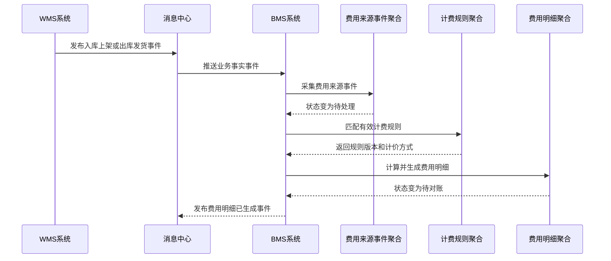
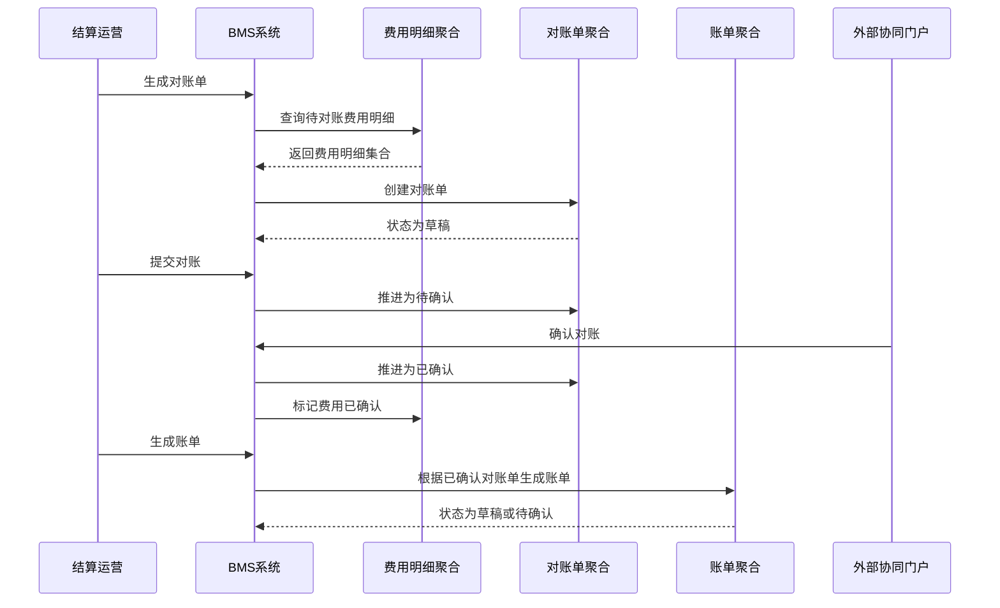
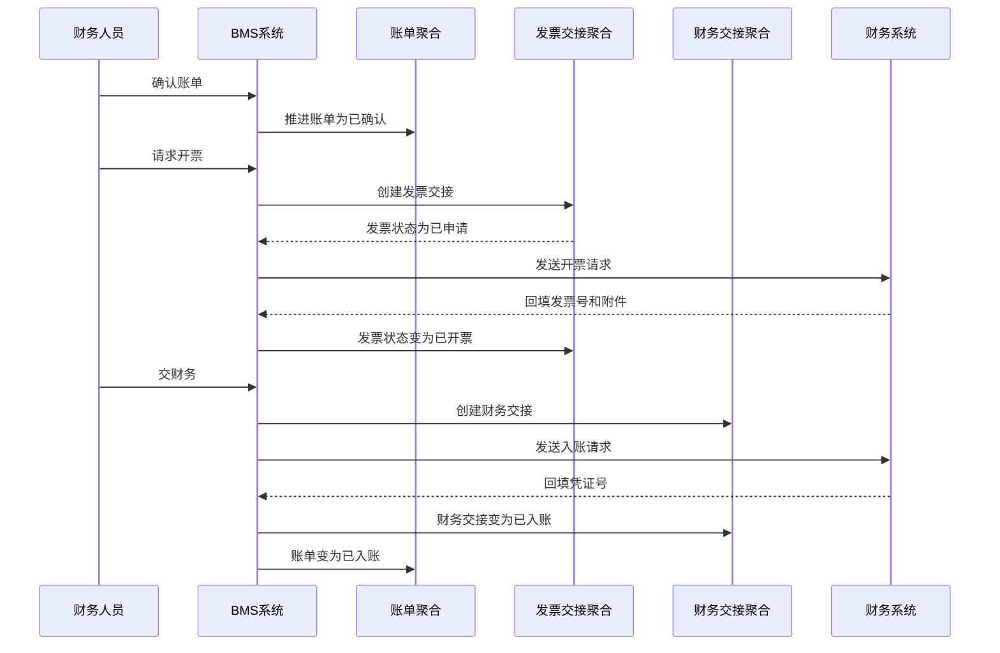
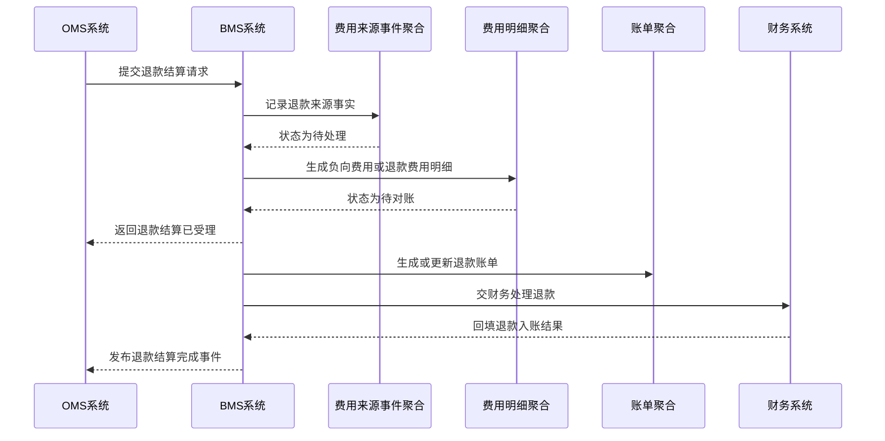
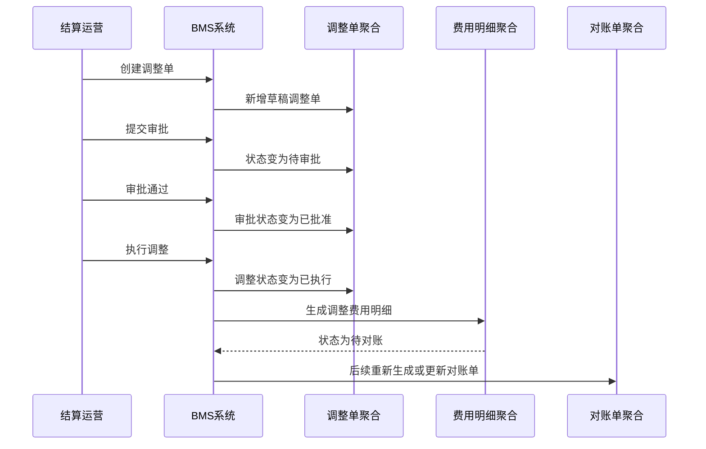

# 07-BMS系统接口设计

> 本文根据 [BMS领域模型](../03-核心业务模型/07-BMS领域模型/01-BMS领域模型.md)、[07-BMS系统产品功能设计](../04-子系统功能设计/07-BMS系统/01-BMS系统产品功能设计.md)、[07-BMS系统数据库设计](../05-子系统数据库设计/07-BMS系统数据库设计.md) 和 [上下文映射与领域事件目录](./00-上下文映射与领域事件目录.md) 设计。接口按 DDD + CQRS 口径拆分：查询接口读取 BMS 结算读模型，命令接口触发应用服务和聚合行为，跨系统接口遵守“业务事实由来源系统拥有，费用、对账、账单和财务交接由 BMS 拥有”的边界。

## 1. 设计范围

| 类型 | 范围 | 说明 |
| --- | --- | --- |
| 前端页面接口 | BMS 工作台、计费对象、计费规则、费用采集、费用明细、调整单、对账单、账单、发票交接、财务交接、结算报表、操作日志、枚举配置 | 面向 BMS 后台 Web 端和外部协同门户 |
| 跨系统命令接口 | WMS/OMS/中央库存/TMS/主数据/财务 -> BMS，BMS -> 财务系统/发票系统 | 采集费用来源事件、处理退款结算请求、外部确认对账、请求开票、交财务入账 |
| 跨系统事件接口 | BMS 消费业务事实事件，BMS 发布费用、对账、账单、发票、财务交接事件 | 用异步事件连接仓储作业、库存账务、订单售后、财务入账和 BI 报表 |
| 不包含 | WMS 仓内作业、OMS 订单履约、中央库存余额记账、资金支付、财务总账、税控开票实现 | BMS 只拥有结算侧事实，不替代业务源系统和财务总账 |

## 2. DDD 对齐说明

| DDD 关注点 | 本文口径 |
| --- | --- |
| 限界上下文 | BMS 上下文 |
| 核心聚合 | 计费对象、计费规则、费用来源事件、费用明细、费用调整单、对账单、账单、发票交接、财务交接 |
| 查询模型 | 工作台待办、计费对象列表、计费规则列表、费用采集明细、费用明细列表、调整单列表、对账单列表、账单列表、发票列表、财务交接列表、结算报表、操作日志 |
| 命令接口 | 创建/启停计费对象、创建/发布/停用计费规则、采集/重放/忽略费用来源事件、重算/作废费用明细、创建/提交/审批/执行调整单、生成/提交/确认/关闭对账单、生成/确认/关闭账单、请求开票、回填发票、交财务、回填凭证 |
| 领域事件 | 计费对象已启用、计费规则已发布、费用来源事件已采集、可计费事实已识别、费用明细已生成、费用已调整、对账单已确认、账单已生成、账单已确认、发票已请求、财务交接已完成 |
| 数据主权 | BMS 拥有计费对象、计费规则、费用来源事件处理状态、费用明细、调整、对账、账单、发票交接和财务交接状态 |
| 幂等规则 | 写接口必须携带 `X-Idempotency-Key`；来源事件以 `sourceSystem + sourceEventId + sourceOrderNo + eventType` 幂等；费用明细以 `sourceEventId + feeType + ruleVersion + billingPeriod` 幂等；对账单以 `billingObjectCode + settlementDirection + billingPeriod + bizType` 幂等 |

## 3. 通用协议

### 3.1 基础路径

| 场景 | 基础路径 |
| --- | --- |
| 前端页面接口 | `/api/bms/v1` |
| 外部协同/开放接口 | `/openapi/bms/v1` |
| 内部跨系统接口 | `/internal/bms/v1` |
| 事件消费入口 | `/internal/bms/v1/events` |

### 3.2 通用请求头

| 请求头 | 必填 | 适用接口 | 说明 |
| --- | --- | --- | --- |
| `Authorization` | 是 | 前端接口、外部协同接口 | `Bearer access_token`，由09-权限系统签发 |
| `X-Tenant-Id` | 否 | 全部 | 租户 ID，单租户可不传 |
| `X-Org-Id` | 是 | 全部 | 当前组织 ID |
| `X-Owner-Id` | 多货主必填 | 页面查询、命令、事件入口 | 货主 ID，用于数据权限和费用归属 |
| `X-Billing-Object-Code` | 结算对象操作建议必填 | 对账、账单、发票、财务交接 | 计费对象编码 |
| `X-Settlement-Partner-Code` | 外部协同必填 | 客户、供应商、物流商确认对账 | 外部协同主体编码 |
| `X-Request-Id` | 是 | 全部 | 请求链路 ID |
| `X-Trace-Id` | 否 | 全部 | 分布式链路追踪 ID |
| `X-Idempotency-Key` | 写接口必填 | 命令接口、跨系统命令、事件入口 | 同一业务动作唯一 |
| `X-Source-System` | 跨系统必填 | 跨系统命令、事件入口 | `MDM`、`WMS`、`OMS`、`INVENTORY`、`TMS`、`BMS`、`FINANCE` |
| `X-Operator-Id` | 写接口必填 | 命令接口 | 操作人；系统任务传系统账号 |
| `X-Data-Scope` | 否 | 前端查询 | 网关或权限中间件解析后的数据范围摘要 |
| `Accept-Language` | 否 | 全部 | `zh-CN` 默认 |

### 3.3 通用响应结构

```json
{
  "success": true,
  "code": "SUCCESS",
  "message": "处理成功",
  "requestId": "REQ202607040001",
  "traceId": "TRACE202607040001",
  "timestamp": "2026-07-04T10:00:00+08:00",
  "data": {}
}
```

分页响应：

```json
{
  "success": true,
  "code": "SUCCESS",
  "message": "查询成功",
  "data": {
    "pageNo": 1,
    "pageSize": 20,
    "total": 128,
    "records": []
  }
}
```

命令响应：

```json
{
  "success": true,
  "code": "SUCCESS",
  "message": "命令已处理",
  "data": {
    "aggregateId": "190001",
    "businessNo": "BILL202607040001",
    "status": 4,
    "statusName": "已确认",
    "version": 3,
    "eventId": "EVT202607040001",
    "idempotentHit": false
  }
}
```

### 3.4 HTTP 状态码

| HTTP 状态码 | 场景 | 前端/调用方处理 |
| --- | --- | --- |
| `200` | 查询成功、命令同步处理成功 | 正常刷新页面或继续业务 |
| `201` | 新增计费对象、计费规则、调整单、对账单、账单成功 | 跳转详情或刷新列表 |
| `202` | 来源事件采集、费用重算、交财务、请求开票等异步命令已受理 | 展示处理中，轮询任务或等待事件 |
| `204` | 停用、关闭、忽略、作废等动作成功且无返回体 | 返回列表或刷新详情 |
| `400` | 请求格式错误、字段类型错误 | 表单或调用方提示 |
| `401` | 未登录、Token 过期、签名无效 | 跳转登录或返回认证失败 |
| `403` | 无菜单/按钮/组织/货主/结算对象权限 | 隐藏按钮或提示无权限 |
| `404` | 计费对象、费用明细、对账单、账单不存在 | 提示记录不存在 |
| `409` | 乐观锁冲突、幂等内容不一致、状态机冲突、账期已关闭 | 提示刷新或返回原幂等结果 |
| `422` | 规则未命中、金额不平、已确认费用不可修改、发票金额超限 | 展示业务失败原因 |
| `429` | 请求过于频繁 | 稍后重试 |
| `500` | 系统异常 | 记录错误并提示稍后重试 |

### 3.5 业务错误码

| 业务码 | HTTP | 含义 |
| --- | --- | --- |
| `SUCCESS` | `200/201` | 成功 |
| `ACCEPTED` | `202` | 已受理异步处理 |
| `VALIDATION_FAILED` | `400` | 字段校验失败 |
| `UNAUTHORIZED` | `401` | 未认证 |
| `FORBIDDEN` | `403` | 无权限 |
| `BILLING_OBJECT_SCOPE_DENIED` | `403` | 无计费对象权限 |
| `OWNER_SCOPE_DENIED` | `403` | 无货主权限 |
| `NOT_FOUND` | `404` | 资源不存在 |
| `VERSION_CONFLICT` | `409` | 乐观锁版本冲突 |
| `IDEMPOTENCY_CONFLICT` | `409` | 同一幂等键请求内容不一致 |
| `STATE_CONFLICT` | `409` | 当前状态不允许该命令 |
| `BILLING_PERIOD_CLOSED` | `409` | 账期已关闭，不允许新增或重算 |
| `RULE_NOT_FOUND` | `422` | 未匹配到有效计费规则 |
| `RULE_CONFLICT` | `422` | 同一对象、费用类型、生效期存在冲突规则 |
| `FEE_DUPLICATED` | `409` | 来源事件已生成同类费用 |
| `FEE_ALREADY_CONFIRMED` | `409` | 费用已确认，不允许重算或作废 |
| `RECON_NOT_CONFIRMED` | `422` | 对账单未确认，不允许生成正式账单 |
| `BILL_AMOUNT_MISMATCH` | `422` | 账单金额和对账结果不一致 |
| `INVOICE_AMOUNT_EXCEEDED` | `422` | 发票金额超过可开票金额 |
| `FINANCE_HANDOVER_FAILED` | `422/500` | 财务交接失败 |
| `BUSINESS_RULE_FAILED` | `422` | 领域规则不通过 |
| `SYSTEM_ERROR` | `500` | 系统异常 |

## 4. 枚举值约定

接口中的状态枚举与数据库设计保持一致。落库建议使用数值，接口可同时返回 `status` 和 `statusName`，前端展示名由枚举配置页维护。

| 枚举类型 | 值 | 展示名 | 使用位置 |
| --- | --- | --- | --- |
| `BILLING_OBJECT_TYPE` | `1` | 客户 | 计费对象 |
| `BILLING_OBJECT_TYPE` | `2` | 货主 | 计费对象 |
| `BILLING_OBJECT_TYPE` | `3` | 供应商 | 计费对象 |
| `BILLING_OBJECT_TYPE` | `4` | 物流商 | 计费对象 |
| `SETTLEMENT_DIRECTION` | `1` | 应收 | 计费对象、费用、对账、账单 |
| `SETTLEMENT_DIRECTION` | `2` | 应付 | 计费对象、费用、对账、账单 |
| `SETTLEMENT_CYCLE` | `1` | 日结 | 计费对象 |
| `SETTLEMENT_CYCLE` | `2` | 周结 | 计费对象 |
| `SETTLEMENT_CYCLE` | `3` | 月结 | 计费对象 |
| `SETTLEMENT_CYCLE` | `4` | 单结 | 计费对象 |
| `COMMON_STATUS` | `1` | 启用 | 计费对象 |
| `COMMON_STATUS` | `2` | 停用 | 计费对象 |
| `RULE_STATUS` | `1` | 草稿 | 计费规则 |
| `RULE_STATUS` | `2` | 已发布 | 计费规则 |
| `RULE_STATUS` | `3` | 已停用 | 计费规则 |
| `FEE_TYPE` | `1` | 入库费 | 计费规则、费用明细 |
| `FEE_TYPE` | `2` | 出库费 | 计费规则、费用明细 |
| `FEE_TYPE` | `3` | 仓储费 | 计费规则、费用明细 |
| `FEE_TYPE` | `4` | 物流费 | 计费规则、费用明细 |
| `FEE_TYPE` | `5` | 耗材费 | 计费规则、费用明细 |
| `FEE_TYPE` | `6` | 增值服务费 | 计费规则、费用明细 |
| `PRICING_METHOD` | `1` | 按件 | 计费规则 |
| `PRICING_METHOD` | `2` | 按重量 | 计费规则 |
| `PRICING_METHOD` | `3` | 按体积 | 计费规则 |
| `PRICING_METHOD` | `4` | 按天 | 计费规则 |
| `PRICING_METHOD` | `5` | 阶梯价 | 计费规则 |
| `PRICING_METHOD` | `6` | 固定价 | 计费规则 |
| `BILLING_BIZ_TYPE` | `1` | 入库 | 费用来源事件 |
| `BILLING_BIZ_TYPE` | `2` | 出库 | 费用来源事件 |
| `BILLING_BIZ_TYPE` | `3` | 存储 | 费用来源事件 |
| `BILLING_BIZ_TYPE` | `4` | 运输 | 费用来源事件 |
| `BILLING_BIZ_TYPE` | `5` | 退货 | 费用来源事件 |
| `BILLING_BIZ_TYPE` | `6` | 售后 | 费用来源事件 |
| `EVENT_PROCESS_STATUS` | `1` | 待处理 | 费用来源事件 |
| `EVENT_PROCESS_STATUS` | `2` | 成功 | 费用来源事件 |
| `EVENT_PROCESS_STATUS` | `3` | 失败 | 费用来源事件 |
| `EVENT_PROCESS_STATUS` | `4` | 已忽略 | 费用来源事件 |
| `BILLING_ITEM_STATUS` | `1` | 待计算 | 费用明细 |
| `BILLING_ITEM_STATUS` | `2` | 计算异常 | 费用明细 |
| `BILLING_ITEM_STATUS` | `3` | 待对账 | 费用明细 |
| `BILLING_ITEM_STATUS` | `4` | 对账差异 | 费用明细 |
| `BILLING_ITEM_STATUS` | `5` | 已确认 | 费用明细 |
| `BILLING_ITEM_STATUS` | `6` | 已入账 | 费用明细 |
| `BILLING_ITEM_STATUS` | `7` | 已作废 | 费用明细 |
| `BILLING_ADJUSTMENT_TYPE` | `1` | 减免 | 调整单 |
| `BILLING_ADJUSTMENT_TYPE` | `2` | 补收 | 调整单 |
| `BILLING_ADJUSTMENT_TYPE` | `3` | 冲减 | 调整单 |
| `BILLING_ADJUSTMENT_TYPE` | `4` | 修正 | 调整单 |
| `APPROVAL_STATUS` | `1` | 草稿 | 调整单 |
| `APPROVAL_STATUS` | `2` | 待审批 | 调整单 |
| `APPROVAL_STATUS` | `3` | 已批准 | 调整单 |
| `APPROVAL_STATUS` | `4` | 已驳回 | 调整单 |
| `ADJUSTMENT_STATUS` | `1` | 草稿 | 调整单 |
| `ADJUSTMENT_STATUS` | `2` | 待审批 | 调整单 |
| `ADJUSTMENT_STATUS` | `3` | 已执行 | 调整单 |
| `ADJUSTMENT_STATUS` | `4` | 已驳回 | 调整单 |
| `ADJUSTMENT_STATUS` | `5` | 已取消 | 调整单 |
| `RECON_STATUS` | `1` | 草稿 | 对账单 |
| `RECON_STATUS` | `2` | 待确认 | 对账单 |
| `RECON_STATUS` | `3` | 差异处理中 | 对账单 |
| `RECON_STATUS` | `4` | 已确认 | 对账单 |
| `RECON_STATUS` | `5` | 已关闭 | 对账单 |
| `BILL_STATUS` | `1` | 草稿 | 账单 |
| `BILL_STATUS` | `2` | 待确认 | 账单 |
| `BILL_STATUS` | `3` | 差异处理中 | 账单 |
| `BILL_STATUS` | `4` | 已确认 | 账单 |
| `BILL_STATUS` | `5` | 待开票 | 账单 |
| `BILL_STATUS` | `6` | 已开票 | 账单 |
| `BILL_STATUS` | `7` | 待入账 | 账单 |
| `BILL_STATUS` | `8` | 已入账 | 账单 |
| `BILL_STATUS` | `9` | 已关闭 | 账单 |
| `INVOICE_STATUS` | `1` | 待申请 | 发票交接 |
| `INVOICE_STATUS` | `2` | 已申请 | 发票交接 |
| `INVOICE_STATUS` | `3` | 已开票 | 发票交接 |
| `INVOICE_STATUS` | `4` | 已作废 | 发票交接 |
| `FINANCE_HANDOVER_STATUS` | `1` | 待交接 | 财务交接 |
| `FINANCE_HANDOVER_STATUS` | `2` | 已交接 | 财务交接 |
| `FINANCE_HANDOVER_STATUS` | `3` | 已入账 | 财务交接 |
| `FINANCE_HANDOVER_STATUS` | `4` | 失败 | 财务交接 |

## 5. 前端页面接口

### 5.1 页面接口总览

| 页面 | 调用位置 | 接口 | 权限点 | 领域对象 |
| --- | --- | --- | --- | --- |
| BMS 工作台 | 首屏加载、待办卡片点击 | `GET /api/bms/v1/workbench/summary`、`GET /api/bms/v1/workbench/todos` | `bms:workbench:read` | 费用来源事件、费用明细、对账单、账单、财务交接 |
| 计费对象页 | 查询、新增、编辑、启停、详情 | `GET /api/bms/v1/billing-objects`、`GET /api/bms/v1/billing-objects/{objectCode}`、`POST /api/bms/v1/billing-objects`、`PUT /api/bms/v1/billing-objects/{objectCode}`、`POST /api/bms/v1/billing-objects/{objectCode}/enable`、`POST /api/bms/v1/billing-objects/{objectCode}/disable` | `bms:billing_object:read`、`bms:billing:create`、`bms:billing:update` | 计费对象 |
| 计费规则页 | 查询、新增、编辑、发布、停用、复制 | `GET /api/bms/v1/billing-rules`、`GET /api/bms/v1/billing-rules/{ruleCode}`、`POST /api/bms/v1/billing-rules`、`PUT /api/bms/v1/billing-rules/{ruleCode}`、`POST /api/bms/v1/billing-rules/{ruleCode}/publish`、`POST /api/bms/v1/billing-rules/{ruleCode}/disable`、`POST /api/bms/v1/billing-rules/{ruleCode}/copy` | `bms:billing_rule:read`、`bms:billing:create`、`bms:billing:update`、`bms:billing:release`、`bms:billing:disable` | 计费规则 |
| 费用采集页 | 查询、详情、重放、忽略、重算 | `GET /api/bms/v1/source-events`、`GET /api/bms/v1/source-events/{sourceEventNo}`、`POST /api/bms/v1/source-events/{sourceEventNo}/replay`、`POST /api/bms/v1/source-events/{sourceEventNo}/ignore`、`POST /api/bms/v1/source-events/{sourceEventNo}/recalculate` | `bms:source_event:read`、`bms:fee:page` | 费用来源事件 |
| 费用明细页 | 查询、详情、重算、作废、导出 | `GET /api/bms/v1/billing-items`、`GET /api/bms/v1/billing-items/{billingItemNo}`、`POST /api/bms/v1/billing-items/{billingItemNo}/recalculate`、`POST /api/bms/v1/billing-items/{billingItemNo}/void`、`POST /api/bms/v1/billing-items/export` | `bms:billing_item:read`、`bms:fee:read`、`bms:fee:export` | 费用明细 |
| 调整单页 | 查询、新增、编辑、提交、审批、执行、详情 | `GET /api/bms/v1/adjustments`、`GET /api/bms/v1/adjustments/{adjustmentNo}`、`POST /api/bms/v1/adjustments`、`PUT /api/bms/v1/adjustments/{adjustmentNo}`、`POST /api/bms/v1/adjustments/{adjustmentNo}/submit`、`POST /api/bms/v1/adjustments/{adjustmentNo}/approve`、`POST /api/bms/v1/adjustments/{adjustmentNo}/execute` | `bms:adjustment:read`、`bms:page:create`、`bms:page:approval` | 费用调整单 |
| 对账单页 | 查询、生成、提交、确认、差异处理、关闭 | `GET /api/bms/v1/reconciliations`、`GET /api/bms/v1/reconciliations/{reconciliationNo}`、`POST /api/bms/v1/reconciliations/generate`、`POST /api/bms/v1/reconciliations/{reconciliationNo}/submit`、`POST /api/bms/v1/reconciliations/{reconciliationNo}/confirm`、`POST /api/bms/v1/reconciliations/{reconciliationNo}/differences`、`POST /api/bms/v1/reconciliations/{reconciliationNo}/close` | `bms:recon:read`、`bms:reconcile:create`、`bms:reconcile:confirm` | 对账单 |
| 账单页 | 查询、生成、确认、关闭、交财务 | `GET /api/bms/v1/bills`、`GET /api/bms/v1/bills/{billNo}`、`POST /api/bms/v1/bills/generate`、`POST /api/bms/v1/bills/{billNo}/confirm`、`POST /api/bms/v1/bills/{billNo}/close`、`POST /api/bms/v1/bills/{billNo}/handover-finance` | `bms:bill:read`、`bms:bill:create`、`bms:bill:confirm`、`bms:bill:handover` | 账单 |
| 发票交接页 | 查询、请求开票、回填发票、作废 | `GET /api/bms/v1/invoices`、`GET /api/bms/v1/invoices/{invoiceNo}`、`POST /api/bms/v1/bills/{billNo}/invoice-request`、`POST /api/bms/v1/invoices/{invoiceNo}/backfill`、`POST /api/bms/v1/invoices/{invoiceNo}/void` | `bms:invoice:read`、`bms:invoice:request`、`bms:invoice:backfill` | 发票交接 |
| 财务交接页 | 查询、交接、回填凭证、关闭 | `GET /api/bms/v1/finance-handovers`、`GET /api/bms/v1/finance-handovers/{handoverNo}`、`POST /api/bms/v1/bills/{billNo}/handover-finance`、`POST /api/bms/v1/finance-handovers/{handoverNo}/voucher`、`POST /api/bms/v1/finance-handovers/{handoverNo}/close` | `bms:finance_handover:read`、`bms:finance_handover:handover`、`bms:finance_handover:backfill` | 财务交接 |
| 结算报表页 | 查询、导出 | `GET /api/bms/v1/reports/settlement-summary`、`GET /api/bms/v1/reports/gross-profit`、`POST /api/bms/v1/reports/export` | `bms:report:read`、`bms:report:export` | 结算读模型 |
| 操作日志页 | 查询、详情、导出 | `GET /api/bms/v1/operation-logs`、`GET /api/bms/v1/operation-logs/{logId}`、`POST /api/bms/v1/operation-logs/export` | `bms:operation_log:read` | 操作审计 |
| 枚举配置页 | 查询、新增、编辑、排序、停用 | `GET /api/bms/v1/enums`、`POST /api/bms/v1/enums`、`PUT /api/bms/v1/enums/{enumId}`、`POST /api/bms/v1/enums/{enumId}/sort`、`POST /api/bms/v1/enums/{enumId}/disable` | `bms:enum:read`、`bms:enum:update` | 枚举配置 |

### 5.2 工作台接口

#### `GET /api/bms/v1/workbench/summary`

| 项 | 说明 |
| --- | --- |
| 调用页面 | `/bms/workbench` 首屏统计卡片 |
| 调用时机 | 页面加载、切换账期、切换组织/货主 |
| 权限点 | `bms:workbench:read` |
| 数据变化 | 不修改数据 |

请求字段：

| 字段 | 类型 | 必填 | 说明 |
| --- | --- | --- | --- |
| `billingPeriod` | string | 否 | 账期，如 `2026-07` |
| `ownerId` | long | 否 | 货主 ID |
| `billingObjectCode` | string | 否 | 计费对象编码 |

响应字段：

| 字段 | 类型 | 说明 |
| --- | --- | --- |
| `sourceEventFailedCount` | int | 费用采集失败数 |
| `billingItemExceptionCount` | int | 费用计算异常数 |
| `pendingReconciliationCount` | int | 待对账数量 |
| `pendingBillConfirmCount` | int | 待确认账单数量 |
| `pendingInvoiceCount` | int | 待开票数量 |
| `pendingFinanceHandoverCount` | int | 待交财务数量 |
| `receivableAmount` | decimal | 应收金额 |
| `payableAmount` | decimal | 应付金额 |

状态码：`200`、`401`、`403`、`500`。

#### `GET /api/bms/v1/workbench/todos`

| 项 | 说明 |
| --- | --- |
| 调用页面 | `/bms/workbench` 待办列表 |
| 调用时机 | 点击异常费用、待对账、待确认、待交财务卡片 |
| 权限点 | `bms:workbench:read` |
| 数据变化 | 不修改数据 |

请求字段：

| 字段 | 类型 | 必填 | 说明 |
| --- | --- | --- | --- |
| `todoType` | string | 是 | `SOURCE_EVENT_FAILED`、`FEE_EXCEPTION`、`RECON_PENDING`、`BILL_PENDING`、`INVOICE_PENDING`、`FINANCE_PENDING` |
| `billingPeriod` | string | 否 | 账期 |
| `pageNo` | int | 是 | 页码 |
| `pageSize` | int | 是 | 每页条数 |

响应字段：分页返回 `todoNo`、`todoType`、`businessNo`、`billingObjectCode`、`amount`、`status`、`createdAt`、`targetRoute`。

状态码：`200`、`401`、`403`、`500`。

### 5.3 计费对象接口

#### `GET /api/bms/v1/billing-objects`

| 项 | 说明 |
| --- | --- |
| 调用页面 | `/bms/billing-objects` 列表页 |
| 调用时机 | 页面加载、查询、重置、分页、排序 |
| 权限点 | `bms:billing_object:read` |
| 数据变化 | 不修改数据 |

请求字段：`objectCode`、`objectName`、`objectType`、`settlementDirection`、`settlementCycle`、`status`、`pageNo`、`pageSize`、`sortField`、`sortOrder`。

响应字段：分页返回 `objectCode`、`objectName`、`objectType`、`objectTypeName`、`settlementDirection`、`settlementCycle`、`taxRate`、`currency`、`status`、`statusName`、`version`、`updatedAt`。

状态码：`200`、`401`、`403`、`500`。

#### `POST /api/bms/v1/billing-objects`

| 项 | 说明 |
| --- | --- |
| 调用页面 | `/bms/billing-objects/new` 新增页 |
| 调用时机 | 点击保存 |
| 权限点 | `bms:billing:create` |
| 数据变化 | 新增 `bms_billing`；发布 `BillingObjectCreated` |

请求字段：

| 字段 | 类型 | 必填 | 说明 |
| --- | --- | --- | --- |
| `objectCode` | string | 是 | 对象编码，全局唯一 |
| `objectName` | string | 是 | 对象名称 |
| `objectType` | int | 是 | `BILLING_OBJECT_TYPE` |
| `settlementDirection` | int | 是 | `SETTLEMENT_DIRECTION` |
| `settlementCycle` | int | 是 | `SETTLEMENT_CYCLE` |
| `taxRate` | decimal | 否 | 默认税率 |
| `currency` | string | 是 | 币种，默认 `CNY` |

响应字段：命令响应，返回 `objectCode`、`status=1`、`version`、`eventId`。

状态码：`201`、`400`、`401`、`403`、`409`、`422`、`500`。

#### `POST /api/bms/v1/billing-objects/{objectCode}/enable`

| 项 | 说明 |
| --- | --- |
| 调用页面 | 计费对象列表行内启用、详情页启用按钮 |
| 调用时机 | 停用对象恢复结算能力 |
| 权限点 | `bms:billing:update` |
| 数据变化 | `bms_billing.status: 2 -> 1`；发布 `BillingObjectEnabled` |

请求字段：`version`、`reason`。

响应字段：命令响应。

状态码：`200`、`401`、`403`、`404`、`409`、`422`、`500`。

### 5.4 计费规则接口

#### `GET /api/bms/v1/billing-rules`

| 项 | 说明 |
| --- | --- |
| 调用页面 | `/bms/billing-rules` 列表页 |
| 调用时机 | 页面加载、查询、分页、排序 |
| 权限点 | `bms:billing_rule:read` |
| 数据变化 | 不修改数据 |

请求字段：`ruleCode`、`ruleName`、`billingObjectCode`、`feeType`、`pricingMethod`、`status`、`effectiveDate`、`pageNo`、`pageSize`。

响应字段：分页返回 `ruleCode`、`ruleName`、`billingObjectCode`、`feeType`、`pricingMethod`、`priceConfigSummary`、`taxRate`、`effectiveFrom`、`effectiveTo`、`ruleVersion`、`status`、`statusName`、`version`。

状态码：`200`、`401`、`403`、`500`。

#### `POST /api/bms/v1/billing-rules`

| 项 | 说明 |
| --- | --- |
| 调用页面 | `/bms/billing-rules/new` 新增页 |
| 调用时机 | 点击保存 |
| 权限点 | `bms:billing:create` |
| 数据变化 | 新增草稿 `bms_billing_rule`；发布 `BillingRuleCreated` |

请求字段：`ruleCode`、`ruleName`、`billingObjectCode`、`bizType`、`feeType`、`pricingMethod`、`priceConfig`、`taxRate`、`effectiveFrom`、`effectiveTo`。

响应字段：命令响应，返回 `ruleCode`、`status=1`、`ruleVersion=1`。

状态码：`201`、`400`、`401`、`403`、`409`、`422`、`500`。

#### `POST /api/bms/v1/billing-rules/{ruleCode}/publish`

| 项 | 说明 |
| --- | --- |
| 调用页面 | 计费规则列表行内发布、详情页发布按钮 |
| 调用时机 | 规则配置完成并准备用于计费 |
| 权限点 | `bms:billing:release` |
| 数据变化 | `bms_billing_rule.status: 1 -> 2`；发布 `BillingRulePublished` |

请求字段：`version`、`effectiveFrom`、`effectiveTo`、`publishRemark`。

响应字段：命令响应，返回 `ruleCode`、`status=2`、`ruleVersion`、`eventId`。

状态码：`200`、`400`、`401`、`403`、`404`、`409`、`422`、`500`。

### 5.5 费用采集与费用明细接口

#### `GET /api/bms/v1/source-events`

| 项 | 说明 |
| --- | --- |
| 调用页面 | `/bms/source-events` 列表页 |
| 调用时机 | 页面加载、查询、分页、排序 |
| 权限点 | `bms:source_event:read` |
| 数据变化 | 不修改数据 |

请求字段：`sourceSystem`、`sourceEventType`、`sourceOrderNo`、`bizType`、`processStatus`、`receivedAtFrom`、`receivedAtTo`、`pageNo`、`pageSize`。

响应字段：分页返回 `sourceEventNo`、`sourceSystem`、`sourceEventType`、`sourceOrderNo`、`bizType`、`processStatus`、`failReason`、`receivedAt`、`processedAt`。

状态码：`200`、`401`、`403`、`500`。

#### `POST /api/bms/v1/source-events/{sourceEventNo}/replay`

| 项 | 说明 |
| --- | --- |
| 调用页面 | 费用采集页行内重放按钮、详情页重放按钮 |
| 调用时机 | 来源事件处理失败、规则已补齐后重新处理 |
| 权限点 | `bms:fee:page` |
| 数据变化 | `bms_fee.process_status: 3 -> 1`；重新识别可计费事实；可能生成费用明细 |

请求字段：`version`、`replayReason`。

响应字段：命令响应，返回 `sourceEventNo`、`processStatus=1`、`eventId`。

状态码：`202`、`401`、`403`、`404`、`409`、`422`、`500`。

#### `GET /api/bms/v1/billing-items`

| 项 | 说明 |
| --- | --- |
| 调用页面 | `/bms/billing-items` 列表页 |
| 调用时机 | 页面加载、查询、分页、排序、导出前确认 |
| 权限点 | `bms:billing_item:read`、`bms:fee:read` |
| 数据变化 | 不修改数据 |

请求字段：`billingItemNo`、`billingObjectCode`、`settlementDirection`、`feeType`、`sourceOrderNo`、`billingPeriod`、`billingStatus`、`pageNo`、`pageSize`。

响应字段：分页返回 `billingItemNo`、`billingObjectCode`、`settlementDirection`、`feeType`、`sourceOrderNo`、`ruleVersion`、`quantity`、`unitPrice`、`amount`、`taxAmount`、`taxIncludedAmount`、`billingPeriod`、`billingStatus`、`billingStatusName`、`version`。

状态码：`200`、`401`、`403`、`500`。

#### `POST /api/bms/v1/billing-items/{billingItemNo}/recalculate`

| 项 | 说明 |
| --- | --- |
| 调用页面 | 费用明细页行内重算按钮、详情页重算按钮 |
| 调用时机 | 计费规则修正、来源数量修正或费用计算异常后 |
| 权限点 | `bms:fee:page` |
| 数据变化 | 未确认费用重新匹配规则和计算金额；发布 `BillingItemRecalculated` |

请求字段：`version`、`ruleCode`、`recalculateReason`。

响应字段：命令响应，返回 `billingItemNo`、`billingStatus`、`amount`、`taxIncludedAmount`、`eventId`。

状态码：`202`、`401`、`403`、`404`、`409`、`422`、`500`。

#### `POST /api/bms/v1/billing-items/{billingItemNo}/void`

| 项 | 说明 |
| --- | --- |
| 调用页面 | 费用明细页行内作废按钮、详情页作废按钮 |
| 调用时机 | 费用重复、来源事实无效、业务确认不应计费 |
| 权限点 | `bms:fee:page` |
| 数据变化 | `billing_status: 待计算/计算异常/待对账/对账差异 -> 已作废`；发布 `BillingItemVoided` |

请求字段：`version`、`voidReason`。

响应字段：命令响应。

状态码：`200`、`401`、`403`、`404`、`409`、`422`、`500`。

### 5.6 调整单接口

#### `POST /api/bms/v1/adjustments`

| 项 | 说明 |
| --- | --- |
| 调用页面 | `/bms/adjustments/new` 新增调整单 |
| 调用时机 | 需要减免、补收、冲减或修正已生成费用 |
| 权限点 | `bms:adjustment:create` |
| 数据变化 | 新增 `bms_adjustment` 草稿；发布 `BillingAdjustmentCreated` |

请求字段：

| 字段 | 类型 | 必填 | 说明 |
| --- | --- | --- | --- |
| `billingObjectCode` | string | 是 | 计费对象 |
| `settlementDirection` | int | 是 | 应收/应付 |
| `billingPeriod` | string | 是 | 账期 |
| `sourceBillingItemNo` | string | 否 | 来源费用明细 |
| `adjustmentType` | int | 是 | `BILLING_ADJUSTMENT_TYPE` |
| `adjustmentAmount` | decimal | 是 | 调整金额，可正可负 |
| `adjustmentReason` | string | 是 | 调整原因 |
| `attachments` | array | 否 | 附件 |

响应字段：命令响应，返回 `adjustmentNo`、`adjustmentStatus=1`、`approvalStatus=1`。

状态码：`201`、`400`、`401`、`403`、`409`、`422`、`500`。

#### `POST /api/bms/v1/adjustments/{adjustmentNo}/submit`

| 项 | 说明 |
| --- | --- |
| 调用页面 | 调整单详情页提交按钮 |
| 调用时机 | 草稿调整单录入完成 |
| 权限点 | `bms:adjustment:submit` |
| 数据变化 | `adjustment_status: 1 -> 2`；`approval_status: 1 -> 2`；发布 `BillingAdjustmentSubmitted` |

请求字段：`version`、`submitRemark`。

响应字段：命令响应。

状态码：`200`、`401`、`403`、`404`、`409`、`422`、`500`。

#### `POST /api/bms/v1/adjustments/{adjustmentNo}/approve`

| 项 | 说明 |
| --- | --- |
| 调用页面 | 调整单详情页审批通过/驳回按钮 |
| 调用时机 | 调整单处于待审批 |
| 权限点 | `bms:adjustment:approval` |
| 数据变化 | 通过：`approval_status: 2 -> 3`；驳回：`approval_status: 2 -> 4`、`adjustment_status: 2 -> 4`；发布审批事件 |

请求字段：`version`、`approvalResult`、`approvalRemark`。

响应字段：命令响应。

状态码：`200`、`401`、`403`、`404`、`409`、`422`、`500`。

#### `POST /api/bms/v1/adjustments/{adjustmentNo}/execute`

| 项 | 说明 |
| --- | --- |
| 调用页面 | 调整单详情页执行按钮 |
| 调用时机 | 调整单审批通过后，实际生成调整费用 |
| 权限点 | `bms:adjustment:execute` |
| 数据变化 | `adjustment_status: 2 -> 3`；生成调整费用明细；发布 `BillingAdjustmentExecuted`、`BillingItemGenerated` |

请求字段：`version`、`executeRemark`。

响应字段：命令响应，返回 `adjustmentNo`、`adjustmentStatus=3`、`generatedBillingItemNo`。

状态码：`202`、`401`、`403`、`404`、`409`、`422`、`500`。

### 5.7 对账单接口

#### `POST /api/bms/v1/reconciliations/generate`

| 项 | 说明 |
| --- | --- |
| 调用页面 | `/bms/reconciliations` 顶部生成按钮 |
| 调用时机 | 账期费用明细已经进入待对账或对账差异处理完成 |
| 权限点 | `bms:reconcile:create` |
| 数据变化 | 新增 `bms_reconcile`；锁定纳入对账的费用明细；发布 `ReconciliationGenerated` |

请求字段：`billingObjectCode`、`settlementDirection`、`billingPeriod`、`bizType`、`feeTypeList`、`billingItemNos`、`generateMode`。

响应字段：命令响应，返回 `reconciliationNo`、`reconStatus=1`、`totalAmount`、`taxIncludedAmount`。

状态码：`201`、`400`、`401`、`403`、`409`、`422`、`500`。

#### `POST /api/bms/v1/reconciliations/{reconciliationNo}/confirm`

| 项 | 说明 |
| --- | --- |
| 调用页面 | 对账单详情页确认按钮，或外部协同确认回传 |
| 调用时机 | 对账双方确认金额无误 |
| 权限点 | `bms:reconcile:confirm` |
| 数据变化 | `recon_status: 2/3 -> 4`；相关费用明细进入已确认；发布 `ReconciliationConfirmed` |

请求字段：`version`、`confirmAmount`、`confirmTaxAmount`、`confirmRemark`、`attachments`。

响应字段：命令响应，返回 `reconciliationNo`、`reconStatus=4`、`eventId`。

状态码：`200`、`401`、`403`、`404`、`409`、`422`、`500`。

#### `POST /api/bms/v1/reconciliations/{reconciliationNo}/differences`

| 项 | 说明 |
| --- | --- |
| 调用页面 | 对账单详情页差异处理按钮 |
| 调用时机 | 对账方反馈金额、数量、费用项存在差异 |
| 权限点 | `bms:reconcile:diff` |
| 数据变化 | `recon_status: 2 -> 3`；记录差异；可联动创建调整单；发布 `ReconciliationDifferenceCreated` |

请求字段：`version`、`differenceAmount`、`differenceReason`、`suggestion`、`attachments`。

响应字段：命令响应，返回 `reconciliationNo`、`reconStatus=3`、`createdAdjustmentNo`。

状态码：`200`、`401`、`403`、`404`、`409`、`422`、`500`。

### 5.8 账单、发票和财务交接接口

#### `POST /api/bms/v1/bills/generate`

| 项 | 说明 |
| --- | --- |
| 调用页面 | `/bms/bills` 顶部生成按钮、对账单详情页生成账单按钮 |
| 调用时机 | 对账单已确认 |
| 权限点 | `bms:bill:create` |
| 数据变化 | 新增 `bms_bill`；发布 `BillGenerated` |

请求字段：`reconciliationNo`、`billingObjectCode`、`settlementDirection`、`billingPeriod`、`needInvoice`、`generateRemark`。

响应字段：命令响应，返回 `billNo`、`billStatus=1`、`amount`、`taxIncludedAmount`。

状态码：`201`、`400`、`401`、`403`、`404`、`409`、`422`、`500`。

#### `POST /api/bms/v1/bills/{billNo}/confirm`

| 项 | 说明 |
| --- | --- |
| 调用页面 | 账单详情页确认按钮 |
| 调用时机 | 账单金额、税额、开票要求确认无误 |
| 权限点 | `bms:bill:confirm` |
| 数据变化 | `bill_status: 1/2 -> 4`；发布 `BillConfirmed` |

请求字段：`version`、`confirmRemark`。

响应字段：命令响应。

状态码：`200`、`401`、`403`、`404`、`409`、`422`、`500`。

#### `POST /api/bms/v1/bills/{billNo}/invoice-request`

| 项 | 说明 |
| --- | --- |
| 调用页面 | 账单详情页请求开票按钮、发票交接页请求开票按钮 |
| 调用时机 | 账单已确认且需要开票 |
| 权限点 | `bms:invoice:request` |
| 数据变化 | 新增 `bms_invoice`；`bill_status: 4 -> 5`；发布 `InvoiceRequested` |

请求字段：`version`、`invoiceType`、`invoiceTitle`、`taxNo`、`invoiceAmount`、`email`、`requestRemark`。

响应字段：命令响应，返回 `invoiceNo`、`invoiceStatus=2`。

状态码：`202`、`401`、`403`、`404`、`409`、`422`、`500`。

#### `POST /api/bms/v1/invoices/{invoiceNo}/backfill`

| 项 | 说明 |
| --- | --- |
| 调用页面 | 发票交接详情页回填按钮，或财务/开票系统回调 |
| 调用时机 | 发票系统完成开票 |
| 权限点 | `bms:invoice:backfill` |
| 数据变化 | `invoice_status: 2 -> 3`；账单可进入已开票或待入账；发布 `InvoiceIssued` |

请求字段：`version`、`invoiceCode`、`invoiceNumber`、`issuedAmount`、`issuedAt`、`attachmentUrl`、`backfillRemark`。

响应字段：命令响应。

状态码：`200`、`401`、`403`、`404`、`409`、`422`、`500`。

#### `POST /api/bms/v1/bills/{billNo}/handover-finance`

| 项 | 说明 |
| --- | --- |
| 调用页面 | 账单详情页交财务按钮、财务交接页交接按钮 |
| 调用时机 | 账单已确认，且开票要求已满足或无需开票 |
| 权限点 | `bms:bill:handover`、`bms:finance_handover:handover` |
| 数据变化 | 新增 `bms_finance`；`bill_status: 4/6 -> 7`；发布 `FinanceHandoverRequested` |

请求字段：`version`、`handoverType`、`financeAccountSet`、`handoverRemark`。

响应字段：命令响应，返回 `handoverNo`、`handoverStatus=1`。

状态码：`202`、`401`、`403`、`404`、`409`、`422`、`500`。

#### `POST /api/bms/v1/finance-handovers/{handoverNo}/voucher`

| 项 | 说明 |
| --- | --- |
| 调用页面 | 财务交接详情页回填凭证按钮，或财务系统回调 |
| 调用时机 | 财务系统入账完成并生成凭证 |
| 权限点 | `bms:finance_handover:backfill` |
| 数据变化 | `finance_handover_status: 2 -> 3`；`bill_status: 7 -> 8`；费用明细进入已入账；发布 `FinanceHandoverCompleted` |

请求字段：`version`、`voucherNo`、`postedAt`、`financeRemark`。

响应字段：命令响应。

状态码：`200`、`401`、`403`、`404`、`409`、`422`、`500`。

## 6. 跨系统命令接口

### 6.1 命令总览

| 接口 | 发起方 | 调用时机 | BMS 处理 | 返回 |
| --- | --- | --- | --- | --- |
| `POST /openapi/bms/v1/source-events/collect` | WMS、OMS、中央库存、TMS | 作业、库存、订单、物流事实发生后 | 采集费用来源事件，识别可计费事实 | 受理结果 |
| `POST /openapi/bms/v1/refund-requests` | OMS | 售后审核通过或退款完成前需要结算侧记录 | 记录退款结算事实，必要时生成负向费用或交财务 | 退款结算受理结果 |
| `POST /openapi/bms/v1/reconciliations/{reconciliationNo}/confirm` | 客户、供应商、物流商门户 | 外部对账确认 | 推进对账单状态 | 对账确认结果 |
| `POST /openapi/bms/v1/reconciliations/{reconciliationNo}/differences` | 客户、供应商、物流商门户 | 外部对账存在差异 | 记录差异，进入差异处理 | 差异受理结果 |
| `GET /openapi/bms/v1/bills/{billNo}` | 客户、供应商、物流商门户 | 外部查看账单 | 返回授权范围内账单快照 | 账单详情 |
| `POST /internal/bms/v1/invoices/{invoiceNo}/issued` | 发票系统/财务系统 | 开票完成回调 | 回填发票号和附件 | 回填结果 |
| `POST /internal/bms/v1/finance-handovers/{handoverNo}/posted` | 财务系统 | 入账完成回调 | 回填凭证并关闭交接 | 入账结果 |

### 6.2 采集费用来源事件

#### `POST /openapi/bms/v1/source-events/collect`

| 项 | 说明 |
| --- | --- |
| 发起方 | WMS、OMS、中央库存、TMS |
| 调用时机 | 入库上架、出库发货、库存快照、售后退货验收、物流签收等事实发生后 |
| 处理方 | BMS 费用来源事件应用服务 |
| 聚合 | 费用来源事件 |
| 数据变化 | 新增或幂等命中 `bms_fee`；成功识别后生成费用明细；发布 `BillingSourceEventCollected`、`BillableFactIdentified`、`BillingItemGenerated` |

请求字段：

| 字段 | 类型 | 必填 | 说明 |
| --- | --- | --- | --- |
| `sourceSystem` | string | 是 | 来源系统 |
| `sourceEventId` | string | 是 | 来源事件 ID |
| `sourceEventType` | string | 是 | 来源事件类型 |
| `sourceOrderNo` | string | 是 | 来源业务单号 |
| `bizType` | int | 是 | `BILLING_BIZ_TYPE` |
| `billingObjectCode` | string | 是 | 计费对象编码 |
| `ownerId` | long | 否 | 货主 |
| `warehouseId` | long | 否 | 仓库 |
| `occurredAt` | datetime | 是 | 业务发生时间 |
| `metrics` | object | 是 | 计费指标，如件数、重量、体积、天数、托盘数 |
| `amountSnapshot` | object | 否 | 来源系统金额快照 |
| `payload` | object | 否 | 必要业务快照 |

响应字段：

| 字段 | 类型 | 说明 |
| --- | --- | --- |
| `sourceEventNo` | string | BMS 来源事件号 |
| `processStatus` | int | 处理状态 |
| `generatedBillingItemNos` | array | 已生成费用明细号 |
| `idempotentHit` | boolean | 是否幂等命中 |

状态码：`202`、`400`、`401`、`403`、`409`、`422`、`500`。

### 6.3 OMS 退款结算请求

#### `POST /openapi/bms/v1/refund-requests`

| 项 | 说明 |
| --- | --- |
| 发起方 | OMS |
| 调用时机 | 售后单审核通过、退款金额确认、需要结算侧生成负向费用或财务交接依据 |
| 处理方 | BMS 费用明细/账单应用服务 |
| 聚合 | 费用来源事件、费用明细、账单 |
| 数据变化 | 记录退款来源事实；必要时生成负向费用明细或退款交接记录；发布 `RefundSettlementAccepted`、`BillingItemGenerated` |

请求字段：`afterSaleNo`、`salesOrderNo`、`refundAmount`、`currency`、`billingObjectCode`、`settlementDirection`、`refundReason`、`occurredAt`。

响应字段：`refundSettlementNo`、`processStatus`、`generatedBillingItemNos`、`eventId`。

状态码：`202`、`400`、`401`、`403`、`409`、`422`、`500`。

### 6.4 财务系统回调

#### `POST /internal/bms/v1/finance-handovers/{handoverNo}/posted`

| 项 | 说明 |
| --- | --- |
| 发起方 | 财务系统 |
| 调用时机 | 财务凭证生成、应收应付入账完成 |
| 处理方 | BMS 财务交接应用服务 |
| 聚合 | 财务交接、账单 |
| 数据变化 | 财务交接变为已入账；账单变为已入账；费用明细标记已入账；发布 `FinanceHandoverCompleted` |

请求字段：`voucherNo`、`postedAt`、`postingAmount`、`financeStatus`、`failReason`。

响应字段：命令响应。

状态码：`200`、`400`、`401`、`403`、`404`、`409`、`422`、`500`。

## 7. 事件接口

### 7.1 事件接收接口

#### `POST /internal/bms/v1/events`

| 项 | 说明 |
| --- | --- |
| 发起方 | 主数据、WMS、OMS、中央库存、TMS、财务系统、消息中心 |
| 调用时机 | 外部上下文领域事件发布后 |
| 处理方 | BMS 事件消费应用服务 |
| 数据变化 | 写入 `bms_event_consume_log`；按事件类型更新计费对象缓存、采集费用来源事件、更新发票/入账状态 |

请求字段：

| 字段 | 类型 | 必填 | 说明 |
| --- | --- | --- | --- |
| `eventId` | string | 是 | 全局唯一事件 ID |
| `eventType` | string | 是 | 事件类型 |
| `eventVersion` | string | 是 | 事件版本 |
| `sourceContext` | string | 是 | 来源上下文 |
| `aggregateType` | string | 是 | 来源聚合类型 |
| `aggregateId` | string | 是 | 来源聚合 ID |
| `businessKey` | string | 是 | 来源业务单号 |
| `occurredAt` | datetime | 是 | 发生时间 |
| `idempotencyKey` | string | 是 | 幂等键 |
| `operatorId` | string | 否 | 操作人 |
| `payload` | object | 是 | 事件载荷 |

响应字段：`consumeLogId`、`consumeStatus`、`idempotentHit`、`nextAction`。

状态码：`202`、`400`、`401`、`403`、`409`、`422`、`500`。

### 7.2 BMS 消费事件

| 事件 | 来源上下文 | 消费动作 | 修改数据 | 失败补偿 |
| --- | --- | --- | --- | --- |
| `CustomerEnabled` | 主数据 | 创建或启用客户计费对象候选 | `bms_billing` | 记录失败，人工补建计费对象 |
| `OwnerEnabled` | 主数据 | 创建或启用货主计费对象候选 | `bms_billing` | 事件重放 |
| `SupplierEnabled` | 主数据 | 创建供应商应付计费对象候选 | `bms_billing` | 事件重放 |
| `CarrierEnabled` | 主数据 | 创建物流商应付计费对象候选 | `bms_billing` | 事件重放 |
| `InboundOrderPutawayCompleted` | WMS | 采集入库费、上架费、增值服务费来源事件 | `bms_fee`、`bms_fee_line` | 重放来源事件 |
| `OutboundOrderShipped` | WMS | 采集出库费、耗材费、运输交接费来源事件 | `bms_fee`、`bms_fee_line` | 重放来源事件 |
| `ReturnInboundInspected` | WMS | 采集售后退货质检费、退货入库费 | `bms_fee`、`bms_fee_line` | 标记异常待处理 |
| `InventorySnapshotGenerated` | 中央库存 | 采集仓储费库存占用指标 | `bms_fee`、`bms_fee_line` | 账期重算 |
| `InventoryAdjusted` | 中央库存 | 采集盘点差异或库存调整费用依据 | `bms_fee` | 人工确认是否计费 |
| `AfterSaleApproved` | OMS | 采集售后服务费或退款结算事实 | `bms_fee`、`bms_fee_line` | OMS 重推或人工补录 |
| `RefundCompleted` | OMS/财务 | 更新退款结算状态 | `bms_fee_line`、`bms_bill` | 对账差异处理 |
| `TransportSigned` | TMS | 采集物流费结算依据 | `bms_fee`、`bms_fee_line` | 运费账单对账 |
| `InvoiceIssued` | 财务/发票系统 | 回填发票号和附件 | `bms_invoice`、`bms_bill` | 人工回填 |
| `VoucherPosted` | 财务系统 | 回填凭证和入账时间 | `bms_finance`、`bms_bill`、`bms_fee_line` | 财务交接失败待办 |

### 7.3 BMS 发布事件

| 事件 | 来源聚合 | 触发命令 | 消费方 | 载荷关键字段 |
| --- | --- | --- | --- | --- |
| `BillingObjectCreated` | 计费对象 | 创建计费对象 | BI、权限、审计 | `objectCode`、`objectType`、`settlementDirection`、`status` |
| `BillingObjectEnabled` | 计费对象 | 启用计费对象 | BMS 内部、BI | `objectCode`、`status` |
| `BillingRulePublished` | 计费规则 | 发布计费规则 | BMS 费用计算、BI | `ruleCode`、`feeType`、`pricingMethod`、`ruleVersion`、`effectiveFrom` |
| `BillingSourceEventCollected` | 费用来源事件 | 采集来源事件 | BMS 内部、BI | `sourceEventNo`、`sourceSystem`、`sourceOrderNo`、`bizType` |
| `BillableFactIdentified` | 费用来源事件 | 识别可计费事实 | BMS 费用计算 | `sourceEventNo`、`billingObjectCode`、`metrics` |
| `BillingItemGenerated` | 费用明细 | 计算费用 | 对账、BI、财务预估 | `billingItemNo`、`feeType`、`amount`、`billingPeriod` |
| `BillingItemVoided` | 费用明细 | 作废费用 | 对账、BI | `billingItemNo`、`voidReason` |
| `BillingAdjustmentExecuted` | 调整单 | 执行调整 | 对账、BI | `adjustmentNo`、`adjustmentAmount`、`generatedBillingItemNo` |
| `ReconciliationGenerated` | 对账单 | 生成对账单 | 外部门户、财务、BI | `reconciliationNo`、`billingObjectCode`、`totalAmount` |
| `ReconciliationConfirmed` | 对账单 | 确认对账 | 账单、财务、BI | `reconciliationNo`、`confirmedAmount` |
| `BillGenerated` | 账单 | 生成账单 | 财务、外部门户、BI | `billNo`、`amount`、`needInvoice` |
| `BillConfirmed` | 账单 | 确认账单 | 财务、发票系统、BI | `billNo`、`billStatus`、`taxIncludedAmount` |
| `InvoiceRequested` | 发票交接 | 请求开票 | 发票系统、财务 | `invoiceNo`、`billNo`、`invoiceAmount` |
| `InvoiceIssued` | 发票交接 | 回填发票 | 财务、外部门户、BI | `invoiceNo`、`invoiceNumber`、`issuedAmount` |
| `FinanceHandoverRequested` | 财务交接 | 交财务 | 财务系统 | `handoverNo`、`billNo`、`handoverAmount` |
| `FinanceHandoverCompleted` | 财务交接 | 回填凭证 | OMS、财务、BI | `handoverNo`、`billNo`、`voucherNo`、`postedAt` |
| `FinanceHandoverFailed` | 财务交接 | 财务交接失败 | BMS 待办、BI | `handoverNo`、`failReason` |

## 8. 关键时序图

### 8.1 作业事实生成费用



### 8.2 费用明细到对账单和账单



### 8.3 账单开票和财务交接



### 8.4 OMS 售后退款结算



### 8.5 调整单补偿费用



## 9. 权限、幂等、审计与补偿

### 9.1 权限校验

| 场景 | 校验内容 |
| --- | --- |
| 菜单访问 | 09-权限系统返回菜单权限，前端隐藏无权限菜单，后端仍强制校验 |
| 按钮操作 | 每个写接口校验按钮权限，如 `bms:bill:confirm`、`bms:invoice:request` |
| 数据权限 | 按组织、货主、计费对象、仓库、供应商/客户/物流商绑定关系过滤 |
| 外部协同 | 外部用户只能访问自己绑定的客户、供应商或物流商数据 |
| 财务操作 | 账单确认、开票、财务交接、凭证回填需要独立权限点和操作日志 |

### 9.2 幂等规则

| 场景 | 幂等键 |
| --- | --- |
| 创建计费对象 | `BMS:BILLING_OBJECT:{objectCode}` |
| 发布计费规则 | `BMS:RULE:{ruleCode}:{ruleVersion}:PUBLISH` |
| 采集费用来源事件 | `{sourceSystem}:{sourceEventId}:{sourceEventType}:{sourceOrderNo}` |
| 生成费用明细 | `{sourceEventNo}:{feeType}:{ruleVersion}:{billingPeriod}` |
| 生成对账单 | `{billingObjectCode}:{settlementDirection}:{billingPeriod}:{bizType}:RECON` |
| 生成账单 | `{reconciliationNo}:BILL` |
| 请求开票 | `{billNo}:INVOICE_REQUEST:{invoiceAmount}` |
| 财务交接 | `{billNo}:FINANCE_HANDOVER:{handoverType}` |
| 财务回调 | `{handoverNo}:{voucherNo}:{postedAt}` |

### 9.3 操作日志

写接口必须记录 `bms_operation_audit_log`：

| 字段 | 说明 |
| --- | --- |
| `operationType` | 新增、编辑、启用、停用、发布、重算、作废、审批、确认、开票、交财务、回填 |
| `businessType` | 计费对象、计费规则、费用来源事件、费用明细、调整单、对账单、账单、发票、财务交接 |
| `businessNo` | 业务单号 |
| `beforeSnapshot` | 操作前关键字段 |
| `afterSnapshot` | 操作后关键字段 |
| `operatorId` | 操作人 |
| `operationAt` | 操作时间 |
| `requestId` | 请求链路 |

### 9.4 补偿策略

| 异常 | 补偿 |
| --- | --- |
| 来源事件重复 | 通过幂等键返回首次处理结果，不重复生成费用 |
| 来源事件缺计费对象 | 标记处理失败，待主数据补齐后重放 |
| 计费规则未命中 | 费用来源事件标记失败，规则发布后重算 |
| 费用已经确认后发现错误 | 不直接修改原费用，创建调整单补偿 |
| 对账存在差异 | 对账单进入差异处理中，必要时创建调整单 |
| 账单金额不平 | 禁止确认账单，回到对账或调整流程 |
| 开票失败 | 发票交接保留失败原因，可重新请求开票或人工回填 |
| 财务交接失败 | 交接单进入失败待办，可修正数据后重试 |

## 10. 接口到聚合和表映射

| 接口类型 | 主要接口 | 聚合 | 主要表 |
| --- | --- | --- | --- |
| 计费对象 | `/billing-objects` | 计费对象 | `bms_billing` |
| 计费规则 | `/billing-rules` | 计费规则 | `bms_billing_rule` |
| 费用采集 | `/source-events`、`/source-events/collect` | 费用来源事件 | `bms_fee`、`bms_event_consume_log` |
| 费用明细 | `/billing-items` | 费用明细 | `bms_fee_line` |
| 调整单 | `/adjustments` | 费用调整单 | `bms_adjustment`、`bms_fee_line` |
| 对账单 | `/reconciliations` | 对账单 | `bms_reconcile`、`bms_fee_line` |
| 账单 | `/bills` | 账单 | `bms_bill`、`bms_reconcile` |
| 发票交接 | `/invoices` | 发票交接 | `bms_invoice`、`bms_bill` |
| 财务交接 | `/finance-handovers` | 财务交接 | `bms_finance`、`bms_bill`、`bms_fee_line` |
| 事件发布 | 领域事件发布任务 | 各聚合 | `bms_domain_event` |
| 事件消费 | `/events` | 事件消费应用服务 | `bms_event_consume_log` |
| 审计 | 所有写接口 | 操作审计 | `bms_operation_audit_log` |

## 11. 设计结论

BMS 接口应围绕“业务事实采集 -> 费用明细 -> 调整补偿 -> 对账确认 -> 账单确认 -> 发票交接 -> 财务交接”设计。前端接口主要服务结算运营和财务人员的查询、确认、补偿和交接；跨系统接口主要接收 WMS、OMS、中央库存、TMS 的业务事实，并把账单、开票和入账结果传递给财务系统、外部协同门户和 BI。

最关键的边界是：BMS 不修改仓储、库存、订单的源业务事实，只把这些事实转成可结算的费用事实；费用已确认或已入账后不直接改原单，必须通过调整单、红冲或补差完成补偿。
