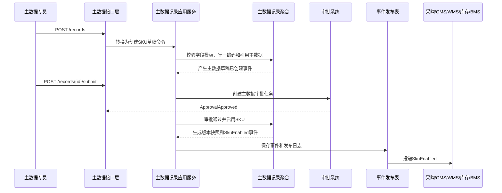
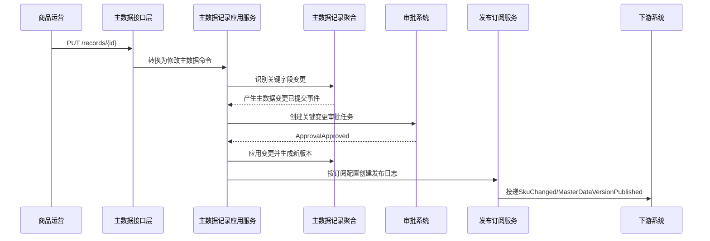
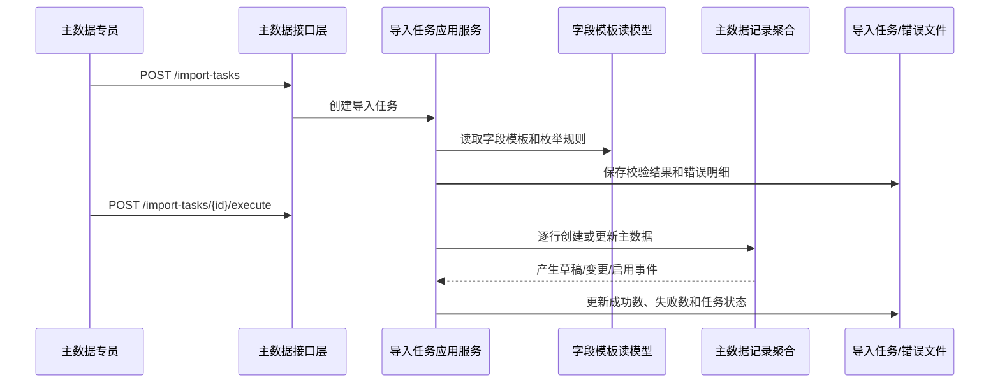
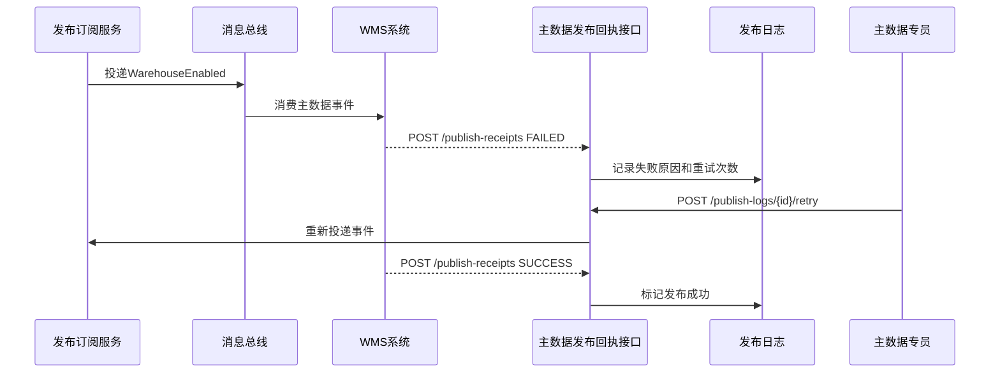

# 08-主数据系统接口设计

> 本文根据 [01-主数据系统产品功能设计](../04-子系统功能设计/08-主数据系统/01-主数据系统产品功能设计.md)、[08-主数据系统数据库设计](../05-子系统数据库设计/08-主数据系统数据库设计.md) 和 [上下文映射与领域事件目录](./00-上下文映射与领域事件目录.md) 设计。接口按 DDD + CQRS 口径拆分：查询接口读取主数据读模型，命令接口触发应用服务和聚合行为，跨系统接口遵守主数据事实源、命令/事件边界和下游订阅发布规则。

## 1. 设计范围

| 类型 | 范围 | 说明 |
| --- | --- | --- |
| 前端页面接口 | 主数据类型、字段模板、编码规则、商品主数据、合作伙伴主数据、仓储主数据、审核、发布、导入导出、变更日志、枚举配置、操作日志 | 面向主数据专员、商品运营、采购/供应商管理、仓储运营、物流运营、财务和系统管理员 |
| 跨系统命令接口 | 各业务系统 -> 主数据、主数据 -> 权限/审批/下游系统 | 支撑主数据查询、批量查询、编码生成、发布回执、审批结果处理 |
| 跨系统事件接口 | 主数据 -> 供应商/采购/OMS/库存/WMS/TMS/BMS，权限/审批/下游系统 -> 主数据 | 异步传递已经发生的主数据事实和下游消费结果 |
| 不包含 | 采购订单、库存台账、仓内作业、运输运单、计费对账、用户认证授权 | 这些由采购、中央库存、WMS、TMS、BMS、权限上下文拥有 |

## 2. DDD 对齐说明

| DDD 关注点 | 本文口径 |
| --- | --- |
| 限界上下文 | 主数据上下文 |
| 核心聚合 | 主数据类型、字段模板、编码规则、主数据记录、主数据版本、发布订阅、导入任务、数据质量问题 |
| 查询模型 | 类型列表、字段模板列表、编码规则列表、商品/伙伴/仓储主数据列表、审核待办、发布日志、导入任务、变更日志、枚举配置、操作日志 |
| 命令接口 | 创建/修改/启停类型，创建/修改/排序/停用字段，创建/修改/启停/预览/生成编码，创建/修改/提交/审核/驳回/启用/冻结/停用主数据，发布/重试，导入/导出，维护枚举 |
| 领域事件 | 主数据类型已创建/启用/变更/停用、字段模板已创建/发布/变更/停用、编码规则已创建/启用/停用、主数据草稿已创建/已提交审核/已启用/已驳回/变更已提交/已冻结/已停用、主数据版本已生成/已发布、主数据已发布/发布已确认/已重新发布、导入任务已创建/已执行/已完成等 |
| 数据主权 | 08-主数据系统拥有 SKU/SPU、供应商、客户、货主、物流商、仓库、库区、库位、组织、财务口径、字段模板、编码规则、发布订阅和版本快照等基础资料主权 |
| 幂等规则 | 所有写接口必须携带 `X-Idempotency-Key`；跨系统事件消费以 `sourceContext + eventId + aggregateId` 幂等；主数据发布以 `typeCode + dataCode + versionNo + targetSystem` 幂等 |

## 3. 通用协议

### 3.1 基础路径

| 场景 | 基础路径 |
| --- | --- |
| 前端页面接口 | `/api/mdm/v1` |
| 跨系统开放命令接口 | `/openapi/mdm/v1` |
| 事件回调/事件消费入口 | `/internal/mdm/v1/events` |

### 3.2 通用请求头

| 请求头 | 必填 | 适用接口 | 说明 |
| --- | --- | --- | --- |
| `Authorization` | 是 | 前端接口 | `Bearer access_token`，由09-权限系统签发 |
| `X-Tenant-Id` | 否 | 全部 | 租户 ID，单租户可不传 |
| `X-Org-Id` | 是 | 全部 | 当前组织 ID，用于组织级主数据和内部用户数据权限 |
| `X-Warehouse-Id` | 仓储主数据可选 | 仓库、库区、库位查询和写命令 | 当前仓库数据范围，通常由权限中间件解析 |
| `X-Owner-Id` | 多货主可选 | 货主、仓库、库存相关主数据 | 当前货主数据范围，通常由权限中间件解析 |
| `X-Request-Id` | 是 | 全部 | 请求链路 ID |
| `X-Trace-Id` | 否 | 全部 | 分布式链路追踪 ID |
| `X-Idempotency-Key` | 写接口必填 | 命令接口、跨系统命令 | 同一业务动作唯一 |
| `X-Source-System` | 跨系统必填 | 跨系统命令、事件入口 | `MDM`、`SUPPLIER`、`PURCHASE`、`WMS`、`OMS`、`INVENTORY`、`TMS`、`BMS`、`IAM` |
| `X-Operator-Id` | 写接口必填 | 命令接口 | 操作人；系统任务传系统账号 |
| `X-Data-Scope` | 否 | 前端查询 | 网关或权限中间件解析后的数据范围摘要 |
| `Accept-Language` | 否 | 全部 | `zh-CN` 默认 |

### 3.3 通用响应结构

```json
{
  "success": true,
  "code": "SUCCESS",
  "message": "处理成功",
  "requestId": "REQ202607040001",
  "traceId": "TRACE202607040001",
  "timestamp": "2026-07-04T10:00:00+08:00",
  "data": {}
}
```

分页响应：

```json
{
  "success": true,
  "code": "SUCCESS",
  "message": "查询成功",
  "data": {
    "pageNo": 1,
    "pageSize": 20,
    "total": 128,
    "records": []
  }
}
```

命令响应：

```json
{
  "success": true,
  "code": "SUCCESS",
  "message": "命令已处理",
  "data": {
    "aggregateId": "190001",
    "businessNo": "SKU202607040001",
    "status": 3,
    "statusName": "已启用",
    "version": 3,
    "eventId": "EVT202607040001",
    "idempotentHit": false
  }
}
```

### 3.4 HTTP 状态码

| HTTP 状态码 | 场景 | 前端处理 |
| --- | --- | --- |
| `200` | 查询成功、命令同步处理成功 | 正常刷新页面 |
| `201` | 新增成功 | 跳转详情或继续编辑 |
| `202` | 命令已受理，异步处理 | 展示处理中，轮询任务或等待事件 |
| `204` | 关闭/取消后无返回体 | 返回列表或刷新详情 |
| `400` | 请求格式错误、字段类型错误 | 表单提示 |
| `401` | 未登录、Token 过期 | 跳转登录或刷新 Token |
| `403` | 无菜单/按钮/数据权限 | 隐藏按钮或弹出无权限 |
| `404` | 主数据不存在或无数据权限导致不可见 | 提示记录不存在 |
| `409` | 乐观锁冲突、幂等内容不一致、状态机冲突、唯一编码冲突 | 提示刷新后重试 |
| `422` | 业务规则不通过 | 展示业务原因，如关键字段需审批、引用主数据未启用 |
| `429` | 请求过于频繁 | 稍后重试 |
| `500` | 系统异常 | 记录错误并提示稍后重试 |

### 3.5 业务错误码

| 业务码 | HTTP | 含义 |
| --- | --- | --- |
| `SUCCESS` | `200/201` | 成功 |
| `ACCEPTED` | `202` | 已受理异步处理 |
| `VALIDATION_FAILED` | `400` | 字段校验失败 |
| `UNAUTHORIZED` | `401` | 未认证 |
| `FORBIDDEN` | `403` | 无权限 |
| `MDM_SCOPE_DENIED` | `403` | 当前用户无该组织、仓库、货主、供应商/客户数据范围 |
| `NOT_FOUND` | `404` | 资源不存在 |
| `VERSION_CONFLICT` | `409` | 乐观锁版本冲突 |
| `IDEMPOTENCY_CONFLICT` | `409` | 同一幂等键请求内容不一致 |
| `STATE_CONFLICT` | `409` | 当前状态不允许该命令 |
| `DUPLICATE_DATA_CODE` | `409` | 同一主数据类型下编码重复 |
| `REFERENCE_NOT_ENABLED` | `422` | 引用的主数据未启用或已停用 |
| `CRITICAL_FIELD_APPROVAL_REQUIRED` | `422` | 关键字段变更必须走审核 |
| `PUBLISH_TARGET_FAILED` | `422/500` | 下游发布失败 |
| `IMPORT_PARTIAL_FAILED` | `202/422` | 导入部分成功，需下载错误明细 |
| `SYSTEM_ERROR` | `500` | 系统异常 |

## 4. 通用对象字段

### 4.1 分页查询字段

| 字段 | 类型 | 必填 | 说明 |
| --- | --- | --- | --- |
| `pageNo` | int | 是 | 页码，从 1 开始 |
| `pageSize` | int | 是 | 每页条数，支持 10、20、50 |
| `sortField` | string | 否 | 排序字段，如 `updatedAt`、`createdAt`、`status`、`dataCode` |
| `sortOrder` | string | 否 | `asc`、`desc`，默认 `desc` |

### 4.2 状态时间线字段

| 字段 | 类型 | 说明 |
| --- | --- | --- |
| `nodeCode` | string | 状态节点编码 |
| `nodeName` | string | 状态节点名称 |
| `status` | int | 1 未开始，2 进行中，3 已完成，4 已驳回/异常 |
| `operatorId` | string | 操作人 ID |
| `operatorName` | string | 操作人名称 |
| `occurredAt` | datetime | 发生时间 |
| `remark` | string | 备注 |

### 4.3 主数据数据隔离

| 用户类型 | 数据范围规则 |
| --- | --- |
| 主数据专员 | 按组织、本人/部门、被分配主数据领域过滤；可创建和维护授权范围内主数据 |
| 商品运营 | 只能查看和维护授权类目、品牌、SPU/SKU 等商品主数据 |
| 采购/供应商管理 | 只能查看和维护授权供应商、客户、货主、供应商商品相关主数据 |
| 仓储运营 | 按仓库、货主、库区、库位过滤；未授权仓库不可维护 |
| 物流运营 | 只能维护授权物流商、物流产品、地址区域、服务范围、面单模板、禁运规则 |
| 财务 | 只能维护授权账套、税率、币种、结算主体和账户资料 |
| 系统管理员 | 按授权组织和系统配置范围过滤，不默认拥有所有业务主数据 |

## 5. 前端页面接口

### 5.1 主数据类型管理

| 接口 | 方法 | 路径 | 页面调用位置 | 权限点 | 领域动作 |
| --- | --- | --- | --- | --- | --- |
| 查询类型列表 | `GET` | `/api/mdm/v1/types` | 主数据类型管理页查询、分页、排序 | `mdm:type:read` | 查询读模型 |
| 查询类型详情 | `GET` | `/api/mdm/v1/types/{typeCode}` | 详情页打开时 | `mdm:type:read` | 查询读模型 |
| 新增类型 | `POST` | `/api/mdm/v1/types` | 类型管理页“新增” | `master-data:master_data:create` | 创建主数据类型 |
| 修改类型 | `PUT` | `/api/mdm/v1/types/{typeCode}` | 类型管理页“编辑” | `master-data:master_data:update` | 变更主数据类型 |
| 启用类型 | `POST` | `/api/mdm/v1/types/{typeCode}/enable` | 行内“启用” | `master-data:master_data:enable` | 启用主数据类型 |
| 停用类型 | `POST` | `/api/mdm/v1/types/{typeCode}/disable` | 行内“停用” | `master-data:master_data:disable` | 停用主数据类型 |

查询请求字段：`typeCode`、`typeName`、`domain`、`parentTypeCode`、`status`、`approvalRequired`、`publishEnabled`、`pageNo/pageSize/sortField/sortOrder`。

新增/修改请求字段：

| 字段 | 类型 | 必填 | 说明 |
| --- | --- | --- | --- |
| `typeCode` | string | 新增必填 | 类型编码，如 `SKU`、`SUPPLIER`、`WAREHOUSE` |
| `typeName` | string | 是 | 类型名称 |
| `domain` | string/int | 是 | `MASTER_DATA_DOMAIN`：商品、伙伴、仓储、物流、组织、财务 |
| `parentTypeCode` | string | 否 | 上级类型，如 SKU 的上级可为 SPU |
| `approvalRequired` | boolean | 是 | 是否需要审核 |
| `versionEnabled` | boolean | 是 | 是否启用版本 |
| `publishEnabled` | boolean | 是 | 是否发布给子系统 |
| `sortNo` | int | 否 | 排序 |
| `remark` | string | 否 | 说明 |
| `version` | int | 修改/命令必填 | 乐观锁版本 |

响应字段：`masterDataTypeId`、`typeCode`、`typeName`、`domain/domainName`、`parentTypeCode`、`approvalRequired`、`versionEnabled`、`publishEnabled`、`status/statusName`、`sortNo`、`remark`、`statusTimeline[]`、`version`。

成功事件：`主数据类型已创建`、`主数据类型已启用`、`主数据类型已变更`、`主数据类型已停用`。

状态码：`200`、`201`、`400`、`401`、`403`、`404`、`409`、`422`、`500`。

### 5.2 字段模板管理

| 接口 | 方法 | 路径 | 页面调用位置 | 权限点 | 领域动作 |
| --- | --- | --- | --- | --- | --- |
| 查询字段列表 | `GET` | `/api/mdm/v1/field-defs` | 字段模板管理页查询、分页、排序 | `mdm:field_def:read` | 查询读模型 |
| 查询字段详情 | `GET` | `/api/mdm/v1/field-defs/{fieldDefinitionId}` | 详情页打开时 | `mdm:field_def:read` | 查询读模型 |
| 新增字段 | `POST` | `/api/mdm/v1/field-defs` | 字段模板管理页“新增字段” | `master-data:field:field` | 创建字段模板 |
| 修改字段 | `PUT` | `/api/mdm/v1/field-defs/{fieldDefinitionId}` | 行内“编辑字段” | `master-data:field:field` | 变更字段定义 |
| 字段排序 | `POST` | `/api/mdm/v1/field-defs/sort` | 字段模板管理页“排序” | `master-data:field:sort` | 调整字段顺序 |
| 停用字段 | `POST` | `/api/mdm/v1/field-defs/{fieldDefinitionId}/disable` | 行内“停用” | `master-data:field:disable` | 停用字段模板 |

查询请求字段：`typeCode`、`fieldCode`、`fieldName`、`fieldType`、`enumTypeCode`、`referenceTypeCode`、`required`、`criticalFlag`、`status`、`pageNo/pageSize/sortField/sortOrder`。

新增/修改请求字段：

| 字段 | 类型 | 必填 | 说明 |
| --- | --- | --- | --- |
| `typeCode` | string | 是 | 主数据类型 |
| `fieldCode` | string | 新增必填 | 字段编码，类型内唯一 |
| `fieldName` | string | 是 | 字段名称 |
| `fieldType` | string/int | 是 | `FIELD_TYPE`：字符串、数字、日期、枚举、布尔、引用 |
| `dataLength` | int | 字符串可选 | 字符串长度 |
| `decimalScale` | int | 数字可选 | 小数位 |
| `required` | boolean | 是 | 是否必填 |
| `uniqueFlag` | boolean | 是 | 是否类型内唯一 |
| `enumTypeCode` | string | 枚举字段必填 | 枚举类型 |
| `referenceTypeCode` | string | 引用字段必填 | 引用的主数据类型 |
| `defaultValue` | string | 否 | 默认值 |
| `editableAfterEnabled` | boolean | 是 | 启用后是否可改 |
| `criticalFlag` | boolean | 是 | 是否关键字段，关键变更需审批 |
| `visibleInList/visibleInForm` | boolean | 是 | 列表/表单是否展示 |
| `sortNo` | int | 是 | 表单排序 |
| `version` | int | 修改/命令必填 | 乐观锁版本 |

排序请求字段：`typeCode`、`items[].fieldDefinitionId`、`items[].sortNo`、`version`。

响应字段：`fieldDefinitionId`、`typeCode/typeName`、`fieldCode`、`fieldName`、`fieldType/typeName`、`required`、`uniqueFlag`、`enumTypeCode`、`referenceTypeCode`、`criticalFlag`、`status/statusName`、`sortNo`、`version`。

成功事件：`字段模板已创建`、`字段模板已发布`、`字段模板已变更`、`字段模板已停用`、`枚举值已变更`。

状态码：`200`、`201`、`400`、`401`、`403`、`404`、`409`、`422`、`500`。

### 5.3 编码规则管理

| 接口 | 方法 | 路径 | 页面调用位置 | 权限点 | 领域动作 |
| --- | --- | --- | --- | --- | --- |
| 查询编码规则列表 | `GET` | `/api/mdm/v1/code-rules` | 编码规则管理页查询、分页、排序 | `mdm:code_rule:read` | 查询读模型 |
| 查询编码规则详情 | `GET` | `/api/mdm/v1/code-rules/{ruleCode}` | 详情页打开时 | `mdm:code_rule:read` | 查询读模型 |
| 新增编码规则 | `POST` | `/api/mdm/v1/code-rules` | 编码规则管理页“新增” | `master-data:code:create` | 创建编码规则 |
| 修改编码规则 | `PUT` | `/api/mdm/v1/code-rules/{ruleCode}` | 行内“编辑” | `master-data:code:update` | 变更编码规则 |
| 启用编码规则 | `POST` | `/api/mdm/v1/code-rules/{ruleCode}/enable` | 行内“启用” | `master-data:code:enable` | 启用编码规则 |
| 停用编码规则 | `POST` | `/api/mdm/v1/code-rules/{ruleCode}/disable` | 行内“停用” | `master-data:code:disable` | 停用编码规则 |
| 预览编码 | `POST` | `/api/mdm/v1/code-rules/{ruleCode}/preview` | 行内“预览” | `master-data:code:page` | 预览编码，不占用流水 |

查询请求字段：`ruleCode`、`ruleName`、`typeCode`、`status`、`resetCycle`、`pageNo/pageSize/sortField/sortOrder`。

新增/修改请求字段：

| 字段 | 类型 | 必填 | 说明 |
| --- | --- | --- | --- |
| `ruleCode` | string | 新增必填 | 规则编码 |
| `ruleName` | string | 是 | 规则名称 |
| `typeCode` | string | 是 | 适用主数据类型 |
| `prefix` | string | 否 | 前缀 |
| `datePattern` | string | 否 | 日期格式，如 `yyyyMMdd` |
| `sequenceLength` | int | 是 | 流水号长度 |
| `currentSequence` | long | 否 | 当前流水，新增默认 0 |
| `resetCycle` | string/int | 是 | `RESET_CYCLE`：不重置、每日、每月、每年 |
| `version` | int | 修改/命令必填 | 乐观锁版本 |

预览请求字段：`ruleCode`、`sampleCount`、`bizDate`、`contextPayload`。

响应字段：`codeRuleId`、`ruleCode`、`ruleName`、`typeCode/typeName`、`prefix`、`datePattern`、`sequenceLength`、`currentSequence`、`resetCycle/cycleName`、`status/statusName`、`previewCodes[]`、`version`。

成功事件：`编码规则已创建`、`编码规则已启用`、`主数据编码已生成`、`编码规则已停用`。

状态码：`200`、`201`、`400`、`401`、`403`、`404`、`409`、`422`、`500`。

### 5.4 商品、合作伙伴和仓储主数据页

| 接口 | 方法 | 路径 | 页面调用位置 | 权限点 | 领域动作 |
| --- | --- | --- | --- | --- | --- |
| 查询主数据列表 | `GET` | `/api/mdm/v1/records` | 商品/合作伙伴/仓储主数据页查询、分页、排序 | `master-data:productmaster_data:read`、`master-data:master_data:read` | 查询读模型 |
| 查询主数据详情 | `GET` | `/api/mdm/v1/records/{recordId}` | 详情页打开时 | `master-data:productmaster_data:read`、`master-data:master_data:read` | 查询读模型 |
| 新增主数据 | `POST` | `/api/mdm/v1/records` | 主数据页“新增” | `master-data:productmaster_data:create`、`master-data:master_data:create` | 创建主数据草稿 |
| 修改主数据 | `PUT` | `/api/mdm/v1/records/{recordId}` | 主数据页“编辑” | `master-data:productmaster_data:update`、`master-data:master_data:update` | 修改主数据或提交关键变更 |
| 提交审核 | `POST` | `/api/mdm/v1/records/{recordId}/submit` | 行内/详情“提交审核” | `master-data:productmaster_data:approval`、`master-data:master_data:approval` | 提交主数据审核 |
| 启用主数据 | `POST` | `/api/mdm/v1/records/{recordId}/enable` | 行内/详情“启用” | `master-data:productmaster_data:enable`、`master-data:master_data:page` | 启用主数据 |
| 冻结主数据 | `POST` | `/api/mdm/v1/records/{recordId}/freeze` | 行内/详情“冻结” | `master-data:master_data:page` | 冻结供应商、库位、物流商等业务对象 |
| 停用主数据 | `POST` | `/api/mdm/v1/records/{recordId}/disable` | 行内/详情“停用” | `master-data:productmaster_data:disable`、`master-data:master_data:page` | 停用主数据 |

查询请求字段：

| 字段 | 类型 | 必填 | 说明 |
| --- | --- | --- | --- |
| `domain` | string/int | 否 | 商品、伙伴、仓储、物流、组织、财务 |
| `typeCode` | string | 否 | `SPU`、`SKU`、`SUPPLIER`、`CUSTOMER`、`OWNER`、`CARRIER`、`WAREHOUSE`、`LOCATION` 等 |
| `dataCode/dataName` | string | 否 | 主数据编码/名称 |
| `dataStatus` | string/int | 否 | `MASTER_DATA_STATUS`：草稿、待审核、已启用等 |
| `approvalStatus` | string/int | 否 | `APPROVAL_STATUS`：未提交、待审批、已批准、已驳回 |
| `effectiveFrom/effectiveTo` | datetime | 否 | 生效时间范围 |
| `keyword` | string | 否 | 编码、名称、业务字段模糊查询 |
| `pageNo/pageSize/sortField/sortOrder` | mixed | 是 | 分页排序 |

新增/修改请求字段：

| 字段 | 类型 | 必填 | 说明 |
| --- | --- | --- | --- |
| `typeCode` | string | 是 | 主数据类型 |
| `dataCode` | string | 否 | 主数据编码；为空时可调用编码规则生成 |
| `dataName` | string | 是 | 主数据名称 |
| `dataPayload` | object | 是 | 按字段模板提交的业务字段值 |
| `effectiveFrom/effectiveTo` | datetime | 否 | 生效/失效时间 |
| `changeReason` | string | 修改关键字段必填 | 变更原因 |
| `attachments[]` | array | 否 | 资质、图片、证明文件 |
| `version` | int | 修改/命令必填 | 乐观锁版本 |

命令请求字段：提交传 `submitRemark`；启用传 `effectiveFrom`、`version`；冻结传 `freezeReason`、`version`；停用传 `disableReason`、`version`。

响应字段：`recordId`、`typeCode/typeName`、`dataCode`、`dataName`、`dataPayload`、`dataStatus/statusName`、`approvalStatus/statusName`、`currentVersion`、`effectiveFrom`、`effectiveTo`、`changeSummary`、`statusTimeline[]`、`version`。

成功事件：`主数据草稿已创建`、`主数据已提交审核`、`主数据已启用`、`主数据变更已提交`、`主数据已冻结`、`主数据已停用`、`主数据版本已生成`。

状态码：`200`、`201`、`202`、`400`、`401`、`403`、`404`、`409`、`422`、`500`。

### 5.5 主数据审核页

| 接口 | 方法 | 路径 | 页面调用位置 | 权限点 | 领域动作 |
| --- | --- | --- | --- | --- | --- |
| 查询审核列表 | `GET` | `/api/mdm/v1/approvals` | 主数据审核页查询、分页、排序 | `master-data:master_dataapproval:read` | 查询审核读模型 |
| 查询审核详情 | `GET` | `/api/mdm/v1/approvals/{changeLogId}` | 审核详情打开时 | `master-data:master_dataapproval:read` | 查询变更详情 |
| 审核通过 | `POST` | `/api/mdm/v1/approvals/{changeLogId}/approve` | 审核详情“审核通过” | `master-data:master_dataapproval:approval` | 审核通过主数据建档或关键变更 |
| 审核驳回 | `POST` | `/api/mdm/v1/approvals/{changeLogId}/reject` | 审核详情“驳回” | `master-data:master_dataapproval:reject` | 驳回主数据建档或关键变更 |

查询请求字段：`typeCode`、`dataCode`、`dataName`、`fieldCode`、`changeType`、`criticalFlag`、`approvalStatus`、`applicantId`、`createdFrom/createdTo`、`pageNo/pageSize/sortField/sortOrder`。

命令请求字段：

| 命令 | 字段 | 类型 | 必填 | 说明 |
| --- | --- | --- | --- | --- |
| 审核通过 | `approvalComment` | string | 否 | 审核意见 |
| 审核通过 | `effectiveFrom` | datetime | 否 | 指定生效时间 |
| 驳回 | `rejectReason` | string | 是 | 驳回原因 |
| 全部 | `version` | int | 是 | 乐观锁版本 |

响应字段：`changeLogId`、`recordId`、`typeCode/typeName`、`dataCode/dataName`、`fieldCode/fieldName`、`oldValue`、`newValue`、`criticalFlag`、`changeType/typeName`、`approvalStatus/statusName`、`statusTimeline[]`、`version`。

成功事件：`主数据已启用`、`主数据已驳回`、`主数据变更已提交`、`主数据变更已生效`。

状态码：`200`、`400`、`401`、`403`、`404`、`409`、`422`、`500`。

### 5.6 主数据发布页

| 接口 | 方法 | 路径 | 页面调用位置 | 权限点 | 领域动作 |
| --- | --- | --- | --- | --- | --- |
| 查询发布日志 | `GET` | `/api/mdm/v1/publish-logs` | 主数据发布页查询、分页、排序 | `master-data:master_datapublish:read` | 查询发布读模型 |
| 查询发布详情 | `GET` | `/api/mdm/v1/publish-logs/{publishLogId}` | 发布详情打开时 | `master-data:master_datapublish:detail` | 查询发布详情 |
| 重试发布 | `POST` | `/api/mdm/v1/publish-logs/{publishLogId}/retry` | 行内/详情“重试” | `master-data:master_datapublish:page` | 重试发布主数据 |
| 查询订阅配置 | `GET` | `/api/mdm/v1/publish-subscriptions` | 发布页订阅配置页签 | `master-data:master_datapublish:read` | 查询订阅读模型 |
| 新增订阅配置 | `POST` | `/api/mdm/v1/publish-subscriptions` | 订阅配置页“新增” | `master-data:master_datapublish:page` | 创建发布订阅 |
| 修改订阅配置 | `PUT` | `/api/mdm/v1/publish-subscriptions/{subscriptionId}` | 订阅配置页“编辑” | `master-data:master_datapublish:page` | 修改发布订阅 |
| 启停订阅配置 | `POST` | `/api/mdm/v1/publish-subscriptions/{subscriptionId}/toggle` | 行内“启停” | `master-data:master_datapublish:page` | 启用或停用订阅 |

查询请求字段：`typeCode`、`dataCode`、`versionNo`、`targetSystem`、`eventName`、`publishStatus`、`createdFrom/createdTo`、`pageNo/pageSize/sortField/sortOrder`。

订阅配置字段：

| 字段 | 类型 | 必填 | 说明 |
| --- | --- | --- | --- |
| `typeCode` | string | 是 | 主数据类型 |
| `targetSystem` | string/int | 是 | `TARGET_SYSTEM`：供应商、采购、OMS、库存、WMS、TMS、BMS |
| `eventTopic` | string | 是 | 事件主题 |
| `publishMode` | string/int | 是 | `PUBLISH_MODE`：事件、API、批量 |
| `filterRule` | object | 否 | 发布过滤规则 |
| `status` | string/int | 是 | 启用、停用 |
| `version` | int | 修改/命令必填 | 乐观锁版本 |

重试请求字段：`retryReason`、`version`。

响应字段：`publishLogId`、`typeCode/typeName`、`dataCode/dataName`、`versionNo`、`targetSystem/systemName`、`eventName`、`publishStatus/statusName`、`retryCount`、`failureReason`、`publishedAt`、`payloadPreview`、`version`。

成功事件：`订阅已创建`、`订阅已停用`、`主数据已发布`、`主数据发布已确认`、`主数据已重新发布`。

状态码：`200`、`201`、`202`、`400`、`401`、`403`、`404`、`409`、`422`、`500`。

### 5.7 导入导出页

| 接口 | 方法 | 路径 | 页面调用位置 | 权限点 | 领域动作 |
| --- | --- | --- | --- | --- | --- |
| 查询导入任务 | `GET` | `/api/mdm/v1/import-tasks` | 导入导出页查询、分页、排序 | `master-data:importexport:read` | 查询导入任务读模型 |
| 查询导入详情 | `GET` | `/api/mdm/v1/import-tasks/{importTaskId}` | 导入详情打开时 | `master-data:importexport:read` | 查询导入详情 |
| 下载导入模板 | `GET` | `/api/mdm/v1/import-templates/{typeCode}` | 顶部“下载模板” | `master-data:importexport:page` | 获取字段模板生成的导入模板 |
| 创建导入任务 | `POST` | `/api/mdm/v1/import-tasks` | 顶部“导入” | `master-data:importexport:import` | 创建并校验导入任务 |
| 执行导入任务 | `POST` | `/api/mdm/v1/import-tasks/{importTaskId}/execute` | 导入详情“执行导入” | `master-data:importexport:import` | 执行导入 |
| 取消导入任务 | `POST` | `/api/mdm/v1/import-tasks/{importTaskId}/cancel` | 导入详情“取消” | `master-data:importexport:import` | 取消待处理导入 |
| 下载错误明细 | `GET` | `/api/mdm/v1/import-tasks/{importTaskId}/errors` | 行内“查看错误” | `master-data:importexport:page` | 下载错误文件或查询错误明细 |
| 导出主数据 | `POST` | `/api/mdm/v1/records/export` | 顶部“导出” | `master-data:importexport:export` | 创建导出任务 |

查询请求字段：`typeCode`、`fileName`、`importMode`、`taskStatus`、`createdFrom/createdTo`、`pageNo/pageSize/sortField/sortOrder`。

创建导入任务请求字段：

| 字段 | 类型 | 必填 | 说明 |
| --- | --- | --- | --- |
| `typeCode` | string | 是 | 主数据类型 |
| `fileName` | string | 是 | 文件名 |
| `fileUrl` | string | 是 | 上传后的文件地址 |
| `fileHash` | string | 是 | 文件摘要，用于幂等和防重复导入 |
| `importMode` | string/int | 是 | `IMPORT_MODE`：新增、更新、覆盖 |
| `validateOnly` | boolean | 否 | 是否只校验不入库 |
| `duplicatePolicy` | string | 否 | `REJECT`、`SKIP`、`OVERWRITE` |

导出请求字段：`typeCode`、`filters`、`selectedRecordIds[]`、`exportFields[]`、`maskSensitiveFields`。

响应字段：`importTaskId`、`typeCode/typeName`、`fileName`、`importMode/modeName`、`taskStatus/statusName`、`totalCount`、`successCount`、`failedCount`、`errorFileUrl`、`statusTimeline[]`、`version`。

成功事件：`导入任务已创建`、`导入文件已校验`、`导入任务已执行`、`导入任务已完成`、`导入任务已取消`。

状态码：`200`、`201`、`202`、`400`、`401`、`403`、`404`、`409`、`422`、`500`。

### 5.8 变更日志页

| 接口 | 方法 | 路径 | 页面调用位置 | 权限点 | 说明 |
| --- | --- | --- | --- | --- | --- |
| 查询变更日志 | `GET` | `/api/mdm/v1/change-logs` | 变更日志页查询、分页、排序 | `master-data:page:read` | 查询字段级变更日志 |
| 查询变更详情 | `GET` | `/api/mdm/v1/change-logs/{changeLogId}` | 变更详情打开时 | `master-data:page:read` | 查询变更前后快照 |
| 导出变更日志 | `POST` | `/api/mdm/v1/change-logs/export` | 变更日志页“导出” | `master-data:page:export` | 创建导出任务 |

查询请求字段：`typeCode`、`dataCode`、`dataName`、`fieldCode`、`changeType`、`criticalFlag`、`operatorId`、`operatedFrom/operatedTo`、`pageNo/pageSize/sortField/sortOrder`。

响应字段：`changeLogId`、`recordId`、`typeCode/typeName`、`dataCode/dataName`、`fieldCode/fieldName`、`oldValue`、`newValue`、`criticalFlag`、`changeType/typeName`、`operatorId/operatorName`、`operatedAt`。

状态码：`200`、`202`、`400`、`401`、`403`、`404`、`500`。

### 5.9 枚举配置页

| 接口 | 方法 | 路径 | 页面调用位置 | 权限点 | 领域动作 |
| --- | --- | --- | --- | --- | --- |
| 查询枚举项 | `GET` | `/api/mdm/v1/enums` | 枚举配置页、各页面下拉框 | `master-data:enumsettings:read` | 查询枚举读模型 |
| 新增枚举项 | `POST` | `/api/mdm/v1/enums` | 枚举配置页“新增” | `master-data:enumsettings:create` | 新增可配置枚举项 |
| 修改枚举项 | `PUT` | `/api/mdm/v1/enums/{enumItemId}` | 枚举配置页“编辑” | `master-data:enumsettings:update` | 修改标签、颜色、排序 |
| 枚举排序 | `POST` | `/api/mdm/v1/enums/sort` | 枚举配置页“排序” | `master-data:enumsettings:sort` | 调整枚举显示顺序 |
| 停用枚举项 | `POST` | `/api/mdm/v1/enums/{enumItemId}/disable` | 行内“停用” | `master-data:enumsettings:disable` | 停用非核心枚举 |

查询请求字段：`enumType`、`typeCode`、`fieldCode`、`status`、`enabledOnly`。

新增/修改请求字段：

| 字段 | 类型 | 必填 | 说明 |
| --- | --- | --- | --- |
| `enumType` | string | 是 | 枚举类型 |
| `value` | string/int | 是 | 枚举值 |
| `label` | string | 是 | 展示名称 |
| `color` | string | 否 | 前端标签颜色 |
| `sortNo` | int | 否 | 排序 |
| `status` | string/int | 是 | 启用、停用 |
| `version` | int | 修改/命令必填 | 乐观锁版本 |

响应字段：`enumItemId`、`enumType`、`value`、`label`、`sortNo`、`status/statusName`、`color`、`systemFlag`、`version`。

成功事件：`枚举值已变更`、`字段模板已变更`。

状态码：`200`、`201`、`400`、`401`、`403`、`404`、`409`、`422`、`500`。

### 5.10 操作日志页

| 接口 | 方法 | 路径 | 页面调用位置 | 权限点 | 说明 |
| --- | --- | --- | --- | --- | --- |
| 查询操作日志 | `GET` | `/api/mdm/v1/operation-logs` | 操作日志页列表、详情页日志区域 | `master-data:operation_log:read` | 查询操作日志 |
| 查询操作日志详情 | `GET` | `/api/mdm/v1/operation-logs/{operationLogId}` | 操作日志详情打开时 | `master-data:operation_log:read` | 查询请求摘要、前后快照和失败原因 |
| 导出操作日志 | `POST` | `/api/mdm/v1/operation-logs/export` | 操作日志页顶部“导出” | `master-data:operation_log:export` | 创建导出任务 |

操作日志查询字段：`operatorId`、`operationType`、`targetType`、`targetNo`、`result`、`requestId`、`operationFrom`、`operationTo`、`pageNo/pageSize`。

操作日志响应字段：`operationLogId`、`operatorId/operatorName`、`operationType`、`targetType`、`targetId`、`targetNo`、`beforeSnapshot`、`afterSnapshot`、`result/resultName`、`failReason`、`requestId`、`operationAt`。

状态码：`200`、`202`、`400`、`401`、`403`、`404`、`500`。

## 6. 跨系统命令接口

### 6.1 各业务系统调用08-主数据系统：查询主数据

```text
POST /openapi/mdm/v1/master-data/query
```

调用时机：供应商、采购、OMS、库存、WMS、TMS、BMS 页面下拉框、写命令校验、业务规则校验时查询启用主数据。

主数据侧处理：按数据权限、主数据类型、状态和版本读取主数据读模型，不修改主数据状态。

请求头：`X-Source-System=SUPPLIER/PURCHASE/OMS/INVENTORY/WMS/TMS/BMS`、`X-Idempotency-Key` 查询可不传。

请求字段：

| 字段 | 类型 | 必填 | 说明 |
| --- | --- | --- | --- |
| `typeCode` | string | 是 | 主数据类型 |
| `dataCode` | string | 否 | 主数据编码 |
| `dataName` | string | 否 | 主数据名称 |
| `dataStatus` | string/int | 否 | 默认只查已启用 |
| `fields[]` | array | 否 | 指定返回字段 |
| `filters` | object | 否 | 业务字段过滤条件 |
| `asOfVersion` | int | 否 | 指定版本，不传返回当前版本 |
| `pageNo/pageSize` | int | 列表必填 | 分页 |

响应字段：`typeCode`、`records[].recordId`、`records[].dataCode`、`records[].dataName`、`records[].dataPayload`、`records[].currentVersion`、`records[].dataStatus`、`records[].effectiveFrom`、`records[].effectiveTo`。

状态码：`200`、`400`、`401`、`403`、`404`、`422`、`500`。

### 6.2 各业务系统调用08-主数据系统：批量校验主数据

```text
POST /openapi/mdm/v1/master-data/validate
```

调用时机：采购建单、OMS 导入订单、WMS 接收入出库指令、TMS 创建运单、BMS 生成费用前，需要批量校验 SKU、供应商、客户、仓库、库位、物流商、币种、税率等是否可用。

主数据侧处理：校验编码存在、状态已启用、未过有效期、引用关系有效，并返回失败明细。

请求头：`X-Source-System`、`X-Request-Id`。

请求字段：

| 字段 | 类型 | 必填 | 说明 |
| --- | --- | --- | --- |
| `validateScene` | string | 是 | `PURCHASE_ORDER`、`SALES_ORDER`、`INBOUND`、`OUTBOUND`、`SHIPMENT`、`BILLING` |
| `items[].typeCode` | string | 是 | 主数据类型 |
| `items[].dataCode` | string | 是 | 主数据编码 |
| `items[].versionNo` | int | 否 | 期望版本 |
| `items[].requiredStatus` | string/int | 否 | 默认已启用 |
| `items[].businessKey` | string | 否 | 来源业务单号或行号 |

响应字段：`valid`、`items[].businessKey`、`items[].typeCode`、`items[].dataCode`、`items[].valid`、`items[].failureCode`、`items[].failureReason`、`items[].snapshot`。

状态码：`200`、`400`、`401`、`403`、`422`、`500`。

### 6.3 各业务系统调用08-主数据系统：查询单个主数据快照

```text
GET /openapi/mdm/v1/master-data/{typeCode}/{dataCode}
```

调用时机：供应商档案页打开、采购建单校验、WMS 仓库库位校验、TMS 承运商能力校验、BMS 费用口径校验。

请求字段：`asOfVersion`、`includeDisabled`、`fields[]`。

响应字段：`recordId`、`typeCode/typeName`、`dataCode`、`dataName`、`dataPayload`、`dataStatus/statusName`、`approvalStatus/statusName`、`currentVersion`、`effectiveFrom`、`effectiveTo`、`updatedAt`。

状态码：`200`、`400`、`401`、`403`、`404`、`422`、`500`。

### 6.4 供应商/采购调用08-主数据系统：查询供应商主档

```text
GET /openapi/mdm/v1/suppliers/{supplierId}
```

调用时机：01-供应商系统供应商档案页打开、02-采购系统创建采购订单、供应商准入和供应商冻结校验。

请求字段：`includeQualifications`、`includeSettlementProfile`、`asOfVersion`。

响应字段：`supplierId`、`supplierCode`、`supplierName`、`supplierStatus/statusName`、`riskLevel`、`contacts[]`、`qualifications[]`、`settlementProfile`、`currentVersion`、`effectiveFrom`、`effectiveTo`。

状态码：`200`、`400`、`401`、`403`、`404`、`422`、`500`。

### 6.5 WMS/库存/OMS 调用08-主数据系统：查询仓库库位

```text
GET /openapi/mdm/v1/warehouses/{warehouseId}/locations
```

调用时机：WMS 创建入库/出库作业、中央库存建库存账户、OMS 分仓和履约校验。

请求字段：`ownerId`、`zoneCode`、`locationStatus`、`includeFrozen`、`pageNo/pageSize`。

响应字段：`warehouseId`、`warehouseCode`、`warehouseName`、`locations[].locationId`、`locations[].locationCode`、`locations[].zoneCode`、`locations[].locationType`、`locations[].locationStatus`、`locations[].ownerId`、`locations[].currentVersion`。

状态码：`200`、`400`、`401`、`403`、`404`、`422`、`500`。

### 6.6 各业务系统调用08-主数据系统：生成主数据编码

```text
POST /openapi/mdm/v1/codes/generate
```

调用时机：主数据页面、导入任务或外部系统代建主数据时需要根据编码规则生成业务编码。

主数据侧处理：加载启用编码规则，按规则生成并占用流水；失败不占用或按补偿策略释放。

请求头：`X-Source-System`、`X-Idempotency-Key=MDM-CODE:{ruleCode}:{bizKey}`。

请求字段：

| 字段 | 类型 | 必填 | 说明 |
| --- | --- | --- | --- |
| `ruleCode` | string | 是 | 编码规则 |
| `typeCode` | string | 是 | 主数据类型 |
| `bizKey` | string | 是 | 外部业务键，用于幂等 |
| `bizDate` | date | 否 | 日期段取值 |
| `count` | int | 否 | 生成数量，默认 1 |
| `contextPayload` | object | 否 | 规则变量 |

响应字段：`ruleCode`、`codes[]`、`currentSequence`、`idempotentHit`。

状态码：`200`、`201`、`400`、`401`、`403`、`409`、`422`、`500`。

### 6.7 下游系统调用08-主数据系统：回传发布结果

```text
POST /openapi/mdm/v1/publish-receipts
```

调用时机：供应商、采购、OMS、库存、WMS、TMS、BMS 消费主数据事件后回传成功、失败或忽略结果。

主数据侧处理：更新 `mdm_publish_log`，成功则标记目标系统已确认，失败则记录原因并允许重试或人工处理。

请求头：`X-Source-System`、`X-Idempotency-Key={targetSystem}:{eventId}:{consumeResult}`。

请求字段：

| 字段 | 类型 | 必填 | 说明 |
| --- | --- | --- | --- |
| `eventId` | string | 是 | 主数据发布事件 ID |
| `publishLogId` | string | 否 | 发布日志 ID |
| `typeCode` | string | 是 | 主数据类型 |
| `dataCode` | string | 是 | 主数据编码 |
| `versionNo` | int | 是 | 发布版本 |
| `targetSystem` | string | 是 | 目标系统 |
| `consumeResult` | string | 是 | `SUCCESS`、`FAILED`、`IGNORED` |
| `failureReason` | string | 失败必填 | 失败原因 |
| `consumedAt` | datetime | 是 | 下游消费时间 |

响应字段：`receiptId`、`publishStatus`、`retryRequired`、`message`。

状态码：`200`、`201`、`202`、`400`、`401`、`403`、`409`、`422`、`500`。

### 6.8 08-主数据系统调用09-权限和审批系统

| 目标系统 | 接口 | 调用时机 | 用途 |
| --- | --- | --- | --- |
| 权限系统 | `POST /openapi/iam/v1/tokens/validate` | 用户进入08-主数据系统、提交写操作前 | 校验登录态、角色、菜单、按钮、数据权限 |
| 权限系统 | `GET /openapi/iam/v1/users/me/permissions` | 登录后加载菜单 | 获取主数据菜单、按钮权限和数据范围 |
| 审批系统 | `POST /openapi/approval/v1/tasks` | 主数据建档或关键字段变更提交审核 | 创建审批任务，记录来源单据和变更摘要 |
| 审批系统 | `GET /openapi/approval/v1/tasks/{taskId}` | 审核详情打开或定时对账 | 查询审批状态和审批轨迹 |

## 7. 08-主数据系统事件发布

事件通过消息总线发布，也可通过 Outbox 表由集成服务投递。事件标准载荷遵守 [上下文映射与领域事件目录](./00-上下文映射与领域事件目录.md)。

| 事件 | 英文代码 | 触发接口/命令 | 主要消费者 | 关键载荷 |
| --- | --- | --- | --- | --- |
| 主数据类型已创建 | `MasterDataTypeCreated` | 新增类型 | 采购、OMS、WMS、中央库存、BMS、供应商系统、读模型 | `typeCode`、`typeName`、`domain`、`approvalRequired`、`publishEnabled` |
| 主数据类型已启用 | `MasterDataTypeEnabled` | 启用类型 | 采购、OMS、WMS、中央库存、BMS、供应商系统 | `typeCode`、`status`、`version` |
| 主数据类型已变更 | `MasterDataTypeChanged` | 修改类型 | 采购、OMS、WMS、中央库存、BMS、供应商系统 | `typeCode`、`before/after`、`version` |
| 主数据类型已停用 | `MasterDataTypeDisabled` | 停用类型 | 采购、OMS、WMS、中央库存、BMS、供应商系统 | `typeCode`、`disableReason`、`version` |
| 字段模板已创建 | `FieldTemplateCreated` | 新增字段 | 前端表单、导入模板、业务系统缓存 | `typeCode`、`fieldCode`、`fieldType`、`required` |
| 字段模板已发布 | `FieldTemplatePublished` | 发布字段模板 | 前端表单、导入模板、业务系统缓存 | `typeCode`、`fields[]`、`version` |
| 字段模板已变更 | `FieldTemplateChanged` | 修改字段 | 前端表单、导入模板、业务系统缓存 | `typeCode`、`fieldCode`、`before/after` |
| 字段模板已停用 | `FieldTemplateDisabled` | 停用字段 | 前端表单、导入模板、业务系统缓存 | `typeCode`、`fieldCode`、`disableReason` |
| 枚举值已变更 | `EnumItemChanged` | 新增/修改/排序/停用枚举 | 各业务系统、前端下拉框缓存 | `enumType`、`value`、`label`、`status` |
| 编码规则已创建 | `CodeRuleCreated` | 新增编码规则 | 主数据、导入任务、集成服务 | `ruleCode`、`typeCode`、`prefix`、`resetCycle` |
| 编码规则已启用 | `CodeRuleEnabled` | 启用编码规则 | 主数据、导入任务、集成服务 | `ruleCode`、`status` |
| 主数据编码已生成 | `MasterDataCodeGenerated` | 生成编码 | 主数据、导入任务、审计日志 | `ruleCode`、`typeCode`、`codes[]`、`bizKey` |
| 编码规则已停用 | `CodeRuleDisabled` | 停用编码规则 | 主数据、导入任务、集成服务 | `ruleCode`、`disableReason` |
| 主数据草稿已创建 | `MasterDataDraftCreated` | 新增主数据 | 读模型、审计日志 | `recordId`、`typeCode`、`dataCode`、`dataName` |
| 主数据已提交审核 | `MasterDataSubmitted` | 提交审核 | 审批系统、读模型、审计日志 | `recordId`、`typeCode`、`dataCode`、`changeSummary` |
| 主数据已启用 | `MasterDataEnabled` | 审核通过或启用 | 供应商、采购、OMS、库存、WMS、TMS、BMS | `recordId`、`typeCode`、`dataCode`、`dataName`、`snapshot`、`versionNo` |
| 主数据已驳回 | `MasterDataRejected` | 审核驳回 | 主数据申请人、读模型、审计日志 | `recordId`、`typeCode`、`dataCode`、`rejectReason` |
| 主数据变更已提交 | `MasterDataChangeSubmitted` | 修改关键字段 | 审批系统、读模型、审计日志 | `recordId`、`typeCode`、`dataCode`、`changedFields` |
| 主数据已冻结 | `MasterDataFrozen` | 冻结记录 | 供应商、采购、OMS、库存、WMS、TMS、BMS | `recordId`、`typeCode`、`dataCode`、`freezeReason`、`versionNo` |
| 主数据已停用 | `MasterDataDisabled` | 停用记录 | 供应商、采购、OMS、库存、WMS、TMS、BMS | `recordId`、`typeCode`、`dataCode`、`disableReason`、`versionNo` |
| 主数据版本已生成 | `MasterDataVersionGenerated` | 审核通过或变更生效 | 发布订阅、发布日志、审计日志 | `recordId`、`typeCode`、`dataCode`、`versionNo`、`snapshot` |
| 主数据版本已发布 | `MasterDataVersionPublished` | 发布版本 | 供应商、采购、OMS、库存、WMS、TMS、BMS | `recordId`、`typeCode`、`dataCode`、`versionNo`、`snapshot` |
| 主数据已发布 | `MasterDataPublished` | 发布主数据 | 供应商、采购、OMS、库存、WMS、TMS、BMS | `publishLogId`、`typeCode`、`dataCode`、`targetSystem`、`eventName` |
| 主数据发布已确认 | `MasterDataPublishConfirmed` | 下游回传成功 | 发布页、审计日志、运维监控 | `publishLogId`、`targetSystem`、`consumedAt` |
| 主数据已重新发布 | `MasterDataRepublished` | 重试发布 | 供应商、采购、OMS、库存、WMS、TMS、BMS | `publishLogId`、`retryCount`、`retryReason` |
| 导入任务已创建 | `ImportTaskCreated` | 创建导入任务 | 主数据、审计日志、运维监控 | `importTaskId`、`typeCode`、`fileName`、`importMode` |
| 导入文件已校验 | `ImportFileValidated` | 校验导入文件 | 主数据、审计日志、运维监控 | `importTaskId`、`totalCount`、`successCount`、`failedCount` |
| 导入任务已执行 | `ImportTaskExecuted` | 执行导入任务 | 主数据、审计日志、运维监控 | `importTaskId`、`taskStatus` |
| 导入任务已完成 | `ImportTaskCompleted` | 完成导入任务 | 主数据、审计日志、运维监控 | `importTaskId`、`totalCount`、`successCount`、`failedCount` |
| 导入任务已取消 | `ImportTaskCancelled` | 取消导入任务 | 主数据、审计日志、运维监控 | `importTaskId`、`cancelReason` |

主数据对外发布语言可按类型派生为业务事件，供下游更稳定消费：

| 派生事件 | 英文代码 | 来源主数据类型 | 主要消费者 | 关键载荷 |
| --- | --- | --- | --- | --- |
| SKU已启用 | `SkuEnabled` | `SKU` | 采购、OMS、库存、WMS、BMS | `skuId`、`skuCode`、`skuName`、`uom`、`category`、`versionNo` |
| SKU已变更 | `SkuChanged` | `SKU` | 采购、OMS、库存、WMS、BMS | `skuId`、`skuCode`、`changedFields`、`versionNo` |
| SKU已停用 | `SkuDisabled` | `SKU` | 采购、OMS、库存、WMS | `skuId`、`skuCode`、`disableReason`、`versionNo` |
| 供应商已启用 | `SupplierEnabled` | `SUPPLIER` | 采购、供应商 | `supplierId`、`supplierCode`、`supplierName`、`riskLevel` |
| 供应商已冻结 | `SupplierFrozen` | `SUPPLIER` | 采购、供应商 | `supplierId`、`supplierCode`、`freezeReason` |
| 仓库已启用 | `WarehouseEnabled` | `WAREHOUSE` | OMS、库存、WMS、BMS | `warehouseId`、`warehouseCode`、`warehouseName`、`ownerScope` |
| 库位已冻结 | `LocationFrozen` | `LOCATION` | WMS、库存 | `locationId`、`locationCode`、`warehouseId`、`freezeReason` |
| 物流商已启用 | `CarrierEnabled` | `CARRIER` | OMS、WMS、TMS、BMS | `carrierId`、`carrierCode`、`carrierName`、`serviceTypes` |
| 物流产品已启用 | `LogisticsProductEnabled` | `LOGISTICS_PRODUCT` | OMS、WMS、TMS、BMS | `productCode`、`carrierCode`、`serviceLevel`、`constraints` |
| 地址区域已变更 | `AddressRegionChanged` | `ADDRESS_REGION` | OMS、TMS、BMS | `regionCode`、`regionName`、`changedFields` |
| 禁运规则已变更 | `RestrictedRuleChanged` | `RESTRICTED_RULE` | OMS、TMS、WMS | `ruleCode`、`skuScope`、`regionScope`、`effectiveFrom` |

## 8. 08-主数据系统事件消费

```text
POST /internal/mdm/v1/events
```

通用请求字段：

| 字段 | 类型 | 必填 | 说明 |
| --- | --- | --- | --- |
| `eventId` | string | 是 | 外部事件 ID |
| `eventType` | string | 是 | 事件类型 |
| `eventVersion` | string | 是 | 事件版本 |
| `sourceContext` | string | 是 | 来源上下文 |
| `aggregateType` | string | 是 | 来源聚合类型 |
| `aggregateId` | string | 是 | 来源聚合 ID |
| `businessKey` | string | 是 | 来源业务单号 |
| `idempotencyKey` | string | 是 | 事件幂等键 |
| `occurredAt` | datetime | 是 | 事件发生时间 |
| `payload` | object | 是 | 业务载荷 |

响应字段：`consumeId`、`consumeStatus`、`idempotentHit`、`message`。

状态码：`200`、`202`、`400`、`409`、`422`、`500`。

| 消费事件 | 来源系统 | 处理应用服务 | 消费后数据变化 | 幂等键 |
| --- | --- | --- | --- | --- |
| `ApprovalApproved` | 审批系统 | 主数据审批事件消费服务 | 推进主数据记录为已启用或变更生效，生成版本快照和发布日志 | `APPROVAL:{eventId}:{approvalTaskId}` |
| `ApprovalRejected` | 审批系统 | 主数据审批事件消费服务 | 标记主数据审核驳回，保留草稿或变更记录 | `APPROVAL:{eventId}:{approvalTaskId}` |
| `PermissionDataScopeChanged` | 权限系统 | 权限事件消费服务 | 刷新主数据用户、组织、仓库、货主数据权限缓存 | `IAM:{eventId}:{scopeId}` |
| `PublishReceiptReturned` | 下游系统/集成服务 | 发布回执事件消费服务 | 更新发布日志成功、失败或忽略状态 | `{sourceContext}:{eventId}:{publishLogId}` |
| `SupplierProfileChangeSubmitted` | 供应商系统 | 供应商资料变更消费服务 | 生成供应商主数据变更申请或质量问题待办 | `SUPPLIER:{eventId}:{supplierId}` |
| `WarehouseExternalCodeBound` | WMS | 仓储主数据消费服务 | 回写 WMS 外部仓库/库位映射编码，不改变主数据业务状态 | `WMS:{eventId}:{warehouseId}` |
| `CarrierServiceConfirmed` | TMS | 物流主数据消费服务 | 更新物流商服务能力验证结果，必要时生成数据质量问题 | `TMS:{eventId}:{carrierId}` |
| `BillingMasterDataReferenced` | BMS | 主数据引用消费服务 | 标记税率、币种、结算主体被引用，限制直接停用 | `BMS:{eventId}:{typeCode}:{dataCode}` |

## 9. 典型调用链路

### 9.1 SKU 建档、审核与发布



### 9.2 关键字段变更审批后发布



### 9.3 批量导入主数据



### 9.4 发布失败重试与下游回执



## 10. 安全、幂等、审计和补偿

| 项 | 设计 |
| --- | --- |
| 认证 | 前端接口必须携带 `Authorization`，由网关或主数据后端调用09-权限系统校验 |
| 菜单权限 | 查询接口校验菜单权限，如 `mdm:type:read`、`master-data:master_data:read` |
| 按钮权限 | 写接口校验按钮权限，如 `master-data:productmaster_data:approval`、`master-data:master_datapublish:page` |
| 数据权限 | 内部用户按组织、仓库、货主、供应商/客户、本人/部门、主数据领域过滤 |
| 敏感字段 | 供应商账户、客户地址、联系人手机号、财务账户等查询和导出按权限脱敏 |
| 幂等 | 写接口使用 `X-Idempotency-Key`；重复命中返回原命令结果，不重复产生事件 |
| 主数据写命令幂等键 | `MDM:{typeCode}:{dataCode}:{command}:{version}` |
| 导入幂等键 | `MDM:IMPORT:{typeCode}:{fileHash}:{importMode}` |
| 发布幂等键 | `MDM:PUBLISH:{typeCode}:{dataCode}:{versionNo}:{targetSystem}` |
| 编码生成幂等键 | `MDM:CODE:{ruleCode}:{bizKey}` |
| 乐观锁 | 修改和状态推进必须传 `version`；冲突返回 `409 VERSION_CONFLICT` |
| 唯一性 | `typeCode` 全局唯一，`fieldCode` 在类型内唯一，`dataCode` 在类型内唯一，编码生成必须串行或使用数据库唯一约束兜底 |
| 审计 | 所有写接口记录操作人、权限点、请求摘要、前后快照、事件 ID、失败原因；敏感查询和导出记录访问日志 |
| 事件可靠性 | 领域事件先写 `mdm_domain_event`，再异步投递；消费事件先写 `mdm_event_consume_log`，再处理 |
| 发布补偿 | 下游消费失败进入发布日志失败状态，支持自动重试、人工重试、忽略、关闭和下游补拉 |
| 导入补偿 | 导入部分成功时保留成功记录和错误文件；失败行可修复后重导，覆盖模式必须保留变更日志 |
| 审批补偿 | 审批回调超时可轮询审批系统；审批驳回不删除草稿，保留修改和再次提交能力 |

## 11. 当前结论与待决问题

当前结论：08-主数据系统接口不是普通配置 CRUD，而是供应链基础资料事实源接口。前端写操作必须通过主数据类型、字段模板、编码规则、主数据记录、版本和发布订阅聚合保护不变量；跨系统只读取主数据快照或消费主数据事件，不直接修改主数据内部表。

关键假设：SKU/SPU、供应商、客户、货主、物流商、仓库、库区、库位、物流产品、地址区域、税率、币种和结算主体均由08-主数据系统拥有权威口径；下游系统保存业务快照和可查询缓存，主数据变更通过事件和发布回执保证最终一致。

待决问题：

| 问题 | 当前建议 |
| --- | --- |
| 主数据审批由08-主数据系统内置还是接入独立审批系统 | 第一版按接入独立审批系统设计，主数据保留审批状态和变更日志，审批系统拥有审批流实例 |
| 主数据发布采用全量推送还是事件增量 | 第一版默认事件增量，支持按类型和目标系统批量补发；下游故障时通过发布日志重试 |
| 业务系统是否允许代建主数据 | 第一版建议只允许通过开放命令提交建档申请，仍由主数据系统校验、审批、编码和发布 |
| 字段模板变更是否立即影响已启用数据 | 非关键展示字段可即时影响表单；必填、唯一、引用、关键字段规则变更建议生成数据质量问题并分批治理 |
