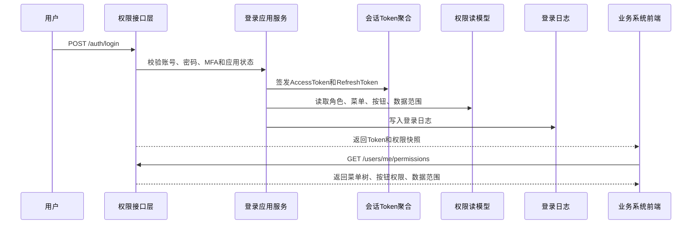
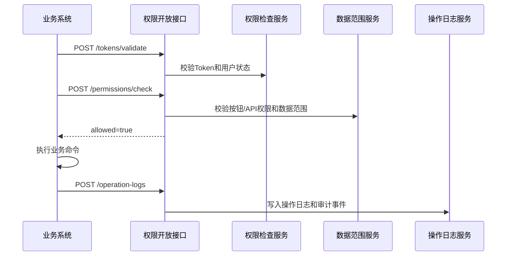
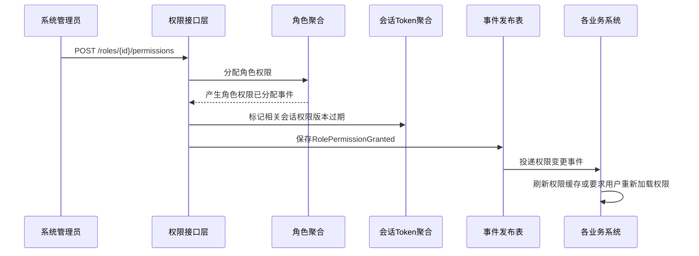
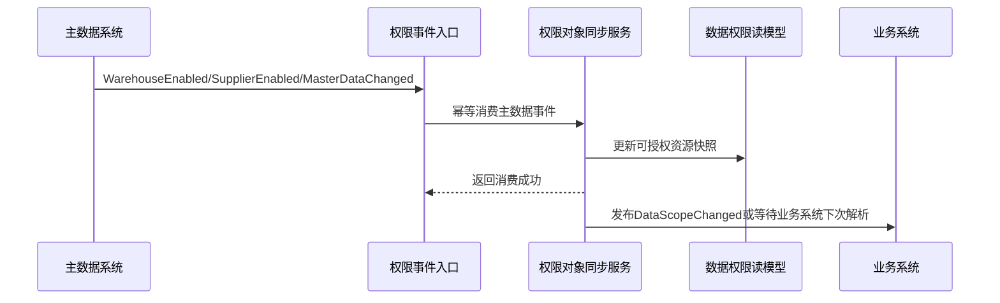

# 09-权限系统接口设计

> 本文根据 [01-权限系统产品功能设计](../04-子系统功能设计/09-权限系统/01-权限系统产品功能设计.md)、[09-权限系统数据库设计](../05-子系统数据库设计/09-权限系统数据库设计.md) 和 [上下文映射与领域事件目录](./00-上下文映射与领域事件目录.md) 设计。接口按 DDD + CQRS 口径拆分：查询接口读取权限读模型，命令接口触发应用服务和聚合行为，跨系统接口以认证、授权、数据范围、审计和审批协作为边界。

## 1. 设计范围

| 类型 | 范围 | 说明 |
| --- | --- | --- |
| 前端页面接口 | 登录页、个人中心、用户管理、角色管理、菜单页面管理、权限点管理、角色授权、用户角色、数据权限、会话管理、登录日志、操作日志、应用/SSO配置、枚举配置 | 面向系统管理员、组织管理员、业务主管、审批人、审计人员和普通用户 |
| 跨系统命令接口 | 各业务系统 -> 权限系统、权限系统 -> 主数据/业务系统 | 支撑登录认证、Token 校验、菜单按钮权限查询、权限检查、数据范围解析、操作日志写入、审批任务创建 |
| 跨系统事件接口 | 权限系统 -> 各业务系统、主数据/人事/业务系统 -> 权限系统 | 异步传递用户、角色、权限、数据范围、会话、安全风险、审批和审计事实 |
| 不包含 | 采购、库存、仓储、运输、结算、主数据业务状态推进 | 权限系统只拥有身份、授权、会话、审计和审批流转事实，不修改业务上下文单据 |

## 2. DDD 对齐说明

| DDD 关注点 | 本文口径 |
| --- | --- |
| 限界上下文 | 权限上下文 |
| 核心聚合 | 应用、SSO客户端、用户、用户角色关系、角色、角色权限关系、菜单/页面、权限点、数据权限范围、用户会话/Token、登录日志、操作日志、审批实例、安全策略 |
| 查询模型 | 当前用户权限快照、菜单树、按钮权限、API权限、字段权限、数据范围、用户列表、角色列表、授权矩阵、在线会话、登录日志、操作日志、审计报表 |
| 命令接口 | 登录、刷新Token、登出、强制下线、创建/修改/启停用户，分配/取消角色，创建/修改/启停角色，分配/取消权限，注册/绑定API权限点，配置数据范围，写入审计日志 |
| 领域事件 | 应用已创建/启用/停用、SSO客户端已配置、用户已创建/激活/锁定/停用、用户角色已分配/取消、角色已创建/启用/停用、角色权限已分配/取消、权限点已注册/变更/API已绑定/停用、数据范围已变更、用户已登录、Token已刷新/失效、会话已踢出、审计日志已创建等 |
| 数据主权 | 09-权限系统拥有应用接入、账号身份、角色授权、菜单按钮/API/字段权限、数据权限范围、Token会话、登录日志、操作日志和审批授权事实 |
| 幂等规则 | 所有写接口必须携带 `X-Idempotency-Key`；跨系统事件消费以 `sourceContext + eventId + aggregateId` 幂等；权限检查和 Token 校验不改变业务状态，可按 `requestId` 追踪审计 |

## 3. 通用协议

### 3.1 基础路径

| 场景 | 基础路径 |
| --- | --- |
| 前端页面接口 | `/api/iam/v1` |
| 跨系统开放命令接口 | `/openapi/iam/v1` |
| 事件回调/事件消费入口 | `/internal/iam/v1/events` |

### 3.2 通用请求头

| 请求头 | 必填 | 适用接口 | 说明 |
| --- | --- | --- | --- |
| `Authorization` | 除登录外必填 | 前端接口、跨系统用户态接口 | `Bearer access_token`，由09-权限系统签发 |
| `X-Tenant-Id` | 否 | 全部 | 租户 ID，单租户可不传 |
| `X-Org-Id` | 是 | 前端接口、数据权限接口 | 当前组织 ID，用于组织级数据范围 |
| `X-App-Code` | 是 | 全部 | 当前访问应用，如 `SUPPLIER`、`PURCHASE`、`WMS`、`OMS`、`TMS`、`BMS`、`MDM`、`IAM` |
| `X-Request-Id` | 是 | 全部 | 请求链路 ID |
| `X-Trace-Id` | 否 | 全部 | 分布式链路追踪 ID |
| `X-Idempotency-Key` | 写接口必填 | 命令接口、跨系统命令 | 同一业务动作唯一 |
| `X-Source-System` | 跨系统必填 | 跨系统命令、事件入口 | `SUPPLIER`、`PURCHASE`、`WMS`、`OMS`、`INVENTORY`、`TMS`、`BMS`、`MDM`、`IAM` |
| `X-Operator-Id` | 写接口必填 | 命令接口 | 操作人；系统任务传系统账号 |
| `X-Data-Scope` | 否 | 前端查询 | 网关或权限中间件解析后的数据范围摘要 |
| `Accept-Language` | 否 | 全部 | `zh-CN` 默认 |

### 3.3 通用响应结构

```json
{
  "success": true,
  "code": "SUCCESS",
  "message": "处理成功",
  "requestId": "REQ202607040001",
  "traceId": "TRACE202607040001",
  "timestamp": "2026-07-04T10:00:00+08:00",
  "data": {}
}
```

分页响应：

```json
{
  "success": true,
  "code": "SUCCESS",
  "message": "查询成功",
  "data": {
    "pageNo": 1,
    "pageSize": 20,
    "total": 128,
    "records": []
  }
}
```

命令响应：

```json
{
  "success": true,
  "code": "SUCCESS",
  "message": "命令已处理",
  "data": {
    "aggregateId": "190001",
    "businessNo": "IAM-USER-10001",
    "status": 2,
    "statusName": "已启用",
    "version": 3,
    "eventId": "EVT202607040001",
    "idempotentHit": false
  }
}
```

### 3.4 HTTP 状态码

| HTTP 状态码 | 场景 | 前端处理 |
| --- | --- | --- |
| `200` | 查询成功、命令同步处理成功 | 正常刷新页面 |
| `201` | 新增成功 | 跳转详情或继续编辑 |
| `202` | 命令已受理，异步处理 | 展示处理中，轮询任务或等待事件 |
| `204` | 登出、撤销 Token、关闭会话后无返回体 | 返回登录页或刷新列表 |
| `400` | 请求格式错误、字段类型错误 | 表单提示 |
| `401` | 未登录、Token 过期、Token 已撤销 | 跳转登录或刷新 Token |
| `403` | 无菜单/按钮/API/字段/数据权限 | 隐藏按钮或弹出无权限 |
| `404` | 用户、角色、权限点、会话不存在或无数据权限导致不可见 | 提示记录不存在 |
| `409` | 乐观锁冲突、幂等内容不一致、状态机冲突、唯一账号/编码冲突 | 提示刷新后重试 |
| `422` | 业务规则不通过 | 展示业务原因，如角色未启用、权限点已停用、数据范围非法 |
| `429` | 登录失败次数过多或请求过于频繁 | 稍后重试或触发安全策略 |
| `500` | 系统异常 | 记录错误并提示稍后重试 |

### 3.5 业务错误码

| 业务码 | HTTP | 含义 |
| --- | --- | --- |
| `SUCCESS` | `200/201` | 成功 |
| `ACCEPTED` | `202` | 已受理异步处理 |
| `VALIDATION_FAILED` | `400` | 字段校验失败 |
| `UNAUTHORIZED` | `401` | 未认证 |
| `TOKEN_EXPIRED` | `401` | Token 已过期 |
| `TOKEN_REVOKED` | `401` | Token 已撤销或会话被踢出 |
| `FORBIDDEN` | `403` | 无权限 |
| `IAM_SCOPE_DENIED` | `403` | 当前用户无该组织、仓库、货主、供应商/客户数据范围 |
| `NOT_FOUND` | `404` | 资源不存在 |
| `VERSION_CONFLICT` | `409` | 乐观锁版本冲突 |
| `IDEMPOTENCY_CONFLICT` | `409` | 同一幂等键请求内容不一致 |
| `STATE_CONFLICT` | `409` | 当前状态不允许该命令 |
| `DUPLICATE_USERNAME` | `409` | 登录账号重复 |
| `DUPLICATE_ROLE_CODE` | `409` | 角色编码重复 |
| `DUPLICATE_PERMISSION_CODE` | `409` | 权限编码重复 |
| `PASSWORD_POLICY_FAILED` | `422` | 密码复杂度或历史密码规则不通过 |
| `MFA_REQUIRED` | `422` | 需要二次认证 |
| `ROLE_NOT_ENABLED` | `422` | 角色未启用，不能授权 |
| `PERMISSION_NOT_ENABLED` | `422` | 权限点未启用，不能授权或校验 |
| `SYSTEM_ERROR` | `500` | 系统异常 |

## 4. 通用对象字段

### 4.1 分页查询字段

| 字段 | 类型 | 必填 | 说明 |
| --- | --- | --- | --- |
| `pageNo` | int | 是 | 页码，从 1 开始 |
| `pageSize` | int | 是 | 每页条数，支持 10、20、50 |
| `sortField` | string | 否 | 排序字段，如 `updatedAt`、`createdAt`、`status`、`username` |
| `sortOrder` | string | 否 | `asc`、`desc`，默认 `desc` |

### 4.2 状态时间线字段

| 字段 | 类型 | 说明 |
| --- | --- | --- |
| `nodeCode` | string | 状态节点编码 |
| `nodeName` | string | 状态节点名称 |
| `status` | int | 1 未开始，2 进行中，3 已完成，4 已驳回/异常 |
| `operatorId` | string | 操作人 ID |
| `operatorName` | string | 操作人名称 |
| `occurredAt` | datetime | 发生时间 |
| `remark` | string | 备注 |

### 4.3 权限数据隔离

| 用户类型 | 数据范围规则 |
| --- | --- |
| 系统管理员 | 只能管理被授权应用、组织和系统配置范围，不默认拥有所有业务系统权限 |
| 组织管理员 | 只能管理本组织及下级组织内用户、角色和数据范围 |
| 业务主管 | 只能配置自己负责业务域、应用和审批授权范围内的角色、权限和数据范围 |
| 审批人 | 只能处理分派给自己的审批待办和已授权审批范围 |
| 审计人员 | 只能查看授权应用、模块、组织和时间范围内的登录日志、操作日志和权限变更 |
| 普通用户 | 只能查看个人中心、自己的菜单、按钮、数据范围和会话 |
| 系统账号 | 只能调用被授权的开放接口和 API 权限，不允许登录后台页面 |

## 5. 前端页面接口

### 5.1 登录页和个人中心

| 接口 | 方法 | 路径 | 页面调用位置 | 权限点 | 领域动作 |
| --- | --- | --- | --- | --- | --- |
| 用户登录 | `POST` | `/api/iam/v1/auth/login` | 登录页“登录” | `iam:login:login` | 校验账号密码/MFA 并签发 Token |
| 刷新 Token | `POST` | `/api/iam/v1/auth/refresh` | Token 即将过期时 | 登录态 | 刷新访问令牌 |
| 退出登录 | `POST` | `/api/iam/v1/auth/logout` | 顶部用户菜单“退出” | 登录态 | 撤销当前会话 |
| 获取当前用户 | `GET` | `/api/iam/v1/users/me` | 个人中心打开时 | 登录态 | 查询当前用户资料 |
| 修改个人资料 | `PUT` | `/api/iam/v1/users/me/profile` | 个人中心“保存” | 登录态 | 修改本人非关键资料 |
| 修改密码 | `POST` | `/api/iam/v1/users/me/password` | 个人中心“修改密码” | 登录态 | 修改本人密码 |
| 查询我的权限 | `GET` | `/api/iam/v1/users/me/permissions` | 登录后加载菜单、按钮、数据范围 | 登录态 | 查询当前用户权限快照 |

登录请求字段：

| 字段 | 类型 | 必填 | 说明 |
| --- | --- | --- | --- |
| `username` | string | 是 | 登录账号 |
| `password` | string | 密码登录必填 | 明文只在传输层出现，服务端不落库 |
| `captchaCode` | string | 按安全策略 | 验证码 |
| `mfaCode` | string | 启用 MFA 时必填 | 二次认证验证码 |
| `appCode` | string | 是 | 登录目标应用 |
| `tenantId/orgId` | string | 否 | 租户/组织 |
| `clientInfo` | object | 否 | IP、浏览器、设备、来源渠道 |

响应字段：`accessToken`、`refreshToken`、`tokenType`、`expiresIn`、`refreshExpiresIn`、`userId`、`username`、`realName`、`userType`、`status`、`roles[]`、`menus[]`、`permissions[]`、`dataScopes[]`、`permissionVersion`、`mfaRequired`。

成功事件：`用户已登录`、`Token已刷新`、`Token已失效`、`登录失败已记录`。

状态码：`200`、`201`、`400`、`401`、`403`、`409`、`422`、`429`、`500`。

### 5.2 用户管理

| 接口 | 方法 | 路径 | 页面调用位置 | 权限点 | 领域动作 |
| --- | --- | --- | --- | --- | --- |
| 查询用户列表 | `GET` | `/api/iam/v1/users` | 用户管理页查询、分页、排序 | `iam:user:read` | 查询读模型 |
| 查询用户详情 | `GET` | `/api/iam/v1/users/{userId}` | 详情页打开时 | `iam:user:read` | 查询读模型 |
| 新增用户 | `POST` | `/api/iam/v1/users` | 用户管理页“新增” | `iam:user:create` | 创建用户 |
| 修改用户 | `PUT` | `/api/iam/v1/users/{userId}` | 用户管理页“编辑” | `iam:user:update` | 修改用户资料 |
| 启用用户 | `POST` | `/api/iam/v1/users/{userId}/enable` | 行内“启用” | `iam:user:enable` | 启用用户 |
| 停用用户 | `POST` | `/api/iam/v1/users/{userId}/disable` | 行内“停用” | `iam:user:disable` | 停用用户并失效会话 |
| 锁定用户 | `POST` | `/api/iam/v1/users/{userId}/lock` | 行内“锁定” | `iam:user:disable` | 锁定用户 |
| 重置密码 | `POST` | `/api/iam/v1/users/{userId}/reset-password` | 行内“重置密码” | `iam:user:page` | 重置用户密码 |
| 分配用户角色 | `POST` | `/api/iam/v1/users/{userId}/roles` | 用户详情“分配角色” | `iam:user:role` | 分配角色 |

查询请求字段：`username`、`realName`、`mobile`、`email`、`userType`、`employeeNo`、`status`、`mfaEnabled`、`roleCode`、`orgId`、`pageNo/pageSize/sortField/sortOrder`。

新增/修改请求字段：

| 字段 | 类型 | 必填 | 说明 |
| --- | --- | --- | --- |
| `username` | string | 新增必填 | 登录账号，全局唯一 |
| `password` | string | 本地账号新增可选 | 初始密码；为空时生成激活链接 |
| `realName` | string | 是 | 姓名 |
| `nickname` | string | 否 | 昵称 |
| `mobile/email` | string | 否 | 手机号/邮箱 |
| `userType` | string/int | 是 | `USER_TYPE`：内部员工、供应商用户、客户用户、系统账号 |
| `employeeNo` | string | 否 | 工号 |
| `mfaEnabled` | boolean | 是 | 是否启用 MFA |
| `orgIds[]` | array | 否 | 所属组织 |
| `externalBinding` | object | 外部用户可选 | 供应商、客户、货主等外部主体绑定 |
| `version` | int | 修改/命令必填 | 乐观锁版本 |

分配角色请求字段：`roleIds[]`、`grantType`、`effectiveFrom`、`effectiveTo`、`grantReason`、`version`。

响应字段：`userId`、`username`、`realName`、`nickname`、`mobile`、`email`、`userType/typeName`、`employeeNo`、`mfaEnabled`、`lastLoginAt`、`loginFailCount`、`lockedUntil`、`status/statusName`、`roles[]`、`dataScopes[]`、`statusTimeline[]`、`version`。

成功事件：`用户已创建`、`用户已激活`、`用户已锁定`、`用户已停用`、`用户角色已分配`、`用户角色已取消`、`Token已失效`。

状态码：`200`、`201`、`202`、`400`、`401`、`403`、`404`、`409`、`422`、`500`。

### 5.3 角色管理

| 接口 | 方法 | 路径 | 页面调用位置 | 权限点 | 领域动作 |
| --- | --- | --- | --- | --- | --- |
| 查询角色列表 | `GET` | `/api/iam/v1/roles` | 角色管理页查询、分页、排序 | `iam:role:read` | 查询读模型 |
| 查询角色详情 | `GET` | `/api/iam/v1/roles/{roleId}` | 详情页打开时 | `iam:role:read` | 查询读模型 |
| 新增角色 | `POST` | `/api/iam/v1/roles` | 角色管理页“新增” | `iam:role:create` | 创建角色 |
| 修改角色 | `PUT` | `/api/iam/v1/roles/{roleId}` | 角色管理页“编辑” | `iam:role:update` | 修改角色 |
| 启用角色 | `POST` | `/api/iam/v1/roles/{roleId}/enable` | 行内“启用” | `iam:role:enable` | 启用角色 |
| 停用角色 | `POST` | `/api/iam/v1/roles/{roleId}/disable` | 行内“停用” | `iam:role:disable` | 停用角色并标记相关会话权限版本过期 |
| 查询角色用户 | `GET` | `/api/iam/v1/roles/{roleId}/users` | 行内“查看用户” | `iam:role:user` | 查询角色下用户 |

查询请求字段：`roleCode`、`roleName`、`roleType`、`appScope`、`dataScopeType`、`status`、`pageNo/pageSize/sortField/sortOrder`。

新增/修改请求字段：

| 字段 | 类型 | 必填 | 说明 |
| --- | --- | --- | --- |
| `roleCode` | string | 新增必填 | 角色编码，全局唯一 |
| `roleName` | string | 是 | 角色名称 |
| `roleType` | string/int | 是 | `ROLE_TYPE`：系统角色、业务角色、外部角色 |
| `appScope` | string | 否 | 适用应用或 `ALL` |
| `dataScopeType` | string/int | 是 | 默认数据范围 |
| `description` | string | 否 | 角色说明 |
| `version` | int | 修改/命令必填 | 乐观锁版本 |

响应字段：`roleId`、`roleCode`、`roleName`、`roleType/typeName`、`appScope`、`dataScopeType/typeName`、`description`、`status/statusName`、`permissionCount`、`userCount`、`statusTimeline[]`、`version`。

成功事件：`角色已创建`、`角色已启用`、`角色已停用`、`角色权限已变更`。

状态码：`200`、`201`、`400`、`401`、`403`、`404`、`409`、`422`、`500`。

### 5.4 菜单页面管理

| 接口 | 方法 | 路径 | 页面调用位置 | 权限点 | 领域动作 |
| --- | --- | --- | --- | --- | --- |
| 查询菜单树 | `GET` | `/api/iam/v1/menus` | 菜单页面管理页打开、登录后加载菜单 | `iam:menu:read` | 查询菜单读模型 |
| 查询菜单详情 | `GET` | `/api/iam/v1/menus/{menuId}` | 详情页打开时 | `iam:menu:read` | 查询读模型 |
| 新增菜单 | `POST` | `/api/iam/v1/menus` | 菜单管理页“新增菜单” | `iam:menu:menu` | 创建菜单/页面 |
| 修改菜单 | `PUT` | `/api/iam/v1/menus/{menuId}` | 行内“编辑” | `iam:menu:update` | 修改菜单/页面 |
| 调整菜单排序 | `POST` | `/api/iam/v1/menus/sort` | 菜单管理页“调整排序” | `iam:menu:page` | 调整菜单树顺序 |
| 停用菜单 | `POST` | `/api/iam/v1/menus/{menuId}/disable` | 行内“停用” | `iam:menu:disable` | 停用菜单/页面 |

查询请求字段：`appCode`、`menuCode`、`menuName`、`menuType`、`status`、`visibleOnly`。

新增/修改请求字段：

| 字段 | 类型 | 必填 | 说明 |
| --- | --- | --- | --- |
| `appCode` | string | 是 | 所属应用 |
| `parentMenuId` | string | 否 | 上级菜单 |
| `menuCode` | string | 新增必填 | 菜单编码，应用内唯一 |
| `menuName` | string | 是 | 菜单名称 |
| `menuType` | string/int | 是 | `MENU_TYPE`：目录、页面、外链 |
| `routePath` | string | 页面/外链必填 | 前端路由 |
| `componentPath` | string | 页面可选 | 前端组件路径 |
| `icon` | string | 否 | 图标 |
| `sortNo` | int | 是 | 排序 |
| `visible` | boolean | 是 | 是否在菜单展示 |
| `version` | int | 修改/命令必填 | 乐观锁版本 |

响应字段：`menuId`、`appCode`、`parentMenuId`、`menuCode`、`menuName`、`menuType/typeName`、`routePath`、`componentPath`、`icon`、`sortNo`、`visible`、`status/statusName`、`children[]`、`version`。

成功事件：`权限点已变更`、`角色权限已变更`。

状态码：`200`、`201`、`400`、`401`、`403`、`404`、`409`、`422`、`500`。

### 5.5 权限点管理

| 接口 | 方法 | 路径 | 页面调用位置 | 权限点 | 领域动作 |
| --- | --- | --- | --- | --- | --- |
| 查询权限点列表 | `GET` | `/api/iam/v1/permissions` | 权限点管理页查询、分页、排序 | `iam:permission:read` | 查询读模型 |
| 查询权限点详情 | `GET` | `/api/iam/v1/permissions/{permissionId}` | 详情页打开时 | `iam:permission:read` | 查询读模型 |
| 新增权限点 | `POST` | `/api/iam/v1/permissions` | 权限点管理页“新增” | `iam:permission:create` | 注册权限点 |
| 修改权限点 | `PUT` | `/api/iam/v1/permissions/{permissionId}` | 行内“编辑” | `iam:permission:update` | 变更权限点 |
| 绑定菜单 | `POST` | `/api/iam/v1/permissions/{permissionId}/bind-menu` | 行内“绑定菜单” | `iam:permission:menu` | 绑定菜单资源 |
| 绑定 API | `POST` | `/api/iam/v1/permissions/{permissionId}/bind-api` | 行内“绑定 API” | `iam:permission:api` | 绑定 API 资源 |
| 停用权限点 | `POST` | `/api/iam/v1/permissions/{permissionId}/disable` | 行内“停用” | `iam:permission:update` | 停用权限点 |

查询请求字段：`appCode`、`permissionCode`、`permissionName`、`permissionType`、`resourceType`、`actionType`、`apiMethod`、`apiPath`、`fieldCode`、`status`、`pageNo/pageSize/sortField/sortOrder`。

新增/修改请求字段：

| 字段 | 类型 | 必填 | 说明 |
| --- | --- | --- | --- |
| `appCode` | string | 是 | 所属应用 |
| `permissionCode` | string | 新增必填 | 权限编码，如 `wms:outbound:create` |
| `permissionName` | string | 是 | 权限名称 |
| `permissionType` | string/int | 是 | `PERMISSION_TYPE`：菜单、按钮、API、字段 |
| `resourceType` | string/int | 是 | `RESOURCE_TYPE`：页面、按钮、接口、字段 |
| `actionType` | string/int | 是 | `ACTION_TYPE`：CREATE、READ、UPDATE、DELETE、EXPORT、IMPORT、APPROVE 等 |
| `menuId` | string | 否 | 绑定菜单 |
| `buttonCode` | string | 按钮权限可选 | 按钮编码 |
| `apiMethod` | string | API 权限必填 | `GET`、`POST`、`PUT`、`DELETE` |
| `apiPath` | string | API 权限必填 | API 路径模板 |
| `fieldCode` | string | 字段权限必填 | 字段编码 |
| `version` | int | 修改/命令必填 | 乐观锁版本 |

响应字段：`permissionId`、`appCode`、`permissionCode`、`permissionName`、`permissionType/typeName`、`resourceType/typeName`、`actionType/typeName`、`menuId/menuName`、`apiMethod`、`apiPath`、`fieldCode`、`status/statusName`、`version`。

成功事件：`权限点已注册`、`权限点已变更`、`权限点API已绑定`、`权限点已停用`、`角色权限已变更`。

状态码：`200`、`201`、`400`、`401`、`403`、`404`、`409`、`422`、`500`。

### 5.6 角色授权页

| 接口 | 方法 | 路径 | 页面调用位置 | 权限点 | 领域动作 |
| --- | --- | --- | --- | --- | --- |
| 查询角色授权矩阵 | `GET` | `/api/iam/v1/roles/{roleId}/permission-tree` | 角色授权页打开 | `iam:role:read` | 查询授权矩阵 |
| 保存角色权限 | `POST` | `/api/iam/v1/roles/{roleId}/permissions` | 角色授权页“保存” | `iam:role:page` | 分配角色权限 |
| 取消角色权限 | `POST` | `/api/iam/v1/roles/{roleId}/permissions/revoke` | 角色授权页“取消授权” | `iam:role:revoke` | 取消角色权限 |
| 查询角色权限变更记录 | `GET` | `/api/iam/v1/roles/{roleId}/permission-changes` | 角色详情变更记录页签 | `iam:role:read` | 查询读模型 |

保存角色权限请求字段：

| 字段 | 类型 | 必填 | 说明 |
| --- | --- | --- | --- |
| `appCode` | string | 是 | 授权应用 |
| `permissionIds[]` | array | 是 | 授权后的权限点集合 |
| `dataScopes[]` | array | 否 | 随角色配置的数据范围 |
| `grantReason` | string | 否 | 授权原因 |
| `version` | int | 是 | 角色乐观锁版本 |

响应字段：`roleId`、`roleCode`、`permissionCount`、`grantedPermissions[]`、`revokedPermissions[]`、`permissionVersion`、`idempotentHit`。

成功事件：`角色权限已分配`、`角色权限已取消`、`角色权限已变更`。

状态码：`200`、`201`、`400`、`401`、`403`、`404`、`409`、`422`、`500`。

### 5.7 用户角色和数据权限页

| 接口 | 方法 | 路径 | 页面调用位置 | 权限点 | 领域动作 |
| --- | --- | --- | --- | --- | --- |
| 查询用户角色列表 | `GET` | `/api/iam/v1/user-roles` | 用户角色页查询、分页、排序 | `iam:userrole:read` | 查询读模型 |
| 分配用户角色 | `POST` | `/api/iam/v1/user-roles` | 用户角色页“分配角色” | `iam:userrole:role` | 分配用户角色 |
| 取消用户角色 | `POST` | `/api/iam/v1/user-roles/{userRoleId}/revoke` | 用户角色页“取消角色” | `iam:userrole:role` | 取消用户角色 |
| 查询数据权限 | `GET` | `/api/iam/v1/data-scopes` | 用户/角色详情数据范围页签 | `iam:userrole:read` | 查询数据范围 |
| 保存数据权限 | `POST` | `/api/iam/v1/data-scopes` | 用户/角色详情“保存数据范围” | `iam:userrole:role`、`iam:role:page` | 分配数据范围 |
| 停用数据权限 | `POST` | `/api/iam/v1/data-scopes/{dataScopeId}/disable` | 数据权限行内“停用” | `iam:userrole:role`、`iam:role:page` | 停用数据范围 |

用户角色查询字段：`userId`、`username`、`roleId`、`roleCode`、`grantType`、`status`、`effectiveFrom/effectiveTo`、`pageNo/pageSize/sortField/sortOrder`。

分配用户角色请求字段：`userId`、`roleIds[]`、`grantType`、`effectiveFrom`、`effectiveTo`、`grantReason`、`version`。

数据权限请求字段：

| 字段 | 类型 | 必填 | 说明 |
| --- | --- | --- | --- |
| `subjectType` | string/int | 是 | `SUBJECT_TYPE`：用户、角色 |
| `subjectId` | string | 是 | 用户 ID 或角色 ID |
| `appCode` | string | 是 | 应用编码 |
| `scopeType` | string/int | 是 | `DATA_SCOPE_TYPE`：全部、本组织、本组织及下级、自定义、本人 |
| `resourceType` | string/int | 是 | `DATA_RESOURCE_TYPE`：组织、仓库、供应商、客户、货主 |
| `resourceIds[]` | array | 自定义必填 | 自定义资源 ID |
| `effectiveFrom/effectiveTo` | datetime | 否 | 生效/失效时间 |
| `version` | int | 修改/命令必填 | 乐观锁版本 |

响应字段：`userRoleId`、`userId/username/realName`、`roleId/roleCode/roleName`、`grantType/typeName`、`effectiveFrom`、`effectiveTo`、`status/statusName`、`dataScopes[]`、`permissionVersion`、`version`。

成功事件：`用户角色已分配`、`用户角色已取消`、`数据权限已创建`、`数据范围已分配`、`数据范围已变更`、`数据范围已取消`、`数据权限已停用`、`角色权限已变更`。

状态码：`200`、`201`、`400`、`401`、`403`、`404`、`409`、`422`、`500`。

### 5.8 会话管理

| 接口 | 方法 | 路径 | 页面调用位置 | 权限点 | 领域动作 |
| --- | --- | --- | --- | --- | --- |
| 查询会话列表 | `GET` | `/api/iam/v1/sessions` | 会话管理页查询、分页、排序 | `iam:session:read` | 查询会话读模型 |
| 查询会话详情 | `GET` | `/api/iam/v1/sessions/{userTokenId}` | 详情页打开时 | `iam:session:detail` | 查询会话详情 |
| 强制下线 | `POST` | `/api/iam/v1/sessions/{userTokenId}/kick-out` | 行内“强制下线” | `iam:session:page` | 踢出会话并撤销 Token |
| 批量强制下线 | `POST` | `/api/iam/v1/sessions/kick-out` | 顶部“批量下线” | `iam:session:page` | 批量撤销 Token |

查询请求字段：`userId`、`username`、`appCode`、`tokenStatus`、`loginIp`、`loginFrom/loginTo`、`expiresFrom/expiresTo`、`pageNo/pageSize/sortField/sortOrder`。

强制下线请求字段：`kickReason`、`version`。

响应字段：`userTokenId`、`userId/username/realName`、`accessTokenJti`、`refreshTokenJti`、`tokenStatus/statusName`、`loginIp`、`userAgent`、`loginAt`、`expiresAt`、`refreshExpiresAt`、`logoutAt`、`version`。

成功事件：`Token已失效`、`会话已踢出`。

状态码：`200`、`202`、`204`、`400`、`401`、`403`、`404`、`409`、`422`、`500`。

### 5.9 登录日志和操作日志

| 接口 | 方法 | 路径 | 页面调用位置 | 权限点 | 说明 |
| --- | --- | --- | --- | --- | --- |
| 查询登录日志 | `GET` | `/api/iam/v1/login-logs` | 登录日志列表、用户详情登录记录 | `iam:operation_log:read` | 查询登录日志 |
| 查询登录日志详情 | `GET` | `/api/iam/v1/login-logs/{loginLogId}` | 登录日志详情打开时 | `iam:operation_log:read` | 查询登录失败原因和客户端 |
| 查询操作日志 | `GET` | `/api/iam/v1/operation-logs` | 操作日志页列表、详情页日志区域 | `iam:operation_log:read` | 查询操作日志 |
| 查询操作日志详情 | `GET` | `/api/iam/v1/operation-logs/{operationLogId}` | 操作日志详情打开时 | `iam:operation_log:read` | 查询前后快照 |
| 导出操作日志 | `POST` | `/api/iam/v1/operation-logs/export` | 操作日志页顶部“导出” | `iam:operation_log:export` | 创建导出任务 |

登录日志查询字段：`username`、`loginResult`、`failureReason`、`loginIp`、`loginFrom/loginTo`、`pageNo/pageSize`。

操作日志查询字段：`operatorId`、`operatorName`、`appCode`、`moduleCode`、`operationType`、`permissionCode`、`bizType`、`bizNo`、`operationResult`、`ip`、`createdFrom/createdTo`、`pageNo/pageSize`。

响应字段：`operationLogId`、`operatorId/operatorName`、`appCode`、`moduleCode`、`operationType/typeName`、`permissionCode`、`bizType`、`bizNo`、`operationDesc`、`beforeSnapshot`、`afterSnapshot`、`operationResult/resultName`、`failureReason`、`ip`、`userAgent`、`createdAt`。

状态码：`200`、`202`、`400`、`401`、`403`、`404`、`500`。

### 5.10 应用、SSO 和枚举配置

| 接口 | 方法 | 路径 | 页面调用位置 | 权限点 | 领域动作 |
| --- | --- | --- | --- | --- | --- |
| 查询应用列表 | `GET` | `/api/iam/v1/apps` | 应用/枚举配置页查询、分页、排序 | `iam:enumsettings:read` | 查询应用读模型 |
| 新增应用 | `POST` | `/api/iam/v1/apps` | 应用配置页“新增” | `iam:enumsettings:create` | 创建应用 |
| 修改应用 | `PUT` | `/api/iam/v1/apps/{appId}` | 应用配置页“编辑” | `iam:enumsettings:update` | 修改应用 |
| 启停应用 | `POST` | `/api/iam/v1/apps/{appId}/toggle` | 行内“启停” | `iam:enumsettings:disable` | 启用或停用应用 |
| 查询 SSO 客户端 | `GET` | `/api/iam/v1/sso-clients` | SSO配置页 | `iam:enumsettings:read` | 查询 SSO 配置 |
| 保存 SSO 客户端 | `POST` | `/api/iam/v1/sso-clients` | SSO配置页“保存” | `iam:enumsettings:update` | 配置 SSO 客户端 |
| 重置客户端密钥 | `POST` | `/api/iam/v1/sso-clients/{ssoId}/reset-secret` | SSO配置页“重置密钥” | `iam:enumsettings:update` | 重置客户端密钥 |
| 查询枚举项 | `GET` | `/api/iam/v1/enums` | 枚举配置页、各页面下拉框 | `iam:enumsettings:read` | 查询枚举项 |
| 新增枚举项 | `POST` | `/api/iam/v1/enums` | 枚举配置页“新增” | `iam:enumsettings:create` | 新增可配置枚举 |
| 修改枚举项 | `PUT` | `/api/iam/v1/enums/{enumItemId}` | 枚举配置页“编辑” | `iam:enumsettings:update` | 修改标签、颜色、排序 |
| 停用枚举项 | `POST` | `/api/iam/v1/enums/{enumItemId}/disable` | 行内“停用” | `iam:enumsettings:disable` | 停用非核心枚举 |

应用请求字段：`appCode`、`appName`、`appType`、`baseUrl`、`status`、`sortNo`、`remark`、`version`。

SSO 请求字段：`appCode`、`clientCode`、`redirectUris[]`、`grantTypes[]`、`tokenTtlSeconds`、`refreshTtlSeconds`、`status`、`version`。

枚举请求字段：`enumType`、`value`、`label`、`sortNo`、`status`、`color`、`version`。

响应字段：`appId`、`appCode`、`appName`、`appType/typeName`、`baseUrl`、`status/statusName`、`ssoClient`、`enumItems[]`、`version`。

成功事件：`应用已创建`、`应用已启用`、`SSO客户端已配置`、`应用已停用`、`安全风险已识别`。

状态码：`200`、`201`、`400`、`401`、`403`、`404`、`409`、`422`、`500`。

## 6. 跨系统命令接口

### 6.1 各业务系统调用09-权限系统：校验 Token

```text
POST /openapi/iam/v1/tokens/validate
```

调用时机：各业务系统网关或后端在进入系统、提交写操作、执行跨系统命令前校验登录态。

权限侧处理：校验 Token 签名、过期时间、撤销状态、用户状态、应用状态和权限版本，返回用户身份和授权快照。

请求头：`X-Source-System`、`X-Request-Id`。

请求字段：

| 字段 | 类型 | 必填 | 说明 |
| --- | --- | --- | --- |
| `accessToken` | string | 是 | 待校验访问令牌 |
| `appCode` | string | 是 | 目标应用 |
| `requiredPermissionCode` | string | 否 | 进入接口时需要的权限点 |
| `requestPath` | string | 否 | 当前 API 路径 |
| `requestMethod` | string | 否 | 当前 HTTP 方法 |

响应字段：`valid`、`userId`、`username`、`realName`、`userType`、`status`、`roles[]`、`permissions[]`、`dataScopes[]`、`permissionVersion`、`failureCode`、`failureReason`。

状态码：`200`、`400`、`401`、`403`、`422`、`500`。

### 6.2 各业务系统调用09-权限系统：获取当前用户权限

```text
GET /openapi/iam/v1/users/me/permissions
```

调用时机：供应商、采购、WMS、库存、OMS、TMS、BMS、主数据系统登录后加载菜单、按钮、API 和数据范围。

请求字段：`appCode`、`includeMenus`、`includeButtons`、`includeApis`、`includeFields`、`includeDataScopes`。

响应字段：`userId`、`username`、`appCode`、`menus[]`、`buttons[]`、`apis[]`、`fields[]`、`dataScopes[]`、`roles[]`、`permissionVersion`。

状态码：`200`、`400`、`401`、`403`、`422`、`500`。

### 6.3 各业务系统调用09-权限系统：检查权限点

```text
POST /openapi/iam/v1/permissions/check
```

调用时机：业务系统执行高风险写操作、导出、审批、字段级访问或绕过前端直接调用 API 时进行后端校验。

权限侧处理：校验用户状态、角色状态、权限点状态、API 绑定、按钮权限、字段权限和数据范围，拒绝时写入拒绝访问审计。

请求字段：

| 字段 | 类型 | 必填 | 说明 |
| --- | --- | --- | --- |
| `userId` | string | 是 | 用户 ID |
| `appCode` | string | 是 | 应用编码 |
| `permissionCode` | string | 是 | 权限点编码 |
| `resourceType` | string | 否 | 页面、按钮、接口、字段 |
| `actionType` | string | 否 | CREATE、READ、UPDATE、DELETE、EXPORT、IMPORT、APPROVE |
| `businessContext` | object | 否 | 组织、仓库、货主、供应商/客户、单据归属等 |

响应字段：`allowed`、`denyCode`、`denyReason`、`matchedRoles[]`、`matchedPermissions[]`、`dataScopeDecision`、`permissionVersion`。

状态码：`200`、`400`、`401`、`403`、`422`、`500`。

### 6.4 各业务系统调用09-权限系统：解析数据范围

```text
POST /openapi/iam/v1/data-scopes/resolve
```

调用时机：业务系统列表查询、导出、报表、审批待办查询前，需要把用户角色数据范围转换为可执行过滤条件。

权限侧处理：合并用户直接授权、角色授权、组织继承、岗位继承和系统默认范围，返回资源 ID 集合或范围表达式。

请求字段：

| 字段 | 类型 | 必填 | 说明 |
| --- | --- | --- | --- |
| `userId` | string | 是 | 用户 ID |
| `appCode` | string | 是 | 应用编码 |
| `resourceTypes[]` | array | 是 | 组织、仓库、供应商、客户、货主 |
| `businessScene` | string | 否 | `LIST`、`DETAIL`、`EXPORT`、`APPROVAL`、`COMMAND` |
| `businessContext` | object | 否 | 当前业务上下文 |

响应字段：`dataScopes[].resourceType`、`dataScopes[].scopeType`、`dataScopes[].resourceIds[]`、`dataScopes[].filterExpression`、`dataScopes[].denyAll`、`permissionVersion`。

状态码：`200`、`400`、`401`、`403`、`422`、`500`。

### 6.5 各业务系统调用09-权限系统：写入操作日志

```text
POST /openapi/iam/v1/operation-logs
```

调用时机：业务系统完成写操作、敏感查询、导入导出、审批、权限拒绝或外部回调后写入统一审计。

请求头：`X-Source-System`、`X-Idempotency-Key={sourceSystem}:{requestId}:{operationType}:{bizNo}`。

请求字段：

| 字段 | 类型 | 必填 | 说明 |
| --- | --- | --- | --- |
| `operatorId/operatorName` | string | 是 | 操作人快照 |
| `appCode` | string | 是 | 所属应用 |
| `moduleCode` | string | 是 | 模块编码 |
| `operationType` | string | 是 | CREATE、UPDATE、DELETE、APPROVE、LOGIN、EXPORT 等 |
| `permissionCode` | string | 否 | 对应权限点 |
| `bizType` | string | 否 | 业务对象类型 |
| `bizNo` | string | 否 | 业务单号 |
| `operationDesc` | string | 否 | 简要说明 |
| `beforeSnapshot/afterSnapshot` | object | 否 | 前后快照 |
| `operationResult` | string | 是 | 成功、失败 |
| `failureReason` | string | 失败必填 | 失败原因 |
| `ip/userAgent` | string | 否 | 客户端信息 |

响应字段：`operationLogId`、`receiveStatus`、`idempotentHit`、`message`。

状态码：`200`、`201`、`202`、`400`、`401`、`403`、`409`、`422`、`500`。

### 6.6 各业务系统调用09-权限系统：发起审批任务

```text
POST /openapi/iam/v1/approval-tasks
```

调用时机：采购订单、库存调整、主数据关键字段、TMS 高危动作、BMS 费用调整等需要统一审批时发起审批。

权限侧处理：根据应用、业务类型、金额/数量/风险等级匹配审批配置，创建审批实例和首个待办。

请求头：`X-Source-System`、`X-Idempotency-Key={sourceSystem}:{businessKey}:APPROVAL:{version}`。

请求字段：

| 字段 | 类型 | 必填 | 说明 |
| --- | --- | --- | --- |
| `appCode` | string | 是 | 来源应用 |
| `businessType` | string | 是 | 业务类型 |
| `businessKey` | string | 是 | 业务主键或单号 |
| `title` | string | 是 | 审批标题 |
| `applicantId` | string | 是 | 申请人 |
| `summary` | string | 否 | 摘要 |
| `approvalPayload` | object | 是 | 审批业务载荷 |
| `callbackMode` | string | 否 | `EVENT`、`API` |
| `callbackUrl` | string | API 回调必填 | 回调地址 |

响应字段：`approvalTaskId`、`approvalInstanceId`、`approvalStatus`、`currentNode`、`message`。

状态码：`200`、`201`、`202`、`400`、`401`、`403`、`409`、`422`、`500`。

### 6.7 09-权限系统调用08-主数据系统

| 目标系统 | 接口 | 调用时机 | 用途 |
| --- | --- | --- | --- |
| 主数据系统 | `POST /openapi/mdm/v1/master-data/query` | 配置组织、仓库、货主、供应商、客户、物流商等数据范围时 | 查询可授权资源 |
| 主数据系统 | `POST /openapi/mdm/v1/master-data/validate` | 保存数据范围前 | 校验授权对象存在且已启用 |
| 主数据系统 | `GET /openapi/mdm/v1/master-data/{typeCode}/{dataCode}` | 权限详情、审计详情展示资源名称时 | 查询资源快照 |

## 7. 09-权限系统事件发布

事件通过消息总线发布，也可通过 Outbox 表由集成服务投递。事件标准载荷遵守 [上下文映射与领域事件目录](./00-上下文映射与领域事件目录.md)。

| 事件 | 英文代码 | 触发接口/命令 | 主要消费者 | 关键载荷 |
| --- | --- | --- | --- | --- |
| 应用已创建 | `IamAppCreated` | 新增应用 | 各业务系统、权限缓存、审计日志 | `appId`、`appCode`、`appName`、`appType` |
| 应用已启用 | `IamAppEnabled` | 启用应用 | 各业务系统、网关、权限缓存 | `appId`、`appCode`、`status` |
| SSO客户端已配置 | `SsoClientConfigured` | 保存 SSO 客户端 | 网关、认证服务、安全风控 | `clientCode`、`appCode`、`grantTypes`、`tokenTtlSeconds` |
| 应用已停用 | `IamAppDisabled` | 停用应用 | 各业务系统、网关、权限缓存 | `appId`、`appCode`、`disableReason` |
| 用户已创建 | `UserCreated` | 新增用户 | 各业务系统、权限缓存、审计日志、待办中心 | `userId`、`username`、`userType`、`status` |
| 用户已激活 | `UserActivated` | 启用用户 | 各业务系统、权限缓存、待办中心 | `userId`、`username`、`status` |
| 用户已锁定 | `UserLocked` | 锁定用户/登录失败触发锁定 | 各业务系统、网关、安全风控 | `userId`、`username`、`lockedUntil`、`reason` |
| 用户已停用 | `UserDisabled` | 停用用户 | 各业务系统、网关、安全风控 | `userId`、`username`、`disableReason` |
| 用户角色已分配 | `UserRoleAssigned` | 分配用户角色 | 各业务系统、权限缓存、审计日志 | `userId`、`roleIds[]`、`effectiveFrom`、`effectiveTo` |
| 用户角色已取消 | `UserRoleRevoked` | 取消用户角色 | 各业务系统、权限缓存、审计日志 | `userId`、`roleIds[]`、`revokeReason` |
| 角色已创建 | `RoleCreated` | 新增角色 | 各业务系统、权限缓存、审计日志 | `roleId`、`roleCode`、`roleName`、`roleType` |
| 角色已启用 | `RoleEnabled` | 启用角色 | 各业务系统、权限缓存 | `roleId`、`roleCode`、`status` |
| 角色权限已分配 | `RolePermissionGranted` | 保存角色权限 | 各业务系统、权限缓存、网关 | `roleId`、`grantedPermissionIds[]`、`permissionVersion` |
| 角色权限已取消 | `RolePermissionRevoked` | 取消角色权限 | 各业务系统、权限缓存、网关 | `roleId`、`revokedPermissionIds[]`、`permissionVersion` |
| 角色已停用 | `RoleDisabled` | 停用角色 | 各业务系统、权限缓存、网关 | `roleId`、`roleCode`、`disableReason` |
| 权限点已注册 | `PermissionRegistered` | 新增权限点/API资源扫描 | 各业务系统、网关、权限缓存 | `permissionId`、`permissionCode`、`permissionType`、`apiPath` |
| 权限点已变更 | `PermissionChanged` | 修改权限点 | 各业务系统、网关、权限缓存 | `permissionId`、`permissionCode`、`before/after` |
| 权限点API已绑定 | `PermissionApiBound` | 绑定 API | 网关、业务系统 | `permissionCode`、`apiMethod`、`apiPath` |
| 权限点已停用 | `PermissionDisabled` | 停用权限点 | 各业务系统、网关、权限缓存 | `permissionId`、`permissionCode`、`disableReason` |
| 数据范围已变更 | `DataScopeChanged` | 保存数据权限 | 各业务系统、权限缓存、报表/导出服务 | `subjectType`、`subjectId`、`resourceType`、`scopeType`、`resourceIds` |
| 用户已登录 | `UserLoggedIn` | 用户登录 | 安全风控、审计日志、在线用户看板 | `userId`、`username`、`appCode`、`loginIp` |
| Token已刷新 | `TokenRefreshed` | 刷新 Token | 网关、安全风控、审计日志 | `userId`、`accessTokenJti`、`refreshTokenJti` |
| Token已失效 | `TokenInvalidated` | 登出、停用用户、强制下线 | 网关、各业务系统、安全风控 | `userId`、`accessTokenJti`、`reason` |
| 会话已踢出 | `SessionKickedOut` | 强制下线 | 网关、各业务系统、安全风控 | `userTokenId`、`userId`、`kickReason` |
| 审批已完成 | `ApprovalCompleted` | 审批通过 | 来源业务系统、待办中心、审计日志 | `approvalInstanceId`、`businessKey`、`approvalResult`、`approvedAt` |
| 审批已驳回 | `ApprovalRejected` | 审批驳回 | 来源业务系统、待办中心、审计日志 | `approvalInstanceId`、`businessKey`、`rejectReason` |
| 审计日志已创建 | `AuditLogCreated` | 写入操作日志 | 审计看板、安全风控 | `operationLogId`、`appCode`、`operatorId`、`bizNo` |
| 权限校验已拒绝 | `PermissionCheckDenied` | 权限检查失败 | 安全风控、审计看板 | `userId`、`permissionCode`、`denyReason`、`requestPath` |

## 8. 09-权限系统事件消费

```text
POST /internal/iam/v1/events
```

通用请求字段：

| 字段 | 类型 | 必填 | 说明 |
| --- | --- | --- | --- |
| `eventId` | string | 是 | 外部事件 ID |
| `eventType` | string | 是 | 事件类型 |
| `eventVersion` | string | 是 | 事件版本 |
| `sourceContext` | string | 是 | 来源上下文 |
| `aggregateType` | string | 是 | 来源聚合类型 |
| `aggregateId` | string | 是 | 来源聚合 ID |
| `businessKey` | string | 是 | 来源业务单号 |
| `idempotencyKey` | string | 是 | 事件幂等键 |
| `occurredAt` | datetime | 是 | 事件发生时间 |
| `payload` | object | 是 | 业务载荷 |

响应字段：`consumeId`、`consumeStatus`、`idempotentHit`、`message`。

状态码：`200`、`202`、`400`、`409`、`422`、`500`。

| 消费事件 | 来源系统 | 处理应用服务 | 消费后数据变化 | 幂等键 |
| --- | --- | --- | --- | --- |
| `MasterDataChanged` | 主数据 | 权限对象同步服务 | 更新组织、仓库、货主、供应商、客户、物流商等可授权对象快照 | `MDM:{eventId}:{typeCode}:{dataCode}` |
| `SupplierEnabled` | 主数据 | 外部主体绑定服务 | 允许创建供应商外部用户和供应商数据范围 | `MDM:{eventId}:{supplierId}` |
| `SupplierFrozen` | 主数据/供应商 | 外部主体绑定服务 | 标记供应商用户风险提示，必要时限制高危操作 | `{sourceContext}:{eventId}:{supplierId}` |
| `WarehouseEnabled` | 主数据 | 数据范围对象服务 | 允许仓库作为授权资源 | `MDM:{eventId}:{warehouseId}` |
| `LocationFrozen` | 主数据 | 数据范围对象服务 | 更新仓储作业权限提示，不直接修改 WMS 权限点 | `MDM:{eventId}:{locationId}` |
| `EmployeeOnboarded` | 人事/主数据 | 用户事件消费服务 | 创建内部用户草稿或待激活账号 | `{sourceContext}:{eventId}:{employeeNo}` |
| `EmployeeOffboarded` | 人事/主数据 | 用户事件消费服务 | 停用用户、撤销会话、取消待办授权 | `{sourceContext}:{eventId}:{employeeNo}` |
| `ApiResourceScanned` | 各业务系统/网关 | 权限点注册服务 | 生成或更新权限点建议，等待管理员确认 | `{sourceContext}:{eventId}:{apiPath}:{method}` |
| `SensitiveOperationOccurred` | 各业务系统 | 审计事件消费服务 | 写入敏感操作审计日志和安全风险记录 | `{sourceContext}:{eventId}:{bizNo}` |
| `ApprovalCallbackFailed` | 各业务系统 | 审批补偿服务 | 标记审批回调失败，生成重试或人工处理待办 | `{sourceContext}:{eventId}:{approvalInstanceId}` |

## 9. 典型调用链路

### 9.1 用户登录与权限加载



### 9.2 业务系统写操作权限校验与审计



### 9.3 角色授权后权限缓存失效



### 9.4 主数据变更刷新数据权限对象



## 10. 安全、幂等、审计和补偿

| 项 | 设计 |
| --- | --- |
| 认证 | 登录接口校验账号、密码、验证码、MFA、应用状态、用户状态和安全策略；非登录接口必须携带 `Authorization` |
| Token | Access Token 短有效期，Refresh Token 长有效期；登出、停用用户、角色权限变更、强制下线可撤销或标记权限版本过期 |
| 菜单权限 | 前端菜单由 `users/me/permissions` 返回，后端仍必须校验 API 权限 |
| 按钮/API权限 | 写接口校验按钮权限和 API 权限点，禁止只依赖前端隐藏按钮 |
| 字段权限 | 敏感字段按字段权限脱敏或拒绝访问，如手机号、邮箱、账户、税号、价格等 |
| 数据权限 | 按组织、仓库、货主、供应商、客户、本人/部门、运输场景和单据归属解析 |
| 幂等 | 写接口使用 `X-Idempotency-Key`；重复命中返回原命令结果，不重复产生事件 |
| 用户命令幂等键 | `IAM:USER:{userId|username}:{command}:{version}` |
| 角色授权幂等键 | `IAM:ROLE:{roleId}:PERMISSION:{permissionVersion}` |
| 数据范围幂等键 | `IAM:SCOPE:{subjectType}:{subjectId}:{resourceType}:{version}` |
| 会话命令幂等键 | `IAM:TOKEN:{userTokenId}:{command}:{requestId}` |
| 跨系统日志幂等键 | `{sourceSystem}:{requestId}:{operationType}:{bizNo}` |
| 乐观锁 | 修改和状态推进必须传 `version`；冲突返回 `409 VERSION_CONFLICT` |
| 审计 | 所有写接口、登录失败、权限拒绝、敏感查询、导出、授权变更、强制下线必须写操作日志 |
| 安全补偿 | 登录失败触发锁定；异常登录触发风险事件；客户端密钥泄露时停用 SSO 并撤销相关 Token |
| 事件可靠性 | 领域事件先写 `iam_domain_event`，再异步投递；消费事件先写 `iam_event_consume_log`，再处理 |
| 缓存补偿 | 权限变更后发布事件并提升权限版本；业务系统缓存未刷新时 Token 校验返回版本冲突或要求重新加载 |
| 审批补偿 | 审批回调失败进入补偿队列，支持重试、人工确认和来源系统主动查询审批结果 |

## 11. 当前结论与待决问题

当前结论：09-权限系统接口不是简单用户角色 CRUD，而是供应链平台统一认证、授权、数据范围、会话、审计和审批协作的事实源。业务系统可以缓存权限快照，但最终校验、权限版本和审计主权仍在权限上下文。

关键假设：权限系统统一签发 Token，所有子系统通过权限系统校验 Token、获取菜单按钮/API/字段权限和解析数据范围；组织、仓库、货主、供应商、客户等可授权资源的权威资料来自08-主数据系统。

待决问题：

| 问题 | 当前建议 |
| --- | --- |
| Token 使用 JWT 自校验还是每次远程校验 | 第一版建议网关本地校验 JWT 签名和过期时间，高风险写操作再远程校验权限版本和数据范围 |
| 权限缓存多久失效 | 建议业务系统缓存 5-15 分钟；角色、权限、数据范围变更事件触发主动失效 |
| 审批能力是否归权限系统 | 当前按权限系统承载轻量审批实例设计；如后续独立审批系统成立，可将审批接口迁移为独立上下文 |
| 字段权限由权限系统还是业务系统执行脱敏 | 权限系统返回字段权限决策，业务系统负责按领域语义脱敏和拒绝访问 |
