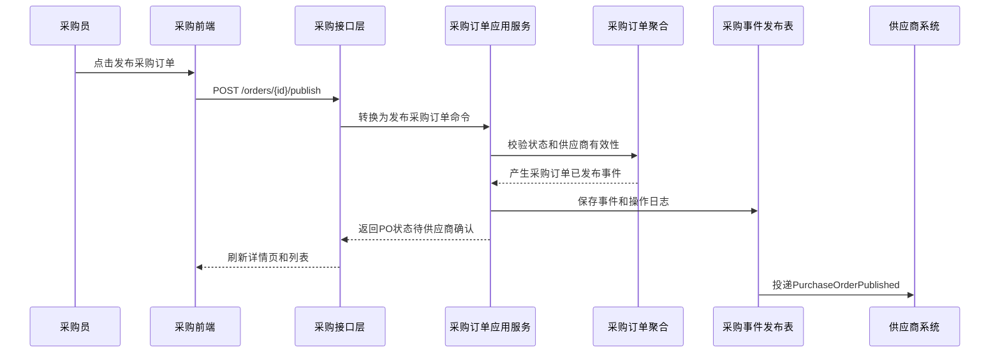
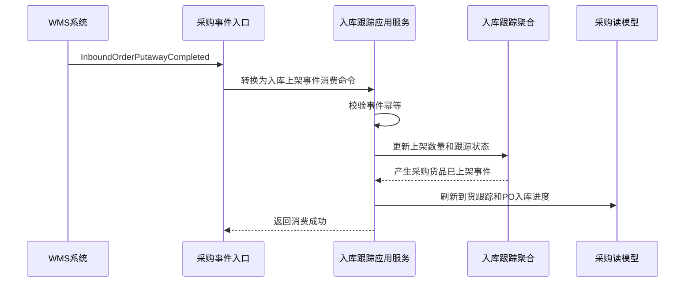
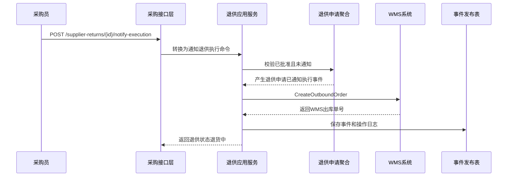

# 55 采购系统接口设计

> 本文根据 [采购领域模型](../03-核心业务模型/02-采购领域模型/01-采购系统领域模型.md)、[采购系统产品功能设计](../04-子系统功能设计/采购系统/采购系统产品功能设计.md)、[采购系统数据库设计](../05-子系统数据库设计/02-采购系统数据库设计.md) 和 [上下文映射与领域事件目录](./50-上下文映射与领域事件目录.md) 设计。接口按 DDD + CQRS 口径拆分：查询接口读取读模型，命令接口触发应用服务和聚合行为，跨系统接口遵守命令/事件边界。

## 1. 设计范围

| 类型 | 范围 | 说明 |
| --- | --- | --- |
| 前端页面接口 | 采购工作台、请购、询价、报价、比价、采购订单、供应商确认、到货跟踪、退供、采购价格、参数、枚举、操作日志 | 面向采购系统 Web 前端 |
| 跨系统命令接口 | 采购 -> WMS、采购 -> BMS、采购 -> 权限、采购 -> 主数据、采购 -> 供应商 | 同步请求对方系统执行动作或查询读模型 |
| 跨系统事件接口 | 供应商 -> 采购、WMS -> 采购、主数据 -> 采购、采购 -> 供应商/WMS/BMS | 异步传递已经发生的业务事实 |
| 不包含 | 库存系统内部扣减、WMS 仓内作业细节、BMS 计费明细生成规则 | 只定义采购系统需要调用或消费的契约 |

## 2. DDD 对齐说明

| DDD 关注点 | 本文口径 |
| --- | --- |
| 限界上下文 | 采购上下文 |
| 核心聚合 | 采购申请、询价单、供应商报价、比价结果、采购价格、采购订单、采购订单变更、入库跟踪、退供申请 |
| 查询模型 | 工作台待办、各单据列表、详情、状态时间线、事件时间线、操作日志 |
| 命令接口 | 新增、修改、提交、审批、发布、取消、关闭、定标、生效、作废、催交、关闭剩余 |
| 领域事件 | 采购申请已提交、询价单已发布、比价已定标、采购订单已发布、采购 ASN 已记录、采购货品已收货、采购质检已完成、退供申请已批准等 |
| 数据主权 | 采购系统拥有采购单据生命周期；供应商协同事实、仓内作业事实、主数据事实由对应上下文拥有 |
| 幂等规则 | 所有写接口必须携带 `X-Idempotency-Key`；跨系统事件消费以 `sourceContext + eventId + aggregateId` 幂等 |

## 3. 通用协议

### 3.1 基础路径

| 场景 | 基础路径 |
| --- | --- |
| 前端页面接口 | `/api/purchase/v1` |
| 跨系统开放命令接口 | `/openapi/purchase/v1` |
| 事件回调/事件消费入口 | `/internal/purchase/v1/events` |

### 3.2 通用请求头

| 请求头 | 必填 | 适用接口 | 说明 |
| --- | --- | --- | --- |
| `Authorization` | 是 | 前端接口 | `Bearer access_token`，由权限系统签发 |
| `X-Tenant-Id` | 否 | 全部 | 租户 ID，单租户可不传 |
| `X-Org-Id` | 是 | 全部 | 当前组织 ID，用于数据权限 |
| `X-Request-Id` | 是 | 全部 | 请求链路 ID，前端生成或网关生成 |
| `X-Trace-Id` | 否 | 全部 | 分布式链路追踪 ID |
| `X-Idempotency-Key` | 写接口必填 | 命令接口、跨系统命令 | 同一业务动作唯一，重复请求不能重复产生事实 |
| `X-Source-System` | 跨系统必填 | 跨系统命令、事件入口 | `PURCHASE`、`SUPPLIER`、`WMS`、`MDM`、`IAM`、`BMS` |
| `X-Operator-Id` | 写接口必填 | 命令接口 | 操作人；系统任务传系统账号 |
| `X-Data-Scope` | 否 | 前端查询 | 网关或权限中间件解析后的数据范围摘要 |
| `Accept-Language` | 否 | 全部 | `zh-CN` 默认 |

### 3.3 通用响应结构

```json
{
  "success": true,
  "code": "SUCCESS",
  "message": "处理成功",
  "requestId": "REQ202607040001",
  "traceId": "TRACE202607040001",
  "timestamp": "2026-07-04T10:00:00+08:00",
  "data": {}
}
```

分页响应：

```json
{
  "success": true,
  "code": "SUCCESS",
  "message": "查询成功",
  "data": {
    "pageNo": 1,
    "pageSize": 20,
    "total": 128,
    "records": []
  }
}
```

命令响应：

```json
{
  "success": true,
  "code": "SUCCESS",
  "message": "命令已处理",
  "data": {
    "aggregateId": "190001",
    "businessNo": "PO202607040001",
    "status": 4,
    "statusName": "待供应商确认",
    "version": 3,
    "eventId": "EVT202607040001",
    "idempotentHit": false
  }
}
```

### 3.4 HTTP 状态码

| HTTP 状态码 | 场景                  | 前端处理                 |
| -------- | ------------------- | -------------------- |
| `200`    | 查询成功、命令同步处理成功       | 正常刷新页面               |
| `201`    | 新增成功                | 跳转详情或继续编辑            |
| `202`    | 命令已受理，异步处理          | 展示处理中，轮询任务或等待事件      |
| `204`    | 删除/关闭后无返回体          | 返回列表或刷新详情            |
| `400`    | 请求格式错误、字段类型错误       | 表单提示                 |
| `401`    | 未登录、Token 过期        | 跳转登录或刷新 Token        |
| `403`    | 无菜单/按钮/数据权限         | 隐藏按钮或弹出无权限           |
| `404`    | 单据不存在或无数据权限导致不可见    | 提示记录不存在              |
| `409`    | 乐观锁冲突、幂等内容不一致、状态机冲突 | 提示刷新后重试              |
| `422`    | 业务规则不通过             | 展示业务原因，如供应商冻结、状态不可提交 |
| `429`    | 请求过于频繁              | 稍后重试                 |
| `500`    | 系统异常                | 记录错误并提示稍后重试          |

### 3.5 业务错误码

| 业务码 | HTTP | 含义 |
| --- | --- | --- |
| `SUCCESS` | `200/201` | 成功 |
| `ACCEPTED` | `202` | 已受理异步处理 |
| `VALIDATION_FAILED` | `400` | 字段校验失败 |
| `UNAUTHORIZED` | `401` | 未认证 |
| `FORBIDDEN` | `403` | 无权限 |
| `NOT_FOUND` | `404` | 资源不存在 |
| `VERSION_CONFLICT` | `409` | 乐观锁版本冲突 |
| `IDEMPOTENCY_CONFLICT` | `409` | 同一幂等键请求内容不一致 |
| `STATE_CONFLICT` | `409` | 当前状态不允许该命令 |
| `BUSINESS_RULE_FAILED` | `422` | 领域规则不通过 |
| `EXTERNAL_CALL_FAILED` | `422/500` | 跨系统调用失败 |
| `SYSTEM_ERROR` | `500` | 系统异常 |

## 4. 通用对象字段

### 4.1 分页查询字段

| 字段 | 类型 | 必填 | 说明 |
| --- | --- | --- | --- |
| `pageNo` | int | 是 | 页码，从 1 开始 |
| `pageSize` | int | 是 | 每页条数，支持 10、20、50 |
| `sortField` | string | 否 | 排序字段，如 `updatedAt`、`createdAt`、`status`、`amount` |
| `sortOrder` | string | 否 | `asc`、`desc`，默认 `desc` |

### 4.2 状态时间线字段

| 字段 | 类型 | 说明 |
| --- | --- | --- |
| `nodeCode` | string | 状态节点编码 |
| `nodeName` | string | 状态节点名称 |
| `status` | int | 节点状态：1 未开始，2 进行中，3 已完成，4 已驳回/异常 |
| `operatorId` | string | 操作人 ID |
| `operatorName` | string | 操作人名称 |
| `occurredAt` | datetime | 发生时间 |
| `remark` | string | 备注 |

### 4.3 行级明细字段

采购系统各单据明细统一使用以下基础字段，具体接口可按业务增减。

| 字段 | 类型 | 必填 | 说明 |
| --- | --- | --- | --- |
| `lineId` | string | 修改时必填 | 行 ID |
| `lineNo` | string | 否 | 行号 |
| `skuId` | string | 是 | SKU ID |
| `skuCode` | string | 是 | SKU 编码快照 |
| `skuName` | string | 是 | SKU 名称快照 |
| `qty` | decimal(18,4) | 是 | 数量 |
| `uom` | string | 是 | 单位 |
| `warehouseId` | string | 否 | 目标仓库 |
| `requiredDate` | date | 否 | 要求到货/交付日期 |
| `remark` | string | 否 | 备注 |

## 5. 前端页面接口

### 5.1 采购工作台

| 接口 | 方法 | 路径 | 页面调用位置 | 权限点 | 说明 |
| --- | --- | --- | --- | --- | --- |
| 查询工作台统计 | `GET` | `/api/purchase/v1/workbench/summary` | 采购工作台顶部统计卡片 | `purchase:workbench:read` | 查询待审批、待询价、待发布、供应商差异、到货异常数量 |
| 查询待办列表 | `GET` | `/api/purchase/v1/workbench/todos` | 采购工作台待办表格 | `purchase:workbench:read` | 查询当前用户可处理的采购待办 |

请求字段：

| 字段 | 类型 | 必填 | 说明 |
| --- | --- | --- | --- |
| `todoType` | string | 否 | `REQUISITION_APPROVAL`、`RFQ_TO_RELEASE`、`PO_APPROVAL`、`SUPPLIER_DIFF`、`INBOUND_EXCEPTION` |
| `createdFrom` | datetime | 否 | 创建开始时间 |
| `createdTo` | datetime | 否 | 创建结束时间 |
| `pageNo/pageSize` | int | 列表必填 | 分页 |

响应字段：

| 字段 | 类型 | 说明 |
| --- | --- | --- |
| `pendingApprovalCount` | int | 待审批数量 |
| `pendingRfqCount` | int | 待询价数量 |
| `pendingPublishCount` | int | 待发布数量 |
| `supplierDiffCount` | int | 供应商差异数量 |
| `inboundExceptionCount` | int | 到货异常数量 |
| `records[].todoId` | string | 待办 ID |
| `records[].businessType` | string | 业务类型 |
| `records[].businessNo` | string | 单号 |
| `records[].title` | string | 待办标题 |
| `records[].statusName` | string | 状态名称 |
| `records[].targetRoute` | string | 点击后进入的页面路由 |

状态码：`200`、`401`、`403`、`500`。

### 5.2 请购管理页

| 接口 | 方法 | 路径 | 页面调用位置 | 权限点 | 领域动作 |
| --- | --- | --- | --- | --- | --- |
| 查询请购列表 | `GET` | `/api/purchase/v1/requisitions` | 请购管理页查询区、分页、排序 | `purchase:requisition:read` | 查询读模型 |
| 查询请购详情 | `GET` | `/api/purchase/v1/requisitions/{requisitionId}` | 详情页打开时 | `purchase:requisition:read` | 查询读模型 |
| 创建请购 | `POST` | `/api/purchase/v1/requisitions` | 新增页保存草稿 | `purchase:requisition:create` | 创建采购申请 |
| 修改请购 | `PUT` | `/api/purchase/v1/requisitions/{requisitionId}` | 修改页保存 | `purchase:requisition:update` | 修改采购申请 |
| 提交请购 | `POST` | `/api/purchase/v1/requisitions/{requisitionId}/submit` | 行内“提交”、详情页提交按钮 | `purchase:requisition:submit` | 提交采购申请 |
| 撤回请购 | `POST` | `/api/purchase/v1/requisitions/{requisitionId}/withdraw` | 行内“撤回” | `purchase:requisition:withdraw` | 撤回待审批请购 |
| 关闭请购 | `POST` | `/api/purchase/v1/requisitions/{requisitionId}/close` | 行内“关闭” | `purchase:requisition:close` | 关闭采购申请 |

查询请求字段：

| 字段 | 类型 | 必填 | 说明 |
| --- | --- | --- | --- |
| `requisitionNo` | string | 否 | 请购单号，模糊匹配 |
| `requisitionType` | int | 否 | `REQUISITION_TYPE`：1 常规，2 紧急，3 项目，4 补货 |
| `requisitionStatus` | int | 否 | `REQUISITION_STATUS`：1 草稿，2 待审批，3 已批准，4 已转采购，5 已关闭 |
| `approvalStatus` | int | 否 | `APPROVAL_STATUS`：1 草稿，2 待审批，3 已批准，4 已驳回 |
| `applicantId` | string | 否 | 申请人 |
| `expectedArrivalFrom/To` | date | 否 | 期望到货日期范围 |
| `pageNo/pageSize/sortField/sortOrder` | mixed | 是 | 分页排序 |

创建/修改请求字段：

| 字段 | 类型 | 必填 | 说明 |
| --- | --- | --- | --- |
| `requisitionType` | int | 是 | 请购类型 |
| `expectedArrivalDate` | date | 否 | 期望到货日期 |
| `budgetAmount` | decimal(18,2) | 否 | 预算金额 |
| `currency` | int | 是 | `CURRENCY`：1 人民币，2 美元，3 欧元，4 港币，5 日元 |
| `purpose` | string | 否 | 采购用途 |
| `lines[]` | array | 是 | 请购行 |
| `lines[].skuId/skuCode/skuName` | string | 是 | SKU 快照 |
| `lines[].requestQty` | decimal(18,4) | 是 | 申请数量，必须大于 0 |
| `lines[].uom` | string | 是 | 单位 |
| `lines[].remark` | string | 否 | 备注 |
| `version` | int | 修改必填 | 乐观锁版本 |

命令请求字段：

| 命令 | 字段 | 类型 | 必填 | 说明 |
| --- | --- | --- | --- | --- |
| 提交 | `submitRemark` | string | 否 | 提交说明 |
| 撤回 | `withdrawReason` | string | 是 | 撤回原因 |
| 关闭 | `closeReason` | string | 是 | 关闭原因 |
| 全部 | `version` | int | 是 | 当前版本 |

响应字段：

| 字段 | 类型 | 说明 |
| --- | --- | --- |
| `requisitionId` | string | 采购申请 ID |
| `requisitionNo` | string | 请购单号 |
| `requisitionType/typeName` | int/string | 请购类型 |
| `approvalStatus/approvalStatusName` | int/string | 审批状态 |
| `requisitionStatus/requisitionStatusName` | int/string | 请购状态 |
| `budgetAmount` | decimal | 预算金额 |
| `lines[]` | array | 明细行 |
| `statusTimeline[]` | array | 状态时间线 |
| `eventTimeline[]` | array | 事件时间线 |
| `operationLogs[]` | array | 操作日志 |
| `version` | int | 当前版本 |

成功事件：创建产生 `采购申请已创建`，提交产生 `采购申请已提交`，批准后产生 `采购申请已批准`，驳回产生 `采购申请已驳回`，关闭产生 `采购申请已关闭`。

状态码：`200`、`201`、`400`、`401`、`403`、`404`、`409`、`422`、`500`。

### 5.3 请购审批页

| 接口 | 方法 | 路径 | 页面调用位置 | 权限点 | 领域动作 |
| --- | --- | --- | --- | --- | --- |
| 查询待审批请购 | `GET` | `/api/purchase/v1/requisition-approvals` | 请购审批页列表 | `purchase:requisition_approval:read` | 查询审批读模型 |
| 审批通过 | `POST` | `/api/purchase/v1/requisitions/{requisitionId}/approve` | 行内“通过”、详情页审批按钮 | `purchase:requisitionapproval:approve` | 审批采购申请 |
| 审批驳回 | `POST` | `/api/purchase/v1/requisitions/{requisitionId}/reject` | 行内“驳回”、详情页审批按钮 | `purchase:requisitionapproval:reject` | 驳回采购申请 |
| 转交审批 | `POST` | `/api/purchase/v1/requisitions/{requisitionId}/transfer-approval` | 行内“转交” | `purchase:requisitionapproval:transfer` | 转交审批任务 |

请求字段：

| 字段 | 类型 | 必填 | 说明 |
| --- | --- | --- | --- |
| `approvedLines[].lineId` | string | 通过时必填 | 请购行 ID |
| `approvedLines[].approvedQty` | decimal(18,4) | 通过时必填 | 批准数量，不能大于申请数量 |
| `approvalComment` | string | 否 | 审批意见 |
| `rejectReason` | string | 驳回必填 | 驳回原因 |
| `targetApproverId` | string | 转交必填 | 目标审批人 |
| `version` | int | 是 | 乐观锁版本 |

响应字段：同请购命令响应，额外返回 `approvalTaskId`、`approvalResult`、`nextTodoCount`。

状态码：`200`、`400`、`401`、`403`、`404`、`409`、`422`、`500`。

### 5.4 询价单页

| 接口 | 方法 | 路径 | 页面调用位置 | 权限点 | 领域动作 |
| --- | --- | --- | --- | --- | --- |
| 查询询价列表 | `GET` | `/api/purchase/v1/rfqs` | 询价单页查询、分页、排序 | `purchase:rfq:read` | 查询读模型 |
| 查询询价详情 | `GET` | `/api/purchase/v1/rfqs/{rfqId}` | 详情页打开时 | `purchase:rfq:read` | 查询读模型 |
| 创建询价 | `POST` | `/api/purchase/v1/rfqs` | 新增页保存草稿 | `purchase:rfq:create` | 创建询价单 |
| 修改询价 | `PUT` | `/api/purchase/v1/rfqs/{rfqId}` | 修改页保存 | `purchase:rfq:update` | 修改询价单 |
| 发布询价 | `POST` | `/api/purchase/v1/rfqs/{rfqId}/publish` | 行内“发布”、详情页发布按钮 | `purchase:rfq:release` | 发布询价单 |
| 截标询价 | `POST` | `/api/purchase/v1/rfqs/{rfqId}/close-bidding` | 详情页截标按钮或定时任务 | `purchase:rfq:close_bidding` | 截标询价 |
| 取消询价 | `POST` | `/api/purchase/v1/rfqs/{rfqId}/cancel` | 行内“取消” | `purchase:rfq:cancel` | 取消询价单 |
| 关闭询价 | `POST` | `/api/purchase/v1/rfqs/{rfqId}/close` | 行内“关闭” | `purchase:rfq:close` | 关闭询价单 |

查询请求字段：

| 字段 | 类型 | 必填 | 说明 |
| --- | --- | --- | --- |
| `rfqNo` | string | 否 | 询价单号 |
| `rfqType` | int | 否 | `RFQ_TYPE`：1 公开询价，2 定向询价，3 议价 |
| `rfqStatus` | int | 否 | `RFQ_STATUS`：1 草稿，2 已发布，3 报价中，4 已截标，5 已定标，6 已取消，7 已关闭 |
| `supplierId` | string | 否 | 邀请供应商 |
| `quoteDeadlineFrom/To` | datetime | 否 | 报价截止时间范围 |
| `pageNo/pageSize/sortField/sortOrder` | mixed | 是 | 分页排序 |

创建/修改请求字段：

| 字段 | 类型 | 必填 | 说明 |
| --- | --- | --- | --- |
| `rfqType` | int | 是 | 询价类型 |
| `sourceRequisitionIds[]` | array | 否 | 来源请购 ID |
| `supplierIds[]` | array | 定向询价必填 | 邀请供应商 |
| `quoteDeadline` | datetime | 是 | 报价截止时间，必须晚于当前时间 |
| `lines[]` | array | 是 | 询价行 |
| `lines[].skuId/skuCode/skuName` | string | 是 | SKU 快照 |
| `lines[].targetQty` | decimal(18,4) | 是 | 询价数量 |
| `lines[].uom` | string | 是 | 单位 |
| `lines[].requiredDeliveryDate` | date | 否 | 要求交期 |
| `lines[].qualityRequirement` | string | 否 | 质量要求 |
| `version` | int | 修改必填 | 乐观锁版本 |

命令请求字段：发布传 `publishRemark`，截标传 `closeBiddingReason`，取消/关闭传 `reason` 和 `version`。

响应字段：`rfqId`、`rfqNo`、`rfqType/typeName`、`rfqStatus/statusName`、`supplierIds`、`quoteDeadline`、`publishedAt`、`lines[]`、`statusTimeline[]`、`eventTimeline[]`、`version`。

成功事件：`询价单已创建`、`询价单已修改`、`询价单已发布`、`询价已截标`、`询价单已取消`、`询价单已关闭`。

状态码：`200`、`201`、`400`、`401`、`403`、`404`、`409`、`422`、`500`。

### 5.5 报价管理页

| 接口 | 方法 | 路径 | 页面调用位置 | 权限点 | 领域动作 |
| --- | --- | --- | --- | --- | --- |
| 查询报价列表 | `GET` | `/api/purchase/v1/quotations` | 报价管理页查询、分页、排序 | `purchase:quotation:read` | 查询读模型 |
| 查询报价详情 | `GET` | `/api/purchase/v1/quotations/{supplierQuoteId}` | 详情页打开时 | `purchase:quotation:read` | 查询读模型 |
| 录入报价 | `POST` | `/api/purchase/v1/quotations` | 报价录入页保存 | `purchase:quotation:quotation` | 录入供应商报价 |
| 导入报价 | `POST` | `/api/purchase/v1/quotations/import` | 报价管理页顶部“导入” | `purchase:quotation:import` | 创建导入任务 |
| 确认报价 | `POST` | `/api/purchase/v1/quotations/{supplierQuoteId}/confirm` | 行内“确认” | `purchase:quotation:confirm` | 确认报价 |
| 作废报价 | `POST` | `/api/purchase/v1/quotations/{supplierQuoteId}/void` | 行内“作废” | `purchase:quotation:void` | 作废报价 |

查询请求字段：

| 字段 | 类型 | 必填 | 说明 |
| --- | --- | --- | --- |
| `quotationNo` | string | 否 | 报价单号 |
| `rfqNo` | string | 否 | 询价单号 |
| `supplierId` | string | 否 | 供应商 |
| `quoteStatus` | int | 否 | `QUOTE_STATUS`：1 草稿，2 已提交，3 已确认，4 已作废，5 未中标，6 中标 |
| `validFrom/validTo` | date | 否 | 有效期 |
| `pageNo/pageSize/sortField/sortOrder` | mixed | 是 | 分页排序 |

录入报价请求字段：

| 字段 | 类型 | 必填 | 说明 |
| --- | --- | --- | --- |
| `rfqId` | string | 是 | 询价单 ID |
| `supplierId` | string | 是 | 供应商 ID |
| `currency` | int | 是 | 币种 |
| `validFrom` | date | 否 | 有效开始 |
| `validTo` | date | 否 | 有效结束 |
| `attachmentUrl` | string | 否 | 报价附件 |
| `lines[].rfqLineId` | string | 是 | 询价行 ID |
| `lines[].quoteQty` | decimal(18,4) | 是 | 报价数量 |
| `lines[].unitPrice` | decimal(18,6) | 是 | 未税单价 |
| `lines[].taxRate` | decimal(8,4) | 是 | 税率 |
| `lines[].deliveryDays` | int | 否 | 承诺交期天数 |
| `lines[].moq` | decimal(18,4) | 否 | 最小起订量 |

响应字段：`supplierQuoteId`、`quotationNo`、`rfqNo`、`supplierId/supplierName`、`quoteStatus/statusName`、`totalAmount`、`currency`、`validFrom`、`validTo`、`lines[]`、`version`。

成功事件：`供应商报价已创建`、`供应商报价已确认`、作废时写操作日志并刷新报价读模型。

状态码：`200`、`201`、`202`、`400`、`401`、`403`、`404`、`409`、`422`、`500`。

### 5.6 比价定标页

| 接口 | 方法 | 路径 | 页面调用位置 | 权限点 | 领域动作 |
| --- | --- | --- | --- | --- | --- |
| 查询比价列表 | `GET` | `/api/purchase/v1/compare-results` | 比价定标页查询、分页、排序 | `purchase:compare:read` | 查询读模型 |
| 查询比价详情 | `GET` | `/api/purchase/v1/compare-results/{compareResultId}` | 详情页打开时 | `purchase:compare:read` | 查询读模型 |
| 生成比价 | `POST` | `/api/purchase/v1/compare-results/generate` | 列表/详情“生成比价”按钮 | `purchase:price_compareaward:price_compare` | 生成比价结果 |
| 推荐供应商 | `POST` | `/api/purchase/v1/compare-results/{compareResultId}/recommend` | 详情页“生成推荐”按钮 | `purchase:price_compareaward:price_compare` | 推荐供应商 |
| 定标供应商 | `POST` | `/api/purchase/v1/compare-results/{compareResultId}/award` | 行内/详情“定标”按钮 | `purchase:price_compareaward:award` | 定标供应商 |
| 驳回定标 | `POST` | `/api/purchase/v1/compare-results/{compareResultId}/reject` | 行内/详情“驳回”按钮 | `purchase:price_compareaward:reject` | 驳回定标 |

请求字段：

| 接口 | 字段 | 类型 | 必填 | 说明 |
| --- | --- | --- | --- | --- |
| 生成比价 | `rfqId` | string | 是 | 询价单 ID |
| 生成比价 | `quotationIds[]` | array | 是 | 参与比价的报价 ID |
| 生成比价 | `scoreWeights.price` | decimal | 是 | 价格权重 |
| 生成比价 | `scoreWeights.delivery` | decimal | 是 | 交期权重 |
| 生成比价 | `scoreWeights.quality` | decimal | 是 | 质量权重 |
| 定标供应商 | `selectedSupplierId` | string | 是 | 中标供应商 |
| 定标供应商 | `selectedQuotationId` | string | 是 | 中标报价 |
| 定标供应商 | `decisionReason` | string | 是 | 定标理由 |
| 驳回定标 | `rejectReason` | string | 是 | 驳回原因 |
| 全部命令 | `version` | int | 已有比价单时必填 | 乐观锁版本 |

响应字段：`compareResultId`、`compareNo`、`compareStatus/statusName`、`rfqId/rfqNo`、`recommendedSupplierId`、`selectedSupplierId`、`scoreDetails[]`、`decisionReason`、`version`。

成功事件：`比价已生成`、`供应商已推荐`、`比价已定标`、`定标已驳回`。定标成功后可触发创建采购订单页面预填或后端自动生成采购订单草稿。

状态码：`200`、`201`、`400`、`401`、`403`、`404`、`409`、`422`、`500`。

### 5.7 采购订单页

| 接口 | 方法 | 路径 | 页面调用位置 | 权限点 | 领域动作 |
| --- | --- | --- | --- | --- | --- |
| 查询采购订单列表 | `GET` | `/api/purchase/v1/orders` | 采购订单页查询、分页、排序 | `purchase:po:read` | 查询读模型 |
| 查询采购订单详情 | `GET` | `/api/purchase/v1/orders/{purchaseOrderId}` | 详情页打开时 | `purchase:po:read` | 查询读模型 |
| 创建采购订单 | `POST` | `/api/purchase/v1/orders` | 新增页保存草稿 | `purchase:purchase_order:create` | 创建采购订单 |
| 修改采购订单 | `PUT` | `/api/purchase/v1/orders/{purchaseOrderId}` | 修改页保存 | `purchase:purchase_order:update` | 修改采购订单草稿 |
| 提交采购订单 | `POST` | `/api/purchase/v1/orders/{purchaseOrderId}/submit` | 行内“提交” | `purchase:purchase_order:submit` | 提交采购订单 |
| 审批采购订单 | `POST` | `/api/purchase/v1/orders/{purchaseOrderId}/approve` | 行内/详情“审批” | `purchase:purchase_order:approve` | 审批采购订单 |
| 发布采购订单 | `POST` | `/api/purchase/v1/orders/{purchaseOrderId}/publish` | 行内/详情“发布” | `purchase:purchase_order:release` | 发布给供应商 |
| 取消采购订单 | `POST` | `/api/purchase/v1/orders/{purchaseOrderId}/cancel` | 行内“取消” | `purchase:purchase_order:cancel` | 取消采购订单 |
| 关闭采购订单 | `POST` | `/api/purchase/v1/orders/{purchaseOrderId}/close` | 行内“关闭” | `purchase:purchase_order:close` | 关闭采购订单 |

查询请求字段：

| 字段 | 类型 | 必填 | 说明 |
| --- | --- | --- | --- |
| `purchaseOrderNo` | string | 否 | PO 单号 |
| `supplierId` | string | 否 | 供应商 |
| `purchaseType` | int | 否 | `PURCHASE_TYPE`：1 常规，2 紧急，3 补货，4 项目 |
| `poStatus` | int | 否 | `PURCHASE_ORDER_STATUS`：1 草稿，2 待审批，3 已审批，4 待供应商确认，5 供应商已确认，6 供应商差异，7 部分入库，8 已完成，9 已取消，10 已关闭 |
| `confirmStatus` | int | 否 | `SUPPLIER_CONFIRM_STATUS`：1 待确认，2 已确认，3 差异，4 已拒绝 |
| `createdFrom/createdTo` | datetime | 否 | 创建时间范围 |
| `pageNo/pageSize/sortField/sortOrder` | mixed | 是 | 分页排序 |

创建/修改请求字段：

| 字段 | 类型 | 必填 | 说明 |
| --- | --- | --- | --- |
| `sourceType` | string | 否 | `REQUISITION`、`RFQ_AWARD`、`MANUAL` |
| `sourceId` | string | 否 | 来源单据 ID |
| `purchaseType` | int | 是 | 采购类型 |
| `supplierId/supplierCode/supplierName` | string | 是 | 供应商快照 |
| `currency` | int | 是 | 币种 |
| `taxExcludedAmount` | decimal(18,2) | 否 | 未税总额，后端可计算 |
| `taxAmount` | decimal(18,2) | 否 | 税额，后端可计算 |
| `taxIncludedAmount` | decimal(18,2) | 否 | 含税总额，后端可计算 |
| `lines[].skuId/skuCode/skuName` | string | 是 | SKU 快照 |
| `lines[].purchaseQty` | decimal(18,4) | 是 | 采购数量 |
| `lines[].uom` | string | 是 | 单位 |
| `lines[].unitPrice` | decimal(18,6) | 是 | 未税单价 |
| `lines[].taxRate` | decimal(8,4) | 是 | 税率 |
| `lines[].requiredDeliveryDate` | date | 否 | 要求交期 |
| `lines[].warehouseId` | string | 是 | 目标仓库 |
| `version` | int | 修改必填 | 乐观锁版本 |

命令请求字段：提交传 `submitRemark`；审批传 `approvalResult`、`approvalComment`；发布传 `publishRemark`；取消/关闭传 `reason` 和 `version`。

响应字段：`purchaseOrderId`、`purchaseOrderNo`、`supplierId/supplierName`、`purchaseType/typeName`、`approvalStatus/statusName`、`poStatus/statusName`、`confirmStatus/statusName`、`amounts`、`inboundProgress`、`lines[]`、`supplierConfirmResult`、`statusTimeline[]`、`eventTimeline[]`、`version`。

成功事件：`采购订单已提交`、`采购订单已批准`、`采购订单已发布`、`采购订单已关闭`。发布成功后向供应商系统发布或调用采购订单协同接口。

状态码：`200`、`201`、`400`、`401`、`403`、`404`、`409`、`422`、`500`。

### 5.8 采购订单变更

| 接口 | 方法 | 路径 | 页面调用位置 | 权限点 | 领域动作 |
| --- | --- | --- | --- | --- | --- |
| 创建订单变更 | `POST` | `/api/purchase/v1/orders/{purchaseOrderId}/changes` | 采购订单页行内“变更” | `purchase:purchase_order:change` | 创建订单变更 |
| 查询变更详情 | `GET` | `/api/purchase/v1/order-changes/{changeId}` | 变更详情页 | `purchase:purchase_order:read` | 查询读模型 |
| 提交订单变更 | `POST` | `/api/purchase/v1/order-changes/{changeId}/submit` | 变更详情页“提交” | `purchase:purchase_order:change` | 提交订单变更 |
| 审批订单变更 | `POST` | `/api/purchase/v1/order-changes/{changeId}/approve` | 变更详情页“审批” | `purchase:purchase_order:approve` | 审批订单变更 |
| 生效订单变更 | `POST` | `/api/purchase/v1/order-changes/{changeId}/effective` | 审批通过后自动或人工点击 | `purchase:purchase_order:change` | 生效订单变更 |
| 作废订单变更 | `POST` | `/api/purchase/v1/order-changes/{changeId}/void` | 变更详情页“作废” | `purchase:purchase_order:change` | 作废订单变更 |

请求字段：

| 字段 | 类型 | 必填 | 说明 |
| --- | --- | --- | --- |
| `changeType` | int | 是 | `PO_CHANGE_TYPE`：1 数量，2 价格，3 交期，4 供应商，5 取消，6 关闭 |
| `changeReason` | string | 是 | 变更原因 |
| `beforeSnapshot` | object | 是 | 变更前快照 |
| `afterSnapshot` | object | 是 | 变更后快照 |
| `lines[]` | array | 否 | 行级变更内容 |
| `version` | int | 是 | 原订单或变更单版本 |

响应字段：`changeId`、`changeNo`、`purchaseOrderId`、`purchaseOrderNo`、`changeType/typeName`、`approvalStatus/statusName`、`effectiveStatus/statusName`、`beforeSnapshot`、`afterSnapshot`、`version`。

成功事件：`采购订单变更已创建`、`采购订单变更已提交`、`采购订单变更已批准`、`采购订单变更已生效`、`采购订单变更已作废`。

状态码：`200`、`201`、`400`、`401`、`403`、`404`、`409`、`422`、`500`。

### 5.9 供应商确认处理页

| 接口 | 方法 | 路径 | 页面调用位置 | 权限点 | 领域动作 |
| --- | --- | --- | --- | --- | --- |
| 查询供应商确认差异 | `GET` | `/api/purchase/v1/supplier-confirms` | 供应商确认处理页列表 | `purchase:supplier_confirm:read` | 查询供应商确认读模型 |
| 查询确认详情 | `GET` | `/api/purchase/v1/supplier-confirms/{confirmId}` | 详情页打开时 | `purchase:supplier_confirm:read` | 查询读模型 |
| 接受差异 | `POST` | `/api/purchase/v1/supplier-confirms/{confirmId}/accept-diff` | 行内“接受差异” | `purchase:supplier_confirm:accept_diff` | 记录供应商差异处理结果 |
| 重新协商 | `POST` | `/api/purchase/v1/supplier-confirms/{confirmId}/renegotiate` | 行内“重新协商” | `purchase:supplier_confirm:renegotiate` | 重新发起协商 |
| 取消订单 | `POST` | `/api/purchase/v1/supplier-confirms/{confirmId}/cancel-order` | 行内“取消订单” | `purchase:supplier_confirm:cancel_order` | 取消采购订单 |

请求字段：

| 字段 | 类型 | 必填 | 说明 |
| --- | --- | --- | --- |
| `processComment` | string | 否 | 处理说明 |
| `acceptedDiffs[]` | array | 接受差异必填 | 接受的差异项 |
| `renegotiateRequirement` | string | 重新协商必填 | 重新协商要求 |
| `cancelReason` | string | 取消订单必填 | 取消原因 |
| `version` | int | 是 | 乐观锁版本 |

响应字段：`confirmId`、`purchaseOrderId`、`purchaseOrderNo`、`supplierConfirmStatus`、`diffType`、`diffContent`、`processedStatus/statusName`、`version`。

成功事件：接受差异后更新采购订单确认状态；重新协商会重新通知供应商；取消订单产生 `采购订单已取消`。

状态码：`200`、`400`、`401`、`403`、`404`、`409`、`422`、`500`。

### 5.10 到货跟踪页

| 接口 | 方法 | 路径 | 页面调用位置 | 权限点 | 领域动作 |
| --- | --- | --- | --- | --- | --- |
| 查询到货跟踪列表 | `GET` | `/api/purchase/v1/inbound-tracks` | 到货跟踪页查询、分页、排序 | `purchase:inbound_track:read` | 查询读模型 |
| 查询到货跟踪详情 | `GET` | `/api/purchase/v1/inbound-tracks/{inboundTrackId}` | 详情页打开时 | `purchase:inbound_track:read` | 查询读模型 |
| 催交 | `POST` | `/api/purchase/v1/inbound-tracks/{inboundTrackId}/urge` | 行内“催交” | `purchase:arrival:urge` | 发送催交通知 |
| 关闭剩余 | `POST` | `/api/purchase/v1/inbound-tracks/{inboundTrackId}/close-remaining` | 行内“关闭剩余” | `purchase:arrival:close_remaining` | 关闭未到货数量 |

查询请求字段：

| 字段 | 类型 | 必填 | 说明 |
| --- | --- | --- | --- |
| `purchaseOrderNo` | string | 否 | PO 单号 |
| `asnNo` | string | 否 | ASN 单号 |
| `supplierId` | string | 否 | 供应商 |
| `skuCode` | string | 否 | SKU 编码 |
| `trackStatus` | int | 否 | `INBOUND_TRACK_STATUS`：1 已通知，2 已到货，3 已收货，4 已质检，5 已上架，6 异常 |
| `pageNo/pageSize/sortField/sortOrder` | mixed | 是 | 分页排序 |

命令请求字段：

| 命令 | 字段 | 类型 | 必填 | 说明 |
| --- | --- | --- | --- | --- |
| 催交 | `urgeMessage` | string | 否 | 催交内容 |
| 关闭剩余 | `closeReason` | string | 是 | 关闭原因 |
| 关闭剩余 | `closeLines[].lineId` | string | 是 | 行 ID |
| 关闭剩余 | `closeLines[].remainingQty` | decimal(18,4) | 是 | 关闭数量 |
| 全部 | `version` | int | 是 | 乐观锁版本 |

响应字段：`inboundTrackId`、`purchaseOrderNo`、`asnNo`、`supplierId/supplierName`、`notifiedQty`、`receivedQty`、`qualifiedQty`、`unqualifiedQty`、`putawayQty`、`trackStatus/statusName`、`lines[]`、`statusTimeline[]`、`version`。

成功事件：手工命令主要记录操作日志；WMS 回传会产生 `采购 ASN 已记录`、`采购货品已收货`、`采购质检已完成`、`采购货品已上架`、`采购入库异常已产生`。

状态码：`200`、`400`、`401`、`403`、`404`、`409`、`422`、`500`。

### 5.11 退供申请页

| 接口 | 方法 | 路径 | 页面调用位置 | 权限点 | 领域动作 |
| --- | --- | --- | --- | --- | --- |
| 查询退供列表 | `GET` | `/api/purchase/v1/supplier-returns` | 退供申请页查询、分页、排序 | `purchase:supplier_return:read` | 查询读模型 |
| 查询退供详情 | `GET` | `/api/purchase/v1/supplier-returns/{supplierReturnId}` | 详情页打开时 | `purchase:supplier_return:read` | 查询读模型 |
| 创建退供申请 | `POST` | `/api/purchase/v1/supplier-returns` | 新增页保存草稿 | `purchase:supplier_return:create` | 创建退供申请 |
| 修改退供申请 | `PUT` | `/api/purchase/v1/supplier-returns/{supplierReturnId}` | 修改页保存 | `purchase:supplier_return:update` | 修改退供申请 |
| 提交退供申请 | `POST` | `/api/purchase/v1/supplier-returns/{supplierReturnId}/submit` | 行内“提交” | `purchase:supplier_return:submit` | 提交退供申请 |
| 审批退供申请 | `POST` | `/api/purchase/v1/supplier-returns/{supplierReturnId}/approve` | 行内“审批” | `purchase:supplier_return:approve` | 审批退供申请 |
| 通知退供执行 | `POST` | `/api/purchase/v1/supplier-returns/{supplierReturnId}/notify-execution` | 审批通过后自动或按钮 | `purchase:supplier_return:approve` | 通知 WMS/供应商执行退供 |
| 取消退供申请 | `POST` | `/api/purchase/v1/supplier-returns/{supplierReturnId}/cancel` | 行内“取消” | `purchase:supplier_return:cancel` | 取消退供申请 |

请求字段：

| 字段 | 类型 | 必填 | 说明 |
| --- | --- | --- | --- |
| `supplierId/supplierCode/supplierName` | string | 是 | 供应商快照 |
| `sourceType` | string | 否 | `QC_UNQUALIFIED`、`OVER_RECEIVE`、`MANUAL` |
| `sourceDocNo` | string | 否 | 来源单号 |
| `returnReason` | int | 是 | `SUPPLIER_RETURN_REASON`：1 质检不合格，2 错发，3 超收，4 包装破损 |
| `warehouseId` | string | 是 | 退货仓 |
| `lines[].skuId/skuCode/skuName` | string | 是 | SKU 快照 |
| `lines[].returnQty` | decimal(18,4) | 是 | 退货数量 |
| `lines[].inventoryStatus` | string | 否 | 可用/不可售/冻结等库存状态 |
| `approvalComment/rejectReason/cancelReason` | string | 命令按需 | 审批或取消原因 |
| `version` | int | 修改/命令必填 | 乐观锁版本 |

响应字段：`supplierReturnId`、`supplierReturnNo`、`supplierId/supplierName`、`returnReason/reasonName`、`returnStatus/statusName`、`approvalStatus/statusName`、`lines[]`、`version`。

成功事件：`退供申请已创建`、`退供申请已提交`、`退供申请已批准`、`退供申请已通知执行`、`退供申请已关闭`。通知执行后调用 WMS 出库命令。

状态码：`200`、`201`、`400`、`401`、`403`、`404`、`409`、`422`、`500`。

### 5.12 采购价格页

| 接口 | 方法 | 路径 | 页面调用位置 | 权限点 | 领域动作 |
| --- | --- | --- | --- | --- | --- |
| 查询采购价格列表 | `GET` | `/api/purchase/v1/prices` | 采购价格页查询、分页、排序 | `purchase:price:read` | 查询读模型 |
| 查询采购价格详情 | `GET` | `/api/purchase/v1/prices/{priceId}` | 详情页打开时 | `purchase:price:read` | 查询读模型 |
| 创建采购价格 | `POST` | `/api/purchase/v1/prices` | 新增页保存 | `purchase:price:create` | 创建采购价格 |
| 修改采购价格 | `PUT` | `/api/purchase/v1/prices/{priceId}` | 修改页保存 | `purchase:price:update` | 修改采购价格 |
| 提交价格审批 | `POST` | `/api/purchase/v1/prices/{priceId}/submit-approval` | 详情页“提交审批” | `purchase:price:submit` | 提交价格审批 |
| 生效采购价格 | `POST` | `/api/purchase/v1/prices/{priceId}/effective` | 行内“启用” | `purchase:price:enable` | 生效采购价格 |
| 失效采购价格 | `POST` | `/api/purchase/v1/prices/{priceId}/expire` | 行内“停用” | `purchase:price:disable` | 失效采购价格 |

请求字段：

| 字段 | 类型 | 必填 | 说明 |
| --- | --- | --- | --- |
| `supplierId` | string | 是 | 供应商 |
| `skuId/skuCode/skuName` | string | 是 | SKU 快照 |
| `priceType` | int | 是 | `PRICE_TYPE`：1 标准价，2 协议价，3 临时价 |
| `unitPrice` | decimal(18,6) | 是 | 未税单价 |
| `taxRate` | decimal(8,4) | 是 | 税率 |
| `taxIncludedPrice` | decimal(18,6) | 否 | 含税单价，后端可计算 |
| `currency` | int | 是 | 币种 |
| `effectiveDate` | date | 是 | 生效日期 |
| `expireDate` | date | 否 | 失效日期 |
| `version` | int | 修改/命令必填 | 乐观锁版本 |

响应字段：`priceId`、`supplierId/supplierName`、`skuId/skuName`、`priceType/typeName`、`unitPrice`、`taxRate`、`taxIncludedPrice`、`currency`、`effectiveStatus/statusName`、`version`。

成功事件：`采购价格已创建`、`采购价格已提交审批`、`采购价格已生效`、`采购价格已失效`。

状态码：`200`、`201`、`400`、`401`、`403`、`404`、`409`、`422`、`500`。

### 5.13 采购参数、枚举和操作日志

| 接口 | 方法 | 路径 | 页面调用位置 | 权限点 | 说明 |
| --- | --- | --- | --- | --- | --- |
| 查询采购参数 | `GET` | `/api/purchase/v1/settings` | 采购参数页列表 | `purchase:settings:read` | 查询参数 |
| 新增采购参数 | `POST` | `/api/purchase/v1/settings` | 采购参数页新增 | `purchase:settings:create` | 新增参数 |
| 修改采购参数 | `PUT` | `/api/purchase/v1/settings/{settingId}` | 采购参数页编辑 | `purchase:settings:update` | 修改参数 |
| 启停采购参数 | `POST` | `/api/purchase/v1/settings/{settingId}/toggle` | 行内“启停” | `purchase:settings:toggle` | 启用或停用 |
| 查询枚举项 | `GET` | `/api/purchase/v1/enums` | 枚举配置页、各页面下拉框 | `purchase:enum:read` | 查询枚举项 |
| 新增枚举项 | `POST` | `/api/purchase/v1/enums` | 枚举配置页新增 | `purchase:enumsettings:create` | 新增可配置枚举 |
| 修改枚举项 | `PUT` | `/api/purchase/v1/enums/{enumItemId}` | 枚举配置页编辑 | `purchase:enumsettings:update` | 修改标签、颜色、排序 |
| 停用枚举项 | `POST` | `/api/purchase/v1/enums/{enumItemId}/disable` | 行内“停用” | `purchase:enumsettings:disable` | 停用非核心枚举 |
| 查询操作日志 | `GET` | `/api/purchase/v1/operation-logs` | 操作日志页列表、详情页日志区域 | `purchase:operation_log:read` | 查询操作日志 |
| 导出操作日志 | `POST` | `/api/purchase/v1/operation-logs/export` | 操作日志页顶部“导出” | `purchase:operation_log:export` | 创建导出任务 |

枚举查询请求字段：

| 字段 | 类型 | 必填 | 说明 |
| --- | --- | --- | --- |
| `enumType` | string | 否 | 枚举类型，如 `PURCHASE_ORDER_STATUS` |
| `enabledOnly` | boolean | 否 | 是否只查启用项 |

枚举响应字段：

| 字段 | 类型 | 说明 |
| --- | --- | --- |
| `enumType` | string | 枚举类型 |
| `value` | int | 枚举数值 |
| `label` | string | 展示名称 |
| `sortNo` | int | 排序 |
| `status` | int | 1 启用，2 停用 |
| `color` | string | 前端标签颜色 |

操作日志查询字段：`operatorId`、`businessType`、`businessNo`、`action`、`result`、`createdFrom`、`createdTo`、`pageNo/pageSize`。

操作日志响应字段：`logId`、`operatorId/operatorName`、`businessType`、`businessNo`、`action`、`requestSummary`、`beforeSnapshot`、`afterSnapshot`、`result`、`failureReason`、`createdAt`。

状态码：`200`、`201`、`202`、`400`、`401`、`403`、`404`、`409`、`422`、`500`。

## 6. 跨系统命令接口

### 6.1 采购调用 WMS：创建采购入库单

```text
POST /openapi/wms/v1/inbound-orders
```

调用时机：采购订单发布且供应商确认后，采购系统根据 PO 或 ASN 创建/更新 WMS 入库计划；也可在供应商 ASN 到达后创建。

调用来源页面：采购订单页“发布”成功后后台触发；到货跟踪页记录 ASN 后后台触发。

请求头：`X-Source-System=PURCHASE`、`X-Idempotency-Key=PURCHASE:{purchaseOrderNo}:{asnNo}:CREATE_INBOUND:{version}`。

请求字段：

| 字段 | 类型 | 必填 | 说明 |
| --- | --- | --- | --- |
| `sourceSystem` | string | 是 | `PURCHASE` |
| `sourceDocType` | string | 是 | `PURCHASE_ORDER` 或 `PURCHASE_ASN` |
| `sourceDocNo` | string | 是 | PO 单号或 ASN 单号 |
| `purchaseOrderId` | string | 是 | 采购订单 ID |
| `purchaseOrderNo` | string | 是 | 采购订单号 |
| `asnNo` | string | 否 | ASN 单号 |
| `supplierId/supplierCode/supplierName` | string | 是 | 供应商快照 |
| `warehouseId` | string | 是 | 目标仓 |
| `expectedArrivalAt` | datetime | 否 | 预计到货时间 |
| `lines[].sourceLineId` | string | 是 | PO 行 ID |
| `lines[].skuId/skuCode/skuName` | string | 是 | SKU 快照 |
| `lines[].planQty` | decimal(18,4) | 是 | 计划入库数量 |
| `lines[].uom` | string | 是 | 单位 |
| `lines[].qualityRequirement` | string | 否 | 质检要求 |

响应字段：

| 字段 | 类型 | 说明 |
| --- | --- | --- |
| `wmsInboundOrderId` | string | WMS 入库单 ID |
| `wmsInboundOrderNo` | string | WMS 入库单号 |
| `acceptStatus` | string | `ACCEPTED`、`REJECTED` |
| `rejectReason` | string | 拒绝原因 |

状态码：`200`、`201`、`202`、`400`、`401`、`403`、`409`、`422`、`500`。

采购侧处理：成功后创建或更新 `pur_inbound` 入库跟踪记录，状态为 `已通知`；失败写入采购异常待办，可重试。

### 6.2 采购调用 WMS：创建退供出库单

```text
POST /openapi/wms/v1/outbound-orders
```

调用时机：退供申请审批通过并点击“通知退供执行”。

调用来源页面：退供申请页“通知退供执行”按钮或审批通过后自动触发。

请求头：`X-Source-System=PURCHASE`、`X-Idempotency-Key=PURCHASE:{supplierReturnNo}:CREATE_OUTBOUND:{version}`。

请求字段：

| 字段 | 类型 | 必填 | 说明 |
| --- | --- | --- | --- |
| `sourceDocType` | string | 是 | `SUPPLIER_RETURN` |
| `sourceDocNo` | string | 是 | 退供申请号 |
| `supplierReturnId` | string | 是 | 退供申请 ID |
| `supplierId/supplierName` | string | 是 | 供应商 |
| `warehouseId` | string | 是 | 出库仓 |
| `outboundType` | string | 是 | `SUPPLIER_RETURN` |
| `lines[].sourceLineId` | string | 是 | 退供申请行 ID |
| `lines[].skuId/skuCode/skuName` | string | 是 | SKU 快照 |
| `lines[].outboundQty` | decimal(18,4) | 是 | 退供出库数量 |
| `lines[].inventoryStatus` | string | 否 | 库存状态 |
| `reasonCode` | string | 是 | 退供原因 |

响应字段：`wmsOutboundOrderId`、`wmsOutboundOrderNo`、`acceptStatus`、`rejectReason`。

状态码：`200`、`201`、`202`、`400`、`401`、`403`、`409`、`422`、`500`。

采购侧处理：成功后退供申请状态推进为 `已通知供应商/退货中`；失败写异常待办，允许重试或取消。

### 6.3 采购调用供应商系统：发布采购订单

```text
POST /openapi/supplier/v1/purchase-orders
```

调用时机：采购订单审批通过后点击“发布”。

调用来源页面：采购订单页行内或详情页“发布”按钮。

请求头：`X-Source-System=PURCHASE`、`X-Idempotency-Key=PURCHASE:{purchaseOrderNo}:PUBLISH:{version}`。

请求字段：

| 字段 | 类型 | 必填 | 说明 |
| --- | --- | --- | --- |
| `purchaseOrderId` | string | 是 | 采购订单 ID |
| `purchaseOrderNo` | string | 是 | 采购订单号 |
| `supplierId/supplierCode/supplierName` | string | 是 | 供应商快照 |
| `currency` | int | 是 | 币种 |
| `taxExcludedAmount` | decimal(18,2) | 是 | 未税总额 |
| `taxAmount` | decimal(18,2) | 是 | 税额 |
| `taxIncludedAmount` | decimal(18,2) | 是 | 含税总额 |
| `lines[]` | array | 是 | 采购订单行 |
| `lines[].skuCode/skuName` | string | 是 | SKU 快照 |
| `lines[].purchaseQty` | decimal(18,4) | 是 | 采购数量 |
| `lines[].unitPrice` | decimal(18,6) | 是 | 未税单价 |
| `lines[].requiredDeliveryDate` | date | 否 | 要求交期 |

响应字段：`supplierCollaborationId`、`receiveStatus`、`supplierTodoId`、`message`。

状态码：`200`、`201`、`202`、`400`、`401`、`403`、`409`、`422`、`500`。

采购侧处理：成功后 `poStatus` 进入 `待供应商确认`；失败保持 `已审批` 并生成发布失败待办。

### 6.4 采购调用供应商系统：发布询价单

```text
POST /openapi/supplier/v1/rfqs
```

调用时机：询价单点击“发布”。

调用来源页面：询价单页行内或详情页“发布”按钮。

请求字段：`rfqId`、`rfqNo`、`rfqType`、`supplierIds[]`、`quoteDeadline`、`lines[].skuCode`、`lines[].targetQty`、`lines[].requiredDeliveryDate`、`qualityRequirement`。

响应字段：`supplierRfqId`、`receiveStatus`、`supplierTodoCount`、`message`。

状态码：`200`、`201`、`202`、`400`、`401`、`403`、`409`、`422`、`500`。

采购侧处理：成功后发布 `询价单已发布`；失败保留草稿或发布失败状态，允许重试。

### 6.5 采购调用主数据系统：查询业务引用数据

```text
POST /openapi/mdm/v1/master-data/query
```

调用时机：新增/编辑请购、询价、采购订单、采购价格、退供申请时，前端下拉框或后端命令校验。

调用来源页面：所有新增/编辑页面的 SKU、供应商、仓库、单位、币种选择器。

请求字段：

| 字段 | 类型 | 必填 | 说明 |
| --- | --- | --- | --- |
| `masterDataType` | string | 是 | `SKU`、`SUPPLIER`、`WAREHOUSE`、`UOM`、`CURRENCY` |
| `keyword` | string | 否 | 编码或名称 |
| `enabledOnly` | boolean | 否 | 是否只查启用数据 |
| `filters` | object | 否 | 业务过滤条件 |
| `pageNo/pageSize` | int | 是 | 分页 |

响应字段：`records[].id`、`records[].code`、`records[].name`、`records[].status`、`records[].version`、`records[].extraSnapshot`。

状态码：`200`、`400`、`401`、`403`、`422`、`500`。

采购侧处理：页面选择时展示；写命令提交时后端二次校验并固化快照字段。

### 6.6 采购调用权限系统：认证、菜单与按钮权限

```text
POST /openapi/iam/v1/tokens/validate
GET /openapi/iam/v1/users/me/permissions
```

调用时机：用户进入采购系统、刷新页面、提交写操作前由网关或后端权限拦截器调用。

请求字段：`accessToken`、`appCode=PURCHASE`、`permissionCode`、`dataScopeRequest`。

响应字段：`userId`、`userName`、`roles[]`、`menuPermissions[]`、`buttonPermissions[]`、`dataScopes[]`、`tokenExpiresAt`。

状态码：`200`、`401`、`403`、`500`。

采购侧处理：前端根据菜单/按钮权限展示功能；后端每个命令接口再次校验按钮权限和数据权限。

### 6.7 采购向 BMS 提供采购事实

采购不建议同步调用 BMS 生成费用，优先发布采购事实事件。若 BMS 需要主动查询采购单据，可开放只读接口：

```text
GET /openapi/purchase/v1/orders/{purchaseOrderNo}
GET /openapi/purchase/v1/inbound-tracks/by-source
GET /openapi/purchase/v1/supplier-returns/{supplierReturnNo}
```

请求头：`X-Source-System=BMS`，由网关鉴权。

响应字段：采购订单、入库跟踪、退供申请的单头、明细、金额、供应商、仓库、状态、事件时间。

状态码：`200`、`401`、`403`、`404`、`500`。

## 7. 采购系统事件发布

事件通过消息总线发布，也可通过 Outbox 表由集成服务投递。事件标准载荷遵守 [上下文映射与领域事件目录](./50-上下文映射与领域事件目录.md)。

| 事件 | 英文代码 | 触发接口/命令 | 主要消费者 | 关键载荷 |
| --- | --- | --- | --- | --- |
| 采购申请已提交 | `PurchaseRequisitionSubmitted` | 提交请购 | 审批/待办、采购读模型 | `requisitionId`、`requisitionNo`、`applicantId`、`budgetAmount` |
| 采购申请已批准 | `PurchaseRequisitionApproved` | 审批通过 | 采购员待办、询价/采购订单 | `requisitionId`、`approvedLines` |
| 询价单已发布 | `RfqPublished` | 发布询价 | 供应商系统 | `rfqId`、`rfqNo`、`supplierIds`、`quoteDeadline` |
| 询价已截标 | `RfqBiddingClosed` | 截标询价 | 比价结果、供应商系统 | `rfqId`、`rfqNo`、`closedAt` |
| 比价已定标 | `CompareResultAwarded` | 定标供应商 | 采购订单、供应商系统 | `compareResultId`、`selectedSupplierId`、`selectedQuotationId` |
| 采购价格已生效 | `PurchasePriceEffective` | 生效采购价格 | 采购订单、BMS | `priceId`、`supplierId`、`skuId`、`unitPrice` |
| 采购订单已发布 | `PurchaseOrderPublished` | 发布采购订单 | 供应商系统、WMS、BMS | `purchaseOrderId`、`purchaseOrderNo`、`supplierId`、`lines` |
| 采购订单已取消 | `PurchaseOrderCanceled` | 取消采购订单 | 供应商系统、WMS、BMS | `purchaseOrderId`、`cancelReason` |
| 采购订单变更已生效 | `PurchaseOrderChangeEffective` | 生效订单变更 | 供应商系统、WMS、BMS | `changeId`、`purchaseOrderId`、`beforeSnapshot`、`afterSnapshot` |
| 退供申请已批准 | `SupplierReturnApproved` | 审批退供申请 | WMS、库存、BMS、供应商系统 | `supplierReturnId`、`supplierReturnNo`、`warehouseId`、`lines` |

## 8. 采购系统事件消费

```text
POST /internal/purchase/v1/events
```

调用方式：消息消费者或集成平台将外部事件投递给采购系统事件入口；采购先写事件消费日志，再由对应应用服务更新本地聚合或读模型。

通用请求字段：

| 字段 | 类型 | 必填 | 说明 |
| --- | --- | --- | --- |
| `eventId` | string | 是 | 外部事件 ID |
| `eventType` | string | 是 | 事件类型 |
| `eventVersion` | string | 是 | 事件版本 |
| `sourceContext` | string | 是 | 来源上下文 |
| `aggregateType` | string | 是 | 来源聚合类型 |
| `aggregateId` | string | 是 | 来源聚合 ID |
| `businessKey` | string | 是 | 来源业务单号 |
| `idempotencyKey` | string | 是 | 事件幂等键 |
| `occurredAt` | datetime | 是 | 事件发生时间 |
| `payload` | object | 是 | 业务载荷 |

响应字段：`consumeId`、`consumeStatus`、`idempotentHit`、`message`。

状态码：`200`、`202`、`400`、`409`、`422`、`500`。

| 消费事件 | 来源系统 | 处理应用服务 | 消费后数据变化 | 幂等键 |
| --- | --- | --- | --- | --- |
| `SkuEnabled` | 主数据 | 主数据事件消费服务 | 更新 SKU 可请购快照 | `MDM:{eventId}:{skuId}` |
| `SkuDisabled` | 主数据 | 主数据事件消费服务 | 未转采购申请行生成异常提示，禁止新增引用 | `MDM:{eventId}:{skuId}` |
| `SupplierEnabled` | 主数据/供应商 | 供应商事件消费服务 | 更新可采购供应商快照 | `SUPPLIER:{eventId}:{supplierId}` |
| `SupplierFrozen` | 主数据/供应商 | 供应商事件消费服务 | 限制新增询价、采购订单；未发布单据生成风险提示 | `SUPPLIER:{eventId}:{supplierId}` |
| `SupplierQuoteSubmitted` | 供应商系统 | 报价事件消费服务 | 创建或更新 `pur_supplier_quote`，询价供应商报价状态变更 | `SUPPLIER:{eventId}:{quoteId}` |
| `PurchaseOrderConfirmedBySupplier` | 供应商系统 | 订单确认事件消费服务 | 写 `pur_supplier_confirm_result`，更新 PO `confirmStatus` 和 `poStatus` | `SUPPLIER:{eventId}:{purchaseOrderNo}` |
| `PurchaseOrderRejectedBySupplier` | 供应商系统 | 订单确认事件消费服务 | PO 进入供应商差异或拒绝待处理 | `SUPPLIER:{eventId}:{purchaseOrderNo}` |
| `AsnCreated` | 供应商系统 | 入库跟踪事件消费服务 | 创建/更新 `pur_inbound`，状态为已通知 | `SUPPLIER:{eventId}:{asnNo}` |
| `InboundOrderCreated` | WMS | 入库跟踪事件消费服务 | 记录 WMS 入库单号，状态已通知 | `WMS:{eventId}:{wmsInboundOrderNo}` |
| `InboundOrderReceived` | WMS | 入库跟踪事件消费服务 | 更新收货数量，状态已收货 | `WMS:{eventId}:{wmsInboundOrderNo}:RECEIVED` |
| `InboundOrderInspected` | WMS | 入库跟踪事件消费服务 | 更新合格/不合格数量；不合格可生成退供候选 | `WMS:{eventId}:{inspectionNo}` |
| `InboundOrderPutawayCompleted` | WMS | 入库跟踪事件消费服务 | 更新上架数量；PO 行入库进度更新，可能进入部分入库/完成 | `WMS:{eventId}:{putawayBatchNo}` |
| `InventoryIncreased` | 中央库存 | 入库库存事件消费服务 | 对账采购入库和库存增加事实，不直接修改采购数量 | `INVENTORY:{eventId}:{sourceDocNo}` |

## 9. 典型调用链路

### 9.1 采购订单发布



### 9.2 采购入库回传



### 9.3 退供通知执行



## 10. 安全、幂等、审计和补偿

| 项 | 设计 |
| --- | --- |
| 认证 | 前端接口必须携带 `Authorization`，由网关或采购后端调用权限系统校验 |
| 菜单权限 | 查询接口校验菜单权限，如 `purchase:po:read` |
| 按钮权限 | 写接口校验按钮权限，如 `purchase:purchase_order:release` |
| 数据权限 | 列表、详情、导出、写命令都按组织、供应商、仓库、货主、本人/部门过滤 |
| 幂等 | 写接口使用 `X-Idempotency-Key`；重复命中返回原命令结果，不重复产生事件 |
| 乐观锁 | 修改和状态推进必须传 `version`；冲突返回 `409 VERSION_CONFLICT` |
| 审计 | 所有写接口记录操作人、权限点、请求摘要、前后状态、事件 ID、失败原因 |
| 事件可靠性 | 领域事件先写 Outbox，再异步投递；消费事件先写 Inbox，再处理 |
| 补偿 | 供应商/WMS 调用失败进入异常待办，支持重试、取消、人工关闭或反向补偿 |

## 11. 当前结论与待决问题

当前结论：采购接口应以“页面查询 + 领域命令 + 跨系统事件”为主线，不把状态修改设计成普通 CRUD。前端页面读写清晰分离，写接口必须经过权限、幂等、状态机和乐观锁校验。

关键假设：第一版采购系统采用同步命令 + 异步事件组合；事件不做完整事件溯源，但保留领域事件表、事件消费日志和操作日志。

待决问题：

| 问题                      | 当前建议                                  |
| ----------------------- | ------------------------------------- |
| 供应商报价由采购系统录入还是供应商系统提交为主 | 两者都支持：采购后台可代录，供应商系统提交事件作为主协同入口        |
| 采购订单发布后是否立即创建 WMS 入库单   | 建议供应商确认或 ASN 后创建 WMS 入库单，避免过早占用仓库作业资源 |
| 退供是否先锁库存再通知 WMS         | 建议退供审批通过后由 WMS/库存协同锁定或出库，采购只发退供执行意图   |
| BMS 是否同步调用采购接口          | 第一版优先消费采购/WMS/库存事件；只在对账排查时调用采购只读开放接口  |
