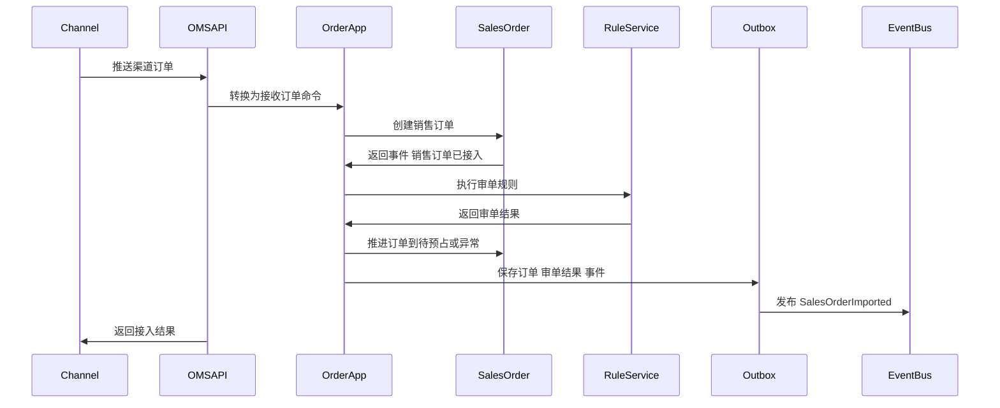
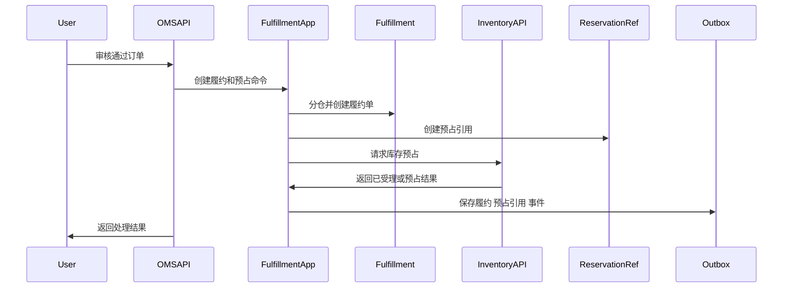
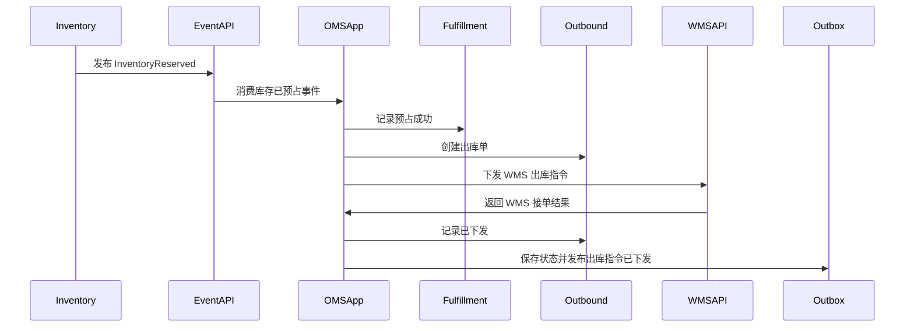
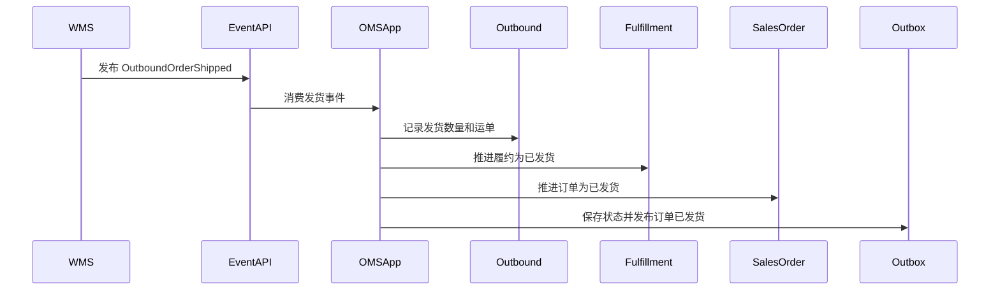
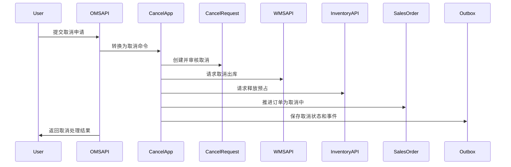
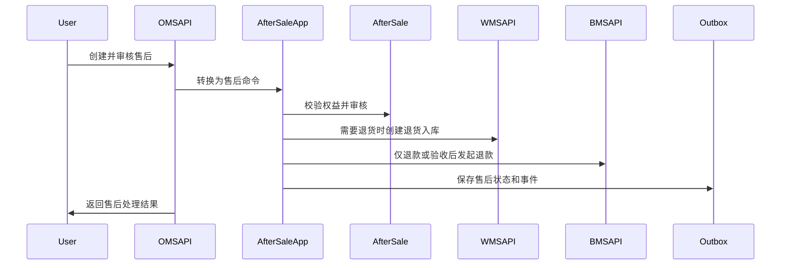

# 59 OMS系统接口设计

> 本文根据 [OMS领域模型](../03-核心业务模型/05-OMS领域模型/01-OMS领域模型.md)、[OMS系统产品功能设计](../04-子系统功能设计/OMS系统/OMS系统产品功能设计.md)、[OMS系统数据库设计](../05-子系统数据库设计/05-OMS系统数据库设计.md) 和 [上下文映射与领域事件目录](./50-上下文映射与领域事件目录.md) 设计。接口按 DDD + CQRS 口径拆分：查询接口读取 OMS 订单履约读模型，命令接口触发应用服务和聚合行为，跨系统接口遵守“OMS 编排履约，库存/WMS/BMS 各自拥有业务事实”的边界。

## 1. 设计范围

| 类型      | 范围                                                                   | 说明                                          |
| ------- | -------------------------------------------------------------------- | ------------------------------------------- |
| 前端页面接口  | OMS 工作台、渠道订单接入、销售订单、订单审单、分仓履约、库存预占、出库单、取消管理、售后管理、异常处理、规则配置、操作日志、枚举配置 | 面向 OMS 后台 Web 端                             |
| 跨系统命令接口 | 渠道/客服/外部系统 -> OMS，OMS -> 中央库存/WMS/BMS/权限/主数据                         | 同步接入订单、审核订单、分仓、预占、释放、下发出库、取消拦截、创建售后、发起退款、补发 |
| 跨系统事件接口 | 主数据/中央库存/WMS/BMS/物流 -> OMS，OMS -> 中央库存/WMS/BMS/BI                    | 异步传递订单、履约、库存、仓内作业、退款、物流签收等事实                |
| 不包含     | 中央库存余额记账、WMS 仓内扫码作业、BMS 财务入账、物流承运轨迹权威、商品/客户/仓库主数据权威                  | OMS 只拥有订单履约编排、订单状态、履约状态、出库指令、取消入口和售后入口      |

## 2. DDD 对齐说明

| DDD 关注点 | 本文口径 |
| --- | --- |
| 限界上下文 | OMS 上下文 |
| 核心聚合 | 销售订单、履约单、出库单、取消申请、售后单、OMS 规则配置 |
| 查询模型 | OMS 工作台、渠道接入记录、销售订单列表、审单异常、履约链路、预占引用、出库进度、取消记录、售后记录、异常待办、规则版本、操作日志 |
| 命令接口 | 接收订单、手工创建订单、审核订单、修正审单异常、分仓、换仓、拆单、请求库存预占、释放预占、创建出库单、下发 WMS、取消出库、创建取消申请、审核取消、创建售后、审核售后、发起退款、创建补发 |
| 领域事件 | 销售订单已接入、销售订单已审核、订单异常已标记、履约单已创建、库存预占已请求、出库指令已下发、取消申请已创建、订单已取消、售后单已创建、售后单已审核、退款已请求、补发已请求 |
| 数据主权 | OMS 拥有销售订单、履约单、出库单、取消申请、售后单、规则配置、订单状态和履约编排状态 |
| 幂等规则 | 写接口必须携带 `X-Idempotency-Key`；渠道订单以 `channelCode + shopCode + externalOrderNo` 幂等；跨系统命令以 `sourceSystem + sourceOrderNo + commandType + version` 幂等；事件消费以 `sourceContext + eventId + aggregateId` 幂等 |

## 3. 通用协议

### 3.1 基础路径

| 场景            | 基础路径                      |
| ------------- | ------------------------- |
| 前端页面接口        | `/api/oms/v1`             |
| 渠道/外部订单接入接口   | `/openapi/oms/v1`         |
| OMS 内部跨系统调用接口 | `/internal/oms/v1`        |
| 事件回调/事件消费入口   | `/internal/oms/v1/events` |

### 3.2 通用请求头

| 请求头                 | 必填       | 适用接口             | 说明                                                        |
| ------------------- | -------- | ---------------- | --------------------------------------------------------- |
| `Authorization`     | 是        | 前端接口             | `Bearer access_token`，由权限系统签发                             |
| `X-Tenant-Id`       | 否        | 全部               | 租户 ID，单租户可不传                                              |
| `X-Org-Id`          | 是        | 全部               | 当前组织 ID                                                   |
| `X-Owner-Id`        | 多货主必填    | 页面查询、命令、事件       | 当前货主 ID                                                   |
| `X-Warehouse-Id`    | 仓维度操作必填  | 履约、出库、取消、售后退货    | 当前仓库 ID，用于仓库数据权限                                          |
| `X-Channel-Code`    | 渠道接口必填   | 渠道订单接入、渠道取消、渠道售后 | 渠道编码                                                      |
| `X-Shop-Code`       | 渠道接口建议必填 | 渠道订单接入           | 店铺编码                                                      |
| `X-Request-Id`      | 是        | 全部               | 请求链路 ID                                                   |
| `X-Trace-Id`        | 否        | 全部               | 分布式链路追踪 ID                                                |
| `X-Idempotency-Key` | 写接口必填    | 命令接口、跨系统命令、事件入口  | 同一业务动作唯一                                                  |
| `X-Source-System`   | 跨系统必填    | 跨系统命令、事件入口       | `CHANNEL`、`OMS`、`INVENTORY`、`WMS`、`MDM`、`IAM`、`BMS`、`TMS` |
| `X-Operator-Id`     | 写接口必填    | 命令接口             | 操作人；系统任务传系统账号                                             |
| `X-Data-Scope`      | 否        | 前端查询             | 网关或权限中间件解析后的数据范围摘要                                        |
| `Accept-Language`   | 否        | 全部               | `zh-CN` 默认                                                |

### 3.3 通用响应结构

```json
{
  "success": true,
  "code": "SUCCESS",
  "message": "处理成功",
  "requestId": "REQ202607040001",
  "traceId": "TRACE202607040001",
  "timestamp": "2026-07-04T10:00:00+08:00",
  "data": {}
}
```

分页响应：

```json
{
  "success": true,
  "code": "SUCCESS",
  "message": "查询成功",
  "data": {
    "pageNo": 1,
    "pageSize": 20,
    "total": 128,
    "records": []
  }
}
```

命令响应：

```json
{
  "success": true,
  "code": "SUCCESS",
  "message": "命令已处理",
  "data": {
    "aggregateId": "190001",
    "businessNo": "SO202607040001",
    "status": 4,
    "statusName": "待预占",
    "version": 3,
    "eventId": "EVT202607040001",
    "idempotentHit": false
  }
}
```

### 3.4 HTTP 状态码

| HTTP 状态码 | 场景 | 前端/调用方处理 |
| --- | --- | --- |
| `200` | 查询成功、命令同步处理成功 | 正常刷新页面或继续业务 |
| `201` | 新增销售订单、取消申请、售后单、规则成功 | 跳转详情或刷新列表 |
| `202` | 订单接入、预占、下发 WMS、退款等异步命令已受理 | 展示处理中，轮询任务或等待事件 |
| `204` | 关闭、忽略、取消等动作成功且无返回体 | 返回列表或刷新详情 |
| `400` | 请求格式错误、字段类型错误 | 表单或调用方提示 |
| `401` | 未登录、Token 过期、渠道签名无效 | 跳转登录或返回认证失败 |
| `403` | 无菜单/按钮/组织/仓库/货主/渠道权限 | 隐藏按钮或提示无权限 |
| `404` | 订单、履约单、出库单、取消申请、售后单不存在 | 提示记录不存在 |
| `409` | 乐观锁冲突、幂等内容不一致、状态机冲突、重复接单 | 提示刷新或返回原幂等结果 |
| `422` | 审单不通过、库存不足、不可取消、售后权益不足、金额超限 | 展示业务失败原因 |
| `429` | 请求过于频繁 | 稍后重试 |
| `500` | 系统异常 | 记录错误并提示稍后重试 |

### 3.5 业务错误码

| 业务码 | HTTP | 含义 |
| --- | --- | --- |
| `SUCCESS` | `200/201` | 成功 |
| `ACCEPTED` | `202` | 已受理异步处理 |
| `VALIDATION_FAILED` | `400` | 字段校验失败 |
| `UNAUTHORIZED` | `401` | 未认证 |
| `SIGNATURE_INVALID` | `401` | 渠道签名无效 |
| `FORBIDDEN` | `403` | 无权限 |
| `CHANNEL_SCOPE_DENIED` | `403` | 无渠道或店铺权限 |
| `WAREHOUSE_SCOPE_DENIED` | `403` | 无仓库权限 |
| `OWNER_SCOPE_DENIED` | `403` | 无货主权限 |
| `NOT_FOUND` | `404` | 资源不存在 |
| `VERSION_CONFLICT` | `409` | 乐观锁版本冲突 |
| `IDEMPOTENCY_CONFLICT` | `409` | 同一幂等键请求内容不一致 |
| `ORDER_DUPLICATED` | `409` | 渠道订单重复接入 |
| `STATE_CONFLICT` | `409` | 当前状态不允许该命令 |
| `AUDIT_RULE_BLOCKED` | `422` | 审单规则拦截 |
| `INVENTORY_RESERVE_FAILED` | `422` | 库存预占失败 |
| `WMS_COMMAND_FAILED` | `422/500` | WMS 命令处理失败 |
| `ORDER_NOT_CANCELABLE` | `422` | 订单不可取消 |
| `AFTER_SALE_QTY_EXCEEDED` | `422` | 售后数量超过可售后数量 |
| `REFUND_AMOUNT_EXCEEDED` | `422` | 退款金额超过可退金额 |
| `BUSINESS_RULE_FAILED` | `422` | 领域规则不通过 |
| `SYSTEM_ERROR` | `500` | 系统异常 |

## 4. 枚举值约定

接口中的状态枚举与数据库设计保持一致。落库建议使用数值，接口可同时返回 `status` 和 `statusName`，前端展示名由枚举配置页维护。

| 枚举类型 | 值 | 展示名 | 使用位置 |
| --- | --- | --- | --- |
| `SALES_ORDER_STATUS` | `1` | 已创建 | 销售订单 |
| `SALES_ORDER_STATUS` | `2` | 待审核 | 销售订单 |
| `SALES_ORDER_STATUS` | `3` | 异常待处理 | 销售订单 |
| `SALES_ORDER_STATUS` | `4` | 待预占 | 销售订单、履约 |
| `SALES_ORDER_STATUS` | `5` | 缺货待处理 | 销售订单、履约 |
| `SALES_ORDER_STATUS` | `6` | 已预占 | 销售订单、履约 |
| `SALES_ORDER_STATUS` | `7` | 已下发仓库 | 销售订单、出库 |
| `SALES_ORDER_STATUS` | `8` | 出库中 | 销售订单、出库 |
| `SALES_ORDER_STATUS` | `9` | 已发货 | 销售订单 |
| `SALES_ORDER_STATUS` | `10` | 已签收 | 销售订单 |
| `SALES_ORDER_STATUS` | `11` | 已完成 | 销售订单 |
| `SALES_ORDER_STATUS` | `12` | 已取消 | 销售订单 |
| `FULFILLMENT_ORDER_STATUS` | `1` | 待预占 | 履约单 |
| `FULFILLMENT_ORDER_STATUS` | `2` | 已预占 | 履约单 |
| `FULFILLMENT_ORDER_STATUS` | `3` | 待出库 | 履约单 |
| `FULFILLMENT_ORDER_STATUS` | `4` | 已下发 | 履约单 |
| `FULFILLMENT_ORDER_STATUS` | `5` | 出库中 | 履约单 |
| `FULFILLMENT_ORDER_STATUS` | `6` | 已发货 | 履约单 |
| `FULFILLMENT_ORDER_STATUS` | `7` | 已取消 | 履约单 |
| `FULFILLMENT_ORDER_STATUS` | `8` | 失败 | 履约单 |
| `RESERVATION_STATUS` | `1` | 待预占 | 库存预占引用 |
| `RESERVATION_STATUS` | `2` | 预占成功 | 库存预占引用 |
| `RESERVATION_STATUS` | `3` | 预占失败 | 库存预占引用 |
| `RESERVATION_STATUS` | `4` | 已释放 | 库存预占引用 |
| `RESERVATION_STATUS` | `5` | 已扣减 | 库存预占引用 |
| `OUTBOUND_STATUS` | `1` | 草稿 | 出库单 |
| `OUTBOUND_STATUS` | `2` | 已下发 | 出库单 |
| `OUTBOUND_STATUS` | `3` | WMS已接单 | 出库单 |
| `OUTBOUND_STATUS` | `4` | 拣货中 | 出库单 |
| `OUTBOUND_STATUS` | `5` | 已发货 | 出库单 |
| `OUTBOUND_STATUS` | `6` | 已取消 | 出库单 |
| `OUTBOUND_STATUS` | `7` | 异常 | 出库单 |
| `CANCEL_STATUS` | `1` | 待审核 | 取消申请 |
| `CANCEL_STATUS` | `2` | 已同意 | 取消申请 |
| `CANCEL_STATUS` | `3` | 已拒绝 | 取消申请 |
| `CANCEL_STATUS` | `4` | 取消中 | 取消申请 |
| `CANCEL_STATUS` | `5` | 已完成 | 取消申请 |
| `CANCEL_STATUS` | `6` | 转售后 | 取消申请 |
| `AFTER_SALE_STATUS` | `1` | 已创建 | 售后单 |
| `AFTER_SALE_STATUS` | `2` | 待审核 | 售后单 |
| `AFTER_SALE_STATUS` | `3` | 审核驳回 | 售后单 |
| `AFTER_SALE_STATUS` | `4` | 待退货 | 售后单 |
| `AFTER_SALE_STATUS` | `5` | 待验收 | 售后单 |
| `AFTER_SALE_STATUS` | `6` | 待退款 | 售后单 |
| `AFTER_SALE_STATUS` | `7` | 待补发 | 售后单 |
| `AFTER_SALE_STATUS` | `8` | 异常待处理 | 售后单 |
| `AFTER_SALE_STATUS` | `9` | 已完成 | 售后单 |
| `AFTER_SALE_STATUS` | `10` | 已关闭 | 售后单 |
| `WMS_CANCEL_STATUS` | `1` | 未请求 | 取消申请 |
| `WMS_CANCEL_STATUS` | `2` | 请求中 | 取消申请 |
| `WMS_CANCEL_STATUS` | `3` | 成功 | 取消申请 |
| `WMS_CANCEL_STATUS` | `4` | 失败 | 取消申请 |

## 5. 前端页面接口

### 5.1 页面接口总览

| 页面 | 调用位置 | 接口 | 权限点 | 领域对象 |
| --- | --- | --- | --- | --- |
| OMS 工作台 | 首屏加载、待办卡片点击 | `GET /api/oms/v1/workbench/summary`、`GET /api/oms/v1/workbench/todos` | `oms:workbench:read` | 销售订单、履约单、出库单、售后单、异常 |
| 渠道订单接入页 | 查询、重试、忽略、手工创建 | `GET /api/oms/v1/channel-orders`、`GET /api/oms/v1/channel-orders/{importNo}`、`POST /api/oms/v1/channel-orders/{importNo}/retry`、`POST /api/oms/v1/channel-orders/{importNo}/ignore`、`POST /api/oms/v1/sales-orders/manual` | `oms:channel_order:read`、`oms:order:page` | 渠道接入记录、销售订单 |
| 销售订单页 | 查询、新增、编辑、审核、取消、重审、详情 | `GET /api/oms/v1/sales-orders`、`GET /api/oms/v1/sales-orders/{salesOrderNo}`、`POST /api/oms/v1/sales-orders`、`PUT /api/oms/v1/sales-orders/{salesOrderNo}`、`POST /api/oms/v1/sales-orders/{salesOrderNo}/approve`、`POST /api/oms/v1/sales-orders/{salesOrderNo}/cancel`、`POST /api/oms/v1/sales-orders/{salesOrderNo}/reaudit` | `oms:sales_order:read`、`oms:sales_order:create`、`oms:sales_order:update`、`oms:sales_order:approval`、`oms:sales_order:cancel` | 销售订单 |
| 订单审单页 | 查询、通过、驳回、修正、重审 | `GET /api/oms/v1/audit-results`、`POST /api/oms/v1/audit-results/{resultId}/approve`、`POST /api/oms/v1/audit-results/{resultId}/reject`、`POST /api/oms/v1/audit-results/{resultId}/fix`、`POST /api/oms/v1/sales-orders/{salesOrderNo}/reaudit` | `oms:audit:read`、`oms:order:approve`、`oms:order:reject` | 审单结果、销售订单 |
| 分仓履约页 | 查询、分仓、换仓、拆单、合单 | `GET /api/oms/v1/fulfillments`、`GET /api/oms/v1/fulfillments/{fulfillmentOrderNo}`、`POST /api/oms/v1/sales-orders/{salesOrderNo}/allocate`、`POST /api/oms/v1/fulfillments/{fulfillmentOrderNo}/change-warehouse`、`POST /api/oms/v1/fulfillments/{fulfillmentOrderNo}/split`、`POST /api/oms/v1/fulfillments/merge` | `oms:fulfillment:read`、`oms:fulfillment:page` | 履约单 |
| 库存预占页 | 查询、重试预占、释放预占 | `GET /api/oms/v1/reservations`、`GET /api/oms/v1/reservations/{reservationRefNo}`、`POST /api/oms/v1/fulfillments/{fulfillmentOrderNo}/reserve`、`POST /api/oms/v1/reservations/{reservationRefNo}/release` | `oms:reservation:read`、`oms:stockreservation:reservation`、`oms:stockreservation:releasereservation` | 库存预占引用、履约单 |
| 出库单页 | 查询、创建、下发、取消、重推 | `GET /api/oms/v1/outbounds`、`GET /api/oms/v1/outbounds/{outboundOrderNo}`、`POST /api/oms/v1/fulfillments/{fulfillmentOrderNo}/outbounds`、`POST /api/oms/v1/outbounds/{outboundOrderNo}/release`、`POST /api/oms/v1/outbounds/{outboundOrderNo}/cancel`、`POST /api/oms/v1/outbounds/{outboundOrderNo}/repush` | `oms:outbound:read`、`oms:outbound:page`、`oms:outbound:cancel` | 出库单 |
| 取消管理页 | 查询、创建、审核、同意、拒绝、转售后 | `GET /api/oms/v1/cancel-requests`、`POST /api/oms/v1/cancel-requests`、`GET /api/oms/v1/cancel-requests/{cancelRequestNo}`、`POST /api/oms/v1/cancel-requests/{cancelRequestNo}/approve`、`POST /api/oms/v1/cancel-requests/{cancelRequestNo}/reject`、`POST /api/oms/v1/cancel-requests/{cancelRequestNo}/to-after-sale` | `oms:cancel:read`、`oms:page:approval`、`oms:page:after_sale` | 取消申请 |
| 售后管理页 | 查询、创建、审核、驳回、关闭、发起退款、创建补发 | `GET /api/oms/v1/after-sales`、`POST /api/oms/v1/after-sales`、`GET /api/oms/v1/after-sales/{afterSaleNo}`、`POST /api/oms/v1/after-sales/{afterSaleNo}/approve`、`POST /api/oms/v1/after-sales/{afterSaleNo}/reject`、`POST /api/oms/v1/after-sales/{afterSaleNo}/refund`、`POST /api/oms/v1/after-sales/{afterSaleNo}/reship`、`POST /api/oms/v1/after-sales/{afterSaleNo}/close` | `oms:after_sale:read`、`oms:after_sale:page`、`oms:after_sale:approval`、`oms:after_sale:reject`、`oms:after_sale:close` | 售后单 |
| 异常处理页 | 查询、分派、处理、关闭、重试 | `GET /api/oms/v1/exceptions`、`POST /api/oms/v1/exceptions/{exceptionNo}/assign`、`POST /api/oms/v1/exceptions/{exceptionNo}/process`、`POST /api/oms/v1/exceptions/{exceptionNo}/close`、`POST /api/oms/v1/exceptions/{exceptionNo}/retry` | `oms:exception:read`、`oms:exception:page`、`oms:exception:close` | 订单异常 |
| 规则配置页 | 查询、新增、编辑、启用、停用、发布 | `GET /api/oms/v1/rules`、`POST /api/oms/v1/rules`、`PUT /api/oms/v1/rules/{ruleCode}`、`POST /api/oms/v1/rules/{ruleCode}/enable`、`POST /api/oms/v1/rules/{ruleCode}/disable`、`POST /api/oms/v1/rules/{ruleCode}/publish` | `oms:rule:read`、`oms:settings:create`、`oms:settings:update`、`oms:settings:release` | OMS 规则配置 |
| 操作日志页 | 查询、详情、导出 | `GET /api/oms/v1/operation-logs`、`GET /api/oms/v1/operation-logs/{logId}`、`POST /api/oms/v1/operation-logs/export` | `oms:operation_log:read`、`oms:operation_log:export` | 操作审计 |
| 枚举配置页 | 查询、新增、编辑、排序、停用 | `GET /api/oms/v1/enums`、`POST /api/oms/v1/enums`、`PUT /api/oms/v1/enums/{enumItemId}`、`POST /api/oms/v1/enums/sort`、`POST /api/oms/v1/enums/{enumItemId}/disable` | `oms:enum:read`、`oms:enumsettings:create`、`oms:enumsettings:update` | 枚举配置 |

### 5.2 OMS 工作台接口

#### 查询工作台汇总

| 项 | 设计 |
| --- | --- |
| 方法 | `GET` |
| 路径 | `/api/oms/v1/workbench/summary` |
| 调用页面 | OMS 工作台首屏加载 |
| 调用时机 | 用户进入 `/oms/workbench`，或切换渠道、仓库、货主、时间范围后 |
| 权限点 | `oms:workbench:read` |
| 数据变化 | 无，只读取读模型 |

请求参数：

| 字段 | 类型 | 必填 | 说明 |
| --- | --- | --- | --- |
| `ownerId` | `long` | 否 | 货主 ID |
| `channelCode` | `string` | 否 | 渠道编码 |
| `warehouseIds` | `long[]` | 否 | 仓库范围 |
| `dateFrom` | `date` | 否 | 起始日期 |
| `dateTo` | `date` | 否 | 结束日期 |

响应字段：

| 字段 | 类型 | 说明 |
| --- | --- | --- |
| `pendingAuditCount` | `int` | 待审订单数 |
| `stockShortageCount` | `int` | 缺货待处理数 |
| `pendingOutboundCount` | `int` | 待下发 WMS 数 |
| `outboundExceptionCount` | `int` | 出库异常数 |
| `afterSalePendingCount` | `int` | 售后待审数 |
| `cancelPendingCount` | `int` | 取消待审数 |
| `eventFailedCount` | `int` | 事件失败数 |

状态码：`200`、`401`、`403`、`500`。

#### 查询工作台待办

| 项 | 设计 |
| --- | --- |
| 方法 | `GET` |
| 路径 | `/api/oms/v1/workbench/todos` |
| 调用页面 | OMS 工作台待办列表 |
| 调用时机 | 首屏加载、点击待办卡片、翻页 |
| 权限点 | `oms:workbench:read` |
| 数据变化 | 无 |

请求参数：

| 字段 | 类型 | 必填 | 说明 |
| --- | --- | --- | --- |
| `todoType` | `string` | 否 | `AUDIT`、`SHORTAGE`、`PENDING_OUTBOUND`、`OUTBOUND_EXCEPTION`、`AFTER_SALE`、`CANCEL`、`EVENT_FAILED` |
| `pageNo` | `int` | 是 | 页码 |
| `pageSize` | `int` | 是 | 每页条数 |

响应字段：`todoId`、`todoType`、`businessNo`、`title`、`status`、`statusName`、`occurredAt`、`targetRoute`。

状态码：`200`、`401`、`403`、`500`。

### 5.3 销售订单接口

#### 查询销售订单列表

| 项 | 设计 |
| --- | --- |
| 方法 | `GET` |
| 路径 | `/api/oms/v1/sales-orders` |
| 调用页面 | 销售订单页查询区、分页、排序；客服订单查询 |
| 调用时机 | 进入页面、点击查询、重置、翻页、排序 |
| 权限点 | `oms:sales_order:read` |
| 数据变化 | 无，读取 `oms_sales_order` 及订单行读模型 |

请求参数：

| 字段 | 类型 | 必填 | 说明 |
| --- | --- | --- | --- |
| `salesOrderNo` | `string` | 否 | 内部销售订单号 |
| `externalOrderNo` | `string` | 否 | 外部渠道订单号 |
| `channelCode` | `string` | 否 | 渠道编码 |
| `customerKeyword` | `string` | 否 | 客户名称、手机号后四位等 |
| `orderType` | `int` | 否 | 订单类型 |
| `payStatus` | `int` | 否 | 支付状态 |
| `auditStatus` | `int` | 否 | 审单状态 |
| `orderStatus` | `int` | 否 | `SALES_ORDER_STATUS` |
| `fulfillmentStatus` | `int` | 否 | 履约状态 |
| `createdFrom` | `datetime` | 否 | 创建开始时间 |
| `createdTo` | `datetime` | 否 | 创建结束时间 |
| `pageNo` | `int` | 是 | 页码 |
| `pageSize` | `int` | 是 | 每页条数 |
| `sortField` | `string` | 否 | 排序字段 |
| `sortOrder` | `string` | 否 | `ASC`、`DESC` |

响应字段：

| 字段 | 类型 | 说明 |
| --- | --- | --- |
| `salesOrderId` | `long` | 销售订单 ID |
| `salesOrderNo` | `string` | 内部销售订单号 |
| `externalOrderNo` | `string` | 外部订单号 |
| `channelCode` | `string` | 渠道编码 |
| `customerName` | `string` | 客户名称快照 |
| `orderType` | `int` | 订单类型 |
| `payStatus` | `int` | 支付状态 |
| `auditStatus` | `int` | 审单状态 |
| `orderStatus` | `int` | 订单状态 |
| `fulfillmentStatus` | `int` | 履约状态 |
| `totalAmount` | `decimal(18,2)` | 订单总额 |
| `discountAmount` | `decimal(18,2)` | 优惠金额 |
| `payAmount` | `decimal(18,2)` | 实付金额 |
| `receiverName` | `string` | 收货人 |
| `receiverMobileMasked` | `string` | 脱敏手机号 |
| `paidAt` | `datetime` | 支付时间 |
| `createdAt` | `datetime` | 创建时间 |
| `updatedAt` | `datetime` | 更新时间 |
| `version` | `int` | 版本号 |

状态码：`200`、`400`、`401`、`403`、`500`。

#### 查询销售订单详情

| 项 | 设计 |
| --- | --- |
| 方法 | `GET` |
| 路径 | `/api/oms/v1/sales-orders/{salesOrderNo}` |
| 调用页面 | 销售订单行内“查看详情”、订单详情页 |
| 调用时机 | 用户进入详情页或打开详情抽屉 |
| 权限点 | `oms:sales_order:read` |
| 数据变化 | 无 |

响应字段：

| 字段 | 类型 | 说明 |
| --- | --- | --- |
| `order` | `object` | 订单头，字段同列表并包含完整地址 |
| `lines` | `array` | 订单行，包含 SKU 快照、下单数量、预占数量、出库数量、发货数量、退货数量、行状态 |
| `auditResults` | `array` | 审单结果 |
| `fulfillments` | `array` | 履约单和预占引用 |
| `outbounds` | `array` | 出库单 |
| `cancelRequests` | `array` | 取消记录 |
| `afterSales` | `array` | 售后记录 |
| `eventTimeline` | `array` | 领域事件和外部事件时间线 |
| `operationLogs` | `array` | 操作日志 |

状态码：`200`、`401`、`403`、`404`、`500`。

#### 手工创建销售订单

| 项 | 设计 |
| --- | --- |
| 方法 | `POST` |
| 路径 | `/api/oms/v1/sales-orders` |
| 调用页面 | 销售订单页顶部“新增”或渠道订单接入页“手工创建” |
| 调用时机 | 客服或运营需要补录订单、换货补发、线下单时 |
| 权限点 | `oms:sales_order:create` |
| 数据变化 | 创建 `oms_sales_order` 和 `oms_sales_order_line`；状态为已创建或待审核；发布 `SalesOrderCreated` |

请求字段：

| 字段 | 类型 | 必填 | 说明 |
| --- | --- | --- | --- |
| `channelCode` | `string` | 是 | 渠道编码，手工单可传 `MANUAL` |
| `externalOrderNo` | `string` | 是 | 外部订单号或手工单来源号 |
| `orderType` | `int` | 是 | 订单类型 |
| `customerId` | `long` | 否 | 客户 ID |
| `customerName` | `string` | 是 | 客户名称快照 |
| `receiverName` | `string` | 是 | 收货人 |
| `receiverMobile` | `string` | 是 | 收货电话 |
| `receiverAddress` | `string` | 是 | 收货地址 |
| `totalAmount` | `decimal(18,2)` | 是 | 订单总额 |
| `discountAmount` | `decimal(18,2)` | 是 | 优惠金额 |
| `payAmount` | `decimal(18,2)` | 是 | 实付金额 |
| `paidAt` | `datetime` | 否 | 支付时间 |
| `autoAudit` | `boolean` | 否 | 是否创建后自动审单 |
| `lines[].skuId` | `long` | 是 | SKU ID |
| `lines[].skuCode` | `string` | 是 | SKU 编码快照 |
| `lines[].skuName` | `string` | 是 | SKU 名称快照 |
| `lines[].orderQty` | `decimal(18,4)` | 是 | 下单数量 |
| `lines[].unitPrice` | `decimal(18,6)` | 是 | 单价 |
| `lines[].lineAmount` | `decimal(18,2)` | 是 | 行金额 |

响应字段：`salesOrderNo`、`orderStatus`、`auditStatus`、`version`、`eventId`、`idempotentHit`。

状态码：`201`、`400`、`401`、`403`、`409`、`422`、`500`。

#### 审核销售订单

| 项 | 设计 |
| --- | --- |
| 方法 | `POST` |
| 路径 | `/api/oms/v1/sales-orders/{salesOrderNo}/approve` |
| 调用页面 | 销售订单行内“审核”、订单审单页“通过” |
| 调用时机 | 自动审单通过、人工放行、修正后重审通过 |
| 权限点 | `oms:sales_order:approval`、`oms:order:approve` |
| 数据变化 | `audit_status` 变为通过；`order_status` 进入待预占；发布 `SalesOrderApproved`；后续触发履约分仓和库存预占 |

请求字段：

| 字段 | 类型 | 必填 | 说明 |
| --- | --- | --- | --- |
| `approveMode` | `string` | 是 | `AUTO`、`MANUAL` |
| `remark` | `string` | 否 | 审核备注 |
| `version` | `int` | 是 | 乐观锁版本 |

响应字段：`salesOrderNo`、`auditStatus`、`orderStatus`、`version`、`eventId`。

状态码：`200`、`400`、`401`、`403`、`404`、`409`、`422`、`500`。

### 5.4 审单与履约接口

#### 查询审单结果

| 项 | 设计 |
| --- | --- |
| 方法 | `GET` |
| 路径 | `/api/oms/v1/audit-results` |
| 调用页面 | 订单审单页查询区 |
| 调用时机 | 进入页面、点击查询、翻页、从工作台待审卡片进入 |
| 权限点 | `oms:audit:read` |
| 数据变化 | 无 |

请求参数：`salesOrderNo`、`auditType`、`auditResult`、`processedStatus`、`createdFrom`、`createdTo`、`pageNo`、`pageSize`。

响应字段：`resultId`、`salesOrderNo`、`auditType`、`auditResult`、`hitRuleCode`、`exceptionReason`、`processedStatus`、`processedBy`、`processedAt`、`createdAt`。

状态码：`200`、`400`、`401`、`403`、`500`。

#### 分仓生成履约单

| 项 | 设计 |
| --- | --- |
| 方法 | `POST` |
| 路径 | `/api/oms/v1/sales-orders/{salesOrderNo}/allocate` |
| 调用页面 | 分仓履约页行内“分仓”；销售订单审核通过后的系统任务 |
| 调用时机 | 订单待预占时，根据仓库、库存、物流时效、拆单规则生成履约单 |
| 权限点 | `oms:fulfillment:page` |
| 数据变化 | 创建 `oms_fulfillment`、`oms_fulfillment_line`；销售订单状态可保持待预占；发布 `FulfillmentOrderCreated` 或 `FulfillmentWarehouseAllocated` |

请求字段：

| 字段 | 类型 | 必填 | 说明 |
| --- | --- | --- | --- |
| `allocateMode` | `string` | 是 | `AUTO`、`MANUAL` |
| `warehouseId` | `long` | 人工分仓必填 | 指定仓库 |
| `logisticsProductCode` | `string` | 否 | 物流产品 |
| `allowSplit` | `boolean` | 否 | 是否允许拆单 |
| `remark` | `string` | 否 | 备注 |
| `version` | `int` | 是 | 销售订单版本 |

响应字段：`salesOrderNo`、`fulfillmentOrderNos[]`、`orderStatus`、`eventId`、`version`。

状态码：`200`、`201`、`400`、`401`、`403`、`404`、`409`、`422`、`500`。

#### 查询履约单列表

| 项 | 设计 |
| --- | --- |
| 方法 | `GET` |
| 路径 | `/api/oms/v1/fulfillments` |
| 调用页面 | 分仓履约页查询区 |
| 调用时机 | 查询、翻页、查看待预占/缺货/待下发 |
| 权限点 | `oms:fulfillment:read` |
| 数据变化 | 无 |

请求参数：`fulfillmentOrderNo`、`salesOrderNo`、`warehouseId`、`fulfillmentStatus`、`promiseShipFrom`、`promiseShipTo`、`pageNo`、`pageSize`。

响应字段：`fulfillmentOrderNo`、`salesOrderNo`、`warehouseId`、`warehouseName`、`logisticsProductCode`、`promiseShipAt`、`promiseArriveAt`、`fulfillmentStatus`、`splitReason`、`lineCount`、`totalQty`、`version`。

状态码：`200`、`400`、`401`、`403`、`500`。

### 5.5 库存预占接口

#### 查询预占引用列表

| 项 | 设计 |
| --- | --- |
| 方法 | `GET` |
| 路径 | `/api/oms/v1/reservations` |
| 调用页面 | 库存预占页查询区 |
| 调用时机 | 进入页面、点击查询、从工作台缺货待办进入 |
| 权限点 | `oms:reservation:read` |
| 数据变化 | 无，读取 OMS 本地预占引用，不直接查询库存余额 |

请求参数：`reservationRefNo`、`reservationNo`、`salesOrderNo`、`fulfillmentOrderNo`、`warehouseId`、`reservationStatus`、`pageNo`、`pageSize`。

响应字段：`reservationRefNo`、`reservationNo`、`salesOrderNo`、`fulfillmentOrderNo`、`warehouseId`、`reserveQty`、`reservedQty`、`reservationStatus`、`failReason`、`createdAt`、`updatedAt`。

状态码：`200`、`400`、`401`、`403`、`500`。

#### 请求库存预占

| 项 | 设计 |
| --- | --- |
| 方法 | `POST` |
| 路径 | `/api/oms/v1/fulfillments/{fulfillmentOrderNo}/reserve` |
| 调用页面 | 库存预占页“重试预占”；分仓履约后系统自动调用 |
| 调用时机 | 履约单处于待预占或缺货重试时 |
| 权限点 | `oms:stockreservation:reservation` |
| 数据变化 | 创建或更新 `oms_stock_reservation` 为待预占；调用中央库存 `ReserveInventory`；成功后等待 `InventoryReserved` 事件推进为预占成功 |

请求字段：

| 字段 | 类型 | 必填 | 说明 |
| --- | --- | --- | --- |
| `reserveMode` | `string` | 是 | `AUTO`、`MANUAL_RETRY` |
| `warehouseId` | `long` | 是 | 预占仓 |
| `expireAt` | `datetime` | 否 | 预占过期时间 |
| `allowPartial` | `boolean` | 否 | 是否允许部分预占 |
| `version` | `int` | 是 | 履约单版本 |
| `lines[].fulfillmentLineId` | `long` | 是 | 履约行 ID |
| `lines[].skuId` | `long` | 是 | SKU ID |
| `lines[].reserveQty` | `decimal(18,4)` | 是 | 请求预占数量 |

响应字段：`fulfillmentOrderNo`、`reservationRefNo`、`reservationStatus`、`externalRequestId`、`eventId`、`idempotentHit`。

状态码：`200`、`202`、`400`、`401`、`403`、`404`、`409`、`422`、`500`。

#### 释放预占

| 项 | 设计 |
| --- | --- |
| 方法 | `POST` |
| 路径 | `/api/oms/v1/reservations/{reservationRefNo}/release` |
| 调用页面 | 库存预占页“释放预占”；取消管理页同意取消后的系统动作 |
| 调用时机 | 订单取消、履约关闭、换仓、短拣释放差额时 |
| 权限点 | `oms:stockreservation:releasereservation` |
| 数据变化 | `oms_stock_reservation` 变为释放中或已释放；调用中央库存 `ReleaseInventoryReservation`；消费 `InventoryReservationReleased` 后最终确认 |

请求字段：`releaseReason`、`remark`、`version`、`lines[].skuId`、`lines[].releaseQty`。

响应字段：`reservationRefNo`、`reservationNo`、`reservationStatus`、`externalRequestId`、`eventId`、`idempotentHit`。

状态码：`200`、`202`、`400`、`401`、`403`、`404`、`409`、`422`、`500`。

### 5.6 出库单接口

#### 查询出库单列表

| 项 | 设计 |
| --- | --- |
| 方法 | `GET` |
| 路径 | `/api/oms/v1/outbounds` |
| 调用页面 | 出库单页查询区 |
| 调用时机 | 查询、翻页、从工作台待下发/出库异常进入 |
| 权限点 | `oms:outbound:read` |
| 数据变化 | 无 |

请求参数：`outboundOrderNo`、`salesOrderNo`、`fulfillmentOrderNo`、`wmsOrderNo`、`warehouseId`、`outboundType`、`outboundStatus`、`createdFrom`、`createdTo`、`pageNo`、`pageSize`。

响应字段：`outboundOrderNo`、`salesOrderNo`、`fulfillmentOrderNo`、`warehouseId`、`warehouseName`、`outboundType`、`wmsOrderNo`、`outboundStatus`、`plannedQty`、`shippedQty`、`releasedAt`、`shippedAt`、`version`。

状态码：`200`、`400`、`401`、`403`、`500`。

#### 创建出库单

| 项 | 设计 |
| --- | --- |
| 方法 | `POST` |
| 路径 | `/api/oms/v1/fulfillments/{fulfillmentOrderNo}/outbounds` |
| 调用页面 | 出库单页“创建”；预占成功后的系统任务 |
| 调用时机 | 履约单库存已预占，需要生成 WMS 出库指令前 |
| 权限点 | `oms:outbound:page` |
| 数据变化 | 创建 `oms_outbound` 和 `oms_outbound_line`，状态草稿；发布 `OutboundOrderCreated` |

请求字段：`outboundType`、`warehouseId`、`logisticsProductCode`、`remark`、`version`、`lines[].fulfillmentLineId`、`lines[].skuId`、`lines[].plannedQty`。

响应字段：`outboundOrderNo`、`outboundStatus`、`eventId`、`version`。

状态码：`201`、`400`、`401`、`403`、`404`、`409`、`422`、`500`。

#### 下发 WMS 出库指令

| 项 | 设计 |
| --- | --- |
| 方法 | `POST` |
| 路径 | `/api/oms/v1/outbounds/{outboundOrderNo}/release` |
| 调用页面 | 出库单页“下发”或“重推” |
| 调用时机 | 出库单草稿或 WMS 拒单/下发失败后重推 |
| 权限点 | `oms:outbound:page` |
| 数据变化 | 出库单状态变为已下发；调用 WMS `CreateOutboundOrder`；发布 `OutboundInstructionIssued` |

请求字段：

| 字段 | 类型 | 必填 | 说明 |
| --- | --- | --- | --- |
| `releaseMode` | `string` | 是 | `FIRST_RELEASE`、`RETRY` |
| `version` | `int` | 是 | 出库单版本 |
| `remark` | `string` | 否 | 备注 |

响应字段：`outboundOrderNo`、`outboundStatus`、`wmsOrderNo`、`externalRequestId`、`eventId`、`idempotentHit`。

状态码：`200`、`202`、`400`、`401`、`403`、`404`、`409`、`422`、`500`。

#### 取消出库单

| 项 | 设计 |
| --- | --- |
| 方法 | `POST` |
| 路径 | `/api/oms/v1/outbounds/{outboundOrderNo}/cancel` |
| 调用页面 | 出库单页“取消”；取消管理同意取消后的系统动作 |
| 调用时机 | WMS 未发货前需要拦截仓内作业 |
| 权限点 | `oms:outbound:cancel` |
| 数据变化 | 未下发则本地取消；已下发则调用 WMS `CancelOutboundOrder`，本地状态进入取消中或异常；消费 `OutboundOrderCanceled` 后最终取消 |

请求字段：`cancelReason`、`cancelSource`、`version`、`remark`。

响应字段：`outboundOrderNo`、`outboundStatus`、`wmsCancelStatus`、`externalRequestId`、`eventId`。

状态码：`200`、`202`、`400`、`401`、`403`、`404`、`409`、`422`、`500`。

### 5.7 取消申请接口

#### 创建取消申请

| 项 | 设计 |
| --- | --- |
| 方法 | `POST` |
| 路径 | `/api/oms/v1/cancel-requests` |
| 调用页面 | 销售订单页“取消”；取消管理页“新增”；渠道取消回调 |
| 调用时机 | 客户、客服、渠道或系统需要取消订单时 |
| 权限点 | `oms:sales_order:cancel` 或 `oms:page:approval` |
| 数据变化 | 创建 `oms_cancel`；判断订单是否可取消；未发货走库存释放和 WMS 拦截，已发货转售后；发布 `CancelRequestCreated` |

请求字段：`salesOrderNo`、`cancelSource`、`cancelReason`、`remark`、`lines[].salesOrderLineId`、`lines[].cancelQty`。

响应字段：`cancelRequestNo`、`cancelStatus`、`wmsCancelStatus`、`stockReleaseStatus`、`eventId`、`version`。

状态码：`201`、`400`、`401`、`403`、`404`、`409`、`422`、`500`。

#### 审核取消申请

| 项 | 设计 |
| --- | --- |
| 方法 | `POST` |
| 路径 | `/api/oms/v1/cancel-requests/{cancelRequestNo}/approve` |
| 调用页面 | 取消管理页“同意” |
| 调用时机 | 客服或订单运营确认取消可执行时 |
| 权限点 | `oms:page:approval` |
| 数据变化 | `cancel_status` 变为已同意或取消中；触发 WMS 取消、库存释放；销售订单最终变为已取消或转售后 |

请求字段：`approveRemark`、`version`、`autoReleaseStock`、`autoCancelWms`。

响应字段：`cancelRequestNo`、`cancelStatus`、`wmsCancelStatus`、`stockReleaseStatus`、`eventId`。

状态码：`200`、`202`、`400`、`401`、`403`、`404`、`409`、`422`、`500`。

### 5.8 售后接口

#### 查询售后单列表

| 项 | 设计 |
| --- | --- |
| 方法 | `GET` |
| 路径 | `/api/oms/v1/after-sales` |
| 调用页面 | 售后管理页查询区 |
| 调用时机 | 进入页面、点击查询、从工作台售后待审进入 |
| 权限点 | `oms:after_sale:read` |
| 数据变化 | 无 |

请求参数：`afterSaleNo`、`salesOrderNo`、`afterSaleType`、`afterSaleStatus`、`customerKeyword`、`createdFrom`、`createdTo`、`pageNo`、`pageSize`。

响应字段：`afterSaleNo`、`salesOrderNo`、`afterSaleType`、`afterSaleReason`、`refundAmount`、`afterSaleStatus`、`auditAt`、`completedAt`、`version`。

状态码：`200`、`400`、`401`、`403`、`500`。

#### 创建售后单

| 项 | 设计 |
| --- | --- |
| 方法 | `POST` |
| 路径 | `/api/oms/v1/after-sales` |
| 调用页面 | 售后管理页“创建”；销售订单详情“创建售后”；渠道售后接入 |
| 调用时机 | 客户申请仅退款、退货退款、换货补发，或取消已发货转售后时 |
| 权限点 | `oms:after_sale:page` |
| 数据变化 | 创建 `oms_after_sale` 和 `oms_after_sale_line`；状态已创建或待审核；发布 `AfterSaleCreated` |

请求字段：`salesOrderNo`、`afterSaleType`、`afterSaleReason`、`refundAmount`、`returnWarehouseId`、`remark`、`lines[].salesOrderLineId`、`lines[].skuId`、`lines[].afterSaleQty`、`lines[].refundAmount`。

响应字段：`afterSaleNo`、`afterSaleStatus`、`eventId`、`version`。

状态码：`201`、`400`、`401`、`403`、`404`、`409`、`422`、`500`。

#### 审核售后单

| 项 | 设计 |
| --- | --- |
| 方法 | `POST` |
| 路径 | `/api/oms/v1/after-sales/{afterSaleNo}/approve` |
| 调用页面 | 售后管理页“审核” |
| 调用时机 | 客服确认售后权益、退款金额、是否需要退货或补发后 |
| 权限点 | `oms:after_sale:approval` |
| 数据变化 | 仅退款进入待退款；退货退款进入待退货；换货补发进入待退货或待补发；发布 `AfterSaleApproved`，并按类型调用 WMS/BMS/库存 |

请求字段：`approveResult`、`approveRemark`、`returnRequired`、`refundRequired`、`reshipRequired`、`version`。

响应字段：`afterSaleNo`、`afterSaleStatus`、`eventId`、`version`。

状态码：`200`、`202`、`400`、`401`、`403`、`404`、`409`、`422`、`500`。

#### 发起退款

| 项 | 设计 |
| --- | --- |
| 方法 | `POST` |
| 路径 | `/api/oms/v1/after-sales/{afterSaleNo}/refund` |
| 调用页面 | 售后详情页“发起退款”；售后审核通过后的系统任务 |
| 调用时机 | 仅退款审核通过，或退货验收通过后 |
| 权限点 | `oms:after_sale:approval` |
| 数据变化 | 售后单状态进入待退款；调用 BMS 创建退款请求；发布 `RefundRequested` |

请求字段：`refundAmount`、`refundReason`、`version`、`remark`。

响应字段：`afterSaleNo`、`refundRequestNo`、`afterSaleStatus`、`externalRequestId`、`eventId`。

状态码：`200`、`202`、`400`、`401`、`403`、`404`、`409`、`422`、`500`。

#### 创建补发

| 项 | 设计 |
| --- | --- |
| 方法 | `POST` |
| 路径 | `/api/oms/v1/after-sales/{afterSaleNo}/reship` |
| 调用页面 | 售后详情页“创建补发”；换货审核通过后的系统任务 |
| 调用时机 | 换货补发、少发补发、异常补发时 |
| 权限点 | `oms:after_sale:approval` |
| 数据变化 | 创建补发类型销售订单或履约单；进入正常预占和出库链路；发布 `ReshipmentRequested` |

请求字段：`reshipReason`、`warehouseId`、`logisticsProductCode`、`version`、`lines[].skuId`、`lines[].reshipQty`。

响应字段：`afterSaleNo`、`reshipSalesOrderNo`、`fulfillmentOrderNo`、`eventId`。

状态码：`200`、`202`、`400`、`401`、`403`、`404`、`409`、`422`、`500`。

## 6. 跨系统命令接口

### 6.1 命令接口总览

| 命令 | 发起方 | 处理方 | 接口 | 聚合 | 主要结果 |
| --- | --- | --- | --- | --- | --- |
| 接入渠道订单 | 渠道/电商平台/外部系统 | OMS | `POST /openapi/oms/v1/channel-orders/import` | 销售订单 | 创建或幂等返回订单 |
| 接入渠道取消 | 渠道/客服系统 | OMS | `POST /openapi/oms/v1/cancel-requests` | 取消申请 | 创建取消申请 |
| 接入渠道售后 | 渠道/客服系统 | OMS | `POST /openapi/oms/v1/after-sales` | 售后单 | 创建售后单 |
| 查询订单状态 | 渠道/客服系统 | OMS | `GET /openapi/oms/v1/sales-orders/{salesOrderNo}/status` | 订单读模型 | 返回订单、履约、售后状态 |
| 查询履约轨迹 | 渠道/客服系统 | OMS | `GET /openapi/oms/v1/sales-orders/{salesOrderNo}/trace` | 履约读模型 | 返回履约链路 |
| OMS 请求库存预占 | OMS | 中央库存 | `POST /openapi/inventory/v1/reservations` | 库存预占 | 预占成功或失败 |
| OMS 释放库存预占 | OMS | 中央库存 | `POST /openapi/inventory/v1/reservations/{reservationNo}/release` | 库存预占 | 释放成功 |
| OMS 下发 WMS 出库 | OMS | WMS | `POST /openapi/wms/v1/outbound-orders` | WMS 出库单 | WMS 接收出库作业 |
| OMS 取消 WMS 出库 | OMS | WMS | `POST /openapi/wms/v1/outbound-orders/{sourceOrderNo}/cancel` | WMS 出库单 | WMS 拦截结果 |
| OMS 创建退货入库 | OMS | WMS | `POST /openapi/wms/v1/return-inbound-orders` | WMS 入库单 | WMS 接收退货入库 |
| OMS 发起退款 | OMS | BMS | `POST /openapi/bms/v1/refund-requests` | 退款请求 | BMS 接收退款 |

### 6.2 接入渠道订单

| 项 | 设计 |
| --- | --- |
| 方法 | `POST` |
| 路径 | `/openapi/oms/v1/channel-orders/import` |
| 发起方 | 电商平台、渠道系统、客服系统、集成平台 |
| 调用场景 | 平台订单付款后推送到 OMS，或 OMS 定时拉单后写入接入接口 |
| 数据变化 | 创建销售订单和订单行；保存渠道快照；发布 `SalesOrderImported`；按配置自动审单 |

请求字段：

| 字段 | 类型 | 必填 | 说明 |
| --- | --- | --- | --- |
| `channelCode` | `string` | 是 | 渠道编码 |
| `shopCode` | `string` | 是 | 店铺编码 |
| `externalOrderNo` | `string` | 是 | 渠道订单号，幂等关键字段 |
| `orderType` | `int` | 是 | 订单类型 |
| `paidAt` | `datetime` | 否 | 支付时间 |
| `customer.externalCustomerId` | `string` | 否 | 渠道客户 ID |
| `customer.customerName` | `string` | 是 | 客户名称 |
| `receiver.receiverName` | `string` | 是 | 收货人 |
| `receiver.receiverMobile` | `string` | 是 | 收货电话 |
| `receiver.receiverAddress` | `string` | 是 | 收货地址 |
| `amount.totalAmount` | `decimal(18,2)` | 是 | 订单总额 |
| `amount.discountAmount` | `decimal(18,2)` | 是 | 优惠金额 |
| `amount.payAmount` | `decimal(18,2)` | 是 | 实付金额 |
| `lines[].externalLineNo` | `string` | 是 | 渠道行号 |
| `lines[].skuCode` | `string` | 是 | SKU 编码 |
| `lines[].skuName` | `string` | 是 | SKU 名称 |
| `lines[].orderQty` | `decimal(18,4)` | 是 | 下单数量 |
| `lines[].unitPrice` | `decimal(18,6)` | 是 | 单价 |
| `lines[].lineAmount` | `decimal(18,2)` | 是 | 行金额 |

响应字段：

| 字段 | 类型 | 说明 |
| --- | --- | --- |
| `salesOrderNo` | `string` | OMS 销售订单号 |
| `externalOrderNo` | `string` | 渠道订单号 |
| `orderStatus` | `int` | 订单状态 |
| `auditStatus` | `int` | 审单状态 |
| `idempotentHit` | `boolean` | 是否幂等命中 |
| `eventId` | `string` | 事件 ID |

状态码：`200`、`201`、`400`、`401`、`403`、`409`、`422`、`500`。

### 6.3 查询外部订单状态

| 项 | 设计 |
| --- | --- |
| 方法 | `GET` |
| 路径 | `/openapi/oms/v1/sales-orders/{salesOrderNo}/status` |
| 发起方 | 渠道、客服系统、外部订单中心 |
| 调用场景 | 客户查询订单状态、渠道同步 OMS 状态 |
| 数据变化 | 无 |

响应字段：`salesOrderNo`、`externalOrderNo`、`orderStatus`、`fulfillmentStatus`、`payStatus`、`outboundStatus`、`trackingNo`、`afterSaleStatus`、`updatedAt`。

状态码：`200`、`401`、`403`、`404`、`500`。

## 7. 事件接口

### 7.1 OMS 发布事件

| 事件 | 英文代码 | 触发命令 | 主要消费者 | 关键载荷 |
| --- | --- | --- | --- | --- |
| 销售订单已接入 | `SalesOrderImported` | 接入渠道订单 | OMS 内部、审单、BI | 订单号、渠道、客户、SKU、金额 |
| 销售订单已创建 | `SalesOrderCreated` | 手工创建订单 | 审单、BI | 订单号、订单类型、客户、金额 |
| 销售订单已审核 | `SalesOrderApproved` | 审核订单 | 履约应用、中央库存、BI | 订单号、审单结果、订单行 |
| 订单异常已标记 | `SalesOrderExceptionMarked` | 审单拦截、外部异常 | 异常处理、BI | 订单号、异常类型、原因 |
| 履约单已创建 | `FulfillmentOrderCreated` | 分仓 | 中央库存、WMS、BI | 履约单、仓库、SKU、数量 |
| 库存预占已请求 | `StockReservationRequested` | 请求预占 | 中央库存、读模型 | 履约单、仓库、SKU、数量 |
| 出库指令已下发 | `OutboundInstructionIssued` | 下发 WMS | WMS、BI | 出库单、仓库、SKU、数量、预占号 |
| 履约单已取消 | `FulfillmentOrderCanceled` | 取消履约 | 中央库存、WMS、BMS | 履约单、取消原因、释放策略 |
| 取消申请已创建 | `CancelRequestCreated` | 创建取消申请 | OMS 内部、BI | 取消单、订单、原因 |
| 销售订单已取消 | `SalesOrderCanceled` | 取消完成 | BMS、BI、渠道 | 订单号、取消原因、退款参考 |
| 售后单已创建 | `AfterSaleCreated` | 创建售后 | WMS、BMS、BI | 售后单、订单、类型、退款金额 |
| 售后单已审核 | `AfterSaleApproved` | 审核售后 | WMS、BMS、库存、BI | 售后单、退货仓、退款金额、补发需求 |
| 退款已请求 | `RefundRequested` | 发起退款 | BMS、BI | 售后单、退款金额、原因 |
| 补发已请求 | `ReshipmentRequested` | 创建补发 | OMS 内部、中央库存、WMS | 补发订单、SKU、数量、仓库 |

### 7.2 OMS 消费事件

| 来源 | 事件 | 英文代码 | 处理应用服务 | 消费后数据变化 |
| --- | --- | --- | --- | --- |
| 主数据 | SKU已启用 | `SkuEnabled` | 主数据事件消费服务 | 刷新 SKU 可售、履约、售后引用缓存 |
| 主数据 | SKU已停用 | `SkuDisabled` | 主数据事件消费服务 | 禁止新增订单引用，已有订单保留快照 |
| 主数据 | 客户已启用 | `CustomerEnabled` | 主数据事件消费服务 | 刷新客户可下单状态 |
| 主数据 | 仓库已启用 | `WarehouseEnabled` | 主数据事件消费服务 | 刷新分仓可选仓库范围 |
| 主数据 | 物流商已启用 | `CarrierEnabled` | 主数据事件消费服务 | 刷新物流产品可选范围 |
| 中央库存 | 库存已预占 | `InventoryReserved` | 库存事件消费服务 | `oms_stock_reservation` 变为预占成功；履约单进入待出库；订单进入已预占 |
| 中央库存 | 库存预占失败 | `InventoryReservationFailed` | 库存事件消费服务 | 预占引用变为预占失败；履约单失败；订单进入缺货待处理 |
| 中央库存 | 库存预占已释放 | `InventoryReservationReleased` | 库存事件消费服务 | 预占引用变为已释放；取消申请释放状态更新 |
| 中央库存 | 库存已扣减 | `InventoryDeducted` | 库存事件消费服务 | 出库扣减确认，订单发货链路可对账 |
| WMS | 出库单已创建 | `OutboundOrderCreated` | WMS 事件消费服务 | 出库单记录 WMS 单号，状态变为 WMS 已接单 |
| WMS | 拣货任务短拣 | `PickTaskShortPicked` | WMS 事件消费服务 | 出库单进入异常，履约单生成短拣待办 |
| WMS | 出库单已发货 | `OutboundOrderShipped` | WMS 事件消费服务 | 出库单已发货；履约单已发货；订单已发货；记录运单 |
| WMS | 出库单已取消 | `OutboundOrderCanceled` | WMS 事件消费服务 | 出库单已取消；取消申请 WMS 状态成功 |
| WMS | 退货入库已验收 | `ReturnInboundInspected` | 售后事件消费服务 | 售后单进入待退款或待补发 |
| BMS | 退款已完成 | `RefundCompleted` | BMS 事件消费服务 | 售后单完成或进入补发；订单退款状态更新 |
| BMS | 退款失败 | `RefundFailed` | BMS 事件消费服务 | 售后单进入异常待处理 |
| 物流 | 物流已签收 | `ShipmentSigned` | 物流事件消费服务 | 销售订单已签收，满足完成条件后订单完成 |

### 7.3 事件接收接口

| 项 | 设计 |
| --- | --- |
| 方法 | `POST` |
| 路径 | `/internal/oms/v1/events` |
| 调用方 | 消息网关、事件总线、上游系统补偿任务 |
| 调用场景 | OMS 消费库存、WMS、BMS、主数据、物流事件 |
| 数据变化 | 先写 `oms_event_consume_log`；再按事件类型调用应用服务；成功后更新消费状态，失败可重试 |

请求字段：

| 字段 | 类型 | 必填 | 说明 |
| --- | --- | --- | --- |
| `eventId` | `string` | 是 | 事件 ID |
| `eventType` | `string` | 是 | 事件类型 |
| `eventVersion` | `string` | 是 | 事件版本 |
| `occurredAt` | `datetime` | 是 | 事件发生时间 |
| `sourceContext` | `string` | 是 | 来源上下文 |
| `aggregateType` | `string` | 是 | 来源聚合类型 |
| `aggregateId` | `string` | 是 | 来源聚合 ID |
| `businessKey` | `string` | 是 | 来源业务单号 |
| `idempotencyKey` | `string` | 是 | 事件幂等键 |
| `payload` | `object` | 是 | 事件载荷 |

响应字段：`eventId`、`processStatus`、`processResult`、`idempotentHit`、`failedReason`。

状态码：`200`、`202`、`400`、`409`、`422`、`500`。

## 8. 关键时序图

### 8.1 渠道订单接入与审单



### 8.2 审核通过到库存预占



### 8.3 库存预占成功后下发 WMS



### 8.4 WMS 发货回传



### 8.5 取消申请与库存释放



### 8.6 售后审核、退货和退款



## 9. 权限、幂等、审计与补偿

### 9.1 权限校验

| 接口类型 | 校验内容 | 失败返回 |
| --- | --- | --- |
| 前端查询 | 登录态、菜单权限、组织/仓库/货主/渠道/店铺数据权限 | `401`、`403` |
| 前端写操作 | 按钮权限、数据权限、状态机权限、金额权限、乐观锁版本 | `403`、`409`、`422` |
| 渠道开放接口 | 渠道身份、签名、店铺授权、IP 白名单、幂等键 | `401`、`403`、`409` |
| 跨系统命令 | 应用身份、签名或网关授权、来源系统白名单 | `401`、`403` |
| 事件消费 | 来源上下文白名单、事件版本、幂等键、事件签名 | `400`、`409`、`422` |

### 9.2 幂等键

| 场景 | 幂等键建议 |
| --- | --- |
| 渠道订单接入 | `channelCode + shopCode + externalOrderNo` |
| 手工创建订单 | `operatorId + externalOrderNo + createAt` |
| 审核订单 | `salesOrderNo + auditVersion` |
| 分仓履约 | `salesOrderNo + allocateVersion` |
| 库存预占 | `OMS + fulfillmentOrderNo + reserveVersion` |
| 释放预占 | `reservationNo + releaseReason + sourceEventId` |
| 创建出库单 | `fulfillmentOrderNo + outboundType + version` |
| 下发 WMS | `OMS + outboundOrderNo + releaseVersion` |
| 取消 WMS | `OMS + outboundOrderNo + cancelVersion` |
| 创建取消申请 | `salesOrderNo + cancelSource + sourceCancelNo` |
| 创建售后 | `salesOrderNo + afterSaleType + sourceAfterSaleNo` |
| 发起退款 | `afterSaleNo + refundVersion` |
| 补发 | `afterSaleNo + reshipVersion` |
| 事件消费 | `sourceContext + eventId + aggregateId` |

### 9.3 操作日志

所有写接口写入 `oms_operation_audit_log`，至少记录：

| 字段 | 说明 |
| --- | --- |
| `operatorId` | 操作人或系统账号 |
| `operationType` | 操作类型，如审单、分仓、预占、下发、取消、售后审核 |
| `businessNo` | 业务单号 |
| `beforeSnapshot` | 操作前关键状态和数量金额 |
| `afterSnapshot` | 操作后关键状态和数量金额 |
| `result` | 成功或失败 |
| `failedReason` | 失败原因 |
| `requestId` | 请求 ID |
| `idempotencyKey` | 幂等键 |
| `operatedAt` | 操作时间 |

### 9.4 补偿策略

| 场景 | 风险 | 补偿 |
| --- | --- | --- |
| 渠道订单重复推送 | 生成重复订单 | 按渠道订单幂等返回原订单 |
| 审单失败 | 订单无法履约 | 修正地址/商品/价格后重审，或关闭订单 |
| 分仓失败 | 无可发仓 | 换仓、拆单、等待补货、人工处理 |
| 库存预占失败 | 订单无法履约 | 换仓、拆单、缺货等待、取消 |
| OMS 下发 WMS 失败 | 已预占但未作业 | 重试下发；超时释放预占 |
| WMS 短拣 | 实发小于预占 | 重新履约、释放差额、转缺货或售后 |
| 已发货取消 | 普通取消不可行 | 转售后流程 |
| WMS 已发货但 OMS 未消费事件 | 订单状态滞后 | 事件重试、人工重放、按 WMS 单号对账修复 |
| 退款失败 | 售后无法完成 | BMS 重试或人工财务处理，售后进入异常 |
| 补发缺货 | 换货无法履约 | 重新分仓、等待补货或改退款 |

## 10. 接口到聚合和表的映射

| 接口/事件 | 应用服务 | 聚合 | 主要表 | 发布事件 |
| --- | --- | --- | --- | --- |
| 接入渠道订单/手工创建订单 | 订单接入应用服务 | 销售订单 | `oms_sales_order`、`oms_sales_order_line`、`oms_order_result` | `SalesOrderImported`、`SalesOrderCreated` |
| 审核订单/重审 | 审单应用服务 | 销售订单 | `oms_sales_order`、`oms_order_result` | `SalesOrderApproved`、`SalesOrderExceptionMarked` |
| 分仓/换仓/拆单/合单 | 履约应用服务 | 履约单 | `oms_fulfillment`、`oms_fulfillment_line` | `FulfillmentOrderCreated`、`FulfillmentWarehouseAllocated` |
| 请求/释放库存预占 | 履约应用服务 | 履约单、库存预占引用 | `oms_stock_reservation`、`oms_fulfillment` | `StockReservationRequested`、`FulfillmentOrderCanceled` |
| 创建/下发/取消出库单 | 出库应用服务 | 出库单 | `oms_outbound`、`oms_outbound_line` | `OutboundOrderCreated`、`OutboundInstructionIssued` |
| 创建/审核取消申请 | 取消应用服务 | 取消申请、销售订单 | `oms_cancel`、`oms_sales_order` | `CancelRequestCreated`、`SalesOrderCanceled` |
| 创建/审核/退款/补发售后 | 售后应用服务 | 售后单、销售订单、履约单 | `oms_after_sale`、`oms_after_sale_line`、`oms_sales_order` | `AfterSaleCreated`、`AfterSaleApproved`、`RefundRequested`、`ReshipmentRequested` |
| 规则配置 | 规则配置应用服务 | OMS 规则配置 | `oms_oms_rule` | `OmsRulePublished` |
| 事件消费 | 事件消费服务 | 视事件而定 | `oms_event_consume_log`、业务表 | 视处理结果而定 |

## 11. 设计结论

OMS 接口的核心不是简单订单 CRUD，而是订单履约编排契约：

1. 渠道和客服把订单、取消、售后请求交给 OMS；OMS 负责幂等、审单、分仓、状态机和异常入口。
2. OMS 请求中央库存预占和释放库存，但不直接修改库存余额。
3. OMS 下发 WMS 出库和退货入库指令，但不执行仓内收货、拣货、复核、包装和发货。
4. OMS 发起退款或计费依据给 BMS，但不拥有财务入账事实。
5. OMS 消费库存、WMS、BMS、物流和主数据事件后，只更新自己拥有的订单履约状态和读模型。
6. 所有写接口必须具备权限、幂等、状态机、乐观锁、审计和补偿路径，防止重复接单、重复下发、重复退款和状态倒退。
