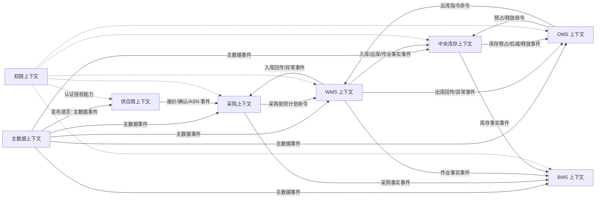

# 50 上下文映射与领域事件目录

> 本文按照 DDD 上下文映射方法，统一梳理供应链系统各限界上下文之间的关系、命令调用、领域事件、发布语言和幂等规则。后续接口设计、消息设计和数据库事件表应以本文为基准继续细化。

## 1. 设计原则

跨上下文协作分两类：

| 类型 | 含义 | 使用场景 |
| --- | --- | --- |
| 命令 | 下游明确请求上游执行一个动作，可能成功或失败 | OMS 请求库存预占、OMS 下发 WMS 出库指令 |
| 领域事件 | 上游发布已经发生的业务事实，下游自行响应 | WMS 发布出库单已发货，库存扣减，OMS 更新履约 |

核心原则：

1. 命令使用动词，表达“请做什么”。
2. 事件使用过去式，表达“已经发生什么”。
3. 一个上下文只修改自己拥有的数据。
4. 跨上下文数据只通过发布语言传递，不共享内部表。
5. 消费事件必须幂等。
6. 关键业务事件必须可追溯到来源单据、聚合 ID 和操作人。
7. 失败要有重试、补偿、人工介入和事件日志。

## 2. 上下文映射总图



## 3. 上下文映射表

| 上游上下文 | 下游上下文 | 关系模式 | 协作方式 | 数据主权 |
| --- | --- | --- | --- | --- |
| 主数据 | 所有业务上下文 | 客户/供应方、发布语言 | 主数据启用、变更、停用事件 | 主数据拥有基础资料主权 |
| 供应商 | 采购 | 伙伴关系、客户/供应方 | 报价、订单确认、ASN、评分结果 | 供应商上下文拥有供应商协同事实 |
| 采购 | WMS | 客户/供应方 | 采购到货计划/入库通知命令 | 采购拥有采购订单，WMS 拥有入库作业 |
| WMS | 采购 | 发布语言 | 收货、质检、上架、差异事件 | WMS 拥有仓内作业事实 |
| OMS | 中央库存 | 客户/供应方、开放主机服务 | 预占、释放、查询命令 | 库存拥有库存账户和预占 |
| 中央库存 | OMS | 发布语言 | 预占成功/失败、释放、扣减事件 | 库存拥有库存事实 |
| OMS | WMS | 客户/供应方、防腐层 | 出库指令命令 | OMS 拥有履约意图，WMS 拥有出库作业 |
| WMS | OMS | 发布语言 | 接单、拣货、发货、异常事件 | WMS 拥有仓内执行事实 |
| WMS | 中央库存 | 发布语言 | 上架、发货、盘点、调整、冻结事件 | WMS 拥有实物事实，库存拥有账务库存 |
| WMS/库存/OMS | BMS | 发布语言 | 作业、库存、履约事件 | BMS 拥有费用和对账事实 |
| 权限 | 所有上下文 | 遵奉者 | Token 校验、权限点、操作日志 | 权限拥有身份和授权主权 |

## 4. 命令目录

命令是“请求某上下文做动作”，需要同步返回成功/失败或接受结果。

| 命令 | 发起方 | 处理方 | 聚合 | 幂等键 | 返回 |
| --- | --- | --- | --- | --- | --- |
| ReserveInventory | OMS | 中央库存 | InventoryReservation、InventoryAccount | source_context + fulfillment_order_no + version | 预占成功/失败/部分成功 |
| ReleaseInventoryReservation | OMS | 中央库存 | InventoryReservation | reservation_no + cancel_event_id | 释放结果 |
| DeductInventoryByShipment | WMS/集成 | 中央库存 | InventoryReservation、InventoryAccount | outbound_order_no + shipment_no | 扣减结果 |
| CreateInboundOrder | 采购/OMS/调拨 | WMS | InboundOrder | source_order_no + source_type + version | WMS 入库单号 |
| CreateOutboundOrder | OMS/调拨/退供 | WMS | OutboundOrder | source_order_no + source_type + version | WMS 出库单号 |
| CancelOutboundOrder | OMS/调拨/退供 | WMS | OutboundOrder | source_order_no + cancel_version | 取消/拦截结果 |
| GenerateFeeDetail | BMS 定时/事件消费者 | BMS | FeeDetail | source_event_id + fee_item_code | 费用明细 |
| ValidateToken | 各系统 | 权限 | Token | token_id | 用户身份和权限 |

## 5. 领域事件目录

### 5.1 主数据事件

| 事件 | 英文代码 | 来源聚合 | 消费方 | 业务含义 |
| --- | --- | --- | --- | --- |
| SKU已启用 | SkuEnabled | SKU | 采购、OMS、库存、WMS、BMS | SKU 可以被业务引用 |
| SKU已变更 | SkuChanged | SKU | 采购、OMS、库存、WMS、BMS | SKU 非关键资料变更，子系统更新缓存 |
| SKU已停用 | SkuDisabled | SKU | 采购、OMS、库存、WMS | 禁止新增业务引用 |
| 供应商已启用 | SupplierEnabled | SupplierProfile | 采购、供应商 | 可创建采购业务 |
| 供应商已冻结 | SupplierFrozen | SupplierProfile | 采购 | 限制新增采购 |
| 仓库已启用 | WarehouseEnabled | WarehouseLocation | OMS、库存、WMS、BMS | 可作为库存和履约仓 |
| 库位已冻结 | LocationFrozen | WarehouseLocation | WMS、库存 | 限制作业和库存可用 |
| 物流商已启用 | CarrierEnabled | Carrier | OMS、WMS、BMS | 可选择物流服务 |

### 5.2 采购与供应商事件

| 事件 | 英文代码 | 来源聚合 | 消费方 | 业务含义 |
| --- | --- | --- | --- | --- |
| 采购订单已提交 | PurchaseOrderSubmitted | PurchaseOrder | 审批/权限 | 进入审核 |
| 采购订单已审核 | PurchaseOrderApproved | PurchaseOrder | 供应商、WMS、BMS | 采购订单可执行 |
| 采购订单已取消 | PurchaseOrderCanceled | PurchaseOrder | 供应商、WMS、BMS | 采购执行终止或部分终止 |
| 供应商已确认采购订单 | PurchaseOrderConfirmedBySupplier | SupplierProfile/协同单 | 采购、WMS | 供应商确认数量和交期 |
| ASN已创建 | AsnCreated | ASN | WMS、采购 | 供应商预约送货 |
| 退供应商单已审核 | SupplierReturnApproved | SupplierReturnOrder | WMS、库存、BMS | 可以执行退供出库 |

### 5.3 OMS 事件

| 事件 | 英文代码 | 来源聚合 | 消费方 | 业务含义 |
| --- | --- | --- | --- | --- |
| 销售订单已接入 | SalesOrderImported | SalesOrder | OMS 内部、风控/审单 | 渠道订单接入成功 |
| 销售订单已审核 | SalesOrderApproved | SalesOrder | 库存 | 可以进行履约预占 |
| 履约单已分仓 | FulfillmentWarehouseAllocated | FulfillmentOrder | 库存、WMS | 已确定履约仓 |
| 出库指令已下发 | OutboundInstructionIssued | FulfillmentOrder | WMS | WMS 可以创建出库作业 |
| 履约单已取消 | FulfillmentOrderCanceled | FulfillmentOrder | 库存、WMS、BMS | 需要释放/拦截/补偿 |
| 售后单已审核 | AfterSaleApproved | AfterSaleOrder | WMS、库存、BMS | 可以执行退货或退款 |

### 5.4 中央库存事件

| 事件 | 英文代码 | 来源聚合 | 消费方 | 业务含义 |
| --- | --- | --- | --- | --- |
| 库存已预占 | InventoryReserved | InventoryReservation | OMS | 履约库存已锁定 |
| 库存预占失败 | InventoryReservationFailed | InventoryReservation | OMS | 履约不能继续或需改仓 |
| 库存预占已释放 | InventoryReservationReleased | InventoryReservation | OMS、BMS | 订单取消或超时释放 |
| 库存已扣减 | InventoryDeducted | InventoryAccount | OMS、BMS | 发货后库存入账扣减 |
| 库存已增加 | InventoryIncreased | InventoryAccount | 采购、OMS、BMS | 入库或退货良品入账 |
| 库存已冻结 | InventoryFrozen | InventoryAccount | OMS、WMS、BMS | 库存不可用 |
| 库存已调整 | InventoryAdjusted | InventoryAdjustment | WMS、BMS、BI | 盘点或人工调整完成 |

### 5.5 WMS 事件

| 事件 | 英文代码 | 来源聚合 | 消费方 | 业务含义 |
| --- | --- | --- | --- | --- |
| 入库单已创建 | InboundOrderCreated | InboundOrder | 采购/OMS | WMS 已接收入库作业 |
| 入库单已收货 | InboundOrderReceived | InboundOrder | 采购、供应商 | 到货清点完成 |
| 入库单已质检 | InboundOrderInspected | InboundOrder | 采购、OMS | 质量结果已产生 |
| 入库单已上架 | InboundOrderPutawayCompleted | InboundOrder | 中央库存、采购、BMS | 合格商品进入库位 |
| 出库单已创建 | OutboundOrderCreated | OutboundOrder | OMS | WMS 已接单 |
| 拣货任务已完成 | PickTaskCompleted | PickTask | OMS、WMS 看板 | 拣货完成 |
| 拣货任务短拣 | PickTaskShortPicked | PickTask | OMS、库存 | 需要异常处理或改配 |
| 出库单已复核 | OutboundOrderReviewed | OutboundOrder | OMS | 出库复核完成 |
| 出库单已发货 | OutboundOrderShipped | OutboundOrder | OMS、中央库存、BMS、TMS | 实物已交接出库 |
| 出库单已取消 | OutboundOrderCanceled | OutboundOrder | OMS、库存 | 仓内出库取消 |
| 盘点差异已确认 | StocktakeDifferenceConfirmed | LocationInventory | 中央库存、BMS | 库存调整事实 |

### 5.6 BMS 事件

| 事件 | 英文代码 | 来源聚合 | 消费方 | 业务含义 |
| --- | --- | --- | --- | --- |
| 费用明细已生成 | FeeDetailGenerated | FeeDetail | BMS、财务 | 业务事实已计费 |
| 费用明细已红冲 | FeeDetailReversed | FeeDetail | BMS、财务 | 原费用作废或冲销 |
| 对账单已生成 | ReconciliationStatementGenerated | ReconciliationStatement | 客户/供应商/财务 | 进入对账 |
| 对账单已确认 | ReconciliationStatementConfirmed | ReconciliationStatement | 财务 | 可生成账单或收付款 |
| 账单已生成 | BillGenerated | Bill | 财务 | 财务处理依据 |

## 6. 事件标准载荷

所有领域事件建议包含以下基础结构：

```json
{
  "event_id": "EVT202606290001",
  "event_type": "OutboundOrderShipped",
  "event_version": "1.0",
  "occurred_at": "2026-06-29T10:00:00+08:00",
  "source_context": "WMS",
  "aggregate_type": "OutboundOrder",
  "aggregate_id": "OB123",
  "business_key": "OB202606290001",
  "idempotency_key": "WMS:OB202606290001:SHIP:1",
  "trace_id": "trace-xxx",
  "operator_id": "U001",
  "payload": {}
}
```

事件载荷设计原则：

| 原则 | 说明 |
| --- | --- |
| 只放必要信息 | 不把整张业务表塞进事件 |
| 带业务快照 | 下游对账和审计需要的关键名称、编码、数量、金额要保留 |
| 带版本 | 事件结构升级时通过版本兼容 |
| 带来源 | 来源系统、来源单号、来源动作必须明确 |
| 带幂等 | 消费方必须能识别重复事件 |

## 7. 幂等键规则

| 场景 | 幂等键建议 |
| --- | --- |
| 渠道订单接入 | channel_id + external_order_no |
| 库存预占 | OMS + fulfillment_order_no + reserve_version |
| 库存释放 | reservation_no + release_reason + source_event_id |
| WMS 出库接单 | OMS + outbound_instruction_no + version |
| WMS 发货回传 | WMS + outbound_order_no + shipment_no |
| 采购入库上架 | WMS + inbound_order_no + putaway_batch_no |
| 售后退货入库 | WMS + after_sale_no + inspection_batch_no |
| 费用生成 | source_event_id + fee_item_code + billing_period |
| 对账单生成 | partner_id + business_type + billing_period |

## 8. 失败和补偿策略

| 场景 | 风险 | 处理策略 |
| --- | --- | --- |
| OMS 预占库存失败 | 订单无法履约 | 改仓、拆单、缺货等待、取消、人工处理 |
| OMS 下发 WMS 失败 | 已预占但未作业 | 重试；超时释放预占；记录异常 |
| WMS 已发货但库存扣减失败 | 实物和库存账不一致 | 库存事件重试；人工补账；禁止重复扣减 |
| WMS 短拣 | 预占数量大于可发数量 | OMS 重新履约或释放差额；库存调整 |
| 入库上架事件重复 | 库存重复增加 | 库存按幂等键忽略重复 |
| BMS 重复计费 | 费用重复 | 来源事件 + 计费项唯一约束 |
| 主数据变更下游失败 | 缓存不一致 | 事件重放、版本校验、定时对账 |

## DDD 对齐说明

本文属于上下文映射和集成契约层。接口表示命令，事件表示事实；接口和事件都必须明确来源上下文、目标上下文、聚合、幂等键、版本和失败补偿。任何跨系统协作都不得绕过所属上下文的数据主权。

## 9. 后续接口文档建议

| 编号 | 文档 | 目标 |
| --- | --- | --- |
| 51 | OMS-WMS 出库集成设计 | 细化出库指令、WMS 出库单、拣货/发货回传 |
| 52 | 库存履约异常与补偿设计 | 细化预占失败、释放失败、扣减失败、短拣补偿 |
| 53 | 主数据事件版本与字段快照设计 | 细化主数据发布语言 |
| 54 | BMS 计费事件与对账设计 | 细化计费基准事件和红冲调整 |

## 10. 继续上下文

当前结论：供应链跨系统协作应采用“命令触发动作 + 事件传播事实”的组合方式。库存、WMS、OMS、BMS 等关键上下文必须统一事件命名、事件载荷、幂等键和失败补偿。

关键假设：第一版不强制引入完整事件源，但每个关键业务事实都应记录事件日志和处理状态，库存仍采用“事件 + 流水 + 余额”模型。

待决问题：是否引入独立集成平台或消息中心，取决于系统间调用规模和外部对接复杂度。

下一步：建议细化 `51-OMS-WMS 出库集成设计`，因为它是当前 OMS、WMS、库存三者最关键的边界点。
