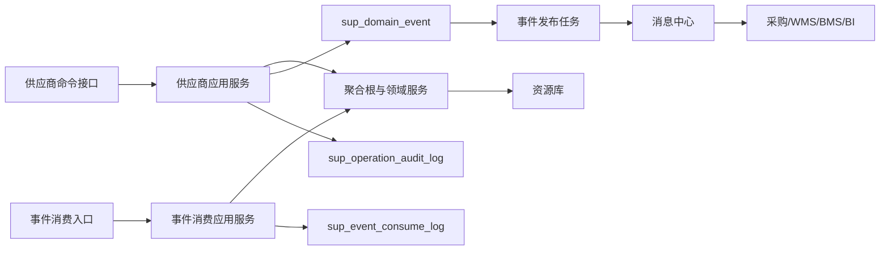
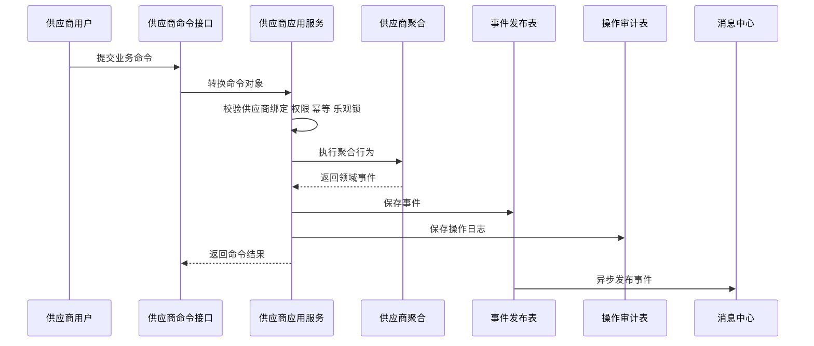
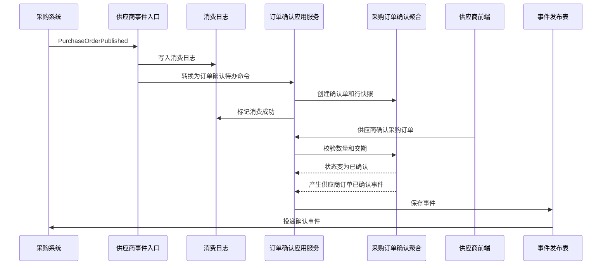
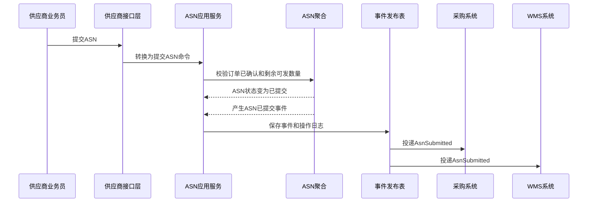
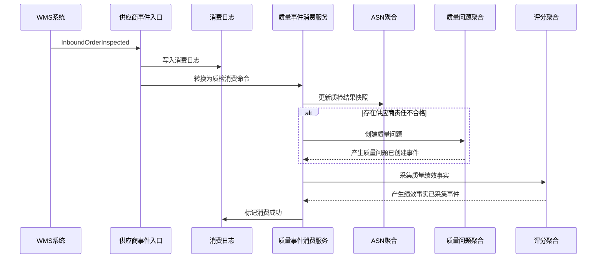
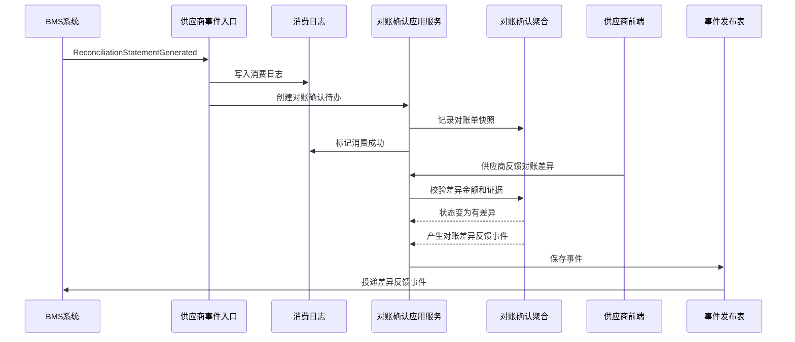
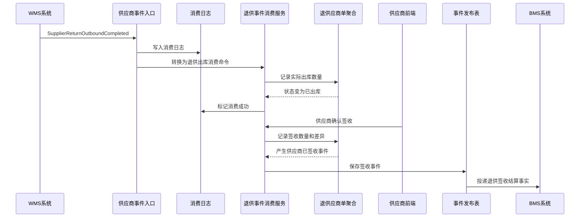

# 01-供应商系统事件生产与消费设计

> 本文根据 [供应商领域模型](../03-核心业务模型/01-供应商领域模型/01-供应商领域模型.md)、[01-供应商系统产品功能设计](../04-子系统功能设计/01-供应商系统/01-供应商系统产品功能设计.md)、[01-供应商系统数据库设计](../05-子系统数据库设计/01-供应商系统数据库设计.md)、[01-供应商系统接口设计](../06-子系统接口设计/01-供应商系统接口设计.md) 和 [上下文映射与领域事件目录](../06-子系统接口设计/00-上下文映射与领域事件目录.md) 整理。本文专门说明01-供应商系统在聚合、领域服务、应用服务执行命令后如何生产事件，消费外部事件后如何改变本地数据，事件包含哪些字段属性，以及事件如何落表、发布、重试和审计。

## 1. 设计范围

| 类型 | 范围 |
| --- | --- |
| 事件生产 | 供应商、供应商商品、供应商报价、供应商合同、采购订单确认、ASN、质量问题、供应商评分、供应商对账确认、退供应商单等聚合执行命令后产生领域事件 |
| 事件消费 | 消费主数据、采购、WMS、BMS、库存、OMS/质量/物流等上下文发布的事件 |
| 事件存储 | 本地领域事件发布表 `sup_domain_event`、事件消费幂等日志 `sup_event_consume_log`、操作审计表 `sup_operation_audit_log` |
| 不包含 | 采购订单审批、WMS 仓内作业、中央库存余额、BMS 计费引擎、财务付款凭证 |

## 2. DDD 对齐说明

| 领域驱动设计项 | 对齐口径 |
| --- | --- |
| 限界上下文 | 供应商上下文 |
| 数据主权 | 01-供应商系统拥有供应商协同事实、供货关系协同、供应商报价、订单确认、ASN、质量整改、供应商评分、对账确认、退供协同状态 |
| 外部事实主权 | 供应商基础主档可由主数据拥有；采购订单由采购拥有；仓内作业由 WMS 拥有；对账账单由 BMS 拥有 |
| 事件生产位置 | 聚合根在领域行为成功后产生事件；应用服务保存聚合、事件发布表和操作日志 |
| 事件消费位置 | 事件入口属于接口层；事件消费应用服务属于应用层；聚合和领域服务负责状态推进与不变量保护 |
| 一致性 | 供应商聚合内部强一致；供应商与采购、WMS、BMS、库存通过事件最终一致 |
| 核心原则 | 01-供应商系统不直接修改采购订单、库存余额或财务账，只通过事件表达协同事实 |

## 3. 事件处理架构



处理规则：

1. 供应商门户或内部后台提交写操作，接口层转换为命令对象。
2. 应用服务校验供应商绑定关系、菜单/按钮权限、数据权限、幂等键和乐观锁。
3. 聚合根执行业务行为，必要时调用领域服务做跨实体或跨事实规则判断。
4. 聚合根修改状态、明细、快照、版本，并返回领域事件。
5. 应用服务在同一事务中保存业务表、`sup_domain_event` 和 `sup_operation_audit_log`。
6. 事件发布任务异步扫描 `sup_domain_event`，投递成功后更新发布状态。
7. 外部事件进入 `/internal/supplier/v1/events` 后先写 `sup_event_consume_log`，再由消费应用服务处理。

## 4. 事件标准载荷

### 4.1 通用事件信封

```json
{
  "eventId": "EVT-SUP-202607040001",
  "eventType": "PurchaseOrderConfirmedBySupplier",
  "eventName": "供应商订单已确认",
  "eventVersion": "1.0",
  "sourceContext": "SUPPLIER",
  "sourceSystem": "SUPPLIER",
  "aggregateType": "PurchaseOrderConfirm",
  "aggregateId": "190001",
  "aggregateNo": "POC202607040001",
  "aggregateVersion": 4,
  "businessKey": "PO202607040001",
  "idempotencyKey": "SUPPLIER:PO202607040001:CONFIRM:4",
  "occurredAt": "2026-07-04T10:00:00+08:00",
  "operatorId": "SUPUSER001",
  "supplierId": "S10001",
  "traceId": "TRACE202607040001",
  "payload": {}
}
```

### 4.2 通用字段属性

| 字段 | 类型 | 必填 | 说明 |
| --- | --- | --- | --- |
| `eventId` | string | 是 | 全局唯一事件 ID，写入 `sup_domain_event.event_code` |
| `eventType` | string | 是 | 稳定事件类型，如 `AsnSubmitted` |
| `eventName` | string | 是 | 中文事件名 |
| `eventVersion` | string | 是 | 事件结构版本 |
| `sourceContext` | string | 是 | 来源限界上下文 |
| `sourceSystem` | string | 是 | 来源系统 |
| `aggregateType` | string | 是 | 聚合类型 |
| `aggregateId` | string | 是 | 聚合技术 ID |
| `aggregateNo` | string | 否 | 业务单号 |
| `aggregateVersion` | int | 是 | 聚合版本 |
| `businessKey` | string | 是 | 跨系统追踪主键，如 PO 单号、ASN 单号、对账单号 |
| `idempotencyKey` | string | 是 | 消费幂等键 |
| `occurredAt` | datetime | 是 | 业务事实发生时间 |
| `operatorId` | string | 否 | 操作人；系统事件传系统账号 |
| `supplierId` | string | 供应商协同事件必填 | 供应商主体 ID |
| `traceId` | string | 否 | 链路追踪 ID |
| `payload` | object | 是 | 业务载荷 |

### 4.3 业务载荷设计原则

| 原则 | 说明 |
| --- | --- |
| 保留协同快照 | 订单确认、ASN、对账、退供事件必须包含供应商、采购单、SKU、数量、金额、差异原因等快照 |
| 不泄露内部表结构 | 事件载荷不直接等同数据库表字段，避免下游依赖01-供应商系统内部实现 |
| 保留供应商主体 | 所有门户协同事件必须携带 `supplierId`、`supplierCode`，便于采购、BMS、WMS 做权限和对账 |
| 数量金额有单位 | 数量包含 `uom`，金额包含 `currency`、税率或含税/未税口径 |
| 支持版本演进 | 事件字段变更必须保留旧字段兼容或升级 `eventVersion` |

## 5. 事件存储设计

### 5.1 领域事件发布表 `sup_domain_event`

`sup_domain_event` 是01-供应商系统的 Outbox 表。聚合命令成功后，应用服务在业务事务内写入。

| 字段 | 作用 | 写入规则 |
| --- | --- | --- |
| `event_id` | 技术主键 | 雪花 ID 或数据库 ID |
| `event_code` | 全局事件编码 | 对应 `eventId`，唯一 |
| `event_name` | 中文事件名 | 如 `供应商订单已确认` |
| `event_type` | 稳定事件类型 | 如 `PurchaseOrderConfirmedBySupplier` |
| `aggregate_type` | 聚合类型 | 如 `ASN`、`SupplierScore` |
| `aggregate_id` | 聚合 ID | 写聚合根 ID |
| `aggregate_no` | 业务单号 | 写供应商编码、报价单号、ASN 单号、对账确认单号等 |
| `source_system` | 来源系统 | 本系统生产固定为 `SUPPLIER` |
| `payload_json` | 事件完整载荷 | 保存事件信封和业务 `payload` |
| `event_status` | 发布状态 | `1` 待发布、`2` 发布中、`3` 已发布、`4` 发布失败、`5` 已取消 |
| `retry_count` | 重试次数 | 发布失败递增 |
| `fail_reason` | 失败原因 | 记录消息投递异常 |
| `occurred_at` | 业务发生时间 | 聚合行为发生时间 |
| `published_at` | 发布时间 | 发布成功后写入 |

### 5.2 事件消费日志 `sup_event_consume_log`

`sup_event_consume_log` 是01-供应商系统消费外部事件的 Inbox/幂等表。唯一键为 `source_system + event_code + consumer_name`。

| 字段 | 作用 | 写入规则 |
| --- | --- | --- |
| `consume_log_id` | 消费日志主键 | 雪花 ID 或数据库 ID |
| `event_code` | 外部事件编码 | 来自外部 `eventId` |
| `source_system` | 来源系统 | `MDM`、`PURCHASE`、`WMS`、`BMS`、`INVENTORY` 等 |
| `consumer_name` | 消费者名称 | 如 `SupplierPurchaseOrderEventConsumer` |
| `idempotent_key` | 业务幂等键 | 如 `PURCHASE:{eventId}:{purchaseOrderId}` |
| `consume_status` | 消费状态 | `1` 待消费、`2` 处理中、`3` 成功、`4` 失败、`5` 已忽略 |
| `retry_count` | 重试次数 | 消费失败重试时递增 |
| `fail_reason` | 失败原因 | 保存领域规则失败或系统异常 |
| `consumed_at` | 完成时间 | 消费成功或忽略后写入 |

### 5.3 操作审计表 `sup_operation_audit_log`

供应商门户写操作、内部后台写操作、事件消费引起的本地状态变化都要留审计。

| 场景 | 审计内容 |
| --- | --- |
| 供应商用户操作 | 供应商主体、操作人、权限点、请求摘要、前后状态、事件编号 |
| 内部用户操作 | 组织、角色、操作人、供应商范围、审批意见、前后快照 |
| 系统消费事件 | 来源系统、来源事件、消费者、处理前后状态、消费结果 |
| 失败处理 | 失败原因、异常类型、是否可重试、人工待办编号 |

## 6. 01-供应商系统事件生产

### 6.1 生产事件总览

| 聚合/服务 | 命令 | 数据变化 | 生产事件 | 主要消费者 |
| --- | --- | --- | --- | --- |
| 供应商聚合 | 创建潜在供应商 | 新增供应商档案草稿或候选；状态为潜在 | `PotentialSupplierCreated` | 供应商池读模型 |
| 供应商聚合 | 提交供应商准入 | 状态潜在/驳回 -> 待审核；锁定资质、联系人、结算资料版本 | `SupplierAdmissionSubmitted` | 审批待办、主数据 |
| 供应商聚合 | 审核供应商准入 | 通过则状态 -> 启用；驳回则回潜在并记录原因 | `SupplierEnabled`、`SupplierAdmissionRejected` | 主数据、采购、BMS |
| 供应商聚合 | 申请资料变更 | 生成资料变更记录；主档不立即覆盖 | `SupplierProfileChangeSubmitted` | 主数据、采购、财务审核 |
| 供应商聚合 | 审核资料变更 | 审批通过后覆盖允许字段，记录历史版本 | `SupplierProfileChanged` | 主数据、采购、BMS |
| 供应商聚合 | 冻结供应商 | 状态启用 -> 冻结；写冻结范围、原因、恢复条件 | `SupplierFrozen` | 采购、供应商商品、报价、订单确认 |
| 供应商聚合 | 解冻供应商 | 状态冻结 -> 启用 | `SupplierUnfrozen` | 采购、供应商门户 |
| 供应商聚合 | 停用/淘汰供应商 | 状态 -> 停用/淘汰；禁止新增业务 | `SupplierDisabled`、`SupplierEliminated` | 采购、BMS、BI |
| 供应商商品聚合 | 启用供应商商品 | 新增或启用供货关系；记录 MOQ、MPQ、交期、单位 | `SupplierSkuEnabled` | 采购询价、采购订单 |
| 供应商商品聚合 | 变更供货条件 | 更新供货条件版本，不回改历史订单 | `SupplierSkuSupplyConditionChanged` | 采购 |
| 供应商商品聚合 | 暂停/停供 | 供货状态 -> 暂停/停供 | `SupplierSkuSuspended`、`SupplierSkuStopped` | 采购 |
| 供应商报价聚合 | 提交报价 | 报价草稿 -> 已提交；锁定报价行和有效期 | `SupplierQuoteSubmitted` | 采购、比价 |
| 供应商报价聚合 | 确认/采纳报价 | 状态 -> 已确认/已采纳；生成价格协议引用 | `SupplierQuoteConfirmed`、`SupplierQuoteAdopted` | 采购、BMS |
| 供应商合同聚合 | 合同生效 | 合同审批中 -> 已生效；记录条款和有效期 | `SupplierContractEffective` | 采购、报价、BMS |
| 采购订单确认聚合 | 确认采购订单 | 待确认 -> 已确认；写确认数量和承诺交期 | `PurchaseOrderConfirmedBySupplier` | 采购、WMS、ASN |
| 采购订单确认聚合 | 拒绝采购订单 | 待确认 -> 已拒绝；写拒绝原因 | `PurchaseOrderRejectedBySupplier` | 采购 |
| 采购订单确认聚合 | 反馈订单差异 | 待确认 -> 差异待处理；写数量/价格/交期差异 | `PurchaseOrderDiffFeedbackBySupplier` | 采购 |
| ASN 聚合 | 提交 ASN | ASN 草稿 -> 已提交；锁定通知数量、ETA、包装物流信息 | `AsnSubmitted` | 采购、WMS |
| ASN 聚合 | 确认发货 | ASN -> 已发货；记录承运商、运单、发货时间 | `AsnShipped` | 采购、WMS、BMS |
| 质量问题聚合 | 发起整改 | 质量问题 -> 整改中；生成供应商整改待办 | `SupplierRectificationStarted` | 供应商门户、评分 |
| 质量问题聚合 | 提交整改 | 整改中 -> 待验证；记录整改方案 | `SupplierRectificationSubmitted` | 质量人员、评分 |
| 质量问题聚合 | 验证整改 | 待验证 -> 已关闭/整改中 | `SupplierRectificationPassed`、`SupplierRectificationRejected` | 评分、风险控制 |
| 供应商评分聚合 | 采集绩效事实 | 写入绩效事实清单，按质量、价格、交付、协同分类 | `SupplierPerformanceFactCollected` | 评分读模型 |
| 供应商评分聚合 | 发布评分 | 评分状态 -> 已发布；输出维度分、总分、等级、风险建议 | `SupplierScorePublished` | 采购、供应商聚合、供应商门户 |
| 对账确认聚合 | 确认对账 | 待确认 -> 已确认；写确认人、金额、时间 | `SupplierReconciliationConfirmed` | BMS、评分 |
| 对账确认聚合 | 反馈对账差异 | 待确认 -> 有差异；记录差异金额、原因和证据 | `SupplierReconciliationDiffFeedback` | BMS、采购结算 |
| 对账确认聚合 | 上传发票资料 | 写发票号、金额、附件；状态进入待校验 | `SupplierInvoiceSubmitted` | BMS |
| 退供应商单聚合 | 供应商确认退货 | 待供应商确认 -> 待出库或差异待处理 | `SupplierReturnConfirmedBySupplier`、`SupplierReturnDiffFeedback` | 采购、WMS |
| 退供应商单聚合 | 供应商签收 | 已出库 -> 已签收；记录签收数量和差异 | `SupplierReturnSignedBySupplier` | 采购、BMS、评分 |

### 6.2 供应商订单确认事件

| 项 | 设计 |
| --- | --- |
| 触发命令 | 确认采购订单、拒绝采购订单、反馈订单差异 |
| 发起角色 | 供应商业务员 |
| 应用服务 | 采购订单确认应用服务 |
| 聚合/领域服务 | 采购订单确认聚合、订单确认差异判定服务 |
| 事件类型 | `PurchaseOrderConfirmedBySupplier`、`PurchaseOrderRejectedBySupplier`、`PurchaseOrderDiffFeedbackBySupplier` |
| 存储表 | `sup_domain_event` |

数据变化：

| 表/模型 | 字段变化 |
| --- | --- |
| 采购订单确认表 | `confirm_status: 待确认 -> 已确认/差异待处理/已拒绝` |
| 确认行 | 写确认数量、承诺交期、差异类型、差异原因 |
| 供应商待办 | 关闭确认待办；差异场景生成后续处理待办 |
| `sup_operation_audit_log` | 记录操作人、供应商、前后状态和事件编号 |
| `sup_domain_event` | 写待发布事件，`event_status=1` |

事件载荷：

| 字段 | 说明 |
| --- | --- |
| `purchaseOrderId`、`purchaseOrderNo` | 来源采购订单 |
| `confirmNo` | 供应商确认单号 |
| `supplierId`、`supplierCode` | 供应商主体 |
| `confirmResult` | `CONFIRMED`、`DIFFERENCE`、`REJECTED` |
| `confirmedAt` | 供应商确认时间 |
| `confirmedLines[]` | PO 行、SKU、订单数量、确认数量、承诺交期 |
| `diffLines[]` | 差异行，包含差异类型、差异数量、建议交期、差异原因 |
| `remark` | 供应商备注 |

### 6.3 ASN 提交和发货事件

| 项 | 设计 |
| --- | --- |
| 触发命令 | 提交 ASN、取消 ASN、确认发货 |
| 发起角色 | 供应商业务员 |
| 应用服务 | ASN 应用服务 |
| 聚合/领域服务 | ASN 聚合、ASN 可发货数量校验服务 |
| 事件类型 | `AsnSubmitted`、`AsnCanceled`、`AsnShipped` |
| 存储表 | `sup_domain_event` |

数据变化：

| 表/模型 | 字段变化 |
| --- | --- |
| ASN 表 | `asn_status: 草稿 -> 已提交/已发货/已取消` |
| ASN 行 | 锁定通知数量、包装、批次、预计到仓时间 |
| 可发货快照 | 扣减供应商侧剩余可发数量，不修改采购订单主权数据 |
| `sup_domain_event` | 写 ASN 事件 |

事件载荷：

| 字段 | 说明 |
| --- | --- |
| `asnId`、`asnNo` | ASN 标识 |
| `purchaseOrderNo` | 来源 PO 单号 |
| `supplierId`、`warehouseId` | 供应商和目的仓 |
| `eta` | 预计到仓时间 |
| `carrierName`、`trackingNo` | 承运商和运单 |
| `lines[]` | PO 行、SKU、通知数量、单位、批次、包装信息 |

### 6.4 供应商评分事件

| 项 | 设计 |
| --- | --- |
| 触发命令 | 采集绩效事实、计算周期评分、人工修正评分、发布评分、生成冻结建议 |
| 发起角色 | 系统任务、采购经理、评分事件消费者 |
| 应用服务 | 供应商评分应用服务 |
| 聚合/领域服务 | 供应商评分聚合、供应商评分计算服务、供应商风险控制服务 |
| 事件类型 | `SupplierPerformanceFactCollected`、`SupplierScoreCalculated`、`SupplierScorePublished`、`SupplierFreezeSuggestionGenerated` |
| 存储表 | `sup_domain_event` |

数据变化：

| 表/模型 | 字段变化 |
| --- | --- |
| 评分表 | 写周期、维度分、总分、等级、状态 |
| 绩效事实 | 追加质量、交付、价格、协同、对账事实 |
| 供应商风险读模型 | 低分时生成预警或冻结建议 |
| `sup_domain_event` | 写评分和风险建议事件 |

事件载荷：

| 字段 | 说明 |
| --- | --- |
| `supplierId` | 评分对象 |
| `period` | 评分周期 |
| `qualityScore`、`priceScore`、`deliveryScore`、`collaborationScore` | 维度分 |
| `totalScore`、`scoreLevel` | 总分和等级 |
| `ruleVersion` | 评分规则版本 |
| `riskSuggestion` | 整改、冻结、淘汰建议 |
| `factSummary` | 事实摘要，包含质量问题数、准时率、对账差异率等 |

## 7. 01-供应商系统事件消费

### 7.1 消费事件总览

| 消费事件 | 来源系统 | 消费应用服务 | 影响聚合/读模型 | 数据变化 | 幂等键 |
| --- | --- | --- | --- | --- | --- |
| `SupplierEnabled` | 主数据 | 供应商事件消费服务 | 供应商档案快照 | 更新供应商可协同状态，允许绑定账号和创建协同记录 | `MDM:{eventId}:{supplierId}` |
| `SupplierFrozen` | 主数据/评分 | 供应商状态消费服务 | 供应商、供应商商品、报价、订单确认 | 暂停报价、订单确认、ASN 新增，生成风险提示 | `MDM:{eventId}:{supplierId}` |
| `SupplierDisabled` | 主数据 | 供应商状态消费服务 | 供应商档案快照 | 禁止新增业务协同，保留历史查询 | `MDM:{eventId}:{supplierId}` |
| `SkuEnabled` | 主数据 | SKU 事件消费服务 | 供应商商品、报价 | 允许创建供应商商品或报价 | `MDM:{eventId}:{skuId}` |
| `SkuDisabled` | 主数据 | SKU 事件消费服务 | 供应商商品 | 相关供应商商品自动暂停或生成停供待办 | `MDM:{eventId}:{skuId}` |
| `RfqPublished` | 采购 | 询价事件消费服务 | 供应商报价 | 创建供应商报价待办或草稿 | `PURCHASE:{eventId}:{rfqId}:{supplierId}` |
| `RfqBiddingClosed` | 采购 | 询价事件消费服务 | 供应商报价 | 未提交报价自动作废或禁止提交 | `PURCHASE:{eventId}:{rfqId}` |
| `PurchaseOrderPublished` | 采购 | 采购订单事件消费服务 | 采购订单确认 | 创建采购订单确认待办和行快照 | `PURCHASE:{eventId}:{purchaseOrderId}` |
| `PurchaseOrderChangeEffective` | 采购 | 采购订单事件消费服务 | 采购订单确认、ASN | 更新订单行快照，已确认订单要求重新确认 | `PURCHASE:{eventId}:{purchaseOrderId}:{version}` |
| `PurchaseOrderCanceled` | 采购 | 采购订单事件消费服务 | 采购订单确认、ASN | 关闭确认记录，禁止 ASN 新增 | `PURCHASE:{eventId}:{purchaseOrderId}` |
| `InboundOrderReceived` | WMS | ASN 事件消费服务 | ASN、评分 | 更新 ASN 实收数量和收货状态，沉淀交付事实 | `WMS:{eventId}:{receiptId}` |
| `InboundOrderInspected` | WMS | 质量事件消费服务 | ASN、质量问题、评分 | 更新质检结果快照，必要时创建质量问题 | `WMS:{eventId}:{qcId}` |
| `InboundOrderPutawayCompleted` | WMS | ASN 事件消费服务 | ASN、评分 | 更新 ASN 上架完成状态和交付绩效事实 | `WMS:{eventId}:{putawayBatchNo}` |
| `ReconciliationStatementGenerated` | BMS | 对账事件消费服务 | 供应商对账确认 | 创建供应商对账确认待办 | `BMS:{eventId}:{reconciliationNo}` |
| `ReconciliationStatementAdjusted` | BMS | 对账事件消费服务 | 供应商对账确认 | 更新对账单快照，已确认时要求重新确认 | `BMS:{eventId}:{reconciliationNo}:{version}` |
| `InvoiceVerified` | BMS | 发票事件消费服务 | 对账确认 | 更新发票校验状态，失败时进入待补充 | `BMS:{eventId}:{invoiceId}` |
| `PayableCompleted` | BMS | 应付事件消费服务 | 对账确认、评分 | 关闭对账确认，标记结算完成，沉淀协同事实 | `BMS:{eventId}:{payableId}` |
| `ReturnInventoryLocked` | 中央库存 | 退供事件消费服务 | 退供应商单 | 记录库存锁定结果，进入待供应商确认 | `INVENTORY:{eventId}:{lockId}` |
| `SupplierReturnOutboundCompleted` | WMS | 退供事件消费服务 | 退供应商单 | 记录实际出库数量和批次，进入已出库 | `WMS:{eventId}:{outboundId}` |

### 7.2 采购订单发布事件消费

| 项 | 设计 |
| --- | --- |
| 订阅事件 | `PurchaseOrderPublished` |
| 来源系统 | 采购系统 |
| 消费应用服务 | 采购订单事件消费服务 |
| 影响聚合 | 采购订单确认聚合 |
| 消费日志 | `sup_event_consume_log` |

处理步骤：

1. 事件入口接收事件，生成幂等键 `PURCHASE:{eventId}:{purchaseOrderId}`。
2. 写入 `sup_event_consume_log`，若已成功消费则直接返回幂等命中。
3. 校验供应商存在且未禁用，事件中的 `supplierId` 与01-供应商系统可协同主体一致。
4. 创建采购订单确认聚合，复制 PO 头、行、数量、价格、交期、仓库快照。
5. 生成供应商工作台待确认订单。
6. 必要时写本地事件 `PurchaseOrderConfirmTodoCreated`，供读模型和通知使用。
7. 消费日志更新为成功；失败时记录原因并进入可重试状态。

数据变化：

| 表/模型 | 字段变化 |
| --- | --- |
| `sup_event_consume_log` | `consume_status: 1 -> 2 -> 3/4` |
| 采购订单确认表 | 新增确认单，状态待确认 |
| 确认行表 | 保存采购订单行快照 |
| 工作台待办 | 新增供应商待确认任务 |
| `sup_domain_event` | 可写入确认待办已创建事件 |

外部事件载荷要求：

| 字段 | 说明 |
| --- | --- |
| `purchaseOrderId`、`purchaseOrderNo` | PO 标识 |
| `supplierId` | 供应商主体 |
| `warehouseId` | 目的仓 |
| `currency`、`totalAmount` | 金额快照 |
| `lines[]` | PO 行、SKU、采购数量、单位、价格、税率、要求交期 |

### 7.3 WMS 质检事件消费

| 项 | 设计 |
| --- | --- |
| 订阅事件 | `InboundOrderInspected` |
| 来源系统 | WMS |
| 消费应用服务 | 质量事件消费服务 |
| 影响聚合 | ASN 聚合、供应商质量问题聚合、供应商评分聚合 |
| 消费日志 | `sup_event_consume_log` |

处理规则：

| 场景 | 本地处理 |
| --- | --- |
| 全部合格 | 更新 ASN 质检快照，沉淀质量绩效事实 |
| 部分不合格 | 更新 ASN 质检快照，创建供应商质量问题，沉淀扣分事实 |
| 严重不合格 | 创建质量问题并发起整改或生成冻结建议 |
| 来源无法识别供应商 | 消费失败，进入异常事实池，等待人工绑定 |

事件载荷要求：

| 字段 | 说明 |
| --- | --- |
| `inspectionNo` | 质检单号 |
| `wmsInboundOrderNo` | WMS 入库单号 |
| `asnNo` | ASN 单号 |
| `purchaseOrderNo` | PO 单号 |
| `supplierId` | 供应商 |
| `lines[]` | SKU、送检数量、合格数量、不合格数量、缺陷类型、责任方 |
| `attachments[]` | 图片、检测报告等证据 |

### 7.4 BMS 对账事件消费

| 项 | 设计 |
| --- | --- |
| 订阅事件 | `ReconciliationStatementGenerated`、`ReconciliationStatementAdjusted`、`InvoiceVerified`、`PayableCompleted` |
| 来源系统 | BMS |
| 消费应用服务 | 对账事件消费服务、发票事件消费服务、应付事件消费服务 |
| 影响聚合 | 供应商对账确认聚合、供应商评分聚合 |
| 消费日志 | `sup_event_consume_log` |

处理规则：

| 事件 | 本地处理 | 可能生产事件 |
| --- | --- | --- |
| `ReconciliationStatementGenerated` | 创建供应商对账确认待办，复制金额和费用明细摘要 | `SupplierReconciliationConfirmTodoCreated` |
| `ReconciliationStatementAdjusted` | 更新对账快照；已确认的对账要求重新确认 | `SupplierReconciliationNeedReconfirm` |
| `InvoiceVerified` | 更新发票校验状态，失败时进入待补充 | `SupplierInvoiceNeedSupplement` |
| `PayableCompleted` | 关闭对账确认，沉淀协同绩效事实 | `SupplierReconciliationClosed` |

## 8. 关键时序图

### 8.1 命令产生事件通用流程



### 8.2 采购订单发布到供应商确认



### 8.3 供应商提交 ASN



### 8.4 WMS 质检触发质量问题和评分事实



### 8.5 BMS 对账单到供应商差异反馈



### 8.6 退供出库到供应商签收



## 9. 失败、幂等和补偿

| 场景 | 风险 | 处理方式 |
| --- | --- | --- |
| 供应商用户重复点击确认 | 重复反馈02-采购系统 | 使用 `X-Idempotency-Key`；命中后返回原确认结果，不重复写 `sup_domain_event` |
| 采购订单事件重复投递 | 重复创建确认待办 | `sup_event_consume_log` 唯一键拦截；确认聚合按 `purchaseOrderId + version` 再校验 |
| 外部事件乱序 | 先收到取消再收到发布，或先收到质检再收到收货 | 消费服务检查阶段；可标记待重试或生成异常待办 |
| ASN 数量超过可发货数量 | WMS/采购收到错误通知 | ASN 聚合拒绝提交，返回业务错误，不生产事件 |
| 供应商冻结后仍有存量单据 | 错误阻断收货、退供、对账 | 冻结只阻断新报价、新订单确认、新 ASN；存量退供、对账、整改仍允许处理 |
| Outbox 发布失败 | 采购/WMS/BMS 未收到协同事实 | `event_status=4`，发布任务重试；超过阈值生成异常待办 |
| BMS 对账单版本调整 | 已确认对账与最新账单不一致 | 对账确认聚合进入需重新确认，不直接覆盖已确认历史 |
| WMS 质检无法识别供应商 | 评分事实丢失 | 进入异常事实池，人工绑定 PO/ASN/供应商后重放消费 |

## 10. 事件到表和聚合映射

| 事件方向 | 事件 | 聚合/应用服务 | 主要写表 |
| --- | --- | --- | --- |
| 生产 | `SupplierEnabled` | 供应商聚合 | 供应商档案表、`sup_domain_event` |
| 生产 | `SupplierSkuEnabled` | 供应商商品聚合 | 供应商商品表、`sup_domain_event` |
| 生产 | `SupplierQuoteSubmitted` | 供应商报价聚合 | 供应商报价表、报价行表、`sup_domain_event` |
| 生产 | `SupplierContractEffective` | 供应商合同聚合 | 供应商合同表、合同条款/附件表、`sup_domain_event` |
| 消费后生产 | `PurchaseOrderConfirmedBySupplier` | 采购订单确认聚合 | 订单确认表、确认行表、`sup_event_consume_log`、`sup_domain_event` |
| 生产 | `AsnSubmitted` | ASN 聚合 | ASN 表、ASN 行表、`sup_domain_event` |
| 消费后生产 | `SupplierQualityIssueCreated` | 质量问题聚合 | 质量问题表、整改记录表、`sup_event_consume_log`、`sup_domain_event` |
| 生产 | `SupplierScorePublished` | 供应商评分聚合 | 供应商评分表、评分事实表、`sup_domain_event` |
| 消费后生产 | `SupplierReconciliationDiffFeedback` | 对账确认聚合 | 对账确认表、差异记录表、`sup_event_consume_log`、`sup_domain_event` |
| 消费后生产 | `SupplierReturnSignedBySupplier` | 退供应商单聚合 | 退供应商单表、退供行表、`sup_event_consume_log`、`sup_domain_event` |
| 消费 | `PayableCompleted` | 对账确认消费服务 | 对账确认表、`sup_event_consume_log`、评分事实表 |

事件到表和聚合映射覆盖以下 TMS 协作事件，确保运输事实纳入事件目录：


| 方向 | 事件 | 触发或消费逻辑 | 数据变化 |
| --- | --- | --- | --- |
| 生产 | `AsnSubmitted` | 供应商提交 ASN 和发运信息 | ASN 进入已提交，TMS 可创建或补充采购到货运输任务 |
| 消费 | `WaybillCreated` | TMS 创建采购到货或退供运单 | ASN/退供协同页展示运单、承运商和预计到达 |
| 消费 | `TrackingAppended` | TMS 追加物流轨迹 | 供应商门户物流时间线刷新 |
| 消费 | `TransportSigned` | 退供已由供应商签收或采购到货运输完成 | 退供确认聚合记录签收事实，采购到货仅作为运输完成读模型 |
| 消费 | `TransportRejected` | 供应商拒收退供或运输拒收 | 生成供应商协同待办，要求填写拒收原因和证明 |
| 消费 | `LogisticsExceptionRegistered` / `LogisticsExceptionClosed` | TMS 登记或关闭物流异常 | 质量/协同待办更新，供应商评分可采集物流履约事实 |

## 11. 设计结论

01-供应商系统的事件生产与消费核心是“协同事实可追溯”：供应商确认了什么、发了什么货、提交了什么整改、反馈了什么对账差异、签收了什么退供，都必须变成可追踪的领域事件。

第一版不需要完整事件溯源，但必须保留 `sup_domain_event`、`sup_event_consume_log` 和 `sup_operation_audit_log`。这样既能保证供应商门户操作可靠传递给采购、WMS、BMS，也能把采购订单、WMS 质检、BMS 对账等外部事实安全、幂等地沉淀为供应商协同状态、质量问题和评分事实。
