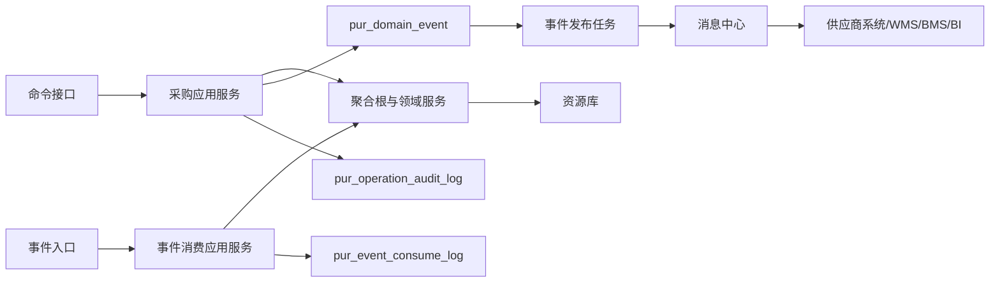
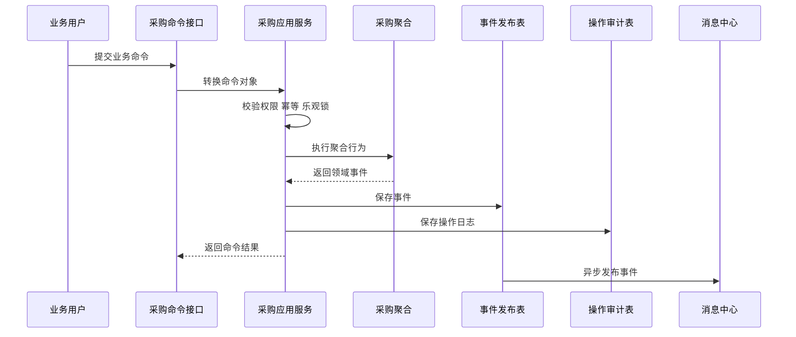
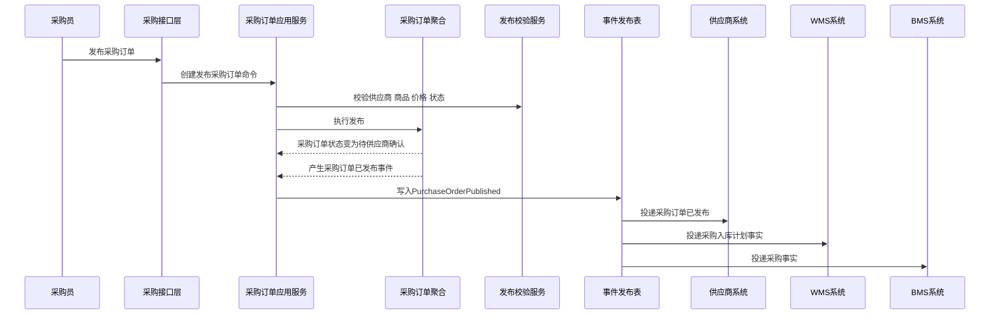
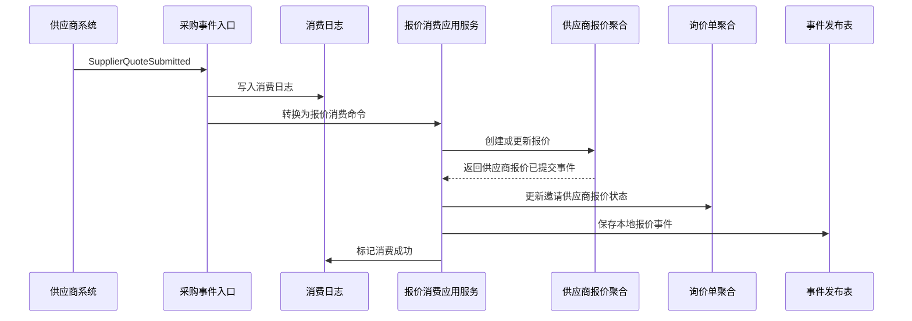
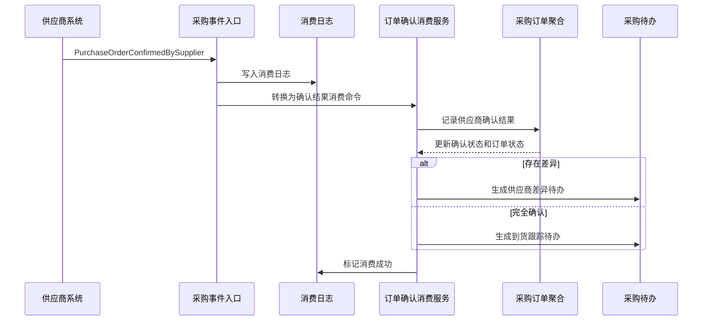
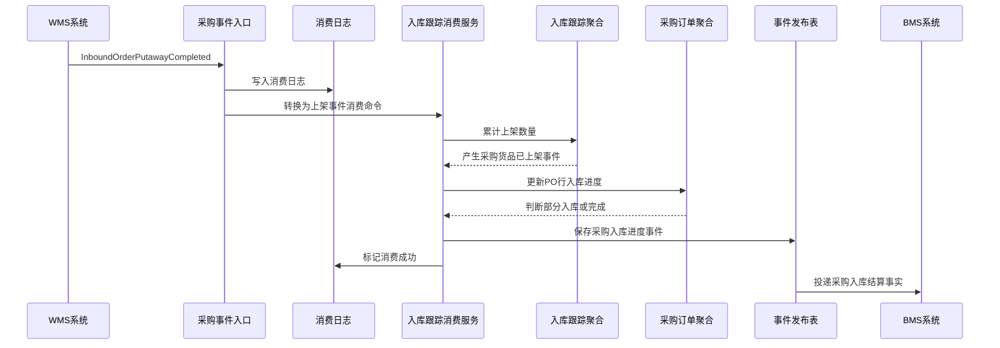
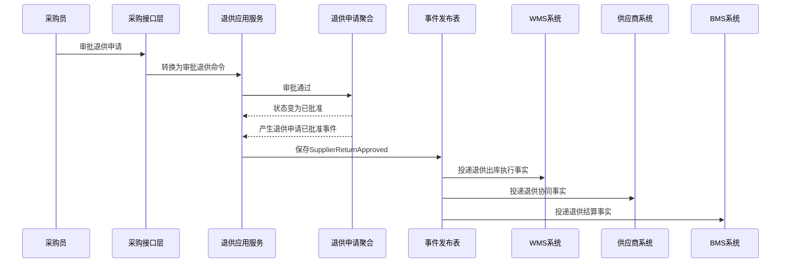

# 01 采购系统事件生产与消费设计

> 本文根据 [采购系统领域模型](../03-核心业务模型/02-采购领域模型/01-采购系统领域模型.md)、[采购系统产品功能设计](../04-子系统功能设计/采购系统/采购系统产品功能设计.md)、[采购系统数据库设计](../05-子系统数据库设计/02-采购系统数据库设计.md)、[采购系统接口设计](../06-子系统接口设计/55-采购系统接口设计.md) 和 [上下文映射与领域事件目录](../06-子系统接口设计/50-上下文映射与领域事件目录.md) 整理。本文专门说明采购系统在执行命令后如何生产事件、消费外部事件时如何修改本地数据、事件载荷包含哪些信息，以及事件如何落表、发布、重试和审计。

## 1. 设计范围

| 类型 | 范围 |
| --- | --- |
| 事件生产 | 采购申请、询价单、供应商报价、比价结果、采购价格、采购订单、采购订单变更、入库跟踪、退供申请等聚合在执行命令后产生领域事件 |
| 事件消费 | 采购系统消费主数据、供应商系统、WMS、中央库存、预算/审批等上下文发布的事件 |
| 事件存储 | 本地领域事件发布表 `pur_domain_event`、事件消费幂等日志 `pur_event_consume_log`、操作审计表 `pur_operation_audit_log` |
| 不包含 | 消息中间件选型、外部系统内部处理逻辑、完整事件溯源、采购读模型物理表设计 |

## 2. DDD 对齐说明

| 领域驱动设计项 | 对齐口径 |
| --- | --- |
| 限界上下文 | 采购上下文 |
| 数据主权 | 采购系统拥有采购申请、询价、报价、比价、价格、采购订单、订单变更、入库跟踪快照、退供申请等采购侧事实 |
| 事件生产位置 | 聚合根在领域行为成功后产生领域事件；应用服务负责持久化聚合、事件发布表和操作日志 |
| 事件消费位置 | 事件入口属于接口层；事件消费应用服务属于应用层；聚合和领域服务负责校验不变量并修改本地状态 |
| 事件可靠性 | 本系统事件使用 Outbox 模式；外部事件先写消费日志，再幂等处理 |
| 一致性 | 聚合内部强一致；采购与供应商、WMS、库存、BMS 通过事件最终一致 |
| 核心原则 | 事件表达已经发生的事实，不能表达“希望别人做什么”；请求别人动作使用命令接口 |

## 3. 事件处理架构



处理规则：

1. 前端或跨系统命令进入命令接口，接口层只做协议校验和命令转换。
2. 应用服务校验权限、幂等、乐观锁和数据范围，加载聚合。
3. 聚合根执行业务行为，修改聚合状态、明细、快照和版本，并返回领域事件。
4. 应用服务在同一事务中保存业务表、`pur_domain_event` 和 `pur_operation_audit_log`。
5. 发布任务异步扫描 `pur_domain_event`，投递成功后更新发布状态。
6. 外部事件进入事件入口后，先写 `pur_event_consume_log`；幂等命中则直接返回原消费结果。
7. 事件消费应用服务加载本地聚合或读模型，调用聚合行为或领域服务，完成本地数据变化。

## 4. 事件标准载荷

### 4.1 通用事件信封

所有采购事件建议统一使用以下结构，`payload` 放业务快照：

```json
{
  "eventId": "EVT-PUR-202607040001",
  "eventType": "PurchaseOrderPublished",
  "eventName": "采购订单已发布",
  "eventVersion": "1.0",
  "sourceContext": "PURCHASE",
  "sourceSystem": "PURCHASE",
  "aggregateType": "PurchaseOrder",
  "aggregateId": "190001",
  "aggregateNo": "PO202607040001",
  "aggregateVersion": 6,
  "businessKey": "PO202607040001",
  "idempotencyKey": "PURCHASE:PO202607040001:PUBLISH:6",
  "occurredAt": "2026-07-04T10:00:00+08:00",
  "operatorId": "10001",
  "traceId": "TRACE202607040001",
  "payload": {}
}
```

### 4.2 通用字段说明

| 字段 | 类型 | 必填 | 说明 |
| --- | --- | --- | --- |
| `eventId` | string | 是 | 全局唯一事件 ID，落入 `pur_domain_event.event_code` 或外部事件编码 |
| `eventType` | string | 是 | 稳定事件类型，如 `PurchaseOrderPublished` |
| `eventName` | string | 是 | 中文事件名 |
| `eventVersion` | string | 是 | 事件结构版本 |
| `sourceContext` | string | 是 | 来源限界上下文 |
| `aggregateType` | string | 是 | 聚合类型 |
| `aggregateId` | string | 是 | 聚合技术 ID |
| `aggregateNo` | string | 否 | 业务单号 |
| `aggregateVersion` | int | 是 | 聚合版本，用于顺序和并发判断 |
| `businessKey` | string | 是 | 业务追踪主键 |
| `idempotencyKey` | string | 是 | 消费幂等键 |
| `occurredAt` | datetime | 是 | 业务事实发生时间 |
| `operatorId` | string | 否 | 操作人；系统事件传系统账号 |
| `traceId` | string | 否 | 链路追踪 ID |
| `payload` | object | 是 | 业务载荷 |

### 4.3 事件载荷设计原则

| 原则 | 说明 |
| --- | --- |
| 保存必要快照 | 事件载荷必须包含下游需要判断和追溯的关键字段，如供应商、仓库、SKU、数量、金额、状态、发生时间 |
| 不传整张表 | 不把聚合完整数据库行全部塞进事件，避免耦合内部表结构 |
| 字段可向后兼容 | 新增字段不破坏旧消费者；删除或改含义必须升事件版本 |
| 标识足够可追踪 | 至少包含聚合 ID、业务单号、来源单号、行级标识和事件发生时间 |
| 金额数量明确单位 | 金额包含币种，数量包含单位和换算口径 |

## 5. 事件存储设计

### 5.1 领域事件发布表 `pur_domain_event`

`pur_domain_event` 是采购系统的 Outbox 表。应用服务在业务事务内写入该表，事件发布任务异步投递。

| 字段 | 作用 | 写入规则 |
| --- | --- | --- |
| `event_id` | 技术主键 | 雪花 ID 或数据库 ID |
| `event_code` | 全局事件编码 | 对应 `eventId`，唯一 |
| `event_name` | 中文事件名 | 如 `采购订单已发布` |
| `event_type` | 稳定事件类型 | 如 `PurchaseOrderPublished` |
| `aggregate_type` | 聚合类型 | 如 `PurchaseOrder` |
| `aggregate_id` | 聚合 ID | 写聚合根 ID |
| `aggregate_no` | 业务单号 | 写 PO 单号、请购单号、询价单号等 |
| `source_system` | 来源系统 | 本系统生产固定为 `PURCHASE` |
| `payload_json` | 事件完整载荷 | 保存事件信封和 `payload` |
| `event_status` | 发布状态 | `1` 待发布、`2` 发布中、`3` 已发布、`4` 发布失败、`5` 已取消 |
| `retry_count` | 重试次数 | 发布失败时递增 |
| `fail_reason` | 失败原因 | 记录消息投递异常 |
| `occurred_at` | 业务发生时间 | 聚合行为发生时间 |
| `published_at` | 发布时间 | 发布成功后写入 |

### 5.2 事件消费日志 `pur_event_consume_log`

`pur_event_consume_log` 是采购系统消费外部事件的 Inbox/幂等表。事件入口先尝试写入消费日志，唯一键为 `source_system + event_code + consumer_name`。

| 字段 | 作用 | 写入规则 |
| --- | --- | --- |
| `consume_log_id` | 消费日志主键 | 雪花 ID 或数据库 ID |
| `event_code` | 外部事件编码 | 来自外部 `eventId` |
| `source_system` | 来源系统 | `MDM`、`SUPPLIER`、`WMS`、`INVENTORY` 等 |
| `consumer_name` | 消费者名称 | 如 `PurchaseInboundEventConsumer` |
| `idempotent_key` | 业务幂等键 | 如 `WMS:{eventId}:{putawayBatchNo}` |
| `consume_status` | 消费状态 | `1` 待消费、`2` 处理中、`3` 成功、`4` 失败、`5` 已忽略 |
| `retry_count` | 重试次数 | 消费失败重试时递增 |
| `fail_reason` | 失败原因 | 保存领域规则失败或系统异常 |
| `consumed_at` | 完成时间 | 消费成功或忽略后写入 |

### 5.3 操作审计表 `pur_operation_audit_log`

命令类事件生产时必须记录操作日志。事件消费如果引起本地业务状态变化，也应记录系统操作日志。

| 场景 | 审计内容 |
| --- | --- |
| 用户提交命令 | 操作人、权限点、请求摘要、前后状态、业务单号、事件编号 |
| 系统消费事件 | 来源系统、来源事件、消费者、前后状态、处理结果 |
| 处理失败 | 失败原因、异常类型、是否可重试、人工待办编号 |

## 6. 采购系统事件生产

### 6.1 生产事件总览

| 聚合/服务 | 命令 | 数据变化 | 生产事件 | 主要消费者 |
| --- | --- | --- | --- | --- |
| 采购申请聚合 | 创建请购 | 新增 `pur_requisition`、`pur_requisition_line`；状态为草稿 | `PurchaseRequisitionCreated` | 请购读模型、审计 |
| 采购申请聚合 | 提交请购 | `requisition_status: 草稿/已驳回 -> 待审批`；`approval_status -> 待审批` | `PurchaseRequisitionSubmitted` | 审批待办、采购工作台 |
| 采购申请聚合 | 审批请购 | `approval_status -> 已批准`；写批准数量和金额 | `PurchaseRequisitionApproved` | 询价单应用服务、采购订单应用服务 |
| 采购申请聚合 | 驳回请购 | `approval_status -> 已驳回`；记录驳回原因 | `PurchaseRequisitionRejected` | 申请人通知、读模型 |
| 采购申请聚合 | 转采购 | `requisition_status -> 已转采购`；记录目标 RFQ/PO | `PurchaseRequisitionConverted` | 询价、采购订单、读模型 |
| 询价单聚合 | 创建询价单 | 新增 `pur_rfq`、`pur_rfq_line`；状态为草稿 | `RfqCreated` | 询价读模型 |
| 询价单聚合 | 发布询价单 | `rfq_status -> 已发布/报价中`；记录发布时间和邀请供应商 | `RfqPublished` | 供应商系统、报价待办 |
| 询价单聚合 | 截标询价单 | `rfq_status -> 已截标`；停止接收普通报价 | `RfqBiddingClosed` | 比价结果、供应商系统 |
| 供应商报价聚合 | 录入/接收报价 | 新增或更新 `pur_supplier_quote`、`pur_supplier_quote_line` | `SupplierQuotationCreated` | 报价读模型 |
| 供应商报价聚合 | 提交报价 | `quote_status -> 已提交`；记录提交时间 | `SupplierQuotationSubmitted` | 询价单、比价结果 |
| 供应商报价聚合 | 确认报价 | `quote_status -> 已确认`；报价进入可比价池 | `SupplierQuotationConfirmed` | 比价结果 |
| 比价结果聚合 | 生成比价 | 新增 `pur_compare_result`；聚合报价评分 | `CompareResultGenerated` | 比价读模型 |
| 比价结果聚合 | 定标供应商 | `compare_status -> 已定标`；写中标供应商、报价和定标理由 | `CompareResultAwarded` | 采购订单、供应商系统 |
| 采购价格聚合 | 生效采购价格 | 新增或更新 `pur_price` 有效版本；失效冲突价格 | `PurchasePriceEffective` | 采购订单、BMS |
| 采购订单聚合 | 创建采购订单 | 新增 `pur_order`、`pur_order_line`；冻结供应商、SKU、价格、仓库快照 | `PurchaseOrderCreated` | 采购读模型 |
| 采购订单聚合 | 提交采购订单 | `po_status -> 待审批`；记录提交人和提交时间 | `PurchaseOrderSubmitted` | 审批待办 |
| 采购订单聚合 | 审批采购订单 | `approval_status -> 已批准`；`po_status -> 已审批` | `PurchaseOrderApproved` | 供应商系统、WMS、BMS |
| 采购订单聚合 | 发布采购订单 | `po_status -> 待供应商确认`；记录发布时间 | `PurchaseOrderPublished` | 供应商系统、WMS、BMS |
| 采购订单聚合 | 记录入库事实 | 累计收货、合格、上架数量；`po_status -> 部分入库/已完成` | `PurchaseOrderPartiallyInbounded`、`PurchaseOrderCompleted` | 采购读模型、BMS |
| 采购订单变更聚合 | 生效订单变更 | 变更单 `status -> 已生效`；PO 快照按变更结果更新 | `PurchaseOrderChangeEffective` | 供应商系统、WMS、BMS |
| 入库跟踪聚合 | 记录 ASN | 新增或更新 `pur_inbound`；记录 ASN、预计到货、通知数量 | `PurchaseAsnRecorded` | 到货跟踪读模型、WMS 协同 |
| 入库跟踪聚合 | 记录收货 | 累计收货数量；`inbound_status -> 已收货` | `PurchaseGoodsReceived` | 采购订单、供应商履约分析 |
| 入库跟踪聚合 | 记录质检 | 累计合格/不合格数量；记录质检结果 | `PurchaseInspectionCompleted` | 采购订单、退供候选 |
| 入库跟踪聚合 | 记录上架 | 累计上架数量；可能推动 PO 完成 | `PurchaseGoodsPutawayCompleted` | 采购订单、BMS |
| 退供申请聚合 | 创建退供申请 | 新增 `pur_supplier_return`、`pur_supplier_return_line` | `SupplierReturnCreated` | 退供读模型 |
| 退供申请聚合 | 审批退供申请 | `supplier_return_status -> 已批准` | `SupplierReturnApproved` | WMS、中央库存、BMS、供应商系统 |
| 退供申请聚合 | 通知退供执行 | `supplier_return_status -> 已通知供应商/退货中`；记录 WMS 出库引用 | `SupplierReturnExecutionNotified` | WMS、供应商系统 |

### 6.2 采购订单发布事件

| 项 | 设计 |
| --- | --- |
| 触发命令 | 发布采购订单 |
| 发起角色 | 采购员 |
| 应用服务 | 采购订单应用服务 |
| 聚合/领域服务 | 采购订单聚合、采购订单发布校验服务 |
| 事件类型 | `PurchaseOrderPublished` |
| 存储表 | `pur_domain_event` |

数据变化：

| 表 | 字段变化 |
| --- | --- |
| `pur_order` | `po_status: 已审批 -> 待供应商确认`，写入 `published_at`、`updated_by`、`version + 1` |
| `pur_order_line` | 行状态进入待确认或待到货准备态，冻结发布时数量、价格、交期 |
| `pur_operation_audit_log` | 记录发布前后状态、操作人、请求 ID |
| `pur_domain_event` | 写入待发布事件，`event_status=1` |

事件载荷：

| 字段 | 说明 |
| --- | --- |
| `purchaseOrderId`、`purchaseOrderNo` | 采购订单标识 |
| `supplierId`、`supplierCode`、`supplierName` | 供应商快照 |
| `warehouseId`、`warehouseCode` | 目的仓 |
| `currency`、`totalAmount`、`taxIncludedAmount` | 金额快照 |
| `lines[]` | PO 行快照，包含 `lineId`、`skuId`、`skuCode`、`qty`、`uom`、`unitPrice`、`taxRate`、`requiredDeliveryDate` |
| `publishedAt` | 发布时间 |
| `operatorId` | 发布人 |

### 6.3 采购入库进度事件

| 项 | 设计 |
| --- | --- |
| 触发来源 | WMS `InboundOrderReceived`、`InboundOrderInspected`、`InboundOrderPutawayCompleted` |
| 本地命令 | 记录收货、记录质检、记录上架 |
| 应用服务 | 入库跟踪事件消费服务、采购订单应用服务 |
| 聚合/领域服务 | 入库跟踪聚合、采购订单聚合、入库事件幂等服务、采购完成判定服务 |
| 生产事件 | `PurchaseGoodsReceived`、`PurchaseInspectionCompleted`、`PurchaseGoodsPutawayCompleted`、`PurchaseOrderPartiallyInbounded`、`PurchaseOrderCompleted` |

数据变化：

| 表 | 字段变化 |
| --- | --- |
| `pur_event_consume_log` | 记录 WMS 外部事件消费状态 |
| `pur_inbound` | 累计 `received_qty`、`qualified_qty`、`unqualified_qty`、`putaway_qty`，更新 `inbound_status` |
| `pur_order_line` | 累计 PO 行收货、合格、上架进度 |
| `pur_order` | 根据行级进度更新为部分入库或已完成 |
| `pur_domain_event` | 写入采购侧入库进度事件 |

事件载荷：

| 字段 | 说明 |
| --- | --- |
| `purchaseOrderNo` | PO 单号 |
| `inboundTrackingNo` | 采购入库跟踪号 |
| `wmsInboundOrderNo` | WMS 入库单号 |
| `asnNo` | ASN 单号，可为空 |
| `warehouseId` | 仓库 ID |
| `batchNo` | 收货、质检或上架批次 |
| `lines[]` | 行级 SKU、收货数量、合格数量、不合格数量、上架数量、单位 |
| `occurredAt` | WMS 事实发生时间 |

## 7. 采购系统事件消费

### 7.1 消费事件总览

| 消费事件 | 来源系统 | 消费应用服务 | 影响聚合/读模型 | 数据变化 | 幂等键 |
| --- | --- | --- | --- | --- | --- |
| `SkuEnabled` | 主数据 | 主数据事件消费服务 | SKU 可采购快照 | 更新 SKU 状态为可引用；新建请购/PO 可选择 | `MDM:{eventId}:{skuId}` |
| `SkuDisabled` | 主数据 | 主数据事件消费服务 | 采购申请、询价、PO 明细风险提示 | 禁止新增引用；未转采购申请行、未发布询价行、未发布 PO 行生成异常提示 | `MDM:{eventId}:{skuId}` |
| `SupplierEnabled` | 主数据/供应商 | 供应商事件消费服务 | 供应商可采购快照 | 供应商可参与询价和下单 | `SUPPLIER:{eventId}:{supplierId}` |
| `SupplierFrozen` | 主数据/供应商 | 供应商事件消费服务 | 询价、报价、PO | 禁止新增询价邀请和 PO；未发布单据标记风险，已发布 PO 生成供应商风险待办 | `SUPPLIER:{eventId}:{supplierId}` |
| `SupplierSkuEnabled` | 供应商系统/主数据 | 供应商商品事件消费服务 | 询价候选供应商 | 更新供应商可供 SKU 关系 | `SUPPLIER:{eventId}:{supplierSkuId}` |
| `SupplierQuoteSubmitted` | 供应商系统 | 报价事件消费服务 | 供应商报价、询价单 | 创建或更新报价；询价邀请供应商报价状态变为已报价 | `SUPPLIER:{eventId}:{quoteId}` |
| `PurchaseOrderConfirmedBySupplier` | 供应商系统 | 订单确认事件消费服务 | 采购订单、供应商确认结果 | 写 `pur_supplier_confirm_result`；PO 进入已确认或待到货 | `SUPPLIER:{eventId}:{purchaseOrderNo}` |
| `PurchaseOrderRejectedBySupplier` | 供应商系统 | 订单确认事件消费服务 | 采购订单 | PO 进入供应商差异或拒绝待处理 | `SUPPLIER:{eventId}:{purchaseOrderNo}` |
| `AsnCreated` | 供应商系统 | 入库跟踪事件消费服务 | 入库跟踪 | 创建/更新 `pur_inbound`；状态为已通知 | `SUPPLIER:{eventId}:{asnNo}` |
| `InboundOrderCreated` | WMS | 入库跟踪事件消费服务 | 入库跟踪 | 记录 WMS 入库单号；状态已通知 | `WMS:{eventId}:{wmsInboundOrderNo}` |
| `InboundOrderReceived` | WMS | 入库跟踪事件消费服务 | 入库跟踪、采购订单 | 更新收货数量；状态已收货 | `WMS:{eventId}:{wmsInboundOrderNo}:RECEIVED` |
| `InboundOrderInspected` | WMS | 入库跟踪事件消费服务 | 入库跟踪、退供候选 | 更新合格/不合格数量；不合格可生成退供候选 | `WMS:{eventId}:{inspectionNo}` |
| `InboundOrderPutawayCompleted` | WMS | 入库跟踪事件消费服务 | 入库跟踪、采购订单 | 更新上架数量；PO 行更新入库进度，可能完成 | `WMS:{eventId}:{putawayBatchNo}` |
| `InventoryIncreased` | 中央库存 | 入库库存事件消费服务 | 入库跟踪对账读模型 | 对账采购上架和库存入账事实，不直接修改采购收货/上架数量 | `INVENTORY:{eventId}:{sourceDocNo}` |
| `BudgetFrozen` | 预算系统 | 预算事件消费服务 | 采购申请 | 记录预算冻结结果，允许继续审批 | `BUDGET:{eventId}:{budgetId}` |

### 7.2 供应商报价事件消费

| 项 | 设计 |
| --- | --- |
| 订阅事件 | `SupplierQuoteSubmitted` |
| 来源系统 | 供应商系统 |
| 消费应用服务 | 报价事件消费服务 |
| 影响聚合 | 供应商报价聚合、询价单聚合 |
| 消费日志 | `pur_event_consume_log` |

处理步骤：

1. 事件入口接收事件，生成幂等键 `SUPPLIER:{eventId}:{quoteId}`。
2. 写入 `pur_event_consume_log`，状态为待消费；若唯一键冲突且已成功，直接返回幂等命中。
3. 报价事件消费服务校验 RFQ 是否存在、是否未截标、供应商是否在邀请范围内。
4. 创建或更新 `pur_supplier_quote`、`pur_supplier_quote_line`。
5. 更新询价单邀请供应商报价状态为已报价。
6. 若报价满足确认规则，可产生本地事件 `SupplierQuotationSubmitted` 或等待采购员确认。
7. 更新消费日志为成功；失败则记录原因并进入可重试状态。

数据变化：

| 表 | 字段变化 |
| --- | --- |
| `pur_event_consume_log` | `consume_status: 1 -> 2 -> 3/4` |
| `pur_supplier_quote` | 新增或更新报价头、总金额、币种、有效期、状态 |
| `pur_supplier_quote_line` | 新增或更新 SKU 报价、税率、交期、MOQ |
| `pur_rfq` | 更新报价进度快照，可进入报价中 |
| `pur_domain_event` | 可能写入 `SupplierQuotationSubmitted` 本地事件 |

外部事件载荷要求：

| 字段 | 说明 |
| --- | --- |
| `quoteId`、`quotationNo` | 供应商报价标识 |
| `rfqNo` | 对应询价单 |
| `supplierId`、`supplierCode` | 报价供应商 |
| `currency`、`totalAmount` | 报价金额 |
| `validFrom`、`validTo` | 有效期 |
| `lines[]` | SKU、报价数量、单价、税率、含税价、交期、MOQ |

### 7.3 供应商确认采购订单事件消费

| 项 | 设计 |
| --- | --- |
| 订阅事件 | `PurchaseOrderConfirmedBySupplier`、`PurchaseOrderRejectedBySupplier` |
| 来源系统 | 供应商系统 |
| 消费应用服务 | 订单确认事件消费服务 |
| 影响聚合 | 采购订单聚合 |
| 消费日志 | `pur_event_consume_log` |

处理规则：

| 场景 | 本地处理 |
| --- | --- |
| 供应商完全确认 | 写 `pur_supplier_confirm_result`；PO `confirm_status -> 已确认`；`po_status -> 待到货` |
| 供应商数量差异 | 写差异明细；PO `confirm_status -> 差异待处理`；生成采购待办 |
| 供应商交期差异 | 写承诺交期；PO 进入差异待处理，采购员可接受差异或发起变更 |
| 供应商拒绝 | PO 进入拒绝待处理；可取消、重新寻源或变更供应商 |

事件载荷要求：

| 字段 | 说明 |
| --- | --- |
| `purchaseOrderNo` | PO 单号 |
| `supplierId` | 供应商 |
| `confirmResult` | `CONFIRMED`、`DIFFERENCE`、`REJECTED` |
| `confirmedAt` | 确认时间 |
| `lines[]` | PO 行、确认数量、承诺交期、差异原因 |
| `remark` | 供应商备注 |

### 7.4 WMS 入库事件消费

| 项 | 设计 |
| --- | --- |
| 订阅事件 | `InboundOrderCreated`、`InboundOrderReceived`、`InboundOrderInspected`、`InboundOrderPutawayCompleted` |
| 来源系统 | WMS |
| 消费应用服务 | 入库跟踪事件消费服务 |
| 影响聚合 | 入库跟踪聚合、采购订单聚合、退供申请候选 |
| 消费日志 | `pur_event_consume_log` |

处理规则：

| 事件 | 本地处理 | 可能生产的本地事件 |
| --- | --- | --- |
| `InboundOrderCreated` | 记录 WMS 入库单号和通知状态 | `PurchaseInboundNotified` |
| `InboundOrderReceived` | 累计收货数量，更新入库跟踪状态 | `PurchaseGoodsReceived` |
| `InboundOrderInspected` | 累计合格/不合格数量；不合格生成退供候选 | `PurchaseInspectionCompleted` |
| `InboundOrderPutawayCompleted` | 累计上架数量；更新 PO 行进度；判断 PO 部分入库或完成 | `PurchaseGoodsPutawayCompleted`、`PurchaseOrderPartiallyInbounded`、`PurchaseOrderCompleted` |

外部事件载荷要求：

| 字段 | 说明 |
| --- | --- |
| `wmsInboundOrderNo` | WMS 入库单号 |
| `sourceDocType` | `PURCHASE_ORDER` 或 `PURCHASE_ASN` |
| `sourceDocNo` | PO 单号或 ASN 单号 |
| `warehouseId` | 仓库 |
| `batchNo` | 收货/质检/上架批次 |
| `occurredAt` | WMS 事实发生时间 |
| `lines[]` | SKU、PO 行、收货数量、合格数量、不合格数量、上架数量、库位、批次 |

## 8. 关键时序图

### 8.1 命令产生事件通用流程



### 8.2 采购订单发布事件生产



### 8.3 供应商报价事件消费



### 8.4 供应商确认 PO 事件消费



### 8.5 WMS 上架事件消费并反向生产采购事件



### 8.6 退供审批事件生产与执行通知



## 9. 失败、幂等和补偿

| 场景 | 风险 | 处理方式 |
| --- | --- | --- |
| 命令重复提交 | 重复修改状态、重复产生事件 | 使用 `X-Idempotency-Key` 和命令处理日志；命中后返回原结果，不重复写 `pur_domain_event` |
| Outbox 发布失败 | 下游未收到事件 | `event_status=4`，记录 `fail_reason`，发布任务按 `retry_count` 重试；超过阈值转人工待办 |
| 外部事件重复投递 | 重复累计收货/上架数量 | `pur_event_consume_log` 唯一键拦截；聚合内按来源批次再次校验 |
| 外部事件乱序 | 先收到上架再收到收货 | 消费服务检查事件阶段；可暂存为待消费或标记业务异常待人工处理 |
| 外部事件缺少本地单据 | PO/ASN 不存在 | 消费失败，记录 `NOT_FOUND`，支持外部重推或人工绑定 |
| 数量超过容差 | WMS 回传数量超过 PO 可收数量 | 入库跟踪聚合拒绝或标记异常；生成到货异常待办 |
| 供应商冻结 | 已有未发布单据仍引用供应商 | 未发布单据阻断；已发布 PO 生成风险待办，由采购员处理 |
| 已确认费用或已入库后变更 PO | 历史事实被覆盖 | 不直接覆盖；走采购订单变更、关闭剩余或退供补偿 |

## 10. 事件到表和聚合映射

| 事件方向 | 事件 | 聚合/应用服务 | 主要写表 |
| --- | --- | --- | --- |
| 生产 | `PurchaseRequisitionApproved` | 采购申请聚合 | `pur_requisition`、`pur_requisition_line`、`pur_domain_event` |
| 生产 | `RfqPublished` | 询价单聚合 | `pur_rfq`、`pur_rfq_line`、`pur_domain_event` |
| 消费后生产 | `SupplierQuotationSubmitted` | 供应商报价聚合 | `pur_supplier_quote`、`pur_supplier_quote_line`、`pur_event_consume_log`、`pur_domain_event` |
| 生产 | `CompareResultAwarded` | 比价结果聚合 | `pur_compare_result`、`pur_domain_event` |
| 生产 | `PurchasePriceEffective` | 采购价格聚合 | `pur_price`、`pur_domain_event` |
| 生产 | `PurchaseOrderPublished` | 采购订单聚合 | `pur_order`、`pur_order_line`、`pur_domain_event` |
| 消费 | `PurchaseOrderConfirmedBySupplier` | 采购订单聚合 | `pur_supplier_confirm_result`、`pur_order`、`pur_event_consume_log` |
| 生产 | `PurchaseOrderChangeEffective` | 采购订单变更聚合 | `pur_order_change`、`pur_order`、`pur_order_line`、`pur_domain_event` |
| 消费后生产 | `PurchaseGoodsPutawayCompleted` | 入库跟踪聚合、采购订单聚合 | `pur_inbound`、`pur_order_line`、`pur_order`、`pur_event_consume_log`、`pur_domain_event` |
| 生产 | `SupplierReturnApproved` | 退供申请聚合 | `pur_supplier_return`、`pur_supplier_return_line`、`pur_domain_event` |

## 11. 设计结论

采购系统的事件设计应围绕“采购意图、供应商承诺、采购执行进度”展开。采购系统自己生产的事件，来自聚合命令成功后的业务事实；外部系统发来的事件，必须先进入消费日志，再由采购应用服务和聚合处理，不能直接改表。

第一版不需要完整事件溯源，但必须保留 `pur_domain_event`、`pur_event_consume_log` 和 `pur_operation_audit_log`。这样既能保证事件可靠投递和重复消费安全，也能在采购、供应商、WMS、库存、BMS 对账时追溯“谁在什么时候执行了什么命令，产生了什么事件，最终修改了哪些数据”。
