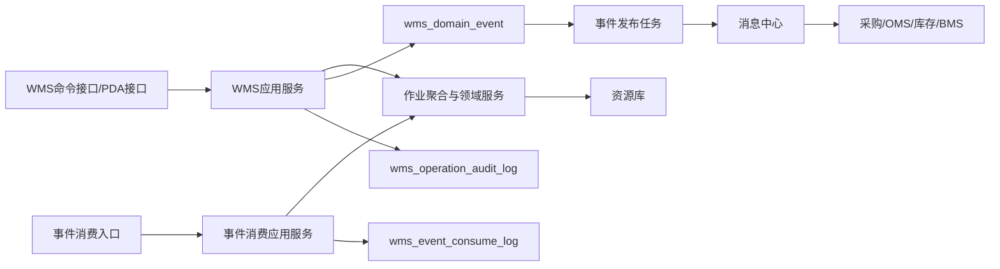
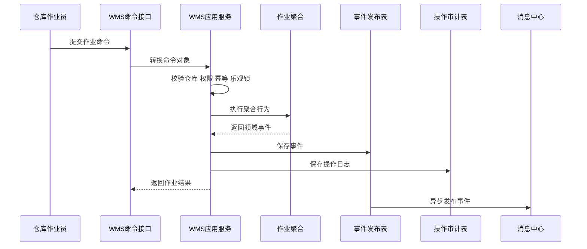
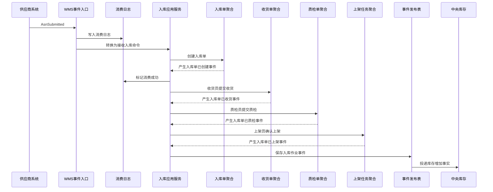
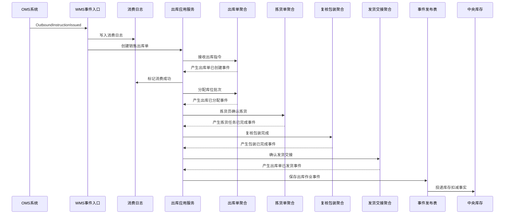
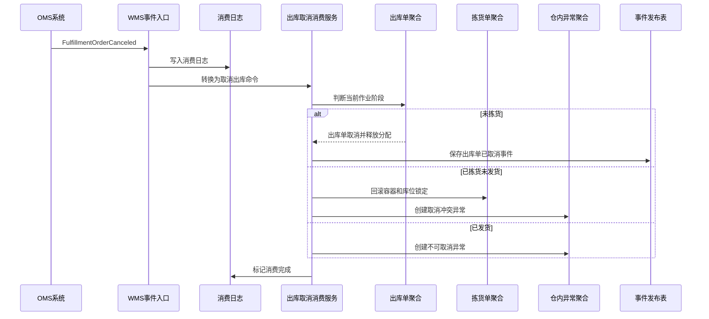
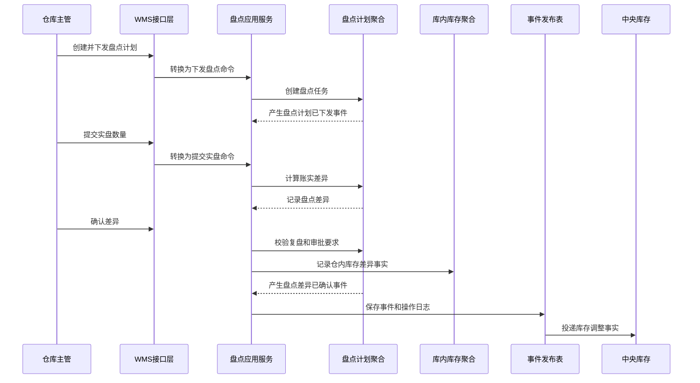
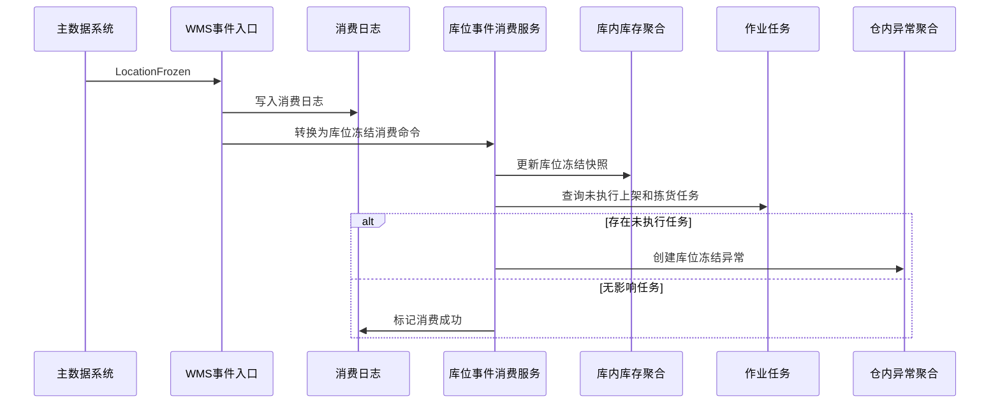

# 03 WMS系统事件生产与消费设计

> 本文根据 [WMS领域模型](../03-核心业务模型/03-WMS领域模型/01-WMS领域模型.md)、[WMS系统产品功能设计](../04-子系统功能设计/WMS系统/WMS系统产品功能设计.md)、[WMS系统数据库设计](../05-子系统数据库设计/03-WMS系统数据库设计.md)、[WMS系统接口设计](../06-子系统接口设计/57-WMS系统接口设计.md) 和 [上下文映射与领域事件目录](../06-子系统接口设计/50-上下文映射与领域事件目录.md) 整理。本文专门说明 WMS 在聚合、领域服务、应用服务执行命令后如何生产事件，消费外部事件后如何改变本地作业数据，事件包含哪些字段属性，以及事件如何落表、发布、重试和审计。

## 1. 设计范围

| 类型 | 范围 |
| --- | --- |
| 事件生产 | 入库单、收货单、质检单、上架任务、库内库存、出库单、波次单、拣货单、周转容器、复核包装单、发货交接、盘点计划、仓内异常等聚合执行命令后产生领域事件 |
| 事件消费 | 消费主数据、供应商、采购、OMS、中央库存等上下文发布的入库/出库/取消/预占/释放等事件 |
| 事件存储 | 本地领域事件发布表 `wms_domain_event`、事件消费幂等日志 `wms_event_consume_log`、操作审计表 `wms_operation_audit_log` |
| 不包含 | 采购审批、OMS 审单、中央库存余额记账、BMS 费用计算、物流承运轨迹权威 |

## 2. DDD 对齐说明

| 领域驱动设计项 | 对齐口径 |
| --- | --- |
| 限界上下文 | WMS 上下文 |
| 数据主权 | WMS 拥有仓内实物作业事实、库位级执行结果、任务执行状态、容器包裹流转、盘点差异和仓内异常 |
| 外部事实主权 | 采购拥有采购意图，OMS 拥有履约意图，中央库存拥有库存余额和流水，BMS 拥有费用与账单 |
| 事件生产位置 | 聚合根在仓内作业行为成功后产生领域事件；应用服务保存聚合、事件发布表和操作日志 |
| 事件消费位置 | 事件入口属于接口层；事件消费应用服务属于应用层；聚合和领域服务负责生成作业单、推进状态、校验不变量 |
| 一致性 | 单个作业聚合内部强一致；WMS 与采购、OMS、库存、BMS、供应商系统通过事件最终一致 |
| 核心原则 | WMS 发布“仓库真实发生的实物事实”，不直接替其他上下文改业务主状态或库存账本 |

## 3. 事件处理架构



处理规则：

1. Web 或 PDA 写操作进入命令接口，接口层转换为命令对象。
2. 应用服务校验仓库、库区、岗位、设备、按钮权限、幂等键和乐观锁。
3. 聚合根执行业务行为，必要时调用分配、推荐库位、质量隔离、短拣判定等领域服务。
4. 聚合根修改状态、行明细、库位/批次/容器/包裹快照和版本，并返回领域事件。
5. 应用服务在同一事务中保存业务表、`wms_domain_event` 和 `wms_operation_audit_log`。
6. 事件发布任务异步扫描 `wms_domain_event`，投递成功后更新发布状态。
7. 外部事件进入 `/internal/wms/v1/events` 后先写 `wms_event_consume_log`，再由消费应用服务处理。

## 4. 事件标准载荷

### 4.1 通用事件信封

```json
{
  "eventId": "EVT-WMS-202607040001",
  "eventType": "OutboundOrderShipped",
  "eventName": "出库单已发货",
  "eventVersion": "1.0",
  "sourceContext": "WMS",
  "sourceSystem": "WMS",
  "aggregateType": "OutboundOrder",
  "aggregateId": "190001",
  "aggregateNo": "OB202607040001",
  "aggregateVersion": 8,
  "businessKey": "FUL202607040001",
  "idempotencyKey": "WMS:OB202607040001:SHIP:SHIP202607040001",
  "occurredAt": "2026-07-04T10:00:00+08:00",
  "operatorId": "WMSUSER001",
  "warehouseId": "WH001",
  "ownerId": "OWNER001",
  "traceId": "TRACE202607040001",
  "payload": {}
}
```

### 4.2 通用字段属性

| 字段 | 类型 | 必填 | 说明 |
| --- | --- | --- | --- |
| `eventId` | string | 是 | 全局唯一事件 ID，写入 `wms_domain_event.event_code` |
| `eventType` | string | 是 | 稳定事件类型，如 `InboundOrderPutawayCompleted` |
| `eventName` | string | 是 | 中文事件名 |
| `eventVersion` | string | 是 | 事件结构版本 |
| `sourceContext` | string | 是 | 来源限界上下文 |
| `sourceSystem` | string | 是 | 来源系统 |
| `aggregateType` | string | 是 | 聚合类型 |
| `aggregateId` | string | 是 | 聚合技术 ID |
| `aggregateNo` | string | 否 | WMS 作业单号 |
| `aggregateVersion` | int | 是 | 聚合版本 |
| `businessKey` | string | 是 | 来源业务主键，如 PO、履约单、退供单、调拨单 |
| `idempotencyKey` | string | 是 | 消费幂等键 |
| `occurredAt` | datetime | 是 | 仓内事实发生时间 |
| `operatorId` | string | 否 | 操作人；系统任务传系统账号 |
| `warehouseId` | string | 是 | 仓库 ID |
| `ownerId` | string | 多货主必填 | 货主 ID |
| `traceId` | string | 否 | 链路追踪 ID |
| `payload` | object | 是 | 业务载荷 |

### 4.3 WMS 业务载荷必备字段

| 字段 | 使用场景 | 说明 |
| --- | --- | --- |
| `sourceType`、`sourceOrderNo` | 入库/出库/退货/调拨 | 来源类型和来源单号 |
| `warehouseId`、`zoneCode`、`locationCode` | 上架、拣货、盘点 | 仓库、库区、库位 |
| `skuId`、`skuCode`、`barcode` | 所有作业明细 | 商品和条码快照 |
| `batchNo`、`productionDate`、`expireDate` | 批次/效期管理 SKU | 批次效期 |
| `qualityStatus` | 质检、上架、库存、退货 | 合格、不合格、待检、冻结、待退供 |
| `qty`、`uom` | 所有数量事件 | 数量和单位 |
| `containerCode` | 拣货、复核、容器流转 | 周转箱、播种格口、托盘等 |
| `packageNo`、`trackingNo` | 包装、发货 | 包裹号和运单号 |
| `diffType`、`diffQty`、`diffReason` | 差异事件 | 短收、超收、短拣、复核差异、盘点差异 |
| `operatorId`、`deviceId` | PDA 作业 | 操作人和设备 |

## 5. 事件存储设计

### 5.1 领域事件发布表 `wms_domain_event`

`wms_domain_event` 是 WMS 的 Outbox 表。作业命令成功后，应用服务在业务事务内写入。

| 字段 | 作用 | 写入规则 |
| --- | --- | --- |
| `event_id` | 技术主键 | 雪花 ID 或数据库 ID |
| `event_code` | 全局事件编码 | 对应 `eventId`，唯一 |
| `event_name` | 中文事件名 | 如 `出库单已发货` |
| `event_type` | 稳定事件类型 | 如 `OutboundOrderShipped` |
| `aggregate_type` | 聚合类型 | 如 `InboundOrder`、`PickingOrder` |
| `aggregate_id` | 聚合 ID | 写聚合根 ID |
| `aggregate_no` | 业务单号 | 写入库单、出库单、拣货单、盘点计划等单号 |
| `source_system` | 来源系统 | 本系统生产固定为 `WMS` |
| `payload_json` | 事件完整载荷 | 保存事件信封和业务 `payload` |
| `event_status` | 发布状态 | `1` 待发布、`2` 发布中、`3` 已发布、`4` 发布失败、`5` 已取消 |
| `retry_count` | 重试次数 | 发布失败递增 |
| `fail_reason` | 失败原因 | 记录消息投递异常 |
| `occurred_at` | 业务发生时间 | 仓内作业发生时间 |
| `published_at` | 发布时间 | 发布成功后写入 |

### 5.2 事件消费日志 `wms_event_consume_log`

`wms_event_consume_log` 是 WMS 消费外部事件的 Inbox/幂等表。唯一键为 `source_system + event_code + consumer_name`。

| 字段 | 作用 | 写入规则 |
| --- | --- | --- |
| `consume_log_id` | 消费日志主键 | 雪花 ID 或数据库 ID |
| `event_code` | 外部事件编码 | 来自外部 `eventId` |
| `source_system` | 来源系统 | `MDM`、`SUPPLIER`、`PURCHASE`、`OMS`、`INVENTORY` |
| `consumer_name` | 消费者名称 | 如 `WmsOutboundInstructionConsumer` |
| `idempotent_key` | 业务幂等键 | 如 `OMS:{eventId}:{fulfillmentOrderNo}` |
| `consume_status` | 消费状态 | `1` 待消费、`2` 处理中、`3` 成功、`4` 失败、`5` 已忽略 |
| `retry_count` | 重试次数 | 消费失败重试时递增 |
| `fail_reason` | 失败原因 | 保存领域规则失败或系统异常 |
| `consumed_at` | 完成时间 | 消费成功或忽略后写入 |

### 5.3 操作审计表 `wms_operation_audit_log`

WMS 的审计不仅记录用户，还要记录仓库、库区、设备、条码和作业位置。

| 场景 | 审计内容 |
| --- | --- |
| PDA 扫码作业 | 操作人、设备、仓库、库位、条码、批次、数量、前后状态、事件编号 |
| Web 管理操作 | 仓库主管、权限点、请求摘要、前后状态、原因 |
| 系统消费事件 | 来源系统、来源事件、消费者、处理前后状态、消费结果 |
| 失败处理 | 失败原因、异常类型、是否可重试、人工待办编号 |

## 6. WMS 事件生产

### 6.1 生产事件总览

| 聚合/服务 | 命令 | 数据变化 | 生产事件 | 主要消费者 |
| --- | --- | --- | --- | --- |
| 入库单聚合 | 接收入库单 | 新增 `wms_inbound`；状态待到货 | `InboundOrderCreated` | 采购、OMS、供应商、BMS |
| 入库单聚合 | 登记到货 | `inbound_status -> 到货中`；写到货时间、月台 | `InboundArrivalRegistered` | 采购、供应商 |
| 收货单聚合 | 开始收货 | 新增/更新 `wms_receive`；状态收货中 | `ReceiptStarted` | WMS 看板 |
| 收货单聚合 | 扫描收货 | 写 `wms_receive_line` 实收、短收、超收、批次 | `ReceiptLineScanned` | WMS 看板、审计 |
| 收货单聚合 | 提交收货 | `receipt_status -> 已收货/部分收货/异常` | `InboundOrderReceived` | 采购、供应商、BMS |
| 质检单聚合 | 提交质检结果 | 写合格/不合格数量、原因、证据 | `InboundOrderInspected`、`RejectedStockJudged` | 采购、供应商、OMS、BMS |
| 上架任务聚合 | 确认上架 | 写目标库位、上架数量、质量状态 | `InboundOrderPutawayCompleted` | 中央库存、采购、OMS、BMS |
| 上架任务聚合 | 暂存不合格品 | 不合格进入隔离/待退供/待报废库位 | `RejectedStockStored` | 采购、供应商、库存 |
| 库内库存聚合 | 入库上账/库内移动/冻结/调整 | 更新 `wms_stock` 库位级实物数量或状态 | `WmsStockIncreased`、`WmsStockMoved`、`WmsStockFrozen`、`WmsStockAdjusted` | 中央库存、BI |
| 出库单聚合 | 接收出库单 | 新增 `wms_outbound`、`wms_outbound_line` | `OutboundOrderCreated` | OMS、调拨、采购 |
| 出库单聚合 | 分配库位 | 写分配库位、批次、应拣数量 | `OutboundAllocated`、`OutboundAllocationFailed` | OMS、库存 |
| 波次单聚合 | 生成/释放波次 | 新增 `wms_wave`；释放后生成拣货任务 | `WaveCreated`、`WaveReleased` | WMS 看板 |
| 拣货单聚合 | 确认拣货任务 | 写 `wms_pick_task` 已拣数量、容器 | `PickTaskCompleted` | OMS、WMS 看板 |
| 拣货单聚合 | 登记短拣 | 记录短拣 SKU、库位、原因 | `PickTaskShortPicked` | OMS、中央库存 |
| 周转容器聚合 | 绑定/交接/清空容器 | 更新 `wms_container` 状态和绑定对象 | `ContainerBound`、`ContainerHandedOver`、`ContainerCleared` | WMS 看板 |
| 复核包装单聚合 | 完成复核/包装 | 写 `wms_review_pack`、`wms_package` 包裹、重量、面单 | `OutboundOrderReviewed`、`PackageCompleted` | OMS、BMS |
| 发货交接聚合 | 扫描交接并确认发货 | 包裹交接承运商，出库单发货完成 | `OutboundOrderShipped` | OMS、中央库存、BMS、物流系统 |
| 盘点计划聚合 | 确认盘点差异 | 写账面数、实盘数、差异数量和原因 | `StocktakeDifferenceConfirmed` | 中央库存、BMS、BI |
| 仓内异常聚合 | 创建/关闭异常 | 写异常类型、影响数量、责任方、处理结论 | `WarehouseExceptionCreated`、`WarehouseExceptionClosed` | 来源系统、BI |

### 6.2 入库上架事件

| 项 | 设计 |
| --- | --- |
| 触发命令 | 确认上架、暂存不合格品 |
| 发起角色 | 上架员、质检员、系统策略 |
| 应用服务 | 上架任务应用服务、库内库存应用服务 |
| 聚合/领域服务 | 上架任务聚合、库内库存聚合、推荐库位服务、质量隔离服务 |
| 事件类型 | `InboundOrderPutawayCompleted`、`RejectedStockStored` |
| 存储表 | `wms_domain_event` |

数据变化：

| 表/模型 | 字段变化 |
| --- | --- |
| `wms_putaway` | 上架任务状态变为已完成/部分上架/异常，记录目标库位和上架数量 |
| `wms_stock` | 增加库位级实物数量或新增不合格库存记录 |
| `wms_operation_audit_log` | 记录上架员、设备、库位、SKU、数量、前后状态 |
| `wms_domain_event` | 写上架事实事件，`event_status=1` |

事件载荷：

| 字段 | 说明 |
| --- | --- |
| `inboundOrderNo`、`putawayTaskNo` | 入库单和上架任务 |
| `sourceType`、`sourceOrderNo` | 采购、调拨、售后退货等来源 |
| `warehouseId` | 仓库 |
| `locationLines[]` | SKU、批次、质量状态、目标库位、上架数量、单位 |
| `rejectedLines[]` | 不合格品 SKU、数量、原因、隔离库位 |
| `operatorId`、`deviceId` | 操作人和 PDA 设备 |

### 6.3 出库发货事件

| 项 | 设计 |
| --- | --- |
| 触发命令 | 确认发货、关闭发货交接 |
| 发起角色 | 发货员、仓库主管 |
| 应用服务 | 发货交接应用服务、出库单应用服务 |
| 聚合/领域服务 | 发货交接聚合、出库单聚合、包裹完整性校验服务 |
| 事件类型 | `OutboundOrderShipped` |
| 存储表 | `wms_domain_event` |

数据变化：

| 表/模型 | 字段变化 |
| --- | --- |
| `wms_package` | 包裹状态变为已交接，写承运商、运单、交接时间 |
| `wms_outbound` | `outbound_status -> 已发货`，写发货时间 |
| `wms_stock` | WMS 侧库位作业库存从已拣/待发转为已出库事实 |
| `wms_domain_event` | 写发货事实事件 |

事件载荷：

| 字段 | 说明 |
| --- | --- |
| `outboundOrderNo` | WMS 出库单号 |
| `sourceType`、`sourceOrderNo` | OMS 履约单、调拨单、退供单等 |
| `shipmentNo` | 发货交接号 |
| `carrierCode`、`trackingNo` | 承运商和运单 |
| `packages[]` | 包裹号、重量、体积、面单、包裹 SKU 摘要 |
| `shippedLines[]` | 出库行、SKU、批次、出库数量、库位来源 |

### 6.4 盘点差异事件

| 项 | 设计 |
| --- | --- |
| 触发命令 | 确认盘点差异、完成盘点计划 |
| 发起角色 | 仓库主管、盘点员 |
| 应用服务 | 盘点应用服务、库内库存应用服务 |
| 聚合/领域服务 | 盘点计划聚合、库内库存聚合、差异复盘判定服务 |
| 事件类型 | `StocktakeDifferenceConfirmed` |
| 存储表 | `wms_domain_event` |

数据变化：

| 表/模型 | 字段变化 |
| --- | --- |
| `wms_count` | 盘点计划进入差异已确认/已完成 |
| `wms_stock` | 可记录 WMS 侧盘点差异事实，不直接替中央库存改账 |
| `wms_exception_record` | 大额差异可生成仓内异常 |
| `wms_domain_event` | 写盘点差异事实事件 |

事件载荷：

| 字段 | 说明 |
| --- | --- |
| `countPlanNo` | 盘点计划号 |
| `warehouseId` | 仓库 |
| `differenceLines[]` | 库位、SKU、批次、账面数、实盘数、差异数、质量状态、差异原因 |
| `approvedBy` | 差异确认人 |
| `confirmedAt` | 差异确认时间 |

## 7. WMS 事件消费

### 7.1 消费事件总览

| 消费事件 | 来源系统 | 消费应用服务 | 影响聚合/读模型 | 数据变化 | 幂等键 |
| --- | --- | --- | --- | --- | --- |
| `SkuEnabled` | 主数据 | SKU 事件消费服务 | SKU 作业快照 | 允许入库、出库、盘点引用 | `MDM:{eventId}:{skuId}` |
| `SkuDisabled` | 主数据 | SKU 事件消费服务 | 入库/出库/盘点明细风险提示 | 禁止新增引用，未完成作业生成异常提示 | `MDM:{eventId}:{skuId}` |
| `WarehouseEnabled` | 主数据 | 仓库事件消费服务 | 仓库快照 | 允许接收入库/出库指令 | `MDM:{eventId}:{warehouseId}` |
| `WarehouseDisabled` | 主数据 | 仓库事件消费服务 | 仓库快照、未完成作业 | 禁止新增作业，未完成作业进入风险提示 | `MDM:{eventId}:{warehouseId}` |
| `LocationChanged` | 主数据 | 库位事件消费服务 | 库位快照、推荐/分配策略 | 更新用途、容量、质量状态限制 | `MDM:{eventId}:{locationId}:{version}` |
| `LocationFrozen` | 主数据 | 库位事件消费服务 | 上架、拣货、盘点任务 | 禁止上架/拣货；已有任务生成异常 | `MDM:{eventId}:{locationId}` |
| `CarrierEnabled` | 主数据 | 物流商事件消费服务 | 包装、发货 | 允许选择承运商 | `MDM:{eventId}:{carrierId}` |
| `AsnSubmitted` | 供应商 | 入库指令消费服务 | 入库单 | 创建或更新采购入库单，生成收货待办 | `SUPPLIER:{eventId}:{asnNo}` |
| `AsnShipped` | 供应商 | 到货预约消费服务 | 入库单 | 更新预计到货和运输信息 | `SUPPLIER:{eventId}:{asnNo}:SHIP` |
| `PurchaseOrderCanceled` | 采购 | 入库取消消费服务 | 入库单、收货单 | 未收货则取消；已开始作业则生成异常待办 | `PURCHASE:{eventId}:{purchaseOrderNo}` |
| `SupplierReturnApproved` | 采购 | 退供出库消费服务 | 出库单 | 创建退供应商出库单 | `PURCHASE:{eventId}:{supplierReturnNo}` |
| `OutboundInstructionIssued` | OMS | 出库指令消费服务 | 出库单 | 创建销售出库单，等待库存预占/分配 | `OMS:{eventId}:{fulfillmentOrderNo}` |
| `FulfillmentOrderCanceled` | OMS | 出库取消消费服务 | 出库单、波次、拣货、包裹 | 按作业阶段取消、释放或拒绝取消 | `OMS:{eventId}:{fulfillmentOrderNo}` |
| `AfterSaleApproved` | OMS | 退货入库消费服务 | 入库单、质检单 | 创建售后退货入库单 | `OMS:{eventId}:{afterSaleNo}` |
| `InventoryReserved` | 中央库存 | 出库预占消费服务 | 出库单、分配读模型 | 标记可分配，刷新可作业库存快照 | `INVENTORY:{eventId}:{reservationNo}` |
| `InventoryReservationReleased` | 中央库存 | 出库释放消费服务 | 出库单、分配记录 | 未拣货则取消分配或释放作业锁定 | `INVENTORY:{eventId}:{reservationNo}` |

### 7.2 OMS 出库指令事件消费

| 项 | 设计 |
| --- | --- |
| 订阅事件 | `OutboundInstructionIssued` |
| 来源系统 | OMS |
| 消费应用服务 | 出库指令消费服务 |
| 影响聚合 | 出库单聚合 |
| 消费日志 | `wms_event_consume_log` |

处理步骤：

1. 事件入口接收事件，生成幂等键 `OMS:{eventId}:{fulfillmentOrderNo}`。
2. 写入 `wms_event_consume_log`；如果已成功消费则直接返回幂等命中。
3. 校验仓库、货主、SKU、物流商、来源单号和出库类型。
4. 创建 `wms_outbound`、`wms_outbound_line`，状态为待分配或待预占结果。
5. 写本地事件 `OutboundOrderCreated`，供 OMS 看板和 WMS 出库看板消费。
6. 消费日志更新为成功；失败时记录原因并进入可重试状态。

外部事件载荷要求：

| 字段 | 说明 |
| --- | --- |
| `fulfillmentOrderNo` | OMS 履约单号 |
| `outboundSourceType` | 销售、调拨、退供等 |
| `warehouseId`、`ownerId` | 仓库和货主 |
| `carrierCode` | 承运商 |
| `receiverSnapshot` | 收货人地址快照 |
| `lines[]` | SKU、数量、单位、批次/效期要求 |

### 7.3 中央库存预占事件消费

| 项 | 设计 |
| --- | --- |
| 订阅事件 | `InventoryReserved`、`InventoryReservationReleased` |
| 来源系统 | 中央库存 |
| 消费应用服务 | 出库预占消费服务、出库释放消费服务 |
| 影响聚合 | 出库单聚合、库内库存聚合、拣货任务读模型 |
| 消费日志 | `wms_event_consume_log` |

处理规则：

| 事件 | 本地处理 |
| --- | --- |
| `InventoryReserved` | 标记出库单可分配，写预占引用和可作业库存快照 |
| `InventoryReservationReleased` | 未拣货则释放 WMS 分配和作业锁定；已拣货生成异常待办 |

### 7.4 主数据库位事件消费

| 项 | 设计 |
| --- | --- |
| 订阅事件 | `LocationChanged`、`LocationFrozen` |
| 来源系统 | 主数据 |
| 消费应用服务 | 库位事件消费服务 |
| 影响聚合 | 库内库存、上架任务、拣货单、盘点计划 |
| 消费日志 | `wms_event_consume_log` |

处理规则：

| 场景 | 本地处理 |
| --- | --- |
| 库位用途变化 | 更新 WMS 库位快照，影响后续推荐上架和分配 |
| 库位容量变化 | 刷新容量和占用率，已生成任务不静默改库位 |
| 库位冻结 | 禁止新增上架/拣货任务；已分配未执行任务生成仓内异常 |
| 库位解冻 | 恢复推荐和分配能力 |

## 8. 关键时序图

### 8.1 命令产生事件通用流程



### 8.2 采购入库收货质检上架



### 8.3 OMS 出库指令到发货



### 8.4 OMS 取消事件消费



### 8.5 盘点差异确认



### 8.6 库位冻结事件消费



## 9. 失败、幂等和补偿

| 场景 | 风险 | 处理方式 |
| --- | --- | --- |
| 外部入库/出库指令重复投递 | 重复创建 WMS 单据 | `wms_event_consume_log` 唯一键拦截；聚合内按 `sourceSystem + sourceOrderNo + sourceType + version` 再校验 |
| PDA 重复扫码 | 重复累计收货、拣货、包裹 | 扫码动作以 `作业单 + 条码 + 扫描动作 + 扫描批次` 防重 |
| 上架事件发布失败 | 中央库存未增加库存 | `wms_domain_event.event_status=4`，发布任务重试；超过阈值生成异常待办 |
| 发货事件重复消费 | 中央库存重复扣减 | 发货事件幂等键必须包含出库单号和发货批次，库存侧按幂等键去重 |
| OMS 取消与 WMS 拣货并发 | 取消结果不一致 | 出库单聚合按作业阶段处理，已发货拒绝取消，已拣货走异常回滚 |
| 库位冻结影响已分配任务 | 作业员继续错误作业 | 消费库位冻结事件后生成异常并阻断未执行任务 |
| 收货/质检/上架数量超来源 | 上下游数量不一致 | 聚合拒绝或记录差异；超出容差生成仓内异常 |
| 盘点差异未经审批 | 中央库存错误调账 | WMS 只发布已确认差异，中央库存按审批结果调整 |

## 10. 事件到表和聚合映射

| 事件方向 | 事件 | 聚合/应用服务 | 主要写表 |
| --- | --- | --- | --- |
| 消费后生产 | `InboundOrderCreated` | 入库单聚合 | `wms_inbound`、`wms_event_consume_log`、`wms_domain_event` |
| 生产 | `InboundOrderReceived` | 收货单聚合 | `wms_receive`、`wms_receive_line`、`wms_domain_event` |
| 生产 | `InboundOrderInspected` | 质检单聚合 | `wms_qc`、`wms_domain_event` |
| 生产 | `InboundOrderPutawayCompleted` | 上架任务聚合、库内库存聚合 | `wms_putaway`、`wms_stock`、`wms_domain_event` |
| 消费后生产 | `OutboundOrderCreated` | 出库单聚合 | `wms_outbound`、`wms_outbound_line`、`wms_event_consume_log`、`wms_domain_event` |
| 生产 | `OutboundAllocated` | 出库单聚合 | `wms_outbound`、`wms_outbound_line`、`wms_domain_event` |
| 生产 | `PickTaskCompleted` | 拣货单聚合 | `wms_pick`、`wms_pick_task`、`wms_container`、`wms_domain_event` |
| 生产 | `PackageCompleted` | 复核包装单聚合 | `wms_review_pack`、`wms_package`、`wms_domain_event` |
| 生产 | `OutboundOrderShipped` | 发货交接聚合、出库单聚合 | `wms_package`、`wms_outbound`、`wms_domain_event` |
| 生产 | `StocktakeDifferenceConfirmed` | 盘点计划聚合、库内库存聚合 | `wms_count`、`wms_stock`、`wms_domain_event` |
| 生产 | `WarehouseExceptionCreated` | 仓内异常聚合 | `wms_exception_record`、`wms_domain_event` |
| 消费 | `LocationFrozen` | 库位事件消费服务 | `wms_event_consume_log`、`wms_stock`、`wms_exception_record` |

## 11. 设计结论

WMS 系统事件生产与消费的核心是“仓内实物事实可信”。WMS 不替采购、OMS、中央库存、BMS 做业务决策，但必须把真实发生的收货、质检、上架、拣货、包装、发货、盘点差异和异常处理，以带仓库、库位、SKU、批次、质量状态、容器、包裹、操作人的事件发布出去。

第一版不需要完整事件溯源，但必须保留 `wms_domain_event`、`wms_event_consume_log` 和 `wms_operation_audit_log`。这样既能保证 WMS 作业事实可靠投递给库存、采购、OMS、BMS，也能把外部入库/出库/取消/预占/主数据变更事件安全、幂等地沉淀为 WMS 作业状态和仓内异常。
