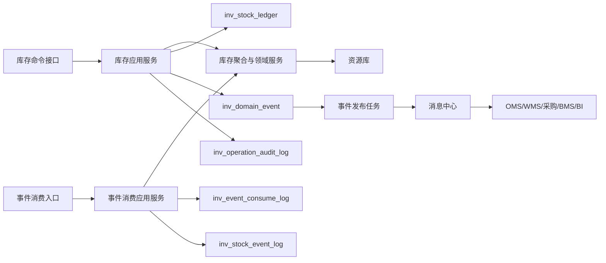
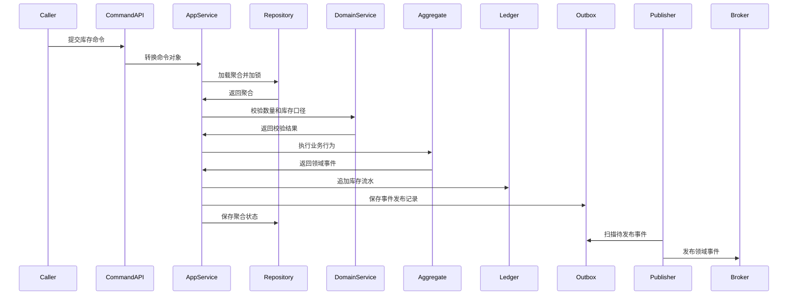
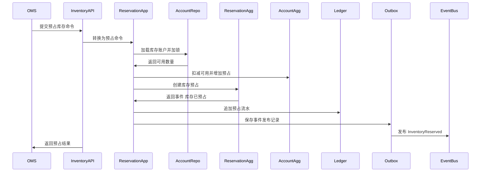
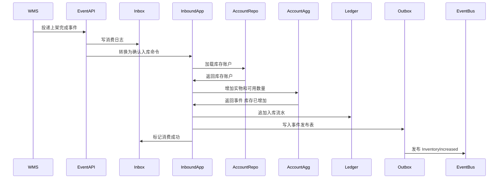
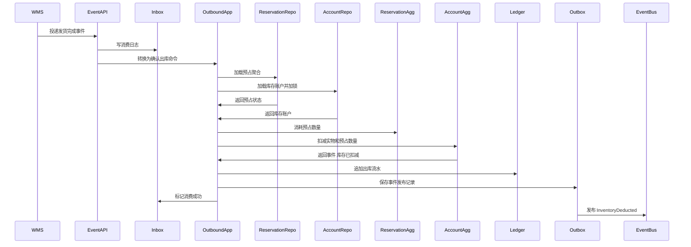
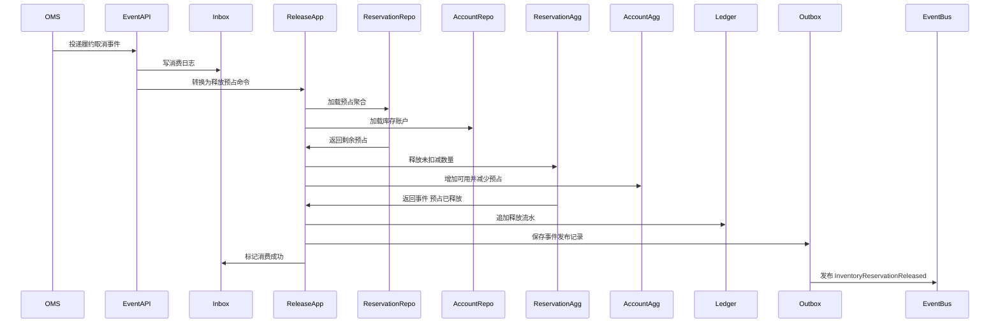
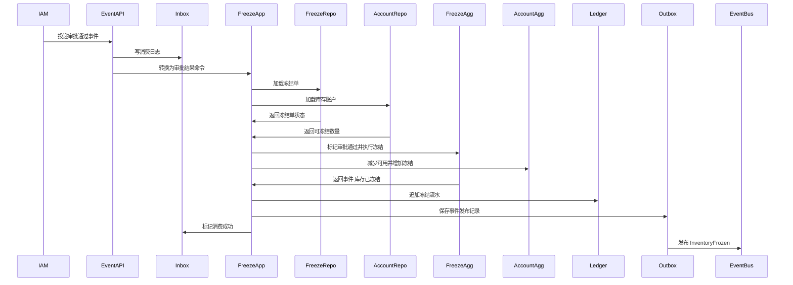
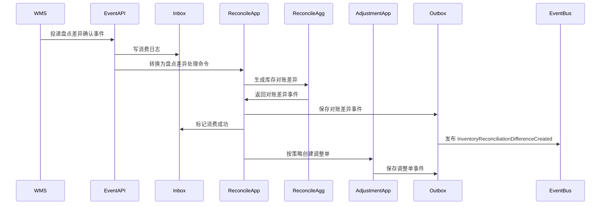
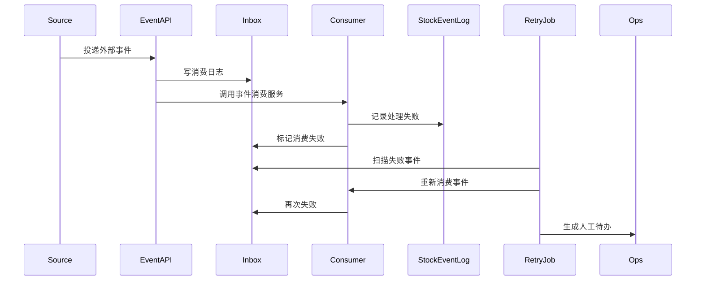

# 04 中央库存系统事件生产与消费设计

> 本文根据 [中央库存领域模型](../03-核心业务模型/04-中央库存领域模型/01-中央库存领域模型.md)、[中央库存系统产品功能设计](../04-子系统功能设计/中央库存系统/中央库存系统产品功能设计.md)、[中央库存系统数据库设计](../05-子系统数据库设计/04-中央库存系统数据库设计.md)、[中央库存系统接口设计](../06-子系统接口设计/58-中央库存系统接口设计.md) 和 [上下文映射与领域事件目录](../06-子系统接口设计/50-上下文映射与领域事件目录.md) 整理。本文专门说明中央库存系统在聚合、领域服务、应用服务执行命令后如何生产事件，消费外部事件后如何改变库存账本，事件包含哪些字段属性，以及事件如何落表、发布、重试和审计。

## 1. 设计范围

| 类型 | 范围 |
| --- | --- |
| 事件生产 | 库存账户、库存预占、冻结单、库存调整单、库存快照、库存对账单等聚合执行命令后产生领域事件 |
| 事件消费 | 消费主数据、WMS、OMS、权限审批等上下文发布的 SKU、仓库、货主、上架、发货、短拣、盘点差异、履约取消、审批结果事件 |
| 事件存储 | 本地领域事件发布表 `inv_domain_event`、事件消费幂等日志 `inv_event_consume_log`、库存事件日志 `inv_stock_event_log`、操作审计表 `inv_operation_audit_log` |
| 不包含 | WMS 仓内扫码作业、OMS 审单分仓、采购审批、BMS 费用计算、主数据权威维护 |

## 2. DDD 对齐说明

| 领域驱动设计项 | 对齐口径 |
| --- | --- |
| 限界上下文 | 中央库存上下文 |
| 数据主权 | 中央库存拥有库存余额、可用口径、预占状态、冻结状态、调整结果、库存流水、快照、对账差异和事件幂等结果 |
| 外部事实主权 | WMS 拥有仓内实物事实，OMS 拥有履约取消和销售意图，主数据拥有 SKU/仓库/货主维度，权限系统拥有审批事实 |
| 事件生产位置 | 聚合根在库存账本行为成功后产生领域事件；应用服务保存业务表、流水、事件发布表和审计日志 |
| 事件消费位置 | 事件入口属于接口层；事件消费应用服务属于应用层；聚合和领域服务负责记账、释放、调整、冻结和对账规则 |
| 一致性 | 库存账户、预占、流水在单个命令事务内强一致；中央库存与 OMS、WMS、BMS、采购通过事件最终一致 |
| 核心原则 | 中央库存只接受外部已经发生的业务事实或库存命令，统一转换为库存账本变化，不能让外部系统直接改余额 |

## 3. 事件处理架构



处理规则：

1. 页面、开放接口或内部系统调用进入命令接口，接口层转换为命令对象。
2. 应用服务校验登录态、系统身份、组织、货主、仓库、按钮权限、幂等键和乐观锁。
3. 应用服务加载库存账户、库存预占、冻结单、调整单、快照或对账单聚合。
4. 聚合根执行业务行为，必要时调用可用库存计算、预占分配、库存记账、冻结校验、调整校验或对账服务。
5. 聚合根修改状态、数量、明细、版本，并返回领域事件。
6. 应用服务在同一事务中保存业务表、`inv_stock_ledger`、`inv_domain_event` 和 `inv_operation_audit_log`。
7. 事件发布任务异步扫描 `inv_domain_event`，投递成功后更新发布状态。
8. 外部事件进入 `/internal/inventory/v1/events` 后先写 `inv_event_consume_log`，再由消费应用服务处理，并写 `inv_stock_event_log`。

## 4. 事件标准载荷

### 4.1 通用事件信封

```json
{
  "eventId": "EVT-INV-202607040001",
  "eventType": "InventoryReserved",
  "eventName": "库存已预占",
  "eventVersion": "1.0",
  "sourceContext": "INVENTORY",
  "sourceSystem": "INVENTORY",
  "aggregateType": "InventoryReservation",
  "aggregateId": "190001",
  "aggregateNo": "RSV202607040001",
  "aggregateVersion": 3,
  "businessKey": "FUL202607040001",
  "idempotencyKey": "OMS:FUL202607040001:RESERVE:1",
  "occurredAt": "2026-07-04T10:00:00+08:00",
  "operatorId": "SYSTEM",
  "ownerId": "OWNER001",
  "warehouseId": "WH001",
  "traceId": "TRACE202607040001",
  "payload": {}
}
```

### 4.2 通用字段属性

| 字段 | 类型 | 必填 | 说明 |
| --- | --- | --- | --- |
| `eventId` | string | 是 | 全局唯一事件 ID，写入 `inv_domain_event.event_code` |
| `eventType` | string | 是 | 稳定事件类型，如 `InventoryReserved` |
| `eventName` | string | 是 | 中文事件名 |
| `eventVersion` | string | 是 | 事件结构版本 |
| `sourceContext` | string | 是 | 来源限界上下文 |
| `sourceSystem` | string | 是 | 来源系统 |
| `aggregateType` | string | 是 | 聚合类型 |
| `aggregateId` | string | 是 | 聚合技术 ID |
| `aggregateNo` | string | 否 | 预占单、冻结单、调整单、快照或对账单号 |
| `aggregateVersion` | int | 是 | 聚合版本 |
| `businessKey` | string | 是 | 来源业务主键，如履约单、出库单、入库单、调整单 |
| `idempotencyKey` | string | 是 | 消费幂等键 |
| `occurredAt` | datetime | 是 | 库存事实发生时间 |
| `operatorId` | string | 否 | 操作人；系统任务传系统账号 |
| `ownerId` | string | 多货主必填 | 货主 ID |
| `warehouseId` | string | 是 | 仓库 ID |
| `traceId` | string | 否 | 链路追踪 ID |
| `payload` | object | 是 | 业务载荷 |

### 4.3 中央库存业务载荷必备字段

| 字段 | 使用场景 | 说明 |
| --- | --- | --- |
| `stockDimension` | 全部库存事件 | 货主、仓库、SKU、批次、库存状态、单位 |
| `sourceSystem`、`sourceOrderNo`、`sourceLineNo` | 预占、入库、出库、释放、调整 | 来源系统、来源单据和来源行 |
| `reservationNo` | 预占、释放、扣减 | 预占单号 |
| `freezeNo` | 冻结、解冻 | 冻结单号 |
| `adjustmentNo` | 调整、红冲 | 调整单号 |
| `snapshotNo` | 快照 | 快照号 |
| `reconcileNo` | 对账 | 对账单号 |
| `ledgerBatchNo` | 会改变库存数量的事件 | 本次命令产生的一组库存流水批次 |
| `beforeQty`、`afterQty`、`changedQty` | 会改变库存数量的事件 | 操作前数量、操作后数量、变化数量 |
| `onHandQty`、`availableQty`、`reservedQty`、`frozenQty` | 库存账户事件 | 实物、可用、预占、冻结数量 |
| `reasonCode`、`reasonName` | 释放、冻结、解冻、调整、对账 | 业务原因 |
| `failCode`、`failReason` | 失败事件 | 领域规则失败原因 |

## 5. 事件存储设计

### 5.1 领域事件发布表 `inv_domain_event`

`inv_domain_event` 是中央库存的 Outbox 表。库存命令成功后，应用服务在业务事务内写入。

| 字段 | 作用 | 写入规则 |
| --- | --- | --- |
| `event_id` | 技术主键 | 雪花 ID 或数据库 ID |
| `event_code` | 全局事件编码 | 对应 `eventId`，唯一 |
| `event_name` | 中文事件名 | 如 `库存已预占` |
| `event_type` | 稳定事件类型 | 如 `InventoryReserved` |
| `aggregate_type` | 聚合类型 | 如 `InventoryAccount`、`InventoryReservation` |
| `aggregate_id` | 聚合 ID | 写聚合根 ID |
| `aggregate_no` | 业务单号 | 写预占单、冻结单、调整单、快照或对账单号 |
| `source_system` | 来源系统 | 本系统生产固定为 `INVENTORY` |
| `payload_json` | 事件完整载荷 | 保存事件信封和业务 `payload` |
| `event_status` | 发布状态 | `1` 待发布、`2` 发布中、`3` 已发布、`4` 发布失败、`5` 已取消 |
| `retry_count` | 重试次数 | 发布失败递增 |
| `fail_reason` | 失败原因 | 记录消息投递异常 |
| `occurred_at` | 业务发生时间 | 库存事实发生时间 |
| `published_at` | 发布时间 | 发布成功后写入 |

### 5.2 事件消费日志 `inv_event_consume_log`

`inv_event_consume_log` 是中央库存消费外部事件的 Inbox/幂等表。唯一键为 `source_system + event_code + consumer_name`。

| 字段 | 作用 | 写入规则 |
| --- | --- | --- |
| `consume_log_id` | 消费日志主键 | 雪花 ID 或数据库 ID |
| `event_code` | 外部事件编码 | 来自外部 `eventId` |
| `source_system` | 来源系统 | `MDM`、`WMS`、`OMS`、`IAM` |
| `consumer_name` | 消费者名称 | 如 `InventoryInboundPutawayConsumer` |
| `idempotent_key` | 业务幂等键 | 如 `WMS:{eventId}:{putawayBatchNo}` |
| `consume_status` | 消费状态 | `1` 待消费、`2` 处理中、`3` 消费成功、`4` 消费失败、`5` 已忽略 |
| `retry_count` | 重试次数 | 消费失败重试时递增 |
| `fail_reason` | 失败原因 | 保存领域规则失败或系统异常 |
| `consumed_at` | 完成时间 | 消费成功或忽略后写入 |

### 5.3 库存事件日志 `inv_stock_event_log`

`inv_stock_event_log` 用于页面事件日志、单据轨迹和人工重放，不代替 Outbox/Inbox。

| 字段 | 作用 | 写入规则 |
| --- | --- | --- |
| `event_name` | 事件名称 | 保存外部事件或内部处理事件名称 |
| `source_system` | 来源系统 | 外部事件写来源系统，内部处理写 `INVENTORY` |
| `source_order_no` | 来源单号 | 支撑按单据追踪库存变化 |
| `process_status` | 处理状态 | `1` 待处理、`2` 成功、`3` 失败、`4` 已忽略 |
| `fail_reason` | 失败原因 | 消费失败、入账失败、规则失败时写入 |
| `received_at` | 接收时间 | 事件进入中央库存时间 |
| `processed_at` | 处理时间 | 事件处理完成时间 |

### 5.4 操作审计表 `inv_operation_audit_log`

所有会改变库存账本的命令都要记录操作审计。

| 场景 | 审计内容 |
| --- | --- |
| 页面写操作 | 操作人、菜单权限、按钮权限、组织、货主、仓库、请求摘要、前后数量、原因 |
| 跨系统命令 | 来源系统、来源单号、接口身份、幂等键、命令结果、失败原因 |
| 外部事件消费 | 来源事件、消费者、处理前后状态、消费日志 ID、是否幂等命中 |
| 失败和补偿 | 异常类型、是否可重试、补偿动作、人工待办编号 |

## 6. 中央库存事件生产

### 6.1 生产事件总览

| 聚合/服务 | 命令 | 数据变化 | 生产事件 | 主要消费者 |
| --- | --- | --- | --- | --- |
| 库存预占聚合 | 预占库存 | 新增 `inv_reservation`、`inv_reservation_line`；`available_qty` 减少；`reserved_qty` 增加；追加预占流水 | `InventoryReserved` | OMS、调拨、退供、BMS、BI |
| 库存预占聚合 | 预占库存失败 | 预占单可记录失败状态；库存余额不变；写失败原因 | `InventoryReservationFailed` | OMS、调拨、退供 |
| 库存预占聚合 | 释放预占 | 预占释放数量增加；`available_qty` 增加；`reserved_qty` 减少；追加释放流水 | `InventoryReservationReleased` | OMS、BMS、BI |
| 库存账户聚合 | 确认入库 | `on_hand_qty` 和可用/不合格/待退供数量增加；追加入库流水 | `InventoryIncreased`、`SellableInventoryChanged` | 采购、OMS、BMS、BI |
| 库存账户聚合 | 确认出库 | `on_hand_qty` 减少；有预占时消耗预占；追加出库流水 | `InventoryDeducted`、`SellableInventoryChanged` | OMS、BMS、BI |
| 冻结单聚合 | 执行冻结 | 冻结单变为已冻结；`available_qty` 减少；`frozen_qty` 增加；追加冻结流水 | `InventoryFrozen`、`SellableInventoryChanged` | OMS、WMS、BMS、BI |
| 冻结单聚合 | 执行解冻 | 冻结单记录解冻数量；`available_qty` 增加；`frozen_qty` 减少；追加解冻流水 | `InventoryUnfrozen`、`SellableInventoryChanged` | OMS、WMS、BMS、BI |
| 库存调整单聚合 | 执行调整 | 调整单变为已执行；库存账户数量变化；追加调整或红冲流水 | `InventoryAdjusted`、`SellableInventoryChanged` | WMS、BMS、BI |
| 库存快照聚合 | 生成快照 | 新增或更新 `inv_stock_snapshot`；快照状态变为已生成 | `InventorySnapshotGenerated` | BMS、BI |
| 库存对账单聚合 | 生成对账 | 新增 `inv_stock_reconcile`；生成中央库存与 WMS 差异 | `InventoryReconciliationDifferenceCreated` | WMS、BMS、BI |
| 库存对账单聚合 | 确认差异 | 对账单变为已确认；可生成调整单 | `InventoryReconciliationConfirmed` | WMS、BMS、BI |

### 6.2 预占库存事件

| 项 | 设计 |
| --- | --- |
| 触发命令 | 预占库存 |
| 发起角色/系统 | OMS、调拨系统、退供应商流程 |
| 应用服务 | 库存预占应用服务 |
| 聚合/领域服务 | 库存预占聚合、库存账户聚合、库存预占分配服务、可用库存计算服务 |
| 事件类型 | `InventoryReserved`、`InventoryReservationFailed` |
| 存储表 | `inv_domain_event` |

数据变化：

| 表/模型 | 成功变化 | 失败变化 |
| --- | --- | --- |
| `inv_reservation` | 新增预占单，`reservation_status=2` 已预占 | 可新增失败记录，`reservation_status=7` 失败 |
| `inv_reservation_line` | 写请求数量、成功预占数量、行状态已预占 | 写失败行、失败数量和原因 |
| `inv_stock_balance` | `available_qty` 减少，`reserved_qty` 增加，`version_no` 递增 | 不改变数量 |
| `inv_stock_ledger` | 追加 `ledger_type=3` 预占，`change_direction=3` 占用 | 可不写数量流水，或写失败轨迹日志 |
| `inv_domain_event` | 写 `InventoryReserved` 或 `InventoryReservationFailed` | 写失败事件 |

事件载荷：

| 字段 | 说明 |
| --- | --- |
| `reservationNo` | 预占单号 |
| `reservationType` | `1` 销售、`2` 调拨、`3` 退供 |
| `sourceSystem`、`sourceOrderNo`、`sourceLineNo` | 来源系统、来源单、来源行 |
| `stockDimension` | 货主、仓库、SKU、批次、库存状态 |
| `requestedQty`、`reservedQty`、`failedQty` | 请求、成功、失败数量 |
| `beforeAvailableQty`、`afterAvailableQty` | 预占前后可用数量 |
| `beforeReservedQty`、`afterReservedQty` | 预占前后已预占数量 |
| `expireAt` | 预占过期时间 |
| `ledgerBatchNo` | 库存流水批次 |
| `failCode`、`failReason` | 失败事件必填 |

### 6.3 释放预占事件

| 项 | 设计 |
| --- | --- |
| 触发命令 | 释放预占、履约取消事件消费、短拣差额释放、预占超时释放 |
| 发起角色/系统 | OMS、系统任务、库存运营 |
| 应用服务 | 库存预占应用服务、预占释放事件处理器 |
| 聚合/领域服务 | 库存预占聚合、库存账户聚合、预占关闭判定服务 |
| 事件类型 | `InventoryReservationReleased` |
| 存储表 | `inv_domain_event` |

数据变化：

| 表/模型 | 字段变化 |
| --- | --- |
| `inv_reservation` | 释放数量增加；全部释放时 `reservation_status=5` 已释放，部分释放后按剩余状态保持已预占或部分消耗 |
| `inv_reservation_line` | `released_qty` 增加；行状态变为已释放或部分消耗 |
| `inv_stock_balance` | `available_qty` 增加，`reserved_qty` 减少 |
| `inv_stock_ledger` | 追加 `ledger_type=4` 释放，`change_direction=4` 释放 |
| `inv_domain_event` | 写释放事实事件 |

事件载荷：

| 字段 | 说明 |
| --- | --- |
| `reservationNo` | 预占单号 |
| `sourceSystem`、`sourceOrderNo`、`sourceLineNo` | 来源单据 |
| `releaseReasonCode`、`releaseReasonName` | 取消、短拣、超时、人工释放 |
| `releasedQty`、`remainingReservedQty` | 本次释放数量和剩余预占数量 |
| `beforeAvailableQty`、`afterAvailableQty` | 释放前后可用 |
| `beforeReservedQty`、`afterReservedQty` | 释放前后预占 |
| `ledgerBatchNo` | 库存流水批次 |

### 6.4 入库增加事件

| 项 | 设计 |
| --- | --- |
| 触发命令 | 确认入库 |
| 发起角色/系统 | WMS 上架完成事件处理器、售后退货入库事件处理器、调拨入库事件处理器 |
| 应用服务 | 入库记账应用服务、库存账户应用服务 |
| 聚合/领域服务 | 库存账户聚合、库存记账服务、可用库存计算服务 |
| 事件类型 | `InventoryIncreased`、`SellableInventoryChanged` |
| 存储表 | `inv_domain_event` |

数据变化：

| 表/模型 | 字段变化 |
| --- | --- |
| `inv_stock_balance` | `on_hand_qty` 增加；合格品增加 `available_qty`，不合格品进入对应库存状态或冻结口径 |
| `inv_stock_ledger` | 追加 `ledger_type=1` 入库，`change_direction=1` 增加 |
| `inv_stock_event_log` | 记录来源 WMS 上架事件处理成功 |
| `inv_domain_event` | 写入库增加和可售变化事件 |

事件载荷：

| 字段 | 说明 |
| --- | --- |
| `inboundType` | 采购入库、调拨入库、售后退货入库、盘盈入库 |
| `sourceSystem`、`sourceOrderNo`、`sourceLineNo` | 来源单据 |
| `wmsInboundOrderNo`、`putawayTaskNo`、`putawayBatchNo` | WMS 上架信息 |
| `stockDimension` | 货主、仓库、SKU、批次、库存状态 |
| `increasedQty` | 本次增加数量 |
| `beforeOnHandQty`、`afterOnHandQty` | 入库前后实物 |
| `beforeAvailableQty`、`afterAvailableQty` | 入库前后可用 |
| `ledgerBatchNo` | 库存流水批次 |

### 6.5 出库扣减事件

| 项 | 设计 |
| --- | --- |
| 触发命令 | 确认出库 |
| 发起角色/系统 | WMS 发货完成事件处理器 |
| 应用服务 | 出库扣减应用服务、库存账户应用服务 |
| 聚合/领域服务 | 库存账户聚合、库存预占聚合、库存记账服务 |
| 事件类型 | `InventoryDeducted`、`SellableInventoryChanged` |
| 存储表 | `inv_domain_event` |

数据变化：

| 表/模型 | 字段变化 |
| --- | --- |
| `inv_stock_balance` | `on_hand_qty` 减少；有预占时 `reserved_qty` 减少；无预占出库按策略扣减可用或拒绝 |
| `inv_reservation` | 已消耗数量增加；全部扣减后 `reservation_status=4` 已消耗，部分扣减为 `3` 部分消耗 |
| `inv_reservation_line` | `consumed_qty` 增加；行状态变为部分消耗或已消耗 |
| `inv_stock_ledger` | 追加 `ledger_type=2` 出库，`change_direction=2` 减少 |
| `inv_stock_event_log` | 记录来源 WMS 发货事件处理成功 |
| `inv_domain_event` | 写出库扣减和可售变化事件 |

事件载荷：

| 字段 | 说明 |
| --- | --- |
| `outboundType` | 销售出库、调拨出库、退供应商出库、报废出库 |
| `sourceSystem`、`sourceOrderNo`、`sourceLineNo` | 来源单据 |
| `wmsOutboundOrderNo`、`shipmentNo` | WMS 出库和发运信息 |
| `reservationNo` | 对应预占单号，可为空 |
| `stockDimension` | 货主、仓库、SKU、批次、库存状态 |
| `deductedQty` | 本次扣减数量 |
| `beforeOnHandQty`、`afterOnHandQty` | 出库前后实物 |
| `beforeReservedQty`、`afterReservedQty` | 出库前后预占 |
| `ledgerBatchNo` | 库存流水批次 |

### 6.6 冻结与解冻事件

| 项 | 设计 |
| --- | --- |
| 触发命令 | 执行冻结、执行解冻 |
| 发起角色/系统 | 库存运营、质检不合格事件处理器、库位冻结事件处理器、风控策略 |
| 应用服务 | 冻结解冻应用服务 |
| 聚合/领域服务 | 冻结单聚合、库存账户聚合、库存冻结校验服务、库存解冻校验服务 |
| 事件类型 | `InventoryFrozen`、`InventoryUnfrozen`、`SellableInventoryChanged` |
| 存储表 | `inv_domain_event` |

数据变化：

| 表/模型 | 字段变化 |
| --- | --- |
| `inv_freeze` | 冻结状态变为已冻结、部分解冻或已解冻；审批状态同步更新 |
| `inv_stock_balance` | 冻结时 `available_qty` 减少、`frozen_qty` 增加；解冻时反向变化 |
| `inv_stock_ledger` | 追加冻结或解冻流水 |
| `inv_domain_event` | 写冻结/解冻事实事件和可售变化事件 |

事件载荷：

| 字段 | 说明 |
| --- | --- |
| `freezeNo` | 冻结单号 |
| `freezeReasonCode`、`freezeReasonName` | 质检、盘点、风控、异常、人工 |
| `freezeStatus` | 冻结状态 |
| `frozenQty`、`unfrozenQty` | 冻结或解冻数量 |
| `beforeAvailableQty`、`afterAvailableQty` | 前后可用 |
| `beforeFrozenQty`、`afterFrozenQty` | 前后冻结 |
| `approvalNo` | 审批单号，人工审批场景必填 |
| `ledgerBatchNo` | 库存流水批次 |

### 6.7 调整、快照和对账事件

| 事件 | 触发命令 | 数据变化 | 关键载荷 |
| --- | --- | --- | --- |
| `InventoryAdjusted` | 执行调整 | 调整单变为已执行；库存账户数量变化；追加调整或红冲流水 | 调整单号、调整类型、调整原因、前后数量、流水批次 |
| `InventorySnapshotGenerated` | 生成快照 | 快照状态变为已生成；保存快照日期、类型和范围 | 快照号、日期、类型、货主、仓库、SKU 范围 |
| `InventoryReconciliationDifferenceCreated` | 生成对账 | 对账单变为有差异；记录差异行数和差异数量 | 对账单号、对账日期、WMS 数、中央库存数、差异数量 |
| `InventoryReconciliationConfirmed` | 确认差异 | 对账单变为已确认；可生成调整单 | 对账单号、确认人、确认结论、调整单号 |

## 7. 中央库存事件消费

### 7.1 消费事件总览

| 来源 | 事件类型 | 消费应用服务 | 消费后数据变化 | 可能生产的新事件 |
| --- | --- | --- | --- | --- |
| 主数据 | `SkuEnabled` | 主数据事件消费服务 | 初始化或刷新 SKU 库存维度缓存，允许查询和入账 | 无 |
| 主数据 | `WarehouseEnabled` | 主数据事件消费服务 | 初始化或刷新仓库库存维度缓存 | 无 |
| 主数据 | `OwnerEnabled` | 主数据事件消费服务 | 初始化货主库存维度缓存和数据权限维度 | 无 |
| 主数据/WMS | `LocationFrozen` | 库位事件消费服务 | 标记库位不可用；按策略生成冻结建议或冻结单 | `InventoryFrozen` |
| WMS | `InboundOrderPutawayCompleted` | 入库记账事件处理器 | 调用确认入库命令，增加库存并追加流水 | `InventoryIncreased`、`SellableInventoryChanged` |
| WMS | `OutboundOrderShipped` | 出库扣减事件处理器 | 调用确认出库命令，扣减库存并消耗预占 | `InventoryDeducted`、`SellableInventoryChanged` |
| WMS | `OutboundOrderCanceled` | 出库取消事件处理器 | 判断是否释放预占或关闭异常 | `InventoryReservationReleased` |
| WMS | `PickTaskShortPicked` | 短拣事件处理器 | 按策略释放差额预占或等待 OMS 决策 | `InventoryReservationReleased` |
| WMS | `StocktakeDifferenceConfirmed` | 盘点差异事件处理器 | 生成对账单或库存调整单 | `InventoryReconciliationDifferenceCreated` |
| OMS | `FulfillmentOrderCanceled` | 预占释放事件处理器 | 释放销售预占 | `InventoryReservationReleased` |
| 权限/审批 | `ApprovalApproved` | 审批事件处理器 | 推进冻结单或调整单审批状态；必要时执行冻结或调整 | `InventoryFrozen`、`InventoryAdjusted` |
| 权限/审批 | `ApprovalRejected` | 审批事件处理器 | 驳回冻结单或调整单 | 无 |

### 7.2 WMS 上架完成事件消费

| 项 | 设计 |
| --- | --- |
| 来源事件 | `InboundOrderPutawayCompleted` |
| 来源上下文 | WMS |
| 消费者 | `InventoryInboundPutawayConsumer` |
| 应用服务 | 入库记账事件处理器、库存账户应用服务 |
| 消费日志 | `inv_event_consume_log` |

处理步骤：

1. 事件入口校验来源系统、事件版本、签名、货主、仓库和幂等键。
2. 写入 `inv_event_consume_log`；如果已成功消费则直接返回幂等命中。
3. 写入 `inv_stock_event_log`，状态为待处理。
4. 消费应用服务将 WMS 上架事实转换为确认入库命令。
5. 库存记账服务校验 SKU、仓库、货主、批次、库存状态是否有效。
6. 库存账户聚合增加实物数量和可用/不合格/待退供数量。
7. 追加入库流水，保存库存账户、流水和领域事件。
8. 更新消费日志为成功；发布 `InventoryIncreased` 和必要的 `SellableInventoryChanged`。

事件载荷要求：

| 字段 | 说明 |
| --- | --- |
| `inboundOrderNo`、`putawayTaskNo`、`putawayBatchNo` | WMS 入库和上架批次 |
| `sourceType`、`sourceOrderNo`、`sourceLineNo` | 采购、调拨、售后退货等来源 |
| `warehouseId`、`ownerId` | 库存维度 |
| `skuId`、`skuCode`、`batchNo` | 商品和批次 |
| `qualityStatus`、`stockStatus` | 质量状态和库存状态 |
| `putawayQty`、`uom` | 上架数量和单位 |
| `locationCode` | WMS 实物库位，用于追踪，不作为中央库存必然维度 |

### 7.3 WMS 发货完成事件消费

| 项 | 设计 |
| --- | --- |
| 来源事件 | `OutboundOrderShipped` |
| 来源上下文 | WMS |
| 消费者 | `InventoryOutboundShippedConsumer` |
| 应用服务 | 出库扣减事件处理器、库存账户应用服务 |
| 消费日志 | `inv_event_consume_log` |

处理步骤：

1. 事件入口写消费日志并做幂等判断。
2. 消费应用服务将 WMS 发货事实转换为确认出库命令。
3. 按来源单查询预占单；销售、调拨、退供出库优先走预占扣减。
4. 库存账户聚合扣减实物数量，库存预占聚合扣减已预占数量。
5. 如果 WMS 实发小于预占数量，按策略保留剩余预占、释放差额或等待 OMS 决策。
6. 追加出库流水，保存聚合和事件。
7. 发布 `InventoryDeducted` 和必要的 `SellableInventoryChanged`。

事件载荷要求：

| 字段 | 说明 |
| --- | --- |
| `outboundOrderNo`、`shipmentNo` | WMS 出库单和发运批次 |
| `sourceType`、`sourceOrderNo`、`sourceLineNo` | OMS 履约、调拨、退供等来源 |
| `reservationNo` | 预占单号，可为空 |
| `warehouseId`、`ownerId` | 库存维度 |
| `skuId`、`skuCode`、`batchNo` | 商品和批次 |
| `shippedQty`、`uom` | 实发数量和单位 |
| `packageNo`、`trackingNo` | 包裹号和运单号 |

### 7.4 OMS 履约取消事件消费

| 项 | 设计 |
| --- | --- |
| 来源事件 | `FulfillmentOrderCanceled` |
| 来源上下文 | OMS |
| 消费者 | `InventoryFulfillmentCanceledConsumer` |
| 应用服务 | 预占释放事件处理器 |
| 消费日志 | `inv_event_consume_log` |

处理步骤：

1. 事件入口校验事件幂等键。
2. 根据履约单号查找库存预占单。
3. 如果预占已全部扣减，则不释放，记录已忽略。
4. 如果存在未扣减预占，调用释放预占命令。
5. 释放后 `available_qty` 增加、`reserved_qty` 减少，追加释放流水。
6. 发布 `InventoryReservationReleased`，更新消费日志为成功。

事件载荷要求：

| 字段 | 说明 |
| --- | --- |
| `fulfillmentOrderNo` | 履约单号 |
| `cancelReasonCode`、`cancelReasonName` | 取消原因 |
| `reservationNo` | OMS 已知预占单号时传入 |
| `lines` | SKU、仓库、取消数量 |

### 7.5 盘点差异事件消费

| 项 | 设计 |
| --- | --- |
| 来源事件 | `StocktakeDifferenceConfirmed` |
| 来源上下文 | WMS |
| 消费者 | `InventoryStocktakeDifferenceConsumer` |
| 应用服务 | 盘点差异事件处理器、库存对账应用服务、库存调整应用服务 |
| 消费日志 | `inv_event_consume_log` |

处理步骤：

1. 写消费日志并校验盘点计划、仓库、货主、SKU、批次。
2. 根据策略选择生成库存对账单或库存调整单。
3. 对账路径：生成 `inv_stock_reconcile`，状态为有差异，发布 `InventoryReconciliationDifferenceCreated`。
4. 调整路径：生成 `inv_stock_adjustment`，状态为待审批；审批通过后执行调整。
5. 调整执行后修改库存账户并追加调整流水，发布 `InventoryAdjusted`。

事件载荷要求：

| 字段 | 说明 |
| --- | --- |
| `stocktakePlanNo` | WMS 盘点计划号 |
| `warehouseId`、`ownerId` | 仓库和货主 |
| `skuId`、`skuCode`、`batchNo` | 商品和批次 |
| `bookQty`、`countedQty`、`diffQty` | 账面数、实盘数、差异数 |
| `diffType`、`diffReason` | 盘盈、盘亏、差异原因 |
| `confirmedBy`、`confirmedAt` | 差异确认人和时间 |

### 7.6 审批结果事件消费

| 项 | 设计 |
| --- | --- |
| 来源事件 | `ApprovalApproved`、`ApprovalRejected` |
| 来源上下文 | IAM/审批上下文 |
| 消费者 | `InventoryApprovalResultConsumer` |
| 应用服务 | 审批事件处理器、冻结解冻应用服务、库存调整应用服务 |
| 消费日志 | `inv_event_consume_log` |

处理步骤：

1. 根据审批业务类型识别冻结单、调整单或对账确认流程。
2. 审批通过时，推进审批状态；冻结单可执行冻结，调整单可进入已批准或自动执行。
3. 审批驳回时，单据状态变为已驳回，库存数量不变。
4. 如果通过后执行冻结或调整，保存库存流水并发布对应领域事件。

事件载荷要求：

| 字段 | 说明 |
| --- | --- |
| `approvalNo` | 审批单号 |
| `businessType` | 冻结、调整、对账 |
| `businessNo` | 冻结单号、调整单号或对账单号 |
| `approvalResult` | 通过或驳回 |
| `approvedBy`、`approvedAt` | 审批人和审批时间 |
| `approvalComment` | 审批意见 |

## 8. 关键时序图

### 8.1 命令产生事件通用流程



### 8.2 OMS 预占库存



### 8.3 WMS 上架入账



### 8.4 WMS 发货扣减



### 8.5 取消履约释放预占



### 8.6 冻结审批通过后执行冻结



### 8.7 盘点差异生成对账和调整



### 8.8 事件消费失败与重试



## 9. 失败、幂等和补偿

| 场景 | 风险 | 处理规则 |
| --- | --- | --- |
| OMS 重复预占 | 重复占用可用库存 | 使用 `sourceSystem + sourceOrderNo + sourceLineNo + commandType + idempotencyKey` 判断，返回原结果 |
| 预占可用不足 | 订单无法继续履约 | 发布 `InventoryReservationFailed`，OMS 改仓、拆单、缺货等待或取消 |
| WMS 上架重复回传 | 库存重复增加 | 使用 `WMS + inboundOrderNo + putawayBatchNo` 幂等，重复事件直接返回成功 |
| WMS 发货重复回传 | 库存重复扣减 | 使用 `WMS + outboundOrderNo + shipmentNo` 幂等，重复扣减拒绝或返回原扣减结果 |
| WMS 已发货但库存扣减失败 | 实物已出库但账本未扣减 | 消费日志失败重试；超过阈值生成待办；人工补账或调整 |
| 短拣 | 预占大于实发 | OMS 决定重新履约、释放差额或关闭剩余预占 |
| 冻结数量超过可冻结 | 可用库存被扣成负数 | 聚合拒绝命令，保留原状态，记录失败审计 |
| 调整未审批 | 人工绕过库存规则 | 调整单未审批通过不能执行，返回业务错误 |
| Outbox 发布失败 | 下游 OMS/BMS/BI 读模型滞后 | `inv_domain_event.event_status=4`，发布任务重试，超过阈值进入死信和人工重放 |
| 外部事件消费失败 | 中央库存账本滞后 | `inv_event_consume_log.consume_status=4`，重试任务处理，必要时人工介入 |
| 对账差异 | 中央库存和 WMS 数量不一致 | 生成对账差异，确认后走调整单或红冲，不能静默覆盖历史流水 |

幂等键建议：

| 场景 | 幂等键 |
| --- | --- |
| 库存预占 | `OMS + fulfillmentOrderNo + reserveVersion` |
| 释放预占 | `reservationNo + releaseReason + sourceEventId` |
| WMS 入库入账 | `WMS + inboundOrderNo + putawayBatchNo` |
| WMS 出库扣减 | `WMS + outboundOrderNo + shipmentNo` |
| 冻结库存 | `freezeNo + submitVersion` 或 `sourceSystem + sourceOrderNo + freezeAction` |
| 解冻库存 | `freezeNo + unfreezeBatchNo` |
| 执行调整 | `adjustmentNo + executeVersion` |
| 快照生成 | `snapshotDate + snapshotType + ownerId + warehouseId` |
| 对账生成 | `reconcileDate + ownerId + warehouseId + stockStatusScope` |
| 事件消费 | `sourceContext + eventId + aggregateId` |

## 10. 事件到表和聚合映射

| 类型 | 事件 | 聚合/服务 | 主要表 |
| --- | --- | --- | --- |
| 生产 | `InventoryReserved` | 库存预占聚合、库存账户聚合 | `inv_reservation`、`inv_reservation_line`、`inv_stock_balance`、`inv_stock_ledger`、`inv_domain_event` |
| 生产 | `InventoryReservationFailed` | 库存预占应用服务 | `inv_reservation`、`inv_reservation_line`、`inv_domain_event` |
| 生产 | `InventoryReservationReleased` | 库存预占聚合、库存账户聚合 | `inv_reservation`、`inv_reservation_line`、`inv_stock_balance`、`inv_stock_ledger`、`inv_domain_event` |
| 消费后生产 | `InventoryIncreased` | 库存账户聚合 | `inv_stock_balance`、`inv_stock_ledger`、`inv_event_consume_log`、`inv_stock_event_log`、`inv_domain_event` |
| 消费后生产 | `InventoryDeducted` | 库存账户聚合、库存预占聚合 | `inv_stock_balance`、`inv_reservation`、`inv_reservation_line`、`inv_stock_ledger`、`inv_event_consume_log`、`inv_domain_event` |
| 生产 | `InventoryFrozen` | 冻结单聚合、库存账户聚合 | `inv_freeze`、`inv_stock_balance`、`inv_stock_ledger`、`inv_domain_event` |
| 生产 | `InventoryUnfrozen` | 冻结单聚合、库存账户聚合 | `inv_freeze`、`inv_stock_balance`、`inv_stock_ledger`、`inv_domain_event` |
| 生产 | `InventoryAdjusted` | 库存调整单聚合、库存账户聚合 | `inv_stock_adjustment`、`inv_stock_balance`、`inv_stock_ledger`、`inv_domain_event` |
| 生产 | `InventorySnapshotGenerated` | 库存快照聚合 | `inv_stock_snapshot`、`inv_domain_event` |
| 生产 | `InventoryReconciliationDifferenceCreated` | 库存对账单聚合 | `inv_stock_reconcile`、`inv_domain_event` |
| 生产 | `InventoryReconciliationConfirmed` | 库存对账单聚合 | `inv_stock_reconcile`、`inv_stock_adjustment`、`inv_domain_event` |
| 生产 | `SellableInventoryChanged` | 可用库存计算服务、库存账户聚合 | `inv_stock_balance`、`inv_domain_event` |
| 消费 | `SkuEnabled`、`WarehouseEnabled`、`OwnerEnabled` | 主数据事件消费服务 | `inv_event_consume_log`、`inv_stock_event_log` |
| 消费 | `InboundOrderPutawayCompleted` | 入库记账事件处理器 | `inv_event_consume_log`、`inv_stock_event_log`、`inv_stock_balance`、`inv_stock_ledger` |
| 消费 | `OutboundOrderShipped` | 出库扣减事件处理器 | `inv_event_consume_log`、`inv_stock_event_log`、`inv_stock_balance`、`inv_reservation`、`inv_stock_ledger` |
| 消费 | `FulfillmentOrderCanceled`、`PickTaskShortPicked` | 预占释放事件处理器 | `inv_event_consume_log`、`inv_reservation`、`inv_stock_balance`、`inv_stock_ledger` |
| 消费 | `StocktakeDifferenceConfirmed` | 盘点差异事件处理器 | `inv_event_consume_log`、`inv_stock_reconcile`、`inv_stock_adjustment` |
| 消费 | `ApprovalApproved`、`ApprovalRejected` | 审批事件处理器 | `inv_event_consume_log`、`inv_freeze`、`inv_stock_adjustment`、`inv_stock_balance`、`inv_stock_ledger` |

## 11. 设计结论

中央库存事件设计的核心不是“把库存表变化通知出去”，而是把所有库存数量变化沉淀成可靠的账本事实：

1. OMS、调拨、退供只请求预占和释放，不能直接改库存余额。
2. WMS 只发布仓内真实发生的上架、发货、短拣、盘点事实，中央库存负责统一记账。
3. 库存账户、预占、冻结、调整和流水必须在同一事务或可补偿流程中保持一致。
4. 所有库存流水只追加，错误通过释放、红冲、调整或对账补偿，不能物理修改历史流水。
5. `inv_domain_event` 保证本系统事件可靠发布，`inv_event_consume_log` 保证外部事件幂等消费，`inv_stock_event_log` 支撑页面追踪和人工重放。
6. `SellableInventoryChanged` 是面向 OMS、渠道和 BI 的关键读模型事件，应由入库、扣减、冻结、解冻、调整、释放等命令统一触发。

