# 05 OMS系统事件生产与消费设计

> 本文根据 [OMS领域模型](../03-核心业务模型/05-OMS领域模型/01-OMS领域模型.md)、[OMS系统产品功能设计](../04-子系统功能设计/OMS系统/OMS系统产品功能设计.md)、[OMS系统数据库设计](../05-子系统数据库设计/05-OMS系统数据库设计.md)、[OMS系统接口设计](../06-子系统接口设计/59-OMS系统接口设计.md) 和 [上下文映射与领域事件目录](../06-子系统接口设计/50-上下文映射与领域事件目录.md) 整理。本文专门说明 OMS 在聚合、领域服务、应用服务执行命令后如何生产事件，消费外部事件后如何改变本地订单履约数据，事件包含哪些字段属性，以及事件如何落表、发布、重试和审计。

## 1. 设计范围

| 类型 | 范围 |
| --- | --- |
| 事件生产 | 销售订单、履约单、出库单、取消申请、售后单、OMS 规则配置等聚合执行命令后产生领域事件 |
| 事件消费 | 消费主数据、中央库存、WMS、BMS、物流等上下文发布的 SKU、客户、仓库、库存预占、WMS 发货、退货验收、退款、签收等事件 |
| 事件存储 | 本地领域事件发布表 `oms_domain_event`、事件消费幂等日志 `oms_event_consume_log`、操作审计表 `oms_operation_audit_log` |
| 不包含 | 中央库存余额记账、WMS 仓内扫码作业、BMS 财务入账、物流承运轨迹权威、商品/客户/仓库主数据权威 |

## 2. DDD 对齐说明

| 领域驱动设计项 | 对齐口径 |
| --- | --- |
| 限界上下文 | OMS 上下文 |
| 数据主权 | OMS 拥有销售订单、履约单、出库单、取消申请、售后单、规则配置、订单状态和履约编排状态 |
| 外部事实主权 | 中央库存拥有库存余额和预占结果；WMS 拥有仓内出库、发货和退货验收事实；BMS 拥有退款事实；物流拥有签收事实；主数据拥有 SKU、客户、仓库、物流商权威 |
| 事件生产位置 | 聚合根在订单履约行为成功后产生领域事件；应用服务保存聚合、事件发布表和操作日志 |
| 事件消费位置 | 事件入口属于接口层；事件消费应用服务属于应用层；聚合和领域服务负责推进订单、履约、出库、取消、售后状态 |
| 一致性 | 单个订单、履约、出库、取消或售后聚合内部强一致；OMS 与库存、WMS、BMS、物流通过事件最终一致 |
| 核心原则 | OMS 发布“订单履约编排事实”，不替库存记账、不替 WMS 确认实物、不替 BMS 入账 |

## 3. 事件处理架构

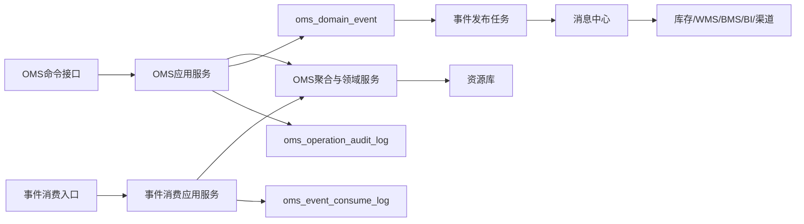

处理规则：

1. 渠道、页面、开放接口或内部系统调用进入命令接口，接口层转换为命令对象。
2. 应用服务校验渠道身份、登录态、组织、货主、仓库、店铺、按钮权限、幂等键和乐观锁。
3. 应用服务加载销售订单、履约单、出库单、取消申请、售后单或规则配置聚合。
4. 聚合根执行业务行为，必要时调用审单、分仓履约、订单状态汇总、取消可行性判断、售后权益校验等领域服务。
5. 聚合根修改状态、行明细、预占引用、WMS 状态快照、退款/补发记录和版本，并返回领域事件。
6. 应用服务在同一事务中保存业务表、`oms_domain_event` 和 `oms_operation_audit_log`。
7. 事件发布任务异步扫描 `oms_domain_event`，投递成功后更新发布状态。
8. 外部事件进入 `/internal/oms/v1/events` 后先写 `oms_event_consume_log`，再由消费应用服务处理。

## 4. 事件标准载荷

### 4.1 通用事件信封

```json
{
  "eventId": "EVT-OMS-202607040001",
  "eventType": "OutboundInstructionIssued",
  "eventName": "出库指令已下发",
  "eventVersion": "1.0",
  "sourceContext": "OMS",
  "sourceSystem": "OMS",
  "aggregateType": "OutboundOrder",
  "aggregateId": "190001",
  "aggregateNo": "OB202607040001",
  "aggregateVersion": 5,
  "businessKey": "SO202607040001",
  "idempotencyKey": "OMS:OB202607040001:RELEASE:1",
  "occurredAt": "2026-07-04T10:00:00+08:00",
  "operatorId": "OMSUSER001",
  "ownerId": "OWNER001",
  "warehouseId": "WH001",
  "channelCode": "TMALL",
  "shopCode": "SHOP001",
  "traceId": "TRACE202607040001",
  "payload": {}
}
```

### 4.2 通用字段属性

| 字段 | 类型 | 必填 | 说明 |
| --- | --- | --- | --- |
| `eventId` | string | 是 | 全局唯一事件 ID，写入 `oms_domain_event.event_code` |
| `eventType` | string | 是 | 稳定事件类型，如 `OutboundInstructionIssued` |
| `eventName` | string | 是 | 中文事件名 |
| `eventVersion` | string | 是 | 事件结构版本 |
| `sourceContext` | string | 是 | 来源限界上下文 |
| `sourceSystem` | string | 是 | 来源系统 |
| `aggregateType` | string | 是 | 聚合类型 |
| `aggregateId` | string | 是 | 聚合技术 ID |
| `aggregateNo` | string | 否 | 销售订单、履约单、出库单、取消申请或售后单号 |
| `aggregateVersion` | int | 是 | 聚合版本 |
| `businessKey` | string | 是 | 业务主键，通常为销售订单号、履约单号、出库单号或售后单号 |
| `idempotencyKey` | string | 是 | 消费幂等键 |
| `occurredAt` | datetime | 是 | 订单履约事实发生时间 |
| `operatorId` | string | 否 | 操作人；系统任务传系统账号 |
| `ownerId` | string | 多货主必填 | 货主 ID |
| `warehouseId` | string | 仓维度事件必填 | 仓库 ID |
| `channelCode` | string | 渠道订单必填 | 渠道编码 |
| `shopCode` | string | 渠道订单建议必填 | 店铺编码 |
| `traceId` | string | 否 | 链路追踪 ID |
| `payload` | object | 是 | 业务载荷 |

### 4.3 OMS 业务载荷必备字段

| 字段 | 使用场景 | 说明 |
| --- | --- | --- |
| `salesOrderNo`、`externalOrderNo` | 订单、履约、取消、售后 | 内部销售订单号和外部渠道单号 |
| `fulfillmentOrderNo` | 履约、预占、出库、取消 | 履约执行单元 |
| `outboundOrderNo`、`wmsOrderNo` | 出库指令、WMS 回传 | OMS 出库单号和 WMS 出库单号 |
| `cancelRequestNo` | 取消申请 | 取消申请号 |
| `afterSaleNo` | 售后、退款、退货、补发 | 售后单号 |
| `reservationRefNo`、`reservationNo` | 库存预占 | OMS 预占引用和中央库存预占号 |
| `refundRequestNo` | 退款 | BMS 退款请求号 |
| `customerSnapshot` | 订单、售后 | 客户、收货人、地址、联系方式快照 |
| `lines` | 所有明细事件 | SKU、商品快照、数量、金额、仓库、状态 |
| `beforeStatus`、`afterStatus` | 状态变更事件 | 变更前后状态，便于追踪状态机 |
| `reasonCode`、`reasonName` | 异常、取消、售后、退款 | 业务原因 |
| `failCode`、`failReason` | 失败或异常事件 | 领域规则失败、外部系统失败或补偿原因 |

## 5. 事件存储设计

### 5.1 领域事件发布表 `oms_domain_event`

`oms_domain_event` 是 OMS 的 Outbox 表。订单履约命令成功后，应用服务在业务事务内写入。

| 字段 | 作用 | 写入规则 |
| --- | --- | --- |
| `event_id` | 技术主键 | 雪花 ID 或数据库 ID |
| `event_code` | 全局事件编码 | 对应 `eventId`，唯一 |
| `event_name` | 中文事件名 | 如 `出库指令已下发` |
| `event_type` | 稳定事件类型 | 如 `OutboundInstructionIssued` |
| `aggregate_type` | 聚合类型 | 如 `SalesOrder`、`FulfillmentOrder`、`OutboundOrder` |
| `aggregate_id` | 聚合 ID | 写聚合根 ID |
| `aggregate_no` | 业务单号 | 写销售订单、履约单、出库单、取消申请或售后单号 |
| `source_system` | 来源系统 | 本系统生产固定为 `OMS` |
| `payload_json` | 事件完整载荷 | 保存事件信封和业务 `payload` |
| `event_status` | 发布状态 | `1` 待发布、`2` 发布中、`3` 已发布、`4` 发布失败、`5` 已取消 |
| `retry_count` | 重试次数 | 发布失败递增 |
| `fail_reason` | 失败原因 | 记录消息投递异常 |
| `occurred_at` | 业务发生时间 | 订单履约事实发生时间 |
| `published_at` | 发布时间 | 发布成功后写入 |

### 5.2 事件消费日志 `oms_event_consume_log`

`oms_event_consume_log` 是 OMS 消费外部事件的 Inbox/幂等表。唯一键为 `source_system + event_code + consumer_name`。

| 字段 | 作用 | 写入规则 |
| --- | --- | --- |
| `consume_log_id` | 消费日志主键 | 雪花 ID 或数据库 ID |
| `event_code` | 外部事件编码 | 来自外部 `eventId` |
| `source_system` | 来源系统 | `MDM`、`INVENTORY`、`WMS`、`BMS`、`TMS` |
| `consumer_name` | 消费者名称 | 如 `OmsInventoryReservedConsumer` |
| `idempotent_key` | 业务幂等键 | 如 `INVENTORY:{eventId}:{reservationNo}` |
| `consume_status` | 消费状态 | `1` 待消费、`2` 处理中、`3` 消费成功、`4` 消费失败、`5` 已忽略 |
| `retry_count` | 重试次数 | 消费失败重试时递增 |
| `fail_reason` | 失败原因 | 保存领域规则失败或系统异常 |
| `consumed_at` | 完成时间 | 消费成功或忽略后写入 |

### 5.3 操作审计表 `oms_operation_audit_log`

OMS 的审计要覆盖渠道、订单、履约、出库、取消、售后、退款和补发动作。

| 场景 | 审计内容 |
| --- | --- |
| 页面写操作 | 操作人、菜单权限、按钮权限、组织、渠道、店铺、货主、请求摘要、前后状态 |
| 渠道开放接口 | 渠道编码、店铺编码、外部单号、签名结果、幂等键、接入结果 |
| 跨系统命令 | 目标系统、来源单号、接口身份、幂等键、命令结果、失败原因 |
| 外部事件消费 | 来源事件、消费者、处理前后状态、消费结果、是否幂等命中 |
| 失败和补偿 | 异常类型、责任方、是否可重试、补偿动作、人工待办编号 |

## 6. OMS 事件生产

### 6.1 生产事件总览

| 聚合/服务 | 命令 | 数据变化 | 生产事件 | 主要消费者 |
| --- | --- | --- | --- | --- |
| 销售订单聚合 | 接入渠道订单 | 新增 `oms_sales_order`、`oms_sales_order_line`；订单状态已创建或待审核 | `SalesOrderImported` | 审单、BI、订单读模型 |
| 销售订单聚合 | 手工创建订单 | 新增销售订单和订单行；保留手工来源 | `SalesOrderCreated` | 审单、BI |
| 销售订单聚合 | 审核订单 | `audit_status -> 通过`；`order_status -> 待预占`；写审单结果 | `SalesOrderApproved` | 履约应用、BI |
| 销售订单聚合 | 标记异常 | `audit_status -> 异常`；`order_status -> 异常待处理`；写异常原因 | `SalesOrderExceptionMarked` | 异常处理、BI |
| 履约单聚合 | 分仓/拆单 | 新增 `oms_fulfillment`、`oms_fulfillment_line`；状态待预占 | `FulfillmentOrderCreated`、`FulfillmentWarehouseAllocated` | 库存、WMS、BI |
| 履约单聚合 | 请求库存预占 | 新增/更新 `oms_stock_reservation`，状态待预占；调用库存预占接口 | `StockReservationRequested` | 中央库存、读模型 |
| 出库单聚合 | 创建出库单 | 新增 `oms_outbound`、`oms_outbound_line`，状态草稿 | `OutboundOrderCreated` | WMS、BI |
| 出库单聚合 | 下发 WMS | `outbound_status -> 已下发`；写 WMS 请求号和下发时间 | `OutboundInstructionIssued` | WMS、BI |
| 履约/取消服务 | 取消履约 | 履约单状态取消；预占引用进入释放中；出库单进入取消中 | `FulfillmentOrderCanceled` | 中央库存、WMS、BMS |
| 取消申请聚合 | 创建取消申请 | 新增 `oms_cancel`，状态待审核 | `CancelRequestCreated` | OMS 内部、BI |
| 销售订单聚合 | 取消完成 | `order_status -> 已取消`；履约状态关闭；记录取消原因 | `SalesOrderCanceled` | BMS、BI、渠道 |
| 售后单聚合 | 创建售后单 | 新增 `oms_after_sale`、`oms_after_sale_line`，状态已创建或待审核 | `AfterSaleCreated` | WMS、BMS、BI |
| 售后单聚合 | 审核售后 | 仅退款进入待退款；退货退款进入待退货；换货补发进入待退货或待补发 | `AfterSaleApproved` | WMS、BMS、库存、BI |
| 售后单聚合 | 发起退款 | 售后单状态进入待退款；调用 BMS 退款请求 | `RefundRequested` | BMS、BI |
| 售后单聚合 | 创建补发 | 创建补发销售订单或履约单，进入正常预占和出库链路 | `ReshipmentRequested` | OMS 内部、库存、WMS |
| OMS 规则配置聚合 | 发布规则 | 规则版本发布，启用新审单/分仓/售后策略 | `OmsRulePublished` | OMS 内部、审计、BI |

### 6.2 销售订单接入与审单事件

| 项 | 设计 |
| --- | --- |
| 触发命令 | 接入渠道订单、手工创建订单、审核订单、标记异常 |
| 发起角色/系统 | 渠道、客服、订单运营、系统审单任务 |
| 应用服务 | 订单接入应用服务、审单应用服务 |
| 聚合/领域服务 | 销售订单聚合、订单审单服务、订单状态汇总服务 |
| 事件类型 | `SalesOrderImported`、`SalesOrderCreated`、`SalesOrderApproved`、`SalesOrderExceptionMarked` |
| 存储表 | `oms_domain_event` |

数据变化：

| 表/模型 | 字段变化 |
| --- | --- |
| `oms_sales_order` | 新增订单；写渠道、外部单号、客户快照、金额、地址；审单通过后 `audit_status=2`，`order_status=4` 待预占；异常时 `audit_status=3`，`order_status=3` 异常待处理 |
| `oms_sales_order_line` | 写 SKU 快照、下单数量、单价、行金额；审单通过后行状态进入待预占 |
| `oms_order_result` | 写商品、客户、地址、价格、风控、信用等审单结果和异常原因 |
| `oms_domain_event` | 写订单接入、订单创建、审核通过或异常事件 |
| `oms_operation_audit_log` | 记录渠道接入、手工创建、审核、异常标记前后状态 |

事件载荷：

| 字段 | 说明 |
| --- | --- |
| `salesOrderNo`、`externalOrderNo` | 内部订单号和渠道订单号 |
| `channelCode`、`shopCode` | 渠道和店铺 |
| `orderType`、`payStatus`、`auditStatus`、`orderStatus` | 订单类型、支付、审单和主状态 |
| `customerSnapshot` | 客户名称、外部客户 ID、收货人、地址、联系方式快照 |
| `amount` | 订单总额、优惠金额、实付金额 |
| `lines` | SKU、商品名、下单数量、单价、行金额、行状态 |
| `auditResults` | 审单类型、审单结果、命中规则、异常原因 |
| `failCode`、`failReason` | 异常事件必填 |

### 6.3 分仓履约与库存预占请求事件

| 项 | 设计 |
| --- | --- |
| 触发命令 | 分仓、换仓、拆单、合单、请求库存预占 |
| 发起角色/系统 | 订单运营、系统分仓任务 |
| 应用服务 | 履约应用服务 |
| 聚合/领域服务 | 履约单聚合、分仓履约服务、订单状态汇总服务 |
| 事件类型 | `FulfillmentOrderCreated`、`FulfillmentWarehouseAllocated`、`StockReservationRequested` |
| 存储表 | `oms_domain_event` |

数据变化：

| 表/模型 | 字段变化 |
| --- | --- |
| `oms_fulfillment` | 新增履约单；写履约仓、物流产品、承诺发货/送达时间、拆单原因，状态待预占 |
| `oms_fulfillment_line` | 写履约 SKU、履约数量、行状态待预占 |
| `oms_stock_reservation` | 创建预占引用，`reservation_status=1` 待预占，写请求数量 |
| `oms_sales_order` | 订单主状态保持待预占，履约状态进入履约中 |
| `oms_domain_event` | 写履约创建和库存预占请求事件 |

事件载荷：

| 字段 | 说明 |
| --- | --- |
| `salesOrderNo` | 销售订单号 |
| `fulfillmentOrderNo` | 履约单号 |
| `warehouseId`、`warehouseCode` | 分配仓库 |
| `logisticsProductCode` | 物流产品 |
| `promiseShipAt`、`promiseArriveAt` | 承诺发货和到达时间 |
| `splitReason` | 拆单原因 |
| `reservationRefNo` | OMS 预占引用号 |
| `lines` | SKU、履约数量、请求预占数量 |
| `idempotencyKey` | 调用库存预占的幂等键 |

### 6.4 出库指令事件

| 项 | 设计 |
| --- | --- |
| 触发命令 | 创建出库单、下发 WMS、重推 WMS、取消出库 |
| 发起角色/系统 | 订单运营、系统履约任务、取消应用服务 |
| 应用服务 | 出库应用服务 |
| 聚合/领域服务 | 出库单聚合、出库创建校验服务、取消可行性判断服务 |
| 事件类型 | `OutboundOrderCreated`、`OutboundInstructionIssued`、`FulfillmentOrderCanceled` |
| 存储表 | `oms_domain_event` |

数据变化：

| 表/模型 | 字段变化 |
| --- | --- |
| `oms_outbound` | 创建时 `outbound_status=1` 草稿；下发后 `outbound_status=2` 已下发，写下发时间和 WMS 请求信息；取消时进入已取消或异常 |
| `oms_outbound_line` | 写计划出库数量；下发后行状态已下发 |
| `oms_fulfillment` | 出库创建后进入待出库或已下发；取消后进入已取消 |
| `oms_sales_order` | 下发后 `order_status=7` 已下发仓库；WMS 接单后进入出库中 |
| `oms_domain_event` | 写出库单创建、出库指令下发或履约取消事件 |

事件载荷：

| 字段 | 说明 |
| --- | --- |
| `outboundOrderNo` | OMS 出库单号 |
| `fulfillmentOrderNo`、`salesOrderNo` | 履约单和销售订单 |
| `outboundType` | `1` 销售出库、`2` 换货补发、`3` 手工补发 |
| `warehouseId` | 出库仓库 |
| `reservationNo`、`reservationRefNo` | 中央库存预占号和 OMS 预占引用 |
| `lines` | SKU、计划出库数量、已预占数量 |
| `wmsRequestNo` | 调用 WMS 的外部请求号 |
| `cancelReason` | 取消出库时必填 |

### 6.5 取消申请事件

| 项 | 设计 |
| --- | --- |
| 触发命令 | 创建取消申请、审核取消申请、请求 WMS 取消、释放库存预占、取消完成、转售后 |
| 发起角色/系统 | 客户、客服、渠道、系统风控 |
| 应用服务 | 取消应用服务 |
| 聚合/领域服务 | 取消申请聚合、销售订单聚合、取消可行性判断服务 |
| 事件类型 | `CancelRequestCreated`、`FulfillmentOrderCanceled`、`SalesOrderCanceled` |
| 存储表 | `oms_domain_event` |

数据变化：

| 表/模型 | 字段变化 |
| --- | --- |
| `oms_cancel` | 新增取消申请；审核同意后 `cancel_status=2` 已同意或 `4` 取消中；WMS 拦截成功后 `wms_cancel_status=3`；库存释放成功后 `stock_release_status=3`；完成后 `cancel_status=5` |
| `oms_outbound` | 未下发可本地取消；已下发需等待 WMS 取消事件 |
| `oms_stock_reservation` | 释放中或已释放 |
| `oms_sales_order` | 未发货取消成功后 `order_status=12` 已取消；已发货取消转售后 |
| `oms_domain_event` | 写取消申请、履约取消、订单取消事件 |

事件载荷：

| 字段 | 说明 |
| --- | --- |
| `cancelRequestNo` | 取消申请号 |
| `salesOrderNo`、`fulfillmentOrderNo`、`outboundOrderNo` | 取消关联对象 |
| `cancelSource` | 客户、客服、渠道、系统 |
| `cancelReasonCode`、`cancelReasonName` | 取消原因 |
| `cancelStatus`、`wmsCancelStatus`、`stockReleaseStatus` | 取消、WMS 拦截、库存释放状态 |
| `releaseStrategy` | 立即释放、等待 WMS 取消后释放、已发货转售后 |
| `afterSaleNo` | 转售后时填写 |

### 6.6 售后、退款和补发事件

| 项 | 设计 |
| --- | --- |
| 触发命令 | 创建售后、审核售后、发起退款、创建补发、关闭售后 |
| 发起角色/系统 | 客户、客服、渠道、财务、系统 |
| 应用服务 | 售后应用服务 |
| 聚合/领域服务 | 售后单聚合、售后权益校验服务、订单状态汇总服务 |
| 事件类型 | `AfterSaleCreated`、`AfterSaleApproved`、`RefundRequested`、`ReshipmentRequested` |
| 存储表 | `oms_domain_event` |

数据变化：

| 表/模型 | 字段变化 |
| --- | --- |
| `oms_after_sale` | 创建售后单；审核通过后按类型进入待退款、待退货、待补发；退款请求后保持待退款；补发后记录补发订单 |
| `oms_after_sale_line` | 写售后 SKU、售后数量、退款金额、验收结果 |
| `oms_sales_order_line` | 退货数量或售后占用数量增加，防止重复售后 |
| `oms_fulfillment` | 换货补发时创建补发履约单 |
| `oms_sales_order` | 补发时可创建换货补发销售订单；退款完成后更新支付/退款状态 |
| `oms_domain_event` | 写售后创建、审核、退款请求、补发请求事件 |

事件载荷：

| 字段 | 说明 |
| --- | --- |
| `afterSaleNo` | 售后单号 |
| `afterSaleType` | 仅退款、退货退款、换货补发 |
| `afterSaleReasonCode`、`afterSaleReasonName` | 售后原因 |
| `salesOrderNo` | 原销售订单 |
| `refundAmount` | 退款金额 |
| `returnWarehouseId` | 退货仓库 |
| `refundRequestNo` | BMS 退款请求号 |
| `reshipSalesOrderNo`、`reshipFulfillmentOrderNo` | 补发订单或履约单 |
| `lines` | 售后行、SKU、售后数量、退款金额 |

## 7. OMS 事件消费

### 7.1 消费事件总览

| 来源 | 事件类型 | 消费应用服务 | 消费后数据变化 | 可能生产的新事件 |
| --- | --- | --- | --- | --- |
| 主数据 | `SkuEnabled` | 主数据事件消费服务 | 刷新 SKU 可售、履约、售后引用缓存 | 无 |
| 主数据 | `SkuDisabled` | 主数据事件消费服务 | 禁止新增订单引用，已有订单保留商品快照 | 无 |
| 主数据 | `CustomerEnabled` | 主数据事件消费服务 | 刷新客户可下单状态和客户标签 | 无 |
| 主数据 | `WarehouseEnabled` | 主数据事件消费服务 | 刷新分仓可选仓库范围 | 无 |
| 主数据 | `CarrierEnabled` | 主数据事件消费服务 | 刷新物流产品可选范围 | 无 |
| 中央库存 | `InventoryReserved` | 库存事件消费服务 | `oms_stock_reservation` 变为预占成功；履约单进入待出库；订单进入已预占 | `OutboundOrderCreated`、`OutboundInstructionIssued` |
| 中央库存 | `InventoryReservationFailed` | 库存事件消费服务 | 预占引用变为预占失败；履约单失败；订单进入缺货待处理 | `SalesOrderExceptionMarked` |
| 中央库存 | `InventoryReservationReleased` | 库存事件消费服务 | 预占引用变为已释放；取消申请库存释放状态更新 | `SalesOrderCanceled` |
| 中央库存 | `InventoryDeducted` | 库存事件消费服务 | 出库扣减确认，发货链路可对账 | 无 |
| WMS | `OutboundOrderCreated` | WMS 事件消费服务 | 出库单记录 WMS 单号，状态变为 WMS 已接单 | 无 |
| WMS | `PickTaskShortPicked` | WMS 事件消费服务 | 出库单进入异常，履约单生成短拣待办 | `SalesOrderExceptionMarked` |
| WMS | `OutboundOrderShipped` | WMS 事件消费服务 | 出库单、履约单、销售订单进入已发货，记录运单 | `SalesOrderShipped` |
| WMS | `OutboundOrderCanceled` | WMS 事件消费服务 | 出库单已取消；取消申请 WMS 状态成功 | `FulfillmentOrderCanceled` |
| WMS | `ReturnInboundInspected` | 售后事件消费服务 | 售后单进入待退款或待补发，记录验收结果 | `RefundRequested`、`ReshipmentRequested` |
| BMS | `RefundCompleted` | BMS 事件消费服务 | 售后单完成或进入补发；订单退款状态更新 | `AfterSaleCompleted` |
| BMS | `RefundFailed` | BMS 事件消费服务 | 售后单进入异常待处理 | `SalesOrderExceptionMarked` |
| 物流 | `ShipmentSigned` | 物流事件消费服务 | 销售订单已签收，满足完成条件后订单完成 | `SalesOrderSigned`、`SalesOrderCompleted` |

### 7.2 库存预占成功事件消费

| 项 | 设计 |
| --- | --- |
| 来源事件 | `InventoryReserved` |
| 来源上下文 | 中央库存 |
| 消费者 | `OmsInventoryReservedConsumer` |
| 应用服务 | 库存事件消费服务、履约应用服务、出库应用服务 |
| 消费日志 | `oms_event_consume_log` |

处理步骤：

1. 事件入口校验来源系统、事件版本、签名、货主、仓库和幂等键。
2. 写入 `oms_event_consume_log`；如果已成功消费则直接返回幂等命中。
3. 根据 `reservationRefNo` 或 `fulfillmentOrderNo` 加载库存预占引用和履约单。
4. 更新 `oms_stock_reservation.reservation_status=2` 预占成功，写中央库存预占号和实际预占数量。
5. 更新 `oms_fulfillment.fulfillment_status=3` 待出库，履约行 `reserved_qty` 增加。
6. 更新销售订单和订单行预占数量；全部预占时 `order_status=6` 已预占。
7. 如果系统配置为自动下发，则创建出库单并下发 WMS。
8. 保存领域事件，发布 `OutboundOrderCreated` 和 `OutboundInstructionIssued`。

事件载荷要求：

| 字段 | 说明 |
| --- | --- |
| `reservationNo`、`reservationRefNo` | 中央库存预占号和 OMS 预占引用号 |
| `fulfillmentOrderNo`、`salesOrderNo` | 履约和订单 |
| `warehouseId`、`ownerId` | 仓库和货主 |
| `lines` | SKU、请求数量、成功预占数量、批次可选 |
| `expireAt` | 预占过期时间 |
| `ledgerBatchNo` | 库存流水批次，用于链路追踪 |

### 7.3 库存预占失败事件消费

| 项 | 设计 |
| --- | --- |
| 来源事件 | `InventoryReservationFailed` |
| 来源上下文 | 中央库存 |
| 消费者 | `OmsInventoryReservationFailedConsumer` |
| 应用服务 | 库存事件消费服务、异常处理应用服务 |
| 消费日志 | `oms_event_consume_log` |

处理步骤：

1. 写消费日志并做幂等判断。
2. 按履约单和预占引用定位订单。
3. 更新 `oms_stock_reservation.reservation_status=3` 预占失败，写失败原因。
4. 履约单进入失败或待人工处理；销售订单进入 `order_status=5` 缺货待处理。
5. 生成缺货异常待办，可由订单运营换仓、拆单、等待补货或取消。
6. 发布 `SalesOrderExceptionMarked`。

事件载荷要求：

| 字段 | 说明 |
| --- | --- |
| `reservationRefNo` | OMS 预占引用号 |
| `fulfillmentOrderNo`、`salesOrderNo` | 履约和订单 |
| `failedLines` | SKU、失败数量、失败原因 |
| `failCode`、`failReason` | 失败编码和原因 |
| `suggestedActions` | 换仓、拆单、等待补货、取消 |

### 7.4 WMS 发货事件消费

| 项 | 设计 |
| --- | --- |
| 来源事件 | `OutboundOrderShipped` |
| 来源上下文 | WMS |
| 消费者 | `OmsOutboundShippedConsumer` |
| 应用服务 | WMS 事件消费服务、出库应用服务、履约应用服务、订单状态汇总服务 |
| 消费日志 | `oms_event_consume_log` |

处理步骤：

1. 写消费日志并校验 WMS 出库单号、OMS 出库单号和发货批次幂等。
2. 出库单聚合记录发货数量、包裹、运单、发货时间，`outbound_status=5` 已发货。
3. 履约单聚合累计发货数量，全部发货时 `fulfillment_status=6` 已发货。
4. 销售订单聚合累计订单行发货数量，全部发货时 `order_status=9` 已发货。
5. 保存 WMS 发货事件到 `oms_domain_event` 或本地事件时间线。
6. 发布 `SalesOrderShipped` 或订单已发货领域事件，用于 BI、渠道通知和对账。

事件载荷要求：

| 字段 | 说明 |
| --- | --- |
| `outboundOrderNo`、`wmsOrderNo` | OMS 和 WMS 出库单号 |
| `fulfillmentOrderNo`、`salesOrderNo` | 履约和订单 |
| `shipmentNo`、`packageNo`、`trackingNo` | 发运批次、包裹号、运单号 |
| `carrierCode` | 承运商 |
| `lines` | SKU、计划数量、实发数量、短拣数量 |
| `shippedAt` | 发货时间 |

### 7.5 WMS 短拣和出库取消事件消费

| 事件 | 处理逻辑 | 数据变化 | 可能后续动作 |
| --- | --- | --- | --- |
| `PickTaskShortPicked` | 记录短拣事实，判断是否可部分发货、补拣、换仓或释放差额预占 | `oms_outbound.outbound_status=7` 异常；履约单生成短拣待办；订单保持出库中或缺货待处理 | 重新履约、释放差额、转缺货、人工处理 |
| `OutboundOrderCanceled` | 记录 WMS 拦截成功，推进取消申请 | `oms_outbound.outbound_status=6` 已取消；`oms_cancel.wms_cancel_status=3` 成功 | 继续释放库存，最终取消订单 |

事件载荷要求：

| 字段 | 说明 |
| --- | --- |
| `outboundOrderNo`、`wmsOrderNo` | 出库单号 |
| `fulfillmentOrderNo`、`salesOrderNo` | 履约和订单 |
| `shortPickedLines` | 短拣 SKU、应拣、实拣、短拣原因 |
| `cancelReasonCode`、`cancelReasonName` | WMS 取消原因 |
| `processedAt` | WMS 处理时间 |

### 7.6 退货验收和退款事件消费

| 项 | 设计 |
| --- | --- |
| 来源事件 | `ReturnInboundInspected`、`RefundCompleted`、`RefundFailed` |
| 来源上下文 | WMS、BMS |
| 消费者 | `OmsReturnInboundInspectedConsumer`、`OmsRefundResultConsumer` |
| 应用服务 | 售后事件消费服务、BMS 事件消费服务、售后应用服务 |
| 消费日志 | `oms_event_consume_log` |

处理步骤：

1. WMS 退货验收事件进入 OMS 后，定位售后单和售后行。
2. 写验收结果、实收数量、损坏/少件/错货原因。
3. 验收通过且需要退款时，售后单进入待退款并发起 BMS 退款，发布 `RefundRequested`。
4. 验收通过且需要换货时，售后单进入待补发并创建补发订单或履约，发布 `ReshipmentRequested`。
5. BMS 退款完成事件进入 OMS 后，售后单变为已完成；销售订单支付状态更新为部分退款或已退款。
6. BMS 退款失败事件进入 OMS 后，售后单进入异常待处理，生成财务待办。

事件载荷要求：

| 字段 | 说明 |
| --- | --- |
| `afterSaleNo` | 售后单号 |
| `returnInboundOrderNo` | WMS 退货入库单号 |
| `inspectResult` | 验收通过、部分通过、异常 |
| `receivedLines` | SKU、应退数量、实收数量、质检结果 |
| `refundRequestNo`、`refundNo` | 退款请求号和退款单号 |
| `refundAmount` | 退款金额 |
| `failReason` | 退款失败或验收异常原因 |

### 7.7 物流签收事件消费

| 项 | 设计 |
| --- | --- |
| 来源事件 | `ShipmentSigned` |
| 来源上下文 | TMS/物流上下文 |
| 消费者 | `OmsShipmentSignedConsumer` |
| 应用服务 | 物流事件消费服务、订单状态汇总服务 |
| 消费日志 | `oms_event_consume_log` |

处理步骤：

1. 根据运单号、出库单号或销售订单号定位订单。
2. 更新出库/履约物流快照，写签收时间。
3. 销售订单变为 `order_status=10` 已签收。
4. 如果没有未完成售后、退款、异常，则订单进入 `order_status=11` 已完成。
5. 发布 `SalesOrderSigned` 和必要的 `SalesOrderCompleted`。

事件载荷要求：

| 字段 | 说明 |
| --- | --- |
| `trackingNo` | 运单号 |
| `carrierCode` | 承运商 |
| `salesOrderNo`、`outboundOrderNo` | 订单和出库单 |
| `signedAt` | 签收时间 |
| `signedBy` | 签收人，可脱敏 |
| `proofUrl` | 签收凭证，可选 |

## 8. 关键时序图

### 8.1 命令产生事件通用流程

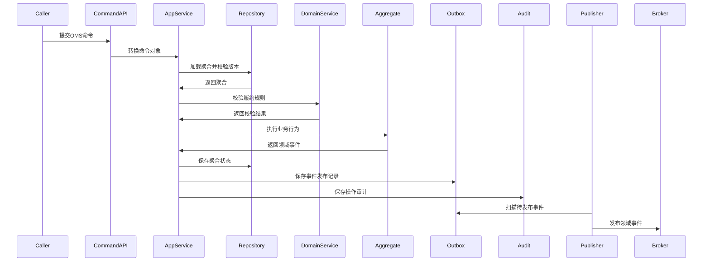

### 8.2 渠道订单接入与审单

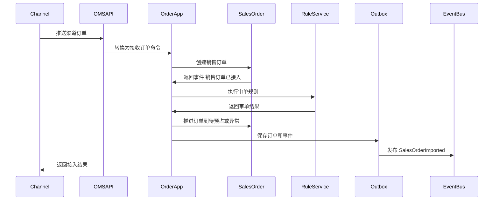

### 8.3 审核通过到库存预占

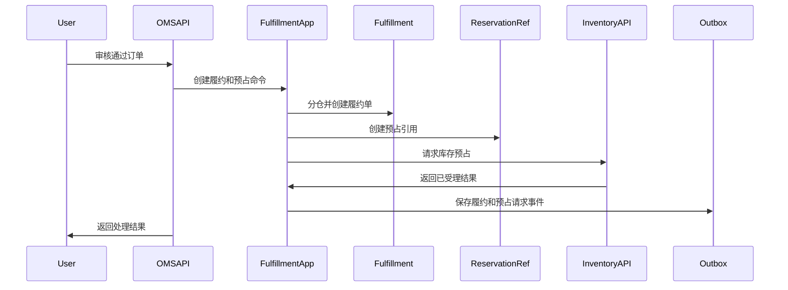

### 8.4 库存预占成功后自动下发 WMS

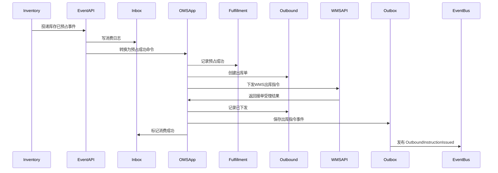

### 8.5 库存预占失败进入缺货处理

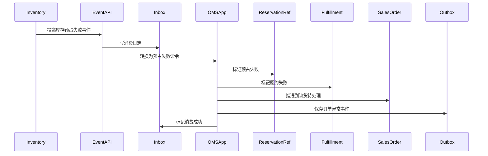

### 8.6 WMS 发货回传

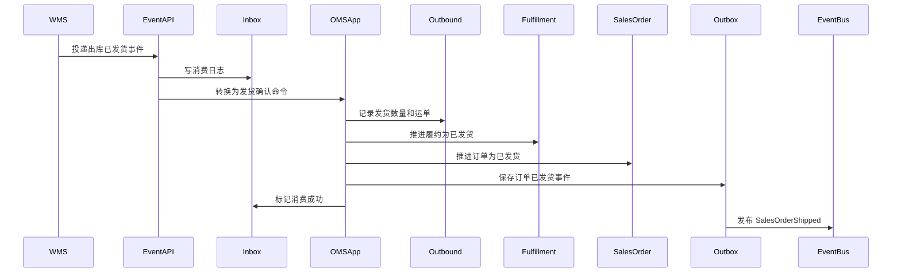

### 8.7 取消申请与库存释放

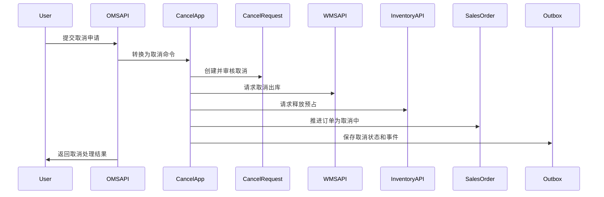

### 8.8 WMS 取消成功后完成取消

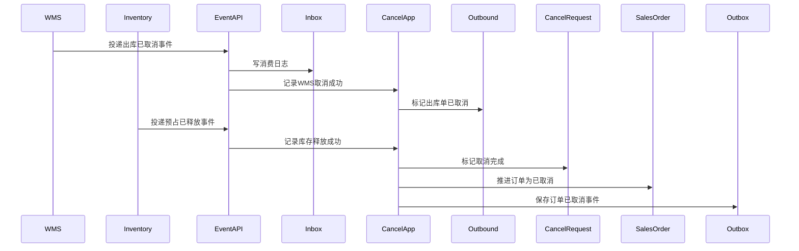

### 8.9 售后审核、退货和退款

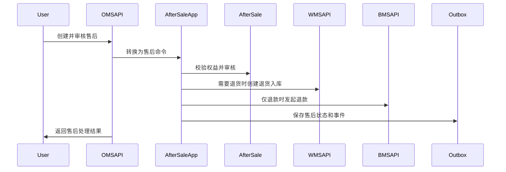

### 8.10 退货验收后退款或补发

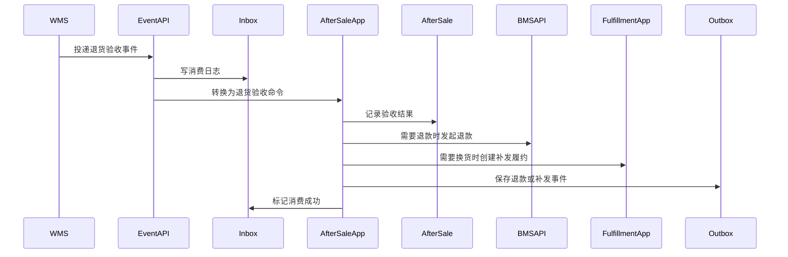

## 9. 失败、幂等和补偿

| 场景 | 风险 | 处理规则 |
| --- | --- | --- |
| 渠道订单重复推送 | 生成重复订单 | 使用 `channelCode + shopCode + externalOrderNo` 幂等，返回原订单 |
| 审单失败 | 订单无法履约 | 订单进入异常待处理，修正地址/商品/价格后重审或关闭 |
| 分仓失败 | 无可发仓 | 换仓、拆单、等待补货或人工处理 |
| 库存预占失败 | 订单无法履约 | 订单进入缺货待处理，运营可换仓、拆单、补货等待或取消 |
| OMS 下发 WMS 失败 | 已预占但未作业 | 重试下发；超过时限释放预占并生成异常 |
| WMS 短拣 | 实发小于预占 | 重新履约、释放差额、转缺货或售后 |
| 已发货取消 | 普通取消不可行 | 取消申请转售后流程 |
| WMS 已发货但 OMS 未消费事件 | 订单状态滞后 | `oms_event_consume_log.consume_status=4` 后重试，人工按 WMS 单号重放 |
| BMS 退款失败 | 售后无法完成 | 售后进入异常待处理，BMS 重试或人工财务处理 |
| Outbox 发布失败 | 下游读模型或外部系统滞后 | `oms_domain_event.event_status=4`，发布任务重试，超过阈值进入死信和人工重放 |
| 外部事件重复投递 | 重复推进状态 | `oms_event_consume_log` 唯一键拦截，成功消费直接返回幂等命中 |

幂等键建议：

| 场景 | 幂等键 |
| --- | --- |
| 渠道订单接入 | `channelCode + shopCode + externalOrderNo` |
| 手工创建订单 | `operatorId + externalOrderNo + createAt` |
| 审核订单 | `salesOrderNo + auditVersion` |
| 分仓履约 | `salesOrderNo + allocateVersion` |
| 库存预占 | `OMS + fulfillmentOrderNo + reserveVersion` |
| 释放预占 | `reservationNo + releaseReason + sourceEventId` |
| 创建出库单 | `fulfillmentOrderNo + outboundType + version` |
| 下发 WMS | `OMS + outboundOrderNo + releaseVersion` |
| 取消 WMS | `OMS + outboundOrderNo + cancelVersion` |
| 创建取消申请 | `salesOrderNo + cancelSource + sourceCancelNo` |
| 创建售后 | `salesOrderNo + afterSaleType + sourceAfterSaleNo` |
| 发起退款 | `afterSaleNo + refundVersion` |
| 补发 | `afterSaleNo + reshipVersion` |
| 事件消费 | `sourceContext + eventId + aggregateId` |

## 10. 事件到表和聚合映射

| 类型 | 事件 | 聚合/服务 | 主要表 |
| --- | --- | --- | --- |
| 生产 | `SalesOrderImported`、`SalesOrderCreated` | 销售订单聚合 | `oms_sales_order`、`oms_sales_order_line`、`oms_order_result`、`oms_domain_event` |
| 生产 | `SalesOrderApproved`、`SalesOrderExceptionMarked` | 销售订单聚合、审单服务 | `oms_sales_order`、`oms_order_result`、`oms_domain_event` |
| 生产 | `FulfillmentOrderCreated`、`FulfillmentWarehouseAllocated` | 履约单聚合 | `oms_fulfillment`、`oms_fulfillment_line`、`oms_domain_event` |
| 生产 | `StockReservationRequested` | 履约单聚合、库存预占引用 | `oms_stock_reservation`、`oms_fulfillment`、`oms_domain_event` |
| 消费后生产 | `OutboundOrderCreated`、`OutboundInstructionIssued` | 出库单聚合 | `oms_outbound`、`oms_outbound_line`、`oms_event_consume_log`、`oms_domain_event` |
| 生产 | `FulfillmentOrderCanceled` | 履约单聚合、取消应用服务 | `oms_fulfillment`、`oms_stock_reservation`、`oms_outbound`、`oms_domain_event` |
| 生产 | `CancelRequestCreated`、`SalesOrderCanceled` | 取消申请聚合、销售订单聚合 | `oms_cancel`、`oms_sales_order`、`oms_domain_event` |
| 生产 | `AfterSaleCreated`、`AfterSaleApproved` | 售后单聚合 | `oms_after_sale`、`oms_after_sale_line`、`oms_domain_event` |
| 生产 | `RefundRequested` | 售后单聚合 | `oms_after_sale`、`oms_after_sale_line`、`oms_domain_event` |
| 生产 | `ReshipmentRequested` | 售后单聚合、履约应用服务 | `oms_after_sale`、`oms_sales_order`、`oms_fulfillment`、`oms_domain_event` |
| 生产 | `OmsRulePublished` | OMS 规则配置聚合 | `oms_oms_rule`、`oms_domain_event` |
| 消费 | `InventoryReserved`、`InventoryReservationFailed`、`InventoryReservationReleased`、`InventoryDeducted` | 库存事件消费服务 | `oms_event_consume_log`、`oms_stock_reservation`、`oms_fulfillment`、`oms_sales_order` |
| 消费 | `OutboundOrderCreated`、`PickTaskShortPicked`、`OutboundOrderShipped`、`OutboundOrderCanceled` | WMS 事件消费服务 | `oms_event_consume_log`、`oms_outbound`、`oms_fulfillment`、`oms_sales_order`、`oms_cancel` |
| 消费 | `ReturnInboundInspected` | 售后事件消费服务 | `oms_event_consume_log`、`oms_after_sale`、`oms_after_sale_line` |
| 消费 | `RefundCompleted`、`RefundFailed` | BMS 事件消费服务 | `oms_event_consume_log`、`oms_after_sale`、`oms_sales_order` |
| 消费 | `ShipmentSigned` | 物流事件消费服务 | `oms_event_consume_log`、`oms_outbound`、`oms_fulfillment`、`oms_sales_order` |
| 消费 | `SkuEnabled`、`SkuDisabled`、`CustomerEnabled`、`WarehouseEnabled`、`CarrierEnabled` | 主数据事件消费服务 | `oms_event_consume_log`、OMS 引用缓存或读模型 |

## 11. 设计结论

OMS 事件设计的核心是订单履约编排，而不是库存、仓储或财务事实本身：

1. 渠道和客服把订单、取消、售后请求交给 OMS；OMS 负责幂等、审单、分仓、状态机和异常入口。
2. OMS 请求中央库存预占和释放库存，但不直接修改库存余额。
3. OMS 下发 WMS 出库和退货入库指令，但不执行仓内收货、拣货、复核、包装和发货。
4. OMS 发起退款请求给 BMS，但不拥有财务入账和退款最终事实。
5. OMS 消费库存、WMS、BMS、物流和主数据事件后，只更新自己拥有的订单履约状态、售后状态和读模型。
6. `oms_domain_event` 保证 OMS 领域事件可靠发布，`oms_event_consume_log` 保证外部事件幂等消费，`oms_operation_audit_log` 保证关键订单履约动作可追溯。

