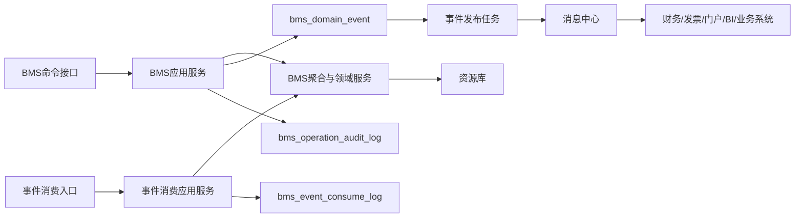
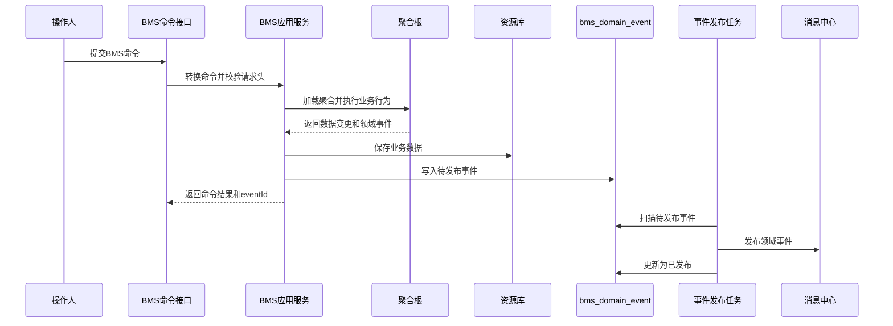
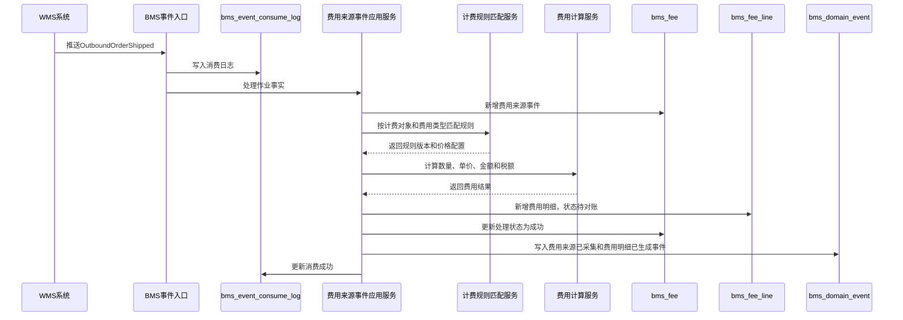
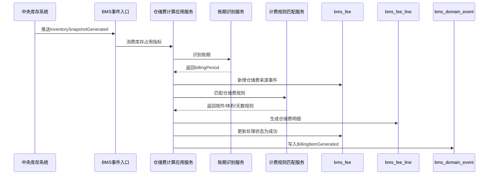
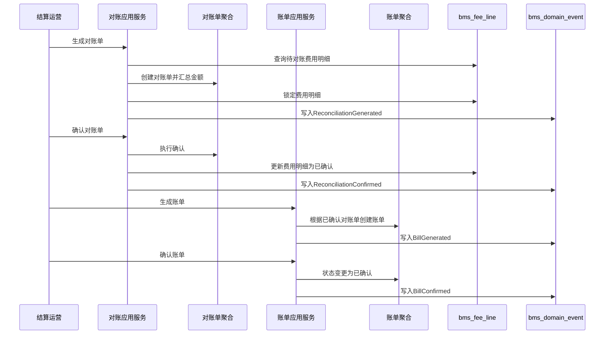
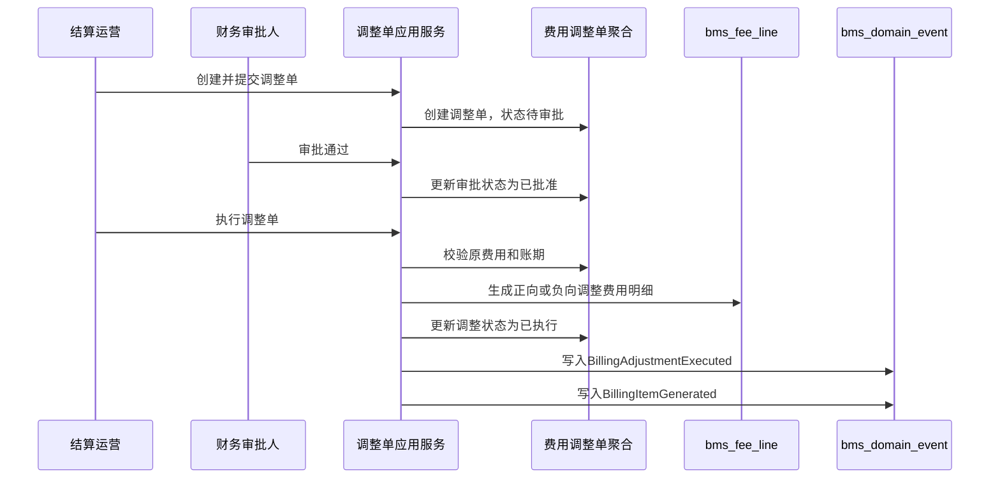
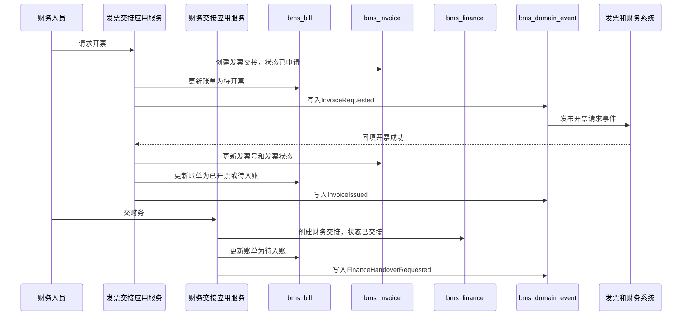
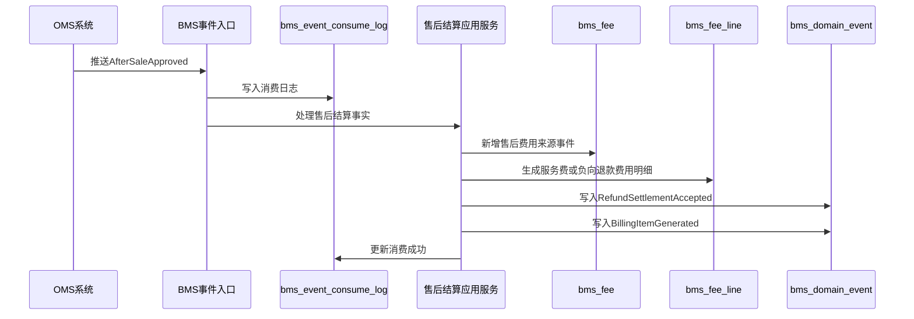
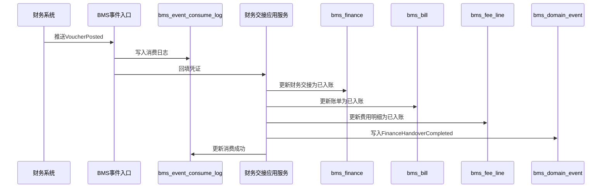
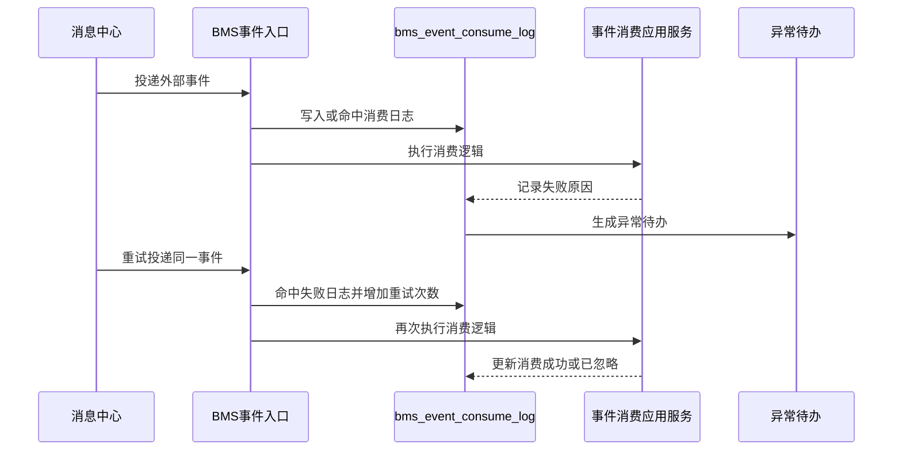

# 06 BMS系统事件生产与消费设计

> 本文根据 [BMS领域模型](../03-核心业务模型/06-BMS领域模型/01-BMS领域模型.md)、[BMS系统产品功能设计](../04-子系统功能设计/BMS系统/BMS系统产品功能设计.md)、[BMS系统数据库设计](../05-子系统数据库设计/06-BMS系统数据库设计.md)、[BMS系统接口设计](../06-子系统接口设计/60-BMS系统接口设计.md) 和 [上下文映射与领域事件目录](../06-子系统接口设计/50-上下文映射与领域事件目录.md) 整理。本文专门说明 BMS 在聚合、领域服务、应用服务执行命令后如何生产事件，消费外部事件后如何改变费用、对账、账单、发票和财务交接数据，事件包含哪些字段属性，以及事件如何落表、发布、重试和审计。

## 1. 设计范围

| 类型 | 范围 |
| --- | --- |
| 事件生产 | 计费对象、计费规则、费用来源事件、费用明细、费用调整单、对账单、账单、发票交接、财务交接等聚合执行命令后产生领域事件 |
| 事件消费 | 消费主数据、WMS、OMS、中央库存、TMS、财务系统发布的客户、货主、供应商、物流商、仓内作业、库存占用、售后退款、物流签收、发票和凭证事件 |
| 事件存储 | 本地领域事件发布表 `bms_domain_event`、事件消费幂等日志 `bms_event_consume_log`、操作审计表 `bms_operation_audit_log` |
| 不包含 | WMS 仓内作业执行、OMS 订单履约编排、中央库存余额记账、TMS 运单轨迹、税控开票实现、财务总账凭证生成 |

## 2. DDD 对齐说明

| 领域驱动设计项 | 对齐口径 |
| --- | --- |
| 限界上下文 | BMS 上下文 |
| 数据主权 | BMS 拥有计费对象、计费规则、费用来源事件处理状态、费用明细、调整单、对账单、账单、发票交接和财务交接状态 |
| 外部事实主权 | WMS 拥有仓内作业完成事实；OMS 拥有订单、售后、退款申请事实；中央库存拥有库存占用和调整事实；TMS 拥有运输签收事实；财务系统拥有发票和凭证事实；主数据拥有客户、货主、供应商、物流商权威 |
| 事件生产位置 | 聚合根执行业务行为成功后返回领域事件；应用服务在同一事务中保存业务数据、领域事件和操作日志 |
| 事件消费位置 | 事件入口属于接口层；事件消费应用服务负责幂等、权限和事务编排；聚合和领域服务负责识别计费对象、匹配规则、生成费用和推进结算状态 |
| 一致性 | 单个计费对象、规则、来源事件、费用明细、调整单、对账单、账单、发票交接、财务交接聚合内部强一致；BMS 与业务源系统、财务系统通过事件最终一致 |
| 核心原则 | BMS 只沉淀“可结算事实”和“结算结果”，不反向篡改源系统业务事实；已确认、已开票、已入账的数据通过调整和补偿处理，不直接改历史 |

## 3. 事件处理架构



处理规则：

1. 页面、开放接口、内部接口或定时任务进入 BMS 命令接口，接口层转换为命令对象。
2. 应用服务校验登录态、菜单权限、按钮权限、组织、货主、计费对象、账期、幂等键和乐观锁。
3. 应用服务加载计费对象、计费规则、费用来源事件、费用明细、调整单、对账单、账单、发票交接或财务交接聚合。
4. 聚合根执行业务行为，必要时调用计费规则匹配、费用计算、对账汇总、账单金额校验、财务交接校验等领域服务。
5. 聚合根修改状态、金额、税额、账期、来源引用、确认人、开票信息、凭证信息和版本，并返回领域事件。
6. 应用服务在同一事务中保存业务表、`bms_domain_event` 和 `bms_operation_audit_log`。
7. 事件发布任务异步扫描 `bms_domain_event`，投递成功后更新发布状态。
8. 外部事件进入 `/internal/bms/v1/events` 后先写 `bms_event_consume_log`，再由消费应用服务处理。

## 4. 事件标准载荷

### 4.1 通用事件信封

```json
{
  "eventId": "EVT-BMS-202607040001",
  "eventType": "BillingItemGenerated",
  "eventName": "费用明细已生成",
  "eventVersion": "1.0",
  "sourceContext": "BMS",
  "sourceSystem": "BMS",
  "aggregateType": "BillingItem",
  "aggregateId": "190001",
  "aggregateNo": "BI202607040001",
  "aggregateVersion": 3,
  "businessKey": "WMS:OB202607040001:OUTBOUND",
  "idempotencyKey": "BMS:WMS:EVT-WMS-202607040001:OUTBOUND_FEE:3:2026-07",
  "occurredAt": "2026-07-04T10:00:00+08:00",
  "operatorId": "SYSTEM",
  "ownerId": "OWNER001",
  "billingObjectCode": "OWNER001",
  "settlementDirection": 1,
  "billingPeriod": "2026-07",
  "traceId": "TRACE202607040001",
  "payload": {}
}
```

### 4.2 通用字段属性

| 字段 | 类型 | 必填 | 说明 |
| --- | --- | --- | --- |
| `eventId` | string | 是 | 全局唯一事件 ID，写入 `bms_domain_event.event_code` |
| `eventType` | string | 是 | 稳定事件类型，如 `BillingItemGenerated` |
| `eventName` | string | 是 | 中文事件名 |
| `eventVersion` | string | 是 | 事件结构版本 |
| `sourceContext` | string | 是 | 来源限界上下文 |
| `sourceSystem` | string | 是 | 来源系统 |
| `aggregateType` | string | 是 | 聚合类型 |
| `aggregateId` | string | 是 | 聚合技术 ID |
| `aggregateNo` | string | 否 | 计费对象编码、规则编码、费用明细号、对账单号、账单号、发票交接号或财务交接号 |
| `aggregateVersion` | int | 是 | 聚合版本 |
| `businessKey` | string | 是 | 业务主键，通常由来源系统、来源事件、来源单号和费用类型组成 |
| `idempotencyKey` | string | 是 | 消费幂等键或命令幂等键 |
| `occurredAt` | datetime | 是 | 结算事实发生时间 |
| `operatorId` | string | 否 | 操作人；系统任务传系统账号 |
| `ownerId` | string | 多货主必填 | 货主 ID |
| `billingObjectCode` | string | 是 | 计费对象编码 |
| `settlementDirection` | int | 是 | `1` 应收，`2` 应付 |
| `billingPeriod` | string | 费用/对账/账单必填 | 账期，如 `2026-07` |
| `traceId` | string | 否 | 链路追踪 ID |
| `payload` | object | 是 | 业务载荷 |

### 4.3 BMS 业务载荷必备字段

| 字段 | 使用场景 | 说明 |
| --- | --- | --- |
| `objectCode`、`objectName`、`objectType` | 计费对象 | 计费主体，支持客户、货主、供应商、物流商 |
| `ruleCode`、`ruleVersion`、`feeType`、`pricingMethod` | 计费规则、费用明细 | 标识费用由哪条规则计算 |
| `sourceSystem`、`sourceEventId`、`sourceEventType`、`sourceOrderNo` | 费用来源事件 | 追溯业务事实来源和幂等处理 |
| `bizType`、`metrics` | 费用来源事件 | 入库、出库、存储、运输、退货、售后等业务类型，以及件数、重量、体积、天数等计费指标 |
| `billingItemNo`、`quantity`、`unitPrice` | 费用明细 | 费用明细号、计费数量、单价 |
| `amount`、`taxRate`、`taxAmount`、`taxIncludedAmount` | 费用明细、调整、对账、账单、发票、财务交接 | 金额、税率、税额、含税金额 |
| `adjustmentNo`、`adjustmentType`、`adjustmentReason` | 调整单 | 减免、补收、冲减、修正原因 |
| `reconciliationNo`、`diffAmount`、`confirmedAmount` | 对账单 | 对账差异和确认金额 |
| `billNo`、`billStatus`、`needInvoice` | 账单 | 账单状态和是否需要开票 |
| `invoiceNo`、`invoiceNumber`、`invoiceFileUrl` | 发票交接 | 开票交接号、发票号码、发票附件 |
| `handoverNo`、`voucherNo`、`postedAt` | 财务交接 | 财务交接号、凭证号、入账时间 |
| `beforeStatus`、`afterStatus` | 状态变更事件 | 状态机前后状态 |
| `reasonCode`、`reasonName`、`failReason` | 异常和补偿 | 作废、忽略、重放、失败原因 |

## 5. 事件存储设计

### 5.1 领域事件发布表 `bms_domain_event`

`bms_domain_event` 是 BMS 的 Outbox 表。费用和结算命令成功后，应用服务在业务事务内写入。

| 字段 | 作用 | 写入规则 |
| --- | --- | --- |
| `event_id` | 技术主键 | 雪花 ID 或数据库 ID |
| `event_code` | 全局事件编码 | 对应 `eventId`，唯一 |
| `event_name` | 中文事件名 | 如 `费用明细已生成` |
| `event_type` | 稳定事件类型 | 如 `BillingItemGenerated` |
| `aggregate_type` | 聚合类型 | 如 `BillingRule`、`BillingItem`、`Bill` |
| `aggregate_id` | 聚合 ID | 写聚合根 ID |
| `aggregate_no` | 业务单号 | 写计费对象编码、规则编码、费用明细号、对账单号、账单号、发票交接号或财务交接号 |
| `source_system` | 来源系统 | 本系统生产固定为 `BMS` |
| `payload_json` | 事件完整载荷 | 保存事件信封和业务 `payload` |
| `event_status` | 发布状态 | `1` 待发布、`2` 发布中、`3` 已发布、`4` 发布失败、`5` 已取消 |
| `retry_count` | 重试次数 | 发布失败递增 |
| `fail_reason` | 失败原因 | 记录消息投递异常 |
| `occurred_at` | 业务发生时间 | 费用或结算事实发生时间 |
| `published_at` | 发布时间 | 发布成功后写入 |

### 5.2 事件消费日志 `bms_event_consume_log`

`bms_event_consume_log` 是 BMS 消费外部事件的 Inbox/幂等表。唯一键为 `source_system + event_code + consumer_name`。

| 字段 | 作用 | 写入规则 |
| --- | --- | --- |
| `consume_log_id` | 消费日志主键 | 雪花 ID 或数据库 ID |
| `event_code` | 外部事件编码 | 来自外部 `eventId` |
| `source_system` | 来源系统 | `MDM`、`WMS`、`OMS`、`INVENTORY`、`TMS`、`FINANCE` |
| `consumer_name` | 消费者名称 | 如 `BmsWmsOperationFactConsumer` |
| `idempotent_key` | 业务幂等键 | 如 `WMS:{eventId}:{sourceOrderNo}:{eventType}` |
| `consume_status` | 消费状态 | `1` 待消费、`2` 处理中、`3` 消费成功、`4` 消费失败、`5` 已忽略 |
| `retry_count` | 重试次数 | 消费失败重试时递增 |
| `fail_reason` | 失败原因 | 保存领域规则失败或系统异常 |
| `consumed_at` | 完成时间 | 消费成功或忽略后写入 |

### 5.3 操作审计表 `bms_operation_audit_log`

BMS 的审计要覆盖计费、费用、调整、对账、账单、开票、财务交接和事件重放。

| 场景 | 审计内容 |
| --- | --- |
| 页面写操作 | 操作人、菜单权限、按钮权限、组织、货主、计费对象、请求摘要、前后状态 |
| 来源事件消费 | 来源系统、来源事件、来源单号、幂等键、消费结果、失败原因 |
| 费用计算 | 规则编码、规则版本、指标、单价、金额、税额、费用明细号 |
| 对账和账单 | 对账单号、账单号、账期、确认人、确认金额、差异金额 |
| 发票和财务 | 发票交接号、发票号码、财务交接号、凭证号、入账时间 |
| 失败和补偿 | 异常类型、责任方、是否可重试、重放/忽略/调整动作、人工待办编号 |

## 6. BMS 事件生产

### 6.1 生产事件总览

| 聚合/服务 | 命令 | 数据变化 | 生产事件 | 主要消费者 |
| --- | --- | --- | --- | --- |
| 计费对象聚合 | 创建计费对象 | 新增 `bms_billing`，状态启用或停用 | `BillingObjectCreated` | BMS 读模型、BI、审计 |
| 计费对象聚合 | 启用计费对象 | `bms_billing.status -> 1` | `BillingObjectEnabled` | 费用计算、BI |
| 计费规则聚合 | 发布计费规则 | `bms_billing_rule.status: 1 -> 2`，规则版本生效 | `BillingRulePublished` | 费用计算、BI |
| 费用来源事件聚合 | 采集来源事件 | 新增或幂等命中 `bms_fee`，处理状态待处理 | `BillingSourceEventCollected` | 费用计算、BI |
| 费用来源事件领域服务 | 识别可计费事实 | `bms_fee.process_status -> 2` 或失败；生成指标快照 | `BillableFactIdentified` | 费用计算 |
| 费用明细聚合 | 生成费用明细 | 新增 `bms_fee_line`，状态待对账 | `BillingItemGenerated` | 对账、BI、财务预估 |
| 费用明细聚合 | 重算费用明细 | 更新数量、单价、金额、税额和规则版本 | `BillingItemRecalculated` | 对账、BI |
| 费用明细聚合 | 作废费用明细 | `bms_fee_line.billing_status -> 7` | `BillingItemVoided` | 对账、BI |
| 费用调整单聚合 | 执行调整单 | `bms_adjustment.adjustment_status -> 3`；生成调整费用明细 | `BillingAdjustmentExecuted`、`BillingItemGenerated` | 对账、BI |
| 对账单聚合 | 生成对账单 | 新增 `bms_reconcile`；锁定待对账费用明细 | `ReconciliationGenerated` | 外部门户、财务、BI |
| 对账单聚合 | 确认对账单 | `bms_reconcile.recon_status -> 4`；费用明细进入已确认 | `ReconciliationConfirmed` | 账单、财务、BI |
| 账单聚合 | 生成账单 | 新增 `bms_bill`，状态草稿或待确认 | `BillGenerated` | 财务、外部门户、BI |
| 账单聚合 | 确认账单 | `bms_bill.bill_status -> 4` | `BillConfirmed` | 发票、财务、BI |
| 发票交接聚合 | 请求开票 | 新增 `bms_invoice`；账单进入待开票 | `InvoiceRequested` | 发票系统、财务 |
| 发票交接聚合 | 回填开票结果 | `bms_invoice.invoice_status -> 3`；账单进入已开票或待入账 | `InvoiceIssued` | 财务、外部门户、BI |
| 财务交接聚合 | 交财务 | 新增 `bms_finance`；账单进入待入账 | `FinanceHandoverRequested` | 财务系统 |
| 财务交接聚合 | 回填凭证 | `bms_finance.finance_handover_status -> 3`；账单进入已入账；费用明细进入已入账 | `FinanceHandoverCompleted` | OMS、财务、BI |
| 财务交接聚合 | 标记交接失败 | `bms_finance.finance_handover_status -> 4` | `FinanceHandoverFailed` | BMS 待办、BI |

### 6.2 费用来源采集与费用明细事件

| 项 | 设计 |
| --- | --- |
| 触发命令 | 采集来源事件、重放来源事件、忽略来源事件、重算来源事件 |
| 发起角色/系统 | WMS、OMS、中央库存、TMS、结算运营、系统重试任务 |
| 应用服务 | 费用来源事件应用服务、费用计算应用服务 |
| 聚合/领域服务 | 费用来源事件聚合、费用明细聚合、计费规则匹配服务、费用计算服务、账期识别服务 |
| 事件类型 | `BillingSourceEventCollected`、`BillableFactIdentified`、`BillingItemGenerated`、`BillingItemRecalculated`、`BillingItemVoided` |
| 存储表 | `bms_fee`、`bms_fee_line`、`bms_domain_event`、`bms_operation_audit_log` |

数据变化：

| 表/模型 | 字段变化 |
| --- | --- |
| `bms_fee` | 新增来源事件；写 `source_system`、`source_order_no`、`biz_type`、`received_at`；处理成功时 `process_status=2`，失败时 `process_status=3` 并写 `fail_reason` |
| `bms_fee_line` | 按费用类型和规则版本生成费用明细；写 `billing_item_no`、`settlement_direction`、`fee_type`、`quantity`、`unit_price`、`amount`、`tax_rate`、`tax_amount`、`tax_included_amount`、`billing_period`、`billing_status=3` |
| `bms_domain_event` | 写来源事件已采集、可计费事实已识别、费用明细已生成或重算事件 |
| `bms_operation_audit_log` | 记录采集、重放、忽略、重算和费用计算过程 |

事件载荷：

| 字段 | 说明 |
| --- | --- |
| `sourceSystem`、`sourceEventId`、`sourceEventType`、`sourceOrderNo` | 来源事实追溯 |
| `billingObjectCode`、`settlementDirection` | 计费对象和收付方向 |
| `bizType`、`feeType` | 业务类型和费用类型 |
| `ruleCode`、`ruleVersion`、`pricingMethod` | 命中的计费规则 |
| `metrics` | 计费指标，如件数、重量、体积、存储天数、包材数量 |
| `quantity`、`unitPrice`、`amount`、`taxRate`、`taxAmount`、`taxIncludedAmount` | 费用计算结果 |
| `billingPeriod`、`billingItemNo`、`beforeStatus`、`afterStatus` | 账期、费用明细号和状态变化 |

### 6.3 计费规则发布事件

| 项 | 设计 |
| --- | --- |
| 触发命令 | 创建规则、修改规则、发布规则、停用规则、复制规则 |
| 发起角色/系统 | 结算运营、管理员 |
| 应用服务 | 计费规则应用服务 |
| 聚合/领域服务 | 计费规则聚合、规则冲突校验服务、规则生效期校验服务 |
| 事件类型 | `BillingRuleCreated`、`BillingRulePublished`、`BillingRuleDisabled` |
| 存储表 | `bms_billing_rule`、`bms_domain_event`、`bms_operation_audit_log` |

数据变化：

| 表/模型 | 字段变化 |
| --- | --- |
| `bms_billing_rule` | 新增或更新规则；发布时 `status=2`；写 `fee_type`、`pricing_method`、`price_config`、`tax_rate`、`effective_from`、`effective_to`、`rule_version` |
| `bms_domain_event` | 写规则创建、发布、停用事件 |
| `bms_operation_audit_log` | 记录规则变更前后差异 |

事件载荷：

| 字段 | 说明 |
| --- | --- |
| `ruleCode`、`ruleName`、`ruleVersion` | 规则身份和版本 |
| `billingObjectCode`、`settlementDirection` | 规则适用计费对象和收付方向 |
| `feeType`、`pricingMethod`、`priceConfig` | 费用类型、计价方式和价格配置 |
| `effectiveFrom`、`effectiveTo` | 生效区间 |
| `beforeStatus`、`afterStatus` | 状态变化 |

### 6.4 调整、对账和账单事件

| 项 | 设计 |
| --- | --- |
| 触发命令 | 创建调整单、提交调整单、审批调整单、执行调整单、生成对账单、确认对账单、生成账单、确认账单 |
| 发起角色/系统 | 结算运营、财务、客户/货主、供应商、物流商 |
| 应用服务 | 调整单应用服务、对账应用服务、账单应用服务 |
| 聚合/领域服务 | 费用调整单聚合、对账单聚合、账单聚合、金额汇总服务、账期关闭校验服务 |
| 事件类型 | `BillingAdjustmentExecuted`、`BillingItemGenerated`、`ReconciliationGenerated`、`ReconciliationConfirmed`、`BillGenerated`、`BillConfirmed` |
| 存储表 | `bms_adjustment`、`bms_fee_line`、`bms_reconcile`、`bms_bill`、`bms_domain_event`、`bms_operation_audit_log` |

数据变化：

| 表/模型 | 字段变化 |
| --- | --- |
| `bms_adjustment` | 提交后进入待审批；审批通过后可执行；执行后 `adjustment_status=3`，写 `executed_at` |
| `bms_fee_line` | 调整执行后生成正向或负向调整明细；生成对账单时被锁定；确认对账后 `billing_status=5` |
| `bms_reconcile` | 生成对账单时写总金额、税额、含税金额、差异金额；确认后 `recon_status=4` |
| `bms_bill` | 根据已确认对账单生成账单；确认后 `bill_status=4` |
| `bms_domain_event` | 写调整执行、费用生成、对账生成、对账确认、账单生成、账单确认事件 |

事件载荷：

| 字段 | 说明 |
| --- | --- |
| `adjustmentNo`、`adjustmentType`、`adjustmentReason`、`adjustmentAmount` | 调整单关键信息 |
| `generatedBillingItemNo` | 调整后生成的费用明细 |
| `reconciliationNo`、`reconciliationStatus`、`confirmedAmount`、`diffAmount` | 对账结果 |
| `billNo`、`billStatus`、`billAmount`、`needInvoice` | 账单结果 |
| `billingItemNos` | 被对账或入账的费用明细集合 |

### 6.5 发票和财务交接事件

| 项 | 设计 |
| --- | --- |
| 触发命令 | 请求开票、回填发票、作废发票交接、交财务、回填凭证、标记财务交接失败 |
| 发起角色/系统 | 结算运营、财务、发票系统、财务系统 |
| 应用服务 | 发票交接应用服务、财务交接应用服务 |
| 聚合/领域服务 | 发票交接聚合、财务交接聚合、开票金额校验服务、入账一致性校验服务 |
| 事件类型 | `InvoiceRequested`、`InvoiceIssued`、`FinanceHandoverRequested`、`FinanceHandoverCompleted`、`FinanceHandoverFailed` |
| 存储表 | `bms_invoice`、`bms_finance`、`bms_bill`、`bms_fee_line`、`bms_domain_event`、`bms_operation_audit_log` |

数据变化：

| 表/模型 | 字段变化 |
| --- | --- |
| `bms_invoice` | 请求开票时新增发票交接；回填后 `invoice_status=3`，写发票号、开票金额、附件 |
| `bms_finance` | 交财务时新增财务交接；回填凭证后 `finance_handover_status=3`；失败时 `finance_handover_status=4` |
| `bms_bill` | 请求开票后进入待开票；开票后进入已开票或待入账；交财务后进入待入账；凭证回填后进入已入账 |
| `bms_fee_line` | 财务入账完成后 `billing_status=6` |
| `bms_domain_event` | 写开票请求、开票完成、财务交接请求、财务交接完成或失败事件 |

事件载荷：

| 字段 | 说明 |
| --- | --- |
| `invoiceNo`、`billNo`、`invoiceAmount`、`invoiceNumber`、`invoiceFileUrl` | 发票交接信息 |
| `handoverNo`、`handoverAmount`、`voucherNo`、`postedAt` | 财务交接和入账信息 |
| `beforeStatus`、`afterStatus`、`failReason` | 状态变化和失败原因 |

## 7. BMS 事件消费

### 7.1 消费事件总览

| 事件 | 来源上下文 | 消费动作 | 修改数据 | 消费失败补偿 |
| --- | --- | --- | --- | --- |
| `CustomerEnabled` | 主数据 | 创建或启用客户应收计费对象候选 | `bms_billing` | 事件重放或人工补建 |
| `OwnerEnabled` | 主数据 | 创建或启用货主应收/应付计费对象候选 | `bms_billing` | 事件重放 |
| `SupplierEnabled` | 主数据 | 创建供应商应付计费对象候选 | `bms_billing` | 事件重放 |
| `CarrierEnabled` | 主数据 | 创建物流商应付计费对象候选 | `bms_billing` | 事件重放 |
| `InboundOrderPutawayCompleted` | WMS | 采集入库费、上架费、增值服务费来源事件 | `bms_fee`、`bms_fee_line` | 重放来源事件 |
| `OutboundOrderShipped` | WMS | 采集出库费、耗材费、运输交接费来源事件 | `bms_fee`、`bms_fee_line` | 重放来源事件 |
| `ReturnInboundInspected` | WMS | 采集售后退货质检费、退货入库费 | `bms_fee`、`bms_fee_line` | 标记异常待处理 |
| `InventorySnapshotGenerated` | 中央库存 | 采集仓储费库存占用指标 | `bms_fee`、`bms_fee_line` | 账期重算 |
| `InventoryAdjusted` | 中央库存 | 采集盘点差异或库存调整费用依据 | `bms_fee` | 人工确认是否计费 |
| `AfterSaleApproved` | OMS | 采集售后服务费或退款结算事实 | `bms_fee`、`bms_fee_line` | OMS 重推或人工补录 |
| `RefundCompleted` | OMS/财务 | 更新退款结算状态 | `bms_fee_line`、`bms_bill` | 对账差异处理 |
| `ShipmentSigned` | TMS | 采集物流费结算依据 | `bms_fee`、`bms_fee_line` | 运费账单对账 |
| `InvoiceIssued` | 财务/发票系统 | 回填发票号和附件 | `bms_invoice`、`bms_bill` | 人工回填 |
| `VoucherPosted` | 财务系统 | 回填凭证和入账时间 | `bms_finance`、`bms_bill`、`bms_fee_line` | 财务交接失败待办 |

### 7.2 主数据事件消费

| 项 | 设计 |
| --- | --- |
| 消费事件 | `CustomerEnabled`、`OwnerEnabled`、`SupplierEnabled`、`CarrierEnabled` |
| 消费者 | 计费对象事件消费者 |
| 应用服务 | 计费对象应用服务 |
| 聚合/领域服务 | 计费对象聚合、计费对象唯一性校验服务 |
| 数据变化 | 新增或启用 `bms_billing`；写对象编码、对象名称、对象类型、结算方向、结算周期、税率、币种、状态 |
| 生产事件 | `BillingObjectCreated`、`BillingObjectEnabled` |

消费规则：

1. 按 `sourceSystem + eventId + consumerName` 写入 `bms_event_consume_log`。
2. 按主数据对象编码查询 `bms_billing`。
3. 不存在则创建计费对象候选；存在且停用则按业务配置决定是否自动启用。
4. 对象类型决定默认结算方向：客户/货主多为应收，供应商/物流商多为应付；实际以计费对象配置为准。
5. 创建或启用成功后写 `bms_domain_event`。

### 7.3 WMS 作业事实事件消费

| 项 | 设计 |
| --- | --- |
| 消费事件 | `InboundOrderPutawayCompleted`、`OutboundOrderShipped`、`ReturnInboundInspected` |
| 消费者 | WMS 作业事实消费者 |
| 应用服务 | 费用来源事件应用服务、费用计算应用服务 |
| 聚合/领域服务 | 费用来源事件聚合、费用明细聚合、计费规则匹配服务、费用计算服务 |
| 数据变化 | 新增 `bms_fee`；匹配规则后新增 `bms_fee_line`；失败时写 `fail_reason` |
| 生产事件 | `BillingSourceEventCollected`、`BillableFactIdentified`、`BillingItemGenerated` |

消费逻辑：

1. 入库上架完成后按收货件数、上架件数、质检件数、增值服务项生成入库费、上架费、质检费或增值服务费。
2. 出库发货完成后按出库件数、包裹数、耗材、重量、体积生成出库费、打包费、耗材费或运输交接费。
3. 退货质检完成后按退货件数、质检结果、重新上架数量生成退货入库费、质检费或异常处理费。
4. 若计费对象缺失、规则未发布、账期已关闭，则 `bms_fee.process_status=3`，等待补齐主数据、规则或账期后重放。

### 7.4 中央库存事件消费

| 项 | 设计 |
| --- | --- |
| 消费事件 | `InventorySnapshotGenerated`、`InventoryAdjusted` |
| 消费者 | 库存费用事实消费者 |
| 应用服务 | 仓储费计算应用服务、费用来源事件应用服务 |
| 聚合/领域服务 | 费用来源事件聚合、费用明细聚合、仓储费计算服务、账期识别服务 |
| 数据变化 | 新增 `bms_fee`；按库存占用指标生成仓储费明细；库存调整可只记录来源事件并等待人工确认 |
| 生产事件 | `BillingSourceEventCollected`、`BillableFactIdentified`、`BillingItemGenerated` |

消费逻辑：

1. 每日或账期库存快照进入 BMS 后，按货主、仓库、SKU、批次、库区、占用天数汇总计费指标。
2. 仓储费计算服务按规则区分按件、按体积、按托、按库位、按天等计价方式。
3. 费用明细以 `sourceEventId + feeType + ruleVersion + billingPeriod` 幂等，重复快照不重复计费。
4. 库存调整事件默认只记录费用来源事件；是否生成赔付、差异处理费或其他费用，由结算运营确认后触发重算或调整单。

### 7.5 OMS 售后和退款事件消费

| 项 | 设计 |
| --- | --- |
| 消费事件 | `AfterSaleApproved`、`RefundCompleted` |
| 消费者 | OMS 售后结算消费者 |
| 应用服务 | 售后结算应用服务、费用来源事件应用服务 |
| 聚合/领域服务 | 费用来源事件聚合、费用明细聚合、退款结算服务 |
| 数据变化 | 售后审核通过后生成售后服务费或退款结算来源事件；退款完成后更新相关费用明细、账单或退款交接状态 |
| 生产事件 | `RefundSettlementAccepted`、`BillingSourceEventCollected`、`BillingItemGenerated` |

消费逻辑：

1. 仅退款、退货退款、换货补发等售后单审核通过后，BMS 记录售后结算事实。
2. 需要退款给客户时，BMS 可以生成负向费用明细或退款结算记录，进入对账和账单链路。
3. 退款完成事件回传后，BMS 更新费用明细或账单中的退款状态；如果账单已确认，使用调整单处理差异。

### 7.6 财务和发票事件消费

| 项 | 设计 |
| --- | --- |
| 消费事件 | `InvoiceIssued`、`VoucherPosted` |
| 消费者 | 发票回填消费者、凭证回填消费者 |
| 应用服务 | 发票交接应用服务、财务交接应用服务 |
| 聚合/领域服务 | 发票交接聚合、财务交接聚合、入账一致性校验服务 |
| 数据变化 | 更新 `bms_invoice`、`bms_finance`、`bms_bill`、`bms_fee_line` |
| 生产事件 | `InvoiceIssued`、`FinanceHandoverCompleted`、`FinanceHandoverFailed` |

消费逻辑：

1. 发票系统回填开票成功后，BMS 校验发票金额不能超过账单可开票金额。
2. 校验通过后 `bms_invoice.invoice_status=3`，账单进入已开票或待入账。
3. 财务系统回填凭证后，BMS 校验凭证金额、账单金额和财务交接金额一致。
4. 校验通过后 `bms_finance.finance_handover_status=3`，`bms_bill.bill_status=8`，相关 `bms_fee_line.billing_status=6`。
5. 校验失败则记录 `FinanceHandoverFailed`，生成财务交接失败待办。

## 8. 关键时序图

### 8.1 通用命令产生事件



### 8.2 WMS 作业事实生成费用



### 8.3 库存快照生成仓储费



### 8.4 费用明细到对账单和账单



### 8.5 调整单补偿费用



### 8.6 账单开票和财务交接



### 8.7 OMS 售后退款结算



### 8.8 财务凭证回填



### 8.9 消费失败重试



## 9. 幂等、异常和补偿

### 9.1 幂等规则

| 场景 | 幂等键 |
| --- | --- |
| 外部事件消费 | `sourceSystem + eventId + consumerName` |
| 来源事件采集 | `sourceSystem + sourceEventId + sourceOrderNo + sourceEventType` |
| 费用明细生成 | `sourceEventId + feeType + ruleVersion + billingPeriod` |
| 对账单生成 | `billingObjectCode + settlementDirection + billingPeriod + bizType` |
| 账单生成 | `reconciliationNo + billingObjectCode + billingPeriod` |
| 请求开票 | `billNo + invoiceAmount + invoiceType` |
| 财务交接 | `billNo + handoverAmount + settlementDirection` |
| 凭证回填 | `financeSystem + voucherNo + handoverNo` |

### 9.2 异常处理

| 异常 | 处理方式 | 补偿动作 |
| --- | --- | --- |
| 来源事件重复 | 返回首次处理结果，不重复生成费用 | 无需补偿 |
| 计费对象不存在 | `bms_fee.process_status=3`，写失败原因 | 等主数据事件补齐后重放 |
| 计费规则未命中 | 来源事件失败，费用不生成 | 发布规则后重放或人工指定规则 |
| 账期已关闭 | 阻断费用生成、重算或调整 | 下期调整单补偿 |
| 已确认费用错误 | 不直接修改原费用 | 创建调整单，生成正向或负向调整明细 |
| 对账差异 | 对账单进入差异处理中 | 差异确认后调整或关闭 |
| 账单金额不平 | 阻断账单确认 | 回到对账或调整费用 |
| 发票金额超限 | 阻断开票回填 | 人工核对后重新回填 |
| 财务交接失败 | 财务交接状态失败，生成待办 | 修复数据后重新交财务或人工关闭 |

### 9.3 事件可靠性

1. 所有 BMS 自产事件必须先落 `bms_domain_event`，再异步发布。
2. 发布失败只影响跨系统通知，不回滚已经成功的 BMS 命令。
3. 外部事件先落 `bms_event_consume_log`，再执行业务消费，避免重复投递导致重复计费。
4. 消费失败要保留原始载荷、失败原因、重试次数和下一步动作。
5. 已确认、已开票、已入账数据不允许直接覆盖，只能通过调整、冲减或补偿单据处理。

## 10. 事件与表关系

| 事件 | 主表 | 关联表 |
| --- | --- | --- |
| `BillingObjectCreated`、`BillingObjectEnabled` | `bms_billing` | `bms_domain_event`、`bms_operation_audit_log` |
| `BillingRulePublished` | `bms_billing_rule` | `bms_domain_event`、`bms_operation_audit_log` |
| `BillingSourceEventCollected`、`BillableFactIdentified` | `bms_fee` | `bms_event_consume_log`、`bms_domain_event` |
| `BillingItemGenerated`、`BillingItemRecalculated`、`BillingItemVoided` | `bms_fee_line` | `bms_fee`、`bms_domain_event` |
| `BillingAdjustmentExecuted` | `bms_adjustment` | `bms_fee_line`、`bms_domain_event` |
| `ReconciliationGenerated`、`ReconciliationConfirmed` | `bms_reconcile` | `bms_fee_line`、`bms_domain_event` |
| `BillGenerated`、`BillConfirmed` | `bms_bill` | `bms_reconcile`、`bms_fee_line`、`bms_domain_event` |
| `InvoiceRequested`、`InvoiceIssued` | `bms_invoice` | `bms_bill`、`bms_domain_event` |
| `FinanceHandoverRequested`、`FinanceHandoverCompleted`、`FinanceHandoverFailed` | `bms_finance` | `bms_bill`、`bms_fee_line`、`bms_domain_event` |
| 外部业务事实事件 | `bms_event_consume_log` | `bms_fee`、`bms_fee_line`、`bms_operation_audit_log` |

## 11. 设计结论

BMS 的事件主线是：先消费业务源系统产生的可计费事实，再通过计费规则生成费用明细，之后进入对账、账单、发票和财务交接链路。BMS 自产事件主要表达“结算事实已经形成或状态已经推进”，外部系统不应直接修改 BMS 费用和账单，只能通过事件、接口或回调提交事实。费用错误、对账差异、开票差异和入账失败都应通过幂等重放、调整单、差异处理或财务交接补偿解决，保证 BMS 的结算历史可追溯、可审计、可对账。
