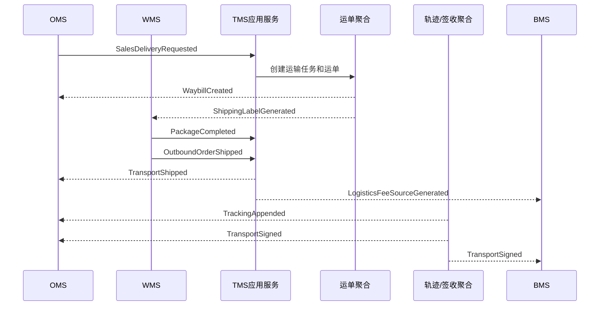
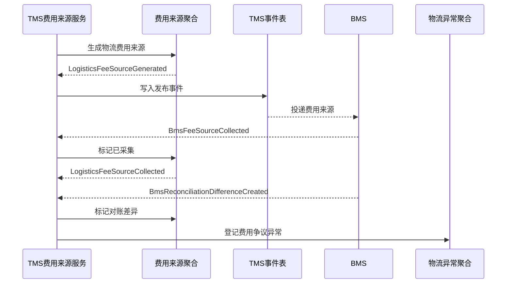

# 06-TMS系统事件生产与消费设计

> 本文根据 `docs/03-核心业务模型/06-TMS领域模型`、`docs/04-子系统功能设计/06-TMS系统/01-TMS系统产品功能设计.md`、`docs/05-子系统数据库设计/06-TMS系统数据库设计.md` 和 `docs/06-子系统接口设计/06-TMS系统接口设计.md` 整理。TMS 是运输事实源，事件表达已经发生的运输事实，不替代 OMS、WMS、中央库存、采购或 BMS 的业务主权。

## 1. 事件设计口径

| 项 | 口径 |
| --- | --- |
| 生产位置 | 聚合命令成功后由应用服务收集领域事件，写入 `tms_domain_event` |
| 消费位置 | 外部事件先写 `tms_event_consume_log`，再由应用服务幂等处理 |
| 数据变化 | 业务表、事件表、审计表同事务保存；事件投递失败只重试投递，不回滚已成功命令 |
| 幂等键 | `来源上下文 + 事件编号 + 来源单号/运单号/费用来源号 + 消费者` |
| 权限审计 | 运单作废、面单作废、轨迹补录、签收冲正、异常关闭、费用来源修正必须关联权限审批和操作日志 |

## 2. TMS 生产事件

| 事件 | 触发命令 | 聚合/服务 | 关键载荷 | 主要消费者 |
| --- | --- | --- | --- | --- |
| `TransportTaskCreated` | 创建运输任务 | 运输任务聚合 | 任务号、来源系统、来源单号、运输场景、起止地址、仓库、货主 | OMS、采购、供应商、WMS、调拨、读模型 |
| `CarrierCapabilityConfirmed` | 校验承运能力 | 承运能力校验服务 | 任务号、物流商、物流产品、时效、费用责任 | 来源系统、读模型 |
| `CarrierValidationFailed` | 校验承运能力失败 | 承运能力校验服务 | 任务号、失败原因、禁运/超范围/地址异常 | 来源系统、异常看板 |
| `TransportTaskCanceled` | 取消运输任务 | 运输任务聚合 | 任务号、取消原因、审批ID、操作者 | 来源系统、审计 |
| `WaybillCreated` | 创建运单 | 运单聚合 | 运单号、承运商单号、物流商、物流产品、来源单、包裹 | OMS、采购、供应商、WMS、BMS |
| `WaybillCreateFailed` | 创建运单失败 | 运单聚合 | 任务号、承运商、失败原因、重试次数 | 来源系统、异常看板 |
| `WaybillVoided` | 作废运单 | 运单聚合 | 运单号、作废原因、审批ID、操作者 | OMS、采购、供应商、WMS、BMS |
| `ShippingLabelGenerated` | 生成面单 | 面单聚合 | 面单号、运单号、包裹号、模板版本、文件地址 | WMS、供应商系统 |
| `ShippingLabelPrinted` | 打印/补打面单 | 面单聚合 | 面单号、打印次数、设备、操作人 | WMS、审计 |
| `ShippingLabelVoided` | 作废面单 | 面单聚合 | 面单号、作废原因、审批ID | WMS、供应商系统 |
| `TransportShipped` | 发货交接 | 运单聚合 | 运单号、包裹、重量体积、交接时间 | OMS、采购、中央库存、BMS |
| `TransportPickedUp` | 承运商揽收 | 运单聚合 | 运单号、揽收时间、轨迹节点 | OMS、采购、供应商、读模型 |
| `TrackingAppended` | 追加轨迹 | 物流轨迹聚合 | 运单号、节点、地点、时间、来源 | OMS、采购、供应商、WMS、中央库存 |
| `TrackingSupplemented` | 人工补录轨迹 | 物流轨迹聚合 | 运单号、节点、原因、审批ID、操作人 | OMS、采购、审计 |
| `TransportArrived` | 标记到达 | 物流轨迹聚合 | 运单号、目的地、到达时间 | WMS、采购、调拨、中央库存 |
| `TransportSigned` | 记录签收 | 签收记录聚合 | 运单号、签收人、签收时间、凭证 | OMS、采购、供应商、中央库存、BMS |
| `TransportRejected` | 记录拒收 | 签收记录聚合 | 运单号、拒收原因、责任方、凭证 | OMS、采购、供应商、中央库存、BMS |
| `PartialSigned` | 记录部分签收 | 签收记录聚合 | 运单号、签收数量、差异数量、原因 | OMS、采购、中央库存、BMS |
| `DeliveryReceiptCorrected` | 冲正签收 | 签收记录聚合 | 运单号、原结果、新结果、审批ID、原因 | OMS、采购、BMS、审计 |
| `LogisticsExceptionRegistered` | 登记物流异常 | 物流异常聚合 | 异常号、运单号、异常类型、责任方、影响单据 | OMS、采购、WMS、中央库存、BMS |
| `LogisticsExceptionClosed` | 关闭物流异常 | 物流异常聚合 | 异常号、处理结果、责任方、费用影响、审批ID | OMS、采购、WMS、中央库存、BMS |
| `LogisticsFeeSourceGenerated` | 生成费用来源 | 物流费用来源聚合 | 费用来源号、运单号、费用项、计量、责任方 | BMS、审计 |
| `LogisticsFeeSourcePushed` | 推送费用来源 | 物流费用来源聚合 | 费用来源号、推送时间、BMS接收号 | BMS、读模型 |
| `LogisticsFeeSourcePushFailed` | 推送失败 | 物流费用来源聚合 | 费用来源号、失败原因、重试次数 | TMS补偿、审计 |
| `LogisticsFeeSourceCorrected` | 修正费用来源 | 物流费用来源聚合 | 费用来源号、修正版本、原因、审批ID | BMS、审计 |
| `LogisticsFeeSourceCollected` | 标记BMS已采集 | 物流费用来源聚合 | 费用来源号、BMS费用明细号、采集时间 | TMS读模型、审计 |

## 3. TMS 消费事件

| 订阅事件 | 来源系统 | 消费服务 | 数据变化 |
| --- | --- | --- | --- |
| `SalesDeliveryRequested` | OMS | 运输任务应用服务 | 创建销售发货运输任务，关联履约单/出库单 |
| `ReturnPickupRequested` | OMS | 运输任务应用服务 | 创建售后退货取件或客户寄回运输任务 |
| `AsnSubmitted` | 供应商/采购 | 运输任务应用服务 | 创建或补充采购到货运输任务 |
| `SupplierReturnApproved` / `SupplierReturnOutboundShipped` | 采购/WMS | 运输任务应用服务 | 创建退供应商运输任务或推进退供发运 |
| `PackageCompleted` | WMS | 运单/面单应用服务 | 补充包裹重量体积，生成面单或满足打单前置 |
| `OutboundOrderShipped` | WMS | 运单应用服务 | 推进运单已发运，生成 `TransportShipped` |
| `TransferOutboundShipped` | WMS/调拨 | 运输任务应用服务 | 创建或推进调拨运输任务和运单 |
| `CarrierEnabled` / `LogisticsProductEnabled` | 主数据 | 主数据同步服务 | 刷新物流商、物流产品、服务范围快照 |
| `AddressRegionChanged` / `RestrictedRuleChanged` | 主数据 | 承运能力校验服务 | 更新地址区域、服务范围、禁运规则读模型 |
| `ApprovalApproved` | 权限系统 | 敏感操作应用服务 | 放行运单作废、面单作废、轨迹补录、签收冲正、费用修正等动作 |
| `ApprovalRejected` | 权限系统 | 敏感操作应用服务 | 拒绝高危动作，保留待办和审计日志 |
| `BmsFeeSourceCollected` | BMS | 费用来源应用服务 | `tms_fee_source.fee_source_status` 变为已采集，写入 BMS 费用明细号 |
| `BmsReconciliationDifferenceCreated` | BMS | 费用来源/异常应用服务 | 标记费用来源为对账差异，必要时登记费用争议异常 |

## 4. 关键时序图

### 4.1 销售发货运输事件链路

### 4.2 费用来源采集与差异回写

## 5. 事件存储字段

| 表 | 字段重点 | 说明 |
| --- | --- | --- |
| `tms_domain_event` | `event_code`、`event_name`、`aggregate_type`、`aggregate_id`、`aggregate_no`、`payload_json`、`event_status`、`retry_count` | 事件发布表，所有 TMS 自产事件先落库 |
| `tms_event_consume_log` | `source_system`、`event_code`、`consumer_name`、`idempotent_key`、`consume_status`、`retry_count`、`fail_reason` | 外部事件幂等消费日志 |
| `tms_operation_audit_log` | `operation_type`、`target_type`、`target_no`、`approval_id`、`reason`、`before_snapshot`、`after_snapshot` | 高危操作审计 |
| `tms_fee_source` | `fee_source_status`、`bms_receive_no`、`bms_collected_at`、`bms_billing_item_no`、`reconciliation_status`、`correction_version`、`approval_id` | 费用来源与 BMS 采集/差异/修正闭环 |

## 6. 设计结论

TMS 事件设计的核心是“运输事实只追加、下游各自消费”。OMS 消费签收和异常推进履约读模型；WMS 消费面单和到达提示组织仓内作业；中央库存消费运输事实做在途和异常可视化，但库存余额仍由 WMS 作业事实驱动；BMS 消费物流费用来源生成费用明细，并把采集和差异结果回写 TMS；09-权限系统负责高危动作的审批、权限和审计。
