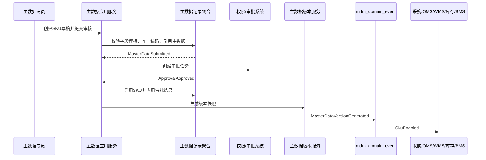
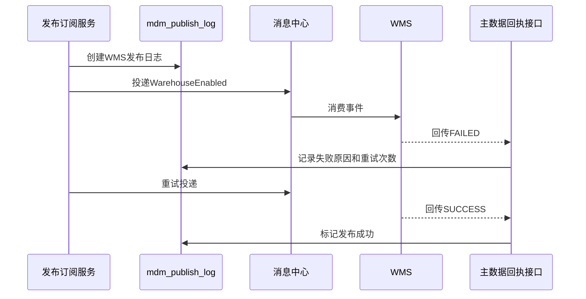

# 08-主数据系统事件生产与消费设计

> 本文根据 `docs/04-子系统功能设计/08-主数据系统/01-主数据系统产品功能设计.md`、`docs/05-子系统数据库设计/08-主数据系统数据库设计.md`、`docs/06-子系统接口设计/08-主数据系统接口设计.md` 和 `docs/06-子系统接口设计/00-上下文映射与领域事件目录.md` 整理。主数据系统是供应链基础资料事实源，事件表达已经发生的主数据事实，不替代采购、仓储、库存、履约、运输、结算等业务上下文的执行事实。

## 1. 事件设计口径

| 项 | 口径 |
| --- | --- |
| 生产位置 | 主数据类型、字段模板、编码规则、主数据记录、版本、发布订阅、导入任务等聚合命令成功后，由应用服务收集领域事件并写入 `mdm_domain_event` |
| 消费位置 | 外部事件进入 `/internal/mdm/v1/events` 后先写 `mdm_event_consume_log`，再由事件消费应用服务幂等处理 |
| 数据变化 | 业务表、版本快照、发布日志、事件表、操作审计表在同一事务保存；消息投递失败只重试投递，不回滚已成功命令 |
| 幂等键 | `来源上下文 + 事件编号 + 主数据类型 + 主数据编码/发布日志ID + 消费者` |
| 版本口径 | 对外发布事件必须携带 `typeCode`、`dataCode`、`versionNo`、`snapshot` 或关键变更摘要；下游按版本号忽略旧事件 |
| 权限审计 | 主数据建档、关键字段变更、启停、冻结、导入、发布、重试、导出必须关联权限校验和操作审计 |

## 2. 主数据系统生产事件

| 事件 | 触发命令 | 聚合/服务 | 关键载荷 | 主要消费者 |
| --- | --- | --- | --- | --- |
| `MasterDataTypeCreated` | 新增主数据类型 | 主数据类型聚合 | 类型编码、名称、领域、是否审批、是否版本、是否发布 | 读模型、审计、业务系统配置缓存 |
| `MasterDataTypeEnabled` | 启用主数据类型 | 主数据类型聚合 | 类型编码、状态、版本 | 采购、OMS、WMS、库存、TMS、BMS、供应商 |
| `MasterDataTypeChanged` | 修改主数据类型 | 主数据类型聚合 | 类型编码、变更前后摘要、版本 | 业务系统配置缓存、导入模板 |
| `MasterDataTypeDisabled` | 停用主数据类型 | 主数据类型聚合 | 类型编码、停用原因、版本 | 所有订阅系统 |
| `FieldTemplateCreated` | 新增字段模板 | 字段模板聚合 | 类型编码、字段编码、字段类型、必填、唯一、关键字段 | 表单、导入模板、业务系统缓存 |
| `FieldTemplatePublished` | 发布字段模板 | 字段模板聚合 | 类型编码、字段清单、模板版本 | 表单、导入模板、业务系统缓存 |
| `FieldTemplateChanged` | 修改字段模板 | 字段模板聚合 | 字段编码、变更前后摘要、是否关键字段 | 表单、导入模板、数据质量服务 |
| `FieldTemplateDisabled` | 停用字段模板 | 字段模板聚合 | 类型编码、字段编码、停用原因 | 表单、导入模板 |
| `EnumItemChanged` | 新增/修改/排序/停用枚举 | 字段模板/枚举服务 | 枚举类型、枚举值、展示名、状态、排序 | 各业务系统下拉框缓存 |
| `CodeRuleCreated` | 新增编码规则 | 编码规则聚合 | 规则编码、适用类型、前缀、日期格式、重置周期 | 主数据、导入任务、集成服务 |
| `CodeRuleEnabled` | 启用编码规则 | 编码规则聚合 | 规则编码、状态、版本 | 主数据、导入任务 |
| `MasterDataCodeGenerated` | 生成主数据编码 | 编码规则聚合 | 规则编码、业务键、生成编码、当前流水 | 主数据记录、导入任务、审计 |
| `CodeRuleDisabled` | 停用编码规则 | 编码规则聚合 | 规则编码、停用原因 | 主数据、导入任务 |
| `MasterDataDraftCreated` | 新增主数据 | 主数据记录聚合 | 记录ID、类型、编码、名称、草稿状态 | 读模型、审计 |
| `MasterDataSubmitted` | 提交审核 | 主数据记录聚合 | 记录ID、类型、编码、变更摘要、申请人 | 审批系统、读模型 |
| `MasterDataEnabled` | 审核通过或启用 | 主数据记录聚合 | 记录ID、类型、编码、名称、快照、版本号 | 采购、OMS、库存、WMS、TMS、BMS、供应商 |
| `MasterDataRejected` | 审核驳回 | 主数据记录聚合 | 记录ID、类型、编码、驳回原因 | 申请人、读模型、审计 |
| `MasterDataChangeSubmitted` | 关键字段变更提交 | 主数据记录聚合 | 类型、编码、变更字段、变更原因、附件 | 审批系统、审计 |
| `MasterDataFrozen` | 冻结主数据 | 主数据记录聚合 | 类型、编码、冻结原因、版本号 | 采购、供应商、OMS、库存、WMS、TMS、BMS |
| `MasterDataDisabled` | 停用主数据 | 主数据记录聚合 | 类型、编码、停用原因、版本号 | 所有订阅系统 |
| `MasterDataVersionGenerated` | 生成版本 | 主数据版本聚合 | 类型、编码、版本号、版本快照、变更摘要 | 发布订阅、审计 |
| `MasterDataVersionPublished` | 发布版本 | 主数据版本/发布订阅服务 | 类型、编码、版本号、目标系统、快照 | 所有订阅系统 |
| `MasterDataPublished` | 创建发布日志并投递 | 发布订阅聚合 | 发布日志ID、类型、编码、目标系统、事件名 | 订阅系统、运维看板 |
| `MasterDataPublishConfirmed` | 下游回执成功 | 发布订阅聚合 | 发布日志ID、目标系统、确认时间 | 发布页、审计 |
| `MasterDataRepublished` | 重试发布 | 发布订阅聚合 | 发布日志ID、重试次数、重试原因 | 订阅系统、运维看板 |
| `ImportTaskCreated` | 创建导入任务 | 导入任务聚合 | 任务ID、类型、文件名、导入模式、文件哈希 | 主数据、审计 |
| `ImportFileValidated` | 校验导入文件 | 导入任务聚合 | 任务ID、总行数、成功数、失败数、错误文件 | 主数据专员、审计 |
| `ImportTaskExecuted` | 执行导入 | 导入任务聚合 | 任务ID、执行状态、处理批次 | 主数据、审计 |
| `ImportTaskCompleted` | 完成导入 | 导入任务聚合 | 任务ID、总行数、成功数、失败数、错误文件 | 主数据、审计 |
| `ImportTaskCancelled` | 取消导入 | 导入任务聚合 | 任务ID、取消原因 | 主数据、审计 |
| `DataQualityIssueFound` | 数据质量检测失败 | 数据质量服务 | 类型、编码、字段、问题类型、风险等级 | 数据治理、主数据专员 |

主数据对外发布语言按业务类型派生，保证下游不依赖通用 `dataPayload` 内部结构。

| 派生事件 | 来源类型 | 关键载荷 | 主要消费者 |
| --- | --- | --- | --- |
| `SkuEnabled` | `SKU` | SKU编码、名称、单位、类目、品牌、计量属性、版本号 | 采购、OMS、库存、WMS、BMS |
| `SkuChanged` | `SKU` | SKU编码、变更字段、变更前后摘要、版本号 | 采购、OMS、库存、WMS、BMS |
| `SkuDisabled` | `SKU` | SKU编码、停用原因、版本号 | 采购、OMS、库存、WMS |
| `SupplierEnabled` | `SUPPLIER` | 供应商编码、名称、风险等级、联系人、结算摘要 | 采购、供应商、BMS |
| `SupplierFrozen` | `SUPPLIER` | 供应商编码、冻结范围、冻结原因 | 采购、供应商 |
| `SupplierDisabled` | `SUPPLIER` | 供应商编码、停用原因 | 采购、供应商、BMS |
| `WarehouseEnabled` | `WAREHOUSE` | 仓库编码、名称、仓库类型、货主范围、地址 | OMS、库存、WMS、BMS |
| `LocationFrozen` | `LOCATION` | 仓库、库区、库位、冻结原因 | WMS、库存 |
| `CarrierEnabled` | `CARRIER` | 物流商编码、名称、服务类型、接口能力 | OMS、WMS、TMS、BMS |
| `LogisticsProductEnabled` | `LOGISTICS_PRODUCT` | 产品编码、承运商、时效、温控、限制条件 | OMS、WMS、TMS、BMS |
| `AddressRegionChanged` | `ADDRESS_REGION` | 区域编码、层级、偏远标识、配送分区 | OMS、TMS、BMS |
| `RestrictedRuleChanged` | `RESTRICTED_RULE` | 规则编码、SKU范围、地区范围、禁运原因 | OMS、TMS、WMS |

## 3. 主数据系统消费事件

| 订阅事件 | 来源系统 | 消费服务 | 数据变化 |
| --- | --- | --- | --- |
| `ApprovalApproved` | 权限/审批 | 主数据审批事件消费服务 | 建档或关键字段变更审批通过，推进主数据为已启用或变更生效，生成版本快照和发布日志 |
| `ApprovalRejected` | 权限/审批 | 主数据审批事件消费服务 | 主数据审核驳回，保留草稿或变更记录，写驳回原因 |
| `PermissionDataScopeChanged` | 权限系统 | 权限缓存同步服务 | 刷新当前用户可维护组织、仓库、货主、供应商/客户范围 |
| `PublishReceiptReturned` | 下游系统/集成服务 | 发布回执消费服务 | 更新 `mdm_publish_log.publish_status`、重试次数和失败原因 |
| `SupplierProfileChangeSubmitted` | 供应商系统 | 供应商资料变更服务 | 生成供应商主数据变更申请或质量问题待办 |
| `WarehouseExternalCodeBound` | WMS | 仓储主数据同步服务 | 回写外部仓库/库位映射编码，不改变主数据启停状态 |
| `CarrierServiceConfirmed` | TMS | 物流主数据同步服务 | 更新物流商服务能力验证结果，必要时生成数据质量问题 |
| `BillingMasterDataReferenced` | BMS | 主数据引用关系服务 | 标记税率、币种、结算主体被引用，限制直接停用 |
| `PurchaseMasterDataReferenced` | 采购 | 主数据引用关系服务 | 标记供应商、SKU、采购组织被引用，停用前提示影响 |
| `InventoryMasterDataReferenced` | 库存/WMS | 主数据引用关系服务 | 标记仓库、库位、SKU 被库存或仓内作业引用 |

## 4. 关键时序图

### 4.1 SKU 建档、审批和发布

### 4.2 发布失败和回执补偿

## 5. 事件存储字段

| 表 | 字段重点 | 说明 |
| --- | --- | --- |
| `mdm_domain_event` | `event_code`、`event_name`、`event_type`、`aggregate_type`、`aggregate_id`、`aggregate_no`、`payload_json`、`event_status`、`retry_count`、`fail_reason` | 主数据 Outbox，所有自产事件先落库 |
| `mdm_event_consume_log` | `event_code`、`source_system`、`consumer_name`、`idempotent_key`、`consume_status`、`retry_count`、`fail_reason`、`consumed_at` | 外部事件 Inbox 和幂等日志 |
| `mdm_operation_audit_log` | `operator_id`、`operation_type`、`target_type`、`target_no`、`before_snapshot`、`after_snapshot`、`result`、`request_id` | 主数据写操作、导入导出、发布重试和事件消费审计 |
| `mdm_master_data_version` | `version_no`、`snapshot_payload`、`change_type`、`change_summary`、`effective_from` | 对外发布事件的稳定版本快照来源 |
| `mdm_publish_log` | `type_code`、`version_no`、`target_system`、`event_name`、`publish_status`、`retry_count`、`failure_reason`、`published_at` | 下游发布和回执闭环 |

## 6. 失败、补偿和审计

| 场景 | 处理策略 |
| --- | --- |
| 审批回调重复 | 以 `APPROVAL:{eventId}:{approvalTaskId}` 幂等；重复审批结果直接返回历史消费结果 |
| 旧版本事件到达 | 下游按 `typeCode + dataCode + versionNo` 比较版本，旧版本忽略并回执 `IGNORED` |
| 发布失败 | `mdm_publish_log` 标记失败，自动重试；超过阈值进入发布页人工重试 |
| 导入部分成功 | 成功行生成主数据记录和变更日志，失败行写错误文件；重导使用文件哈希和行号幂等 |
| 编码生成失败 | 编码规则流水必须串行；事务失败不占用流水，已返回编码不得回收复用 |
| 引用中主数据停用 | 消费引用事件后记录引用关系；停用命令必须提示影响或要求审批 |
| 审计 | 建档、关键字段变更、启停、冻结、导入、导出、发布、重试、事件消费都写 `mdm_operation_audit_log` |

## 7. 设计结论

主数据事件设计的核心是“主数据事实带版本发布”。主数据系统只拥有基础资料主权，不替代业务系统执行单据状态；下游系统保存业务快照并按事件版本刷新缓存。发布失败、回执失败、导入部分失败和审批回调失败都通过本地事件表、发布日志和消费日志形成可追踪补偿闭环。
