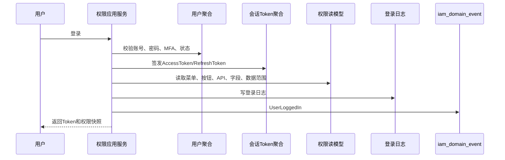
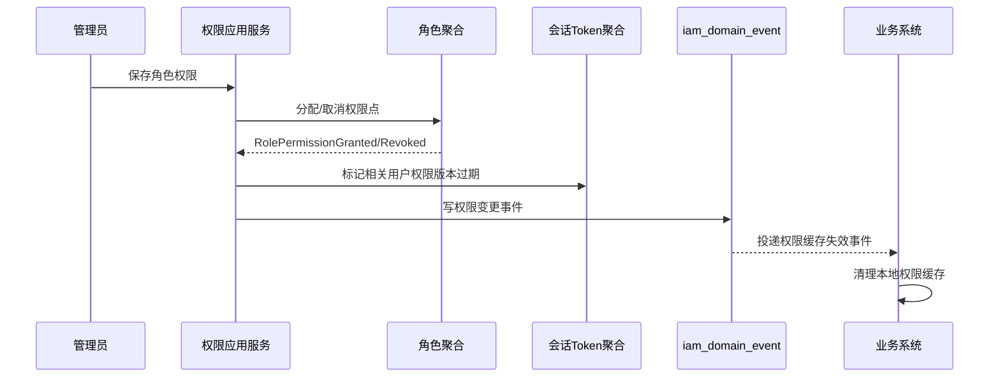

# 09-权限系统事件生产与消费设计

> 本文根据 `docs/04-子系统功能设计/09-权限系统/01-权限系统产品功能设计.md`、`docs/05-子系统数据库设计/09-权限系统数据库设计.md`、`docs/06-子系统接口设计/09-权限系统接口设计.md` 和 `docs/06-子系统接口设计/00-上下文映射与领域事件目录.md` 整理。权限系统是统一认证、授权、会话、数据范围、审批和审计事实源，事件表达已经发生的身份与授权事实，不替代各业务系统的业务单据事实。

## 1. 事件设计口径

| 项 | 口径 |
| --- | --- |
| 生产位置 | 应用、SSO、用户、角色、权限点、数据权限、会话、审批、审计、安全策略等聚合命令成功后，由应用服务写入 `iam_domain_event` |
| 消费位置 | 外部事件进入 `/internal/iam/v1/events` 后先写 `iam_event_consume_log`，再由消费应用服务幂等处理 |
| 数据变化 | 业务表、Token状态、权限版本、事件表、操作审计表在同一事务保存；消息投递失败只重试投递 |
| 幂等键 | `来源上下文 + 事件编号 + 用户/角色/权限点/资源ID + 消费者` |
| 权限版本 | 用户角色、角色权限、权限点、数据范围变更必须提升权限版本，并驱动业务系统缓存失效 |
| 审计原则 | 登录失败、权限拒绝、授权变更、强制下线、敏感操作、导出和审批都必须形成审计事实 |

## 2. 权限系统生产事件

| 事件 | 触发命令 | 聚合/服务 | 关键载荷 | 主要消费者 |
| --- | --- | --- | --- | --- |
| `IamAppCreated` | 新增应用 | 应用聚合 | 应用ID、应用编码、名称、类型、状态 | 网关、业务系统、审计 |
| `IamAppEnabled` | 启用应用 | 应用聚合 | 应用编码、状态、版本 | 网关、业务系统 |
| `SsoClientConfigured` | 配置SSO客户端 | SSO客户端聚合 | 客户端编码、应用编码、授权类型、Token有效期 | 网关、认证服务、安全风控 |
| `IamAppDisabled` | 停用应用 | 应用聚合 | 应用编码、停用原因 | 网关、业务系统 |
| `UserCreated` | 新增用户 | 用户聚合 | 用户ID、账号、姓名、用户类型、状态 | 业务系统、待办、审计 |
| `UserActivated` | 启用/激活用户 | 用户聚合 | 用户ID、账号、状态 | 业务系统、权限缓存 |
| `UserLocked` | 锁定用户 | 用户/安全策略 | 用户ID、锁定到期时间、锁定原因 | 网关、安全风控 |
| `UserDisabled` | 停用用户 | 用户聚合 | 用户ID、停用原因 | 网关、业务系统、安全风控 |
| `UserRoleAssigned` | 分配用户角色 | 用户角色关系聚合 | 用户ID、角色ID集合、生效时间、失效时间 | 业务系统、权限缓存 |
| `UserRoleRevoked` | 取消用户角色 | 用户角色关系聚合 | 用户ID、角色ID集合、取消原因 | 业务系统、权限缓存 |
| `RoleCreated` | 新增角色 | 角色聚合 | 角色ID、角色编码、角色类型、适用应用 | 业务系统、权限缓存 |
| `RoleEnabled` | 启用角色 | 角色聚合 | 角色ID、角色编码、状态 | 业务系统、权限缓存 |
| `RolePermissionGranted` | 分配角色权限 | 角色权限关系聚合 | 角色ID、授权权限ID集合、权限版本 | 业务系统、网关、权限缓存 |
| `RolePermissionRevoked` | 取消角色权限 | 角色权限关系聚合 | 角色ID、取消权限ID集合、权限版本 | 业务系统、网关、权限缓存 |
| `RoleDisabled` | 停用角色 | 角色聚合 | 角色ID、停用原因、权限版本 | 业务系统、网关、权限缓存 |
| `PermissionRegistered` | 新增权限点/API扫描 | 权限点聚合 | 权限编码、权限类型、资源类型、API路径 | 网关、业务系统 |
| `PermissionChanged` | 修改权限点 | 权限点聚合 | 权限编码、变更前后摘要、权限版本 | 网关、业务系统 |
| `PermissionApiBound` | 绑定API | 权限点聚合 | 权限编码、HTTP方法、API路径 | 网关、业务系统 |
| `PermissionDisabled` | 停用权限点 | 权限点聚合 | 权限编码、停用原因、权限版本 | 网关、业务系统 |
| `DataScopeChanged` | 保存数据权限 | 数据权限聚合 | 主体类型、主体ID、资源类型、范围类型、资源ID集合 | 业务系统、报表、导出服务 |
| `UserLoggedIn` | 登录成功 | 会话Token聚合 | 用户ID、应用编码、登录IP、Token JTI | 安全风控、审计、在线用户 |
| `LoginFailedRecorded` | 登录失败 | 安全策略/登录日志服务 | 账号、失败原因、IP、失败次数 | 安全风控、审计 |
| `TokenRefreshed` | 刷新Token | 会话Token聚合 | 用户ID、新旧Token JTI、过期时间 | 网关、安全风控 |
| `TokenInvalidated` | 登出/停用/权限版本过期 | 会话Token聚合 | 用户ID、Token JTI、失效原因 | 网关、业务系统 |
| `SessionKickedOut` | 强制下线 | 会话Token聚合 | 会话ID、用户ID、踢出原因 | 网关、业务系统 |
| `ApprovalStarted` | 发起审批 | 审批实例聚合 | 审批实例、来源应用、业务单号、当前节点 | 来源业务系统、待办中心 |
| `ApprovalCompleted` | 审批通过 | 审批实例聚合 | 审批实例、业务单号、通过时间、审批意见 | 来源业务系统 |
| `ApprovalRejected` | 审批驳回 | 审批实例聚合 | 审批实例、业务单号、驳回原因 | 来源业务系统 |
| `AuditLogCreated` | 写入操作日志 | 操作日志聚合 | 操作日志ID、应用、模块、操作人、业务单号 | 审计看板、安全风控 |
| `PermissionCheckDenied` | 权限检查失败 | 审计应用服务 | 用户ID、权限点、请求路径、拒绝原因 | 安全风控、审计 |
| `SecurityRiskDetected` | 安全策略识别风险 | 安全策略服务 | 用户、风险类型、风险等级、处置建议 | 安全风控、管理员 |

## 3. 权限系统消费事件

| 订阅事件 | 来源系统 | 消费服务 | 数据变化 |
| --- | --- | --- | --- |
| `MasterDataChanged` | 主数据 | 权限对象同步服务 | 更新组织、仓库、货主、供应商、客户、物流商等可授权对象快照 |
| `SupplierEnabled` | 主数据 | 外部主体绑定服务 | 允许创建供应商外部用户和供应商数据范围 |
| `SupplierFrozen` | 主数据/供应商 | 外部主体绑定服务 | 标记供应商用户风险提示，必要时限制高危操作 |
| `WarehouseEnabled` | 主数据 | 数据范围对象服务 | 允许仓库作为授权资源 |
| `LocationFrozen` | 主数据 | 数据范围对象服务 | 更新仓储作业权限提示，不直接修改 WMS 权限点 |
| `EmployeeOnboarded` | 人事/主数据 | 用户事件消费服务 | 创建内部用户草稿或待激活账号 |
| `EmployeeOffboarded` | 人事/主数据 | 用户事件消费服务 | 停用用户、撤销会话、取消待办授权 |
| `ApiResourceScanned` | 各业务系统/网关 | 权限点注册服务 | 生成或更新权限点建议，等待管理员确认 |
| `SensitiveOperationOccurred` | 各业务系统 | 审计事件消费服务 | 写入敏感操作审计日志和安全风险记录 |
| `ApprovalCallbackFailed` | 各业务系统 | 审批补偿服务 | 标记审批回调失败，生成重试或人工处理待办 |

## 4. 关键时序图

### 4.1 用户登录、签发Token和权限加载

### 4.2 角色授权驱动权限版本失效

## 5. 事件存储字段

| 表 | 字段重点 | 说明 |
| --- | --- | --- |
| `iam_domain_event` | `event_code`、`event_name`、`event_type`、`aggregate_type`、`aggregate_id`、`aggregate_no`、`payload_json`、`event_status`、`retry_count`、`fail_reason` | 权限系统 Outbox，所有自产事件先落库 |
| `iam_event_consume_log` | `event_code`、`source_system`、`consumer_name`、`idempotent_key`、`consume_status`、`retry_count`、`fail_reason`、`consumed_at` | 外部事件 Inbox 和幂等日志 |
| `iam_operation_audit_log` | `operator_id`、`operation_type`、`target_type`、`target_no`、`before_snapshot`、`after_snapshot`、`result`、`request_id` | 授权变更、登录、权限拒绝、审计查询等操作审计 |
| `iam_user_token` | `access_token_jti`、`refresh_token_jti`、`token_status`、`login_ip`、`login_at`、`expires_at`、`logout_at` | Token 生命周期和强制下线依据 |
| `iam_operation_log` | `app_code`、`module_code`、`operation_type`、`permission_code`、`biz_type`、`biz_no`、`operation_result` | 统一业务操作日志读模型 |

## 6. 失败、补偿和审计

| 场景 | 处理策略 |
| --- | --- |
| Token 重放或撤销后继续使用 | Token 校验返回 `TOKEN_REVOKED`，写 `PermissionCheckDenied` 或安全风险事件 |
| 权限缓存未刷新 | 权限变更提升 `permissionVersion`；业务系统远程校验发现版本不一致时重新加载权限 |
| 登录失败过多 | 写 `LoginFailedRecorded`，安全策略锁定用户并发布 `UserLocked` |
| 角色权限重复授权 | `roleId + permissionId + grantStatus` 幂等，重复请求返回历史结果 |
| 数据范围资源已停用 | 消费主数据事件后标记授权对象不可用；权限解析时过滤并返回风险提示 |
| 审批回调失败 | 进入补偿队列，按来源应用和业务单号重试，也支持来源系统主动查询审批结果 |
| 审计 | 登录、登出、刷新、强制下线、授权变更、数据范围变更、权限拒绝、敏感查询和导出都写审计 |

## 7. 设计结论

权限系统事件设计的核心是“身份和授权事实可追溯、权限版本可失效”。业务系统可以缓存权限快照，但用户、角色、权限点、数据范围和 Token 生命周期的事实主权在权限系统；权限变更通过事件和远程校验共同保证最终一致与可审计。
