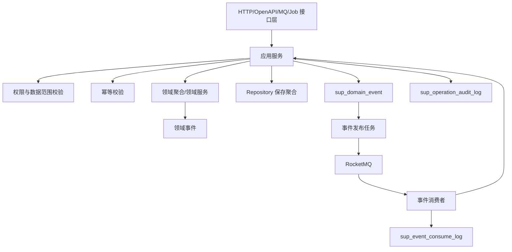
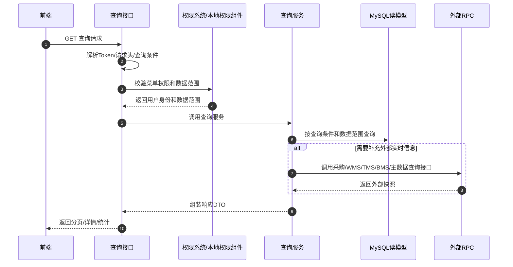
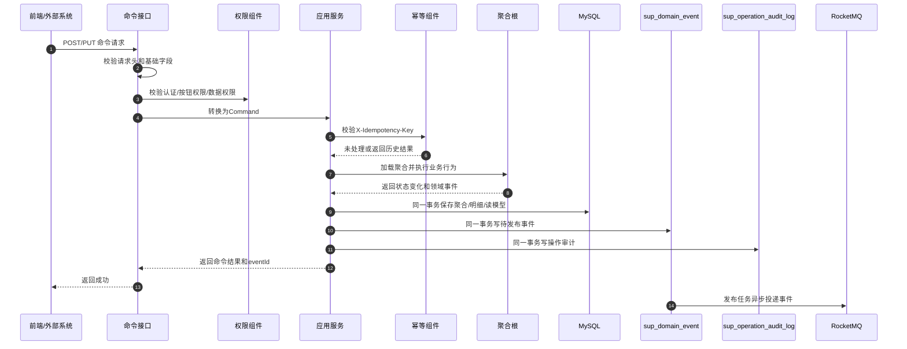
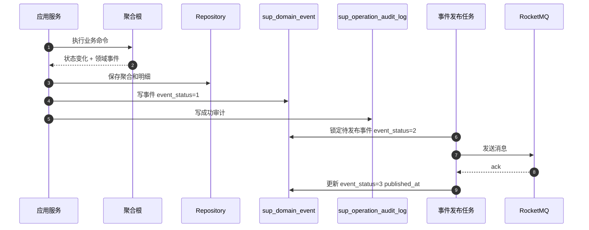
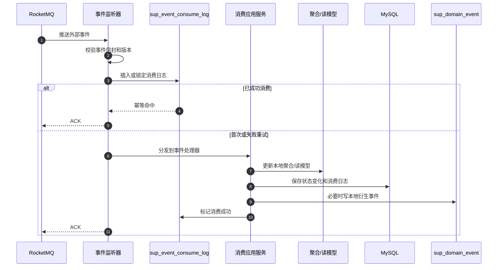
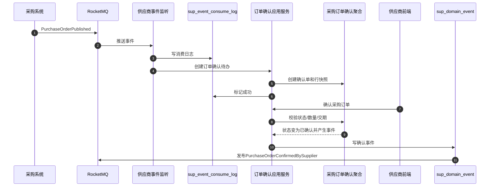
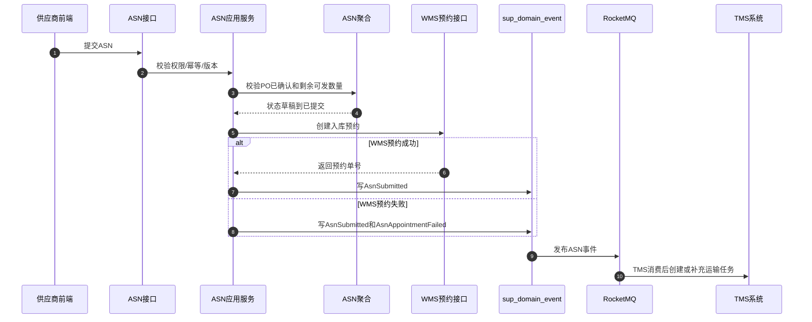
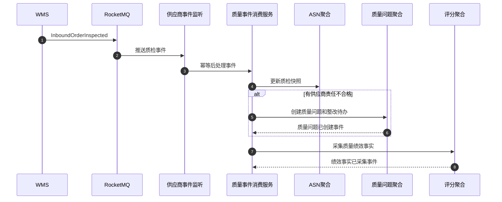
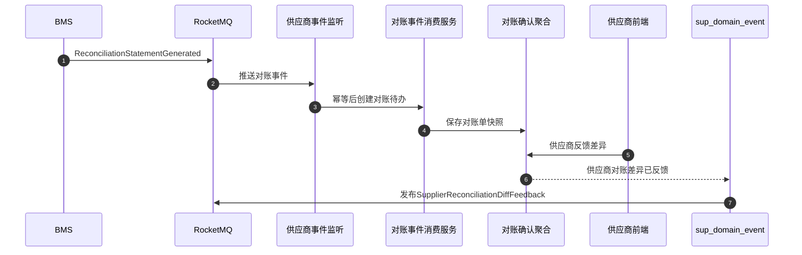

# 02-供应商系统接口事件实现逻辑

> 本文承接 [01-供应商系统接口设计](01-供应商系统接口设计.md)、[01-供应商系统事件生产与消费设计](01-供应商系统事件生产与消费设计.md)、[01-供应商系统数据库设计](01-供应商系统数据库设计.md)、[01-供应商领域模型](01-供应商领域模型.md)。本文不重复接口字段契约，重点说明供应商系统所有查询接口、命令接口、跨系统命令、事件生产和事件消费在后端实现时如何从请求进入到权限校验、数据校验、领域处理、数据库保存、事件落库、消息投递、消费更新和异常补偿。

## 1. 设计范围

| 范围 | 内容 |
| --- | --- |
| 查询接口 | 工作台、档案、账号绑定、供应商商品、订单协同、ASN、退供、对账、质量、评分、日志、枚举 |
| 写命令接口 | 资料变更、账号绑定、供货关系、订单确认、ASN、退供、对账、整改、评分、评分规则、枚举配置 |
| 跨系统命令 | 采购发布订单/询价，BMS 创建对账待办，供应商侧回传采购/WMS/BMS/主数据/权限 |
| 事件生产 | 聚合命令成功后写 `sup_domain_event`，异步发布到 RocketMQ |
| 事件消费 | 订阅主数据、采购、WMS、TMS、BMS、库存事件，写 `sup_event_consume_log` 并更新本地状态 |
| 异常处理 | 参数错误、无权限、状态冲突、幂等冲突、乐观锁冲突、RPC 失败、MQ 失败、重复消费、乱序事件 |

不包含：

- 采购订单审批逻辑，归 02-采购系统。
- WMS 收货、质检、上架、出库作业逻辑，归 03-WMS 系统。
- 库存余额、预占、扣减逻辑，归 04-中央库存系统。
- 运单、轨迹、签收事实源，归 06-TMS 系统。
- 费用计算、应付、付款凭证，归 07-BMS 系统。

## 2. 实现架构总览

### 2.1 后端分层

| 层 | 供应商系统组件 | 职责 |
| --- | --- | --- |
| 接口层 | `SupplierController`、`SupplierOpenApiController`、`SupplierEventConsumer`、`SupplierJobHandler` | 接收 HTTP、OpenAPI、MQ、定时任务请求，做协议参数转换 |
| 应用层 | `SupplierApplicationService`、`AsnApplicationService`、`PoConfirmApplicationService`、`ReconciliationApplicationService`、`SupplierScoreApplicationService` | 编排权限、幂等、事务、加载聚合、调用领域逻辑、保存、事件落库 |
| 领域层 | 供应商、供应商商品、报价、合同、采购订单确认、ASN、质量问题、评分、对账确认、退供应商单聚合 | 执行业务规则、状态迁移、不变量校验，产生领域事件 |
| 基础设施层 | Repository 实现、MyBatis Mapper、RPC Client、RocketMQ Producer、Redis Adapter | 数据库、缓存、消息队列、外部系统调用 |
| 读模型层 | Query Service、读模型 Mapper、ES 查询适配器 | 支撑列表、详情、看板、日志、导出，不修改领域状态 |



### 2.2 核心表职责

| 表 | 职责 |
| --- | --- |
| `sup_supplier_user` | 供应商用户绑定、门户账号和供应商主体关系 |
| `sup_supplier_item` | 供应商与 SKU 的供货关系、供货状态、MOQ、MPQ、交期 |
| `sup_order`、`sup_order_line` | 采购订单协同确认状态和行快照 |
| `sup_asn`、`sup_asn_line` | ASN 草稿、提交、发货、收货状态和行快照 |
| `sup_quality`、`sup_record` | 质量问题、整改记录、验证结论 |
| `sup_supplier_score`、`sup_score_line`、`sup_business_object`、`sup_score_rule` | 评分、评分明细、绩效事实、评分规则 |
| `sup_reconcile` | 对账确认、差异反馈、发票协同 |
| `sup_supplier_return` | 退供确认、拒绝、签收、差异反馈 |
| `sup_domain_event` | 本系统事件发布 Outbox |
| `sup_event_consume_log` | 外部事件消费 Inbox 和幂等日志 |
| `sup_operation_audit_log` | 写操作、事件消费、异常处理审计 |

## 3. 查询接口实现逻辑

### 3.1 查询接口统一流程

查询接口不改变领域状态，默认走读模型或业务表查询；只有详情页需要补充实时外部信息时，才调用其他子系统 RPC。



### 3.2 查询接口实现矩阵

| 页面/接口组 | 主要接口 | 权限校验 | 本地查询 | 可能调用外部 RPC | 异常处理 |
| --- | --- | --- | --- | --- | --- |
| 工作台 | `/workbench/summary`、`/workbench/todos` | `supplier:workbench:read`，外部用户限定绑定供应商 | 待办、订单确认、ASN、退供、对账、质量问题聚合读模型 | 无，第一版不实时跨系统聚合 | 统计查询失败返回 `500`；单类统计失败不建议返回半成品 |
| 供应商档案 | `/profile`、`/profile/change-requests` | `supplier:profile:read`，供应商数据范围 | 本地供应商快照、变更申请记录 | 主数据查询供应商最新主档；权限查询绑定账号 | 主数据超时可返回本地快照并标记 `profileFresh=false` |
| 账号绑定 | `/user-bindings`、`/{id}` | `supplier:user_binding:read` | `sup_supplier_user` | 权限系统查询用户名称、手机号、角色状态 | 权限 RPC 失败时只返回本地绑定快照 |
| 供应商商品 | `/items`、`/items/{id}` | `supplier:sku:read` | `sup_supplier_item` | 主数据查询 SKU 名称、单位、启停状态 | SKU 快照缺失时返回本地快照和风险提示 |
| 采购订单协同 | `/po-confirms`、`/{id}` | `supplier:po_confirm:read` | `sup_order`、`sup_order_line` | 采购系统查询 PO 最新状态；WMS 查询已预约/已收货摘要 | 外部状态不可用时不影响本地确认记录展示 |
| ASN | `/asns`、`/{id}`、`/print-template` | `supplier:asn:read/print` | `sup_asn`、`sup_asn_line` | WMS 查询预约和收货状态；TMS 查询运单轨迹 | TMS 超时则轨迹区域显示“暂不可用” |
| 退供协同 | `/returns`、`/{id}` | `supplier:return:read` | `sup_supplier_return` | WMS 查询退供出库；TMS 查询退供运输；BMS 查询冲减/索赔 | 外部查询失败时显示本地状态和异常提示 |
| 对账协同 | `/reconciliations`、`/{id}` | `supplier:recon:read` | `sup_reconcile` | BMS 查询对账单/发票/付款最新状态 | BMS 超时返回本地对账快照 |
| 质量协同 | `/quality-issues`、`/{id}`、`/rectifications` | `supplier:quality:read`、`supplier:rectification:read` | `sup_quality`、`sup_record` | WMS 查询质检单证据附件，主数据查询 SKU | 外部附件失败不影响质量问题主体 |
| 评分 | `/scores`、`/scores/{id}`、`/score-rules` | `supplier:score:read`、`supplier:score_rule:read` | `sup_supplier_score`、`sup_score_line`、`sup_business_object`、`sup_score_rule` | 无，评分事实已本地化 | 事实明细过多使用分页或异步导出 |
| 操作日志/枚举 | `/operation-logs`、`/enums` | `supplier:operation_log:read`、`supplier:enum:read` | `sup_operation_audit_log`、枚举配置表 | 无 | 导出失败生成导出任务失败记录 |

### 3.3 查询接口数据权限规则

| 用户类型 | 数据过滤规则 |
| --- | --- |
| 外部供应商业务员 | `supplier_id in token.boundSupplierIds`，只能看订单确认、ASN、退供、质量整改 |
| 外部供应商财务 | `supplier_id in token.boundSupplierIds`，只能看对账、发票、结算资料 |
| 外部供应商质量 | `supplier_id in token.boundSupplierIds`，只能看质量问题、整改、评分摘要 |
| 内部采购 | 按组织、采购组、供应商授权、本人/部门范围过滤 |
| 内部质量 | 按组织、质量职责范围、供应商授权过滤 |
| 内部经理 | 按组织和授权供应商范围过滤，可看评分和风险 |
| 管理员 | 仍需要显式组织和系统授权，不默认绕过数据范围 |

## 4. 命令接口实现逻辑

### 4.1 命令接口统一流程

写接口必须走应用服务和聚合，不允许 Controller 直接写表。事件不直接发 MQ，而是先写 `sup_domain_event`，再由发布任务异步发送。



### 4.2 命令处理标准步骤

| 步骤 | 处理内容 | 失败返回 |
| --- | --- | --- |
| 接收数据 | 解析路径参数、请求体、请求头、token、traceId、幂等键 | `400 VALIDATION_FAILED` |
| 认证校验 | 校验 `Authorization`，解析用户、角色、绑定供应商 | `401 UNAUTHORIZED` |
| 权限校验 | 校验菜单、按钮、数据范围、供应商绑定关系 | `403 FORBIDDEN` / `SUPPLIER_SCOPE_DENIED` |
| 基础校验 | 必填、类型、长度、枚举、数量金额格式、附件格式 | `400 VALIDATION_FAILED` |
| 幂等校验 | `X-Idempotency-Key + commandType + requestHash` 唯一 | 命中返回历史结果；冲突返回 `409 IDEMPOTENCY_CONFLICT` |
| 加载聚合 | 按 ID/业务单号加载聚合，校验 `version` | 不存在 `404`；版本冲突 `409 VERSION_CONFLICT` |
| 领域处理 | 执行聚合行为，校验状态机和业务不变量 | `409 STATE_CONFLICT` / `422 BUSINESS_RULE_FAILED` |
| 保存数据 | 本地事务保存业务表、明细、读模型、事件表、审计表 | `500 SYSTEM_ERROR`，事务回滚 |
| 生成事件 | 聚合返回领域事件，应用服务写 `sup_domain_event` | 与业务事务同成同败 |
| 异步发送 | 发布任务扫描待发布事件并发送 RocketMQ | 失败只影响事件状态，不回滚已成功命令 |

### 4.3 页面写接口实现矩阵

| 接口组 | 写接口 | 应用服务 | 聚合/领域服务 | 主要写表 | 生产事件 |
| --- | --- | --- | --- | --- | --- |
| 供应商档案 | 申请资料变更、撤回资料变更 | 供应商档案应用服务 | 供应商聚合、资料变更规则服务 | 供应商资料变更记录、审计表、事件表 | `SupplierProfileChangeSubmitted`、`SupplierProfileChangeWithdrawn` |
| 账号绑定 | 绑定、解绑、启用、停用供应商用户 | 供应商账号应用服务 | 供应商聚合、账号绑定领域服务 | `sup_supplier_user`、审计表、事件表 | `SupplierUserBound`、`SupplierUserUnbound`、`SupplierUserEnabled`、`SupplierUserDisabled` |
| 供应商商品 | 维护供应商 SKU、申请变更、暂停、恢复 | 供应商商品应用服务 | 供应商商品聚合、供货条件校验服务 | `sup_supplier_item`、审计表、事件表 | `SupplierItemSupplyConditionChanged`、`SupplierSkuSuspended`、`SupplierSkuResumed` |
| 采购订单协同 | 确认、拒绝、反馈差异、修改承诺交期 | 采购订单确认应用服务 | 采购订单确认聚合、差异判定服务 | `sup_order`、`sup_order_line`、审计表、事件表 | `PurchaseOrderConfirmedBySupplier`、`PurchaseOrderRejectedBySupplier`、`PurchaseOrderDiffFeedbackBySupplier`、`SupplierDeliveryDateChanged` |
| ASN | 创建、修改、提交、取消、确认发货 | ASN 应用服务 | ASN 聚合、可发数量校验服务 | `sup_asn`、`sup_asn_line`、审计表、事件表 | `AsnCreated`、`AsnChanged`、`AsnSubmitted`、`AsnCanceled`、`AsnShipped` |
| 退供协同 | 确认、拒绝、签收、反馈差异 | 退供协同应用服务 | 退供应商单聚合、签收差异服务 | `sup_supplier_return`、审计表、事件表 | `SupplierReturnConfirmedBySupplier`、`SupplierReturnRejectedBySupplier`、`SupplierReturnSignedBySupplier`、`SupplierReturnDiffFeedback` |
| 对账协同 | 确认、反馈差异、撤回差异、上传发票 | 对账确认应用服务 | 供应商对账确认聚合、发票校验前置服务 | `sup_reconcile`、审计表、事件表 | `SupplierReconciliationConfirmed`、`SupplierReconciliationDiffFeedback`、`SupplierReconciliationDiffWithdrawn`、`SupplierInvoiceSubmitted` |
| 质量整改 | 发起整改、提交整改、审核整改、关闭整改、上传附件 | 质量协同应用服务 | 质量问题聚合、整改审核服务 | `sup_quality`、`sup_record`、审计表、事件表 | `SupplierRectificationStarted`、`SupplierRectificationSubmitted`、`SupplierRectificationPassed`、`SupplierRectificationRejected`、`SupplierRectificationClosed` |
| 评分 | 发起重算、人工修正、发布评分 | 评分应用服务 | 供应商评分聚合、评分计算服务、风险控制服务 | `sup_supplier_score`、`sup_score_line`、`sup_business_object`、审计表、事件表 | `SupplierScoreCalculated`、`SupplierScoreAdjusted`、`SupplierScorePublished`、`SupplierFreezeSuggestionGenerated` |
| 评分规则 | 新增、修改、启停、发布规则 | 评分规则应用服务 | 评分规则聚合/规则校验服务 | `sup_score_rule`、审计表、事件表 | `SupplierScoreRuleChanged`、`SupplierScoreRulePublished` |
| 操作日志/枚举 | 导出日志、新增/修改/停用枚举 | 系统配置应用服务 | 枚举配置规则服务 | 枚举配置表、导出任务表、审计表 | `SupplierEnumChanged`、`SupplierOperationLogExportCreated` |

### 4.4 跨系统命令接口实现矩阵

| 来源/目标 | 接口 | 供应商系统处理 | 主要写表/调用 | 事件 |
| --- | --- | --- | --- | --- |
| 采购 -> 供应商 | 发布采购订单 `/openapi/supplier/v1/purchase-orders` | 校验来源系统和幂等键，创建采购订单确认待办和行快照 | `sup_order`、`sup_order_line`、审计表 | `PurchaseOrderConfirmTodoCreated` |
| 采购 -> 供应商 | 发布询价单 `/openapi/supplier/v1/rfqs` | 创建报价待办或报价草稿 | 报价相关表、待办读模型 | `SupplierQuoteTodoCreated` |
| 供应商 -> 采购 | 提交报价 `/openapi/purchase/v1/quotations` | 本地报价提交成功后同步调用或通过事件通知采购 | 本地报价表、采购 RPC | `SupplierQuoteSubmitted` |
| 供应商 -> 采购 | 订单确认回传 `/openapi/purchase/v1/supplier-confirms` | 本地确认事件发布后可由集成服务同步回传采购 | `sup_order`、采购 RPC | `PurchaseOrderConfirmedBySupplier` 等 |
| 供应商 -> WMS | 预约收货 `/openapi/wms/v1/inbound-appointments` | ASN 提交后同步创建预约；失败时 ASN 可保持已提交并生成预约失败待办 | `sup_asn`、WMS RPC、审计表 | `AsnSubmitted`、`AsnAppointmentFailed` |
| BMS -> 供应商 | 创建对账确认待办 `/openapi/supplier/v1/reconciliations` | 校验对账单版本，创建对账确认待办 | `sup_reconcile`、审计表 | `SupplierReconciliationConfirmTodoCreated` |
| 供应商 -> 主数据 | 查询供应商、SKU、仓库、枚举 | 写命令前校验主数据启用状态；查询页补充展示名 | 主数据 RPC、本地快照 | 无 |
| 供应商 -> 权限 | 校验 token、权限、菜单、按钮、数据范围 | 网关预校验，应用服务二次校验关键写权限 | 权限 RPC、Redis 缓存 | 无 |

## 5. 事件生产逻辑

### 5.1 领域事件生产原则

| 原则 | 说明 |
| --- | --- |
| 事件由领域行为产生 | 聚合状态成功变化后产生事件，不能由 Controller 手工拼事件 |
| 事件表示已经发生 | 使用过去式，如 `AsnSubmitted`、`SupplierScorePublished` |
| 事件先落库再投递 | 应用服务在本地事务中写业务表和 `sup_domain_event` |
| 投递失败不回滚业务 | MQ 失败时事件状态为发布失败，发布任务重试或人工处理 |
| 事件载荷保留业务快照 | 事件不能只传 ID，必须携带下游处理所需的供应商、单据、SKU、数量、金额、状态快照 |

### 5.2 事件生产实现流程



### 5.3 事件生产矩阵

| 业务模块 | 触发命令 | 状态变化 | 事件 | 主要消费者 | 失败处理 |
| --- | --- | --- | --- | --- | --- |
| 供应商档案 | 申请资料变更 | 生成变更申请，主档不立即覆盖 | `SupplierProfileChangeSubmitted` | 主数据、采购、BMS | 事件发布失败重试；审批进度页面显示待同步 |
| 账号绑定 | 绑定/解绑/启停 | 绑定状态变更 | `SupplierUserBound` 等 | 权限、审计、通知 | 权限同步失败则本地状态成功，生成权限同步待办 |
| 供应商商品 | 修改供货条件 | MOQ、MPQ、交期、供货状态版本变化 | `SupplierItemSupplyConditionChanged` | 采购 | 采购消费失败由采购侧重试 |
| 订单确认 | 确认/拒绝/差异/交期变更 | `PO_CONFIRM_STATUS` 推进 | `PurchaseOrderConfirmedBySupplier` 等 | 采购、WMS | 采购未收到时 Outbox 重试；超过阈值生成异常待办 |
| ASN | 创建/修改/提交/取消/发货 | `ASN_STATUS` 推进 | `AsnSubmitted`、`AsnCanceled`、`AsnShipped` | 采购、WMS、TMS、BMS | WMS 预约失败生成 `AsnAppointmentFailed` 或异常待办 |
| 质量整改 | 发起/提交/审核/关闭 | `QUALITY_ISSUE_STATUS`、`RECTIFICATION_STATUS` 推进 | `SupplierRectificationSubmitted` 等 | 质量、评分、供应商门户 | 审核失败返回业务错误，不产生通过事件 |
| 评分 | 重算/修正/发布 | `SUPPLIER_SCORE_STATUS` 推进 | `SupplierScoreCalculated`、`SupplierScorePublished` | 采购、供应商、风险控制 | 评分规则缺失则命令失败，记录失败审计 |
| 对账 | 确认/差异/撤回/上传发票 | `RECON_CONFIRM_STATUS` 推进 | `SupplierReconciliationConfirmed`、`SupplierInvoiceSubmitted` | BMS、采购结算 | BMS 回传失败 Outbox 重试 |
| 退供 | 确认/拒绝/签收/差异 | `SUPPLIER_RETURN_CONFIRM_STATUS` 推进 | `SupplierReturnConfirmedBySupplier`、`SupplierReturnSignedBySupplier` | 采购、WMS、BMS、评分 | 签收数量异常时进入差异待处理 |
| 枚举/规则 | 修改枚举、发布评分规则 | 配置版本变化 | `SupplierScoreRulePublished`、`SupplierEnumChanged` | 本地缓存、审计 | 缓存刷新失败可重试，不影响配置落库 |

## 6. 事件消费逻辑

### 6.1 事件消费统一流程

事件消费入口属于接口层，真正处理在应用层。消费时先写 Inbox，再执行业务处理，保证重复消息可识别。



### 6.2 事件消费处理矩阵

| 来源系统 | 事件 | 消费服务 | 本地处理 | 写表 | 是否生产衍生事件 |
| --- | --- | --- | --- | --- | --- |
| 主数据 | `SupplierEnabled` | 供应商状态消费服务 | 更新供应商快照，允许账号绑定和协同 | 本地供应商快照、消费日志 | 可生产供应商可协同事件 |
| 主数据/评分 | `SupplierFrozen` | 供应商状态消费服务 | 暂停新增报价、订单确认、ASN，存量退供/对账允许继续 | 供应商快照、供应商商品状态、消费日志 | `SupplierCooperationRestricted` |
| 主数据 | `SupplierDisabled` | 供应商状态消费服务 | 禁止新增业务协同，保留历史查询 | 供应商快照、消费日志 | 无 |
| 主数据 | `SkuEnabled` | SKU 事件消费服务 | 更新 SKU 快照，允许创建供货关系 | SKU 快照、消费日志 | 无 |
| 主数据 | `SkuDisabled` | SKU 事件消费服务 | 暂停相关供应商商品或生成停供待办 | `sup_supplier_item`、消费日志 | `SupplierSkuSuspended` |
| 采购 | `RfqPublished` | 询价事件消费服务 | 创建报价待办或报价草稿 | 报价待办/报价草稿、消费日志 | `SupplierQuoteTodoCreated` |
| 采购 | `RfqBiddingClosed` | 询价事件消费服务 | 未提交报价作废，禁止继续提交 | 报价表/待办、消费日志 | `SupplierQuoteExpired` |
| 采购 | `PurchaseOrderPublished` | 采购订单事件消费服务 | 创建订单确认单、行快照和待办 | `sup_order`、`sup_order_line`、消费日志 | `PurchaseOrderConfirmTodoCreated` |
| 采购 | `PurchaseOrderChangeEffective` | 采购订单事件消费服务 | 更新 PO 快照；已确认时进入需重新确认 | `sup_order`、`sup_order_line`、消费日志 | `PurchaseOrderConfirmNeedReconfirm` |
| 采购 | `PurchaseOrderCanceled` | 采购订单事件消费服务 | 关闭确认记录，禁止新增 ASN | `sup_order`、`sup_asn`、消费日志 | `PurchaseOrderConfirmClosed` |
| WMS | `InboundOrderReceived` | ASN 事件消费服务 | 更新 ASN 到仓/实收状态，沉淀交付事实 | `sup_asn`、`sup_asn_line`、`sup_business_object`、消费日志 | `SupplierPerformanceFactCollected` |
| WMS | `InboundOrderInspected` | 质量事件消费服务 | 更新质检快照；不合格创建质量问题和评分事实 | `sup_asn`、`sup_quality`、`sup_record`、`sup_business_object`、消费日志 | `SupplierQualityIssueCreated` |
| WMS | `InboundOrderPutawayCompleted` | ASN 事件消费服务 | 更新上架完成状态和交付绩效事实 | `sup_asn`、`sup_business_object`、消费日志 | `SupplierPerformanceFactCollected` |
| TMS | `WaybillCreated` | 运输事件消费服务 | 刷新 ASN/退供运单快照 | `sup_asn` 或 `sup_supplier_return`、消费日志 | 无 |
| TMS | `TrackingAppended` | 运输事件消费服务 | 刷新物流时间线读模型，不改运输事实源 | 物流读模型、消费日志 | 无 |
| TMS | `TransportSigned` | 退供/ASN 运输消费服务 | 退供记录签收事实；ASN 记录运输完成读模型 | `sup_supplier_return`、`sup_asn`、消费日志 | `SupplierReturnTransportSigned` |
| TMS | `TransportRejected` | 退供运输消费服务 | 生成拒收待办，阻塞退供关闭 | `sup_supplier_return`、待办、消费日志 | `SupplierReturnRejectedInTransport` |
| TMS | `LogisticsExceptionRegistered` | 运输异常消费服务 | 记录异常，影响评分事实 | 异常读模型、`sup_business_object`、消费日志 | `SupplierPerformanceFactCollected` |
| BMS | `ReconciliationStatementGenerated` | 对账事件消费服务 | 创建对账确认待办 | `sup_reconcile`、消费日志 | `SupplierReconciliationConfirmTodoCreated` |
| BMS | `ReconciliationStatementAdjusted` | 对账事件消费服务 | 更新对账快照，已确认时要求重新确认 | `sup_reconcile`、消费日志 | `SupplierReconciliationNeedReconfirm` |
| BMS | `InvoiceVerified` | 发票事件消费服务 | 更新发票校验状态，失败时进入待补充 | `sup_reconcile`、消费日志 | `SupplierInvoiceNeedSupplement` |
| BMS | `PayableCompleted` | 应付事件消费服务 | 关闭对账确认，沉淀协同绩效事实 | `sup_reconcile`、`sup_business_object`、消费日志 | `SupplierPerformanceFactCollected` |
| 中央库存 | `ReturnInventoryLocked` | 退供事件消费服务 | 记录库存锁定结果，进入待供应商确认 | `sup_supplier_return`、消费日志 | `SupplierReturnConfirmTodoCreated` |
| WMS | `SupplierReturnOutboundCompleted` | 退供事件消费服务 | 记录实际出库数量、批次，进入已出库 | `sup_supplier_return`、消费日志 | `SupplierReturnOutboundRecorded` |

### 6.3 消费失败处理

| 失败类型 | 示例 | 处理方式 |
| --- | --- | --- |
| 事件格式错误 | 缺少 `eventId`、`eventType`、`payload` | 标记消费失败，不重试，进入死信和人工处理 |
| 事件版本不支持 | `eventVersion` 高于当前支持版本 | 标记失败，通知集成负责人，暂不消费 |
| 重复事件 | MQ 重复投递 | `sup_event_consume_log` 唯一键命中，直接 ACK |
| 幂等键冲突 | 同一事件号载荷不一致 | 返回 `409` 或标记失败，进入异常池 |
| 业务前置缺失 | 先收到质检，ASN 未创建 | 标记待重试，延迟重试；超过阈值进入异常事实池 |
| 状态冲突 | 订单已取消后收到订单变更 | 根据状态机忽略或记录异常，不能回退状态 |
| RPC 失败 | 消费时查询主数据或附件失败 | 可重试；核心状态不依赖外部实时查询 |
| 数据库失败 | 保存消费结果失败 | 事务回滚，MQ 不 ACK 或稍后重试 |
| 衍生事件落库失败 | 消费成功但需要生产本地事件失败 | 同事务回滚，保持可重试 |

## 7. 接口到事件完整映射

| 接口类别 | 接口动作 | 是否查询 | 是否写库 | 是否生产事件 | 是否调用外部 RPC | 关键异常 |
| --- | --- | --- | --- | --- | --- | --- |
| 工作台 | 查询统计/待办 | 是 | 否 | 否 | 否 | 无权限、查询超时 |
| 档案 | 查询档案/变更记录 | 是 | 否 | 否 | 主数据可选 | 主数据不可用 |
| 档案 | 申请/撤回资料变更 | 否 | 是 | 是 | 主数据/审批可选 | 版本冲突、字段不可变 |
| 账号 | 查询绑定 | 是 | 否 | 否 | 权限可选 | 用户快照缺失 |
| 账号 | 绑定/解绑/启停 | 否 | 是 | 是 | 权限系统 | 用户不存在、重复绑定 |
| 商品 | 查询商品 | 是 | 否 | 否 | 主数据可选 | SKU 快照缺失 |
| 商品 | 维护/暂停/恢复 | 否 | 是 | 是 | 主数据校验 | 供应商冻结、SKU 停用 |
| 订单协同 | 查询确认单 | 是 | 否 | 否 | 采购/WMS 可选 | 外部状态不可用 |
| 订单协同 | 确认/拒绝/差异/改交期 | 否 | 是 | 是 | 采购同步可选 | 状态冲突、数量超限 |
| ASN | 查询/打印 | 是 | 否 | 否 | WMS/TMS 可选 | 轨迹不可用 |
| ASN | 创建/修改/提交/取消/发货 | 否 | 是 | 是 | WMS 预约可选 | 超量、PO 未确认、预约失败 |
| 退供 | 查询退供 | 是 | 否 | 否 | WMS/TMS/BMS 可选 | 外部状态不可用 |
| 退供 | 确认/拒绝/签收/差异 | 否 | 是 | 是 | BMS/WMS 可选 | 签收差异、状态冲突 |
| 对账 | 查询对账 | 是 | 否 | 否 | BMS 可选 | 对账快照过期 |
| 对账 | 确认/差异/撤回/发票 | 否 | 是 | 是 | BMS 同步可选 | 金额不一致、发票重复 |
| 质量 | 查询质量/整改 | 是 | 否 | 否 | WMS 可选 | 附件不可用 |
| 质量 | 发起/提交/审核/关闭整改 | 否 | 是 | 是 | 无 | 逾期、状态不允许 |
| 评分 | 查询评分/规则 | 是 | 否 | 否 | 无 | 数据量大需分页 |
| 评分 | 重算/修正/发布/规则发布 | 否 | 是 | 是 | 无 | 规则缺失、事实不足 |
| 日志/枚举 | 查询日志/枚举 | 是 | 否 | 否 | 无 | 无权限 |
| 日志/枚举 | 导出日志/维护枚举 | 否 | 是 | 可选 | 无 | 导出任务失败、核心枚举不可停用 |

## 8. 典型链路

### 8.1 采购订单发布到供应商确认回传



### 8.2 ASN 提交到 WMS/TMS 协同



### 8.3 WMS 质检事件到质量问题和评分事实



### 8.4 BMS 对账事件到供应商差异反馈



## 9. 异常、错误和补偿设计

### 9.1 接口错误处理

| 错误 | 触发场景 | 返回码 | 是否写审计 | 是否生产事件 |
| --- | --- | --- | --- | --- |
| 参数格式错误 | JSON 格式、类型、必填、长度、枚举错误 | `400 VALIDATION_FAILED` | 可选，仅关键写接口记录失败审计 | 否 |
| 未登录/Token 过期 | 无 token 或 token 无效 | `401 UNAUTHORIZED` | 否 | 否 |
| 无功能权限 | 没有菜单或按钮权限 | `403 FORBIDDEN` | 是 | 否 |
| 无数据权限 | 外部供应商访问其他供应商数据 | `403 SUPPLIER_SCOPE_DENIED` | 是 | 否 |
| 资源不存在 | 单据不存在或逻辑删除 | `404 NOT_FOUND` | 写接口记录 | 否 |
| 幂等冲突 | 同幂等键但请求内容不同 | `409 IDEMPOTENCY_CONFLICT` | 是 | 否 |
| 乐观锁冲突 | 版本号不一致 | `409 VERSION_CONFLICT` | 是 | 否 |
| 状态冲突 | 已取消 ASN 再提交、已确认订单再拒绝 | `409 STATE_CONFLICT` | 是 | 否 |
| 业务规则失败 | ASN 超过剩余可发量、冻结供应商新增 ASN | `422 BUSINESS_RULE_FAILED` | 是 | 否 |
| 外部 RPC 失败 | WMS 预约、主数据校验、权限查询失败 | `422/500 EXTERNAL_CALL_FAILED` | 是 | 视业务是否已提交 |
| 数据库异常 | 保存失败、唯一索引冲突 | `500 SYSTEM_ERROR` | 是 | 否，事务回滚 |

### 9.2 事件发布异常

| 异常 | 处理方式 |
| --- | --- |
| MQ 短暂不可用 | `sup_domain_event.event_status=4`，发布任务按指数退避重试 |
| 事件载荷序列化失败 | 命令事务内失败并回滚，因为事件无法落库 |
| 消息已发送但更新事件状态失败 | 下次扫描可能重复发送，下游通过 `eventId` 幂等 |
| 超过最大重试次数 | 生成事件发布异常待办，支持人工重发或取消 |
| 下游长时间未消费 | 由下游消费堆积告警处理，本系统保留已发布状态和 traceId |

### 9.3 事件消费异常

| 异常 | 处理方式 |
| --- | --- |
| 重复消费 | `sup_event_consume_log` 命中成功记录，直接 ACK |
| 乱序消费 | 前置状态不存在时标记失败可重试；超过阈值进入异常事实池 |
| 业务不可处理 | 如供应商已停用但收到新订单发布，记录忽略或异常，通知采购 |
| 局部失败 | 同事务回滚，消费日志标记失败，等待重试 |
| 死信消息 | 进入死信 Topic，生成人工处理任务，支持修正数据后重放 |

### 9.4 补偿策略

| 场景 | 补偿方式 |
| --- | --- |
| 订单确认事件发布失败 | 重发 `PurchaseOrderConfirmedBySupplier`，若采购已人工处理则标记事件已补偿 |
| ASN 已提交但 WMS 预约失败 | 生成预约失败待办；供应商可修改 ASN 后重试预约，或取消 ASN |
| WMS 质检事件无法匹配 ASN | 进入异常事实池，人工绑定 PO/ASN/供应商后重放 |
| BMS 对账已调整但供应商未重新确认 | 生成重新确认待办，旧确认记录保留历史版本 |
| TMS 退供运输拒收 | 退供状态进入异常，供应商提交拒收原因和证据，采购/BMS 后续处理 |
| 评分发布后发现事实错误 | 通过人工修正评分命令生成修正记录和修正事件，不直接改历史事实 |

## 10. 落地建议

### 10.1 包结构建议

```text
supplier-service
  ├── interfaces
  │   ├── web
  │   ├── openapi
  │   └── mq
  ├── application
  │   ├── command
  │   ├── query
  │   ├── event
  │   └── job
  ├── domain
  │   ├── supplier
  │   ├── item
  │   ├── quote
  │   ├── po
  │   ├── asn
  │   ├── quality
  │   ├── score
  │   ├── reconcile
  │   └── returnorder
  └── infrastructure
      ├── persistence
      ├── rpc
      ├── mq
      ├── cache
      └── audit
```

### 10.2 必须优先实现的横切组件

| 组件 | 原因 |
| --- | --- |
| 权限与数据范围拦截器 | 所有查询和写接口都依赖 |
| 幂等组件 | 防重复提交、重复回调、重复消费 |
| Outbox 发布组件 | 保证事件可靠投递 |
| Inbox 消费组件 | 保证事件幂等消费 |
| 操作审计组件 | 供应商协同过程必须可追溯 |
| 统一错误码组件 | 前端和外部系统需要稳定错误语义 |
| traceId 传递组件 | 串联 HTTP、Dubbo、MQ、日志 |

## 继续上下文

当前结论：供应商系统接口实现分为查询链路、命令链路、事件生产链路、事件消费链路四类。查询接口只读读模型，写接口必须经应用服务和聚合，事件先写 `sup_domain_event` 再投递，消费先写 `sup_event_consume_log` 再处理。

关键假设：供应商主档权威在主数据系统；供应商系统拥有协同事实和本地快照；采购订单、WMS 作业、TMS 运输、BMS 结算均通过命令或事件协作。

待决问题：ASN 提交后 WMS 预约是同步 RPC 还是纯事件驱动；供应商报价是否完全以供应商系统为事实源；外部事件乱序是否引入统一异常事实池表。

下一步：按同一模式继续分析采购系统接口、事件生产逻辑和事件消费逻辑。
