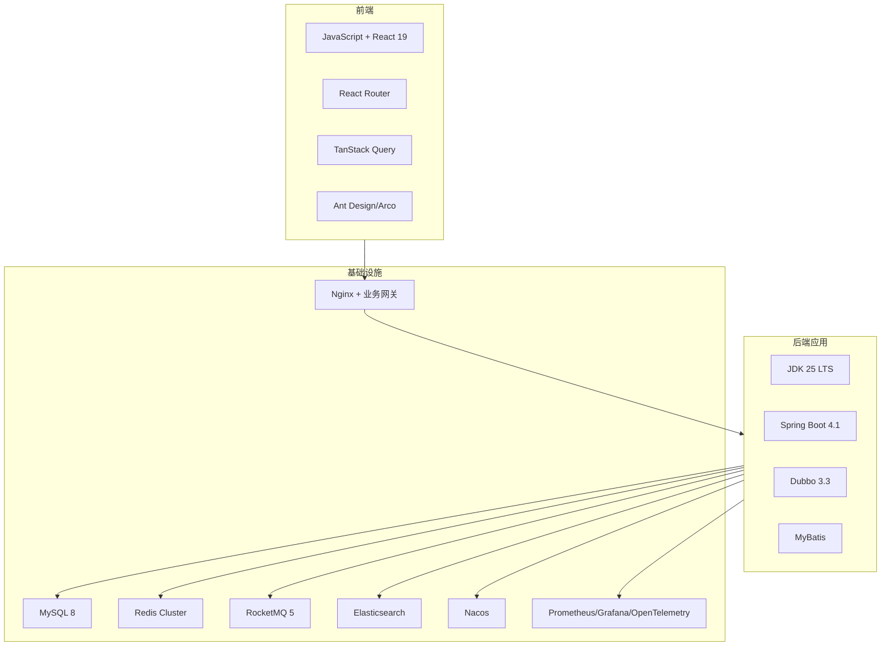
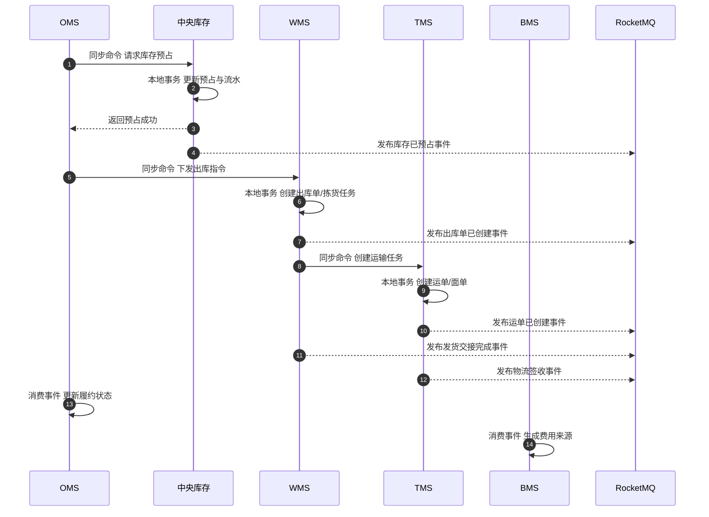
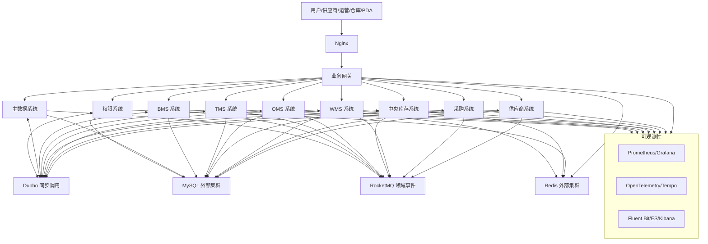
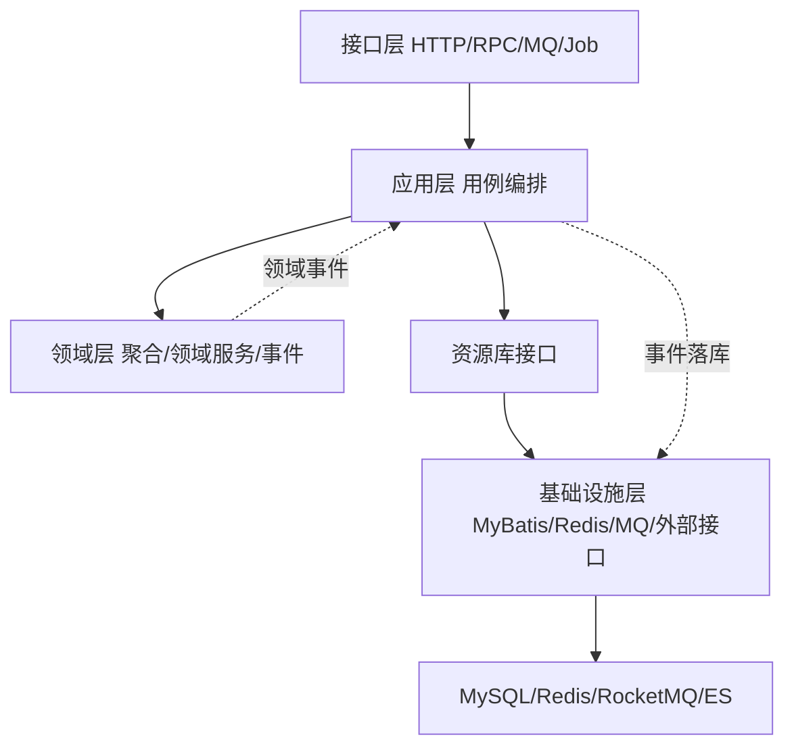
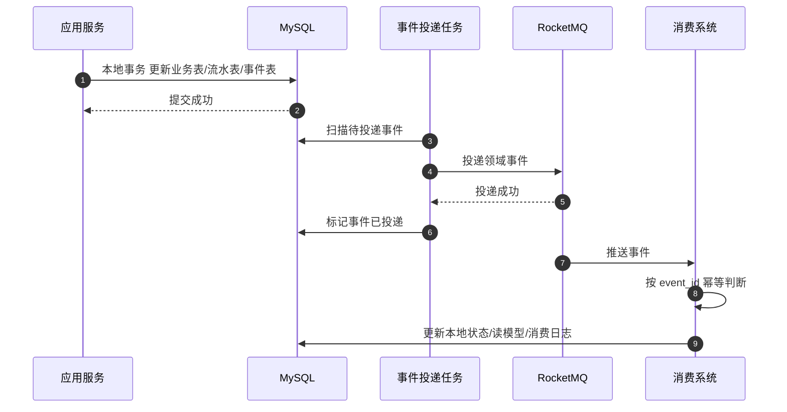
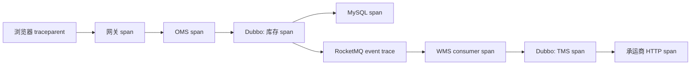
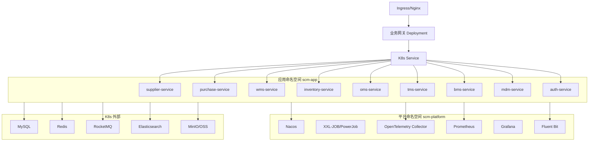

# 01-技术选型与系统架构总览

> 本文是供应链系统实现阶段的技术架构入口，承接业务总览、领域模型、功能设计、数据库设计、接口设计和事件设计。本文按“技术选型 -> 业务架构 -> 系统架构 -> 部署架构”的顺序组织，重点说明前后端、网关、配置、消息、集成、测试、部署、监控、限流、熔断、降级、隔离、分布式事务、数据一致性和调用链路如何落地。

## 1. 技术选型

### 1.1 总体选型原则

| 原则 | 设计口径 | 原因 |
| --- | --- | --- |
| 前端保持简单 | 使用 JavaScript + React，不引入 TypeScript | 符合当前明确约束，降低第一版实现门槛 |
| 后端使用最新生产可用 Java 生态 | 使用当前生产可用 JDK、Spring Boot、Dubbo 主线版本 | 避免从旧版本开始背历史包袱 |
| 存储与消息队列不部署在 Kubernetes 内 | MySQL、Redis、Elasticsearch、对象存储、消息队列默认作为外部托管或独立集群 | 状态型中间件对磁盘、备份、恢复、扩缩容要求高，第一版不建议压进业务 K8s 集群 |
| 无状态应用部署在 Kubernetes 内 | 前端、网关、后端子系统、配置中心、注册中心、任务调度、监控采集、日志采集、链路追踪组件部署到 K8s | 便于滚动发布、弹性扩缩容、健康检查和统一运维 |
| 跨系统不直接改库 | 子系统通过命令接口和领域事件协作 | 保持限界上下文和数据主权 |
| 高并发优先削峰和隔离 | 网关限流、服务熔断、线程池隔离、MQ 削峰、异步补偿 | 供应链链路长，不能让一个慢系统拖垮全链路 |

> 版本口径：本文按 2026-07-06 的公开官方信息选型。具体落地时仍要在创建工程当天重新确认版本兼容矩阵。

### 1.2 前端技术选型

| 类别 | 选型 | 部署位置 | 用途 | 说明 |
| --- | --- | --- | --- | --- |
| 语言 | JavaScript | 前端工程 | 页面逻辑、组件开发 | 明确使用 JS，不使用 TypeScript |
| UI 框架 | React 19.x | 浏览器 | 页面组件、状态更新、事件处理 | 管理后台以 SPA 为主 |
| 构建工具 | Vite | CI/CD 构建节点 | 本地开发、打包、环境变量注入 | 构建速度快，适合 React 项目 |
| 路由 | React Router 7.x | 浏览器 | 菜单路由、页面跳转、详情页路由 | 支持多子系统菜单和权限路由 |
| 组件库 | Ant Design / Arco Design 二选一 | 浏览器 | 表格、表单、弹窗、分页、树、上传 | 供应链后台表格和表单密集，建议优先成熟中后台组件库 |
| 服务端状态 | TanStack Query | 浏览器 | 查询缓存、分页、刷新、请求状态 | 列表、详情、字典、权限菜单都适合服务端状态管理 |
| 本地状态 | Zustand | 浏览器 | 当前用户、布局、页签、临时筛选条件 | 避免复杂 Redux 模板代码 |
| API 客户端 | Axios / Fetch 封装 | 浏览器 | 统一请求头、错误处理、token 注入 | 所有接口通过网关访问 |
| API 契约 | OpenAPI / Swagger JSON | GitHub + CI | 前后端契约、Mock、接口文档 | 后端接口变更后生成契约，减少联调成本 |
| 前端测试 | Vitest + React Testing Library + Playwright | CI/CD | 组件测试、端到端测试 | 覆盖菜单权限、列表查询、新增修改、详情、分页 |
| 前端部署 | Nginx 容器 | Kubernetes | 静态资源托管、缓存策略 | 前端镜像随版本发布，可快速回滚 |

### 1.3 后端技术选型

| 类别 | 选型 | 部署位置 | 用途 | 说明 |
| --- | --- | --- | --- | --- |
| JDK | JDK 25 LTS | Kubernetes 业务容器 | Java 运行时 | 以生产可用 LTS 为主；如果框架兼容性不足，降到 JDK 21 LTS |
| 后端框架 | Spring Boot 4.1.x | Kubernetes 业务容器 | Web、配置、事务、健康检查、指标 | 新工程使用最新主线；落地前校验 Dubbo、Nacos、MyBatis 兼容性 |
| RPC | Apache Dubbo 3.3.x | Kubernetes 业务容器 | 内部同步命令和查询调用 | 供应链内部 Java 服务间调用使用 Dubbo；外部与前端使用 HTTP |
| Web API | Spring MVC + OpenAPI | Kubernetes 业务容器 | 前端接口、外部系统接口 | Controller 只做协议转换，业务编排进入应用服务 |
| ORM / SQL | MyBatis / MyBatis-Plus | Kubernetes 业务容器 | 数据访问 | 复杂业务 SQL 可控，适合后台系统；领域层不依赖 Mapper |
| 数据库迁移 | Flyway / Liquibase | CI/CD + 应用启动可选 | DDL 版本管理 | DDL 随代码版本走，禁止手工改生产表结构 |
| 参数校验 | Jakarta Validation | Kubernetes 业务容器 | 请求字段校验、命令入参校验 | 接口层校验格式，领域层校验业务不变量 |
| 安全 | Spring Security + JWT | Kubernetes 业务容器 | 登录态校验、接口权限 | 权限系统统一签发 token，网关与服务端双层校验 |
| 任务调度 | XXL-JOB / PowerJob | Kubernetes | 对账、补偿、超时关闭、重试扫描 | 供应链大量补偿任务要可视化、可重跑、可审计 |
| 幂等组件 | Redis + MySQL 唯一索引 + 消费日志 | Redis/MySQL 外部集群 + 应用内 | 防重复提交、重复回调、重复消费 | 关键命令必须有 `idempotent_key` |
| 事件可靠投递 | 本地事件表 + 投递任务 + MQ | 应用 + MySQL + MQ | 领域事件可靠发布 | 业务表和事件表同事务，异步投递 MQ |
| 审计日志 | 操作日志表 + ES 查询索引 | MySQL + ES 外部集群 | 记录写操作、前后值、操作人、原因 | 关键单据状态变更必须可追溯 |

### 1.4 数据与中间件选型

| 类别    | 选型                                    | 部署位置                  | 用途                             | 说明                                     |
| ----- | ------------------------------------- | --------------------- | ------------------------------ | -------------------------------------- |
| 业务数据库 | MySQL 8.x                             | Kubernetes 外部独立集群     | 业务状态表、流水表、事件表、审计表              | 每个子系统逻辑独立库，禁止跨系统直接写库                   |
| 缓存    | Redis Cluster                         | Kubernetes 外部独立集群     | token 缓存、热点字典、幂等键、限流计数、短期锁     | 不承载库存最终事实，库存事实以 MySQL 流水和余额为准          |
| 消息队列  | RocketMQ 5.x                          | Kubernetes 外部独立集群     | 领域事件、削峰、异步协作、事务消息              | 业务事件优先 RocketMQ；如果后续偏日志流/大数据，再引入 Kafka |
| 搜索与日志 | Elasticsearch + Kibana                | Kubernetes 外部独立集群     | 应用日志检索、业务搜索、审计查询               | 日志索引和业务搜索索引分开，避免互相影响                   |
| 对象存储  | MinIO / 云 OSS                         | Kubernetes 外部独立集群或云服务 | 面单、附件、导入导出、质检图片                | 大文件不进 MySQL                            |
| 配置中心  | Nacos                                 | Kubernetes            | 配置管理、动态参数、服务发现                 | 业务应用依赖 Nacos，配置变更要有权限和审计               |
| 注册中心  | Nacos                                 | Kubernetes            | Dubbo 服务发现                     | Dubbo 服务注册、发现和实例下线治理                   |
| 网关    | Nginx + Spring Cloud Gateway / APISIX | Kubernetes            | 静态资源、统一入口、鉴权、路由、限流             | Nginx 负责入口代理，业务网关负责认证、路由、限流和审计         |
| 监控指标  | Prometheus + Grafana                  | Kubernetes            | JVM、接口、K8s、Redis、MySQL、MQ 指标展示 | 指标采集在 K8s 内，数据库/MQ 通过 exporter 采集      |
| 链路追踪  | OpenTelemetry + Tempo / Jaeger        | Kubernetes            | 分布式调用链路追踪                      | HTTP、Dubbo、MQ 消费链路统一 traceId           |
| 日志采集  | Fluent Bit + Logstash 可选              | Kubernetes            | 容器日志采集、清洗、写入 ES                | 应用以 JSON 格式输出日志                        |
| 镜像仓库  | Harbor                                | Kubernetes 或独立部署      | Docker 镜像版本管理                  | 支持版本保留、安全扫描、回滚                         |
| 密钥管理  | Kubernetes Secret + 外部 KMS 可选         | Kubernetes            | 数据库密码、MQ 密钥、JWT 密钥             | 生产密钥不写入 GitHub                         |

### 1.5 技术选型图

## 2. 业务架构

### 2.1 子系统业务分层

| 业务层 | 子系统 | 业务职责 | 关键技术/服务 |
| --- | --- | --- | --- |
| 协同层 | 供应商系统 | 供应商准入、报价、合同、ASN、质量问题、退供协同、评分 | React、Spring Boot、Dubbo、MySQL、RocketMQ |
| 计划与采购层 | 采购系统 | 请购、询价、比价、采购订单、采购变更、采购入库跟踪、退供申请 | React、Spring Boot、Dubbo、MySQL、RocketMQ |
| 作业执行层 | WMS 系统 | 入库、收货、质检、上架、拣货、复核、包装、发货交接、盘点、仓内异常 | PDA/API、React、Spring Boot、Dubbo、MySQL、RocketMQ |
| 库存事实层 | 中央库存系统 | 库存账户、可用、预占、释放、扣减、入库、冻结、调整、对账 | Spring Boot、MySQL、Redis、RocketMQ |
| 订单履约层 | OMS 系统 | 销售订单、审单、履约、出库指令、取消、售后、退款/补发编排 | React、Spring Boot、Dubbo、MySQL、RocketMQ |
| 运输协同层 | TMS 系统 | 运输任务、运单、面单、轨迹、签收、物流异常、物流费用来源 | React、Spring Boot、外部承运商 API、RocketMQ |
| 结算层 | BMS 系统 | 费用采集、计费规则、费用计算、对账、账单、发票、财务交接 | React、Spring Boot、MySQL、RocketMQ |
| 基础数据层 | 主数据系统 | SPU、SKU、供应商、客户、货主、仓库、库区库位、物流商、枚举 | React、Spring Boot、MySQL、RocketMQ |
| 权限与审计层 | 权限系统 | 单点登录、用户、角色、权限、数据权限、token、操作日志 | Spring Security、JWT、Redis、MySQL |

### 2.2 子系统同步方式

不同系统之间不采用“互相改表”的方式同步，而是分成三类：

| 同步类型 | 适用场景 | 例子 | 技术实现 | 一致性要求 |
| --- | --- | --- | --- | --- |
| 同步命令调用 | 调用方需要立即知道动作是否成功 | OMS 请求中央库存预占，WMS 请求 TMS 创建运单 | Dubbo / 内部 HTTP | 接收方本地事务成功后返回 |
| 异步领域事件 | 某个业务事实已经发生，需要通知其他系统 | 库存已预占、WMS 已发货、TMS 已签收、费用已生成 | RocketMQ + 事件表 | 最终一致 |
| 查询读模型 | 页面或系统只需要读取对方数据 | 采购查看入库进度，OMS 查看物流轨迹 | 查询 API / 投影表 / ES | 可接受短暂延迟 |

### 2.3 主数据同步

| 主数据 | 事实源 | 消费系统 | 同步方式 | 高并发处理 |
| --- | --- | --- | --- | --- |
| SKU/SPU | 主数据系统 | 采购、供应商、WMS、中央库存、OMS、TMS、BMS | 主数据发布事件 + 消费方本地快照 | 消费方按版本号幂等更新，页面读取本地快照 |
| 供应商 | 主数据/供应商系统 | 采购、BMS、TMS | 供应商启用/停用事件 | 采购下单时同步校验供应商状态 |
| 仓库/库区/库位 | 主数据系统 | WMS、中央库存、OMS、TMS | 仓库主数据事件 | WMS 保留仓内作业所需快照 |
| 物流商 | 主数据系统 | TMS、BMS、OMS | 物流商启用/停用事件 | TMS 下单前校验承运商可用 |
| 权限数据 | 权限系统 | 所有系统 | 登录时获取权限 + Redis 缓存 | token 缓存短 TTL，权限变更发布失效事件 |

### 2.4 核心业务链路同步

## 3. 系统架构

### 3.1 总体系统架构

### 3.2 单个子系统内部架构

| 层 | 组件 | 职责 | 技术 |
| --- | --- | --- | --- |
| 接口层 | Controller、Dubbo Facade、MQ Listener、Job Handler | 接收 HTTP、RPC、MQ、任务调度请求，转换 DTO 和命令 | Spring MVC、Dubbo、RocketMQ Client、XXL-JOB |
| 应用层 | Application Service、Command Handler、Query Service | 权限、幂等、事务、加载聚合、调用领域逻辑、保存、发布事件 | Spring Transaction、Redis、Repository |
| 领域层 | 聚合根、实体、值对象、领域服务、领域事件、状态机 | 保护业务不变量，决定状态如何变化 | 纯 Java，不依赖框架 |
| 基础设施层 | Repository 实现、Mapper、MQ Producer、外部 Client、Cache Adapter | 数据库、缓存、消息、外部接口适配 | MyBatis、Redis、RocketMQ、Dubbo Client |
| 读模型层 | Query Model、Projection、ES Index | 列表、详情、报表、看板查询 | MySQL 读表、ES、Redis |

### 3.3 高并发治理

| 能力 | 放置位置 | 场景 | 实现方式 | 失败后的业务处理 |
| --- | --- | --- | --- | --- |
| 限流 | Nginx、业务网关、应用接口、MQ 消费端 | 登录、订单提交、库存查询、物流回调、批量导入 | IP/用户/接口/业务键限流，Redis 计数，令牌桶 | 返回明确错误码或进入异步任务 |
| 熔断 | Dubbo 调用方、外部接口调用方 | OMS 调库存超时，WMS 调 TMS 超时，TMS 调承运商失败 | Sentinel / Resilience4j，按错误率和超时熔断 | 创建异常单、补偿任务，不直接吞失败 |
| 降级 | 网关、应用读服务、外部接口适配层 | 报表慢、轨迹慢、供应商评分暂不可用 | 返回缓存、隐藏非核心模块、提示稍后查看 | 核心写链路不做假成功 |
| 隔离 | 线程池、连接池、消费者组、Topic、数据库连接 | 出库高峰、物流回调高峰、批量导入 | 业务线程池隔离、消费者组隔离、数据库连接池隔离 | 防止非核心链路拖垮核心链路 |
| 削峰 | MQ、异步任务 | 批量导入、轨迹回调、费用计算、报表汇总 | 请求先落库/入队，后台消费 | 页面展示任务处理中 |
| 防重 | 网关、应用层、数据库 | 重复点击、重复提交、重复回调、重复消费 | 幂等键、唯一索引、消费日志 | 返回上次处理结果 |
| 超时 | HTTP、Dubbo、数据库、外部 API | 全部跨系统调用 | 每类调用设置超时，不无限等待 | 进入补偿或异常待办 |

### 3.4 分布式事务与数据一致性

第一版不建议默认引入强 XA/TCC 分布式事务。供应链链路长，包含人工操作、仓内作业、物流回调、费用结算，天然适合“本地事务 + 可靠事件 + 补偿 + 对账”的最终一致方案。

| 场景 | 一致性策略 | 实现方式 |
| --- | --- | --- |
| 子系统内部状态变化 | 强一致 | 同一个 MySQL 本地事务内更新聚合表、流水表、事件表 |
| OMS 请求库存预占 | 同步命令 + 接收方本地事务 | OMS 调中央库存，中央库存本地事务成功后返回 |
| 库存预占后通知其他系统 | 最终一致 | 中央库存写事件表，投递 RocketMQ，消费者幂等处理 |
| WMS 发货后扣减库存 | 同步命令或事件驱动，按业务风险选择 | 高风险可 WMS 同步请求库存扣减；低耦合可发事件由库存消费 |
| TMS 签收更新 OMS | 最终一致 | TMS 发布签收事件，OMS 消费后更新订单履约状态 |
| BMS 费用生成 | 最终一致 + 对账 | BMS 消费业务事件生成费用来源，定时与 OMS/WMS/TMS 对账 |
| 失败补偿 | 补偿任务 + 异常单 + 人工处理 | 预占成功但出库失败则释放库存；发货成功但扣减失败则重试或人工处理 |

### 3.5 分布式调用链路

| 链路段 | 如何传递 trace | 采集内容 |
| --- | --- | --- |
| 浏览器 -> 网关 | 前端生成或透传 `traceparent`，网关补齐 | 用户、页面、接口、耗时、状态码 |
| 网关 -> 后端 HTTP | 透传 `traceparent`、`x-request-id`、用户上下文 | 路由、鉴权、限流、响应耗时 |
| 后端 -> Dubbo | Dubbo Filter 透传 traceId/spanId | 服务名、方法、耗时、异常 |
| 后端 -> MySQL/Redis | OpenTelemetry Agent 或客户端埋点 | SQL 耗时、慢查询、缓存命中 |
| 后端 -> RocketMQ | 消息 Header 写入 traceId、eventId、bizNo | 事件投递、消费耗时、失败次数 |
| MQ Consumer -> 本地处理 | 消费时恢复 trace 上下文 | 消费组、重试次数、业务处理耗时 |
| 后端 -> 外部承运商 | HTTP Header 透传内部 traceId，外部报文落库 | 请求报文、响应报文、耗时、错误码 |

落地规则：

- 所有日志必须输出 `trace_id`、`span_id`、`request_id`、`user_id`、`biz_no`。
- 所有领域事件必须包含 `event_id`、`event_type`、`event_version`、`aggregate_id`、`biz_no`、`trace_id`、`occurred_at`。
- 所有异常单和补偿任务必须保存触发它的 `trace_id` 和 `event_id`。

### 3.6 集成架构

| 集成对象 | 集成方式 | 技术 | 关键控制点 |
| --- | --- | --- | --- |
| 前端与后端 | HTTP JSON API | 网关 + Spring MVC + OpenAPI | token、权限、分页、错误码、幂等键 |
| 子系统同步调用 | RPC / 内部 HTTP | Dubbo 优先，必要时 HTTP | 超时、熔断、重试、版本兼容 |
| 子系统异步同步 | 领域事件 | RocketMQ | 事件表、消费日志、死信、补偿 |
| 外部承运商 | HTTP API / Webhook | TMS 外部接口适配器 | 验签、报文落库、幂等、回调重试 |
| 财务系统 | API / 文件 / 事件 | BMS 防腐层 | 对账批次、失败重传、数据签名 |
| GitHub 集成 | Git 仓库 + PR + CI | GitHub + Jenkins Webhook | 分支规范、代码扫描、构建触发 |
| 测试环境集成 | Mock / Sandbox | WireMock、MockServer、测试承运商沙箱 | 外部依赖不可用时可测试 |

## 4. 部署架构

### 4.1 部署分层

| 部署层 | 部署对象 | 是否部署在 K8s | 说明 |
| --- | --- | --- | --- |
| 入口层 | Nginx、业务网关 | 是 | 接入前端、API、鉴权、限流 |
| 应用层 | 供应商、采购、WMS、中央库存、OMS、TMS、BMS、主数据、权限 | 是 | 无状态服务，多副本滚动发布 |
| 配置注册层 | Nacos | 是 | 如果团队已有外部 Nacos，也可独立部署 |
| 调度层 | XXL-JOB / PowerJob | 是 | 补偿、对账、超时任务 |
| 可观测层 | Prometheus、Grafana、OpenTelemetry Collector、Tempo/Jaeger、Fluent Bit | 是 | 采集和展示部署在 K8s 内 |
| 构建与制品 | Jenkins、Harbor | 建议是 | 也可使用公司现有独立 Jenkins/Harbor |
| 存储层 | MySQL、Redis、Elasticsearch、MinIO/OSS | 否 | 按用户约束，存储不部署在业务 K8s 内 |
| 消息层 | RocketMQ | 否 | 按用户约束，消息队列独立部署 |

### 4.2 Kubernetes 部署架构

### 4.3 自动化部署流程

| 阶段 | 动作 | 通过条件 |
| --- | --- | --- |
| 提交 | 开发提交到 GitHub 分支 | 分支命名、提交信息符合规范 |
| PR | 发起 Pull Request | Code Review 通过 |
| CI | Jenkins 执行构建 | 单元测试、静态扫描、依赖漏洞扫描通过 |
| 打包 | 前端 Vite、后端 Maven 构建 | 产物版本号唯一 |
| 镜像 | 构建 Docker 镜像推送 Harbor | 镜像扫描通过 |
| 部署 | Helm / Kustomize 部署到 K8s | readiness/liveness 通过 |
| 验证 | 自动烟雾测试 | 登录、健康检查、关键接口成功 |
| 回滚 | 发布失败自动或人工回滚 | 回滚到上一稳定镜像和配置 |

### 4.4 环境规划

| 环境 | 用途 | 数据策略 | 部署策略 |
| --- | --- | --- | --- |
| dev | 开发联调 | 可重置数据，Mock 外部系统 | 自动部署，低资源规格 |
| test | 测试验证 | 稳定测试数据，定期刷新 | 每日或按需部署 |
| staging | 预生产演练 | 脱敏生产级数据 | 按生产流程发布，跑回归和压测 |
| prod | 生产 | 正式数据，严格备份 | 审批发布，滚动更新，支持回滚 |

### 4.5 测试体系

| 测试类型 | 覆盖范围 | 工具 | 执行时机 |
| --- | --- | --- | --- |
| 单元测试 | 聚合状态机、值对象、领域服务、不变量 | JUnit 5、AssertJ、Mockito | 每次提交 |
| 应用服务测试 | 命令处理、事务、幂等、事件发布 | Spring Boot Test、Testcontainers | PR 和 CI |
| 接口测试 | 前端 API、跨系统 HTTP API | REST Assured、Postman/Newman | CI 和测试环境 |
| Dubbo 契约测试 | RPC 方法、入参、出参、异常码 | Dubbo Test、契约样例 | CI |
| MQ 消费测试 | 重复消费、乱序、失败重试、死信 | Testcontainers + RocketMQ 测试环境 | CI 和集成测试 |
| 端到端测试 | 采购入库、销售出库、调拨、售后、退供、运输、结算 | Playwright | test/staging |
| 性能压测 | 登录、订单提交、库存预占、出库回传、物流回调、列表查询 | JMeter / Gatling / K6 | staging |
| 稳定性测试 | 服务超时、MQ 堆积、数据库慢查询、Pod 重启 | Chaos Mesh / 手工演练 | staging 定期执行 |

### 4.6 监控与告警

| 监控类型 | 指标 | 告警例子 |
| --- | --- | --- |
| 网关 | QPS、错误率、P95/P99、限流次数 | 下单接口 P99 超过阈值 |
| Java 应用 | JVM、线程池、连接池、GC、接口耗时 | 线程池队列持续堆积 |
| Dubbo | 调用耗时、失败率、熔断次数 | OMS 调库存失败率升高 |
| RocketMQ | Topic 堆积、消费延迟、死信数量 | 物流轨迹事件堆积 |
| MySQL | 连接数、慢查询、锁等待、主从延迟 | 库存流水写入慢查询 |
| Redis | QPS、命中率、内存、热 key | token 校验 Redis 延迟升高 |
| 业务指标 | 待处理异常单、预占失败数、发货延迟、签收延迟、费用差异 | 预占成功但出库下发失败数量异常 |

## 5. 可能存在的问题

| 问题 | 影响 | 推荐处理 |
| --- | --- | --- |
| 最新 JDK/Spring Boot/Dubbo 组合存在兼容风险 | 工程创建、依赖冲突、运行时问题 | 落地前做最小 PoC；如果不稳定，JDK 降到 21 LTS，Spring Boot 选择稳定小版本 |
| JavaScript 大项目可维护性弱于 TypeScript | 字段、接口、状态变更多时容易运行期报错 | 第一版按 JS；OpenAPI 生成接口类型注释和 Mock，后续可渐进 TS |
| Nacos 部署在 K8s 内但业务依赖它 | Nacos 故障会影响服务发现和配置刷新 | Nacos 多副本，配置变更审计，应用保留本地缓存配置 |
| MySQL、Redis、MQ 在 K8s 外 | 网络、权限、连接池、延迟需要单独治理 | 使用内网专线/同 VPC，连接池隔离，配置健康检查和告警 |
| 事件最终一致有延迟 | 页面状态可能短时间不一致 | 页面显示处理中状态，提供刷新、对账和异常处理入口 |
| 高并发下库存热点明显 | 热门 SKU 预占可能锁竞争 | SKU 维度拆分库存账户、短事务、异步排队、热点监控 |
| 分布式链路过长 | 排查困难，超时叠加 | 统一 traceId、超时预算、链路拓扑、关键业务日志 |
| 过早引入太多平台组件 | 运维复杂度上升 | 第一版先保证网关、配置、MQ、监控、日志、部署主链路可用，报表/数仓/灰度逐步增强 |

## 继续上下文

当前结论：前端固定 JavaScript + React；后端使用最新生产可用 Java 生态；除存储和消息队列外，网关、应用、配置注册、调度、监控、日志、链路追踪、CI/CD 支撑服务优先部署在 Kubernetes。

关键假设：存储包含 MySQL、Redis、Elasticsearch、对象存储；消息队列为 RocketMQ，均作为 K8s 外部独立集群或托管服务。

待决问题：如果“存储”只指 MySQL，不包含 Redis/ES/对象存储，需要重新调整部署架构；Spring Boot 4.1 + Dubbo 3.3 + JDK 25 需要 PoC 验证兼容性。

下一步：细化 `02-后端工程结构与分层架构设计.md`。
