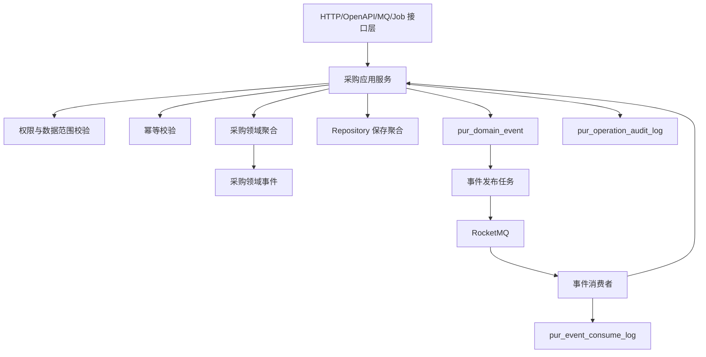
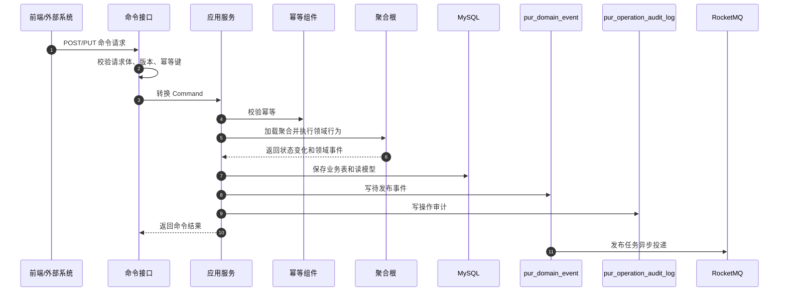

# 02-采购系统接口事件实现逻辑

> 本文承接 `docs/06-子系统接口设计/02-采购系统接口设计.md`、`docs/07-子系统事件生产与消费/02-采购系统事件生产与消费设计.md`、`docs/05-子系统数据库设计/02-采购系统数据库设计.md` 和 `docs/03-核心业务模型/02-采购领域模型`。本文不重复字段契约，重点说明采购系统查询接口、命令接口、跨系统命令、事件生产和事件消费如何从接口进入权限、幂等、聚合、事务、事件表、消息投递和异常补偿。

## 1. 设计范围

| 范围 | 内容 |
| --- | --- |
| 查询接口 | 工作台、请购、询价、报价、比价、采购订单、订单变更、供应商确认、到货跟踪、退供申请、采购价格、参数、日志、枚举 |
| 写命令接口 | 创建/提交/审批请购，发布询价，提交/确认报价，生成/定标比价，创建/审批/发布/取消采购订单，处理供应商差异，创建/审批/通知退供，维护采购价格和参数 |
| 跨系统命令 | 调用供应商系统发布 PO/RFQ，调用 WMS 创建入库/退供出库，向 BMS 提供采购事实，查询主数据和权限 |
| 事件生产 | 聚合命令成功后写 `pur_domain_event`，异步发布到 RocketMQ |
| 事件消费 | 消费供应商确认/ASN、WMS 收货质检上架、中央库存、主数据、权限审批事件，写 `pur_event_consume_log` |
| 异常处理 | 幂等冲突、状态冲突、价格失效、供应商停用、WMS 创建失败、事件乱序、重复消费、审批回调失败 |

不包含：

- 供应商门户确认、ASN、对账确认由 01-供应商系统拥有。
- 仓内收货、质检、上架和退供出库由 03-WMS 系统拥有。
- 库存账户、预占和扣减由 04-中央库存系统拥有。
- 费用计算、对账和账单由 07-BMS 系统拥有。

## 2. 实现架构总览

### 2.1 后端分层

| 层 | 采购系统组件 | 职责 |
| --- | --- | --- |
| 接口层 | `PurchaseController`、`PurchaseOpenApiController`、`PurchaseEventConsumer`、`PurchaseJobHandler` | 接收 HTTP、OpenAPI、MQ、Job 请求，做协议转换和基础校验 |
| 应用层 | `RequisitionApplicationService`、`RfqApplicationService`、`QuoteApplicationService`、`CompareApplicationService`、`PurchaseOrderApplicationService`、`SupplierReturnApplicationService` | 编排权限、幂等、事务、加载聚合、调用领域逻辑、写事件和审计 |
| 领域层 | 采购申请、询价单、供应商报价、比价结果、采购价格、采购订单、采购订单变更、入库跟踪、退供申请聚合 | 保护状态机、数量金额、价格快照、可采购供应商等不变量 |
| 基础设施层 | Repository、MyBatis Mapper、RPC Client、RocketMQ Producer、Redis Adapter | 数据库、缓存、消息、外部系统调用 |
| 读模型层 | Query Service、读模型 Mapper、ES/导出适配器 | 支撑列表、详情、看板、导出，不修改领域状态 |

### 2.2 核心表职责

| 表 | 职责 |
| --- | --- |
| `pur_requisition`、`pur_requisition_line` | 请购单、请购明细、审批和转采购状态 |
| `pur_rfq`、`pur_rfq_line` | 询价单、询价明细、邀请供应商、报价截止 |
| `pur_supplier_quote`、`pur_supplier_quote_line` | 供应商报价、报价行、币种税率和有效期 |
| `pur_compare_result` | 比价结果、评分、定标供应商和定标理由 |
| `pur_price` | 采购价格版本、有效期、税率、币种 |
| `pur_order`、`pur_order_line` | 采购订单、行快照、审批、发布、供应商确认和入库累计 |
| `pur_order_change` | 采购订单变更单和变更前后快照 |
| `pur_inbound` | 到货跟踪、ASN、收货、质检、上架累计 |
| `pur_supplier_return` | 退供申请、审批、执行通知和退供进度 |
| `pur_domain_event` | 本系统事件发布 Outbox |
| `pur_event_consume_log` | 外部事件消费 Inbox 和幂等日志 |
| `pur_operation_audit_log` | 写操作、事件消费和异常处理审计 |

## 3. 查询接口实现逻辑

### 3.1 查询接口统一流程

查询接口不改变领域状态，默认查询采购读模型；只有详情页需要补充外部实时状态时，才调用供应商、WMS、BMS 或主数据查询接口。

```mermaid
sequenceDiagram
    autonumber
    participant Web as 前端
    participant API as 查询接口
    participant Auth as 权限组件
    participant Query as 查询服务
    participant DB as MySQL读模型
    participant RPC as 外部RPC

    Web->>API: GET 查询请求
    API->>API: 解析Token和查询条件
    API->>Auth: 校验菜单权限和数据范围
    API->>Query: 调用查询服务
    Query->>DB: 按组织/采购组/供应商范围查询
    alt 需要外部实时状态
        Query->>RPC: 查询供应商/WMS/BMS/主数据
        RPC-->>Query: 返回外部快照
    end
    Query-->>API: 组装响应DTO
    API-->>Web: 返回分页/详情/统计
```

### 3.2 查询接口实现矩阵

| 页面/接口组 | 主要接口 | 权限校验 | 本地查询 | 可能调用外部 RPC | 异常处理 |
| --- | --- | --- | --- | --- | --- |
| 工作台 | `/workbench/summary`、`/workbench/todos` | `purchase:workbench:read` | 待审批、待发布、待确认、到货异常、退供待办 | 无 | 数据范围为空返回空统计 |
| 请购 | `/requisitions`、详情 | 申请人、部门、采购组织 | `pur_requisition`、`pur_requisition_line` | 权限审批状态 | 无权限返回 `404` |
| 询价/报价/比价 | `/rfqs`、`/quotes`、`/compare-results` | 采购组织、品类、采购员 | RFQ、报价、比价读模型 | 供应商、SKU 快照 | 外部超时返回本地快照 |
| 采购订单 | `/purchase-orders`、`/order-changes` | 采购组织、供应商、金额字段权限 | PO、变更、确认、入库摘要 | 供应商确认、WMS 入库状态 | 金额无权限脱敏 |
| 到货跟踪 | `/inbounds` | 仓库、采购组织、供应商范围 | `pur_inbound` | WMS 收货/质检/上架实时状态 | WMS 超时标记 `fresh=false` |
| 退供申请 | `/supplier-returns` | 采购组织、仓库、供应商范围 | 退供申请和执行状态 | WMS 出库、BMS 冲减 | 外部失败展示本地状态 |
| 价格/参数/日志/枚举 | `/prices`、`/settings`、`/operation-logs`、`/enums` | 价格字段、配置、审计权限 | 本地配置和审计表 | 无 | 导出失败写导出任务失败 |

## 4. 命令接口实现逻辑

### 4.1 命令接口统一流程

写接口必须进入应用服务和聚合；采购订单、价格、退供等关键命令必须同事务写业务表、事件表和审计表。

### 4.2 命令处理标准步骤

| 步骤 | 处理内容 | 失败返回 |
| --- | --- | --- |
| 接收数据 | 解析路径、请求体、token、traceId、幂等键 | `400 VALIDATION_FAILED` |
| 权限校验 | 校验菜单、按钮、采购组织、金额字段、审批权限 | `403 FORBIDDEN` |
| 幂等校验 | `X-Idempotency-Key + commandType + requestHash` | 命中返回历史结果；冲突 `409 IDEMPOTENCY_CONFLICT` |
| 加载聚合 | 按业务单号加载聚合并校验版本 | `404` / `409 VERSION_CONFLICT` |
| 领域处理 | 校验状态机、数量、金额、价格、供应商、SKU、仓库 | `409 STATE_CONFLICT` / `422 BUSINESS_RULE_FAILED` |
| 保存数据 | 保存业务表、事件表、审计表 | 失败事务回滚 |
| 异步发送 | Outbox 发布 RocketMQ | 发布失败不回滚业务，进入重试/人工处理 |

### 4.3 页面写接口实现矩阵

| 接口组 | 写接口 | 应用服务 | 聚合/领域服务 | 主要写表 | 生产事件 |
| --- | --- | --- | --- | --- | --- |
| 请购 | 创建、修改、提交、审批、转采购 | `RequisitionApplicationService` | 采购申请聚合 | `pur_requisition` | `PurchaseRequisitionCreated/Submitted/Approved/Converted` |
| 询价 | 创建、修改、发布、截标 | `RfqApplicationService` | 询价单聚合 | `pur_rfq` | `RfqCreated/Published/BiddingClosed` |
| 报价 | 录入、提交、确认 | `QuoteApplicationService` | 供应商报价聚合 | `pur_supplier_quote` | `SupplierQuotationCreated/Submitted/Confirmed` |
| 比价 | 生成比价、定标 | `CompareApplicationService` | 比价结果聚合、评分服务 | `pur_compare_result` | `CompareResultGenerated/Awarded` |
| 采购订单 | 创建、提交、审批、发布、取消 | `PurchaseOrderApplicationService` | 采购订单聚合 | `pur_order` | `PurchaseOrderCreated/Submitted/Approved/Published/Canceled` |
| 订单变更 | 创建、提交、审批、生效、取消 | `PurchaseOrderChangeApplicationService` | 订单变更聚合 | `pur_order_change` | `PurchaseOrderChangeEffective` |
| 供应商确认 | 接受/拒绝差异 | `SupplierConfirmApplicationService` | PO 差异处理服务 | `pur_order`、确认快照 | `SupplierConfirmDiffAccepted/Rejected` |
| 退供 | 创建、审批、通知执行 | `SupplierReturnApplicationService` | 退供申请聚合 | `pur_supplier_return` | `SupplierReturnCreated/Approved/ExecutionNotified` |
| 采购价格 | 新增、修改、生效、失效 | `PurchasePriceApplicationService` | 采购价格聚合 | `pur_price` | `PurchasePriceEffective` |
| 参数/枚举/日志 | 配置、停用、导出 | `PurchaseConfigApplicationService` | 配置规则服务 | 配置表、导出任务 | `PurchaseEnumChanged` |

## 5. 跨系统命令实现逻辑

| 来源/目标 | 接口 | 采购系统处理 | 主要写表/调用 | 事件/补偿 |
| --- | --- | --- | --- | --- |
| 采购 -> 供应商 | 发布 PO/RFQ | PO/RFQ 本地状态先成功，再通过 OpenAPI 或事件创建供应商待办 | `pur_order`、`pur_rfq`、供应商 RPC | 失败写同步失败待办，重试不重复发布 |
| 供应商 -> 采购 | 报价、订单确认回传 | 校验来源系统、供应商、幂等键和版本，写采购报价/确认快照 | `pur_supplier_quote`、`pur_order` | 生产报价/确认处理事件 |
| 采购 -> WMS | 创建入库单/退供出库单 | 只请求 WMS 创建作业，不直接写 WMS 数据 | WMS RPC、同步状态表 | WMS 失败进入补偿任务 |
| WMS -> 采购 | 收货、质检、上架、退供出库事件 | 更新入库跟踪和 PO 入库累计 | `pur_inbound`、`pur_order` | 数量超 PO 进入异常待办 |
| 采购 -> BMS | 采购事实 | PO 发布、入库、退供等事实供 BMS 计费 | 事件投递 | BMS 消费失败由 BMS 重试 |

## 6. 事件生产逻辑

### 6.1 生产原则

| 原则 | 说明 |
| --- | --- |
| 聚合产生事件 | Controller 不拼事件，应用服务只收集聚合返回的领域事件 |
| 事件表示事实 | 事件命名使用过去式，如 `PurchaseOrderPublished` |
| 先落库再投递 | 业务表和 `pur_domain_event` 同事务保存 |
| 投递失败不回滚 | MQ 失败只影响事件发布状态，由发布任务重试 |
| 载荷保留快照 | 供应商、SKU、仓库、数量、金额、税率、交期等下游需要的字段必须进入 payload |

### 6.2 生产事件总览

| 聚合 | 命令 | 事件 | 主要消费者 |
| --- | --- | --- | --- |
| 采购申请 | 提交/审批/转采购 | `PurchaseRequisitionSubmitted/Approved/Converted` | 审批、采购工作台 |
| 询价单 | 发布/截标 | `RfqPublished/RfqBiddingClosed` | 供应商系统、报价读模型 |
| 供应商报价 | 提交/确认 | `SupplierQuotationSubmitted/Confirmed` | 询价、比价 |
| 比价结果 | 生成/定标 | `CompareResultGenerated/Awarded` | 采购订单、供应商协同 |
| 采购订单 | 审批/发布/取消 | `PurchaseOrderApproved/Published/Canceled` | 供应商、WMS、BMS |
| 入库跟踪 | 记录收货/质检/上架 | `PurchaseGoodsReceived/InspectionCompleted/PutawayCompleted` | PO、供应商绩效、BMS |
| 退供申请 | 审批/通知执行 | `SupplierReturnApproved/ExecutionNotified` | WMS、供应商、BMS |

## 7. 事件消费逻辑

| 来源系统 | 事件 | 消费处理 | 幂等键 | 异常处理 |
| --- | --- | --- | --- | --- |
| 供应商系统 | `PurchaseOrderConfirmedBySupplier`、`PurchaseOrderDiffFeedbackBySupplier` | 更新 PO 供应商确认状态和差异待办 | `SUPPLIER:{eventId}:PO_CONFIRM` | 版本落后忽略；数量差异进入人工处理 |
| 供应商系统 | `AsnSubmitted/AsnShipped` | 更新到货跟踪 ASN 和预计到货 | `SUPPLIER:{eventId}:ASN` | 来源 PO 不存在进入待重试 |
| WMS | `GoodsReceived/InspectionCompleted/GoodsPutawayCompleted` | 累计收货、合格、上架数量，推进 PO 状态 | `WMS:{eventId}:INBOUND` | 超 PO 数量进入异常，不静默累计 |
| WMS | `SupplierReturnOutboundShipped` | 更新退供执行进度 | `WMS:{eventId}:RETURN` | 退供单不存在待重试 |
| 主数据 | `SupplierEnabled/Disabled`、`SkuChanged` | 刷新供应商/SKU 快照，影响新命令校验 | `MDM:{eventId}:SNAPSHOT` | 旧版本忽略 |
| 权限/审批 | `ApprovalApproved/Rejected` | 推进请购、PO、退供等审批状态 | `IAM:{eventId}:APPROVAL` | 审批实例不匹配失败并告警 |

## 8. 异常、补偿、幂等和审计

| 场景 | 处理策略 |
| --- | --- |
| 重复提交 | 命令幂等表按幂等键和请求 hash 判断；相同请求返回历史结果，不同请求返回 `409` |
| 下游同步失败 | 本地业务不回滚，写同步失败待办和补偿任务，按来源单幂等重试 |
| 事件发布失败 | Outbox 状态置为发布失败，按指数退避重试，超过阈值人工处理 |
| 事件消费失败 | Inbox 记录失败原因；系统异常重试，业务异常进入人工待办 |
| 乱序事件 | 按聚合版本和业务时间判断；低版本忽略，高版本缺前置进入待重试 |
| 审计 | 所有写命令、跨系统命令、事件消费、人工补偿写 `pur_operation_audit_log` |

## 9. DDD 对齐说明

| 领域驱动设计项 | 对齐口径 |
| --- | --- |
| 限界上下文 | 采购上下文拥有请购、询价、报价、比价、PO、采购价格、入库跟踪、退供申请的数据主权 |
| 核心聚合 | 采购订单、询价单、比价结果、采购价格、退供申请 |
| 数据主权 | WMS 只提供仓内执行事实；供应商系统只提供协同确认事实；BMS 只负责结算事实 |
| 命令 | 创建、提交、审批、发布、确认、定标、通知执行等动作 |
| 生产事件 | 采购事实已发生，如 `PurchaseOrderPublished`、`SupplierReturnApproved` |
| 消费事件 | 供应商确认、WMS 入库、主数据变更、审批回调 |
| 查询模型 | 工作台、列表、详情、到货跟踪和日志使用读模型 |
| 异常补偿 | 同步失败、乱序事件、数量差异、价格失效都进入可审计补偿链路 |

## 继续上下文

当前结论：采购系统接口事件实现按查询、命令、跨系统命令、事件生产/消费、补偿审计闭环落地。  
关键假设：采购系统拥有采购义务和采购事实主权，仓内执行和结算由 WMS/BMS 拥有。  
待决问题：审批引擎是否统一放在权限系统；采购价格是否需要字段级加密。  
下一步：继续维护 `03-采购系统接口逐项实现设计.md` 的逐接口编码说明。
