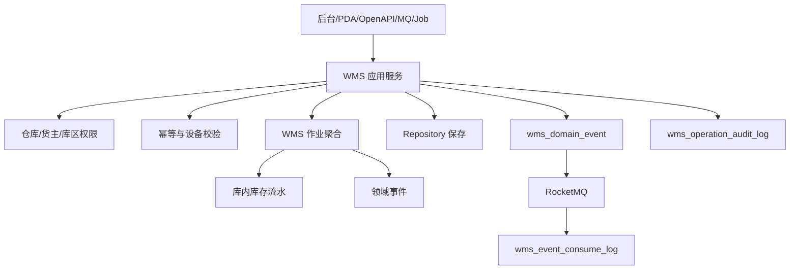

# 02-WMS系统接口事件实现逻辑

> 本文承接 `docs/06-子系统接口设计/03-WMS系统接口设计.md`、`docs/07-子系统事件生产与消费/03-WMS系统事件生产与消费设计.md`、`docs/05-子系统数据库设计/03-WMS系统数据库设计.md` 和 `docs/03-核心业务模型/03-WMS领域模型`。本文说明 WMS 查询接口、作业命令、PDA 命令、跨系统命令、事件生产和事件消费在后端实现时如何进入权限、幂等、作业聚合、库内库存流水、事件落库、消息投递和异常补偿。

## 1. 设计范围

| 范围 | 内容 |
| --- | --- |
| 查询接口 | 工作台、入库单、收货、质检、上架、库内库存、出库、波次、拣货、容器、复核包装、发货交接、退货入库、盘点、仓内异常、日志、枚举 |
| 写命令接口 | 创建/取消入库单，收货、质检、上架，创建/取消/分配出库，波次释放，拣货，复核包装，发货交接，退货入库，盘点差异确认，异常处理 |
| PDA 接口 | 收货扫码、上架扫码、拣货扫码、复核包装、容器绑定、库位校验 |
| 跨系统命令 | 采购/OMS/供应商/调拨创建入库或出库；WMS 调用中央库存入库确认、出库扣减、冻结、盘点差异确认；调用 TMS 面单和运输 |
| 事件生产 | 作业聚合成功后写 `wms_domain_event`，异步发布 |
| 事件消费 | 消费采购、OMS、供应商、TMS、中央库存、主数据、权限事件，写 `wms_event_consume_log` |

不包含：

- 全局库存可用、预占和扣减主权，归中央库存系统。
- 销售订单和履约编排，归 OMS 系统。
- 运输轨迹和签收事实，归 TMS 系统。
- 费用计算和对账，归 BMS 系统。

## 2. 实现架构总览

### 2.1 后端分层

| 层 | WMS 组件 | 职责 |
| --- | --- | --- |
| 接口层 | `WmsController`、`WmsPdaController`、`WmsOpenApiController`、`WmsEventConsumer`、`WmsJobHandler` | 接收后台、PDA、OpenAPI、MQ、Job 请求 |
| 应用层 | 入库、收货、质检、上架、出库、波次、拣货、包装、交接、盘点、异常应用服务 | 编排权限、设备、幂等、事务、聚合、事件、审计 |
| 领域层 | 入库单、收货单、质检单、上架任务、库内库存、出库单、波次、拣货单、容器、复核包装、发货交接、盘点、异常聚合 | 保护作业状态机、数量、库位、容器和库存流水不变量 |
| 基础设施层 | Repository、Mapper、RPC、MQ、设备适配、打印、文件 | 数据库、外部系统、设备、消息 |
| 读模型层 | Query Service、作业看板、库存读模型、导出适配器 | 支撑查询和作业看板 |

### 2.2 核心表职责

| 表 | 职责 |
| --- | --- |
| `wms_inbound_order` | 入库单头行、来源单快照、可收状态 |
| `wms_receipt` | 收货单、收货明细、超收短收差异 |
| `wms_inspection` | 质检单、合格/不合格/让步数量和附件 |
| `wms_putaway_task` | 上架任务、推荐库位、执行人和上架结果 |
| `wms_stock`、`wms_stock_ledger` | 库内库存余额和不可变流水 |
| `wms_outbound_order` | 出库单、来源单快照、分配/波次/拣货/发货状态 |
| `wms_wave`、`wms_picking` | 波次和拣货任务 |
| `wms_container` | 周转容器状态和装载明细 |
| `wms_packing`、`wms_handover` | 复核包装、包裹、发货交接 |
| `wms_stocktake` | 盘点计划、任务、差异 |
| `wms_exception` | 仓内异常、责任方、处理结果 |
| `wms_domain_event`、`wms_event_consume_log`、`wms_operation_audit_log` | Outbox、Inbox、审计 |

## 3. 查询接口实现逻辑

### 3.1 查询统一流程

查询接口默认读取 WMS 本地读模型，按照仓库、货主、库区、作业人员过滤；只在详情页补充中央库存、TMS 或来源系统快照。

### 3.2 查询接口实现矩阵

| 页面/接口组 | 主要接口 | 权限校验 | 本地查询 | 可能调用外部 RPC | 异常处理 |
| --- | --- | --- | --- | --- | --- |
| 工作台 | `/workbench/summary`、`/workbench/todos` | 仓库、货主、作业角色 | 作业待办、异常看板 | 无 | 数据范围为空返回空 |
| 入库/收货/质检/上架 | `/inbound-orders`、`/receipts`、`/inspections`、`/putaway-tasks` | 仓库、货主、库区 | 入库、收货、质检、上架读模型 | 采购/供应商 ASN 状态 | 外部失败返回本地快照 |
| 库内库存 | `/stocks` | 仓库、货主、库区、库存状态 | 库位/批次/容器库存 | 中央库存轨迹 | 不作为可售承诺 |
| 出库作业 | `/outbound-orders`、`/waves`、`/pickings`、`/containers` | 仓库、货主、作业区 | 出库、波次、拣货、容器读模型 | OMS 履约状态 | 延迟显示同步中 |
| 复核/交接 | `/packing-orders`、`/handover-orders` | 仓库、月台、承运商范围 | 包裹、面单、交接读模型 | TMS 面单/运单 | TMS 失败显示待同步 |
| 盘点/异常 | `/stocktakes`、`/exceptions` | 仓库、库区、异常类型 | 盘点计划、差异、异常 | 中央库存调整状态 | 外部失败保留本地处理状态 |
| 日志/枚举 | `/operation-logs`、`/enums` | 审计/配置权限 | 审计表、配置表 | 无 | 大范围导出异步 |

## 4. 命令接口实现逻辑

### 4.1 命令统一流程

作业命令必须校验设备、作业人、仓库、库区、货主、幂等键和单据版本；作业状态和数量变化发生在聚合内部，库内库存变化必须写流水。

### 4.2 页面/PDA 命令实现矩阵

| 接口组 | 写接口 | 应用服务 | 聚合/领域服务 | 主要写表 | 生产事件 |
| --- | --- | --- | --- | --- | --- |
| 入库单 | 创建、取消 | `InboundOrderApplicationService` | 入库单聚合 | `wms_inbound_order` | `InboundOrderCreated/Canceled` |
| 收货 | 后台收货、PDA 扫码、提交收货 | `ReceivingApplicationService` | 收货单聚合、超收策略服务 | `wms_receipt`、暂存库存 | `GoodsReceived/ReceivingCompleted` |
| 质检 | 开始质检、提交结果 | `InspectionApplicationService` | 质检单聚合 | `wms_inspection` | `InspectionCompleted` |
| 上架 | 分配任务、PDA 上架 | `PutawayApplicationService` | 上架任务、库内库存聚合 | `wms_putaway_task`、`wms_stock_ledger` | `GoodsPutawayCompleted` |
| 出库 | 创建、取消、分配 | `OutboundOrderApplicationService` | 出库单聚合、分配领域服务 | `wms_outbound_order`、库存锁定流水 | `OutboundOrderCreated/Allocated/Canceled` |
| 波次/拣货 | 创建波次、释放波次、PDA 拣货 | `WaveApplicationService`、`PickingApplicationService` | 波次、拣货单聚合 | `wms_wave`、`wms_picking` | `WaveReleased/PickingCompleted` |
| 容器 | 绑定、解绑、装箱 | `ContainerApplicationService` | 容器聚合 | `wms_container` | `ContainerBound` |
| 复核包装 | 复核、称重、包装、打印 | `PackingApplicationService` | 复核包装聚合 | `wms_packing` | `PackageCompleted` |
| 发货交接 | 交接、发货确认 | `HandoverApplicationService` | 发货交接聚合 | `wms_handover` | `OutboundOrderShipped/HandoverCompleted` |
| 盘点 | 创建、录入、确认差异 | `StocktakeApplicationService` | 盘点计划聚合 | `wms_stocktake` | `StocktakeDifferenceConfirmed` |
| 仓内异常 | 登记、处理、关闭 | `WarehouseExceptionApplicationService` | 仓内异常聚合 | `wms_exception` | `WarehouseExceptionProcessed/Closed` |

## 5. 跨系统命令实现逻辑

| 来源/目标 | 接口 | WMS 处理 | 主要写表/调用 | 事件/补偿 |
| --- | --- | --- | --- | --- |
| 采购/供应商/OMS/调拨 -> WMS | 创建入库单 | 校验来源幂等、仓库、货主、SKU、批次规则，创建待收货入库单 | `wms_inbound_order` | `InboundOrderCreated` |
| OMS/调拨/退供 -> WMS | 创建出库单 | 校验来源单、仓库、货主、SKU，创建待分配出库单 | `wms_outbound_order` | `OutboundOrderCreated` |
| 来源系统 -> WMS | 取消出库单 | 按出库状态判断可取消、可拦截、不可取消 | `wms_outbound_order` | `OutboundOrderCanceled/CancelRejected` |
| WMS -> 中央库存 | 入库确认、出库扣减、盘点差异、冻结解冻 | 作业事实成功后调用命令或发布事件 | 中央库存 RPC | 失败写补偿任务 |
| WMS -> TMS | 面单、运单、发货交接 | 包装或发货时调用 TMS | TMS RPC | 失败标记待同步 |
| WMS -> BMS/OMS/采购 | 作业事实事件 | 通过事件通知费用、订单履约和采购入库进度 | `wms_domain_event` | 发布失败重试 |

## 6. 事件生产逻辑

| 聚合 | 命令 | 事件 | 主要消费者 |
| --- | --- | --- | --- |
| 入库单 | 创建/取消 | `InboundOrderCreated/Canceled` | 采购、OMS、供应商 |
| 收货单 | 登记/完成收货 | `GoodsReceived/ReceivingCompleted` | 采购、供应商、BMS |
| 质检单 | 提交质检 | `InspectionCompleted` | 采购、供应商、中央库存 |
| 上架任务 | 完成上架 | `GoodsPutawayCompleted` | 中央库存、采购、BMS |
| 出库单 | 创建/分配/取消 | `OutboundOrderCreated/Allocated/Canceled` | OMS、退供、调拨 |
| 拣货/包装 | 完成拣货/包裹 | `PickingCompleted/PackageCompleted` | OMS、TMS、BMS |
| 发货交接 | 确认发货 | `OutboundOrderShipped/HandoverCompleted` | OMS、中央库存、TMS、BMS |
| 盘点计划 | 差异确认 | `StocktakeDifferenceConfirmed` | 中央库存、审计 |
| 仓内异常 | 处理/关闭 | `WarehouseExceptionProcessed/Closed` | OMS、采购、BMS |

## 7. 事件消费逻辑

| 来源系统 | 事件 | 消费处理 | 幂等键 | 异常处理 |
| --- | --- | --- | --- | --- |
| 采购 | `PurchaseOrderPublished/SupplierReturnApproved` | 创建采购入库或退供出库 | `PURCHASE:{eventId}:ORDER` | 来源单缺失待重试 |
| 供应商 | `AsnSubmitted/AsnCanceled` | 创建或更新入库预约/入库单快照 | `SUPPLIER:{eventId}:ASN` | ASN 版本落后忽略 |
| OMS | `OutboundReleaseRequested/ReturnInboundRequested` | 创建销售出库或退货入库 | `OMS:{eventId}:FULFILLMENT` | 重复来源单返回历史 |
| 中央库存 | `StockInboundConfirmed/StockOutboundConfirmed` | 回写库存记账状态 | `INV:{eventId}:ACCOUNTING` | 记账失败待补偿 |
| TMS | `ShippingLabelGenerated/WaybillCreated` | 回写面单和运单 | `TMS:{eventId}:LABEL` | 运单不匹配进入异常 |
| 主数据 | `SkuChanged/WarehouseChanged/LocationChanged` | 刷新 SKU、仓库、库位快照 | `MDM:{eventId}:SNAPSHOT` | 旧版本忽略 |

## 8. 异常、补偿、幂等和审计

| 场景 | 处理策略 |
| --- | --- |
| PDA 重复扫码 | 以设备、作业单、条码、操作类型组成幂等键；相同扫码返回历史处理结果 |
| 超收/短拣/库位不符 | 按仓库策略禁止、转异常或待审批，禁止直接改数量绕过聚合 |
| 中央库存记账失败 | WMS 作业事实保留，记账状态标记失败，补偿任务按来源作业幂等重试 |
| TMS 面单失败 | 包装状态不回退，面单状态为待生成/失败，可人工重试 |
| 事件发布失败 | Outbox 重试；超过阈值进入人工处理 |
| 审计 | 所有作业命令、PDA 命令、事件消费、补偿操作写 `wms_operation_audit_log` |

## 9. DDD 对齐说明

| 领域驱动设计项 | 对齐口径 |
| --- | --- |
| 限界上下文 | WMS 拥有仓内作业和库内实物库存数据主权 |
| 核心聚合 | 入库单、收货单、质检单、上架任务、库内库存、出库单、波次、拣货单、复核包装、发货交接、盘点、异常 |
| 数据主权 | 中央库存拥有全局库存账户；OMS 拥有销售履约；TMS 拥有运输签收 |
| 命令 | 收货、质检、上架、分配、拣货、包装、发货、盘点、异常处理 |
| 生产事件 | 仓内事实已发生，如 `GoodsPutawayCompleted`、`OutboundOrderShipped` |
| 消费事件 | 来源单创建/取消、主数据变更、库存记账、TMS 面单 |
| 查询模型 | 作业列表、看板、库存查询、日志导出 |
| 异常补偿 | 作业异常、记账失败、面单失败、事件失败均可审计可重试 |

## 继续上下文

当前结论：WMS 接口事件实现围绕仓内作业状态机、库内库存流水、PDA 幂等和跨系统记账补偿落地。  
关键假设：WMS 是仓内实物事实源，中央库存是全局库存账户事实源。  
待决问题：PDA 是否支持离线作业；超收/短拣策略是否按仓库配置。  
下一步：继续维护 `03-WMS系统接口逐项实现设计.md` 的逐接口编码说明。
