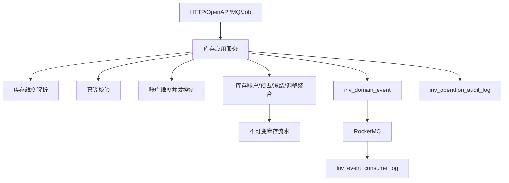

# 02-中央库存系统接口事件实现逻辑

> 本文承接 `docs/06-子系统接口设计/04-中央库存系统接口设计.md`、`docs/07-子系统事件生产与消费/04-中央库存系统事件生产与消费设计.md`、`docs/05-子系统数据库设计/04-中央库存系统数据库设计.md` 和 `docs/03-核心业务模型/04-中央库存领域模型`。本文说明中央库存查询接口、库存命令接口、跨系统命令、事件生产和事件消费如何从请求进入库存维度校验、幂等、并发控制、账户聚合、流水、事件表、消息投递和补偿。

## 1. 设计范围

| 范围 | 内容 |
| --- | --- |
| 查询接口 | 工作台、库存余额、可用库存、预占、冻结、调整、流水、快照、对账、事件日志、参数、操作日志、枚举 |
| 写命令接口 | 预占、释放、关闭、重试预占，冻结、解冻，库存调整，快照生成/重算，对账生成/确认/生成调整，事件重放/忽略 |
| 跨系统命令 | OMS/调拨请求预占，WMS 入库确认、出库扣减、盘点差异确认，WMS/质检/风控请求冻结 |
| 事件生产 | 库存账户、预占、冻结、调整、快照、对账命令成功后写 `inv_domain_event` |
| 事件消费 | 消费 OMS 取消/履约、WMS 作业事实、主数据变更等事件，写 `inv_event_consume_log` |
| 异常处理 | 幂等冲突、可用不足、负库存、并发版本冲突、单位换算失败、重复消费、乱序事件 |

不包含：

- 仓内库位、容器、作业过程由 WMS 拥有。
- 销售订单和履约编排由 OMS 拥有。
- 费用和结算由 BMS 拥有。

## 2. 实现架构总览

| 层 | 中央库存组件 | 职责 |
| --- | --- | --- |
| 接口层 | `InventoryController`、`InventoryOpenApiController`、`InventoryEventConsumer`、`InventoryJobHandler` | 接收 HTTP、OpenAPI、MQ、Job 请求 |
| 应用层 | 余额查询、可用查询、预占、冻结、调整、快照、对账应用服务 | 编排权限、幂等、事务、锁、聚合、事件、审计 |
| 领域层 | 库存账户、库存预占、冻结单、库存调整单、库存快照、库存对账单聚合 | 保护可用、预占、冻结、现货、流水和状态不变量 |
| 基础设施层 | Repository、Mapper、RPC、MQ、Redis 锁/缓存 | 数据库、外部系统、消息、短锁 |
| 读模型层 | BalanceQuery、AvailableQuery、LedgerQuery、TraceQuery | 支撑查询和追踪，不改库存 |

## 3. 查询接口实现逻辑

| 页面/接口组 | 主要接口 | 权限校验 | 本地查询 | 可能调用外部 RPC | 异常处理 |
| --- | --- | --- | --- | --- | --- |
| 工作台 | `/workbench/summary`、`/workbench/todos` | 仓库、货主、库存角色 | 预占异常、冻结、调整、对账、事件失败 | 无 | 数据范围为空返回空 |
| 余额/可用 | `/balances`、`/available/query` | 仓库、货主、SKU 范围 | 账户读模型、可用口径 | 主数据 SKU/仓库快照 | 查询不承诺锁库存 |
| 预占 | `/reservations` | 来源系统、仓库、货主 | 预占单、释放/扣减进度 | OMS/WMS 轨迹可选 | 外部失败显示本地状态 |
| 冻结/调整 | `/freezes`、`/adjustments` | 库存操作和审批权限 | 冻结单、调整单 | 审批状态 | 金额/成本字段脱敏 |
| 流水/轨迹 | `/ledgers`、`/traces/by-source-doc` | 来源单和仓库货主范围 | 不可变流水、事件链路 | 无 | 无权限返回 `404` |
| 快照/对账 | `/snapshots`、`/reconciliations` | 仓库、货主、对账权限 | 快照、对账差异 | WMS 库存快照 | 外部失败不写半成品 |
| 事件/参数/日志/枚举 | `/event-logs`、`/settings`、`/operation-logs`、`/enums` | 管理员、审计、配置权限 | 事件表、配置、审计 | 无 | 重放/忽略必须写原因 |

## 4. 命令接口实现逻辑

| 接口组 | 写接口 | 应用服务 | 聚合/领域服务 | 主要写表 | 生产事件 |
| --- | --- | --- | --- | --- | --- |
| 预占 | 请求预占、释放、关闭、重试 | `InventoryReservationApplicationService` | 预占聚合、可用计算服务 | `inv_reservation`、账户表、流水 | `StockReserved/StockReservationReleased/StockReservationFailed` |
| 冻结 | 创建、提交、审批、解冻、外部冻结 | `StockFreezeApplicationService` | 冻结单聚合 | `inv_freeze`、账户表、流水 | `StockFrozen/StockUnfrozen` |
| 调整 | 创建、提交、审批、执行 | `InventoryAdjustmentApplicationService` | 调整单聚合、账户聚合 | `inv_adjustment`、账户表、流水 | `StockAdjusted` |
| WMS 记账 | 入库确认、出库扣减、盘点差异 | `StockAccountingApplicationService` | 库存账户聚合、流水服务 | 账户表、流水、预占表 | `StockInboundConfirmed/StockOutboundConfirmed/StocktakeDifferenceConfirmed` |
| 快照 | 生成、重算 | `InventorySnapshotApplicationService` | 库存快照聚合 | `inv_snapshot` | `InventorySnapshotGenerated/Rebuilt` |
| 对账 | 生成、确认、生成调整 | `InventoryReconciliationApplicationService` | 库存对账单聚合 | `inv_reconciliation` | `InventoryReconciliationGenerated/Confirmed` |
| 事件日志 | 重放、忽略 | `InventoryEventLogApplicationService` | 事件补偿服务 | `inv_domain_event`、`inv_event_consume_log` | 无或补偿事件 |
| 参数/枚举 | 新增、修改、启停 | `InventoryConfigApplicationService` | 参数规则服务 | 配置表 | `InventorySettingChanged` |

## 5. 跨系统命令实现逻辑

| 来源/目标 | 接口 | 中央库存处理 | 主要写表/调用 | 事件/补偿 |
| --- | --- | --- | --- | --- |
| OMS/调拨/退供 -> 库存 | 预占库存 | 校验来源幂等、库存维度、可用数量，锁定预占 | 账户、预占、流水 | 可用不足发布失败事件 |
| 来源系统 -> 库存 | 释放预占 | 校验预占剩余数量，释放账户预占量 | 账户、预占、流水 | 重复释放幂等返回 |
| WMS -> 库存 | 入库确认 | 校验上架/入库来源事实，增加现货和可用 | 账户、流水 | `StockInboundConfirmed` |
| WMS -> 库存 | 出库扣减 | 匹配预占并扣减现货/预占 | 账户、预占、流水 | 扣减失败写失败事件 |
| WMS -> 库存 | 盘点差异 | 生成调整或直接执行调整 | 调整、账户、流水 | 超阈值待审批 |
| WMS/质检/风控 -> 库存 | 外部冻结 | 记录冻结来源和证据，执行冻结 | 冻结单、账户、流水 | 失败返回明确原因 |

## 6. 事件生产逻辑

| 聚合 | 命令 | 事件 | 主要消费者 |
| --- | --- | --- | --- |
| 库存预占 | 预占/释放/关闭 | `StockReserved/StockReservationReleased/StockReservationClosed` | OMS、调拨、退供 |
| 库存账户 | 入库/出库/调整 | `StockInboundConfirmed/StockOutboundConfirmed/StockAdjusted` | OMS、WMS、BMS、BI |
| 冻结单 | 冻结/解冻 | `StockFrozen/StockUnfrozen` | OMS、WMS、风控 |
| 快照 | 生成/重算 | `InventorySnapshotGenerated/Rebuilt` | 对账、BI |
| 对账单 | 生成/确认 | `InventoryReconciliationGenerated/Confirmed` | WMS、财务分析 |

## 7. 事件消费逻辑

| 来源系统 | 事件 | 消费处理 | 幂等键 | 异常处理 |
| --- | --- | --- | --- | --- |
| WMS | `GoodsPutawayCompleted` | 入库确认，增加账户库存 | `WMS:{eventId}:INBOUND` | 单位换算失败进入人工 |
| WMS | `OutboundOrderShipped` | 出库扣减，关闭预占 | `WMS:{eventId}:OUTBOUND` | 数量超过预占失败 |
| WMS | `StocktakeDifferenceConfirmed` | 生成或执行库存调整 | `WMS:{eventId}:STOCKTAKE` | 超阈值待审批 |
| OMS | `SalesOrderCanceled/FulfillmentCanceled` | 释放预占 | `OMS:{eventId}:RELEASE` | 预占不存在待重试或忽略 |
| 主数据 | `SkuChanged/WarehouseChanged` | 刷新库存维度快照 | `MDM:{eventId}:SNAPSHOT` | 旧版本忽略 |

## 8. 异常、补偿、幂等和审计

| 场景 | 处理策略 |
| --- | --- |
| 库存并发 | 按库存账户维度乐观锁或短锁，冲突重试有限次数 |
| 可用不足 | 按策略全部失败或部分预占，必须写失败原因 |
| 负库存 | 默认禁止；如业务配置允许，必须记录豁免策略和审批 |
| 重复记账 | 来源系统、来源单、来源行、业务类型和幂等键唯一 |
| 流水 | 所有库存变化写不可变流水，禁止只改余额 |
| 审计 | 所有库存命令、事件消费、人工重放/忽略写审计 |

## 9. DDD 对齐说明

| 领域驱动设计项 | 对齐口径 |
| --- | --- |
| 限界上下文 | 中央库存拥有库存账户、可用口径、预占、冻结、流水、快照、对账主权 |
| 核心聚合 | 库存账户、库存预占、冻结单、库存调整单、库存快照、库存对账单 |
| 数据主权 | WMS 拥有仓内作业和库位库存，OMS 拥有履约，BMS 拥有结算 |
| 命令 | 预占、释放、冻结、解冻、入库确认、出库扣减、调整、对账 |
| 生产事件 | 库存事实已发生，如 `StockReserved`、`StockOutboundConfirmed` |
| 消费事件 | WMS 作业事实、OMS 取消、主数据变更 |
| 查询模型 | 余额、可用、流水、轨迹、快照、对账读模型 |
| 异常补偿 | 并发冲突、记账失败、重复消费、乱序事件都要可追溯 |

## 继续上下文

当前结论：中央库存接口事件实现以库存账户聚合、不可变流水和来源幂等为核心。  
关键假设：中央库存是全局库存账户事实源，WMS 只是仓内实物事实源。  
待决问题：部分预占策略、负库存豁免策略、库存维度配置版本。  
下一步：继续维护 `03-中央库存系统接口逐项实现设计.md` 的逐接口编码说明。
