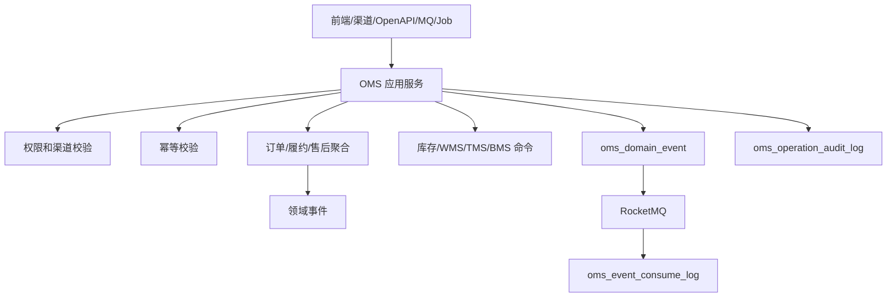

# 02-OMS系统接口事件实现逻辑

> 本文承接 `docs/06-子系统接口设计/05-OMS系统接口设计.md`、`docs/07-子系统事件生产与消费/05-OMS系统事件生产与消费设计.md`、`docs/05-子系统数据库设计/05-OMS系统数据库设计.md` 和 `docs/03-核心业务模型/05-OMS领域模型`。本文说明 OMS 查询接口、订单命令、履约命令、取消售后命令、跨系统命令、事件生产和事件消费如何从接口进入权限、幂等、订单/履约聚合、事务、事件落库、消息投递和补偿。

## 1. 设计范围

| 范围 | 内容 |
| --- | --- |
| 查询接口 | 工作台、渠道订单、销售订单、审单结果、履约单、库存预占引用、出库引用、取消申请、售后单、异常、规则、日志、枚举 |
| 写命令接口 | 渠道订单导入、手工建单、审核、取消、重审、分仓、换仓、拆合单、预占、释放、下发 WMS、取消 WMS、售后审核、退款、补发、异常处理、规则发布 |
| 跨系统命令 | 渠道/客服接入订单/取消/售后，OMS 调用中央库存预占/释放，调用 WMS 出库/退货入库，调用 BMS 退款 |
| 事件生产 | 销售订单、履约、取消、售后、异常、规则命令成功后写 `oms_domain_event` |
| 事件消费 | 消费中央库存、WMS、TMS、BMS、主数据事件，写 `oms_event_consume_log` |
| 异常处理 | 渠道重复回调、审单失败、库存不足、WMS 下发失败、取消拦截失败、售后退款失败、事件乱序 |

不包含：

- 全局库存预占和扣减由中央库存拥有。
- 仓内作业由 WMS 拥有。
- 运输轨迹和签收由 TMS 拥有。
- 退款结算和财务交接由 BMS 拥有。

## 2. 实现架构总览

| 层 | OMS 组件 | 职责 |
| --- | --- | --- |
| 接口层 | `OmsController`、`OmsOpenApiController`、`OmsEventConsumer`、`OmsJobHandler` | 接收前端、渠道、客服、MQ、Job 请求 |
| 应用层 | 渠道接入、销售订单、审单、履约、预占、出库、取消、售后、异常、规则应用服务 | 编排权限、幂等、事务、聚合、外部命令、事件、审计 |
| 领域层 | 渠道订单接入记录、销售订单、审单结果、履约单、出库引用、取消申请、售后单、订单异常、规则配置聚合 | 保护订单数量、金额、履约、取消、售后不变量 |
| 基础设施层 | Repository、Mapper、渠道适配、库存/WMS/TMS/BMS RPC、MQ、Redis | 数据库、外部调用、消息、缓存 |
| 读模型层 | Query Service、订单看板、履约轨迹、导出 | 支撑查询和追踪 |

## 3. 查询接口实现逻辑

| 页面/接口组 | 主要接口 | 权限校验 | 本地查询 | 可能调用外部 RPC | 异常处理 |
| --- | --- | --- | --- | --- | --- |
| 工作台 | `/workbench/summary`、`/workbench/todos` | 组织、渠道、店铺、角色 | 待审、待预占、待下发、售后、异常 | 无 | 数据范围为空返回空 |
| 渠道订单 | `/channel-orders` | 渠道、店铺、组织 | 接入记录、原始报文、解析结果 | 无 | 原始报文脱敏 |
| 销售订单/审单 | `/sales-orders`、`/audit-results` | 组织、渠道、客户、金额权限 | 订单、审单、履约摘要 | 主数据客户/SKU 快照 | 金额无权限脱敏 |
| 履约/预占/出库 | `/fulfillments`、`/reservations`、`/outbounds` | 仓库、履约组织 | 履约、预占引用、WMS 引用 | 库存轨迹、WMS 状态 | 外部失败展示本地快照 |
| 取消/售后/异常 | `/cancel-requests`、`/after-sales`、`/exceptions` | 客服、售后、组织权限 | 取消、售后、异常读模型 | BMS 退款状态、TMS 签收 | 外部失败标记同步中 |
| 规则/日志/枚举 | `/rules`、`/operation-logs`、`/enums` | 配置、审计权限 | 规则版本、审计、配置 | 无 | 大范围导出异步 |

## 4. 命令接口实现逻辑

| 接口组 | 写接口 | 应用服务 | 聚合/领域服务 | 主要写表 | 生产事件 |
| --- | --- | --- | --- | --- | --- |
| 渠道接入 | 导入、重试、忽略、手工建单 | `ChannelOrderApplicationService` | 渠道接入记录、销售订单聚合 | `oms_channel_order`、`oms_sales_order` | `ChannelOrderImported/SalesOrderCreated` |
| 销售订单 | 新增、编辑、审核、取消、重审 | `SalesOrderApplicationService` | 销售订单聚合、审单规则服务 | `oms_sales_order` | `SalesOrderApproved/Canceled/Reaudited` |
| 审单 | 人工通过、驳回、修正 | `OrderAuditApplicationService` | 审单结果聚合 | `oms_audit_result` | `OrderAuditApproved/Rejected/Fixed` |
| 履约 | 分仓、换仓、拆单、合单 | `FulfillmentApplicationService` | 履约单聚合、分仓策略服务 | `oms_fulfillment` | `FulfillmentOrderCreated/WarehouseChanged/Split/Merged` |
| 预占 | 请求预占、释放预占 | `StockReservationApplicationService` | 履约单、预占引用 | `oms_stock_reservation` | `StockReservationRequested/ReleaseRequested` |
| 出库 | 创建、下发、取消、重推 | `OutboundApplicationService` | OMS 出库引用聚合 | `oms_outbound` | `OutboundOrderReleased/CancelRequested` |
| 取消申请 | 创建、审批、拒绝、转售后 | `CancelRequestApplicationService` | 取消申请聚合 | `oms_cancel_request` | `CancelRequestCreated/Approved/Rejected` |
| 售后 | 创建、审核、驳回、退款、补发、关闭 | `AfterSaleApplicationService` | 售后单聚合 | `oms_after_sale` | `AfterSaleCreated/Approved/RefundRequested/ReshipCreated` |
| 异常 | 分派、处理、关闭、重试 | `OrderExceptionApplicationService` | 订单异常聚合 | `oms_exception` | `OrderExceptionProcessed/Closed` |
| 规则 | 新增、编辑、启停、发布 | `OmsRuleApplicationService` | 规则配置聚合 | `oms_rule` | `OmsRulePublished` |

## 5. 跨系统命令实现逻辑

| 来源/目标 | 接口 | OMS 处理 | 主要写表/调用 | 事件/补偿 |
| --- | --- | --- | --- | --- |
| 渠道/客服 -> OMS | 订单、取消、售后接入 | 校验渠道签名和业务幂等，保存原始报文并转换命令 | 接入记录、订单/取消/售后 | 解析失败可重试 |
| OMS -> 中央库存 | 预占、释放 | 同步命令请求库存，结果写本地预占引用 | 库存 RPC、预占引用 | 失败生成缺货/补偿异常 |
| OMS -> WMS | 创建/取消出库、退货入库 | 以来源单幂等调用 WMS，不直接写 WMS 作业 | WMS RPC、出库引用 | 失败写重推任务 |
| OMS -> BMS | 退款结算请求 | 售后审核后发送退款结算事实 | BMS RPC/事件 | 失败不关闭售后 |
| 外部 -> OMS | 状态/轨迹查询 | 返回授权范围内订单履约读模型 | 本地读模型 | 不触发状态变更 |

## 6. 事件生产逻辑

| 聚合 | 命令 | 事件 | 主要消费者 |
| --- | --- | --- | --- |
| 销售订单 | 创建/审核/取消 | `SalesOrderCreated/Approved/Canceled` | 库存、WMS、BMS、BI |
| 履约单 | 分仓/拆合/换仓 | `FulfillmentOrderCreated/WarehouseAllocated/FulfillmentSplit` | 库存、WMS |
| 出库引用 | 下发/取消 | `OutboundOrderReleaseRequested/OutboundCancelRequested` | WMS |
| 取消申请 | 审批/拒绝 | `CancelRequestApproved/Rejected` | 库存、WMS、渠道 |
| 售后单 | 审核/退款/补发 | `AfterSaleApproved/RefundRequested/ReshipFulfillmentCreated` | WMS、BMS、渠道 |
| 异常 | 处理/关闭 | `OrderExceptionProcessed/Closed` | 工作台、BI |

## 7. 事件消费逻辑

| 来源系统 | 事件 | 消费处理 | 幂等键 | 异常处理 |
| --- | --- | --- | --- | --- |
| 中央库存 | `StockReserved/StockReservationFailed/StockReservationReleased` | 推进履约预占状态，生成缺货或释放结果 | `INV:{eventId}:RESERVATION` | 履约单不存在待重试 |
| WMS | `OutboundOrderCreated/PackageCompleted/OutboundOrderShipped` | 推进出库和履约状态 | `WMS:{eventId}:OUTBOUND` | 状态回退事件忽略 |
| TMS | `TrackingAppended/TransportSigned/TransportRejected` | 更新物流轨迹和签收结果 | `TMS:{eventId}:TRACK` | 签收冲正生成补偿任务 |
| BMS | `RefundAccepted/RefundFailed/FinanceHandoverCompleted` | 更新售后退款结算引用 | `BMS:{eventId}:REFUND` | 金额不匹配进入人工 |
| 主数据 | `SkuChanged/CustomerChanged/WarehouseChanged` | 刷新订单校验快照 | `MDM:{eventId}:SNAPSHOT` | 旧版本忽略 |

## 8. 异常、补偿、幂等和审计

| 场景 | 处理策略 |
| --- | --- |
| 渠道重复回调 | `channelCode + externalOrderNo + orderVersion` 唯一，相同报文返回历史结果 |
| 库存不足 | 履约进入缺货异常，可重试预占、换仓、拆单或取消 |
| WMS 下发失败 | 本地出库引用保留失败状态，支持按来源单幂等重推 |
| 取消拦截失败 | 取消申请转售后建议或人工处理，不回退已发货事实 |
| 事件乱序 | 按履约/出库状态机判断，低版本忽略，高版本缺前置待重试 |
| 审计 | 所有订单、履约、取消、售后、异常和事件消费写 `oms_operation_audit_log` |

## 9. DDD 对齐说明

| 领域驱动设计项 | 对齐口径 |
| --- | --- |
| 限界上下文 | OMS 拥有销售订单、履约、取消、售后、异常和规则主权 |
| 核心聚合 | 销售订单、履约单、出库引用、取消申请、售后单、订单异常、规则配置 |
| 数据主权 | 库存、仓内作业、运输签收、结算分别由中央库存、WMS、TMS、BMS 拥有 |
| 命令 | 导入、审核、分仓、预占、下发、取消、售后、退款、补发 |
| 生产事件 | 订单和履约事实已发生 |
| 消费事件 | 库存预占、WMS 发货、TMS 签收、BMS 退款 |
| 查询模型 | 订单列表、履约轨迹、售后看板、异常看板 |
| 异常补偿 | 缺货、下发失败、取消失败、退款失败都进入可审计补偿链路 |

## 继续上下文

当前结论：OMS 接口事件实现围绕销售订单和履约编排，通过命令/事件和库存、WMS、TMS、BMS 协作。  
关键假设：OMS 不拥有库存扣减、仓内发货、运输签收和财务入账事实。  
待决问题：审单规则引擎位置、取消拦截失败后的默认售后策略。  
下一步：继续维护 `03-OMS系统接口逐项实现设计.md` 的逐接口编码说明。
