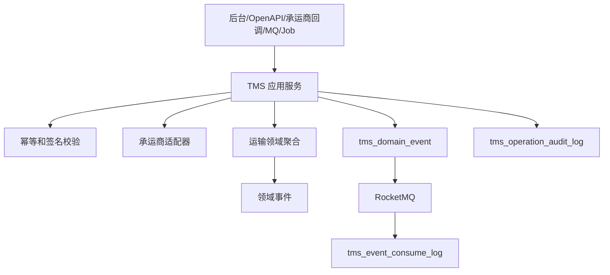

# 02-TMS系统接口事件实现逻辑

> 本文承接 `docs/06-子系统接口设计/06-TMS系统接口设计.md`、`docs/07-子系统事件生产与消费/06-TMS系统事件生产与消费设计.md`、`docs/05-子系统数据库设计/06-TMS系统数据库设计.md` 和 `docs/03-核心业务模型/06-TMS领域模型`。本文说明 TMS 查询接口、运输命令、承运商回调、费用来源命令、跨系统命令、事件生产和事件消费如何从接口进入权限、幂等、承运商适配、运输聚合、事件落库、消息投递和补偿。

## 1. 设计范围

| 范围 | 内容 |
| --- | --- |
| 查询接口 | 工作台、运输任务、运单、面单、轨迹、签收、物流异常、费用来源、承运商接口配置、物流规则、回调消息、日志、枚举 |
| 写命令接口 | 创建/接单/取消运输任务，创建/作废运单，生成/打印/作废面单，同步/补录轨迹，签收冲正，异常处理，生成/重算/推送费用来源 |
| 承运商回调 | 轨迹、揽收、签收、拒收、异常、费用等回调进入回调消息表并幂等处理 |
| 跨系统命令 | OMS/WMS/采购/供应商创建运输任务，TMS 向 BMS 推送费用来源，向来源系统发布运输事实 |
| 事件生产 | 运输任务、运单、面单、轨迹、签收、异常、费用来源命令成功后写 `tms_domain_event` |
| 事件消费 | 消费 OMS/WMS/采购/供应商/主数据/BMS 事件，写 `tms_event_consume_log` |

不包含：

- 销售订单履约由 OMS 拥有。
- 仓内包装发货由 WMS 拥有。
- 费用计算和对账由 BMS 拥有。

## 2. 实现架构总览

| 层 | TMS 组件 | 职责 |
| --- | --- | --- |
| 接口层 | `TmsController`、`TmsOpenApiController`、`CarrierCallbackController`、`TmsEventConsumer`、`TmsJobHandler` | 接收后台、OpenAPI、承运商回调、MQ、Job |
| 应用层 | 运输任务、运单、面单、轨迹、签收、异常、费用来源、承运商配置应用服务 | 编排权限、幂等、承运商调用、事务、聚合、事件、审计 |
| 领域层 | 运输任务、运单、面单、物流轨迹、签收记录、物流异常、物流费用来源聚合 | 保护运输状态机、轨迹追加、签收冲正、费用来源不变量 |
| 基础设施层 | 承运商 Adapter、Repository、Mapper、RPC、MQ、文件 | 承运商 API、数据库、外部系统、文件和消息 |
| 读模型层 | Query Service、轨迹读模型、回调日志、导出 | 支撑查询和追踪 |

## 3. 查询接口实现逻辑

| 页面/接口组 | 主要接口 | 权限校验 | 本地查询 | 可能调用外部 RPC | 异常处理 |
| --- | --- | --- | --- | --- | --- |
| 工作台 | `/workbench/summary`、`/workbench/todos` | 组织、仓库、承运商 | 待建单、轨迹异常、签收异常、费用失败 | 无 | 数据范围为空返回空 |
| 运输任务/运单 | `/transport-tasks`、`/waybills` | 来源系统、仓库、承运商 | 任务、运单、包裹、状态 | 承运商状态可选 | 承运商失败不影响本地展示 |
| 面单/轨迹/签收 | `/shipping-labels`、`/tracks`、`/delivery-receipts` | 仓库、承运商、来源单 | 面单、轨迹、签收读模型 | 对象存储文件 | 文件失败不影响主体 |
| 异常/费用 | `/exceptions`、`/fee-sources` | 异常类型、费用权限 | 异常、费用来源 | BMS 采集状态 | BMS 失败显示待采集 |
| 配置/回调/日志/枚举 | `/carrier-integrations`、`/callback-messages`、`/operation-logs`、`/enums` | 配置、审计权限 | 配置表、回调原文、审计 | 无 | 原文敏感字段脱敏 |

## 4. 命令接口实现逻辑

| 接口组 | 写接口 | 应用服务 | 聚合/领域服务 | 主要写表 | 生产事件 |
| --- | --- | --- | --- | --- | --- |
| 运输任务 | 创建、编辑、接单、取消 | `TransportTaskApplicationService` | 运输任务聚合、承运能力服务 | `tms_transport_task` | `TransportTaskCreated/Canceled` |
| 运单 | 创建、取消、同步轨迹 | `WaybillApplicationService` | 运单聚合、承运商网关 | `tms_waybill` | `WaybillCreated/Voided/CreateFailed` |
| 面单 | 生成、打印、作废 | `ShippingLabelApplicationService` | 面单聚合 | `tms_shipping_label` | `ShippingLabelGenerated/Printed/Voided` |
| 轨迹 | 同步、补录 | `TrackingApplicationService` | 物流轨迹聚合 | `tms_tracking` | `TrackingAppended/Supplemented` |
| 签收 | 冲正、上传证明、通知来源 | `DeliveryReceiptApplicationService` | 签收记录聚合 | `tms_delivery_receipt` | `TransportSigned/DeliveryReceiptCorrected` |
| 异常 | 登记、分派、处理、关闭 | `LogisticsExceptionApplicationService` | 物流异常聚合 | `tms_exception` | `LogisticsExceptionRegistered/Closed` |
| 费用来源 | 生成、重算、推送、作废 | `LogisticsFeeSourceApplicationService` | 费用来源聚合 | `tms_fee_source` | `LogisticsFeeSourceGenerated/Pushed/Corrected` |
| 配置/规则 | 承运商配置、物流规则 | `CarrierConfigApplicationService` | 配置规则服务 | 配置表 | `CarrierIntegrationChanged/LogisticsRuleChanged` |

## 5. 承运商回调和跨系统命令

| 来源/目标 | 接口 | TMS 处理 | 主要写表/调用 | 事件/补偿 |
| --- | --- | --- | --- | --- |
| 承运商 -> TMS | 回调入口 | 校验签名、保存原文、按承运商适配器解析轨迹/签收/异常 | 回调消息、轨迹、签收、异常表 | 解析失败进入回调异常页 |
| OMS/WMS/采购/供应商 -> TMS | 创建运输任务 | 校验来源幂等、地址、包裹、物流产品，创建任务或运单 | 任务、运单 | 承运失败返回业务错误 |
| 来源系统 -> TMS | 查询轨迹/签收 | 返回授权来源单运输事实 | 读模型 | 查询不改状态 |
| TMS -> BMS | 推送费用来源 | 推送费用指标和规则快照引用 | BMS RPC/事件 | 失败写重推任务 |

## 6. 事件生产逻辑

| 聚合 | 命令/回调 | 事件 | 主要消费者 |
| --- | --- | --- | --- |
| 运输任务 | 创建/取消 | `TransportTaskCreated/Canceled` | OMS、WMS、采购、供应商 |
| 运单 | 创建/作废 | `WaybillCreated/WaybillVoided` | OMS、WMS、BMS |
| 面单 | 生成/打印/作废 | `ShippingLabelGenerated/Printed/Voided` | WMS、审计 |
| 轨迹 | 追加/补录 | `TrackingAppended/TrackingSupplemented` | OMS、采购、供应商、客服 |
| 签收记录 | 签收/拒收/部分签收/冲正 | `TransportSigned/TransportRejected/PartialSigned/DeliveryReceiptCorrected` | OMS、采购、BMS |
| 物流异常 | 登记/关闭 | `LogisticsExceptionRegistered/Closed` | OMS、WMS、BMS |
| 费用来源 | 生成/推送/修正 | `LogisticsFeeSourceGenerated/Pushed/Corrected` | BMS |

## 7. 事件消费逻辑

| 来源系统 | 事件 | 消费处理 | 幂等键 | 异常处理 |
| --- | --- | --- | --- | --- |
| OMS | `SalesDeliveryRequested/ReturnPickupRequested` | 创建销售发货或退货运输任务 | `OMS:{eventId}:TASK` | 地址异常生成失败事件 |
| WMS | `PackageCompleted/OutboundOrderShipped` | 补充包裹、推进发货轨迹 | `WMS:{eventId}:PACKAGE` | 运单不存在待重试 |
| 供应商/采购 | `AsnSubmitted/SupplierReturnApproved` | 创建采购到货或退供运输任务 | `SUPPLIER:{eventId}:ASN` | 来源单重复幂等 |
| 主数据 | `CarrierEnabled/LogisticsProductEnabled` | 刷新承运商和物流产品快照 | `MDM:{eventId}:CARRIER` | 旧版本忽略 |
| BMS | `BmsFeeSourceCollected/ReconciliationDifferenceCreated` | 回写费用来源采集和差异状态 | `BMS:{eventId}:FEE` | 金额不匹配人工处理 |

## 8. 异常、补偿、幂等和审计

| 场景 | 处理策略 |
| --- | --- |
| 承运商超时 | 运单进入待确认，Job 查询承运商结果，避免重复建单 |
| 回调重复 | `carrierCode + carrierWaybillNo + callbackType + rawHash` 幂等 |
| 轨迹乱序 | 轨迹追加保留发生时间和接收时间，不回退终态 |
| 签收冲正 | 必须保留原签收、新签收、原因、审批和操作者 |
| 费用推送失败 | 费用来源状态为推送失败，按幂等键重推 |
| 审计 | 承运商调用、回调处理、高危操作、事件消费写 `tms_operation_audit_log` |

## 9. DDD 对齐说明

| 领域驱动设计项 | 对齐口径 |
| --- | --- |
| 限界上下文 | TMS 拥有运输任务、运单、面单、轨迹、签收、物流异常、费用来源主权 |
| 核心聚合 | 运输任务、运单、面单、轨迹、签收记录、物流异常、物流费用来源 |
| 数据主权 | OMS 拥有订单履约，WMS 拥有仓内交接，BMS 拥有费用结算 |
| 命令 | 创建任务、建单、作废、同步轨迹、签收冲正、生成费用 |
| 生产事件 | 运输事实已发生，如 `WaybillCreated`、`TransportSigned` |
| 消费事件 | 销售发货、包裹完成、承运商启用、BMS 采集 |
| 查询模型 | 运单轨迹、签收、费用来源、回调消息 |
| 异常补偿 | 承运商超时、回调失败、费用推送失败可审计重试 |

## 继续上下文

当前结论：TMS 接口事件实现以承运商适配、回调幂等、轨迹追加、签收冲正和费用来源推送为核心。  
关键假设：承运商接口不稳定，需要待确认和补偿任务。  
待决问题：承运商回调签名算法、面单文件有效期、签收冲正审批策略。  
下一步：继续维护 `03-TMS系统接口逐项实现设计.md` 的逐接口编码说明。
