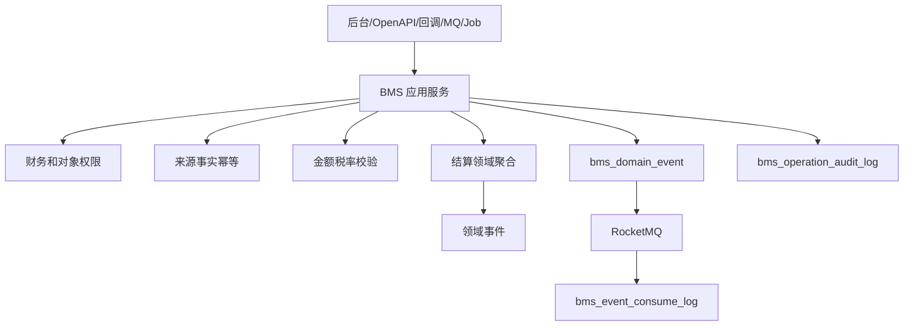

# 02-BMS系统接口事件实现逻辑

> 本文承接 `docs/06-子系统接口设计/07-BMS系统接口设计.md`、`docs/07-子系统事件生产与消费/07-BMS系统事件生产与消费设计.md`、`docs/05-子系统数据库设计/07-BMS系统数据库设计.md` 和 `docs/03-核心业务模型/07-BMS领域模型`。本文说明 BMS 查询接口、计费命令、费用采集命令、对账账单命令、发票财务回调、事件生产和事件消费如何从接口进入权限、幂等、金额校验、聚合、事务、事件表和补偿。

## 1. 设计范围

| 范围 | 内容 |
| --- | --- |
| 查询接口 | 工作台、计费对象、计费规则、费用来源、费用明细、调整单、对账单、账单、发票交接、财务交接、报表、日志、枚举 |
| 写命令接口 | 计费对象启停，规则发布，费用来源采集/重放/忽略/重算，费用明细重算/作废，调整单提交/审批/执行，对账生成/确认/差异，账单生成/确认，发票请求/回填/作废，财务交接/凭证回填 |
| 跨系统命令 | WMS/OMS/库存/TMS 采集费用来源，OMS 退款结算，外部门户对账确认/差异，发票/财务系统回调 |
| 事件生产 | 计费、费用、对账、账单、发票、财务命令成功后写 `bms_domain_event` |
| 事件消费 | 消费 WMS、OMS、库存、TMS、主数据、财务事件，写 `bms_event_consume_log` |
| 异常处理 | 来源事实重复、规则缺失、金额不平、税率不一致、对账差异、财务回调重复、事件乱序 |

不包含：

- 仓储、订单、运输、库存原始事实由对应业务系统拥有。
- 会计入账凭证事实由财务系统拥有，BMS 只保存交接和回填结果。

## 2. 实现架构总览

| 层 | BMS 组件 | 职责 |
| --- | --- | --- |
| 接口层 | `BmsController`、`BmsOpenApiController`、`BmsInternalCallbackController`、`BmsEventConsumer`、`BmsJobHandler` | 接收后台、OpenAPI、内部回调、MQ、Job |
| 应用层 | 计费对象、计费规则、费用来源、费用明细、调整、对账、账单、发票、财务应用服务 | 编排权限、幂等、事务、金额校验、聚合、事件、审计 |
| 领域层 | 计费对象、计费规则、费用来源事件、费用明细、调整单、对账单、账单、发票交接、财务交接聚合 | 保护规则版本、金额税率、账期、状态机不变量 |
| 基础设施层 | Repository、Mapper、财务/发票 RPC、MQ、文件、对象存储 | 数据库、外部系统、消息、附件 |
| 读模型层 | Query Service、报表、导出 | 支撑查询和报表 |

## 3. 查询接口实现逻辑

| 页面/接口组 | 主要接口 | 权限校验 | 本地查询 | 可能调用外部 RPC | 异常处理 |
| --- | --- | --- | --- | --- | --- |
| 工作台 | `/workbench/summary`、`/workbench/todos` | 财务组织、结算对象、角色 | 计费失败、待对账、待开票、待交财务 | 无 | 数据范围为空返回空 |
| 计费配置 | `/billing-objects`、`/billing-rules` | 结算对象、费用类型、配置权限 | 计费对象、规则版本 | 主数据对象快照 | 价格配置按权限脱敏 |
| 费用 | `/source-events`、`/billing-items` | 来源系统、账期、对象权限 | 来源事件、费用明细 | 无 | 原始 payload 脱敏 |
| 调整/对账/账单 | `/adjustments`、`/reconciliations`、`/bills` | 财务组织、对象、账期 | 调整、对账、账单读模型 | 外部门户确认状态 | 外部失败显示本地状态 |
| 发票/财务 | `/invoices`、`/finance-handovers` | 发票、财务权限 | 发票交接、凭证交接 | 发票/财务系统状态 | 回调延迟显示待同步 |
| 报表/日志/枚举 | `/reports`、`/operation-logs`、`/enums` | 报表、审计、配置权限 | 报表表、审计表、枚举 | 无 | 大范围导出异步 |

## 4. 命令接口实现逻辑

| 接口组 | 写接口 | 应用服务 | 聚合/领域服务 | 主要写表 | 生产事件 |
| --- | --- | --- | --- | --- | --- |
| 计费对象 | 创建、修改、启停 | `BillingObjectApplicationService` | 计费对象聚合 | `bms_billing_object` | `BillingObjectCreated/Enabled/Disabled` |
| 计费规则 | 创建、修改、发布、停用、复制 | `BillingRuleApplicationService` | 计费规则聚合 | `bms_billing_rule` | `BillingRulePublished/Disabled` |
| 费用来源 | 采集、重放、忽略、重算 | `BillingSourceEventApplicationService` | 费用来源事件聚合、计费识别服务 | `bms_source_event` | `BillingSourceEventCollected/BillableFactIdentified` |
| 费用明细 | 生成、重算、作废、导出 | `BillingItemApplicationService` | 费用明细聚合、金额服务 | `bms_billing_item` | `BillingItemGenerated/Recalculated/Voided` |
| 调整单 | 创建、提交、审批、执行 | `BillingAdjustmentApplicationService` | 费用调整单聚合 | `bms_adjustment` | `BillingAdjustmentExecuted` |
| 对账单 | 生成、提交、确认、差异、关闭 | `ReconciliationApplicationService` | 对账单聚合 | `bms_reconciliation` | `ReconciliationGenerated/Confirmed/DifferenceCreated` |
| 账单 | 生成、确认、关闭、交财务 | `BillApplicationService` | 账单聚合 | `bms_bill` | `BillGenerated/Confirmed` |
| 发票 | 请求开票、回填、作废 | `InvoiceApplicationService` | 发票交接聚合 | `bms_invoice` | `InvoiceRequested/Issued/Voided` |
| 财务交接 | 交财务、回填凭证、关闭 | `FinanceHandoverApplicationService` | 财务交接聚合 | `bms_finance_handover` | `FinanceHandoverRequested/Completed` |

## 5. 跨系统命令和回调实现逻辑

| 来源/目标 | 接口 | BMS 处理 | 主要写表/调用 | 事件/补偿 |
| --- | --- | --- | --- | --- |
| WMS/OMS/库存/TMS -> BMS | 采集费用来源 | 校验来源签名、幂等键、计费对象、指标，生成费用来源 | 来源事件、费用明细 | 规则缺失进入计费失败 |
| OMS -> BMS | 退款结算请求 | 记录退款事实，生成负向费用或财务交接 | 来源事件、费用明细 | 金额不匹配人工处理 |
| 外部门户 -> BMS | 对账确认/差异/账单查询 | 校验对象授权，推进对账或返回账单 | 对账单、差异 | 证据不足返回 `422` |
| 发票系统 -> BMS | 开票完成回调 | 校验发票号、金额、税额，回填发票 | 发票交接 | 重复回调幂等 |
| 财务系统 -> BMS | 入账完成回调 | 校验凭证号、金额，关闭财务交接 | 财务交接 | 凭证重复 `409` |

## 6. 事件生产逻辑

| 聚合 | 命令 | 事件 | 主要消费者 |
| --- | --- | --- | --- |
| 计费对象/规则 | 启停/发布 | `BillingObjectEnabled/BillingRulePublished` | 计费服务、BI |
| 费用来源 | 采集/识别 | `BillingSourceEventCollected/BillableFactIdentified` | 费用明细、BI |
| 费用明细 | 生成/重算/作废 | `BillingItemGenerated/Recalculated/Voided` | 对账、BI |
| 调整单 | 执行 | `BillingAdjustmentExecuted` | 对账、账单 |
| 对账单 | 生成/确认/差异 | `ReconciliationGenerated/Confirmed/DifferenceCreated` | 外部门户、账单 |
| 账单 | 生成/确认 | `BillGenerated/BillConfirmed` | 发票、财务 |
| 发票/财务 | 请求/回填/入账 | `InvoiceRequested/InvoiceIssued/FinanceHandoverCompleted` | 财务、外部门户、BI |

## 7. 事件消费逻辑

| 来源系统 | 事件 | 消费处理 | 幂等键 | 异常处理 |
| --- | --- | --- | --- | --- |
| WMS | `GoodsReceived/GoodsPutawayCompleted/OutboundOrderShipped` | 采集仓储作业费用来源 | `WMS:{eventId}:FEE` | 规则缺失计费失败 |
| TMS | `LogisticsFeeSourceGenerated/Pushed` | 采集物流费用来源 | `TMS:{eventId}:FEE` | 指标缺失人工处理 |
| OMS | `AfterSaleApproved/RefundRequested` | 记录退款或售后结算事实 | `OMS:{eventId}:REFUND` | 金额不匹配人工处理 |
| 中央库存 | `StockAdjusted/InventorySnapshotGenerated` | 采集库存调整或存储费用事实 | `INV:{eventId}:FEE` | 账期缺失失败 |
| 主数据 | `BillingObjectChanged/TaxRateChanged` | 刷新计费对象、税率、币种快照 | `MDM:{eventId}:SNAPSHOT` | 旧版本忽略 |

## 8. 异常、补偿、幂等和审计

| 场景 | 处理策略 |
| --- | --- |
| 来源事实重复 | `sourceSystem + sourceEventId + sourceOrderNo + bizType + feeType` 唯一 |
| 规则缺失 | 来源事件处理失败，保留指标快照，规则补齐后可重放 |
| 金额不平 | 禁止推进对账/账单，进入差异或人工处理 |
| 已对账费用重算 | 不覆盖原费用，必须走调整单生成差额 |
| 财务回调重复 | 按外部回调单号和凭证号幂等 |
| 审计 | 计费、重算、作废、对账、开票、交财务、回调、事件消费全部审计 |

## 9. DDD 对齐说明

| 领域驱动设计项 | 对齐口径 |
| --- | --- |
| 限界上下文 | BMS 拥有费用、对账、账单、发票交接和财务交接主权 |
| 核心聚合 | 计费对象、计费规则、费用来源、费用明细、调整单、对账单、账单、发票交接、财务交接 |
| 数据主权 | 仓储、订单、运输、库存事实由各业务系统拥有；BMS 采集后形成结算事实 |
| 命令 | 采集、计费、重算、作废、调整、对账、开票、交财务 |
| 生产事件 | 结算事实已发生，如 `BillingItemGenerated`、`BillConfirmed` |
| 消费事件 | WMS/OMS/TMS/库存作业事实、主数据税率币种 |
| 查询模型 | 费用、对账、账单、报表、审计读模型 |
| 异常补偿 | 规则缺失、金额不平、回调失败、已锁定费用变更都可审计处理 |

## 继续上下文

当前结论：BMS 接口事件实现以来源事实幂等、规则版本、金额税率、对账账单状态机和财务交接闭环为核心。  
关键假设：BMS 不拥有仓储、订单、运输和库存原始事实，只拥有结算处理结果。  
待决问题：税率/汇率事实源、财务回调协议、外部门户签名方式。  
下一步：继续维护 `03-BMS系统接口逐项实现设计.md` 的逐接口编码说明。
