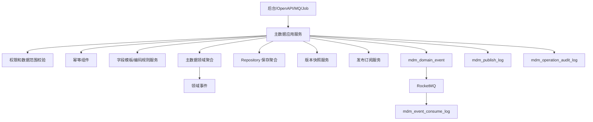
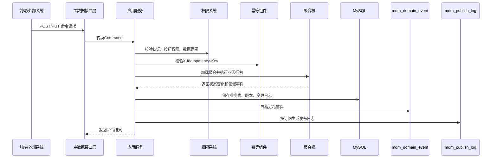

# 02-主数据系统接口事件实现逻辑

> 本文承接 `docs/06-子系统接口设计/08-主数据系统接口设计.md`、`docs/07-子系统事件生产与消费/08-主数据系统事件生产与消费设计.md`、`docs/05-子系统数据库设计/08-主数据系统数据库设计.md` 和 `docs/04-子系统功能设计/08-主数据系统/01-主数据系统产品功能设计.md`。本文说明主数据系统查询接口、命令接口、跨系统开放接口、事件生产和事件消费如何从请求进入权限校验、字段模板校验、编码生成、聚合处理、版本快照、发布日志、事件落库、消息投递和补偿。

## 1. 设计范围

| 范围 | 内容 |
| --- | --- |
| 查询接口 | 主数据类型、字段模板、编码规则、商品/伙伴/仓储主数据、审核、发布、导入任务、变更日志、枚举、操作日志 |
| 写命令接口 | 创建/修改/启停类型，创建/修改/排序/停用字段，创建/修改/启停/预览编码规则，创建/修改/提交/审核/启用/冻结/停用主数据，发布/重试，导入/导出，维护枚举 |
| 跨系统命令 | 主数据查询、批量校验、快照查询、供应商主档查询、仓库库位查询、编码生成、发布回执 |
| 事件生产 | 聚合命令成功后写 `mdm_domain_event`，异步发布到 RocketMQ，并按订阅写 `mdm_publish_log` |
| 事件消费 | 消费审批、权限、供应商、WMS、TMS、BMS 等事件，写 `mdm_event_consume_log` 并更新本地状态 |
| 异常处理 | 字段模板不匹配、编码重复、关键字段需审批、版本冲突、导入部分失败、发布失败、回执失败、重复消费、旧版本事件 |

不包含：

- 采购、仓储、库存、履约、运输、结算的业务单据状态推进。
- 用户身份、菜单按钮、审批流配置主权，归 09-权限系统。
- 下游系统本地缓存刷新实现，主数据只负责发布和回执闭环。

## 2. 实现架构总览

| 层 | 主数据系统组件 | 职责 |
| --- | --- | --- |
| 接口层 | `MdmController`、`MdmOpenApiController`、`MdmEventConsumer`、`MdmJobHandler` | 接收后台 HTTP、OpenAPI、MQ、定时任务请求，做协议参数转换 |
| 应用层 | 类型、字段模板、编码规则、主数据记录、审批、发布、导入、枚举、日志应用服务 | 编排权限、幂等、事务、加载聚合、字段校验、版本生成、发布日志、事件落库 |
| 领域层 | 主数据类型、字段模板、编码规则、主数据记录、主数据版本、发布订阅、导入任务、数据质量问题聚合 | 保护字段模板、唯一编码、关键字段审批、版本不可变、发布订阅不变量 |
| 基础设施层 | Repository、MyBatis Mapper、RPC Client、RocketMQ Producer、Redis Adapter、文件服务 | 数据库、缓存、消息队列、外部系统、导入导出文件 |
| 读模型层 | Query Service、读模型 Mapper、导出查询、发布看板 | 支撑列表、详情、下拉框、批量校验、发布日志和导入任务查询 |

## 3. 查询接口实现逻辑

| 页面/接口组 | 主要接口 | 权限校验 | 本地查询 | 可能调用外部 RPC | 异常处理 |
| --- | --- | --- | --- | --- | --- |
| 主数据类型 | `/types` | `mdm:type:read`、组织/系统配置范围 | `mdm_master_data_type` | 无 | 数据范围为空返回空分页 |
| 字段模板 | `/field-defs` | `mdm:field_def:read` | `mdm_field_definition` | 无 | 引用类型不存在时展示风险标识 |
| 编码规则 | `/code-rules` | `mdm:code_rule:read` | `mdm_code_rule` | 无 | 预览不占用流水 |
| 主数据记录 | `/records`、`/{id}` | 商品/伙伴/仓储对应读权限和数据范围 | `mdm_master_data_record`、版本表、变更日志 | 权限系统解析可见组织/仓库/货主范围 | 字段模板缺失时返回原始快照和风险提示 |
| 审核 | `/approvals` | `master-data:master_dataapproval:read` | `mdm_master_data_change_log` | 权限/审批系统查询审批轨迹 | 审批系统超时返回本地审批状态 |
| 发布 | `/publish-logs`、`/publish-subscriptions` | `master-data:master_datapublish:read/detail` | `mdm_publish_log`、`mdm_publish_subscribe` | 下游回执状态不实时调用，依赖回执表 | 发布日志缺失返回 `404` |
| 导入导出 | `/import-tasks`、`/import-templates` | `master-data:importexport:read/page` | `mdm_import_task`、字段模板 | 文件服务 | 文件过期返回重新生成下载地址 |
| 日志/枚举 | `/change-logs`、`/operation-logs`、`/enums` | 日志/枚举读权限 | 变更日志、审计日志、字段枚举读模型 | 无 | 敏感字段按权限脱敏 |
| OpenAPI 查询 | `/openapi/mdm/v1/master-data/query` 等 | 来源系统白名单和 API 权限 | 主数据记录、版本快照、发布读模型 | 权限系统校验系统账号 | 无可见数据返回空，不泄露存在性 |

## 4. 命令接口实现逻辑

| 接口组 | 写接口 | 应用服务 | 聚合/领域服务 | 主要写表 | 生产事件 |
| --- | --- | --- | --- | --- | --- |
| 主数据类型 | 新增、修改、启用、停用 | `MasterDataTypeApplicationService` | 主数据类型聚合 | `mdm_master_data_type`、事件表、审计表 | `MasterDataTypeCreated/Enabled/Changed/Disabled` |
| 字段模板 | 新增、修改、排序、停用 | `FieldDefinitionApplicationService` | 字段模板聚合、字段规则服务 | `mdm_field_definition`、事件表、审计表 | `FieldTemplateCreated/Published/Changed/Disabled`、`EnumItemChanged` |
| 编码规则 | 新增、修改、启停、预览、生成 | `CodeRuleApplicationService` | 编码规则聚合、流水号服务 | `mdm_code_rule`、事件表、审计表 | `CodeRuleCreated/Enabled/Disabled`、`MasterDataCodeGenerated` |
| 主数据记录 | 新增、修改、提交、启用、冻结、停用 | `MasterDataRecordApplicationService` | 主数据记录聚合、字段模板校验服务、关键字段判定服务 | `mdm_master_data_record`、`mdm_master_data_change_log`、事件表、审计表 | `MasterDataDraftCreated/Submitted/Enabled/ChangeSubmitted/Frozen/Disabled` |
| 审核 | 通过、驳回 | `MasterDataApprovalApplicationService` | 主数据记录聚合、版本服务 | 记录表、变更日志、版本表、发布日志 | `MasterDataEnabled/Rejected/MasterDataVersionGenerated` |
| 发布 | 订阅配置、重试发布、回执处理 | `MasterDataPublishApplicationService` | 发布订阅聚合 | `mdm_publish_subscribe`、`mdm_publish_log`、事件表 | `MasterDataPublished/PublishConfirmed/Republished` |
| 导入导出 | 创建导入、执行导入、取消、导出 | `ImportTaskApplicationService` | 导入任务聚合、字段模板校验、编码服务 | `mdm_import_task`、记录表、变更日志、事件表 | `ImportTaskCreated/Validated/Executed/Completed/Cancelled` |
| 枚举/日志 | 枚举新增/修改/排序/停用、日志导出 | `MdmConfigApplicationService` | 枚举规则服务 | 枚举配置读模型、审计表 | `EnumItemChanged` |

写接口统一流程：

## 5. 跨系统命令和发布回执

| 来源/目标 | 接口 | 主数据系统处理 | 主要写表/调用 | 事件/补偿 |
| --- | --- | --- | --- | --- |
| 业务系统 -> 主数据 | `/openapi/mdm/v1/master-data/query` | 校验来源系统、类型、状态、数据范围，返回启用主数据快照 | 记录表、版本表 | 查询不产事件 |
| 业务系统 -> 主数据 | `/master-data/validate` | 批量校验编码存在、状态、有效期、引用关系，返回失败明细 | 记录表、字段模板 | 校验不产事件，失败可写审计 |
| 业务系统 -> 主数据 | `/master-data/{typeCode}/{dataCode}` | 返回单个主数据当前或指定版本快照 | 记录表、版本表 | 查询不产事件 |
| 供应商/采购 -> 主数据 | `/suppliers/{supplierId}` | 返回供应商主档、资质、结算摘要和风险等级 | 主数据记录 | 查询不产事件 |
| WMS/库存/OMS -> 主数据 | `/warehouses/{warehouseId}/locations` | 返回仓库、库区、库位和货主范围 | 主数据记录 | 查询不产事件 |
| 业务系统 -> 主数据 | `/codes/generate` | 按规则生成并占用编码流水，幂等返回已生成编码 | 编码规则表、事件表 | `MasterDataCodeGenerated` |
| 下游系统 -> 主数据 | `/publish-receipts` | 更新发布日志成功/失败/忽略状态 | `mdm_publish_log` | `MasterDataPublishConfirmed` 或失败待重试 |
| 主数据 -> 权限 | Token/权限/审批接口 | 写命令前校验权限，关键字段变更发起审批 | 权限 RPC | RPC 失败命令失败或进入审批补偿 |

## 6. 事件生产逻辑

| 聚合 | 命令 | 事件 | 主要消费者 |
| --- | --- | --- | --- |
| 主数据类型 | 新增/启用/修改/停用 | `MasterDataTypeCreated/Enabled/Changed/Disabled` | 所有业务系统、配置缓存 |
| 字段模板 | 新增/发布/修改/停用 | `FieldTemplateCreated/Published/Changed/Disabled` | 表单、导入模板、业务系统缓存 |
| 编码规则 | 新增/启用/生成/停用 | `CodeRuleCreated/Enabled/MasterDataCodeGenerated/Disabled` | 主数据、导入任务、审计 |
| 主数据记录 | 新增/提交/启用/驳回/变更/冻结/停用 | `MasterDataDraftCreated/Submitted/Enabled/Rejected/ChangeSubmitted/Frozen/Disabled` | 审批、所有订阅系统 |
| 主数据版本 | 生成/发布/重发 | `MasterDataVersionGenerated/Published/Republished` | 发布订阅、所有订阅系统 |
| 发布订阅 | 创建发布/确认/重试/停用 | `MasterDataPublished/PublishConfirmed/Republished` | 发布页、运维监控、订阅系统 |
| 导入任务 | 创建/校验/执行/完成/取消 | `ImportTaskCreated/Validated/Executed/Completed/Cancelled` | 读模型、审计 |
| 派生发布语言 | SKU/供应商/仓库/物流商等启用、变更、停用 | `SkuEnabled`、`SupplierEnabled`、`WarehouseEnabled`、`CarrierEnabled` 等 | 采购、供应商、OMS、库存、WMS、TMS、BMS |

事件发布任务处理 `mdm_domain_event.event_status=1` 的事件，投递成功后更新为已发布。若事件需要定向下游，则先根据 `mdm_publish_subscribe` 生成 `mdm_publish_log`，发布日志按目标系统独立重试和回执。

## 7. 事件消费逻辑

| 来源系统 | 事件 | 消费处理 | 幂等键 | 异常处理 |
| --- | --- | --- | --- | --- |
| 权限/审批 | `ApprovalApproved/ApprovalRejected` | 推进主数据审核状态，生成版本或驳回记录 | `APPROVAL:{eventId}:{approvalTaskId}` | 重复回调返回历史结果 |
| 权限 | `PermissionDataScopeChanged` | 刷新可维护数据范围缓存 | `IAM:{eventId}:{scopeId}` | 缓存失败可重试 |
| 下游系统 | `PublishReceiptReturned` | 更新发布日志成功/失败/忽略 | `{source}:{eventId}:{publishLogId}` | 失败原因写发布日志 |
| 供应商 | `SupplierProfileChangeSubmitted` | 生成供应商主数据变更申请 | `SUPPLIER:{eventId}:{supplierId}` | 字段非法生成质量问题 |
| WMS | `WarehouseExternalCodeBound` | 回写仓库/库位外部编码映射 | `WMS:{eventId}:{warehouseId}` | 主数据不存在则失败重试 |
| TMS | `CarrierServiceConfirmed` | 更新物流商服务能力验证结果 | `TMS:{eventId}:{carrierId}` | 不通过生成质量问题 |
| BMS/采购/库存 | `*MasterDataReferenced` | 记录引用关系，限制停用 | `{source}:{eventId}:{typeCode}:{dataCode}` | 旧引用可归档 |

## 8. 异常、补偿、幂等和审计

| 场景 | 处理策略 |
| --- | --- |
| 字段模板不匹配 | 命令返回 `422 VALIDATION_FAILED`；导入场景写错误文件 |
| 编码重复 | 数据库唯一约束兜底；返回 `409 DUPLICATE_DATA_CODE` |
| 关键字段变更 | 不直接覆盖当前启用快照，生成变更日志和审批任务 |
| 审批回调超时 | 定时任务查询审批状态；重复回调幂等 |
| 导入部分成功 | 成功行入库并写变更日志，失败行写错误文件，任务状态部分成功 |
| 发布失败 | `mdm_publish_log` 记录失败原因和重试次数，支持自动和人工重试 |
| 旧版本事件 | 下游按版本忽略；主数据回执记录 `IGNORED` |
| 审计 | 建档、修改、审核、启停、冻结、导入、导出、发布、重试、回执都写 `mdm_operation_audit_log` |

## 9. DDD 对齐说明

| 领域驱动设计项 | 对齐口径 |
| --- | --- |
| 限界上下文 | 主数据上下文拥有基础资料事实源 |
| 核心聚合 | 主数据类型、字段模板、编码规则、主数据记录、主数据版本、发布订阅、导入任务 |
| 数据主权 | 主数据拥有 SKU、供应商、客户、仓库、库位、物流商、组织、财务口径等基础资料；业务系统拥有业务执行事实 |
| 命令 | 建档、修改、提交、审核、启停、冻结、导入、发布、重试 |
| 生产事件 | 主数据事实带版本发布，如 `SkuEnabled`、`MasterDataVersionPublished` |
| 消费事件 | 审批结果、发布回执、供应商资料变更、下游引用关系 |
| 查询模型 | 主数据列表、字段模板、发布日志、导入任务、变更日志 |
| 异常补偿 | 审批超时、导入部分失败、发布失败、回执失败、旧版本事件可审计重试 |

## 继续上下文

当前结论：主数据实现以字段模板校验、编码规则、版本快照和发布回执闭环为核心。  
关键假设：审批由09-权限系统承载，主数据保存审批状态和业务变更日志。  
待决问题：主数据引用关系是否需要独立表、导入任务是否需要行级结果表、下游回执是否强制要求。  
下一步：继续维护 `03-主数据系统接口逐项实现设计.md` 的逐接口编码说明。
