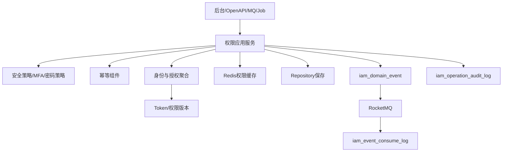

# 02-权限系统接口事件实现逻辑

> 本文承接 `docs/06-子系统接口设计/09-权限系统接口设计.md`、`docs/07-子系统事件生产与消费/09-权限系统事件生产与消费设计.md`、`docs/05-子系统数据库设计/09-权限系统数据库设计.md` 和 `docs/04-子系统功能设计/09-权限系统/01-权限系统产品功能设计.md`。本文说明权限系统登录认证、用户角色、菜单权限、权限点、数据范围、会话、审计、审批和跨系统权限校验如何从接口进入安全策略、权限解析、聚合处理、Token签发、事件落库、缓存失效和补偿。

## 1. 设计范围

| 范围 | 内容 |
| --- | --- |
| 查询接口 | 当前用户资料和权限、用户、角色、菜单、权限点、角色授权、用户角色、数据范围、会话、登录日志、操作日志、应用/SSO、枚举 |
| 写命令接口 | 登录、刷新Token、登出、强制下线，创建/修改/启停/锁定用户，分配/取消角色，创建/修改/启停角色，分配/取消权限，注册权限点，配置数据范围，写审计日志 |
| 跨系统命令 | Token 校验、当前用户权限查询、权限点检查、数据范围解析、操作日志写入、审批任务创建 |
| 事件生产 | 用户、角色、权限、数据范围、Token、审批、审计、安全策略命令成功后写 `iam_domain_event` |
| 事件消费 | 消费主数据、人事、业务系统、网关和审批回调事件，写 `iam_event_consume_log` |
| 异常处理 | Token 过期/撤销、权限拒绝、数据范围为空、账号锁定、授权重复、权限缓存未刷新、审批回调失败 |

不包含：

- 各业务系统单据状态和业务不变量。
- 主数据资源的权威资料维护，归 08-主数据系统。
- 网关路由和限流实现细节，权限系统只提供校验和授权决策。

## 2. 实现架构总览

| 层 | 权限系统组件 | 职责 |
| --- | --- | --- |
| 接口层 | `IamAuthController`、`IamController`、`IamOpenApiController`、`IamEventConsumer`、`IamJobHandler` | 接收后台、OpenAPI、MQ、Job 请求 |
| 应用层 | 登录、用户、角色、菜单、权限点、数据范围、会话、审计、审批、安全策略应用服务 | 编排认证、MFA、安全策略、权限版本、幂等、事务、事件和审计 |
| 领域层 | 应用、SSO客户端、用户、用户角色、角色、角色权限、菜单页面、权限点、数据范围、会话Token、审批实例、安全策略聚合 | 保护账号状态、授权关系、权限版本、Token生命周期和审计不变量 |
| 基础设施层 | Repository、Mapper、JWT/密码组件、Redis、MQ、RPC、文件服务 | 数据库、缓存、令牌签名、消息、外部系统 |
| 读模型层 | 权限快照、菜单树、授权矩阵、数据范围解析、日志查询 | 支撑登录后权限加载、权限检查、审计和导出 |

## 3. 查询接口实现逻辑

| 页面/接口组 | 主要接口 | 权限校验 | 本地查询 | 可能调用外部 RPC | 异常处理 |
| --- | --- | --- | --- | --- | --- |
| 登录/个人中心 | `/auth/login`、`/users/me`、`/users/me/permissions` | 登录前校验应用和安全策略，登录后校验 Token | 用户、角色、权限、数据范围、Token | 主数据查询组织/仓库/供应商名称 | Token 过期返回 `401` |
| 用户管理 | `/users` | `iam:user:read`、组织数据范围 | `iam_user`、`iam_user_role` | 主数据查询外部主体快照 | 无权限返回空或 `403` |
| 角色管理 | `/roles` | `iam:role:read` | `iam_role`、角色权限统计 | 无 | 系统角色敏感字段脱敏 |
| 菜单页面 | `/menus` | `iam:menu:read` | `iam_menu_page` | 无 | 停用菜单默认不返回给业务系统 |
| 权限点 | `/permissions` | `iam:permission:read` | `iam_permission` | 网关 API 扫描结果可选 | API 路径按应用隔离 |
| 角色授权 | `/roles/{id}/permission-tree` | `iam:role:read` | 菜单、权限点、角色授权关系 | 无 | 已停用权限点标识不可选 |
| 用户角色/数据权限 | `/user-roles`、`/data-scopes` | 用户/角色授权权限 | 用户角色、数据权限表 | 主数据查询可授权资源 | 资源停用显示风险 |
| 会话 | `/sessions` | `iam:session:read/detail` | `iam_user_token` | 无 | Token JTI 脱敏 |
| 日志 | `/login-logs`、`/operation-logs` | `iam:operation_log:read/export` | 登录日志、操作日志、审计表 | 无 | 敏感快照脱敏 |
| 应用/SSO/枚举 | `/apps`、`/sso-clients`、`/enums` | `iam:enumsettings:read` | 应用、SSO、枚举配置 | 无 | 客户端密钥不返回明文 |

## 4. 命令接口实现逻辑

| 接口组 | 写接口 | 应用服务 | 聚合/领域服务 | 主要写表 | 生产事件 |
| --- | --- | --- | --- | --- | --- |
| 登录认证 | 登录、刷新Token、登出、修改密码 | `AuthApplicationService` | 用户聚合、会话Token聚合、安全策略服务 | `iam_user`、`iam_user_token`、`iam_login_log`、审计表 | `UserLoggedIn`、`TokenRefreshed`、`TokenInvalidated`、`LoginFailedRecorded` |
| 用户管理 | 新增、修改、启用、停用、锁定、重置密码、分配角色 | `UserApplicationService` | 用户聚合、用户角色关系聚合 | `iam_user`、`iam_user_role`、Token表、事件表 | `UserCreated/Activated/Locked/Disabled`、`UserRoleAssigned/Revoked` |
| 角色管理 | 新增、修改、启用、停用 | `RoleApplicationService` | 角色聚合 | `iam_role`、事件表、审计表 | `RoleCreated/Enabled/Disabled` |
| 菜单页面 | 新增、修改、排序、停用 | `MenuApplicationService` | 菜单页面聚合 | `iam_menu_page`、事件表 | `PermissionChanged`、`RolePermissionRevoked` 可选 |
| 权限点 | 新增、修改、绑定菜单、绑定API、停用 | `PermissionApplicationService` | 权限点聚合 | `iam_permission`、事件表 | `PermissionRegistered/Changed/ApiBound/Disabled` |
| 角色授权 | 保存角色权限、取消授权 | `RolePermissionApplicationService` | 角色权限关系聚合、权限版本服务 | `iam_role_permission`、Token表、事件表 | `RolePermissionGranted/Revoked`、`TokenInvalidated` 可选 |
| 用户角色/数据范围 | 分配/取消用户角色、保存/停用数据权限 | `AuthorizationApplicationService` | 用户角色、数据权限聚合 | `iam_user_role`、`iam_data_scope`、事件表 | `UserRoleAssigned/Revoked`、`DataScopeChanged` |
| 会话 | 强制下线、批量强制下线 | `SessionApplicationService` | 会话Token聚合 | `iam_user_token`、事件表、审计表 | `TokenInvalidated`、`SessionKickedOut` |
| 审计/审批 | 写操作日志、创建审批任务、审批通过/驳回 | `AuditApplicationService`、`ApprovalApplicationService` | 操作日志聚合、审批实例聚合 | `iam_operation_log`、审计表、事件表 | `AuditLogCreated`、`ApprovalStarted/Completed/Rejected` |
| 应用/SSO | 应用新增/修改/启停、SSO保存、密钥重置 | `IamAppApplicationService` | 应用聚合、SSO客户端聚合 | `iam_app`、`iam_sso`、事件表 | `IamAppCreated/Enabled/Disabled`、`SsoClientConfigured` |

## 5. 跨系统命令接口

| 来源/目标 | 接口 | 权限系统处理 | 主要写表/调用 | 事件/补偿 |
| --- | --- | --- | --- | --- |
| 业务系统 -> 权限 | `/openapi/iam/v1/tokens/validate` | 校验 JWT、Token 状态、用户状态、应用状态、权限版本 | Token表、用户表、Redis | 校验不产业务事件，拒绝可写审计 |
| 业务系统 -> 权限 | `/users/me/permissions` | 返回菜单、按钮、API、字段、数据范围快照 | 用户、角色、权限读模型、Redis | 缓存未命中重建 |
| 业务系统 -> 权限 | `/permissions/check` | 校验权限点、API绑定、数据范围、字段权限 | 权限读模型、数据权限表 | 拒绝时写 `PermissionCheckDenied` |
| 业务系统 -> 权限 | `/data-scopes/resolve` | 合并用户、角色、组织继承、岗位继承和系统默认数据范围 | 数据权限表、主数据资源快照 | 资源停用时过滤 |
| 业务系统 -> 权限 | `/operation-logs` | 幂等写入统一操作日志 | `iam_operation_log`、审计表 | `AuditLogCreated` |
| 业务系统 -> 权限 | `/approval-tasks` | 匹配审批配置，创建审批实例和首个待办 | 审批实例/任务表、事件表 | `ApprovalStarted`；回调失败补偿 |
| 权限 -> 主数据 | 主数据查询/校验 | 配置数据范围时查询可授权资源 | 主数据 RPC | RPC 失败命令失败或提示稍后重试 |

## 6. 事件生产逻辑

| 聚合 | 命令 | 事件 | 主要消费者 |
| --- | --- | --- | --- |
| 应用/SSO | 创建、启用、配置、停用 | `IamAppCreated/Enabled/Disabled`、`SsoClientConfigured` | 网关、业务系统、安全风控 |
| 用户 | 创建、激活、锁定、停用 | `UserCreated/Activated/Locked/Disabled` | 网关、业务系统、待办 |
| 用户角色 | 分配、取消 | `UserRoleAssigned/Revoked` | 业务系统、权限缓存 |
| 角色 | 创建、启用、停用 | `RoleCreated/Enabled/Disabled` | 业务系统、权限缓存 |
| 角色权限 | 授权、取消 | `RolePermissionGranted/Revoked` | 网关、业务系统、权限缓存 |
| 权限点 | 注册、变更、绑定API、停用 | `PermissionRegistered/Changed/ApiBound/Disabled` | 网关、业务系统 |
| 数据权限 | 创建、分配、变更、取消、停用 | `DataScopeChanged` | 业务系统、报表、导出服务 |
| 会话Token | 登录、刷新、失效、踢出 | `UserLoggedIn/TokenRefreshed/TokenInvalidated/SessionKickedOut` | 网关、安全风控 |
| 审批 | 发起、通过、驳回、撤回、取消 | `ApprovalStarted/Completed/Rejected` | 来源业务系统、待办 |
| 审计/安全 | 写日志、权限拒绝、风险识别 | `AuditLogCreated/PermissionCheckDenied/SecurityRiskDetected` | 审计看板、安全风控 |

## 7. 事件消费逻辑

| 来源系统 | 事件 | 消费处理 | 幂等键 | 异常处理 |
| --- | --- | --- | --- | --- |
| 主数据 | `MasterDataChanged` | 更新组织、仓库、货主、供应商、客户等可授权对象快照 | `MDM:{eventId}:{typeCode}:{dataCode}` | 旧版本忽略 |
| 主数据 | `SupplierEnabled/SupplierFrozen` | 刷新外部供应商用户可授权主体和风险状态 | `MDM:{eventId}:{supplierId}` | 主体不存在可创建快照 |
| 主数据 | `WarehouseEnabled/LocationFrozen` | 刷新仓库/库位数据范围对象 | `MDM:{eventId}:{warehouseId}` | 冻结只提示，不直接撤权 |
| 人事/主数据 | `EmployeeOnboarded/EmployeeOffboarded` | 创建待激活账号或停用账号并撤销会话 | `{source}:{eventId}:{employeeNo}` | 用户不存在离职事件忽略 |
| 网关/业务系统 | `ApiResourceScanned` | 生成权限点建议或更新 API 绑定草稿 | `{source}:{eventId}:{method}:{apiPath}` | 冲突进入人工确认 |
| 业务系统 | `SensitiveOperationOccurred` | 写敏感操作审计和安全风险 | `{source}:{eventId}:{bizNo}` | 日志写入失败重试 |
| 业务系统 | `ApprovalCallbackFailed` | 标记审批回调失败并重试 | `{source}:{eventId}:{approvalInstanceId}` | 超阈值人工处理 |

## 8. 异常、补偿、幂等和审计

| 场景 | 处理策略 |
| --- | --- |
| Token 过期/撤销 | 返回 `401 TOKEN_EXPIRED/TOKEN_REVOKED`；业务系统清理本地会话 |
| 权限版本过期 | 返回版本不一致，前端或业务系统重新加载权限快照 |
| 登录失败过多 | 安全策略锁定用户，写登录日志和 `UserLocked` |
| 重复授权 | 以用户/角色/权限点唯一关系幂等，重复返回历史结果 |
| 数据范围资源停用 | 消费主数据事件后过滤不可用资源，必要时提示管理员调整授权 |
| 审批回调失败 | 回调任务重试，来源系统可主动查询审批状态 |
| 审计 | 登录、登出、刷新、强制下线、授权变更、数据范围变更、权限拒绝、敏感查询、导出都写审计 |

## 9. DDD 对齐说明

| 领域驱动设计项 | 对齐口径 |
| --- | --- |
| 限界上下文 | 权限上下文拥有身份、授权、会话、审计和审批协作事实 |
| 核心聚合 | 应用、SSO、用户、角色、权限点、数据权限、Token会话、审批实例、操作日志 |
| 数据主权 | 主数据拥有可授权资源，业务系统拥有业务单据，权限系统拥有授权事实 |
| 命令 | 登录、授权、撤权、检查权限、解析数据范围、写审计、发起审批 |
| 生产事件 | 身份和授权事实，如 `UserRoleAssigned`、`RolePermissionGranted`、`TokenInvalidated` |
| 消费事件 | 主数据资源变更、员工入离职、API资源扫描、敏感操作 |
| 查询模型 | 权限快照、菜单树、授权矩阵、数据范围、会话、审计日志 |
| 异常补偿 | Token撤销、缓存失效、登录锁定、审批回调失败、权限拒绝可审计 |

## 继续上下文

当前结论：权限实现以 Token 生命周期、权限版本、授权关系和数据范围解析为核心。  
关键假设：业务系统可缓存权限快照，但高风险操作应远程校验权限版本和数据范围。  
待决问题：审批配置是否完全归权限系统、字段权限脱敏规则是否由业务系统实现、API扫描来源是网关还是各服务注册。  
下一步：继续维护 `03-权限系统接口逐项实现设计.md` 的逐接口编码说明。
