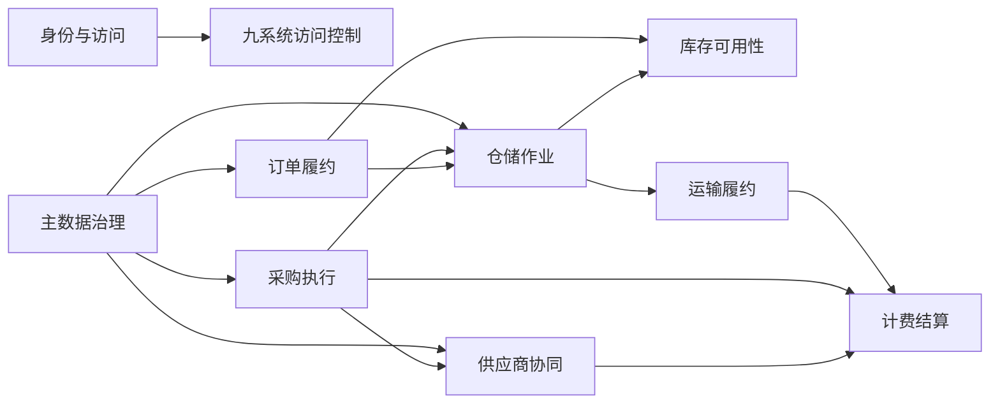
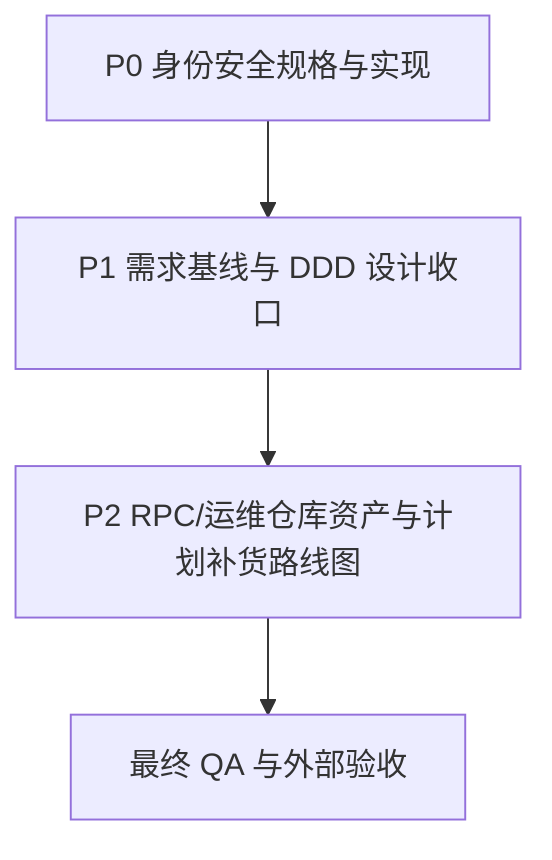
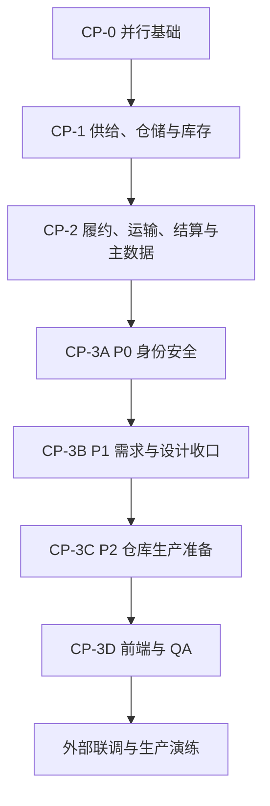

# 供应链系统开发总纲

> 本文是 `docs/09-开发计划` 的唯一总纲，由原 `00` 至 `06` 文档重构而成。
>
> 它承担计划导航、状态矩阵、执行规则、多 Agent 任务规格、历史决策和交付证据索引。动态领取状态仍由 [`tasks/todo.md`](../../tasks/todo.md) 维护。

## 1. 文档定位与事实来源

### 1.1 目标

本计划服务于九个供应链限界上下文的持续开发、并行协作和生产验收。

核心目标不是证明“写过代码”，而是证明业务闭环、领域不变量、数据主权、可靠性和运行质量达到当前阶段的完成口径。

本文解决五个治理问题：状态只有一个解释；任务依赖可执行；完成证据可追踪；需求基线不偏科；历史决策不再覆盖当前事实。

### 1.2 事实来源优先级

| 优先级 | 来源 | 负责回答 |
| --- | --- | --- |
| 1 | `docs/03-核心业务模型/` | 聚合、状态机、业务不变量、命令、事件和读模型 |
| 2 | `docs/04-子系统功能设计/` | 角色、场景、功能、页面动作和权限 |
| 3 | `docs/05-子系统数据库设计/` | 数据结构、枚举、索引、迁移和数据修复 |
| 4 | `docs/06-子系统接口设计/` | HTTP/Dubbo 契约、错误码、调用方和数据范围 |
| 5 | `docs/07-子系统事件生产与消费/` | 事件信封、生产消费、顺序、重试和补偿 |
| 6 | `docs/08-系统实现/` | 分层实现、运行约束和技术选型 |
| 7 | 本文 | 当前实施顺序、任务规格、状态口径、检查点和证据索引 |
| 8 | [`tasks/todo.md`](../../tasks/todo.md) | 当前领取人、进行中、待领取和外部阻塞 |

设计发生冲突时，以业务流程和领域模型为先。实现与设计不一致时，先记录决策及影响，再同步接口、事件、DDL、测试和本文证据台账。

### 1.3 文档维护规则

1. 本文只由协调 Agent 修改；业务 Agent 返回交接片段，避免单文件并发冲突。
2. 每个接口级切片完成后，先更新交付证据台账，再领取下一切片。
3. 当前状态必须有代码、迁移、接口、事件或测试证据，不能沿用历史判断。
4. 历史计划只进入决策时间线，不再保留第二套执行看板。
5. `tasks/todo.md` 与本文任务集合必须通过 `tools.plan_guard` 一致性校验。

## 2. 统一状态模型与完成口径

### 2.1 状态定义

| 状态 | 含义 | 可否领取 |
| --- | --- | --- |
| 已完成 | 当前阶段验收项已有实现、测试和交付证据 | 否，仅允许缺陷修复 |
| 部分完成 | 已有可运行纵向切片，但仍有明确验收缺口 | 是，只领取剩余切片 |
| 待开发 | 依赖已满足，尚未开始或中断后待重新领取 | 是 |
| 进行中 | 已被唯一 Agent 领取，文件所有权已登记 | 否，其他 Agent 不得写入 |
| 阻塞 | 缺少仓库外环境、地址、凭证、数据或决策 | 否，先解除阻塞 |
| 已迁移 | 能力已回归事实拥有者，旧服务或页面不得恢复 | 否 |
| 已撤销 | 原方案不再成立，仅作为历史决策保留 | 否 |

“接口首轮完成”“仓库内完成”“生产完成”是三个不同层级。仓库内测试通过不能替代真实中间件、外部沙箱、容量、监控、备份恢复和上线演练。

### 2.2 纵向切片 Definition of Done

每个功能切片必须同时具备：

1. 接口层：DTO、校验、功能权限、数据权限、错误码和协议转换。
2. 应用层：事务、幂等、审计、聚合加载保存、跨上下文编排。
3. 领域层：聚合、实体、值对象、状态机、不变量和领域事件。
4. 基础设施：Repository/Mapper、完整 schema、Outbox/Inbox、缓存或外部端口。
5. 可靠性：超时、重试、熔断、最终失败、人工补偿或明确不适用说明。
6. 查询侧：分页总数、排序白名单、数据范围、空态和导出限制。
7. 测试：领域、应用、Web/API；库存、金额、并发和事件增加专项测试。
8. 证据：接口/事件/DDL 差异、测试命令、结果、风险和交接提示。

只建表、只建聚合、只写接口、内存模拟、空实现或只补页面均不构成完成。

## 3. 领域边界与系统依赖

### 3.1 领域驱动设计对齐说明

| DDD 项 | 对齐口径 |
| --- | --- |
| 文档层级 | 跨九个限界上下文的实施与验收总纲 |
| 核心域 | 库存可用性、订单履约、仓储作业及其调拨/逆向协同 |
| 支撑域 | 采购执行、供应商协同、运输履约、计费结算、主数据治理 |
| 通用域 | 身份访问、审计、附件、配置和运行治理；不形成第十个业务服务 |
| 数据主权 | 每个上下文只修改本地事实；跨上下文发送命令或消费已发生事件 |
| 写模型 | 聚合根保护状态和数量/金额/版本不变量 |
| 查询模型 | 列表、详情、工作台、指标、日志和导出归事实拥有者 |
| 可靠性 | Outbox/Inbox、幂等、失败重试和人工补偿归交互双方 |
| 外部系统 | 通过防腐层转换，不允许外部 DTO 进入领域层 |

### 3.2 九个限界上下文

| 子系统 | 限界上下文 | 数据主权 | 不负责范围 |
| --- | --- | --- | --- |
| 供应商 | 供应商协同 | 准入、资质、供货条件、供应商确认、ASN 协同、质量整改、绩效 | 采购订单主状态、仓内作业、结算记账 |
| 采购 | 采购执行 | 请购、询价、比价定标、采购价格、采购订单、退供申请 | 供应商档案、仓内收货、应付结算 |
| WMS | 仓储作业 | 收货、质检、上架、拣货、包装、发货、退货、盘点和仓内轨迹 | 全局可用库存、销售履约策略、运输轨迹 |
| 中央库存 | 库存可用性 | 库存账户、数量桶、流水、预占、冻结、调整、调拨、快照和对账 | 仓内任务、销售订单、财务金额 |
| OMS | 订单履约 | 渠道订单、销售订单、履约、取消和售后策略 | 仓内实物、运输执行、退款记账 |
| TMS | 运输履约 | 运输任务、运单、面单、轨迹、签收、运输异常和费用来源 | 仓内作业、库存余额、账单 |
| BMS | 计费结算 | 费用、调整、对账、账单、发票、财务交接和退款 | 业务单据执行、库存数量 |
| 主数据 | 主数据治理 | 类型、模板、编码、记录版本、发布订阅和质量 | 下游业务快照和业务状态 |
| 权限 | 身份与访问 | 用户、角色、权限、菜单、数据范围、会话、安全策略和审计 | 业务聚合状态 |

### 3.3 上下文依赖



命令表示请求对方执行动作，领域事件表示业务事实已经发生。任何上下文不得直接修改另一个上下文的数据库。

## 4. 架构、可靠性与开发强制规则

### 4.1 技术与分层

| 项目 | 约定 |
| --- | --- |
| 后端 | JDK 17、Spring Boot、MyBatis、MySQL、Redis、RocketMQ、Dubbo |
| 前端 | React、JavaScript、子系统资源配置拆分 |
| 分层 | `interfaces` → `application` → `domain`；`infrastructure` 实现端口 |
| 数据库 | 九个服务独立 schema；每个服务维护唯一 `db/schema.sql`，仅允许向空库显式导入；应用启动不执行 DDL |
| 并发 | 聚合使用乐观锁；幂等键与请求摘要防止语义冲突 |
| 可观测性 | Request/Trace ID、操作人、幂等键、事件编码和失败原因贯穿调用链 |

Controller 不直接操作 Mapper；领域层不依赖 Spring、MyBatis、MQ、HTTP 或外部 DTO。

### 4.2 RocketMQ 生产约束

1. 业务事件链路固定为“本地事务 Outbox → RocketMQ Producer → Consumer → Inbox/幂等应用服务”。
2. HTTP/Dubbo 只承载同步命令或查询；跨上下文业务事件只能通过 RocketMQ 投递和消费，不提供内部 HTTP 事件入口或兼容开关。
3. Noop、内存和日志 Broker 仅允许出现在测试代码，生产环境不得自动降级。
4. 事件信封至少包含 `schemaVersion`、`sourceSystem`、`eventCode`、`eventType`、`data`。
5. 未知版本失败关闭；解析或业务失败必须触发 Broker 重试，并保留失败查询和人工重放。
6. 生产验收必须列出 Producer、Consumer、Topic、Consumer Group 和生产配置证据。

### 4.3 外部调用和文件任务

- 外部调用必须定义签名、幂等、超时、重试、熔断、最终失败和人工补偿。
- 文件导入必须限制上传、解压、行列、单元格和任务重试；有效行、错误行和部分成功口径必须明确。
- 导出必须固化服务端授权字段、数据范围和脱敏策略；不得由调用方关闭安全策略。
- 对象存储通过端口隔离；本地持久卷只作为部署适配器，不写入业务表大字段。

### 4.4 权限与审计

权限至少覆盖功能、组织、仓库、货主、供应商/客户和单据归属。敏感查询、下载、重试、重放和配置变更必须记录操作人、原因、前后版本和结果。

## 5. 九子系统当前状态

> 状态快照日期：2026-07-30。动态领取以 `tasks/todo.md` 为准；本章在检查点或重要架构变化后更新。

### 5.1 总体状态

| 子系统  | 仓库能力                                      | 当前结论   | 剩余仓库工作                                              | 生产依赖                  |
| ---- | ----------------------------------------- | ------ | --------------------------------------------------- | --------------------- |
| 供应商  | 准入资质、供货、PO/ASN、质量风险、财务、导出、Web/MySQL 契约与真实 MQ | 仓库阶段完成 | 最终 QA | 真实 MySQL、RPC/MQ 与容量环境 |
| 采购   | 工作台、读模型、目标路由契约、真实 MQ 消费代码和核心异常回归          | 仓库阶段完成 | 最终 QA                                              | 目标系统地址和沙箱             |
| WMS  | 入出库、退货、盘点、异常读模型、三类入库守恒与真实 MQ 链路 | 仓库阶段完成 | 最终 QA | 真实仓储数据、MySQL 和 MQ |
| 中央库存 | 冻结/调整聚合、版本化事件、运营导出、调拨数量守恒与差异闭环            | 仓库阶段完成 | 最终 QA                                              | MySQL、MQ 和并发容量环境      |
| OMS  | 履约/售后/异常读模型、指标和异步导出                       | 仓库阶段完成 | 最终 QA                                               | 库存/WMS/BMS 真实协作       |
| TMS  | 回调验签、运单推进、附件和标准页面                         | 仓库阶段完成 | 最终 QA                                               | 承运商沙箱和对象存储            |
| BMS  | 财税支付防腐层、财务页面、退款聚合/回执/补偿和异步报表              | 仓库阶段完成 | 最终 QA 与真实支付沙箱查单演练                               | ERP、税控、支付沙箱           |
| 主数据  | 真实文件任务、OpenAPI 数据边界、治理页面和 RocketMQ Outbox/Inbox | 仓库阶段完成 | 最终 QA；XLSX 流式解析可后续优化 | 对象存储、RocketMQ 和大文件容量环境 |
| 权限   | Redis 会话、密钥轮换、OAuth/OIDC、MFA 登录闭环、治理读模型与真实 RocketMQ 投递链已完成 | 仓库阶段完成 | 最终 QA | 真实 Redis/MySQL/RocketMQ、完整 schema 导入和轮换演练 |

### 5.2 当前横切状态

| 范围 | 状态 | 结论 |
| --- | --- | --- |
| 前端公共壳 | 部分完成 | 错误态、空态、可访问性、响应式和去演示数据已完成；仍依赖 IAM 管理页面和浏览器实跑 |
| QA | 部分完成 | 单元测试、构建、E2E 用例和九服务 API 基线工具已具备；真实 MySQL/九服务尚未验收 |
| 外部集成 | 阻塞 | `INT-REQ-005B` 缺真实中间件、外部接口、凭证和测试数据 |
| 生产运维 | 阻塞 | `OPS-REQ-001` 缺预演环境、监控、告警、容量目标和演练窗口 |

### 5.3 2026-07-30 全量文档审查后的 P0→P2 收口顺序



| 优先级 | 必须解决的问题 | 停止条件 | 任务 |
| --- | --- | --- | --- |
| P0 | JWT 密钥轮换安全复审、OAuth/OIDC、MFA | 威胁模型、接口、聚合、持久化、审计和安全测试全部闭环 | `IAM-NEXT-001A/B/C` |
| P1 | 供应商/采购正式需求偏科；调拨、退款和多类型入库设计事实源缺口 | 需求—聚合—接口—事件—测试可双向追踪；差异登记为代码任务 | `DOC-NEXT-001`、`SUP/PUR/INV/WMS/BMS-NEXT-002` |
| P2 | Dubbo 仓库闭环、OPS 仓库资产、计划补货路线图 | 仓库内可交付内容不再被外部环境整体阻塞；延后范围有启动门槛 | `INT-NEXT-002`、`OPS-NEXT-001A`、`PLAN-ROADMAP-001` |

P0 未完成前不得开始 OAuth/MFA 页面包装；P1 可以在 P0 契约冻结后由不冲突 Agent 并行，但最终检查点按 P0→P1→P2 顺序验收。

## 6. 接口级实施入口

总纲只维护实施规则和状态，不重复九份接口级类清单。开发时必须进入对应接口计划，并继续读取该系统的领域、功能、数据库、接口、事件和实现文档。

| 系统 | 接口级计划 |
| --- | --- |
| 供应商 | [01-供应商系统接口级开发计划](01-开发计划/01-供应商系统接口级开发计划.md) |
| 采购 | [02-采购系统接口级开发计划](01-开发计划/02-采购系统接口级开发计划.md) |
| WMS | [03-WMS系统接口级开发计划](01-开发计划/03-WMS系统接口级开发计划.md) |
| 中央库存 | [04-中央库存系统接口级开发计划](01-开发计划/04-中央库存系统接口级开发计划.md) |
| OMS | [05-OMS系统接口级开发计划](01-开发计划/05-OMS系统接口级开发计划.md) |
| TMS | [06-TMS系统接口级开发计划](01-开发计划/06-TMS系统接口级开发计划.md) |
| BMS | [07-BMS系统接口级开发计划](01-开发计划/07-BMS系统接口级开发计划.md) |
| 主数据 | [08-主数据系统接口级开发计划](01-开发计划/08-主数据系统接口级开发计划.md) |
| 权限 | [09-权限系统接口级开发计划](01-开发计划/09-权限系统接口级开发计划.md) |

固定执行顺序：定位接口族和聚合 → 列实现清单 → 领域/契约 → 应用编排 → 持久化/集成 → 接口 → 测试 → 交付证据。

## 7. 多 Agent 执行计划

### 7.1 文件所有权

| 范围 | 所有权规则 |
| --- | --- |
| `project/backend/<system>-service/**` | 同一时间仅一个该系统 Agent 写入 |
| `project/backend/scm-common/**` | 公共契约 Agent 独占，业务 Agent 提交变更请求 |
| `project/backend/pom.xml` | 协调/集成 Agent 独占 |
| 完整 schema | 同一服务同一时间一个写入者；所有 DDL 直接维护在该服务唯一 `db/schema.sql` |
| `project/frontend/src/config/systems/<system>.js` | 对应子系统 Agent 独占 |
| `project/frontend/src/config/resources/<system>.js` | 对应子系统 Agent 独占 |
| 本文、`tasks/todo.md` | 协调 Agent 独占 |

共享契约必须先冻结命令/事件、载荷、幂等键、权限码、错误码、超时重试和双方测试夹具，再允许上下游并行。

### 7.2 批次和检查点



| 检查点 | 状态 | 完成门槛 |
| --- | --- | --- |
| CP-0 | 已完成 | 配置拆分、计划校验、当时归档的 64 张需求可追踪；本次扩展后总数为 72 |
| CP-1 | 已完成 | 供应商、采购、WMS、库存任务及批次回归通过 |
| CP-2 | 已完成 | OMS、TMS、BMS、主数据任务及批次回归通过 |
| CP-3A | 已完成 | `IAM-NEXT-001A/B/C` 完成，密钥、OAuth、MFA 安全门禁通过 |
| CP-3B | 已完成 | 72 张需求可追踪，P1 设计债务和核心回归完成 |
| CP-3C | 已完成 | OPS 仓库资产已完成；Dubbo 代码闭环及本地 Nacos/MySQL/RocketMQ 跨 JVM 冒烟通过；计划补货路线图保持延后 |
| CP-3D | 已完成 | 公共前端、JDK 17 全量构建、九服务真实运行及 API/安全基线验收全部通过 |
| 外部验收 | 阻塞 | 真实 MQ/RPC/外部系统、监控、备份恢复和演练 |

### 7.3 任务规格

以下标题和“文件范围”是 `tools.plan_guard` 的机器可读契约。

### PAR-NEXT-001 前端九子系统配置拆分

| 项目 | 内容 |
| --- | --- |
| 目标 | 拆除前端共享配置热点并保持导出兼容 |
| 依赖 | 无 |
| 文件范围 | `project/frontend/src/config/systemCatalog.js`、`project/frontend/src/config/resourceDefinitions.js`、`project/frontend/src/config/systems/**`、`project/frontend/src/config/resources/**` |
| 验收 | 九系统顺序、权限和资源注册不变，子系统文件可独立修改 |
| 验证 | `npm run test`、`npm run build`、E2E |

### PAR-NEXT-002 计划与契约一致性校验

| 项目 | 内容 |
| --- | --- |
| 目标 | 自动校验需求归属、九服务边界、任务集合和文件冲突 |
| 依赖 | 无 |
| 文件范围 | `docs/09-开发计划/**`、`tasks/**`、`tools/plan_guard/**` |
| 验收 | 72 张需求唯一归属；不存在第十个服务和冲突中的进行中任务 |
| 验证 | `python3 -m tools.plan_guard.validator` |

### DOC-NEXT-001 调拨、退款与多类型入库 DDD 设计收口

| 项目 | 内容 |
| --- | --- |
| 目标 | 按 `DOC-REQ-002` 补齐中央库存调拨、BMS 退款和 WMS 多类型入库的领域事实源 |
| 依赖 | 无，可与 IAM 安全开发并行，但必须先于对应 `NEXT-002` 回归任务 |
| 文件范围 | `docs/03-核心业务模型/03-WMS领域模型/**`、`docs/03-核心业务模型/04-中央库存领域模型/**`、`docs/03-核心业务模型/07-BMS领域模型/**`、`docs/06-子系统接口设计/03-WMS系统接口设计.md`、`docs/06-子系统接口设计/04-中央库存系统接口设计.md`、`docs/06-子系统接口设计/07-BMS系统接口设计.md`、对应 `docs/07~08` 三系统文件、`docs/09-开发计划/01-开发计划/03-WMS系统接口级开发计划.md`、`docs/09-开发计划/01-开发计划/04-中央库存系统接口级开发计划.md`、`docs/09-开发计划/01-开发计划/07-BMS系统接口级开发计划.md` |
| 验收 | 聚合、状态机、数量/金额不变量、命令事件、幂等、补偿、权限和测试清单一致；实现差异单独登记 |
| 验证 | 文档链接/术语搜索、计划校验、人工 DDD 审查 |

### SUP-NEXT-001A 供应商导出文件与对象存储端口

| 项目 | 内容 |
| --- | --- |
| 目标 | 生成稳定 CSV，通过对象存储端口保存并支持失败重试 |
| 依赖 | `PAR-NEXT-001` |
| 文件范围 | `project/backend/supplier-service/**`、`project/frontend/src/config/resources/supplier.js` |
| 验收 | 文件真实生成、下载受权限保护、失败可恢复 |
| 验证 | Supplier Maven 测试、前端资源测试 |

### SUP-NEXT-001B 供应商 Web/MySQL 契约测试

| 项目 | 内容 |
| --- | --- |
| 目标 | 验证准入、PO、ASN、质量和导出的 Web/MySQL/完整 schema 契约 |
| 依赖 | `SUP-NEXT-001A` |
| 文件范围 | `project/backend/supplier-service/src/test/**`、`project/backend/supplier-service/src/test/resources/**` |
| 验收 | 401/403、数据范围、幂等、乐观锁和迁移均有证据 |
| 验证 | Supplier Maven 测试、MySQL 条件测试 |

### SUP-NEXT-002 供应商核心需求追踪与异常回归

| 项目 | 内容 |
| --- | --- |
| 目标 | 证明 `SUP-REQ-001` 的准入、资质、供货、协同、质量、风险和财务能力均有实现与测试 |
| 依赖 | `SUP-NEXT-001B`、`DOC-NEXT-001` 非阻塞完成相关术语冻结 |
| 文件范围 | `project/backend/supplier-service/**`、`docs/09-开发计划/01-开发计划/01-供应商系统接口级开发计划.md` |
| 验收 | `SUP-API-001~008` 双向追踪；资质过期、冻结、PO/ASN 重复、整改逾期和对账差异有回归证据 |
| 验证 | Supplier Maven 测试、MySQL/Web 契约测试、需求追踪检查 |

### PUR-NEXT-001A 采购工作台与经营读模型

| 项目 | 内容 |
| --- | --- |
| 目标 | 建立待办、交期、价格、订单执行和异常汇总读模型 |
| 依赖 | `PAR-NEXT-001` |
| 文件范围 | `project/backend/purchase-service/**`、`project/frontend/src/config/resources/purchase.js` |
| 验收 | 组织/采购组/本人范围、分页、排序和事实追踪正确 |
| 验证 | Purchase Maven 测试、前端资源测试 |

### PUR-NEXT-001B 采购目标上下文路由契约

| 项目 | 内容 |
| --- | --- |
| 目标 | 固化采购命令目标、请求头、超时、熔断和失败语义 |
| 依赖 | `PUR-NEXT-001A` |
| 文件范围 | `project/backend/purchase-service/**` |
| 验收 | 未配置失败关闭；重复命令幂等；4xx/5xx/超时状态明确 |
| 验证 | Purchase Maven 测试 |

### PUR-NEXT-002 采购核心需求追踪与异常回归

| 项目 | 内容 |
| --- | --- |
| 目标 | 证明 `PUR-REQ-001` 的请购、RFQ、定标价格、PO、到货和退供闭环均有实现与测试 |
| 依赖 | `PUR-NEXT-001B` |
| 文件范围 | `project/backend/purchase-service/**`、`docs/09-开发计划/01-开发计划/02-采购系统接口级开发计划.md` |
| 验收 | `PUR-API-001~006` 双向追踪；超批准转单、截标后报价、价格重叠、并发变更、已收货取消和超量退供有证据 |
| 验证 | Purchase Maven 测试、需求追踪检查 |

### WMS-NEXT-001A WMS 入库作业读模型

| 项目 | 内容 |
| --- | --- |
| 目标 | 补入库、收货、质检、上架和库内库存列表/详情 |
| 依赖 | `PAR-NEXT-001` |
| 文件范围 | `project/backend/wms-service/**`、`project/frontend/src/config/resources/wms.js` |
| 验收 | 仓库/货主范围生效，页面读取真实投影 |
| 验证 | WMS Maven 测试、前端资源测试 |

### WMS-NEXT-001B WMS 出库作业读模型

| 项目 | 内容 |
| --- | --- |
| 目标 | 补出库、波次、拣货、容器、包装和发货交接读模型 |
| 依赖 | `WMS-NEXT-001A` |
| 文件范围 | `project/backend/wms-service/**`、`project/frontend/src/config/resources/wms.js` |
| 验收 | 状态、数量和来源单据可追踪，动作权限符合状态机 |
| 验证 | WMS Maven 测试、页面 E2E |

### WMS-NEXT-001C WMS 退货、盘点与异常读模型

| 项目 | 内容 |
| --- | --- |
| 目标 | 补退货入库、盘点和仓内异常的查询与处置入口 |
| 依赖 | `WMS-NEXT-001B` |
| 文件范围 | `project/backend/wms-service/**`、`project/frontend/src/config/resources/wms.js` |
| 验收 | 差异和处置结果可追踪，终态禁止重复处置 |
| 验证 | WMS Maven 测试、页面 E2E |

### WMS-NEXT-002 采购/调拨/售后退货多类型入库收口

| 项目 | 内容 |
| --- | --- |
| 目标 | 按业务类型固化来源唯一键、收货、质检、上架、库存处置和下游事件 |
| 依赖 | `DOC-NEXT-001`、`WMS-NEXT-001C` |
| 文件范围 | `project/backend/wms-service/**` |
| 验收 | 三类入库不能串单；售后错退/少件/良品不良品、调拨差异和采购不合格事件正确；重复事实无副作用 |
| 验证 | WMS 领域/应用/Web/事件测试，WMS Maven 全量测试 |

### INV-NEXT-001A 库存冻结与调整独立聚合

| 项目 | 内容 |
| --- | --- |
| 目标 | 将冻结/调整提升为有审批、原因、状态和审计的聚合 |
| 依赖 | 无 |
| 文件范围 | `project/backend/inventory-service/**` |
| 验收 | 数量守恒、审批/执行不可重复、变化均写流水 |
| 验证 | Inventory Maven 测试 |

### INV-NEXT-001B 库存事件版本与失败治理

| 项目 | 内容 |
| --- | --- |
| 目标 | 建立版本化载荷、失败查询和人工重放 |
| 依赖 | `INV-NEXT-001A` |
| 文件范围 | `project/backend/inventory-service/**` |
| 验收 | 未知版本失败关闭；重复、乱序和重放不重复记账 |
| 验证 | Inventory Maven 测试 |

### INV-NEXT-001C 库存运营读模型与导出

| 项目 | 内容 |
| --- | --- |
| 目标 | 接入预占、冻结、调整、事件/操作日志和指标导出 |
| 依赖 | `PAR-NEXT-001`、`INV-NEXT-001B` |
| 文件范围 | `project/backend/inventory-service/**`、`project/frontend/src/config/resources/inventory.js` |
| 验收 | 仓/货主/SKU/批次范围生效，导出可失败恢复 |
| 验证 | Inventory Maven 测试、前端资源测试 |

### INV-NEXT-002 调拨聚合、接口计划与数量守恒回归

| 项目 | 内容 |
| --- | --- |
| 目标 | 将既有调拨实现与 `INV-API-006`、调拨聚合和跨上下文事件重新对齐 |
| 依赖 | `DOC-NEXT-001`、`INV-NEXT-001C` |
| 文件范围 | `project/backend/inventory-service/**`、`docs/09-开发计划/01-开发计划/04-中央库存系统接口级开发计划.md` |
| 验收 | 申请/预占/出库/在途/入库/差异数量守恒；取消补偿、乱序事件和双仓数据范围通过 |
| 验证 | StockTransfer 聚合/应用/事件测试、Inventory Maven 全量测试 |

### OMS-NEXT-001A OMS 履约、售后和异常读模型

| 项目 | 内容 |
| --- | --- |
| 目标 | 补审单、预占、取消、售后、异常和操作日志读模型 |
| 依赖 | `PAR-NEXT-001` |
| 文件范围 | `project/backend/oms-service/**`、`project/frontend/src/config/resources/oms.js` |
| 验收 | 查询不修改聚合，数据范围与状态口径一致 |
| 验证 | OMS Maven 测试、页面 E2E |

### OMS-NEXT-001B OMS 履约指标与异步导出

| 项目 | 内容 |
| --- | --- |
| 目标 | 将订单量、完成/取消、履约率和时长内聚到 OMS |
| 依赖 | `OMS-NEXT-001A` |
| 文件范围 | `project/backend/oms-service/**`、`project/frontend/src/config/resources/oms.js` |
| 验收 | 指标可追溯、数据范围生效、导出失败可恢复 |
| 验证 | OMS Maven 测试、前端构建 |

### TMS-NEXT-001A 承运商回调验签与状态推进

| 项目 | 内容 |
| --- | --- |
| 目标 | 建立回调验签、节点映射和运单终态推进 |
| 依赖 | 无 |
| 文件范围 | `project/backend/tms-service/**` |
| 验收 | 验签失败不入 Inbox，重复回调无副作用，状态机正确 |
| 验证 | TMS Maven 测试 |

### TMS-NEXT-001B TMS 面单附件与标准页面

| 项目 | 内容 |
| --- | --- |
| 目标 | 通过对象存储端口管理面单/签收附件并接入标准页面 |
| 依赖 | `PAR-NEXT-001`、`TMS-NEXT-001A` |
| 文件范围 | `project/backend/tms-service/**`、`project/frontend/src/config/resources/tms.js` |
| 验收 | 附件不落业务表大字段，下载受数据权限保护 |
| 验证 | TMS Maven 测试、页面 E2E |

### BMS-NEXT-001A BMS 财税支付防腐层

| 项目 | 内容 |
| --- | --- |
| 目标 | 固化 ERP、税控、支付端口、签名、回调幂等和补偿 |
| 依赖 | 仓库实现不依赖真实沙箱；生产验收依赖 `INT-REQ-005B` |
| 文件范围 | `project/backend/bms-service/**` |
| 验收 | 外部 DTO 不进领域层，回调幂等，最终失败可人工处理 |
| 验证 | BMS Maven 测试 |

### BMS-NEXT-001B BMS 财务页面与异步报表

| 项目 | 内容 |
| --- | --- |
| 目标 | 接入财务页面并完成结算异步导出 |
| 依赖 | `PAR-NEXT-001`、`BMS-NEXT-001A` |
| 文件范围 | `project/backend/bms-service/**`、`project/frontend/src/config/resources/bms.js` |
| 验收 | 金额和范围口径一致，导出可追踪、可恢复 |
| 验证 | BMS Maven 测试、页面 E2E |

### BMS-NEXT-002 退款聚合边界与支付回执回归

| 项目 | 内容 |
| --- | --- |
| 目标 | 明确退款结算聚合边界并验证累计退款、回执幂等、超时和人工补偿 |
| 依赖 | `DOC-NEXT-001`、`BMS-NEXT-001A` |
| 文件范围 | `project/backend/bms-service/**`、`docs/09-开发计划/01-开发计划/07-BMS系统接口级开发计划.md` |
| 验收 | 并发退款不超额；重复/乱序回执只应用一次；超时待确认、失败重试和人工关闭可审计 |
| 验证 | BMS 退款领域/应用/Web/回执测试，BMS Maven 全量测试 |

### MDM-NEXT-001A 主数据真实文件导入导出

| 项目 | 内容 |
| --- | --- |
| 目标 | 接入 CSV/XLSX、行级错误、对象存储和异步任务 |
| 依赖 | 无 |
| 文件范围 | `project/backend/mdm-service/**` |
| 验收 | 文件摘要幂等，错误定位行列，部分成功口径明确 |
| 验证 | MDM Maven 测试 |

### MDM-NEXT-001B 主数据 OpenAPI 数据边界与页面

| 项目 | 内容 |
| --- | --- |
| 目标 | 增加应用身份、字段白名单、数据范围、投影/缓存和治理页面 |
| 依赖 | `PAR-NEXT-001`、`MDM-NEXT-001A` |
| 文件范围 | `project/backend/mdm-service/**`、`project/frontend/src/config/resources/mdm.js` |
| 验收 | 未授权字段不返回，缓存按版本失效，审批/变更可追溯 |
| 验证 | MDM Maven 测试、页面 E2E |

### IAM-NEXT-001A IAM Redis TokenCache 与密钥轮换

| 项目 | 内容 |
| --- | --- |
| 目标 | Redis 承接在线会话/撤销，完成 active/previous 双密钥和安全复审发现项收口 |
| 依赖 | 无 |
| 文件范围 | `project/backend/iam-service/**`、`project/backend/scm-common/**`、`project/backend/*-service/src/main/resources/application*.yml`、`project/backend/supplier-service/src/main/java/**/SecurityConfiguration.java`、对应安全配置测试 |
| 验收 | Redis fail-closed；登出立即撤销；旧 Token 窗口后失效；`kid` 只能命中受信密钥集合；九服务 active/previous 配置一致；缺失 JWKS 失败关闭；rotate Lua 校验 sessionId、generation 和刷新令牌所有权 |
| 验证 | IAM/scm-common/九资源服务测试、伪造 `kid`/旧密钥/会话串用威胁测试、Ali Check、真实 Redis/完整 schema 冒烟 |

### IAM-NEXT-001B IAM OAuth/OIDC 授权服务

| 项目 | 内容 |
| --- | --- |
| 目标 | 按 `IAM-REQ-004` 完成授权码 + PKCE、Client Credentials、刷新、撤销和授权审计 |
| 依赖 | `IAM-NEXT-001A`；先冻结 `IAM-API-006` |
| 文件范围 | `project/backend/iam-service/**`、`docs/09-开发计划/01-开发计划/09-权限系统接口级开发计划.md` |
| 验收 | redirect URI 精确匹配；授权码一次性；PKCE/scope/audience/client 严格校验；客户端凭证不继承用户身份；刷新复用撤销授权链 |
| 验证 | IAM OAuth 领域/应用/Web/并发/威胁测试、IAM Maven 全量测试 |

### IAM-NEXT-001C IAM MFA 挑战与治理页面

| 项目 | 内容 |
| --- | --- |
| 目标 | 按 `IAM-REQ-005` 完成 TOTP、Challenge、恢复码、重置以及菜单/授权/会话/MFA 治理页面 |
| 依赖 | `PAR-NEXT-001`、`IAM-NEXT-001A`；与 `IAM-NEXT-001B` 共用登录事务契约时先冻结接口 |
| 文件范围 | `project/backend/iam-service/**`、`project/frontend/src/config/resources/iam.js` |
| 验收 | 登录只凭 challengeId 进入二次认证；过期/重复/跨会话失败；恢复码单次消费；密钥加密；重置撤销会话；治理页面可用 |
| 验证 | IAM MFA 领域/应用/Web/并发测试、IAM 权限 E2E |

### FE-NEXT-001 九子系统统一交互与可访问性

| 项目 | 内容 |
| --- | --- |
| 目标 | 统一加载/空态/错误态、命令确认、键盘和四档响应式 |
| 依赖 | 九个子系统页面任务 |
| 文件范围 | `project/frontend/src/pages/**`、`project/frontend/src/components/**`、`project/frontend/src/layout/**`、`project/frontend/src/styles/**`、`project/frontend/tests/**` |
| 验收 | 无演示数据；错误不伪装空列表；320/768/1024/1440 可用 |
| 验证 | `npm run test`、`npm run build`、`npm run test:e2e` |

### QA-NEXT-001 九服务真实 API 与数据库回归

| 项目 | 内容 |
| --- | --- |
| 目标 | 使用本地九服务、MySQL 完整 schema、Nacos 和浏览器形成真实基线 |
| 依赖 | 可增量执行；最终依赖全部 `NEXT` 任务 |
| 文件范围 | `project/backend/**`、`project/frontend/tests/**`、`project/frontend/src/**/*.test.js`、`project/frontend/playwright.config.js`、`project/qa/**` |
| 验收 | 九服务启动；真实查询/命令；401/403、幂等和乐观锁有证据 |
| 验证 | 后端全量测试、E2E、一键启动和 API 基线脚本 |

### INT-NEXT-002 九服务 Dubbo Provider 仓库闭环

| 项目 | 内容 |
| --- | --- |
| 目标 | 按 `INT-REQ-006` 完成真实 Provider/Consumer、契约测试和本地跨进程冒烟 |
| 依赖 | P0/P1 共享同步契约冻结后执行；不依赖外部沙箱 |
| 文件范围 | `project/backend/**`、`project/qa/**`、Dubbo/Nacos 本地配置与测试 |
| 验收 | 所有声明契约有 Provider 或明确不提供；跨 JVM 注册发现、超时、异常映射和 Provider 重启恢复通过 |
| 验证 | Maven 契约测试、本地 Nacos 跨进程冒烟；生产网络验收仍归 `INT-REQ-005B` |

### OPS-NEXT-001A 生产运维仓库资产

| 项目 | 内容 |
| --- | --- |
| 目标 | 按 `OPS-REQ-002` 交付健康检查、指标/告警模板、备份恢复、回滚和故障演练资产 |
| 依赖 | P0/P1 核心链路和依赖清单冻结后执行 |
| 文件范围 | `project/deploy/**`、`project/qa/**`、`docs/10~15` 相关补充、`docs/09-开发计划/需求单/OPS-REQ-002-生产运维仓库资产基线.md` |
| 验收 | 脚本参数化且安全；告警有处置说明；备份有校验和恢复步骤；静态检查或测试环境最小冒烟通过 |
| 验证 | Shell/YAML 静态检查、健康检查和非破坏性最小冒烟；生产实跑仍归 `OPS-REQ-001` |

### PLAN-ROADMAP-001 需求预测与计划补货路线图

| 项目 | 内容 |
| --- | --- |
| 目标 | 保留预测、净需求、采购建议和调拨建议的显式后续路线，不进入当前代码开发 |
| 依赖 | CP-3D 和生产数据质量基线完成后再立项 |
| 文件范围 | `docs/09-开发计划/需求单/PLAN-REQ-001-需求预测与计划补货路线图.md`，未来立项后再扩展 `docs/01~08` |
| 验收 | 边界、输入事实、输出建议、启动门槛和非目标明确；不得提前创建第十个运行服务 |
| 验证 | 路线图评审；状态保持“延后”直到业务立项 |

## 8. 测试、发布与生产验收门禁

### 8.1 任务级验证

- Java：`mvn -pl <module> -am test`。
- 前端：定向 Vitest 后执行 `npm run test` 和 `npm run build`。
- 计划：`PYTHONDONTWRITEBYTECODE=1 python3 -m tools.plan_guard.validator`。
- 代码差异：`git diff --check`。

### 8.2 CP-3 最终门禁

CP-3 不再一次性验收，必须按 `CP-3A 身份安全 → CP-3B 需求与设计 → CP-3C 仓库生产准备 → CP-3D 最终 QA` 顺序关闭。

1. IAM 密钥、OAuth/OIDC、MFA 的威胁测试、审计和资源服务一致性通过。
2. 72 张需求唯一归属，供应商/采购基线和调拨/退款/入库设计债务有追踪证据。
3. Dubbo Provider 仓库闭环、健康检查、告警模板、备份恢复和演练资产完成。
4. 九服务在显式导入 MySQL 完整 schema 后启动，核心查询与写命令返回真实数据库结果。
5. 每个服务至少提供 401、403、幂等重复和旧版本冲突证据。
6. `mvn -Ptest clean test`、生产构建、前端测试/构建/E2E、计划校验和 `git diff --check` 全部通过。
7. 日志无启动错误，本文、任务看板和接口/事件/DDL 差异同步。

1. `mvn -Ptest clean test`。
2. `mvn -Pprod -DskipTests package`。
3. 阿里 Java 规范检查。
4. `npm run test`、`npm run build`、`npm run test:e2e`。
5. 九服务在显式导入 MySQL 完整 schema 后启动，核心查询与写命令返回真实数据库结果。
6. 每个服务至少提供 401、403、幂等重复和旧版本冲突证据。
7. 日志无启动错误，本文、任务看板和接口/事件/DDL 差异同步。

浏览器或 Docker 因沙箱权限无法运行时，只能记录阻塞证据，不能把用例收集或模拟响应标记为实跑通过。

## 9. 外部阻塞与风险

| 任务/风险 | 状态 | 影响 | 解除条件 |
| --- | --- | --- | --- |
| `INT-REQ-005B` | 阻塞 | 无法完成生产网络 MQ/RPC 与财税支付/承运商外部联调 | 生产 RocketMQ ACL/Topic/Group、Dubbo 网络参数、ERP/税务/支付/承运商沙箱和数据 |
| `OPS-REQ-001` | 阻塞 | 无法完成生产验收 | 预演环境、监控、告警、容量目标、RTO/RPO 和故障注入窗口 |
| IAM 安全复审 | 已完成 | `kid` 解析、资源服务双密钥、Redis 会话与公共路径失败关闭已收口 | JDK 17 全量测试及九服务 401/403/200 基线已通过 |
| XLSX DOM 放大 | 已缓解/待优化 | 极端 XML 仍可能产生额外内存占用 | 生产容量测试；必要时迁移 SAX/StAX |
| 本地文件适配器 | 部署风险 | 多副本文件不可共享 | 挂载共享卷或实现 OSS/S3 适配器 |

`INT-REQ-005B` 和 `OPS-REQ-001` 只阻塞真实环境验收，不再阻塞 `INT-REQ-006` 的 Dubbo 仓库闭环和 `OPS-REQ-002` 的运维仓库资产。

## 10. 当前执行看板

当前机器可执行状态见 [`tasks/todo.md`](../../tasks/todo.md)。协调 Agent 应保证：没有重复 Agent、没有进行中范围冲突、依赖满足、完成后立即写证据。

仓库内关键路径已经全部完成。后续只有两条依赖外部条件的路径：`INT-REQ-005B` 外部系统联调与 `OPS-REQ-001` 生产预演；二者均不可在缺少环境和凭据时领取。

## 11. 历史决策时间线

| 时间/决策 | 形成的结论 | 当前影响 |
| --- | --- | --- |
| 2026-07-13 缺口盘点 | 区分首轮代码和生产完成；补安全、持久化幂等、调拨、逆向和 QA | 形成 SEC/TRF/REV/QA 正式需求，现已完成仓库部分 |
| 2026-07-16 收口计划 | 完成动态菜单和计划治理；统一报表按事实主权拆分 | 禁止恢复独立报表服务 |
| `ARCH-REQ-001` | 收敛为九个业务服务；集成可靠性回归生产者/消费者 | 禁止恢复独立集成服务；`scm-common` 不可部署 |
| CP-0 | 前端配置拆分，计划校验器上线 | 支持按子系统并行开发 |
| CP-1 | 供给、仓储和库存二期完成 | 供应商、采购、WMS、库存进入最终 QA |
| CP-2 | 履约、运输、结算和主数据二期完成 | OMS、TMS、BMS、MDM 进入最终 QA |
| 2026-07-30 全量文档审查 | 发现 IAM 安全规格、供应商/采购需求基线、调拨/退款设计回写及 RPC/OPS 分层缺口 | 形成 `IAM-REQ-004/005`、`SUP/PUR-REQ-001`、`DOC-REQ-002`、`INT-REQ-006`、`OPS-REQ-002`、`PLAN-REQ-001` |
| CP-3 完成 | P0→P2、前端公共壳、JDK 17 全量构建和九服务真实 QA 已完成 | 仓库开发主线闭环，转入外部验收等待 |

## 12. 正式需求覆盖与归档

### 12.1 分类结论

| 分类 | 结论 |
| --- | --- |
| 九子系统正式需求 | 首轮业务闭环已有仓库证据；二期状态按 `NEXT` 任务和本文章节 5 管理 |
| 售后逆向、调拨、统一安全 | 已完成仓库内闭环 |
| 历史集成需求 | `INT-REQ-001~005A` 已迁移到九个事实拥有者 |
| 历史报表需求 | `RPT-REQ-001` 已拆入 OMS、库存、BMS 和供应商 |
| 前端历史入口 | `FE-REQ-002` 已撤销，独立集成中心页面不得恢复 |
| QA | `QA-REQ-001/002` 已完成仓库与本地真实环境验收；外部财税支付、承运商和生产环境验收分别归 `INT-REQ-005B`、`OPS-REQ-001` |
| 新增需求基线 | `IAM-REQ-004/005`、`SUP-REQ-001`、`PUR-REQ-001`、`DOC-REQ-002`、`INT-REQ-006`、`OPS-REQ-002` 进入当前收口计划 |
| 后续路线图 | `PLAN-REQ-001` 明确延后，不进入当前 P0/P1 代码开发 |

### 12.2 数据主权归档

需求归属不是按页面或技术服务划分，而是按业务事实拥有者划分。跨上下文需求必须在各拥有者留下命令、事件、幂等和补偿证据。

### 12.3 72 张需求精确覆盖索引

| 状态 | 精确需求编号 |
| --- | --- |
| 已完成 | `ARCH-REQ-001`、`BMS-REQ-001`、`BMS-REQ-002`、`BMS-REQ-003`、`BMS-REQ-004`、`CFG-REQ-001`、`DOC-REQ-001`、`DOC-REQ-002`、`FE-REQ-001`、`FE-REQ-003`、`FE-REQ-004`、`FE-REQ-005`、`FE-REQ-006`、`FE-REQ-007`、`FE-REQ-008`、`FE-REQ-009`、`FE-REQ-010`、`IAM-REQ-001`、`IAM-REQ-002`、`IAM-REQ-003`、`INV-REQ-001`、`INV-REQ-002`、`INV-REQ-003`、`MDM-REQ-001`、`MDM-REQ-002`、`MDM-REQ-003`、`MDM-REQ-004`、`MDM-REQ-005`、`OMS-REQ-001`、`OMS-REQ-002`、`OMS-REQ-003`、`OMS-REQ-004`、`PUR-REQ-010`、`QA-REQ-001`、`QA-REQ-002`、`REV-REQ-001`、`REV-REQ-002`、`REV-REQ-003`、`SEC-REQ-001`、`SEC-REQ-002`、`SEC-REQ-003`、`TMS-REQ-001`、`TMS-REQ-002`、`TMS-REQ-003`、`TMS-REQ-004`、`TRF-REQ-001`、`TRF-REQ-002`、`TRF-REQ-003`、`WMS-REQ-001`、`WMS-REQ-002`、`WMS-REQ-003`、`WMS-REQ-004`、`WMS-REQ-005`、`WMS-REQ-006`、`WMS-REQ-007`、`WMS-REQ-008` |
| 已迁移/已撤销 | `FE-REQ-002`、`INT-REQ-001`、`INT-REQ-002`、`INT-REQ-003`、`INT-REQ-004`、`INT-REQ-005A`、`RPT-REQ-001` |
| 本轮完成 | `IAM-REQ-004`、`IAM-REQ-005`、`SUP-REQ-001`、`PUR-REQ-001`、`INT-REQ-006`、`OPS-REQ-002` |
| 延后 | `PLAN-REQ-001` |
| 阻塞 | `INT-REQ-005B`、`OPS-REQ-001` |

## 13. 交付证据台账

### 13.1 九子系统证据

| 系统 | 日志编号 | 已交付能力摘要 |
| --- | --- | --- |
| 供应商 | `SUP-LOG-001/002/003/014` | 准入、档案、资质、协同、ASN、质量、运营、文件导出、Web/MySQL 契约和真实 MQ 消费 |
| 采购 | `PUR-LOG-001~014` | 请购、询价、定标、价格、采购订单、退供、幂等、工作台、路由契约、MQ 消费和核心异常回归 |
| WMS | `WMS-LOG-001~013` | 入库、收货、质检、上架、Outbox/Inbox、出库、波次、包装、发货、盘点、异常和完整读模型 |
| 库存 | `INV-LOG-001~007` | 账户/流水、预占、事件记账、快照对账、冻结调整、版本治理、运营导出和调拨数量守恒回归 |
| OMS | `OMS-LOG-001~007` | 渠道订单、审单、分仓、预占、取消、售后、异常、履约指标和异步导出 |
| TMS | `TMS-LOG-001~006` | 运输任务、运单、面单、轨迹、签收、异常、费用、回调验签、附件和页面 |
| BMS | `BMS-LOG-001~006` | 计费、调整、对账、账单、发票、退款、财税支付 ACL、财务页面和异步报表 |
| 主数据 | `MDM-LOG-001~007` | 类型模板、记录版本、发布订阅、文件任务、质量治理、OpenAPI 边界、审批和变更日志 |
| 权限 | `IAM-LOG-001~007` | 登录会话、用户角色、权限数据范围、OAuth/OIDC、MFA 绑定登录、Redis 会话、密钥轮换、治理页面与 RocketMQ Outbox/Inbox |

### 13.2 跨系统与治理证据

| 范围 | 日志编号 | 已交付能力摘要 |
| --- | --- | --- |
| 售后逆向 | `REV-LOG-001~003` | OMS 编排、WMS 退货质检、库存处置和退款约束 |
| 调拨 | `TRF-LOG-001~003` | 调拨聚合、预占/在途、WMS/TMS 执行和差异闭环 |
| 统一安全 | `SEC-LOG-001~003` | 公共 JWT、九服务权限和数据范围 |
| 集成可靠性 | `INT-LOG-001~005A` | 端点、超时熔断、MQ/Dubbo 契约和采购命令迁移；旧集成中心已撤销 |
| 前端 | `FE-LOG-001~010`、`PAR-LOG-001` | 九系统工作台、登录权限、路由拆包、标准列表详情和资源配置拆分 |
| QA/配置/架构 | `QA-LOG-001/002`、`CFG-LOG-001/002`、`ARCH-LOG-001` | 浏览器与数据库基线、test/prod/Nacos、JDK17 和九服务收敛 |
| 计划治理 | `PLAN-LOG-001/002`、`DOC-LOG-001/002`、`PAR-LOG-002` | 状态治理、需求索引、多 Agent 任务、自动校验，以及调拨/退款/多类型入库 DDD 设计收口 |

### 13.3 最近交付证据

| 任务 | 关键迁移/实现 | 测试证据 | 剩余风险 |
| --- | --- | --- | --- |
| `RUNTIME-ENV-GOV-001` | 后端固定 `.java-version=17` 并由 Maven Enforcer 拒绝非 JDK 17；`SCM_ENV=test/prod` 统一切换九服务环境；Nacos Config 与 RocketMQ 显式启用，RocketMQ 开关/地址收敛为 `SCM_ROCKETMQ_*`；Java 进程改用 `env -i` 白名单，隔离 MySQL root、Nacos 服务端等基础设施凭据；IAM JWT、MFA 与 BMS 外部验签使用独立本地密钥；本地 JVM 限制处理器视图并逐服务健康启动；按完整 schema 补齐本地 OMS V5/V6 缺失结构 | 环境治理门禁修复前失败、修复后通过；JDK 17 后端 11 模块全量 473 项测试 0 failure/error、4 项条件测试跳过；RocketMQ-only 与计划门禁通过；曾完成九服务 `prod` 健康启动，OMS 缺失字段/表已在本地 MySQL 无损补齐 | 当前 ChatGPT 桌面父进程持有 2394 个僵尸子进程，已占满 macOS 当前用户 `maxproc` 软上限，最终重启稳定性复验需重启 ChatGPT/Codex 桌面应用后执行；完整 schema 仍只用于空库初始化，生产存量库 DDL 必须走 DBA 变更单 |
| `FE-READMODEL-CLOSURE-001` | 修复工作台将“最多查询 6 个摘要接口”误当成“仅接入 6 个读模型”的统计偏差，已接入/待补数量改为按全部可执行查询计算；工作台分页统一为后端支持的 10 条，消除 OMS 审单与预占查询因非法 `pageSize=5` 产生的 HTTP 500；OMS 新增业务异常及 MVC 参数解析异常到 HTTP 状态的统一转换，并保留 404/405/415 等标准协议状态；IAM 菜单查询固定携带 `appCode=SCM_WEB`；新增门禁保证九子系统目录中的每个业务页面均绑定真实查询函数 | 前端 Vitest 20 文件 51/51、Vite 4953 模块构建、Chromium E2E 14/14 通过；JDK 17 下 scm-common 17/17、OMS 45/45，共 62/62 通过；九子系统 103/103 个业务页面连接真实后端逐页复验无加载/网络/HTTP/权限/占位错误；最终浏览器确认 Supplier 为 11/0、OMS 为 10/0 且无失败查询 | 无数据库迁移、无领域事件变更；本次 OMS 只读复验进程关闭 RocketMQ 消费，避免消费演示环境历史积压，生产仍按 RocketMQ-only 配置启用 |
| `FE-FILTER-RESET-001` | 修复公共业务列表“未执行搜索时直接重置无法清空输入框”的双状态不同步问题；重置现在同时清空输入草稿及 URL 中的关键字、状态和分页条件，覆盖九子系统全部共享资源列表 | 修复前专项 E2E 精确复现 1 失败/1 通过；修复后专项 2/2、全量 Chromium E2E 13/13、Vitest 47/47、Vite 4953 模块构建通过；真实库存操作日志页验证未提交与已提交关键字两条路径均清空，控制台 0 error/warn | 无；后续新增独立筛选组件时必须复用同一“草稿态 + 已应用态”重置契约 |
| `FE-READMODEL-FIX-001` | 修复 Supplier 通配权限与 GET 请求误强制幂等键；补齐供应商账号/商品/退供/评分/操作日志、采购报价/操作日志、WMS/BMS 操作日志共 9 个真实读模型及前端资源定义；统一 401、403、HTTP 和网络异常提示 | JDK 17 下 Supplier、Purchase、WMS、BMS 编译及相关测试通过；前端 Vitest 47/47、生产构建通过；4 服务健康检查及 10 个真实 API 均为 HTTP 200；使用 `scm_admin` 浏览器登录逐页复验 10/10 通过，控制台 0 error/warn | 本次为只读页面联调，4 服务验证进程关闭 RocketMQ 消费，避免误消费历史积压；生产消息链路仍按 RocketMQ-only 配置启用 |
| `OBS-LOG-001` | 九服务统一接入 HTTP 操作审计和 MDC；补齐 RocketMQ 生产/消费、导出任务、跨系统命令及全局异常结构化日志；INFO/WARN 与 ERROR 分文件，按日期和 100MB 双条件滚动，保留 7 天，单服务 INFO 2GB、ERROR 1GB 总容量；Nacos 公共 DataId 提供可覆盖默认值；新增《日志与审计治理规范》和自动门禁 | JDK 17 后端 11 模块离线 `clean test`：463 项、0 failure/error，4 项真实 MySQL 条件测试跳过；scm-common 16/16；日志治理门禁覆盖 9 服务和 11 个真实 RocketMQ 消费入口；RocketMQ-only、计划契约 13/13、XML、Nacos 脚本语法和 `git diff --check` 均通过 | 文件日志不是不可抵赖审计，业务争议仍以数据库审计表为准；生产磁盘、日志采集与告警路由仍归 `OPS-REQ-001` |
| `VERSION-CONSOLIDATION-001` | 完成生产调用链、Spring Bean、构造器、前端菜单键和 Git 演进审计；删除 Inventory 双发布门面、WMS 重复 Jackson Bean、MDM `legacy` 验签和测试构造器、Purchase 伪请求摘要构造器、BMS 三组历史短构造器与死转换方法；支付回调改为传递完整回执事实；前端删除九系统旧原型 `legacy` 菜单分支和虚假公开导出；详见《多版本代码收敛审计》 | JDK 17 后端 11 模块离线 `clean test`：459 项0 failure/error，4 项 MySQL 条件测试跳过；前端 Vitest 43/43、Vite 4953 模块构建通过；RocketMQ-only 门禁通过 | 现存 IAM 数据如仍使用旧原型菜单编码，需在启动前人工拆分为当前规范编码；真实 MySQL/RocketMQ 跨进程及支付沙箱仍归 `INT-REQ-005B` |
| `CALLCHAIN-FIX-001` | BMS RocketMQ 费用事件真正生成费用来源/明细并回传采集事件，TMS 同一费用源的 Generated/Pushed 事件按业务号跨事件幂等且不重复回执；IAM/MDM/TMS 入站事件形成业务投影，MDM 审批进入主数据聚合；补齐 TMS 面单作废、费用重算/作废和 BMS 回执路由；删除无生产调用的 IAM/Inventory 聚合与兼容门面、测试内存幂等实现移出 main、清理前端孤立导出 | JDK 17：后端 11 模块全量 `mvn test` 成功（0 failure/error，MySQL 条件测试跳过 4）；RocketMQ-only 门禁通过；前端 Vitest 43/43、Vite 4953 模块构建通过；`git diff --check` 通过 | 真实 MySQL/RocketMQ 跨进程验证仍需具备中间件环境；生产计费规则和主数据编码需先初始化 |
| `SCHEMA-BASELINE-001` | 删除应用启动阶段数据库迁移依赖、自动配置和 101 个版本脚本；九服务分别提供唯一 `db/schema.sql`；Mac Docker 首次建卷及九服务联调在应用启动前显式导入；提供带全量预检、后缀校验和失败清理的 `backend/bin/init-schema.sh`；应用账号收敛为 SELECT/INSERT/UPDATE/DELETE | JDK 17 后端 11 模块 `clean test` 全量通过；九份 schema 在 MySQL 8.4 空库实际导入成功，表数依次为 Supplier 44、Purchase 25、WMS 22、Inventory 20、IAM 28、MDM 20、OMS 13、TMS 13、BMS 18；新增真实 MySQL 导入 QA 脚本；schema-only、RocketMQ-only、部署资产和 Compose 配置门禁通过 | 完整 schema 只支持空库初始化；生产存量库结构变更必须使用 DBA 审核变更单并同步回完整 schema，应用账号不持有 DDL 权限 |
| `RocketMQ-only 事件入口收敛` | 删除 IAM、MDM、OMS、采购、供应商的 HTTP 事件 Controller，以及 Inventory、WMS、BMS 混合 Controller 中的事件方法；删除 BMS HTTP 费用来源投递和 Supplier 旧兼容入口；同步修订接口、事件、实现和需求计划文档；保留失败 Inbox 查询/重放、Outbox 运维派发及外部支付/承运商回调 | `test-rocketmq-only-messaging.sh` 覆盖九服务源码、全部设计文档及九服务真实 RocketMQ Producer/Consumer 存在性；JDK 17 全量 11 模块、456 项测试通过，4 项真实数据库条件测试按环境跳过；API 与计划门禁通过 | 生产 Broker ACL、Topic/Group 与跨网络联调仍归 `INT-REQ-005B` |
| `FE-NEXT-001` | 统一加载/空态/错误态；命令确认/取消/Escape；IAM 菜单数据范围；E2E mock 边界收紧；取消按钮可访问名称；无 GPU Chromium 启动参数 | Vitest 43/43；Vite 4953 模块构建；真实 Chromium 11/11；登录页四档宽度无横向溢出且控制台无错误 | 与九服务真实 API 的端到端运行归 `QA-NEXT-001` |
| `OPS-NEXT-001A` | 九服务 Actuator 探针；七类告警和指标目录；九库备份/校验/确认恢复；Outbox 盘点；发布回滚和六类演练手册 | deploy 资产自测通过；JDK 17 离线九服务 package 通过 | Prometheus/OTel Registry、告警路由、阈值、RTO/RPO 和生产演练归 `OPS-REQ-001` |
| `INT-NEXT-002` | 六个真实 Provider、统一 Dubbo 契约、六套持久化迁移/幂等收据、Supplier Consumer 和双 JVM 冒烟脚本 | 六模块 267 项测试 0 失败；专项行为 7/7；JDK 17 通过；真实 Nacos/MySQL/RocketMQ 下跨 JVM 注册发现、成功调用、无 Provider 失败关闭、重启恢复及同键幂等重放通过 | 生产网络和外部系统联调仍归 `INT-REQ-005B` |
| `SUP-NEXT-002` | `SUP-API-001~008` 与需求/聚合/权限/事件/测试双向追踪；新增资质到期、冻结、PO 差异、ASN 重复、整改逾期、对账差异回归 | scm-common 9/9；Supplier 已执行 61/61，JDK 17 通过 | 3 项真实 MySQL 条件测试和跨进程 MQ/RPC 归入 `QA-NEXT-001` |
| `WMS-NEXT-002` | WMS 完整 schema、三类来源 ACL/复合唯一键、调拨差异、售后五类处置与 RocketMQ Outbox/Inbox | scm-common 9/9、WMS 50/50，JDK 17 通过 | 真实 MySQL/RocketMQ 归入 `QA-NEXT-001`；存量 Ali Check 63 项待治理 |
| `MDM RocketMQ` | MDM 完整 schema、动态发布 Topic、真实 Producer/Consumer、Outbox 退避和 Inbox 幂等 | scm-common 9/9、MDM 51/51，JDK 17 构建通过 | 真实 RocketMQ/MySQL 归入 `QA-NEXT-001`；MDM 存量 Ali Check 还有 59 项待全量注释治理 |
| `IAM-NEXT-001A/C` | MFA 绑定登录和幂等会话签发；菜单/角色/会话/MFA 治理读模型；IAM 完整 schema 及真实 RocketMQ Producer/Consumer | scm-common 9/9、IAM 47/47、Ali Check；前端 43/43 和 4953 模块构建通过 | 真实 Redis/MySQL/RocketMQ 和密钥轮换演练归入 `QA-NEXT-001` |
| `IAM-NEXT-001B` | `V7__iam_oauth_authorization.sql`、OAuth 应用服务/Mapper/Web、JWT issuer；授权码+PKCE、Client Credentials、刷新轮换/复用撤销、UserInfo、审计与 Outbox | scm-common 9 + IAM 43，共 52/52；testCompile 与 `git diff --check` 通过 | HS256 不开放 JWKS；OIDC Discovery、ID Token、nonce 与 introspect 仍待协议增强 |
| `BMS-NEXT-002` | BMS 完整 schema；请求幂等/CAS、待确认占额、回执事实校验与异常队列、失败重试重校验、人工双人处置及 Outbox/审计 | scm-common 9/9、BMS 24/24；JDK 17 编译与 `git diff --check` 通过 | 真实 MySQL 并发行锁和支付查单需在 `QA-NEXT-001` 实跑；BMS 存量 Ali Check 问题待全量门禁清理 |
| `PUR-NEXT-002` | 价格适用范围按 `priceType` 隔离；截标后报价失败关闭；存在 ASN 禁止取消；PO/变更单 CAS 与 `base_order_version` 完整 schema | Purchase 81/81、含 scm-common 90/90；专项 12/12；`git diff --check` 通过 | 真实 MySQL 与跨服务 ASN 事实需在最终 QA 实跑 |
| `INV-NEXT-002` | 调拨差异原因/责任方/证据持久化；收货与上架事实分离；乱序事件进入待重放状态且不重复记账 | Inventory 43 个测试通过，1 个真实 MySQL 条件测试因未启用测试容器跳过；计划校验通过 | 需在真实 MySQL 与跨进程 WMS 事件链路做最终冒烟 |
| `DOC-NEXT-001` | 新增中央库存调拨单、BMS 退款结算聚合设计；WMS 固化三类入库复用边界；同步三系统接口/事件/实现文档 | 21 个相关链接、索引/术语/重复标题、计划校验和 `git diff --check` 通过 | INV/BMS/WMS 代码差异转入各 `NEXT-002` |
| `OMS-NEXT-001B` | `V6__oms_fulfillment_metric_exports.sql`、指标/导出处理器和对象存储端口 | OMS 40/40；前端测试与构建通过 | 多副本需共享存储或 OSS |
| `MDM-NEXT-001A/B` | `V5__mdm_real_file_tasks.sql`、`V6__mdm_openapi_boundary.sql`、文件任务和 OpenAPI 投影 | MDM 48/48；全量后端、前端构建通过 | SAX/StAX、大文件和生产对象存储 |
| `INV-NEXT-001C` | 运营读模型、版本化事件范围和异步导出 | Inventory 39 通过、1 个真实 MySQL 条件测试待环境 | 真实 MySQL 和共享存储 |
| `BMS-NEXT-001B` | 财务读模型、导出租约和人工重试范围 | BMS 17/17；页面测试和构建通过 | 财税支付真实联调 |
| `IAM-NEXT-001A` | IAM 完整 schema、Redis/Lua、`kid` 双密钥 | scm-common 7/7、IAM 24/24、Ali Check | 安全复审发现项和真实 Redis/schema 冒烟 |
| `FE-NEXT-001`（历史阶段） | 公共错误态、可访问性、四档响应式和事实派生工作台 | 当时前端 42/42、4953 模块构建成功 | 已由本轮 FE 完整证据覆盖 |
| `QA-NEXT-001` | JDK 17 九服务一键联调；RocketMQ Topic/消费组初始化；Nacos 配置、MySQL 完整 schema、Redis、RocketMQ TLS 开关；安全公共路径按服务收敛；Spring 7 生产构造器注入和 BMS HTTP 客户端补齐 | JDK 17 后端 11 模块全量测试通过；Supplier 真实 MySQL 3/3、Inventory 真实 MySQL 1/1；九服务均以 256 MiB JVM 启动，端口、匿名 401、越权 403、授权真实 JSON 查询全部通过；Vitest 43/43、Vite 构建 4953 模块、Chromium E2E 11/11 | 外部 ERP/税务/支付/承运商沙箱归 `INT-REQ-005B`；生产监控、容量和演练归 `OPS-REQ-001` |

## 14. 交付记录模板

完成接口级切片后，在本文章节 13 增加或更新一条证据。需要详细说明时使用以下模板：

```markdown
### <系统>-LOG-<序号> | <状态> | <功能切片>

| 项目 | 内容 |
| --- | --- |
| 需求/设计来源 | 任务、需求、领域/接口章节 |
| 新增 | 类、接口、表、事件、页面 |
| 修改/删除 | 原能力变化、兼容和迁移策略 |
| 数据结构变更 | 完整 schema、DBA 变更单、回滚和数据修复 |
| 接口与权限 | HTTP/Dubbo、权限、数据范围、幂等键 |
| 事件与补偿 | 生产/消费、版本、Outbox/Inbox、重放 |
| 测试 | 命令、结果、覆盖规则 |
| 风险/待办 | 环境限制、补偿和下一任务 |
```

## 继续上下文

当前结论：CP-0、CP-1、CP-2、CP-3D 以及全部仓库内 `NEXT` 任务均已完成；跨上下文业务事件入口已收敛为 RocketMQ-only，九服务不再提供 HTTP 事件消费入口。

关键假设：仅保留九个业务服务；报表和可靠性继续内聚到事实拥有者；最多四个 Agent 并行。

待决问题：生产 RocketMQ/Dubbo 网络与 ACL、ERP/税务/支付/承运商沙箱资料，以及生产监控、容量、RTO/RPO 和演练窗口。

下一步：外部条件具备后执行 `INT-REQ-005B`，预演环境具备后执行 `OPS-REQ-001`。
