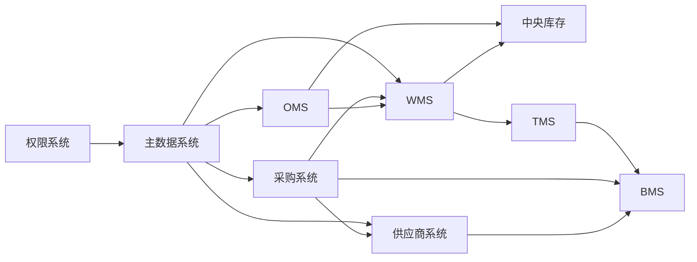

# 供应链系统开发总计划

## 1. 目的与使用方式

本计划是九个子系统的唯一实施节奏、交接和验收基线。后续任何模型或开发人员开始一个功能前，必须按本计划定位系统、迭代、接口、类和验收项；完成后必须更新 [02-开发日志.md](02-开发日志.md)。

### 1.1 事实来源优先级

1. `docs/03-核心业务模型/`：聚合、不变量、命令、事件、读模型。
2. `docs/04-子系统功能设计/`：页面、角色、功能权限和交互。
3. `docs/05-子系统数据库设计/`：表、枚举、索引、DDL。
4. `docs/06-子系统接口设计/`：HTTP/Dubbo 契约、错误码、调用位置。
5. `docs/07-子系统事件生产与消费/`：事件载荷、Outbox/Inbox、消费语义。
6. `docs/08-系统实现/`：分层实现逻辑、技术选型和运行约束。

冲突时不得自行猜测：在开发日志中登记“待决项”，以领域模型和业务流程为准修正文档后再编码。

### 1.2 统一技术与目录约定

| 项目 | 约定 |
| --- | --- |
| 后端 | Java 21、Spring Boot、Dubbo、MyBatis、RocketMQ、MySQL、Redis |
| 前端 | JavaScript、React；每个系统独立应用或独立模块 |
| 分层 | `interfaces`、`application`、`domain`、`infrastructure`；禁止 Controller 直接写 Mapper |
| 写模型 | `XxxAggregate`、值对象、`XxxRepository`、命令应用服务、Outbox |
| 读模型 | `XxxView`、`XxxReadModelPort`、查询应用服务、Mapper/投影表 |
| 集成 | 同步命令走 Dubbo/HTTP 防腐层；已发生事实走领域事件；所有入站事件走 Inbox，所有出站事件走 Outbox |
| 数据库 | 每个可部署服务独立 schema；Flyway 迁移按 `V{序号}__{说明}.sql`；枚举用整数并在代码/文档维护映射 |
| 可观测性 | `X-Request-Id`、`X-Trace-Id`、幂等键、操作审计、领域事件编码必须贯穿请求 |

### 1.3 每个功能切片的固定交付物

每一个 `[系统]-[聚合]-[用例]` 任务必须在同一 PR/提交中完成：

1. 命令/查询 DTO、接口层校验、功能权限与数据权限。
2. 应用服务：幂等、事务、聚合加载、领域调用、资源库保存、审计。
3. 领域层：聚合状态机、不变量、值对象、领域事件；不能把规则藏在 Controller/Mapper。
4. 基础设施：Repository、读模型、Flyway、Outbox/Inbox、外部客户端与重试/熔断。
5. 接口契约：请求头、请求/响应字段、错误码、分页、排序、调用方。
6. 测试：领域单元测试、应用服务测试、Web/API 测试；涉及并发/事件时增加幂等和版本冲突测试。
7. 文档和日志：更新接口/事件/DDL差异，写一条开发日志。

### 1.4 代码规范与注释门禁

- Java 一律按正常多行格式编写：一个 import/字段/方法逻辑块一行；禁止新增压缩成一行的类。
- Controller 只做协议转换、参数校验、响应封装；应用层编排；领域层不依赖 Spring、MyBatis、MQ 或 HTTP 类型。
- 注释解释业务原因、并发边界、补偿原因或外部兼容性，不重复描述代码字面动作。
- 聚合修改必须使用乐观锁版本；数量、金额、日期、状态必须由值对象或显式校验保护。
- 外部调用必须定义：幂等键、超时、重试、熔断、最终失败状态、人工补偿入口。
- 查询必须定义分页总数、数据范围、排序白名单；导出必须异步化或限流。

## 2. 实施总顺序与跨系统依赖



| 波次 | 目标 | 系统 | 完成门槛 |
| --- | --- | --- | --- |
| W0 | 平台底座 | 权限、主数据、公共组件 | 登录、数据权限、主数据发布订阅、Outbox/Inbox 可用 |
| W1 | 供给闭环 | 供应商、采购 | 准入、询报价、合同、采购订单、ASN 协同可用 |
| W2 | 仓配与库存闭环 | WMS、中央库存、TMS | 收货上架、预占/扣减、拣配出库、运输轨迹可用 |
| W3 | 订单与逆向闭环 | OMS、WMS、中央库存、TMS | 销售履约、售后、退供、调拨可用 |
| W4 | 结算闭环 | BMS、采购、TMS、供应商 | 费用来源、对账、账单、发票、财务交接可用 |
| W5 | 运营与治理 | 全系统 | 报表、对账、重放、告警、压测、容灾与上线演练通过 |

## 3. 系统开发计划
## 4. 接口与类实施包

本章是编码任务的最小粒度。编号顺序既是推荐实施顺序，也是开发日志中应引用的任务编号。类名是目标命名，允许按实际聚合微调，但不得省略职责。

### 4.0 接口级计划索引

下列文件是本计划的强制详细规格。每个接口使用独立小节，写清从接口层到基础设施层的调用链、事件、跨系统协作和验收。编码时不得只看本总表。

| 系统 | 接口级开发计划 | 实现资料 |
| --- | --- | --- |
| 供应商系统 | [01-供应商系统接口级开发计划](01-开发计划/01-供应商系统接口级开发计划.md) | `docs/08-系统实现/01-供应商系统实现/03-*` |
| 采购系统 | [02-采购系统接口级开发计划](01-开发计划/02-采购系统接口级开发计划.md) | `docs/08-系统实现/02-采购系统实现/03-*` |
| WMS 系统 | [03-WMS系统接口级开发计划](01-开发计划/03-WMS系统接口级开发计划.md) | `docs/08-系统实现/03-WMS系统实现/03-*` |
| 中央库存系统 | [04-中央库存系统接口级开发计划](01-开发计划/04-中央库存系统接口级开发计划.md) | `docs/08-系统实现/04-中央库存系统实现/03-*` |
| OMS 系统 | [05-OMS系统接口级开发计划](01-开发计划/05-OMS系统接口级开发计划.md) | `docs/08-系统实现/05-OMS系统实现/03-*` |
| TMS 系统 | [06-TMS系统接口级开发计划](01-开发计划/06-TMS系统接口级开发计划.md) | `docs/08-系统实现/06-TMS系统实现/03-*` |
| BMS 系统 | [07-BMS系统接口级开发计划](01-开发计划/07-BMS系统接口级开发计划.md) | `docs/08-系统实现/07-BMS系统实现/03-*` |
| 主数据系统 | [08-主数据系统接口级开发计划](01-开发计划/08-主数据系统接口级开发计划.md) | `docs/08-系统实现/08-主数据系统实现/03-*` |
| 权限系统 | [09-权限系统接口级开发计划](01-开发计划/09-权限系统接口级开发计划.md) | `docs/08-系统实现/09-权限系统实现/03-*` |

### 4.1 供应商系统接口与类实施包

| 包 | 接口族 | 接口层 | 应用/查询层 | 领域/基础设施层 | 消息与测试 |
| --- | --- | --- | --- | --- | --- |
| SUP-P01 工作台 | `GET /workbench/summary`、`GET /workbench/todos` | `SupplierWorkbenchController` | `SupplierWorkbenchQueryService`、`SupplierTodoQueryService` | `SupplierWorkbenchQueryMapper`、待办读模型 | 测试数据范围、空范围、分页总数、慢查询保护 |
| SUP-P02 档案变更 | `GET /profile`、`GET/POST /profile/change-requests`、`POST /withdraw` | `SupplierProfileController` | `SupplierProfileQueryService`、`SupplierProfileApplicationService` | `SupplierProfileAggregate`、`ProfileChangeAggregate`、`SupplierProfileRepository`、`MdmSupplierRpcClient` | 发布 `SupplierProfileChangeSubmitted/Withdrawn`；测试字段白名单、版本冲突、主数据降级 |
| SUP-P03 账号协同 | `GET /user-bindings`、详情、绑定/解绑/启停 | `SupplierUserBindingController` | `SupplierUserBindingQueryService`、`SupplierUserBindingApplicationService` | 用户绑定实体、`SupplierUserRepository`、`IamUserRpcClient` | 发布 `SupplierUserBound/Unbound/Disabled`；测试主账号唯一、最后管理员保护、IAM 失败待办 |
| SUP-P04 商品供货 | `/items` 列表/详情/维护/变更/暂停/恢复/历史 | `SupplierItemController` | `SupplierItemQueryService`、`SupplierItemApplicationService` | `SupplierItemAggregate`、`SupplyCondition`、`SupplierItemRepository`、价格快照投影 | 消费 SKU/供应商状态事件；测试资质品类规则、停供、条件历史、价格有效期 |
| SUP-P05 报价与合同 | `/quotes`、`/price-agreements`、`/contracts`、审批事件 | `SupplierQuoteController`、`SupplierContractController` | `SupplierQuoteApplicationService`、`PriceAgreementQueryService`、`SupplierContractApplicationService` | `SupplierQuoteAggregate`、`SupplierContractAggregate`、报价/合同资源库、协议投影 | 消费 RFQ/审批事件；测试截标、采纳、合同版本、有效价格、审批重复回调 |
| SUP-P06 PO/ASN | `/purchase-order-confirms`、`/asns`、打印 | `PoConfirmController`、`AsnController` | `PoConfirmApplicationService`、`AsnCommandApplicationService`、ASN 查询服务 | `PoConfirmAggregate`、`AsnAggregate`、行实体、WMS/TMS ACL | 消费 PO/WMS/TMS；测试订单变更重确认、ASN 行收货、预约/运输补偿 |
| SUP-P07 退供与质量 | `/supplier-returns`、`/quality-issues`、证据、整改 | `SupplierReturnController`、`SupplierQualityIssueController` | `SupplierReturnApplicationService`、`SupplierQualityIssueApplicationService` | 退供/质量聚合、证据资源库、库存/WMS/TMS/BMS ACL | 消费质量/退供事件；测试部分锁定、签收差异、索赔、整改超时 |
| SUP-P08 对账评分运营 | `/reconciliations`、`/invoices`、`/scores`、`/operations` | `SupplierFinanceController`、`SupplierScoreController`、`SupplierOperationsController` | 财务、评分、运营应用/查询服务 | 对账/评分读模型、规则投影、Outbox/Inbox/操作日志 | 消费 BMS/绩效事实；测试差异、重提发票、规则版本、周期评分、真实重放 |

### 4.2 采购系统接口与类实施包

| 包 | 接口族 | 接口层 | 应用/查询层 | 领域/基础设施层 | 消息与测试 |
| --- | --- | --- | --- | --- | --- |
| PUR-P01 工作台 | `/workbench/summary`、`/workbench/todos` | `PurchaseWorkbenchController` | `PurchaseWorkbenchQueryService`、`PurchaseTodoQueryService` | `PurchaseWorkbenchQueryMapper`、统一待办投影 | 测试采购组织/采购组/本人范围及分页 |
| PUR-P02 请购 | `GET/POST/PUT /requisitions`、`submit/approve/convert` | `PurchaseRequisitionController` | `PurchaseRequisitionApplicationService`、`PurchaseRequisitionQueryService` | `PurchaseRequisitionAggregate`、请购行、`PurchaseRequisitionRepository`、审批 ACL | 发布 `Created/Submitted/Approved/Rejected/Converted`；测试需求日期、批准数量、转 RFQ/PO 剩余数量 |
| PUR-P03 询价报价比价 | `/rfqs` 创建/发布/截标、`/quotes` 查询/确认、`/bid-comparisons` 生成/定标 | `RfqController`、`PurchaseQuoteController`、`BidComparisonController` | RFQ、报价、比价应用/查询服务 | `RfqAggregate`、`PurchaseQuoteAggregate`、`BidComparisonAggregate`、供应商 ACL | 发布 RFQ 事件，消费供应商报价；测试邀请范围、截标、同版本定标、报价乱序 |
| PUR-P04 采购价格 | `/purchase-prices` 查询/生效/失效 | `PurchasePriceController` | `PurchasePriceApplicationService`、`PurchasePriceQueryService` | `PurchasePriceAggregate`、`ContractPricePolicy`、供应商协议 ACL | 测试供应商/SKU/币种/有效期/MOQ 匹配和远程降级 |
| PUR-P05 采购订单 | `/purchase-orders` 创建/提交/审批/发布/取消/关闭 | `PurchaseOrderController` | `PurchaseOrderApplicationService`、`PurchaseOrderQueryService` | `PurchaseOrderAggregate`、订单行、`PurchaseOrderRepository` | 发布 `Released/Changed/Cancelled/Closed`；测试金额/数量/交期、发布幂等、取消限制 |
| PUR-P06 订单变更与确认 | `/purchase-order-changes`、`/supplier-confirmations` 差异接受/拒绝 | `PurchaseOrderChangeController`、`SupplierConfirmationController` | 变更、确认应用/查询服务 | `PurchaseOrderChangeAggregate`、确认读模型、供应商 ACL | 消费供应商确认；测试已发货订单不可直接变更、差异审批和重新确认 |
| PUR-P07 到货与退供 | `/inbound-trackings`、`/supplier-return-requests` | `InboundTrackingController`、`SupplierReturnRequestController` | 到货跟踪、退供申请服务 | `InboundTrackingAggregate`、`SupplierReturnRequestAggregate`、WMS/TMS/BMS 客户端 | 消费 WMS/TMS，发布退供执行命令；测试实收差异、退供数量、金额冲减引用 |

### 4.3 WMS 系统接口与类实施包

| 包 | 接口族 | 接口层 | 应用/查询层 | 领域/基础设施层 | 消息与测试 |
| --- | --- | --- | --- | --- | --- |
| WMS-P01 入库预约 | `/inbound-orders` 创建/取消/查询、`/appointments` | `InboundOrderController`、`InboundAppointmentOpenApiController` | `InboundOrderApplicationService`、查询服务 | `InboundOrderAggregate`、预约实体、入库资源库、采购/供应商 ACL | 消费 ASN/采购入库命令；发布预约确认；测试重复预约、取消、仓库范围 |
| WMS-P02 收货 | `/receipts` 列表、PDA 扫码、提交完成 | `ReceiptController`、`ReceiptPdaController` | `ReceivingApplicationService`、收货查询服务 | `ReceiptAggregate`、收货行、`ReceiptRepository`、条码解析器 | 发布 `WmsArrivalRegistered/WmsReceiptCompleted`；测试超收/短收、批次/效期、扫码幂等 |
| WMS-P03 质检上架 | `/quality-inspections`、`/putaway-tasks` PDA 上架 | `QualityInspectionController`、`PutawayTaskController` | `QualityInspectionApplicationService`、`PutawayApplicationService` | 质检/上架聚合、库位推荐领域服务、库位资源库 | 发布质检结果/上架完成；测试不合格区、抽检、库位容量、任务抢占 |
| WMS-P04 库内库存 | `/warehouse-stocks`、`/moves` | `WarehouseStockController` | `WarehouseStockApplicationService`、查询服务 | `WarehouseStockAggregate`、库存流水、中央库存 ACL | 发布入库/移库/冻结事实；测试批次、库存状态、库位、并发版本 |
| WMS-P05 出库波次拣配 | `/outbound-orders`、`/waves`、`/pick-tasks`、`/containers` | `OutboundOrderController`、`WaveController`、`PickTaskController`、`ContainerController` | 出库、波次、拣货、容器应用服务 | 出库/波次/拣货/容器聚合，分配与路径领域服务 | 消费 OMS 出库命令；测试库存分配、波次释放、容器绑定、少拣异常 |
| WMS-P06 复核发货盘点 | `/packing`、`/handover`、`/stocktakes`、`/exceptions` | `PackingController`、`ShipmentHandoverController`、`StocktakeController`、`WarehouseExceptionController` | 复核包装、交接、盘点、异常服务 | 对应聚合、面单/TMS/库存 ACL | 发布出库完成/盘点差异；测试复核差异、交接取消、盘点调整审批 |

### 4.4 中央库存系统接口与类实施包

| 包 | 接口族 | 接口层 | 应用/查询层 | 领域/基础设施层 | 消息与测试 |
| --- | --- | --- | --- | --- | --- |
| INV-P01 库存读模型 | `/stocks`、`/available-stocks`、`/stock-ledgers`、导出 | `InventoryQueryController` | `InventoryQueryService`、导出任务服务 | 余额/流水/快照 Mapper、缓存、导出读模型 | 测试仓/货主/SKU/批次范围、总数、排序白名单、导出限流 |
| INV-P02 预占 | `/reservations` 请求/释放/人工关闭 | `InventoryReservationController`、OpenAPI | `InventoryReservationApplicationService`、查询服务、过期任务 | `InventoryReservationAggregate`、库存账户资源库、幂等表 | 发布 `StockReserved/Released/Expired`；测试超卖、重复释放、过期释放、版本冲突 |
| INV-P03 冻结调整 | `/freezes`、`/adjustments` | `InventoryFreezeController`、`InventoryAdjustmentController` | 冻结、调整应用服务 | 冻结/调整聚合、审批 ACL、流水资源库 | 测试冻结可用量、双人审批、调整金额/数量原因、逆向流水 |
| INV-P04 快照对账 | `/snapshots`、`/inventory-reconciliations` | `InventorySnapshotController`、`InventoryReconciliationController` | 快照、对账、补偿服务 | 快照/对账聚合、WMS 账实适配器 | 消费 WMS 账务事件；测试重算幂等、差异确认、补偿不重复扣减 |
| INV-P05 WMS OpenAPI | 入库记账、出库扣减、盘点差异 | `WmsInventoryOpenApiController` | `WmsInventoryEventConsumer` | Inbox、库存账户聚合、Outbox | 测试来源系统鉴权、事件乱序、死信/人工重放 |

### 4.5 OMS 系统接口与类实施包

| 包 | 接口族 | 接口层 | 应用/查询层 | 领域/基础设施层 | 消息与测试 |
| --- | --- | --- | --- | --- | --- |
| OMS-P01 渠道与销售订单 | 渠道接入、`/sales-orders` 审核/取消/查询 | `ChannelOrderController`、`SalesOrderController` | 渠道解析、订单应用/查询服务 | `SalesOrderAggregate`、渠道订单实体、渠道 ACL、订单资源库 | 发布订单创建/审核/取消；测试渠道幂等、地址/价格/商品校验 |
| OMS-P02 审单履约 | `/review-results`、`/fulfillments` 分仓/换仓/拆分 | `OrderReviewController`、`FulfillmentController` | 审单、分仓、履约服务 | `FulfillmentAggregate`、分仓领域服务、库存/主数据 ACL | 测试分仓规则、履约拆分、换仓补偿、数据范围 |
| OMS-P03 预占出库 | 请求/释放库存、下发/取消/重推 WMS 出库 | `OmsInventoryController`、`OmsOutboundController` | 预占、出库应用服务 | 出库聚合、库存/WMS 客户端、命令 Outbox | 消费库存/WMS 事实；测试超时释放、WMS 失败重推、取消竞态 |
| OMS-P04 取消售后异常 | `/cancellations`、`/after-sales`、`/exceptions`、`/rules` | 对应 Controller | 取消、售后、异常、规则服务 | 取消申请/售后/规则聚合，退款、WMS、TMS ACL | 测试发货前后取消、退货数量、退款重试、异常关闭 |
| OMS-P05 外部查询 | 外部订单状态、履约轨迹、事件入口 | `OmsOpenApiController`、MQ Listener | 查询服务、事件消费者 | 订单投影、Inbox、轨迹读模型 | 测试外部鉴权、分页、事件版本、查询降级 |

### 4.6 TMS 系统接口与类实施包

| 包 | 接口族 | 接口层 | 应用/查询层 | 领域/基础设施层 | 消息与测试 |
| --- | --- | --- | --- | --- | --- |
| TMS-P01 运输任务 | `/transport-tasks` 创建/接单/查询 | `TransportTaskController`、OpenAPI | `TransportTaskApplicationService`、查询服务 | `TransportTaskAggregate`、运输计划领域服务、业务系统 ACL | 消费采购/OMS/WMS/退供命令；测试业务类型、拆单/合单、幂等建单 |
| TMS-P02 运单面单 | `/waybills` 创建/作废、`/labels` 生成/打印 | `WaybillController`、`ShippingLabelController` | 运单、面单服务 | `WaybillAggregate`、`ShippingLabelAggregate`、承运商客户端 | 发布运单创建；测试承运商超时、面单重复生成、作废限制 |
| TMS-P03 轨迹签收 | `/tracking` 同步/补录/查询、`/signatures` | `TrackingController`、`SignatureController` | 轨迹、签收服务 | `TrackingAggregate`、`SignatureAggregate`、对象存储端口 | 发布在途/到达/签收；测试轨迹去重、乱序、签收冲正、附件证据 |
| TMS-P04 异常费用 | `/transport-exceptions`、`/freight-sources`、承运商配置测试 | `TransportExceptionController`、`FreightSourceController` | 异常、费用来源、SLA 服务 | 异常/费用来源聚合、BMS ACL、承运商 ACL | 发布物流异常/费用来源；测试索赔、拒收、关闭、费用只推送一次 |
| TMS-P05 承运商回调 | 回调入口、通用事件入口 | `CarrierCallbackController`、MQ Listener | 回调解析服务、事件消费者 | Inbox、签名验签器、轨迹资源库 | 测试签名、重复回调、异常重试、死信重放 |

### 4.7 BMS 系统接口与类实施包

| 包 | 接口族 | 接口层 | 应用/查询层 | 领域/基础设施层 | 消息与测试 |
| --- | --- | --- | --- | --- | --- |
| BMS-P01 计费主数据 | `/billing-subjects`、`/billing-rules` | `BillingSubjectController`、`BillingRuleController` | 计费对象/规则服务 | 对象/规则聚合、计费领域服务、规则资源库 | 测试规则版本、阶梯、币种、适用范围和发布后不可改 |
| BMS-P02 费用来源明细 | `/charge-sources`、`/charges` 重算/作废 | `ChargeSourceController`、`ChargeDetailController` | 来源采集、费用计算、查询服务 | 来源/明细聚合、计算器、事件 Inbox/Outbox | 消费 TMS/WMS/采购/OMS；测试来源去重、重算、精度、作废反冲 |
| BMS-P03 调整对账账单 | `/charge-adjustments`、`/reconciliation-statements`、`/bills` | 调整、对账、账单 Controller | 调整/对账/账单服务 | 调整/对账单/账单聚合、供应商 ACL | 测试调整审批、差异处理、账单关闭前置条件、跨系统回执 |
| BMS-P04 发票财务 | `/invoices`、`/financial-handovers`、退款结算 | 发票、财务交接、退款 Controller | 发票、交接、退款服务 | 发票交接/财务交接聚合、ERP/税务 ACL | 测试发票金额税率、红冲、入账回调、重复退款结算 |
| BMS-P05 报表事件 | 结算汇总、日志、枚举、通用事件入口 | `BmsReportController`、MQ Listener | 报表查询、事件消费者 | 投影表、Inbox、导出任务 | 测试数据范围、报表对账、异步导出、失败重放 |

### 4.8 主数据系统接口与类实施包

| 包 | 接口族 | 接口层 | 应用/查询层 | 领域/基础设施层 | 消息与测试 |
| --- | --- | --- | --- | --- | --- |
| MDM-P01 类型模板编码 | `/master-data-types`、`/field-templates`、`/code-rules` | 类型、模板、编码 Controller | 对应应用/查询服务 | 类型/模板/编码规则聚合、编码生成器 | 测试模板版本、字段排序、停用、并发编码不重复 |
| MDM-P02 记录审核版本 | `/master-data-records`、审核/启停/版本查询 | `MasterDataRecordController`、`MasterDataApprovalController` | 记录、审核、版本服务 | 记录/版本聚合、校验领域服务、资源库 | 测试动态字段、SPU/SKU/仓库/供应商/客户/物流商类型、审核状态机 |
| MDM-P03 发布订阅 | 发布日志、订阅配置、发布回执 | `PublicationController`、`PublicationReceiptController` | 发布、回执、重试服务 | 发布订阅聚合、Outbox、订阅端点 ACL | 发布 `MasterDataPublished`；测试消费者版本、回执乱序、失败重试 |
| MDM-P04 导入质量 | 导入任务/模板/错误/导出/质量问题 | `ImportTaskController`、`DataQualityController` | 导入、质量、导出服务 | 导入/质量问题聚合、文件存储、异步任务 | 测试大文件、行级错误、幂等导入、回滚和权限 |
| MDM-P05 OpenAPI | 查询、校验、快照、通用事件入口 | `MasterDataOpenApiController`、MQ Listener | 快照查询、事件消费者 | 快照投影、Inbox、缓存 | 测试外部鉴权、缓存失效、数据版本和降级 |

### 4.9 权限系统接口与类实施包

| 包 | 接口族 | 接口层 | 应用/查询层 | 领域/基础设施层 | 消息与测试 |
| --- | --- | --- | --- | --- | --- |
| IAM-P01 登录会话 | `/auth/login`、`/refresh`、`/logout`、`/me` | `AuthController`、`CurrentUserController` | 登录、会话、权限快照服务 | `SessionTokenAggregate`、JWT 服务、Redis TokenCache、密码散列端口 | 测试密码失败锁定、刷新轮换、登出失效、缓存击穿 |
| IAM-P02 用户角色 | `/users`、`/roles`、角色用户、用户角色 | `UserController`、`RoleController` | 用户/角色应用和查询服务 | `UserAggregate`、`RoleAggregate`、资源库、审批 ACL | 发布用户/角色变更；测试启停锁定、重置密码、角色互斥、版本冲突 |
| IAM-P03 权限菜单应用 | `/permissions`、`/menus`、`/applications`、SSO | `PermissionController`、`MenuController`、`ApplicationController` | 权限、菜单、应用服务 | 权限点/应用聚合、资源绑定、SSO ACL | 测试菜单-按钮-接口映射、停用权限、SSO 回调签名 |
| IAM-P04 数据权限 | `/data-scopes`、范围解析/权限快照 | `DataScopeController`、OpenAPI | 数据权限应用/查询服务 | `DataScopeAggregate`、范围解析器、缓存投影 | 发布数据范围变更；测试组织/仓/货主/供应商/客户/单据归属组合 |
| IAM-P05 审批安全审计 | `/approval-instances`、`/operation-logs`、`/security-policies` | 审批、日志、安全策略 Controller | 审批、日志、安全策略服务 | 审批/日志/安全策略聚合、审计存储、风控端口 | 测试审批幂等、敏感审计、MFA/密码策略、风控事件消费 |

## 5. 每个接口实现的强制步骤

对上章任一写接口，按以下顺序提交代码，禁止跳步：

1. 在 `interfaces.web` 定义请求 DTO、Bean Validation、请求头校验和 Controller 方法；写接口强制 `X-Idempotency-Key`。
2. 在 `application.command` 定义 Command 和 `XxxApplicationService`；加载权限上下文、数据范围、事务和幂等记录。
3. 在 `domain.<aggregate>` 定义/更新聚合命令方法、值对象、不变量、状态转移和过去式领域事件。
4. 在 `infrastructure.persistence` 实现 Repository、Mapper、Flyway；写模型使用乐观锁，读模型单独 Mapper。
5. 在 `application.event` / `infrastructure.mq` 实现 Outbox 发布、Inbox 消费、失败记录、重放路由。
6. 需要远程协作时，在 `infrastructure.rpc` 放 ACL 客户端；在应用层写集成命令，不在聚合内 RPC。
7. 新增领域单测、应用服务测试、Web/API 测试；关键数量/金额/库存操作增加并发和幂等测试。
8. 更新 `docs/09-开发计划/02-开发日志.md`，记录新增/修改/删除和实际类名。

## 6. 统一接口与类清单模板

每个开发任务在日志中必须复制并填充此模板：

```markdown
### [SYS-XX] <功能名称>

- 领域上下文/聚合：
- 用户故事与不变量：
- 写接口：`METHOD /path`；权限；数据范围；幂等键；错误码。
- 读接口：`GET /path`；查询条件；排序；分页；数据范围。
- 同步依赖：Dubbo/HTTP 客户端、超时、熔断、降级、补偿。
- 生产事件：事件名、聚合版本、事件载荷、Outbox 表。
- 消费事件：来源、Inbox 幂等键、消费者类、失败重放。
- 接口层类：
- 应用层类：
- 领域层类：
- 基础设施类：
- Flyway/读模型：
- 测试类：领域/应用/API/并发/幂等。
- 验收结果：
```

## 7. Definition of Done

一个功能只有同时满足以下条件才可标记“完成”：

- 业务流程、状态机和不变量已实现且有测试。
- 写接口、读接口、权限、数据范围、审计完整。
- 表迁移、索引、枚举、读模型和数据回滚策略已审查。
- 事件通过 Outbox 发布；消费通过 Inbox 幂等，支持失败重试/死信/人工重放。
- 跨系统调用具备超时、重试、熔断、降级/补偿和对账入口。
- 单元、应用、API、并发/幂等测试通过；关键链路有集成测试。
- 设计文档、接口文档、事件文档和开发日志已更新。

## 8. 当前执行看板

- 2026-07-13 起新增缺口收口计划：[`03-今日开发计划-2026-07-13.md`](03-今日开发计划-2026-07-13.md)。
- 逐项状态看板：[`../../tasks/todo.md`](../../tasks/todo.md)。
- 总计划中的“首轮完成”仅表示仓库内代码切片覆盖；是否生产完成，以今日计划的任务状态、检查点和 Definition of Done 为准。

## 继续上下文

当前结论：九个系统已按依赖顺序、聚合和类级交付物拆分。
关键假设：后端服务按独立 schema/模块逐步拆分，现有供应商服务作为 W1 首个落地切片。
待决问题：各系统首个可部署服务的仓库边界与前端应用拆分方式需在 W0 前确认。
下一步：按本计划先建立公共模块、权限系统和主数据系统的代码骨架，并为每个完成切片登记开发日志。
