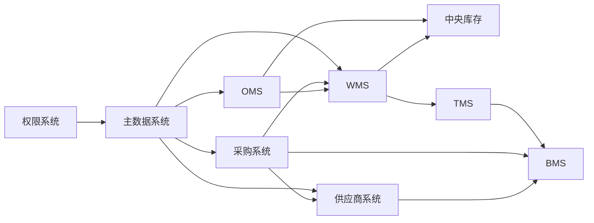

# 供应链系统开发总计划

## 1. 目的与使用方式

本计划是九个子系统的唯一实施节奏、交接和验收基线。后续任何模型或开发人员开始一个功能前，必须按本计划定位系统、迭代、接口、类和验收项；完成后必须更新 [02-开发日志.md](02-开发日志.md)。

### 1.1 事实来源优先级

1. `docs/03-核心业务模型/`：聚合、不变量、命令、事件、读模型。
2. `docs/04-子系统功能设计/`：页面、角色、功能权限和交互。
3. `docs/05-子系统数据库设计/`：表、枚举、索引、DDL。
4. `docs/06-子系统接口设计/`：HTTP/Dubbo 契约、错误码、调用位置。
5. `docs/07-子系统事件生产与消费/`：事件载荷、Outbox/Inbox、消费语义。
6. `docs/08-系统实现/`：分层实现逻辑、技术选型和运行约束。

冲突时不得自行猜测：在开发日志中登记“待决项”，以领域模型和业务流程为准修正文档后再编码。

### 1.2 统一技术与目录约定

| 项目 | 约定 |
| --- | --- |
| 后端 | Java 21、Spring Boot、Dubbo、MyBatis、RocketMQ、MySQL、Redis |
| 前端 | JavaScript、React；每个系统独立应用或独立模块 |
| 分层 | `interfaces`、`application`、`domain`、`infrastructure`；禁止 Controller 直接写 Mapper |
| 写模型 | `XxxAggregate`、值对象、`XxxRepository`、命令应用服务、Outbox |
| 读模型 | `XxxView`、`XxxReadModelPort`、查询应用服务、Mapper/投影表 |
| 集成 | 同步命令走 Dubbo/HTTP 防腐层；已发生事实走领域事件；所有入站事件走 Inbox，所有出站事件走 Outbox |
| 数据库 | 每个可部署服务独立 schema；Flyway 迁移按 `V{序号}__{说明}.sql`；枚举用整数并在代码/文档维护映射 |
| 可观测性 | `X-Request-Id`、`X-Trace-Id`、幂等键、操作审计、领域事件编码必须贯穿请求 |

### 1.3 每个功能切片的固定交付物

每一个 `[系统]-[聚合]-[用例]` 任务必须在同一 PR/提交中完成：

1. 命令/查询 DTO、接口层校验、功能权限与数据权限。
2. 应用服务：幂等、事务、聚合加载、领域调用、资源库保存、审计。
3. 领域层：聚合状态机、不变量、值对象、领域事件；不能把规则藏在 Controller/Mapper。
4. 基础设施：Repository、读模型、Flyway、Outbox/Inbox、外部客户端与重试/熔断。
5. 接口契约：请求头、请求/响应字段、错误码、分页、排序、调用方。
6. 测试：领域单元测试、应用服务测试、Web/API 测试；涉及并发/事件时增加幂等和版本冲突测试。
7. 文档和日志：更新接口/事件/DDL差异，写一条开发日志。

### 1.4 代码规范与注释门禁

- Java 一律按正常多行格式编写：一个 import/字段/方法逻辑块一行；禁止新增压缩成一行的类。
- Controller 只做协议转换、参数校验、响应封装；应用层编排；领域层不依赖 Spring、MyBatis、MQ 或 HTTP 类型。
- 注释解释业务原因、并发边界、补偿原因或外部兼容性，不重复描述代码字面动作。
- 聚合修改必须使用乐观锁版本；数量、金额、日期、状态必须由值对象或显式校验保护。
- 外部调用必须定义：幂等键、超时、重试、熔断、最终失败状态、人工补偿入口。
- 查询必须定义分页总数、数据范围、排序白名单；导出必须异步化或限流。

## 2. 实施总顺序与跨系统依赖



| 波次 | 目标 | 系统 | 完成门槛 |
| --- | --- | --- | --- |
| W0 | 平台底座 | 权限、主数据、公共组件 | 登录、数据权限、主数据发布订阅、Outbox/Inbox 可用 |
| W1 | 供给闭环 | 供应商、采购 | 准入、询报价、合同、采购订单、ASN 协同可用 |
| W2 | 仓配与库存闭环 | WMS、中央库存、TMS | 收货上架、预占/扣减、拣配出库、运输轨迹可用 |
| W3 | 订单与逆向闭环 | OMS、WMS、中央库存、TMS | 销售履约、售后、退供、调拨可用 |
| W4 | 结算闭环 | BMS、采购、TMS、供应商 | 费用来源、对账、账单、发票、财务交接可用 |
| W5 | 运营与治理 | 全系统 | 报表、对账、重放、告警、压测、容灾与上线演练通过 |

## 3. 系统开发计划

### 3.1 供应商系统

**范围来源**：`03/01-供应商领域模型`、`04/01-供应商系统`、`05/01-供应商系统数据库设计`、`06/01-供应商系统接口设计`、`07/01-供应商系统事件生产与消费设计`。

| 迭代 | 功能/聚合 | 接口与消息 | 必须实现的类 | 验收与测试 |
| --- | --- | --- | --- | --- |
| SUP-01 | 准入、档案、资质、联系人、账号绑定 | `POST/GET /admissions`、`/qualifications`、`/contacts`、`/bindings`；`SupplierAdmissionApproved`、主数据回执 | `SupplierAdmissionAggregate`、`SupplierProfileAggregate`、`SupplierQualificationAggregate`；`SupplierAdmissionApplicationService`、`SupplierAccessApplicationService`、`MasterDataCollaborationClient` | 准入通过后主数据建档；冻结/停用阻断供货、报价、合同、ASN；按供应商/品类规则校验资质；账号数据范围写回权限系统 |
| SUP-02 | 供应商商品与供货条件 | `/items`、条件历史、价格快照；`SupplierItemEnabled/Paused/Discontinued` | `SupplierItemAggregate`、`SupplyCondition`、`SupplierItemRepository`、`SupplierItemQueryService` | SKU/供应商停用自动暂停；条件历史不可覆盖；价格快照可按供应商+SKU+有效期查询 |
| SUP-03 | 报价、询价待办、价格协议 | `/quotes`、`/price-agreements`；消费 `RfqPublished/RfqBiddingClosed`；生产 `SupplierQuote*` | `SupplierQuoteAggregate`、`QuoteLine`、`SupplierQuoteApplicationService`、`RfqEventConsumer`、`PriceAgreementProjection` | 截标后拒绝提交；草稿可版本化修改；采纳报价后可查询有效价格 |
| SUP-04 | 合同与审批 | `/contracts`、审批回调/消息；`SupplierContract*` | `SupplierContractAggregate`、`SupplierContractRepository`、`ContractApprovalEventConsumer`、`ContractExpiryTask` | 合同版本和附件可追溯；审批幂等；生效后投影价格协议；失效阻断新引用 |
| SUP-05 | 采购履约协同 | 采购订单事件、ASN、WMS预约、TMS发运 | `PoConfirmAggregate`、`AsnAggregate`、`AsnCommandApplicationService`、`WmsAsnEventConsumer`、`TmsAsnEventConsumer` | 订单变更重确认；ASN 行级实收/质检；预约、运输命令有补偿和重试 |
| SUP-06 | 质量、退供、财务、评分、运营 | 质量/退供/对账/发票/评分接口；消费 WMS/TMS/BMS 事件 | `SupplierQualityIssueAggregate`、`SupplierReturnAggregate`、`SupplierScoreApplicationService`、`SupplierFinanceApplicationService`、`SupplierOperationsApplicationService` | 质量证据可追溯；退供锁定-出库-签收-结算闭环；评分可解释；失败事件能真实重放 |

### 3.2 采购系统

| 迭代 | 功能/聚合 | 接口与消息 | 必须实现的类 | 验收与测试 |
| --- | --- | --- | --- | --- |
| PUR-01 | 采购申请与审批 | `/purchase-requisitions`；`PurchaseRequisitionSubmitted/Approved` | `PurchaseRequisitionAggregate`、`PurchaseRequisitionApplicationService`、审批防腐层 | 预算/组织/申请状态不变量；重复提交幂等；审批回调乱序安全 |
| PUR-02 | 询价、报价收集、比价 | `/rfqs`、`/bid-comparisons`；`RfqPublished/RfqBiddingClosed` | `RfqAggregate`、`BidComparisonAggregate`、`SupplierQuoteAcl` | 合格供应商范围冻结；报价截止不可逆；比价结果可追溯 |
| PUR-03 | 采购价格与合同校验 | `/purchase-prices`、有效合同/价格查询 | `PurchasePriceAggregate`、`ContractPricePolicy`、供应商系统 Dubbo 客户端 | 下单时验证供应商、SKU、币种、有效期、MOQ；远程失败可降级为待人工确认 |
| PUR-04 | 采购订单、变更、取消、关闭 | `/purchase-orders`；`PurchaseOrderReleased/Changed/Cancelled/Closed` | `PurchaseOrderAggregate`、`PurchaseOrderChangeAggregate`、`PurchaseOrderApplicationService` | 行级数量/交期不变量；变更版本控制；事件能被供应商、WMS、BMS 幂等消费 |
| PUR-05 | 入库跟踪与退供申请 | `/inbound-tracking`、`/supplier-return-requests` | `InboundTrackingAggregate`、`SupplierReturnRequestAggregate`、WMS/TMS/BMS 客户端 | ASN、收货、质检、退供原因与应付冲减关联完整 |

### 3.3 WMS 系统

| 迭代 | 功能/聚合 | 接口与消息 | 必须实现的类 | 验收与测试 |
| --- | --- | --- | --- | --- |
| WMS-01 | 入库、预约、收货 | `/inbound-orders`、`/appointments`、`/receipts`；`WmsAppointmentConfirmed/WmsReceiptCompleted` | `InboundOrderAggregate`、`ReceiptAggregate`、`ReceivingApplicationService` | ASN 预约幂等；收货行实收/拒收不超通知；异常货转质检区 |
| WMS-02 | 质检与上架 | `/quality-inspections`、`/putaway-tasks` | `QualityInspectionAggregate`、`PutawayTaskAggregate`、`PutawayStrategyDomainService` | 合格/不合格库存分区；库位推荐可解释；任务领取防并发 |
| WMS-03 | 仓内库存与出库 | `/warehouse-stocks`、`/outbound-orders`、`/waves`、`/picks` | `WarehouseStockAggregate`、`OutboundOrderAggregate`、`WaveAggregate`、`PickTaskAggregate` | 分配、拣货、复核、包装、交接状态闭环；库存扣减仅由确认操作触发 |
| WMS-04 | 容器、盘点、异常 | `/containers`、`/stocktakes`、`/warehouse-exceptions` | `ContainerAggregate`、`StocktakePlanAggregate`、`WarehouseExceptionAggregate` | 容器流转可追踪；盘点差异走调整审批；异常有责任人和关闭条件 |

### 3.4 中央库存系统

| 迭代 | 功能/聚合 | 接口与消息 | 必须实现的类 | 验收与测试 |
| --- | --- | --- | --- | --- |
| INV-01 | 库存账户、流水、快照 | `/stocks`、`/stock-ledgers` | `InventoryAccountAggregate`、`InventoryLedger`、`InventoryRepository`、`InventoryQueryService` | 可用/预占/冻结/在途数量守恒；每次变化产生唯一流水；快照可重建 |
| INV-02 | 预占、确认扣减、释放 | `/reservations`；`StockReserved/Committed/Released` | `InventoryReservationAggregate`、`ReservationApplicationService`、过期任务 | 同一业务键幂等；超卖并发测试；取消/超时准确释放 |
| INV-03 | 冻结、调整与调拨 | `/freezes`、`/adjustments`、`/transfers` | `InventoryFreezeAggregate`、`InventoryAdjustmentAggregate`、`TransferDomainService` | 冻结不可出库；调整双人审批；调拨出入两侧最终一致并可对账 |
| INV-04 | 对账与异常补偿 | `/inventory-reconciliations`、差异处理接口 | `InventoryReconciliationAggregate`、`InventoryCompensationService` | WMS 账实差异可定位流水；重放不重复扣减；人工补偿有审计 |

### 3.5 OMS 系统

| 迭代 | 功能/聚合 | 接口与消息 | 必须实现的类 | 验收与测试 |
| --- | --- | --- | --- | --- |
| OMS-01 | 销售订单与规则 | `/sales-orders`、`/order-rules`；`SalesOrderCreated/Cancelled` | `SalesOrderAggregate`、`OmsRuleAggregate`、`OrderValidationService` | 地址、价格、商品、货主校验；订单状态不可逆规则明确 |
| OMS-02 | 履约、分仓、库存预占 | `/fulfillments`、库存命令/事件 | `FulfillmentAggregate`、`AllocationDomainService`、库存 ACL | 分仓结果可解释；预占失败进入待处理；取消联动释放 |
| OMS-03 | 出库、物流、签收 | `/outbound-requests`、TMS 命令；消费 WMS/TMS 事实 | `OmsOutboundAggregate`、`ShipmentProjection`、`DeliveryQueryService` | 出库请求幂等；运单与订单关系可追溯；签收/拒收状态正确回写 |
| OMS-04 | 取消与售后 | `/cancellations`、`/after-sales` | `CancellationRequestAggregate`、`AfterSalesAggregate`、退款/入库防腐层 | 发货前后取消策略不同；售后退货数量不超原发货；退款、入库、物流最终一致 |

### 3.6 TMS 系统

| 迭代 | 功能/聚合 | 接口与消息 | 必须实现的类 | 验收与测试 |
| --- | --- | --- | --- | --- |
| TMS-01 | 运输任务与运单 | `/transport-tasks`、`/waybills`；`TransportTaskCreated/WaybillAssigned` | `TransportTaskAggregate`、`WaybillAggregate`、`TransportPlanningService` | 采购入库、销售出库、退供、调拨均可建单；业务单据到运单唯一/可拆分规则明确 |
| TMS-02 | 面单、轨迹、签收 | `/labels`、`/tracking`、`/signatures` | `ShippingLabelAggregate`、`TrackingAggregate`、`SignatureAggregate` | 轨迹按事件幂等追加；签收差异有证据；轨迹延迟可识别 |
| TMS-03 | 物流异常与费用来源 | `/transport-exceptions`、`/freight-sources` | `TransportExceptionAggregate`、`FreightSourceAggregate`、`CarrierSlaService` | 丢失、破损、拒收可索赔；费用来源只发布一次；异常关闭需要责任结论 |

### 3.7 BMS 系统

| 迭代 | 功能/聚合 | 接口与消息 | 必须实现的类 | 验收与测试 |
| --- | --- | --- | --- | --- |
| BMS-01 | 计费对象与规则 | `/billing-subjects`、`/billing-rules` | `BillingSubjectAggregate`、`BillingRuleAggregate`、`ChargeCalculationDomainService` | 规则版本、适用范围、计费单位和阶梯规则可追溯 |
| BMS-02 | 费用来源、明细、调整 | `/charge-sources`、`/charges`、`/charge-adjustments` | `ChargeSourceAggregate`、`ChargeDetailAggregate`、`ChargeAdjustmentAggregate` | 来源事件幂等；金额精度一致；调整需审批且保留原金额 |
| BMS-03 | 对账单、账单、发票、财务交接 | `/reconciliation-statements`、`/bills`、`/invoices`、`/financial-handovers` | `ReconciliationStatementAggregate`、`BillAggregate`、`InvoiceHandoverAggregate`、`FinancialHandoverAggregate` | 对账差异闭环；发票校验和红冲；账单关闭前必须完成财务交接 |

### 3.8 主数据系统

| 迭代 | 功能/聚合 | 接口与消息 | 必须实现的类 | 验收与测试 |
| --- | --- | --- | --- | --- |
| MDM-01 | 类型、字段模板、编码规则 | `/master-data-types`、`/field-templates`、`/code-rules` | `MasterDataTypeAggregate`、`FieldTemplateAggregate`、`CodeRuleAggregate` | 模板变更版本化；编码并发不重复；字段校验可配置 |
| MDM-02 | 主数据记录与版本 | `/master-data-records`、版本查询 | `MasterDataRecordAggregate`、`MasterDataVersionAggregate`、`MasterDataValidationService` | SPU/SKU、供应商、仓库库位、客户货主、物流商均按类型治理；发布前质量校验 |
| MDM-03 | 发布订阅、导入、质量问题 | `/publications`、`/imports`、`/quality-issues`；`MasterDataPublished` | `PublicationAggregate`、`ImportTaskAggregate`、`DataQualityIssueAggregate` | 发布事件含版本；消费者乱序安全；导入可回滚/定位行错误 |

### 3.9 权限系统

| 迭代 | 功能/聚合 | 接口与消息 | 必须实现的类 | 验收与测试 |
| --- | --- | --- | --- | --- |
| IAM-01 | 应用、用户、角色、权限点 | `/applications`、`/users`、`/roles`、`/permissions` | `ApplicationAggregate`、`UserAggregate`、`RoleAggregate`、`PermissionAggregate` | 用户/角色/权限 CRUD；菜单、按钮、接口权限一一对应；权限变更可审计 |
| IAM-02 | 数据权限与会话 Token | `/data-scopes`、`/sessions`、登录/登出/刷新 Token | `DataScopeAggregate`、`SessionTokenAggregate`、`JwtTokenService`、`TokenCachePort` | 按组织、仓、货主、供应商、客户、单据归属过滤；Token 失效和刷新正确；缓存一致性测试 |
| IAM-03 | 审批、日志和安全策略 | `/approval-instances`、`/operation-logs`、`/security-policies` | `ApprovalInstanceAggregate`、`OperationLogAggregate`、`SecurityPolicyAggregate` | 审批回调幂等；敏感操作审计；登录失败、锁定、MFA/密码策略可配置 |

## 4. 统一接口与类清单模板

每个开发任务在日志中必须复制并填充此模板：

```markdown
### [SYS-XX] <功能名称>

- 领域上下文/聚合：
- 用户故事与不变量：
- 写接口：`METHOD /path`；权限；数据范围；幂等键；错误码。
- 读接口：`GET /path`；查询条件；排序；分页；数据范围。
- 同步依赖：Dubbo/HTTP 客户端、超时、熔断、降级、补偿。
- 生产事件：事件名、聚合版本、事件载荷、Outbox 表。
- 消费事件：来源、Inbox 幂等键、消费者类、失败重放。
- 接口层类：
- 应用层类：
- 领域层类：
- 基础设施类：
- Flyway/读模型：
- 测试类：领域/应用/API/并发/幂等。
- 验收结果：
```

## 5. Definition of Done

一个功能只有同时满足以下条件才可标记“完成”：

- 业务流程、状态机和不变量已实现且有测试。
- 写接口、读接口、权限、数据范围、审计完整。
- 表迁移、索引、枚举、读模型和数据回滚策略已审查。
- 事件通过 Outbox 发布；消费通过 Inbox 幂等，支持失败重试/死信/人工重放。
- 跨系统调用具备超时、重试、熔断、降级/补偿和对账入口。
- 单元、应用、API、并发/幂等测试通过；关键链路有集成测试。
- 设计文档、接口文档、事件文档和开发日志已更新。

## 继续上下文

当前结论：九个系统已按依赖顺序、聚合和类级交付物拆分。
关键假设：后端服务按独立 schema/模块逐步拆分，现有供应商服务作为 W1 首个落地切片。
待决问题：各系统首个可部署服务的仓库边界与前端应用拆分方式需在 W0 前确认。
下一步：按本计划先建立公共模块、权限系统和主数据系统的代码骨架，并为每个完成切片登记开发日志。
